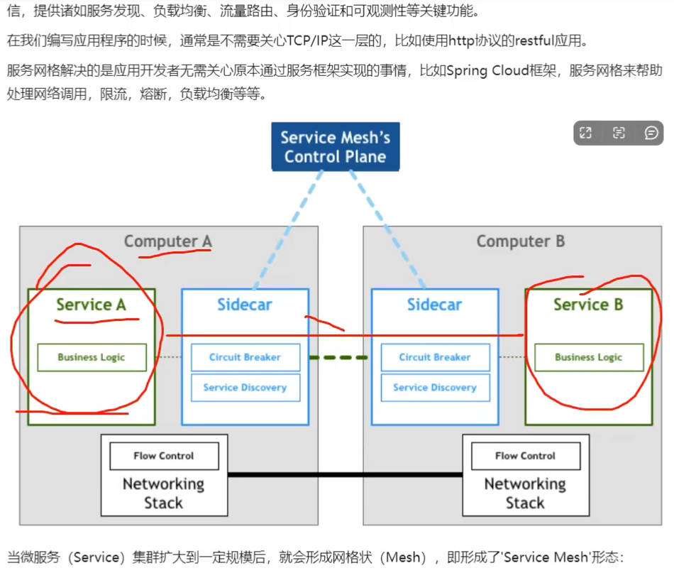
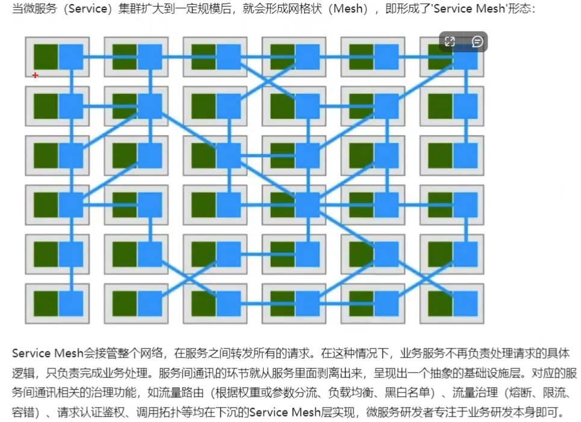
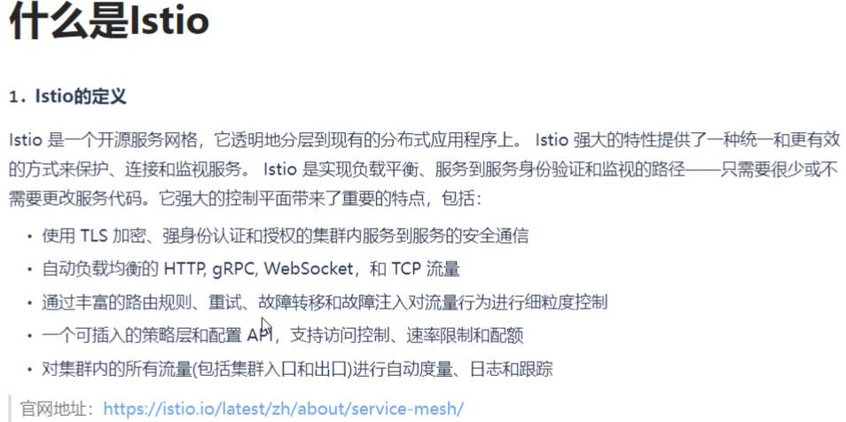
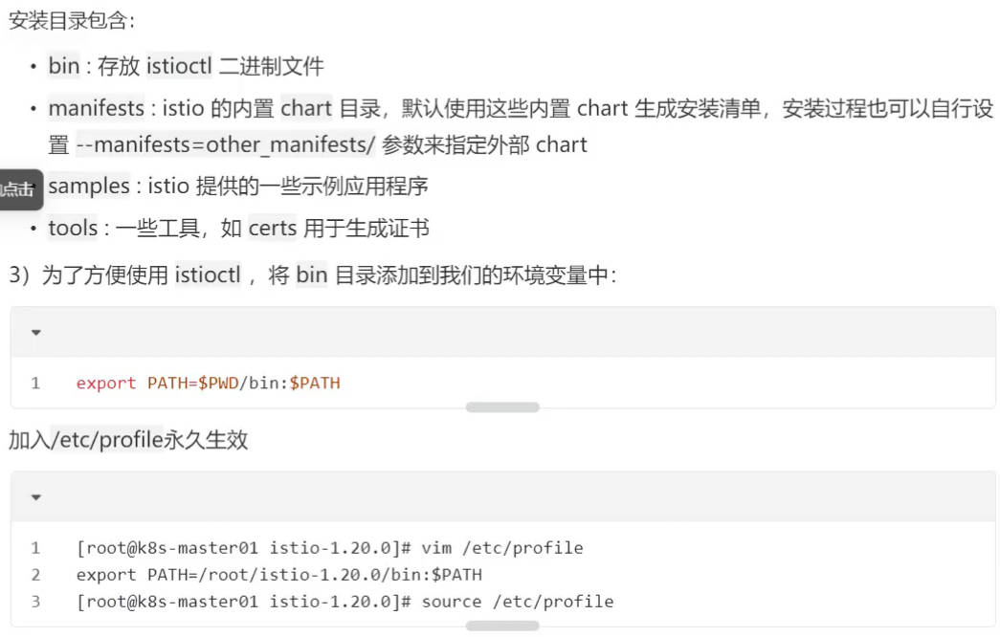
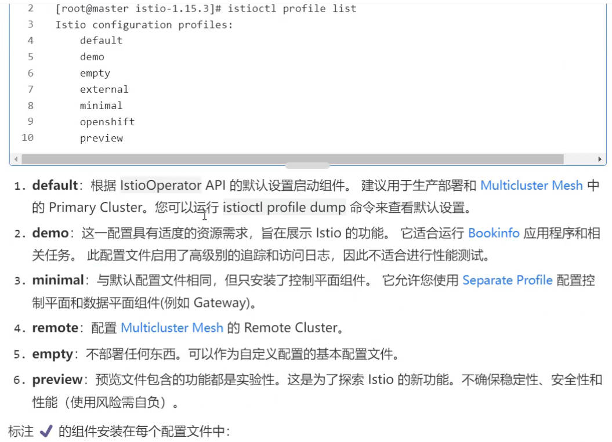
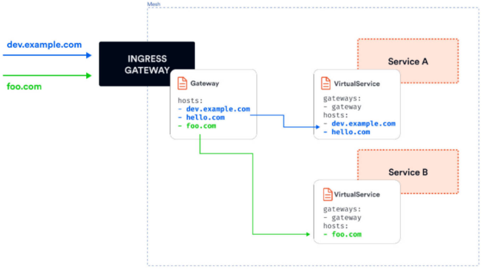
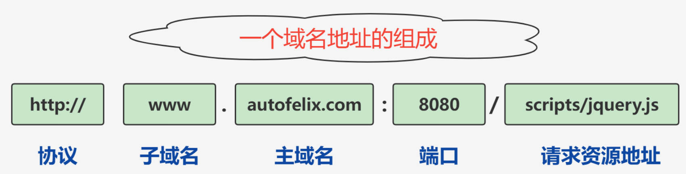
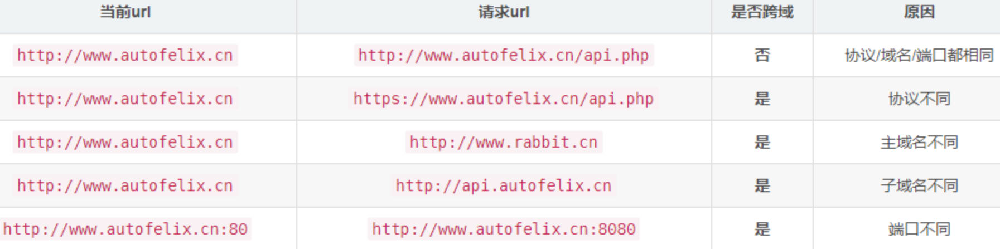

# 服务网格

下一代微服务架构： 服务网格

[微服务和服务网格架构](https://www.cnblogs.com/xishuai/p/microservices-and-service-mesh.html) 

[Service Mesh Platforms](https://www.trustradius.com/service-mesh)  [Istio vs Linkerd: The Best Service Mesh for 2023](https://imesh.ai/blog/istio-vs-linkerd-the-best-service-mesh-for-2023/) 

[什么是CNCF](https://www.yisu.com/zixun/562083.html)  [Graduated and Incubating Projects | CNCF](https://www.cncf.io/projects/)  

[阿里云架构讲解](https://www.bilibili.com/video/BV1ux4y1k7Gu/?spm_id_from=333.1007.tianma.2-2-5.click&vd_source=7346303e5e18677d7261c2c0c109ecfd) [drissionpage爬取](https://www.bilibili.com/video/BV1KW421P7KQ/?spm_id_from=333.1007.tianma.1-3-3.click&vd_source=7346303e5e18677d7261c2c0c109ecfd) [漏洞扫描工具](https://www.bilibili.com/video/BV1FC411W7jE/?spm_id_from=333.1007.tianma.1-1-1.click&vd_source=7346303e5e18677d7261c2c0c109ecfd)  [amass信息收集工具](https://www.bilibili.com/video/BV1nH4y157yS/?spm_id_from=333.1007.tianma.2-1-4.click&vd_source=7346303e5e18677d7261c2c0c109ecfd) 

[语雀_文档和知识库工具](https://www.yuque.com/u12222632/kuxubp/ouyp6uzcxomm3na0) [3种内网穿透](https://zhuanlan.zhihu.com/p/352853257)

服务网格：[Service Mesh](https://zhuanlan.zhihu.com/p/646763839) [云原生的关键技术](https://blog.51cto.com/u_6478076/8427202)  [微服务三种服务发现机制](https://blog.csdn.net/qq_32252957/article/details/90401716)    [服务网格技术优势及其运维局限](https://zhuanlan.zhihu.com/p/76229176) 

微服务通信方式：[微服务通信的三种方式RestTemplate、Feign远程调用与Dubbo远程调用](https://blog.csdn.net/c1390527393/article/details/132458803)  [spring cloud使用 openfegin 实现服务调用](https://blog.csdn.net/qq_21134059/article/details/121859680)  [openfeign](https://blog.csdn.net/liaomingwu/article/details/122118499)  [微服务调用方式](https://www.cnblogs.com/phoenixyouda/p/17871598.html)  [Feign 服务调用](https://ke.qq.com/course/2379247/9050724455697904#term_id=102482803)  [RPC框架远程调用](https://blog.51cto.com/u_16213370/9376495) [java微服务调用](https://blog.51cto.com/topic/2a81fe8a69edafe.html)  [微服务之RPC(远程过程调用)的四种方式](https://blog.csdn.net/m0_52071544/article/details/111321201)  [RPC 与 Restful API 区别](https://blog.csdn.net/wohu1104/article/details/120004719?utm_medium=distribute.pc_relevant.none-task-blog-2~default~baidujs_baidulandingword~default-0-120004719-blog-111321201.235^v43^pc_blog_bottom_relevance_base9&spm=1001.2101.3001.4242.1&utm_relevant_index=3) 

devops：[货拉拉应用架构演进](http://news.sohu.com/a/541493357_411876)  [Gdevops全球敏捷运维峰会](https://www.bagevent.com/event/8022600?bag_track=SOHU) 

**service mesh用来解决微服务之间的通信问题 **

服务网格是一个专用的基础架构层，==用于管理分布式应用程序中各个微服务之间的通信==。它充当透明且分散的代理网络，这些代理部署在应用服务旁边。这些代理通常被称为sidecar，它们处理服务之间的通信，提供诸如服务发现、负载均衡、流量路由、身份验证和可观测性等关键功能。

==服务网格是一个基础设施层，功能在于处理服务间通信==，职责是负责实现请求的可靠传递。在实践中，服务网格通常实现为轻量级网络代理，通常与应用程序部署在一起，但是对应用程序透明


|  |  |
| -------------------------------------------------------- | -------------------------------------------------------- |

# Istio

## 简介

**视频：** [图灵课堂istio](https://www.bilibili.com/video/BV1Pj411n71R?p=27&vd_source=7346303e5e18677d7261c2c0c109ecfd)  [Istio](https://www.bilibili.com/video/BV1mW4y1F7Wf/?vd_source=7346303e5e18677d7261c2c0c109ecfd)  [Istio安装](https://www.bilibili.com/video/BV1Hj411S7cX/?spm_id_from=333.337.search-card.all.click&vd_source=7346303e5e18677d7261c2c0c109ecfd)       [Istio](https://www.bilibili.com/video/BV1RY4y1g76t/?vd_source=7346303e5e18677d7261c2c0c109ecfd) 

[什么是 Istio](https://www.ibm.com/cn-zh/topics/istio)  [Istio官网](https://istio.io/latest/zh/)  [Istio版本支持](https://istio.io/latest/zh/docs/releases/supported-releases/)  [istio/istio: Connect, secure, control, and observe services.](https://github.com/istio/istio/) 

[x86_64/x64、amd64](https://blog.csdn.net/weixin_48345177/article/details/131595939)

[云原生Istio基本介绍](https://blog.csdn.net/ZGL_cyy/article/details/130467090)  [Istio](https://www.cnblogs.com/lidabo/p/16453818.html) [自建Kubernetes集群在Istio中部署Bookinfo应用](https://help.aliyun.com/zh/eci/use-cases/deploy-the-bookinfo-application-in-istio)  [代理神器proxychains](https://zhuanlan.zhihu.com/p/427655655)  [Istio源代码](https://blog.csdn.net/techdashen/article/details/132925436) 

FAQ:[istioctl安装超时](https://cloud.tencent.com/developer/ask/sof/440420) [istio](https://baijiahao.baidu.com/s?id=1764144114247192969&wfr=spider&for=pc) [安装Istio失败](https://q.cnblogs.com/q/133584) 

安装：[istio安装](https://blog.csdn.net/huningfei/article/details/126404868) [istioctl安装](https://blog.csdn.net/m0_49952522/article/details/128382876) [istio](https://blog.csdn.net/ma_jiang/article/details/115515055?spm=1001.2101.3001.6650.1&utm_medium=distribute.pc_relevant.none-task-blog-2~default~CTRLIST~Rate-1-115515055-blog-132459066.235^v43^pc_blog_bottom_relevance_base9&depth_1-utm_source=distribute.pc_relevant.none-task-blog-2~default~CTRLIST~Rate-1-115515055-blog-132459066.235^v43^pc_blog_bottom_relevance_base9&utm_relevant_index=2) [istio](https://blog.csdn.net/ajax_beijing_java/article/details/132459066) [istio](https://blog.csdn.net/shuaishuaila/article/details/126620857)  [Istio](https://www.cnblogs.com/renshengdezheli/p/16836404.html) [istio](https://blog.csdn.net/m0_49952522/article/details/128382876) [huaweicloud](https://support.huaweicloud.com/bulletin-asm/asm_bulletin_0003.html)  [Istio1.12](https://developer.aliyun.com/article/1381256) [Istio](https://zhuanlan.zhihu.com/p/420714087)  [Istio](https://developer.aliyun.com/article/1334377)  [istio](https://www.cnblogs.com/zhanchenjin/p/17318831.html)  [Istio](https://www.cnblogs.com/renshengdezheli/p/16836404.html) 

笔记：[微服务实践：Service Mesh](https://sq.sf.163.com/blog/article/375816037999161344)   [解读服务网格（Service Mesh）](https://zhuanlan.zhihu.com/p/646763839) 

[使用ebpf加速 Istio/Envoy网络](https://www.bilibili.com/video/BV1Xy4y1K7Nb/?vd_source=7346303e5e18677d7261c2c0c109ecfd)   [ebpf_百度搜索](https://www.baidu.com/s?ie=UTF-8&wd=ebpf)  [ebpf-linux ](https://zhuanlan.zhihu.com/p/627317059)  [Linux网络新技术基石——eBPF](https://mp.weixin.qq.com/s?__biz=MzA3NjY2NzY1MA==&mid=2649740393&idx=1&sn=b048e8e068052549af0c44cb678a7140) 

springcloud远程调用： [OpenFeign实现服务间调用](https://cloud.tencent.com/developer/article/2371890)	[springcloud_百度搜索](https://www.baidu.com/s?ie=UTF-8&wd=springcloud%20open)	[RPC 框架](https://cloud.tencent.com.cn/developer/article/2459050)	[RPC框架实现远程调用](https://blog.csdn.net/yuiezt/article/details/140190124)	

> 服务网格

服务网格是一个专用的==基础架构层, 解决微服务之间的通信问题==： 让微服务开发者只关注微服务开发（实现业务），服务调用封装到Sidecar（控制和数据平面）；

- 服务网格是一个专用的基础架构层，==用于管理分布式应用程序中各个微服务之间的通信==。它充当透明且分散的代理网络，这些代理部署在应用服务旁边。这些代理通常被称为==sidecar==，它们处理服务之间的通信，提供诸如服务发现、负载均衡、流量路由、身份验证和可观测性等关键功能

|                                                     |                                                         |
| -------------------------------------------------------- | ------------------------------------------------------------ |
|  |  |
|  |                                                         |

## **安装**

[k8s控制节点分多大内存](https://www.baidu.com/s?ie=UTF-8&wd=k8s%E6%8E%A7%E5%88%B6%E8%8A%82%E7%82%B9%E5%88%86%E5%A4%9A%E5%A4%A7%E5%86%85%E5%AD%98)  

dns污染：[failed to connect to raw.githubusercontent.com port 443: Connection refused](https://www.cnblogs.com/r1-12king/p/17380288.html)    [ Failed to connect to raw.githubusercontent.com port 443: Connection refused](https://blog.csdn.net/Jolting/article/details/125961694)  

```sh
# 为 kubelet 设置内存容量: kubelet 控制节点的内存容量是 2GB。这样 k8s 就可以更好地管理 Pod 对内存的使用，避免它们使用超出节点实际可用内存的资源
kubelet --memory-capacity=2G

# 下载
curl -L https://istio.io/downloadIstio | ISTIO_VERSION=1.16.7 TARGET_ARCH=amd64 sh
# 添加环境变量
cd /root/istio-1.16.7
export PATH=$PWD/bin:$PATH
vi /etc/profile
export PATH=/root/istio-1.16.7/bin:$PATH
source /etc/profile
# 安装
istioctl profile list
istioctl profile dump demo				#查看demo配置
istioctl install --set profile=demo -y

```

将 `bin` 目录加入环境变量: `/etc/profile`

`export PATH=/root/istio/istio-1.22.2/bin:$PATH`

```sh
# curl -L https://istio.io/downloadIstio | sh -

Next Steps:
See https://istio.io/latest/docs/setup/install/ to add Istio to your Kubernetes cluster.

To configure the istioctl client tool for your workstation,
add the /root/istio/istio-1.22.2/bin directory to your environment path variable with:
	 export PATH="$PATH:/root/istio/istio-1.22.2/bin"

Begin the Istio pre-installation check by running:
	 istioctl x precheck 

Need more information? Visit https://istio.io/latest/docs/setup/install/ 

```


```sh
# 镜像很难下载，没镜像istioctl install --set profile=demo -y会报错
ctr i pull docker.io/istio/pilot:1.22.2
ctr i pull  docker.io/istio/proxyv2:1.22.2


# istioctl profile list
istioctl install --set profile=demo -y
# 给命名空间添加标签，指示 istio 在部署应用时，自动注入 Envoy 边车代理
kubectl create ns fox
kubectl label namespace fox istio-injection=enabled

istioctl profile list
```

安装目录：

- bin：存放`istioctl` 二进制文件
- manifests：istio的内置 `chart` 目录，默认使用这些内置 `chart` 生成安装清单，也可以自行设置 `--manifests=other_manifests/` 参数来指定外部 `chart`
- samples： `istio` 提供的一些示例应用程序
- tools：一些工具，如 `certs` 用于生成证书

### 排错

[istio服务网格](https://www.cnblogs.com/zhanchenjin/p/17318831.html)  [istio学习之安装demo 中 bookinfo 遇到的问题 ](https://www.cnblogs.com/ScarecrowAnBird/p/14663528.html) 

istioctl install有一个最低内存要求，这是没有文档记录的，也是需要的。超时错误消息具有误导性。它应该显示内存不足。  安装在一个有5G内存的机器就可以了

## 命令

[Istio / istioctl](https://istio.io/latest/zh/docs/reference/commands/istioctl/) 

[ISTIOCTL命令行工具](https://cloud.tencent.com/developer/article/1468270) 

# Bookinfo示例

[Istio / Bookinfo 应用](https://istio.io/latest/zh/docs/examples/bookinfo/) 

```sh
# 任务清单
cat  /root/istio/istio-1.22.2/samples/bookinfo/platform/kube/bookinfo.yaml
kubectl apply -f   /root/istio/istio-1.22.2/samples/bookinfo/platform/kube/bookinfo.yaml   -n fox

# 测试 Bookinfo 应用是否正在运行
kubectl exec -n fox "$(kubectl get pod -n fox -l app=ratings -o jsonpath='{.items[0].metadata.name}')" -c ratings -- curl -sS productpage:9080/productpage | grep -o "<title>.*</title>"

## 或者直接进入容器测试
kubectl exec -n fox -it   ratings-v1-86bdf4c6c-8tlx7   -- sh
curl  productpage:9080/productpage | grep -o "<title>.*</title>"

kubectl get svc,pod -n fox
# 通过服务访问
curl 10.108.175.182:9080/productpage
# 问题：只能集群内部访问，下节介绍通过入口网关 或 ingress 访问
```

**问题： **只能集群内部访问，下节介绍通过入口网关 或 ingress 访问

## 从集群外部访问应用

ngress **Gateway:**  [Istio边界流量-Ingress Gateway](https://cloud.tencent.com/developer/article/2272210)    [Istio流量控制](https://cloud.tencent.com/developer/article/1764444) 

[Istio Gateway 与 Ingress 优缺点](https://www.bilibili.com/video/BV1yJ4m1K7uV/?vd_source=7346303e5e18677d7261c2c0c109ecfd)   [ Gateway API 介绍](https://www.bilibili.com/video/BV1294y157Cv/?vd_source=7346303e5e18677d7261c2c0c109ecfd)  [API Gateway vs Service Mesh ](https://www.cnblogs.com/kirito-c/p/12394038.html) 

[istio-ingressgateway ](https://cloud.tencent.com/developer/article/2345638)  

```sh
# 1.把服务类型ClusterIP改为NodePort
kubectl edit svc productpage -n fox
http://192.168.1.130:31003/productpage		# 外部访问： 通过服务访问

# 2.通过网关访问	vi /root/istio/istio-1.22.2/samples/bookinfo/networking/bookinfo-gateway.yaml

# 根据入口网关服务，找到对应的pod：  找入口网关：selector
kubectl get pod -n istio-system  --show-labels  |grep istio=ingressgateway
## 找入口网关：selector:  istio: ingressgateway  选择器选择，标签是istio，值是ingressgateway的 pod
## VirtualService， 网关把请求转发到virtualService， 向下转发到服务   
## 如果请求满足: hosts+match, 则请求去找 route 里配置的服务: productpage

kubectl apply -f  /root/istio/istio-1.22.2/samples/bookinfo/networking/bookinfo-gateway.yaml -n fox
kubectl get gw,vs -n fox
vi /etc/hosts				# 加入请求域名 192.168.1.130  testproductpage.bookinfo.com
systemctl restart network, netplan apply

kubectl get svc -n istio-system		# 查看80端口的映射端口, 流量先通过网关入口服务 istio-ingressgateway
curl testproductpage.bookinfo.com:31521/productpage		
http://testproductpage.bookinfo.com:31521/productpage	# 用的是http
```

## kiali查看拓扑图

[ Kiali 仪表板、 以及 Prometheus、 Grafana、 Jaeger](https://istio.io/latest/zh/docs/setup/getting-started/#dashboard) 

[Loki简介](https://cloud.tencent.com/developer/article/1997314) 

```sh
# 插件全部安装  istio-1.22.2/samples/addons/kiali.yaml
kubectl apply -f samples/addons/
kubectl edit service/kiali  -n istio-system		# 改NodePort

http://192.168.1.130:31010/
```

**用kiali灰度发布**： 改变每个版本的流量

services => reviews => actions里设置流量规则: Traffic Shifting, 设置reviews-v1为0，reviews-v3/v2各50%，这样v2和v3版本就平分流量

# ==流量管理==

[流量管理](https://chao-xi.github.io/jxistiobook/chap8/4Istio_net_control/)  [创建部署Gateway并使用网关暴露服务](https://www.cnblogs.com/renshengdezheli/p/16838966.html)   [使用服务网格Istio进行流量路由](https://www.cnblogs.com/renshengdezheli/p/16839175.html) 

[Istio 网关之南北向流量管理](https://blog.csdn.net/alisystemsoftware/article/details/106116402)    [istio-控制 Ingress 流量 （Gateway VirtualService）](https://www.cnblogs.com/fat-girl-spring/p/15162134.html) 

[Istio v1aplha3 routing API 介绍 ](https://cloud.tencent.com/developer/information/Istio%20v1aplha3%20routing%20API%20%E4%BB%8B%E7%BB%8D) 

## gateway路由实例

入口和出口网关：实际都运行了一个Envoy代理实例，ingress gateway、egress gateway出口网关

==1.**网关**==

```yaml
 apiVersion: networking.istio.io/v1alpha3
 kind: Gateway
 metadata:
   name: my-gateway
   namespace: default
 spec:
   selector:
     istio: ingressgateway
   servers:
   - port:
       number: 80
       name: http
       protocol: HTTP
     hosts:
     - dev.example.com
     - test.example.com
```

- 设置了一个代理，作为一个负载均衡器
- 为入口暴露 80 端口
- **网关配置被应用于 Istio 入口网关代理**，我们将其部署到 `istio-system` 命名空间，并设置了标签 `istio: ingressgateway`。通过网关资源，我们只能配置负载均衡器
- **`hosts` 字段作为一个过滤器，只有以 `dev.example.com` 和 `test.example.com` 为目的地的流量会被允许通过**

==2.**VirtualService**==

**进来的流量路由到哪个服务**： 为了控制和转发流量到集群内运行的实际 Kubernetes 服务，必须用特定的主机名（例如 `dev.example.com` 和 `test.example.com`）配置一个VirtualService，然后将网关连接到它。



## VirtualService详解

[Istio路由规则配置：VirtualService概念及HTTPRoute讲解](https://blog.csdn.net/WuYuChen20/article/details/105932193) 

使用vs资源在istio中进行流量路由，通过vs，定义流量路由规则，并在客户端连接到服务时应用这些规则

```yaml
# 路由规则
apiVersion: networking.istio.io/v1alpha3
kind: VirtualService
metadata:
  name: bookinfo
spec:
  hosts:
  - "testproductpage.bookinfo.com"
  gateways:
  - bookinfo-gateway
  http:
  - match:
    - uri:
        exact: /productpage
    - uri:
        prefix: /static
    - uri:
        exact: /login
    - uri:
        exact: /logout
    - uri:
        prefix: /api/v1/products
    route:
    - destination:
        host: productpage
        port:
          number: 9080
```


### route详解

### match

### 路由目标(RouteDestination)

流量路由到哪个service

### HTTP重定向(HTTPRedirect)

### HTTP重写(HTTPRewrite)

将==请求转发给目标服务==前， ==修改HTTP请求内容== ；  

重定向，用户是可见，HTTP重写对用户是不可见的，因为是在服务端进行的

### HTTP重试(HTTPRetry)

定义请求失败时的重试策略，重试策略包括==重试次数、超时、重试条件==等，三个字段： attempts、perTryTimeout、retryOn

### HTTP==流量镜像==(Mirrot)

将流量`转发`到原目标地址`的同时将流量`给另外一个目标地址`镜像一份`

### HTTP故障注入(HTTPFaultInject)

**模拟网络环境**： 测试时使用； 通过delay和abort两个字段设置延时和中止两种故障，分别表示Proxy延迟转发HTTP请求和中止HTTP请求

- 延迟故障：  发送请求前进行一段延时，模拟网络、远端服务负载均衡等各种原因导致的失败
- 请求中止故障： 模拟服务端异常，给调用的客户端返回预先定义的错误状态码

### HTTP跨域资源共享(CorsPolicy)

[什么是跨域](https://cloud.tencent.com/developer/news/918322)   [常见的六种跨域解决方案](https://www.cnblogs.com/mylqm/p/17653660.html) 

[详解跨域](https://blog.csdn.net/m0_68271787/article/details/135235718)  [跨域的原因以及解决方案](https://mp.weixin.qq.com/s?__biz=MzU0OTE4MzYzMw==&mid=2247489346&idx=4&sn=27c0969aed92224e5c3b293c64c463d2)  [什么是跨域](https://zhuanlan.zhihu.com/p/101963143)  [什么是跨域](https://blog.csdn.net/qq_34402069/article/details/124757399)  [什么是跨域](https://www.cnblogs.com/mochenxiya/p/16597545.html)   [什么是跨域](https://cloud.tencent.com/developer/article/2070976) 

**跨站点**： 当一个资源向该资源所在==服务器的不同的域==发起请求时，就会产生一个跨域的HTTP请求

- **域：** 是指浏览器不能执行其他网站的脚本
- **跨域：** 它是由浏览器的 **同源策略** 造成的,是浏览器对 `JavaScript` 实施的安全限制，所谓同源（即指在同一个域）就是两个页面具有相同的协议 `protocol`，主机 `host` 和端口号 `port` ， 否则就会造成 **跨域**

|  |  |
| -------------------------------------------------------- | -------------------------------------------------------- |

## DestinationRule

**目标规则** ：  virtualService中，路由目标对象destination中会包含Service子集的subset字段，这个服务子集就是通过DestinationRule定义的； 用来==配置目标子集==, 例如目标有v1、v2、v3版本

- 虚拟服务：  路由规则， 将流量如何路由到给定目标地址， 然后使用==目标规则==来配置该目标的流量

```yaml
# 定义了三个子集，v1和v2，v3，同时根据标签来决定哪个Pod需要包含在子集中
      
 kind: DestinationRule
apiVersion: networking.istio.io/v1
metadata:
  name: reviews
  namespace: fox
  uid: 3308e483-415a-4c20-89b8-f3e83f5cf99f
  resourceVersion: '131961'
  generation: 1
  creationTimestamp: '2024-06-29T12:06:19Z'
  labels:
    kiali_wizard: traffic_shifting
  managedFields:
  - manager: kiali
    operation: Update
    apiVersion: networking.istio.io/v1
    time: '2024-06-29T12:06:19Z'
    fieldsType: FieldsV1
    fieldsV1:
      f:metadata:
        f:labels:
          .: {}
          f:kiali_wizard: {}
      f:spec:
        .: {}
        f:host: {}
        f:subsets: {}
spec:
  host: reviews.fox.svc.cluster.local
  subsets:
  - name: v1
    labels:
      version: v1
  - name: v2
    labels:
      version: v2
  - name: v3
    labels:
      version: v3
status: {}
```

### 负载均衡器设置

通过负载均衡器设置，控制目的地使用哪种负载均衡算法

例如： 配置最大80个连接，只允许最多有800个并发请求，每个连接 的请求数不超过10个，连接超时是25毫秒

### 连接池配置

用来控制连接量

### 异常点检测

例如连接一个服务，10次都返回5xx错误，就把服务定义为错误，从负载均衡池中弹出

### TLS设置

配置安全证书

### 端口流量策略

**把流量策略作用在端口上面**

在==端口上配置流量策略==，且端口上流量策略会覆盖全局的流量策略。关于配置方法与TrafficPolicy没有大差别，一个关键的差别字段就是 port。

### 服务子集

Subset，定义服务的子集；  **把流量策略作用在子集上面**

## 实例

[Zipkin — 微服务链路跟踪](https://www.cnblogs.com/jmcui/p/10940372.html) 

### 基于权重的流量路由

### 基于请求属性的流量路由

# 安全

# 可观测性

# ==扩展性==


# SVN

[SVN快速上手视频](https://www.bilibili.com/video/BV1k4411m7mP/?spm_id_from=333.999.0.0&vd_source=7346303e5e18677d7261c2c0c109ecfd)  [SVN和Git的真相与误解](https://svnbucket.com/posts/svn-vs-git-difference/)  [Git合集 ](https://notes.xiyankt.com/#/其它/git) 

[SVN使用](https://www.bilibili.com/video/BV1Zb4y117Yu/?spm_id_from=333.337.search-card.all.click&vd_source=7346303e5e18677d7261c2c0c109ecfd) [SVN版本控制](https://www.bilibili.com/video/BV1xJ411s7Bc/?spm_id_from=333.337.search-card.all.click&vd_source=7346303e5e18677d7261c2c0c109ecfd)  [软件测试Jenkins+Maven+SVN集成框架](https://www.bilibili.com/video/BV17w411U7px/?spm_id_from=333.788.recommend_more_video.0&vd_source=7346303e5e18677d7261c2c0c109ecfd)

[廖雪峰git](https://www.liaoxuefeng.com/wiki/896043488029600/896202780297248)  [为什么Git没有取代SVN](https://blog.csdn.net/u013519551/article/details/52485487) [为什么游戏公司仍在坚持使用SVN](https://www.zhihu.com/question/590727955/answer/3005869656?utm_id=0) [使用git还是svn](https://blog.csdn.net/qq_26154135/article/details/100652388) 

# 软件开发趋势

[2024值得关注的15大软件开发趋势](https://zhuanlan.zhihu.com/p/677738093) [国外科技媒体](https://www.jianshu.com/p/07ad91692821) [MIT Technology Review](https://www.technologyreview.com/topic/computing/)  [2023年科技与IT行业最新前沿技术](https://www.bilibili.com/read/cv23004221/) [科技资讯](https://www.kejizhijia.net/zixun/wangluo) [2024 IT 行业发展](https://zhuanlan.zhihu.com/p/681454356) 

[什么是pwa](https://www.bilibili.com/video/BV1Da411R7Um/?spm_id_from=333.337.search-card.all.click&vd_source=7346303e5e18677d7261c2c0c109ecfd) [PWA？](https://blog.csdn.net/weixin_44135121/article/details/105528430) 

[Sphinx生成漂亮的在线文档](https://www.bilibili.com/video/BV16Q4y1w78m/?spm_id_from=333.999.0.0&vd_source=7346303e5e18677d7261c2c0c109ecfd)

```bash
Congratulations! You have just installed Kubernetes Dashboard in your cluster.

To access Dashboard run:
  kubectl -n kubernetes-dashboard port-forward svc/kubernetes-dashboard-kong-proxy 8443:443

NOTE: In case port-forward command does not work, make sure that kong service name is correct.
      Check the services in Kubernetes Dashboard namespace using:
        kubectl -n kubernetes-dashboard get svc

Dashboard will be available at:
  https://localhost:8443

```

[正则删空行](https://zhidao.baidu.com/question/627578628317519572.html)  [Notepad++ 过滤注释行和空行](https://www.cnblogs.com/withfeel/p/10796640.html)  [正则删空行](https://blog.csdn.net/stwood007/category_12074956.html) 


[清华](https://help.mirrors.cernet.edu.cn/virtualbox/)  [阿里](https://developer.aliyun.com/mirror/?spm=a2c6h.12873639.article-detail.7.573e4579q9pNeC&serviceType=mirror) [华为开源镜像站](https://mirrors.huaweicloud.com/home) [腾讯软件源](https://mirrors.tencent.com/)   [部署k8s集群可能会遇到的问题](https://blog.csdn.net/hjc121125/article/details/129380665)   [kubeadm init总是出现Port 10250 is in use](https://www.baidu.com/s?ie=UTF-8&wd=kubeadm%20init%E6%80%BB%E6%98%AF%E5%87%BA%E7%8E%B0Port%2010250%20is%20in%20use) 

[k8s init使用国内镜像](https://blog.csdn.net/weixin_43836063/article/details/137039793)  [阿里云镜像仓库](https://blog.csdn.net/weixin_43025151/article/details/135016619)  [kubeadm config images pull --image-repository 中国区镜像加速 ](https://www.cnblogs.com/xmc000/p/17147571.html) [kubeadm config images pull 拉取镜像失败的问题](https://blog.csdn.net/qq_40279964/article/details/125430992)

[kubeadm config images pull](https://www.baidu.com/s?ie=UTF-8&wd=kubeadm%20config%20images%20pull)  [基于Kubeadm方式的集群部署](https://developer.aliyun.com/article/931926)  [kubeadm init的超全问题解决](https://blog.csdn.net/weixin_52156647/article/details/129765134) 

[failed to load kubelet config file](https://www.baidu.com/s?ie=UTF-8&wd=%22command%20failed%22%20err=%22failed%20to%20load%20kubelet%20config%20file,%20path%3A%20/var/lib/kubelet/config.yaml,%20error%3A%20failed%20to%20load%20Kubelet%20config)  

[k8s解决node节点一直处于NotReady](https://blog.csdn.net/Myx74270512/article/details/130525568)  [k8s-release-robot](https://github.com/k8s-release-robot/release)   [K8S部署工具：KubeOperator集群规划](https://blog.csdn.net/a772304419/article/details/119668211)  

[OPSaid系统学k8s](https://opsaid.net/docs/deploy-k8s/binary/)  [离线部署K8s V1.29.1](https://www.cnblogs.com/love-DanDan/p/17993619)   [Customize the kubeadm image repository](https://itnext.io/customize-the-kubeadm-image-repository-c33ebdef7d82)  

[Download Kubernetes 需要的文件](https://kubernetes.io/releases/download/#container-image-architectures)  [Download Kubernetes](https://www.downloadkubernetes.com/) [Centos8之更换DNF源](https://blog.csdn.net/carefree2005/article/details/134942256)  [修改dnf镜像](https://www.baidu.com/s?ie=utf-8&f=8&rsv_bp=1&tn=baidu&wd=%E4%BF%AE%E6%94%B9dnf%E9%95%9C%E5%83%8F&rn=20&oq=%25E4%25BF%25AE%25E6%2594%25B9dnf%25E7%2594%25A8%25E7%259A%2584%25E4%25BB%2593%25E5%25BA%2593&rsv_pq=fe855dd60014cc03&rsv_t=9515CTcr5GGMuHxY3%2FaXUeW8NqXvskkLs7tbtO8rSVMUWbBzcOQE%2BGwtHsk&rqlang=cn&rsv_enter=1&rsv_dl=tb&rsv_btype=t&inputT=8897&rsv_sug3=38&rsv_sug1=43&rsv_sug7=100&rsv_sug2=0&rsv_sug4=11421)  

[lework/kainstall使用shell脚本基于kubeadmin一键安装kubernetes 高可用集群和addon组件](https://github.com/lework/kainstall)  

[journalctl 查看日志 ](https://www.cnblogs.com/nuo0903/p/14333704.html)   [检查cgroup v2是否安装](https://blog.51cto.com/rongfengliang/3124551)  [Control Group v2 ](https://zhuanlan.zhihu.com/p/637248596)  [Control Group v2](https://www.cnblogs.com/pengdonglin137/p/17875981.html)  [cgroup原理](https://www.zhihu.com/question/266738525/answer/3121637441)  [浅谈Cgroups V2](https://www.infoq.cn/article/hbqQFEYQxZHNEs5jIPqT)   [Grub command启动原理](https://zhuanlan.zhihu.com/p/412008178)  [centos7安装及基本配置](https://www.cnblogs.com/zhongbao/p/16898928.html) [centos删除swap分区重启后无法进入系统](https://blog.csdn.net/chinazzb/article/details/105495003) 

[kubelet第一次启动时没有证书如何连接 apiserver](https://blog.csdn.net/Michaelwubo/article/details/113769391)  

主节点不需要kubelet，但还是装上； kubeadm 集群初始化工具

容器运行时接口（CRI）： 容器运行时部署于 K8s 集群的 work 节点上，以使得 Pod 可以正常运行；  可以通过 CRI 来实现 K8s 来集成不同的容器组件

CGroup 是 Linux 的一个底层技术，用于==限制分配给系统进程的资源==； CGroup 驱动有两种：cgroupfs、systemd

检查内核版本是否支持cgroup v2：`grep cgroup /proc/filesystems， `； 通过文件系统挂载方式：`mkdir /opt/dalong-cgroupv2， mount -t cgroup2 none /opt/dalong-cgroupv2`

```sh
stat -fc %T /sys/fs/cgroup/		# 查看cgroup 版本

# 开启 cgroup v2，   /etc/default/grub
# GRUB_CMDLINE_LINUX="rd.lvm.lv=centos/root rd.lvm.lv=centos/swap biosdevname=0 net.ifnames=0 rhgb quiet" 
GRUB_CMDLINE_LINUX_DEFAULT="systemd.unified_cgroup_hierarchy=yes cgroup_no_v1=allows"

grub2-mkconfig -o /boot/grub2/grub.cfg
grub-mkconfig -o /boot/grub/grub.cfg	# 错误的命令，grub下没有grub.cfg

mount | grep cgroup
```

[systemd用来启动守护进程](https://blog.51cto.com/u_14191/9737717)


[selinux能干什么](https://blog.csdn.net/qq_31093329/article/details/108024216)  [selinux:runtime disable is not supported,](https://www.baidu.com/s?wd=selinux%3Aruntime%20disable%20is%20not%20supported%2Cuse%20selinux&rsv_spt=1&rsv_iqid=0xc8fe07e80014844b&issp=1&f=8&rsv_bp=1&rsv_idx=2&ie=utf-8&tn=baiduhome_pg&rsv_enter=1&rsv_dl=ib&rsv_sug3=56&rsv_sug1=16&rsv_sug7=101)  

`/etc/selinux/config,  sestatus 当前状态`


[ K8s启用 Feature Gates](https://devpress.csdn.net/k8s/62ffc1fb7e66823466194c3a.html)   [K8S找不到文件kubelet.conf_kubeadm init初始化之前不会有](https://blog.csdn.net/Abraxs/article/details/130469236)

[精品：Set Kubelet Parameters Via A Configuration File](https://kubernetes.io/docs/tasks/administer-cluster/kubelet-config-file/#viewing-the-kubelet-configuration)  

[centos中DRBD](https://blog.51cto.com/u_16099298/10249798)   [centos启动dbus服务](https://www.volcengine.com/theme/2397261-C-7-1)

[Index of /pub/linux/utils/util-linux/v2.40/](https://mirrors.edge.kernel.org/pub/linux/utils/util-linux/v2.40/)  [mirror.ihep.ac.cn](http://mirror.ihep.ac.cn/cern/centos/7.1.1503/updates/x86_64/repoview/system_environment.base.group.html) 

构建：[ meson](https://github.com/mesonbuild/meson/issues/10336)   [kubernetes 集群安装加载 br_netfilter 模块](https://blog.csdn.net/cainiaoxiaozhou/article/details/132731602) 

systemd：[Centos升级systemd](https://cloud.tencent.com/developer/article/1827714)  [升级systemd 247](https://www.baidu.com/s?ie=utf-8&f=8&rsv_bp=1&tn=baidu&wd=%E5%8D%87%E7%BA%A7systemd%20247&rn=20&oq=%25E5%258D%2587%25E7%25BA%25A7systemd%25202%2526lt%253B4&rsv_pq=87a7b7f000f79b11&rsv_t=508bazWTtSmc3cvOAcPnvTHoygw9Qu%2FpgTV%2BuFuO49rFlsPpoZrJEL2lXi8&rqlang=cn&rsv_enter=1&rsv_dl=tb&rsv_sug3=4&rsv_sug1=4&rsv_sug7=100&rsv_sug2=0&rsv_btype=t&inputT=1539&rsv_sug4=2505)  [systemd/systemd: 官方](https://github.com/systemd/systemd) 

cgroup v2:[Centos7升级cgroup v2](https://blog.csdn.net/qq_36006156/article/details/127084703)  [can't enable unified cgroup hierarchy on centos 7](https://github.com/systemd/systemd/issues/19760)   [runc/docs/cgroup-v2.官方](https://github.com/opencontainers/runc/blob/main/docs/cgroup-v2.md) [ cgroup v2 | Kubernetes](https://kubernetes.io/zh-cn/docs/concepts/architecture/cgroups/)   [cgroup v2使用与测试](https://blog.csdn.net/include_IT_dog/article/details/127183601)  [临时或永久修改cgroup](https://blog.csdn.net/u011436427/article/details/125706536) [cgroup v2使用与测试](https://blog.51cto.com/u_15682248/5736034) [systemd 开启cgroup v2 system启动](https://blog.51cto.com/u_14191/9737717)   [如何在centos7.2中设置kubelet的cgroup驱动](https://cloud.tencent.com/developer/ask/sof/106094501)  

容器运行时：[容器运行时 | Kubernetes](https://kubernetes.io/zh-cn/docs/setup/production-environment/container-runtimes/)  [用CRI-O运行时](https://zhuanlan.zhihu.com/p/402497610)  [CGroup/CRI 的优劣势](https://blog.csdn.net/IT_ZRS/article/details/127533610) [cri-o cgroup-driver](https://www.baidu.com/s?ie=UTF-8&wd=cri-o%20cgroup-driver)  [cri-o/packaging: CRI-O deb and rpm packages.](https://github.com/cri-o/packaging)   [CRI-O cgroupdriver](https://www.baidu.com/s?ie=utf-8&f=8&rsv_bp=1&tn=baidu&wd=CRI-O%20cgroupdriver&rn=20&oq=%2526lt%253BRI-O&rsv_pq=a0d11d0900657c0b&rsv_t=74a2%2FOcSt%2BAx4oWHQoEX%2FpCDcRHqfWtwCKpC1QpdILiDa62OLlIVgMw6240&rqlang=cn&rsv_enter=0&rsv_dl=tb&rsv_sug3=3&rsv_sug1=2&rsv_sug7=100&rsv_n=2&rsv_btype=t&inputT=2323&rsv_sug4=3050)  

kubeadm：[安装 kubeadm](https://kubernetes.io/zh-cn/docs/setup/production-environment/tools/kubeadm/install-kubeadm/)  [使用 kubeadm API 定制组件](https://kubernetes.io/zh-cn/docs/setup/production-environment/tools/kubeadm/control-plane-flags/)  [ k8s.io/kubelet/config/v1beta1](https://pkg.go.dev/k8s.io/kubelet/config/v1beta1#KubeletConfiguration)  [kubeadm 配置（v1beta3）](https://kubernetes.io/zh-cn/docs/reference/config-api/kubeadm-config.v1beta3/#kubeadm-k8s-io-v1beta3-ClusterConfiguration)    [修改kubeadm init](https://www.baidu.com/s?ie=utf-8&f=8&rsv_bp=1&tn=baidu&wd=%E4%BF%AE%E6%94%B9kubeadm%20init&rn=20&oq=kubeadm%2520init%2520image-repository%25E6%2580%258E%25E4%25B9%2588%25E5%2586%2599%25E5%2588%25B0yaml&rsv_pq=a9248b0c00a1c060&rsv_t=b06e%2BpykH3vFWnR6HZUPmqeCzeexpg%2FrXlErIilvKaFtKQR14IgFps8u71w&rqlang=cn&rsv_enter=1&rsv_dl=tb&rsv_sug3=8&rsv_sug1=4&rsv_sug7=100&rsv_sug2=0&rsv_btype=t&inputT=17102&rsv_sug4=18174)   [kubeadm.k8s.io/v1beta3配置文件](https://www.baidu.com/s?ie=utf-8&f=8&rsv_bp=1&tn=baidu&wd=kubeadm.k8s.io%2Fv1beta3%E9%85%8D%E7%BD%AE%E6%96%87%E4%BB%B6&rn=20&oq=kubeadm.k8s.io%252Fv1beta%2526lt%253B&rsv_pq=de695e1b0095acf7&rsv_t=a48ei39zkKoNI6E%2FrtBWfmEhCZmBYtIuFYp453vKqKvmgZRLPgDRgvDXjwM&rqlang=cn&rsv_enter=1&rsv_dl=tb&rsv_btype=t&inputT=36750&rsv_sug3=21&rsv_sug1=10&rsv_sug7=100&rsv_sug2=0&rsv_sug4=36751)   [K8S 1.27.1版本初始化配置文件](https://www.cnblogs.com/zbhlinux/p/17620598.html)

[kubeadm init](https://kubernetes.io/docs/reference/setup-tools/kubeadm/kubeadm-init/)   [ Kubelet Parameters Via A Configuration File](https://kubernetes.io/docs/tasks/administer-cluster/kubelet-config-file/#viewing-the-kubelet-configuration)  

kubelet：[通过配置文件设置 kubelet 参数](https://kubernetes.io/zh-cn/docs/tasks/administer-cluster/kubelet-config-file/)  [Kubelet Configuration (v1beta1) ](https://kubernetes.io/docs/reference/config-api/kubelet-config.v1beta1/) [Configuring each kubelet in your cluster using kubeadm ](https://kubernetes.io/docs/setup/production-environment/tools/kubeadm/kubelet-integration/#configure-kubelets-using-kubeadm)  [kubelet 设置 cgroup 驱动](https://www.baidu.com/s?ie=UTF-8&wd=kubelet%20%E8%AE%BE%E7%BD%AE%20cgroup%20%E9%A9%B1%E5%8A%A8) 

[ kubelet启动失败](https://blog.csdn.net/longway111/article/details/132093697) 

部署k8s： [kubeadm部署k8s v1.23.16](https://www.cnblogs.com/deny/p/16745470.html)  [基于kubeadm安装1.30版本k8s](https://blog.csdn.net/m0_67019144/article/details/138046111)  [通过cri-o部署k8s](https://blog.csdn.net/weixin_64334766/article/details/133687425)  [CentOS 7.5 通过kubeadm部署k8s-1.15.0](https://www.cnblogs.com/wzxmt/p/11160256.html) 

[container-selinux](https://www.baidu.com/s?ie=utf-8&f=8&rsv_bp=1&tn=baidu&wd=container-selinux%E9%9C%80%E8%A6%81%E5%BC%80%E5%90%AFselinux&rn=20&oq=container-selinux&rsv_pq=eb4508af0015af81&rsv_t=4f95ZZV3%2Ff27eLV83DFsWK1yF1vsqTuEFoyJ6Ebw6HnNzX8iW3NOaheS6eE&rqlang=cn&rsv_enter=1&rsv_dl=tb&rsv_sug3=17&rsv_sug1=11&rsv_sug7=100&rsv_sug2=0&rsv_btype=t&inputT=14070&rsv_sug4=14824) 

# 其它

[Codemap源代码阅读器，代码可视化](https://www.bilibili.com/video/BV18cgTeQE8L/?vd_source=7346303e5e18677d7261c2c0c109ecfd)  [读源码直接起飞](https://www.bilibili.com/video/BV1VAnTeXEhX/?spm_id_from=333.788.recommend_more_video.-1&vd_source=7346303e5e18677d7261c2c0c109ecfd)  

[cBrain：个人知识管理规范](https://www.bilibili.com/video/BV1n7421d7Ko/?vd_source=7346303e5e18677d7261c2c0c109ecfd) 

[URI和URL](https://www.cnblogs.com/lijianxuan/p/10460578.html)  [URL和URI详解](https://blog.csdn.net/mingyuli/article/details/116268527) 