#  K8S

[Kubernetes视频](https://www.bilibili.com/video/BV1Tg411P7EB?p=1&vd_source=7346303e5e18677d7261c2c0c109ecfd) [K8S笔记-易文档](https://k8s.easydoc.net/docs/dRiQjyTY/28366845/6GiNOzyZ/9EX8Cp45)   [Kubernetes官方文档 ](https://kubernetes.io/zh-cn/docs/concepts/overview/components/) [精品：云原生技术社](https://space.bilibili.com/1683316278/video?tid=0&pn=1&keyword=&order=pubdate) [云原生全套教程](https://www.bilibili.com/video/BV1LB4y1D7aw/?spm_id_from=333.999.0.0&vd_source=7346303e5e18677d7261c2c0c109ecfd)  [欧珀瑞逊视频](https://space.bilibili.com/1244411934/video?tid=0&pn=1&keyword=&order=pubdate) 

[尚硅谷 k8s](https://notes.xiyankt.com/#/k8s/k8s)    [基于Docker和K8s实现企业级DevOps实战](https://www.bilibili.com/video/BV1Mm4y1B7qu/?spm_id_from=333.999.0.0&vd_source=7346303e5e18677d7261c2c0c109ecfd)

[ k8s 容器运行时演进](https://cloud.tencent.com/developer/article/1800553?areaSource=102001.20&traceId=6oPauCASGQ4XjzXcphmKr) [容器运行时与k8s](https://zhuanlan.zhihu.com/p/588174967?utm_id=0)  [ CRI，OCI，容器运行时，Pod 之间的关系](https://www.niftyadmin.cn/n/4989739.html?action=onClick)  

[ContainerCreating解决方法](https://blog.csdn.net/liumiaocn/article/details/103320426/)

[Kubernetes 组件](https://kubernetes.io/zh-cn/docs/concepts/overview/components/#node-components)  [minikube](https://minikube.sigs.k8s.io/docs/start/) 

要看：[Helm](https://k8s.easydoc.net/docs/dRiQjyTY/28366845/6GiNOzyZ/3iQiyInr)  [华为DevOps](https://www.bilibili.com/video/BV1rx4y1D7wR/?spm_id_from=333.788.recommend_more_video.2&vd_source=7346303e5e18677d7261c2c0c109ecfd)  [k8s 1.27](https://www.bilibili.com/video/BV1Xx4y1r7M7/?spm_id_from=333.788.recommend_more_video.1&vd_source=7346303e5e18677d7261c2c0c109ecfd) [K8S](https://www.bilibili.com/video/BV1aM4y197u6/?spm_id_from=333.788.recommend_more_video.4&vd_source=7346303e5e18677d7261c2c0c109ecfd) [ Docker入门笔记 -易文档](https://docker.easydoc.net/doc/81170005/cCewZWoN/UlEl1cy7) [Docker入门视频](https://www.bilibili.com/video/BV11L411g7U1?p=8&vd_source=7346303e5e18677d7261c2c0c109ecfd)  [尚硅谷k8s](https://www.bilibili.com/video/BV1GT4y1A756/?vd_source=7346303e5e18677d7261c2c0c109ecfd) [尚硅谷k8s笔记](https://notes.xiyankt.com/#/k8s/k8s) 

弹性容器：[阿里云弹性容器实例ECI](https://www.bilibili.com/video/BV1E7411v7i1/?spm_id_from=333.337.search-card.all.click&vd_source=7346303e5e18677d7261c2c0c109ecfd) [一图看懂ECI实例](https://help.aliyun.com/zh/eci/getting-started/illustrate-elastic-container-instances?spm=a2c4g.11186623.0.0.125a7d8bznyBRH) 

[K3s|轻量级Kubernetes|物联网及边缘计算K8S解决方案|Rancher](https://www.rancher.cn/k3s/)  [k3s文档](https://www.oschina.net/p/k3s?hmsr=aladdin1e1) 

[k8s](https://www.bilibili.com/video/BV1RY4y1g76t?p=17&spm_id_from=pageDriver&vd_source=7346303e5e18677d7261c2c0c109ecfd)  [k8s核心概念与常用命令](https://baijiahao.baidu.com/s?id=1764153453781264141&wfr=spider&for=pc)  [什么是 ConfigMap 和 Secret](https://www.bilibili.com/video/BV1Wz421o7pz/?spm_id_from=333.1007.tianma.2-3-6.click&vd_source=7346303e5e18677d7261c2c0c109ecfd) 

[多云编排边缘计算 ](https://www.daocloud.io/)  [api网关之kong的基本概念及安装和使用](https://blog.csdn.net/qq_39962403/article/details/135777218) 

[Pod控制器详解](https://blog.csdn.net/weixin_41405524/article/details/129117226) [k8s中Pod控制器](https://blog.csdn.net/weixin_64334766/article/details/134661357)  [k8s控制器](https://blog.csdn.net/justlpf/article/details/131239871) [K8s控制器](https://blog.51cto.com/u_16213570/8657740) [K8s核心组件-控制器](https://zhuanlan.zhihu.com/p/653252391) 

[k8s 中 port、NodePort、targetPort、containerPort ](https://www.bilibili.com/video/BV1TJ4m1j7P7/?spm_id_from=333.1007.tianma.2-2-5.click&vd_source=7346303e5e18677d7261c2c0c109ecfd) 

==高效==： [高效学习k8s对象yaml文件编写](https://blog.csdn.net/qq_42933340/article/details/130810926) [Kubernetes YAML Generator](https://k8syaml.com/)    [ChatGPT - Poe](https://poe.com/ChatGPT) 

[如何快速搭建自己的ChatGPT](https://developer.baidu.com/article/detail.html?id=450685) [ChatGLM:本地化搭建大模型实例](https://aistudio.baidu.com/projectdetail/5741753?ad-from=15419)   [精品：Deployment资源控制器详解](https://blog.csdn.net/qq_43714097/article/details/131653240) 

准备：

- 安装fzf  
- k8s命令补全 ： install bash-completion
- 安装k8s命名空间切换：kubens
- 让kube-flannel命名空间下的pod启动起来

# 1、简介

[查看k8s组件集群状态是否正常](https://blog.csdn.net/ChaITSimpleLove/article/details/110455619) 

- k8s组件配置文件路径： `/etc/kubernetes/manifests/` 

==现在已经不开发微服务了，用云原生，项目不用开发，去云原生平台下载云应用，改改配置，就变成自己的网站了==

> **K8s集群架构**

**小结：**

- 节点： 虚拟机或物理计算机
- pod： 一个工作节点可以有多个 pod
- 容器：一个 Pod 包含多个容器

master
主节点，控制平台，不需要很高性能，不跑任务，通常一个就行了，也可以开多个主节点来提高集群可用度。

worker
工作节点，可以是虚拟机或物理计算机，任务都在这里跑，机器性能需要好点；通常都有很多个，可以不断加机器扩大集群；每个工作节点由主节点管理

**Pod**

豆荚，K8S 调度、管理的最小单位，==一个 Pod 包含一个或多个容器==，每个 Pod 有自己的虚拟IP。==一个工作节点可以有多个 pod==，主节点会考量负载自动调度 pod 到哪个节点运行

> **K8s组件**

`kube-apiserver` 	API 服务器，公开了 Kubernetes API; ==提供对外接口，用来控制集群==
`etcd` 			  K8s==键值对数据库==，可以作为保存 Kubernetes 所有集群数据的后台数据库
`kube-scheduler` 	调度 Pod 到哪个节点运行
`kube-controller`    集群控制器
`cloud-controller`   ==云控制中心==； 与云服务商交互
`c-m`				控制中心

**Node 组件**
`kube-proxy`		 维护节点上的网络规则, 允许从集群内部或外部的网络会话与 Pod 进行网络通信
`kubelet`			在每个节点（node）上运行。 它==保证容器都运行在 Pod 中==
[Kubernetes components](https://kubernetes.io/images/docs/components-of-kubernetes.svg)

| 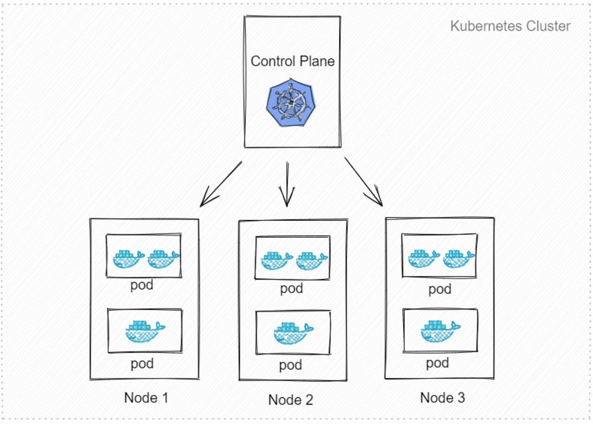 | 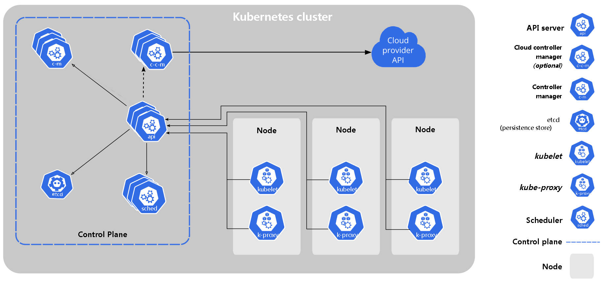 |
| -------------------------------------------------- | -------------------------------------------------- |


# 2、k8s安装

[VMware克隆虚拟机后修改UUID、MAC地址、IP和主机名](https://blog.csdn.net/qq_35461394/article/details/92788603)  [LINUX 常用替换命令三种方法(perl、shell、sed)](https://www.cnblogs.com/tianlingqun/p/16322972.html)  [centos7查看uuid命令](https://www.baidu.com/s?ie=UTF-8&wd=centos7%E6%9F%A5%E7%9C%8Buuid%E5%91%BD%E4%BB%A4)
[VMWare 禁用虚拟内存文件（*.vmem）](https://www.jianshu.com/p/7447fff74340)

```bash
# 修改host, 
cat /proc/sys/kernel/hostname
hostnamectl set-hostname node1
# 查看
hostname
```

```
CentOS-7-x86_64-DVD-2207-02.iso

server
ip:		192.168.1.130
uuid:	ccb94c0c-3ef9-45d2-9f39-48064fbe9054

192.168.1.130 master
192.168.1.131 node1
192.168.1.132 node2


node1
ip:		192.168.1.131

node2
ip:		192.168.1.132
```

## 1、minikube

[minikube安装](https://minikube.sigs.k8s.io/docs/start/)
只是一个 K8S 集群模拟器，只有一个节点的集群，只为测试用，master 和 worker 都在一起

```sh
minikube start			# 启动集群
kubectl get node		# 查看节点。kubectl 是一个用来跟 K8S 集群进行交互的命令行工具
minikube stop			# 停止集群
minikube delete --all	# 清空集群
minikube dashboard		# 安装集群可视化 Web UI 控制台
```


## 2、云平台搭建

可视化搭建，只需简单几步就可以创建好一个集群。
优点：安装简单，生态齐全，负载均衡器、存储等都给你配套好，简单操作就搞定、

## 3、裸机安装（Bare Metal）

至少需要==两台机器（主节点、工作节点个一台）==，需要自己安装 Kubernetes 组件，配置会稍微麻烦点。
可以到各云厂商按时租用服务器，费用低，用完就销毁。
缺点：配置麻烦，缺少生态支持，例如负载均衡器、云存储

> **裸机安装**

**主节点需要组件**

- docker（也可以是其他容器运行时）
- kubectl 集群命令行交互工具
- kubeadm 集群初始化工具,  会安装集群控制台 Control plane

**工作节点需要组件** [文档](https://kubernetes.io/zh/docs/concepts/overview/components/#node-components)

- docker（也可以是其他容器运行时）
- kubelet 管理 Pod 和容器，确保他们健康稳定运行。
- kube-proxy 网络代理，负责网络相关的工作

> **开始安装**

可以试下 [这个项目](https://github.com/lework/kainstall)，用脚本快速搭建 K8S 裸机集群
为了更好的理解，你应该先手动搭建一次

[阿里巴巴开源镜像站——Kubernetes 1.29镜像](https://developer.aliyun.com/article/1074906?spm=5176.26934562.main.10.58bb62calPZ3eB)    [kubernetes镜像](https://developer.aliyun.com/mirror/kubernetes?spm=a2c6h.12873639.article-detail.9.71464579Tf4PoO)   [阿里云镜像kubernetes](https://cn.aliyun.com/sswb/853966.html?from_alibabacloud=) 

```sh
# 1.每个节点分别设置对应主机名
hostnamectl set-hostname master
hostnamectl set-hostname node1
hostnamectl set-hostname node2

# 2.所有节点都修改 hosts,测试 ping master
vim /etc/hosts
172.16.32.2 node1
172.16.32.6 node2
172.16.0.4 master

# 3.所有节点关闭 SELinux
setenforce 0
sed -i --follow-symlinks 's/SELINUX=enforcing/SELINUX=disabled/g' /etc/sysconfig/selinux

# 所有节点确保防火墙关闭
systemctl stop firewalld
systemctl disable firewalld
```

```sh
# 4.添加安装源（所有节点）
## 添加 k8s 安装源
cat <<EOF > kubernetes.repo
[kubernetes]
name=Kubernetes
baseurl=https://mirrors.aliyun.com/kubernetes/yum/repos/kubernetes-el7-x86_64
enabled=1
gpgcheck=0
repo_gpgcheck=0
gpgkey=https://mirrors.aliyun.com/kubernetes/yum/doc/yum-key.gpg https://mirrors.aliyun.com/kubernetes/yum/doc/rpm-package-key.gpg
EOF
mv kubernetes.repo /etc/yum.repos.d/

## 添加 Docker 安装源
yum-config-manager --add-repo http://mirrors.aliyun.com/docker-ce/linux/centos/docker-ce.repo
```

```bash
cat <<EOF | tee /etc/yum.repos.d/kubernetes.repo
[kubernetes]
name=Kubernetes
baseurl=https://mirrors.aliyun.com/kubernetes-new/core/stable/v1.29/rpm/
enabled=1
gpgcheck=1
gpgkey=https://mirrors.aliyun.com/kubernetes-new/core/stable/v1.29/rpm/repodata/repomd.xml.key
EOF
setenforce 0
yum install -y kubelet kubeadm kubectl
systemctl enable kubelet && systemctl start kubelet
```

**安装所需组件**（==所有节点==）    [swap查看](https://blog.51cto.com/u_16236585/9882772) 

`yum install -y kubelet-1.22.4 kubectl-1.22.4 kubeadm-1.22.4 docker-ce`

1.24.4，    1.26.1， 

**启动 kubelet、docker**，并设置开机启动（所有节点）

```sh
systemctl enable docker
systemctl start docker
systemctl enable kubelet
systemctl start kubelet				# 启动不了，关闭swap。  swapoff -a
```


**==修改 docker 配置==**（所有节点）,

```sh
# kubernetes 官方推荐 docker 等使用 systemd 作为 cgroupdriver，否则 kubelet 启动不了
cat <<EOF > daemon.json
{
  "exec-opts": ["native.cgroupdriver=systemd"],
  "registry-mirrors": ["https://ud6340vz.mirror.aliyuncs.com"]
}
EOF
mv daemon.json /etc/docker/

# 重启生效
systemctl daemon-reload
systemctl restart docker

```


用 [kubeadm](https://kubernetes.io/docs/reference/setup-tools/kubeadm/) ==初始化集群==（仅在主节点跑）,会安装集群控制台 Control plane; 然后用join把其它机器加入集群。

FAQ:[swap on is not supported](https://www.blackshadowgame.com/k8s-failed-to-run-kubelet-running-with-swap-on-is-not-supported/)  [报错解决办法](https://segmentfault.com/a/1190000020478007)  [this Docker version is not on the list of validated versions](https://blog.51cto.com/u_16213320/9082829) `swapoff -a` 

```sh
# 初始化集群控制台 Control plane
# 失败了可以用 kubeadm reset 重置； 用阿里云仓库会快些
kubeadm init --image-repository=registry.aliyuncs.com/google_containers

# 记得把 kubeadm join xxx 保存起来
# 忘记了重新获取：kubeadm token create --print-join-command

# 复制授权文件，以便 kubectl 可以有权限访问集群
# 如果你其他节点需要访问集群，需要从主节点复制这个文件过去其他节点
mkdir -p $HOME/.kube
cp -i /etc/kubernetes/admin.conf $HOME/.kube/config
chown $(id -u):$(id -g) $HOME/.kube/config

# 在其他机器上创建 ~/.kube/config 文件也能通过 kubectl 访问到集群

```

```sh
# 复制授权文件，以便 kubectl 可以有权限访问集群
To start using your cluster, you need to run the following as a regular user:

  mkdir -p $HOME/.kube
  sudo cp -i /etc/kubernetes/admin.conf $HOME/.kube/config
  sudo chown $(id -u):$(id -g) $HOME/.kube/config

Alternatively, if you are the root user, you can run:
  export KUBECONFIG=/etc/kubernetes/admin.conf
  
# 安装网络插件，否则 node 是 NotReady 状态（主节点跑）
You should now deploy a pod network to the cluster.
Run "kubectl apply -f [podnetwork].yaml" with one of the options listed at:
  https://kubernetes.io/docs/concepts/cluster-administration/addons/

Then you can join any number of worker nodes by running the following on each as root:

# 把其它工作节点加入集群
kubeadm join 192.168.1.130:6443 --token qfnxce.6njwn8rxi67489gi \
	--discovery-token-ca-cert-hash sha256:0e49ad5c13a419779bb22c86c7b6bdc6cb4485e2f85b3227c433d61995d8fee3 

```


==把工作节点加入集群==（只在工作节点跑）

`kubeadm join 172.16.32.10:6443 --token xxx --discovery-token-ca-cert-hash xxx`

[K8s CNI 网络最强对比：Flannel、Calico、Canal 和 Weave](https://blog.csdn.net/ChaITSimpleLove/article/details/117809007) [kubeadm 搭建 1.23.5 的集群](https://www.cnblogs.com/zouzou-busy/p/16109720.html)   [k8s集群-CNI网络插件（Calico 和 Flannel）](https://www.cnblogs.com/shanhubei/p/17372041.html)     
[卸载flannel](https://blog.51cto.com/u_16213315/9697421) [卸载flannel](https://www.cnblogs.com/dream397/p/14900309.html) 

==安装网络插件==，否则 node 是 NotReady 状态（主节点跑）

```sh
# 很有可能国内网络访问不到这个资源，你可以网上找找国内的源安装 flannel
kubectl apply -f https://raw.githubusercontent.com/coreos/flannel/master/Documentation/kube-flannel.yml

# 如果上面的插件安装失败，可以选用 Weave，下面的命令二选一就可以了。
kubectl apply -f https://github.com/weaveworks/weave/releases/download/v2.8.1/weave-daemonset-k8s.yaml
kubectl apply -f http://static.corecore.cn/weave.v2.8.1.yaml

# 更多其他网路插件查看下面介绍，自行网上找 yaml 安装
https://blog.csdn.net/ChaITSimpleLove/article/details/117809007

```

 `kubeadm config images list` 

[pause容器作用](https://www.cnblogs.com/huangjiabobk/p/18002606) 

```java
registry.k8s.io/kube-apiserver:v1.30.2
registry.k8s.io/kube-controller-manager:v1.30.2
registry.k8s.io/kube-scheduler:v1.30.2
registry.k8s.io/kube-proxy:v1.30.2
registry.k8s.io/coredns/coredns:v1.11.1
registry.k8s.io/pause:3.9
registry.k8s.io/etcd:3.5.12-0
```

1

# 3、部署应用

[命令行工具 (kubectl)](https://kubernetes.io/zh-cn/docs/reference/kubectl/)   [kubectl命令](https://blog.csdn.net/q1y2y3/article/details/132148568) [kubectl简介](https://www.cnblogs.com/yangmeichong/p/16619258.html) [kubectl命令](https://baijiahao.baidu.com/s?id=1765639655777692980&wfr=spider&for=pc) 

[K8S之yaml文件详解（pod、deployment、service）](https://developer.aliyun.com/article/1157027)  [k8s-yaml文件](https://www.cnblogs.com/xinsheng-0415/p/16921982.html) [k8s资源清单文件YAML](https://zhuanlan.zhihu.com/p/590376827?utm_id=0)  [Kubernetes资源篇](https://blog.csdn.net/weixin_45310323/article/details/130912882) 

[彻底删除pod_kubectl](https://blog.csdn.net/weixin_45226922/article/details/133219816)  

[k8S镜像下载策略](https://www.cnblogs.com/huangjiabobk/p/18027386) [K8S国内镜像](https://blog.51cto.com/u_16099295/9705217) [K8S高可用部署](https://zhuanlan.zhihu.com/p/558014199?utm_id=0) [查看k8s集群的默认镜像仓库地址](https://linuxcpp.0voice.com/?id=27494) [kubernetes(k8s)集群超级详细超全安装部署手册](https://zhuanlan.zhihu.com/p/627310856?utm_id=0) [k8s国内镜像仓库](https://www.jianshu.com/p/c5be8db8eb5f) [准备k8s集群镜像](https://blog.csdn.net/heiwa110/article/details/127614981) [K8S(kubernetes)镜像源](https://www.cnblogs.com/Leo_wl/p/15775077.html) [获取kubernetes镜像](https://www.cnblogs.com/liujitao79/p/12337284.html) [Kubernetes 各版本镜像列表 ](https://www.cnblogs.com/twobrother/p/11188865.html) [构建 Nginx 集群](https://bk.tencent.com/docs/markdown/ZH/BCS/1.28/UserGuide/Scenes/Bcs_deploy_nginx_cluster.md) 

[部署Kubernetes集群并完成nginx部署](https://blog.csdn.net/Myx74270512/article/details/132006170)  [kubectl](https://blog.csdn.net/qq_44135433/article/details/121372961)   [k8s- nginx ingress 高可用部署](https://www.cnblogs.com/puzi0315/p/15656727.html) 

[pods “XXX“ not found,要指定namespace](https://blog.csdn.net/LiZhen314/article/details/125221514)  

[kubectl create 与 kubectl apply 的区别](https://blog.csdn.net/qq_50247813/article/details/136188280)  

[kubectl删除namespace](https://blog.csdn.net/xoofly/article/details/131492019)  [k8s中快速删除一个namespace](https://www.cnblogs.com/even160941/p/17356187.html)  

创建pod方法：

1.直接命令运行
`kubectl run testapp --image=ccr.ccs.tencentyun.com/k8s-tutorial/test-k8s:v1`

2.用命令不方便传播，写成==yaml文件==

`kubectl apply -f .\pod.yaml`

3.**单独创建pod不方便**，因为==集群中要运行很多pod==，写成==deployment文件==,  类似docker compose容器编排

​	- 用标签关联pod，template定义pod数据

``kubectl apply -f .\app.yaml``

```yaml
spec:     # 资源规范字段，定义deployment资源需要的参数属性，诸如是否在容器失败时重新启动容器的属性  specification

```

```yaml
apiVersion: apps/v1
kind: Deployment	# 要定义的资源类型
metadata: 			# Deployment的信息（元数据），例如其名称和标签
  name: nginx-deploy
  labels:
    release: nginx_v1.22
spec:				# Deployment的具体规范
  replicas: 1
  strategy:			# 要使用的部署策略
    type: RollingUpdate
    rollingUpdate:
      maxUnavailable: 25%
      maxSurge: 25%
  # 选择由此Deployment管理的Pod的标签,用来查找关联的Pod，所有标签都匹配才行
  selector:			# 标签判断哪个pod归自己管理
    matchLabels:
      app: nginx
  template:			# 指定用于创建副本的Pod模板,包括Pod的元数据和容器规范
    metadata:
      labels:
        app: nginx
    spec:
      containers:	# 指定要在Pod中运行的容器
      - name: mynginx
        image: nginx:1.22.1
        ports:
        - containerPort: 80
---
apiVersion: v1
kind: Service
metadata:
  name: nginx-service
spec:
  type: NodePort
  ports:
  - port: 80
    targetPort: 80
    nodePort: 30080
  selector:			# 选择具有指定label标签的pod作为管理范围
    app: nginx
```

[精品：k8s部署nginx](https://www.cnblogs.com/zhang-xiao-shuang/p/17869994.html)  

[CrashLoopBackOff](https://blog.csdn.net/zfw_666666/article/details/126606394) [flannel一直显示重启](https://www.cnblogs.com/pyxuexi/p/14724792.html)   [network: loadflannelsubnetenv failed](https://blog.csdn.net/yuelai_217/article/details/129988881) [大数据与云计算——部署Kubernetes集群并完成nginx部署(超级详细！)](https://blog.csdn.net/Myx74270512/article/details/132006170) 

排错： 1、 network: ==open /run/flannel/subnet.env==

```
FLANNEL_NETWORK=10.244.0.0/16
FLANNEL_SUBNET=10.244.0.1/24
FLANNEL_MTU=1450
FLANNEL_IPMASQ=true
```

排错： 2、==flannel一直CrashLoopBackOff==    

[pod cidr not assigne](https://blog.csdn.net/anqixiang/article/details/107715591)  [pod cidr not assigne](https://blog.csdn.net/shm19990131/article/details/107116091/) 

```sh
kubectl logs -f -n kube-flannel kube-flannel-ds-z89d6		# 实时查看日志

# pod cidr not assigne
vim /etc/kubernetes/manifests/kube-controller-manager.yaml
- --allocate-node-cidrs=true
- --cluster-cidr=10.244.0.0/16

systemctl restart kubelet
```

[kubectl之get命令](https://blog.csdn.net/a807719447/article/details/115272623)  [Kubernetes日常维护命令](https://www.cnblogs.com/davidchen211/p/11727179.html) [查看配置](https://blog.51cto.com/u_16099170/9951439)  [Kubernetes指定pod运行位置](https://blog.csdn.net/memory_hahaha/article/details/129110602)  [k8s查看镜像](https://www.baidu.com/s?ie=utf-8&f=8&rsv_bp=1&tn=baidu&wd=k8s%E6%9F%A5%E7%9C%8B%E9%95%9C%E5%83%8F&rn=20&oq=k8s&rsv_pq=ca4660d60066ee75&rsv_t=9797z0JMpRMjnu8H83q48OTxen94hAyGMzzgO9b%2FaI4b8X%2BZ5%2FK7VNjHktA&rqlang=cn&rsv_enter=1&rsv_dl=tb&rsv_sug3=9&rsv_sug1=3&rsv_sug7=100&rsv_sug2=0&rsv_btype=t&inputT=3677&rsv_sug4=3677) 

[port-forward端口映射](https://blog.csdn.net/WuLex/article/details/130397903) 

```bash
kubectl apply -f app.yaml		# 部署应用
kubectl get deployment			# 查看 deployment

kubectl get pod -o wide			# 查看 pod,-A,
kubectl describe pod pod-name	# 查看 pod 详情, -n namespace指定命名空间
kubectl delete deployment nginx-deployment -n myserver
kubectl delete pod testapp		# 删除pod, -n指定命名空间  
kubectl delete deployment nginx
kubectl logs pod-name			# 查看 log, -f持续查看日志; tail -f app.log

# 进入 Pod 容器终端， -c container-name 可以指定进入哪个容器。
kubectl exec -it pod-name -- bash


kubectl scale deployment test-k8s --replicas=5				# 伸缩扩展副本数量=5
kubectl port-forward pod-name 8090:8080						# 把集群内端口映射到节点,主机：容器
kubectl rollout history deployment test-k8s	-n myserver		# 查看历史,-n命名空间
kubectl rollout undo deployment test-k8s					# 回到上个版本
kubectl rollout undo deployment test-k8s --to-revision=2	# 回到指定版本

# ClusterIP临时以NodePort方式访问，可以通过kubectl port-forward命令将端口映射到本地
# 将本地端口27019映射到svc的27017,如果不指定address则默认为127.0.0.1
kubectl port-forward svc/my-mongodb-headless 27019:27017 --address 192.168.1.130

kubectl delete deployment test-k8s							# 删除部署
kubectl get all

kubectl api-resources
kubectl options							# 全局可配置的选项，适用于所有命令	
kubectl -n prd get po					# 获取某个namespace下的pod
kubectl -n prd logs -f podName			# 获取pod的日志
kubectl -n prd exec -it podName sh		# 进入某个pod的container
kubectl -n prd describe pods/podName	# 查看pod详情
kubectl get pods -o wide -n myserver	# 查看pod运行在哪个node上
kubectl get all -A
kubectl rollout restart deployment nginx-deployment  -n myserver	 # 重新部署
# 删除全部资源
kubectl delete all --all

# 查看镜像
kubectl get pods -o=jsonpath='{range .items[*]}{"\n\n"}{.metadata.name}{":\t"}{range .spec.containers[*]}{.image}{", "}{end}{end}' -A
```

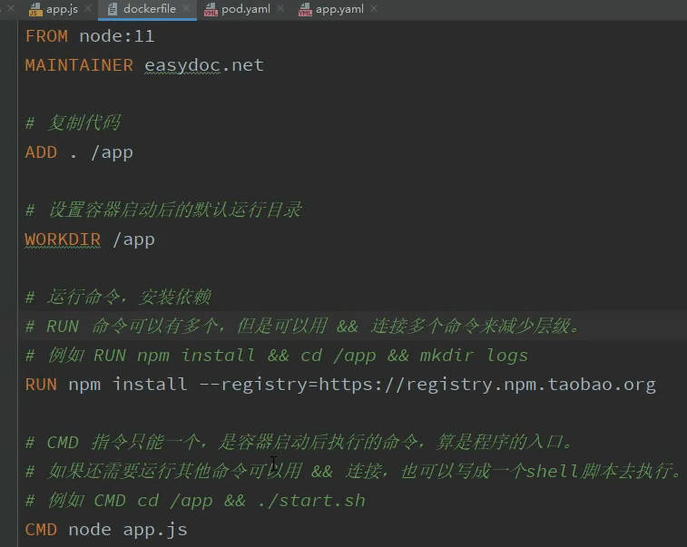


## 1、Deployment yaml文件

[deployment](https://blog.51cto.com/u_16213580/7163579)

Deployment yaml文件包含四个部分：

- apiVersion: 表示版本。版本查看命令：kubectl api-versions
- kind: 表示资源
- metadata: 表示元信息
- spec: 资源规范字段

## 2、Service yaml 文件

## 3、ingress yaml 文件

## 4、扩缩容

方法一：

修改yaml文件副本数量，然后 `kubectl apply -f nginx.yaml` 更新

方法二：

用命令，`kubectl scale deployment nginx-deployment --replicas=5 -n myserver`

## 5、版本回退rollout

```shell
kubectl rollout status deployments kubernetes-dashboard
```

==金丝雀发布==

[使用kubectl set image命令更新Deployment中容器的镜像](https://blog.csdn.net/a772304419/article/details/136354681)  　[k8s--deployment 控制器、版本回退、金丝雀发布](https://www.cnblogs.com/zouzou-busy/p/16153807.html)　　

仅更新一部分，主体部分还是旧的版本。然后，筛选一小部分的用户请求路由到新版本的pod应用中，观察能否稳定运行。确定没问题再继续完成剩下的pod滚动更新，否则立即回滚更新操作

```bash
# kubectl set image deployment/<deployment-name> <container-name>=<new-image-name>:<new-image-tag>
# 名为myapp的Deployment，包含一个名为mycontainer容器，将镜像从 myregistry/myimage:v1 更新到 myregistry/myimage:v2; --record命令记录到rollout history
# kubectl set image deployment/myapp mycontainer=myregistry/myimage:v2

# 历史记录 kubectl rollout history deployment test-k8s	-n myserver
# 给deployment设置镜像， 给mynginx容器设置新镜像: nginx:1.24;  --record 命令记录到历史记录
kubectl set image deploy/nginx-deploy   mynginx=nginx:1.24 --record && kubectl rollout pause deploy/nginx-deploy
# 可分开写，先运行pause命令，再改镜像
# ready: 期望4个，即要复制4个； 2个新版本pod，可用的是5个

# 删除全部资源
kubectl delete all --all
```


```sh
# 改东西，不想让它立即生效，可先暂停
kubectl rollout pause deployment test-k8s
# 暂停运行，暂停后，对 deployment 的修改不会立刻生效，恢复后才应用设置
kubectl set image deploy/nginx-deploy   mynginx=nginx:1.24 --record && kubectl rollout pause deploy/nginx-deploy

# 恢复后才应用
kubectl rollout resume deployment test-k8s
# 输出到文件
kubectl get deployment test-k8s -o yaml >> app2.yaml

kubectl get rs -o wide
kubectl rollout status deploy/nginx-deploy

#　经过了一段时间，发现新的应用没有问题，就可以进行全部升级
kubectl rollout resume deploy/nginx-deploy

# 查看更新版本的详细信息，版本6
kubectl rollout history deployment/nginx-deploy --revision=6
# CHANGE-CAUSE 的内容是从 Deployment 的 kubernetes.io/change-cause 注解复制的
# 修改版本CAUSE
kubectl annotate deploy/nginx-deploy kubernetes.io/change-cause="image updated to 1.24"
```


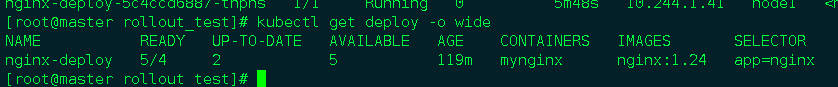

## 6、k8s控制器

[精品：Deployment资源控制器详解](https://blog.csdn.net/qq_43714097/article/details/131653240) 

### ReplicaSet

帮助用户管理无状态的pod资源，精确反应用户定义的目标数量，但是RelicaSet不是直接使用的控制器，而是使用Deployment。

- Deployment: 工作在ReplicaSet之上，用于管理无状态应用，目前来说最好的控制器。支持滚动更新和回滚功能，还提供声明式配置
- DaemonSet： 用于确保集群中的每一个节点只运行特定的pod副本，通常用于实现系统级后台任务。比如ELK服务。特性：服务是无状态的；服务必须是守护进程
- Job： 只要完成就立即退出，不需要重启或重建
- Cronjob： 周期性任务控制，不需要持续后台运行
- StatefulSet： 管理有状态应用 

## 7、命令

[apply run create区别](https://blog.csdn.net/e891377/article/details/139211848) 

```sh
kubectl create			# 通过 Kubernetes API 创建新资源
kubectl apply			# 通过 Kubernetes API 对资源进行更新
# 创建pod第一种方法： 直接命令运行
kubectl run  testapp   --image=ccr.ccs.tencentyun.com/k8s-tutorial/test-k8s:v1
```


## 8、现存问题

**现存问题**： ==用service解决==
每次只能访问一个 pod，没有负载均衡自动转发到不同 pod
访问还需要端口转发
Pod 重创后 IP 变了，名字也变了

# 4、==service==

[k8s服务流转](https://blog.csdn.net/u010389826/article/details/122341564)  [k8s的service为什么不能ping通](https://blog.csdn.net/weixin_42236288/article/details/137683905) 

1. service==通过标签关联==到对应的pod， 访问时通过service访问： **请求发到service，经过负载均衡，自动转发到不同的pod**
2. 通过 `service.yaml` 文件创建
3. **访问**
   1. 集群内部访问： ClusterIP: 进入pod，`kubectl exec -it podname -- bash`， 用服务名或服务ip访问
   2. 集群外部访问：端口转发 ，`port-forward`
   3. 把集群服务暴露出来：NodePort 

### 特性

- Service ==通过 label 关联到对应的 Pod，不怕ip改变==
- Servcie 生命周期不跟 Pod 绑定，不会因为 Pod 重建改变 IP
- 提供了==负载均衡==功能，请求发到service，自动转发流量到不同 Pod
- 可对集群外部提供访问端口       # 集群外部访问用端口转发port-forward,
- 集群内部可通过服务名字访问     # 用服务ip也行

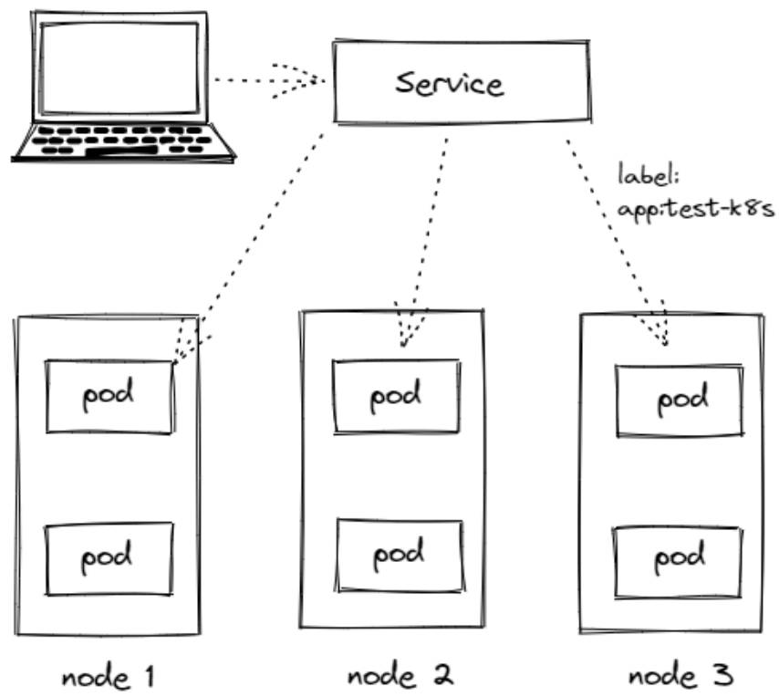

### 创建 Service

创建一个Service(service.yaml文件)，==标签要和Pod的标签对应==

### 对外暴露服务

### 多端口

# 5、==StatefulSet==

[MongoDB7.0版本](https://www.mongodb.com/zh-cn/docs/manual/release-notes/6.0/) [kubernetes 到CLUSTER_DNS不通](https://blog.51cto.com/u_16213448/8959677)     [k8sDNS（CoreDNS）介绍](https://www.cnblogs.com/liugp/p/16387457.html)  

[Headless服务-只供集群内访问 ](https://zhuanlan.zhihu.com/p/654328148?utm_id=0)  [k8s中headless服务如何让外部访问](https://www.baidu.com/s?ie=utf-8&f=8&rsv_bp=1&tn=baidu&wd=k8s%E4%B8%ADheadless%E6%9C%8D%E5%8A%A1%E5%A6%82%E4%BD%95%E8%AE%A9%E5%A4%96%E9%83%A8%E8%AE%BF%E9%97%AE&rn=20&oq=headless%25E6%259C%258D%25E5%258A%25A1%25E5%25A6%2582%25E4%25BD%2595%25E8%25AE%25A9%25E5%25A4%2596%25E9%2583%25A8%25E8%25AE%25BF%25E9%2597%25AE&rsv_pq=b96fb1d9001a75d7&rsv_t=1051loI%2FpzJPjVQX%2B%2FmalHx%2FT71%2FmDDi8hjS%2BA7DFU4jCZPBAEWwdgKymQo&rqlang=cn&rsv_enter=1&rsv_dl=tb&rsv_btype=t&inputT=5506&rsv_sug3=56&rsv_sug1=41&rsv_sug7=100&rsv_sug2=0&rsv_sug4=7385)  [K8S集群无法通过Service Name访问的故障](https://www.modb.pro/db/420052)  [Kubernetes之无头服务(headless) ](https://www.cnblogs.com/lizexiong/p/14778359.html) 

[MongoDB学习笔记](https://www.cnblogs.com/garvenc/p/mongodb_learning_cli.html) [mongodb常用命令](https://www.cnblogs.com/jushen7925/p/16070270.html) 

**小结：**

- `kubectl apply -f mongo.yaml` 
- 连接pod
  - Pod 重建名字不会变,用名字去连接；   `pod-name.service-name`
  - Web 应用连接 Mongodb

- 例子：一个web服务； 一个mongodb服务，通过标签关联到mongodb数据库的pod，提供统一入口； 
  - 请求先到web服务，再转发到不同的pod，pod连接mongodb服务，再请求到mongodb数据库

用来==管理有状态的应用==，例如数据库, pod重建，名字也是固定的
前面部署的应用，都是不需要存储数据，不需要记住状态的，可以随意扩充副本，每个副本都是一样的，可替代的。
而像数据库、Redis 这类有状态的，则不能随意扩充副本。
==StatefulSet 会固定每个 Pod 的名字==

- 连接指定 Pod： `pod-name.service-name`
- 运行临时pod连接数据： `kubectl run mongodb-client --rm --tty -i --restart='Never' --image docker.io/bitnami/mongodb:4.4.10-debian-10-r20 --command -- bash`


```bash
Usage:
  kubectl run NAME --image=image [--env="key=value"] [--port=port] [--dry-run=server|client] [--overrides=inline-json]  [--command] -- [COMMAND] [args...] [options]
  
kubectl run mongodb-client --rm --tty -i --restart='Never' --image mongo:4.4 --command -- bash

# 连接mongo：  usage: mongo [options] [db address] [file names (ending in .js)]
mongo --host mongodb-0.mongodb
```

容器没有ping命令

```shell
sed -i '$adeb https://mirrors.aliyun.com/ubuntu/ focal main restricted universe multiverse' /etc/apt/sources.list
apt update
apt install iputils-ping
```

在Kubernetes中，Headless服务可以通过DNS来让外部访问。==Headless服务没有自己的IP地址==,只能通过服务名访问，因此不会有单独的DNS记录指向它们的ClusterIP。但是，Headless服务的每个Pod都会有一个DNS记录，格式为`<pod-name>.<service-name>.<namespace>.svc.cluster.local`。

要让外部访问Headless服务的Pod，你可以通过这些DNS记录来直接与Pod通信。这通常涉及到服务网格或者直接通过SDK/客户端库在应用层面进行通信

```
show dbs
user test
db.users.save({'_id':'easydoc',name:'凯德拉'})
db.users.find()
```


```bash
yum load-transaction /tmp/yum_save_tx.2024-04-14.21-56.zMT5YY.yumtx 重新执行该事务
dnf install bind-utils, apt install dnsutils
```

## Web 应用连接 Mongodb

# 6、==数据持久化==

[k8s run exec](https://www.jianshu.com/p/f636c9d1b3ad?utm_campaign=maleskine)  [docker run、exec和attach区别](https://blog.csdn.net/MePlusPlus/article/details/92822329) 

- 本地磁盘：挂载某个节点上的目录，但是这需要限定 pod 在这个节点上运行
- 云存储：不限定节点，不受集群影响，安全稳定；需要云服务商提供，裸机集群是没有的。
- NFS：不限定节点，不受集群影响

```
kubectl rollout restart statefulset mongodb
```


## 1、hostPath

yaml里挂载，不推荐

## 2、抽象为三层

[集群-容器服务](https://console.cloud.tencent.com/tke2/cluster?rid=1)  [TencentOS Server](https://cloud.tencent.com/document/product/1397/72782)  [TencentOS Server 简介](https://www.tencentcloud.com/zh/document/product/213/40223)  

==PVC==(Persistent volume claim 持久卷**声明**)，==PV，SC==（Strorage class）

- pvc： 申请单； 声明需要多大的磁盘
- pv：  真正的磁盘
- sc：  磁盘类型

用yaml文件写,云服务器上支持动态创建，本地不支持,要手动创建pv;

**腾讯云示例**：

**本地磁盘使用**：

==创建顺序==：

- 创建Strorage class:`kubectl apply -f sc.yaml`;  
- 然后创建PV,`kubectl apply -f pv.yaml`
- 创建PVC, `kubectl apply -f pvc.yaml`
- 最后创建mongo.yaml `kubectl apply -f mongo.yaml`, 在mongo.yaml里定义卷：pvc

## 3、当前问题

当前数据库的连接地址是写死在代码里的，另外还有数据库的密码需要配置

用配置文件：ConfigMap,  可以方便的配置变量

# 7、==Configmap== & Secret

[kubernetes ConfigMap和Secret：配置应用程序](https://www.553668.com/manong/1415819.html) 

**小结：**

- 创建`kubectl apply -f configmap.yaml`
- 使用：
  - 作为环境变量传递给容器
    - 通过环境变量传递到容器里面; name:密码文件的名字，key:引用密码文件里的值
  - 挂载为文件（更适合证书文件）:  ` volumeMounts`
    - 挂载后，会在容器中对应路径生成文件，一个 key 一个文件，内容就是 value，[文档](https://kubernetes.io/zh/docs/concepts/configuration/secret/#using-secrets-as-files-from-a-pod) 

数据库连接地址，这种可能根据部署环境变化的，不应该写死在代码里; 

```sh
# 查看内容
kubectl get configmap mongo-config -o yaml

# -c 指定进入哪个容器
kubectl exec -it pod/name  -c test-k8s -- bash 
```

==ConfigMap，方便的配置一些变量==

```yaml
apiVersion: v1
kind: ConfigMap
metadata:
  name: mongo-config
data:
  mongoHost: mongodb-0.mongodb
# kubectl get configmap -o yaml
```

一些重要数据，例如密码、TOKEN，可以放到 secret 中,[文档](https://kubernetes.io/zh/docs/concepts/configuration/secret/)，[配置证书](https://kubernetes.io/zh/docs/concepts/configuration/secret/#tls-secret)   数据要进行 Base64 编码

```yaml
apiVersion: v1
kind: Secret
metadata:
  name: mongo-secret
# Opaque 用户定义的任意数据，更多类型介绍 https://kubernetes.io/zh/docs/concepts/configuration/secret/#secret-types
type: Opaque
data:
  # 数据要 base64。https://tools.fun/base64.html
  mongo-username: bW9uZ291c2Vy
  mongo-password: bW9uZ29wYXNz
```


# 8、==Helm== & NameSpace

## 介绍

[Helm官网](https://helm.sh/zh/docs/intro/install/)，[应用中心](https://artifacthub.io/)  [Helm版本匹配](https://helm.sh/zh/docs/topics/version_skew/)  [安装Helm](https://helm.sh/zh/docs/intro/install/) [使用Helm推送拉取Chart_容器镜像服务(ACR)](https://help.aliyun.com/zh/acr/user-guide/push-and-pull-chart-using-helm-2) 

[国内helm仓库](https://hub.grapps.cn/marketplace)   [国内Helm仓库](https://zhuanlan.zhihu.com/p/647496536) 

[Rainbond_不用懂k8s的云原生应用管理平台](https://www.rainbond.com/) [国内的helm chart仓库](https://blog.csdn.net/qq_45799465/article/details/131832586) 

[Robo 3T](https://studio3t.com/download/#weglot_switcher)   [Helm3详解 （部署，自定义，仓库，）](https://blog.csdn.net/qq_51545656/article/details/136648792)  [helm仓库](https://blog.51cto.com/u_16099297/9856621) 

[Helm--常用命令和常见错误](https://blog.csdn.net/zhou920786312/article/details/126243603) 

`Helm`类似 npm，pip，docker hub, 可以理解为是一个软件库，可以方便快速的为我们的集群安装一些第三方软件。
使用 Helm 我们可以非常方便的就搭建出来 MongoDB / MySQL 副本集群，YAML 文件别人都给我们写好了，直接使用。

Helm 2个重要概念：

- chart： 相当于镜像
- release：相当于容器

==安装helm==：

1. tar -zxvf
2. 安装tiller

| 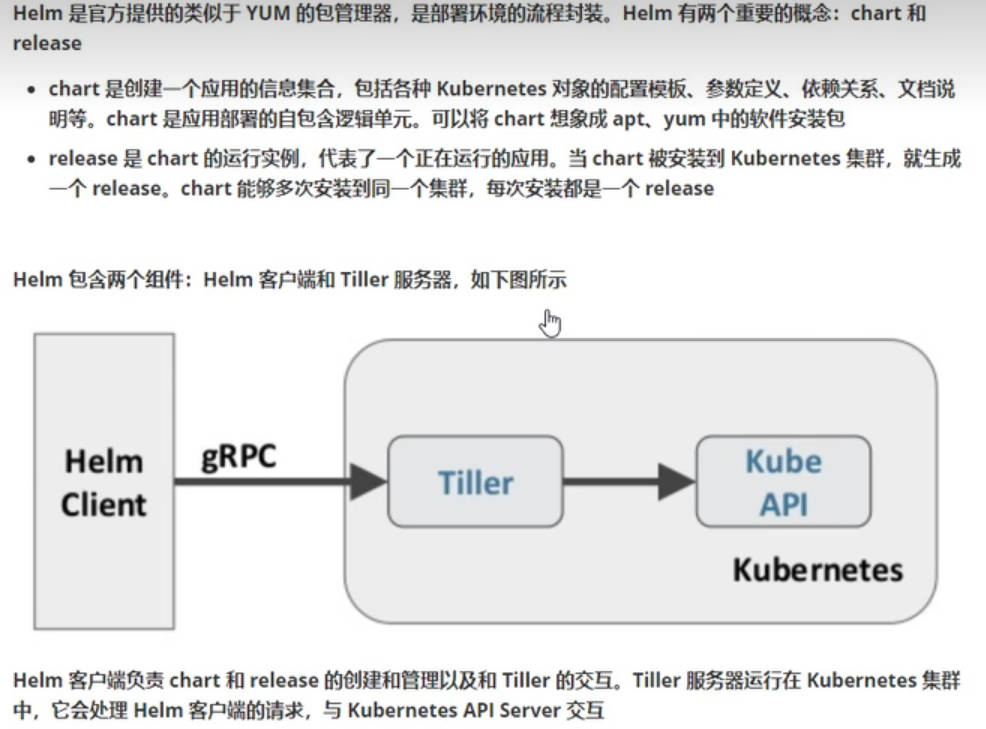           | 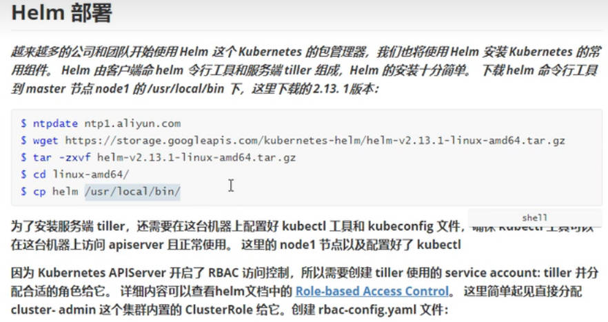 |
| ------------------------------------------------------------ | -------------------------------------------------- |
| 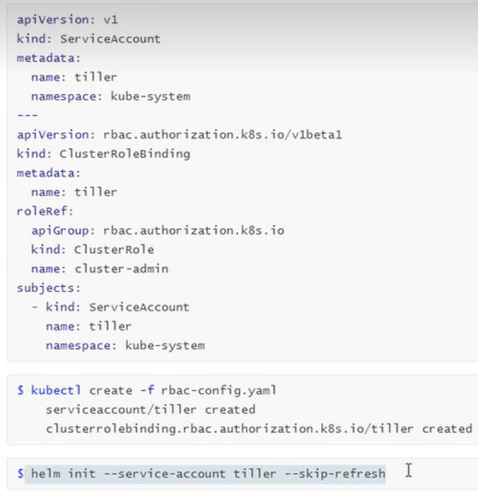 |                                               |

```sh
helm repo list
helm list
helm status release_name
helm repo update
helm fetch stable/redis
helm search repo bitnami -l
helm fetch my-mongodb bitnami/mongodb --version 15.1.4


```

helm动态可配置： `{{yaml文件名.字段.二级字段}}:{{}}`

```sh
# 安装mongodb
helm install my-release oci://registry-1.docker.io/bitnamicharts/mongodb
# 删除 helm ls
helm delete my-release
# 安装时指定密码和架构
helm install my-mongo bitnami/mongodb --set architecture="replicaset",auth.rootPassword="mongopass"

helm install my-release oci://registry-1.docker.io/bitnamicharts/mongodb   --set architecture="replicaset",auth.rootPassword="123456"

# kubectl get all ，启动2个pod，一个仲裁者 pod/my-release-mongodb-arbiter-0 

# 临时运行一个包含 mongo client 的 debian 系统
kubectl run mongodb-client --rm --tty -i --restart='Never' --image docker.io/bitnami/mongodb:7.0.11-debian-12-r1 --command -- bash

# 进去 mongodb
mongo --host my-release-mongodb-0.my-release-mongodb-headless.default.svc.cluster.local:27017  -u root -p mongopass
```


## 主题

### 基于角色的访问控制

[精品：RBAC四级角色权限模型视频](https://www.bilibili.com/video/BV1YT411N76n/?spm_id_from=333.337.search-card.all.click&vd_source=7346303e5e18677d7261c2c0c109ecfd)   [k8s RBAC账户](https://www.jianshu.com/p/0c5aa88420e2)  [ RBAC 权限管理](https://www.bilibili.com/video/BV1cv411g7k2/?spm_id_from=333.337.search-card.all.click&vd_source=7346303e5e18677d7261c2c0c109ecfd) 

[K8S安全机制-RBAC之(cluster)role、(cluster)rolebinding](https://www.cnblogs.com/ygbh/p/17273838.html)  [ClusterRole与RoleBinding](https://blog.csdn.net/weixin_40228200/article/details/124486833) [Kubernetes 安全权限管理客](https://blog.csdn.net/liuzehn/article/details/123727547) 

[k8s安装集群版mysql](https://blog.csdn.net/heliu3/article/details/108830691)  [k8s报错：pod has unbound immediate PersistentVolumeClaims](https://www.cnblogs.com/wangzy-Zj/p/14115229.html)  

- ==ClusterRoleBinding==: 将一个特定的ClusterRole(角色)绑定到整个[**集群**](https://www.lsjlt.com/tag/集群/)中的一组用户或服务账号

### RBAC

==RBAC四级角色权限模型==: RBAC更简单，ABAC更灵活

- 角色：例如老师、学生；部门等;   ==把人(用户)和一个或多个角色绑定==,然后==基于角色进行授权==； 用户和角色==多对多关系==
- 角色有3个属性，或要控制的权限： 访问、操作、会话; 对这三个分配不同的权限，==权限最后映射为不同的URI,以及不同的访问方式(get、post等)==
  - 美国国家标准与技术研究院为RBAC定义了4级： rbac variations organized as levels
- 用户组、用户、角色怎么对应： 实际应用中, 用户组才是和角色绑定的依据, 用户有没有没关系，为用户组先分配好角色
- 经典RBAC五表设计： 五表不是有5个表,是有5类表
  - 用户和角色多对多，要增加一个==用户和角色的对照表==； 
  - 权限是一个宽泛的概念,不同的事物都能被称为权限，角色能用哪些权限，用==角色和权限对照表==来映射
  - 用户登录后，就知道自己角色是什么，知道角色后，再到权限表根据编号提取权限


| 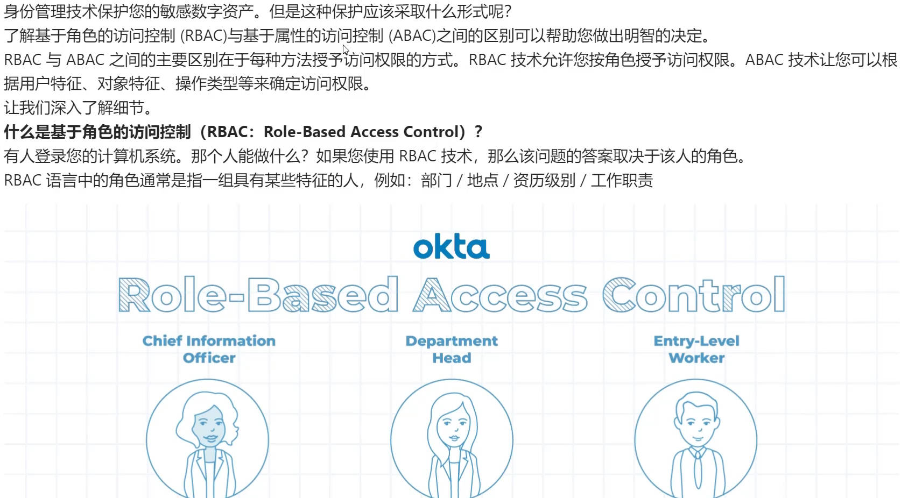           | 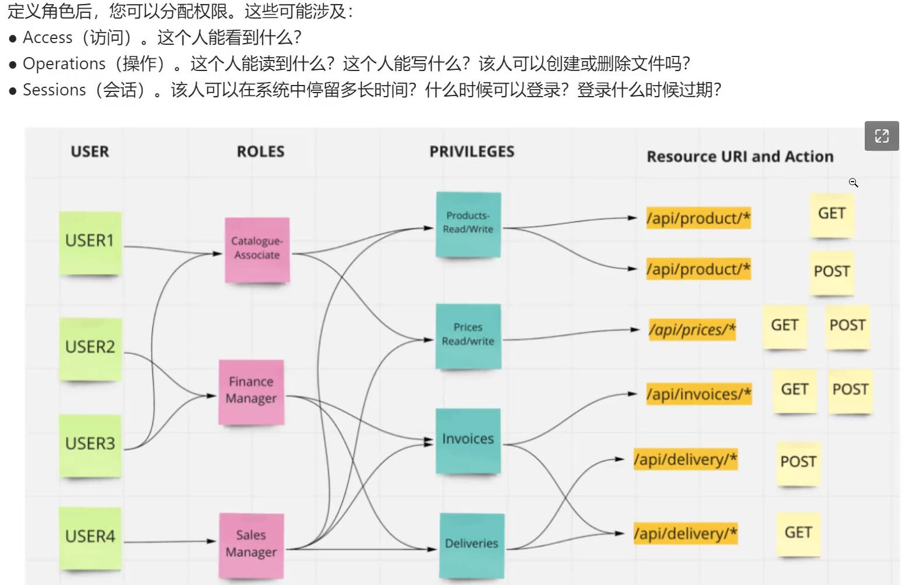     |
| ------------------------------------------------------------ | ------------------------------------------------------ |
| 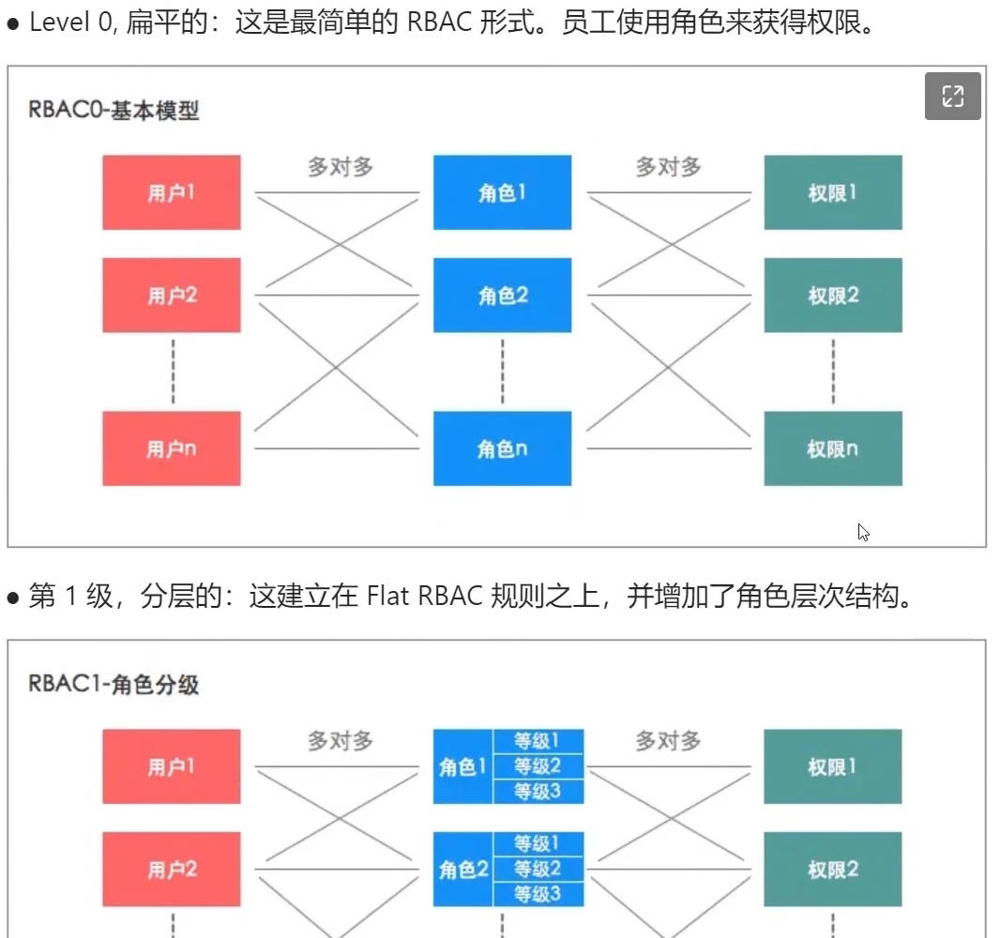           | 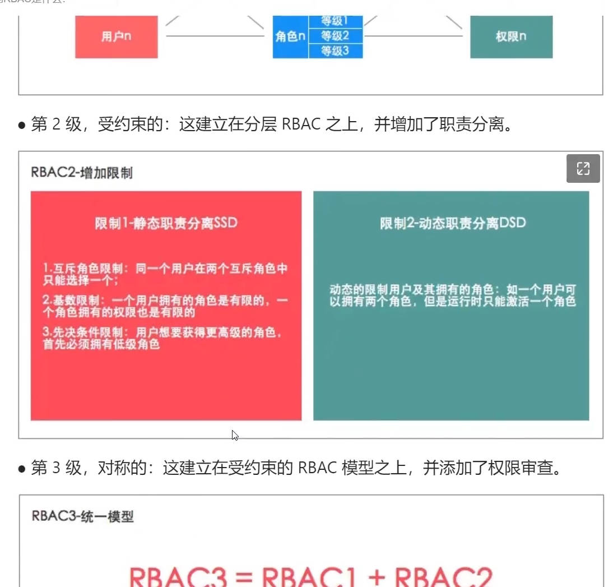     |
| 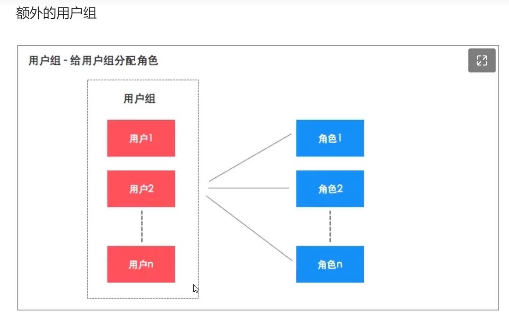           | 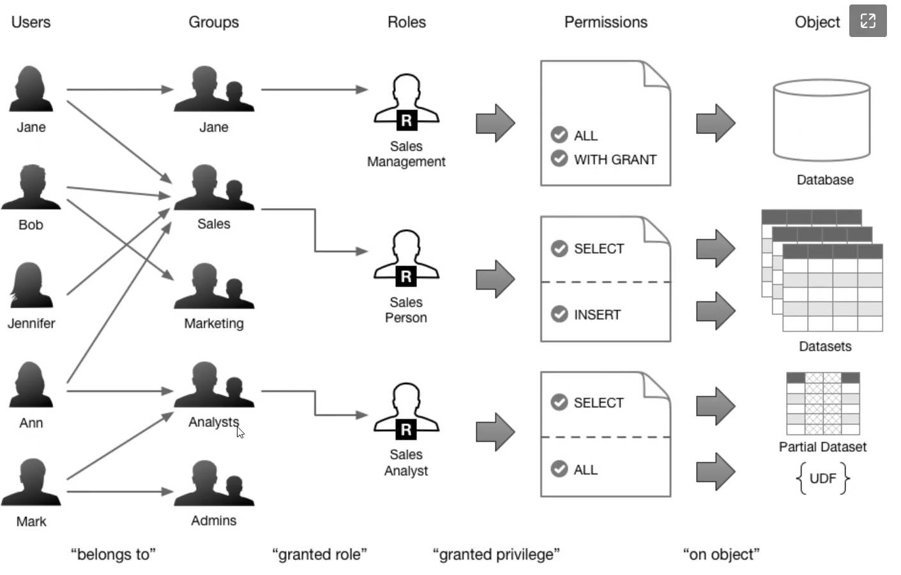     |
| 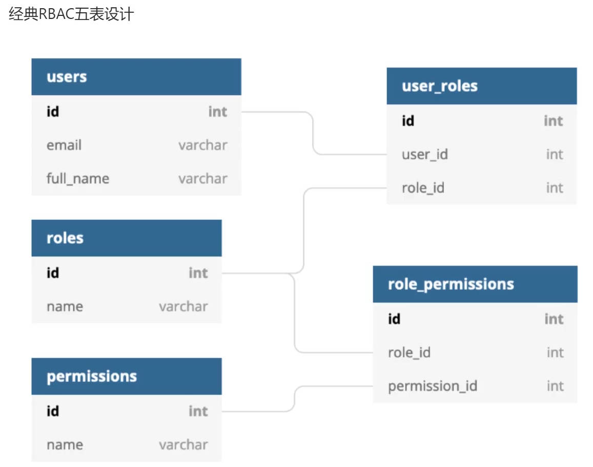 | 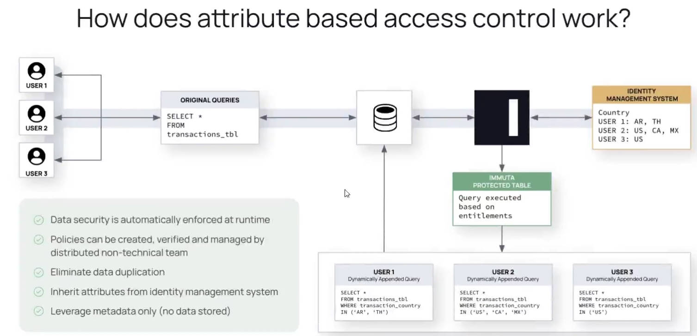 |

==ABAC属性访问控制==

包含4要素

- 行动：能做什么动作
- 环境：外围的描述的信息，如1天的什么时间段，什么位置，用什么设备时等，对属性的约束

ABAC具体的实现： [Azure 基于属性的访问控制 (Azure ABAC)](https://docs.azure.cn/zh-cn/role-based-access-control/conditions-overview)    [史上最强的权限系统设计攻略](https://blog.csdn.net/weixin_54542328/article/details/134874337)    [最全的权限系统设计方案](https://blog.51cto.com/u_16502039/9766944)   

ABAC编辑器：规划用户有哪些属性， 通过属性组合权限，规则编辑器

| 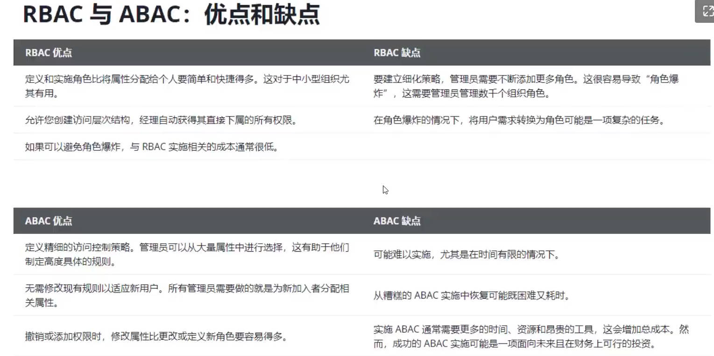 | 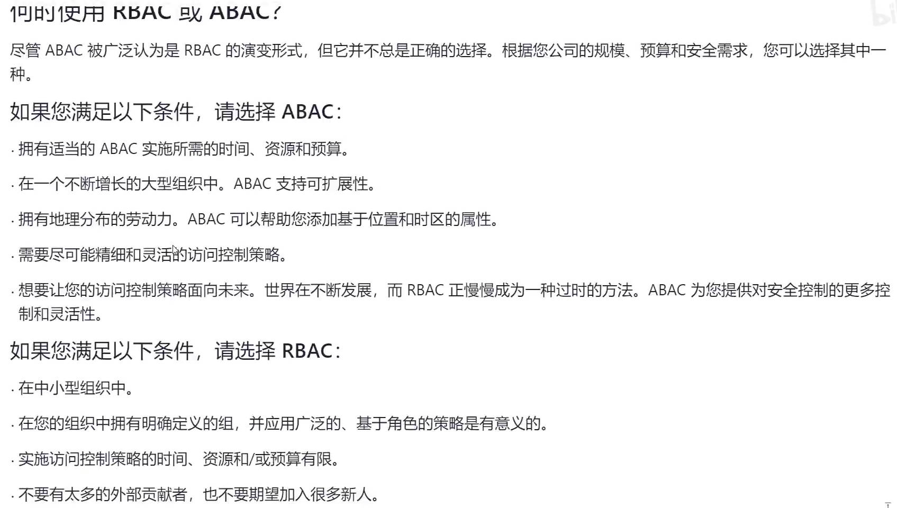 |
| -------------------------------------------------- | -------------------------------------------------- |

==k8s RBAC==

[k8s成员](https://blog.51cto.com/u_15772202/10145280)    [k8s RBAC账户](https://www.jianshu.com/p/0c5aa88420e2)   [K8S](https://zhuanlan.zhihu.com/p/632914411)   [K8S云管理平台UMC角色权限体系](https://blog.csdn.net/aeaiesb/article/details/125971423)   [Kubernetes——角色、组件、运行流程](https://blog.csdn.net/m0_53891399/article/details/132439066)

[k8s  RBAC ](https://www.cnblogs.com/wangguishe/p/17601557.html)  [Kubernetes中节点的角色](https://docs.rancher.cn/docs/rancher2/cluster-provisioning/production/nodes-and-roles/_index/)  [xshell的用ZMODEM上传文件失败](https://blog.csdn.net/m0_56576149/article/details/136101479) 

[K8S的用户管理](https://zhuanlan.zhihu.com/p/650206131) 

角色里有规则

- 用户有3种：用户、服务账号、用户组
  - 用户是一个文件，`.kube/config`,当前登录用户的家目录下，这个文件代表"我"是谁； 用户信息； 要创建用户，就是创建这个文件
  - ssl: 一个用户一个证书,这个用户证书，就是用来生成用户文件的
  - K8s中所有的访问，无论外部内部，都会通过API Server处理，访问Kubernetes资源前需要经过认证与授权
    - service account: sa是给集群中的进程使用的，当集群中的pod或进程需要跟apiserver申请调用资源时会使用到sa
- 角色有2种：Role，名称空间的角色，属于局部资源；  ClusterRole，集群角色，属于集群全局资源
  - 绑定也2种，由角色决定
  - cluster-admin：超级管理员，有集群所有权限

| 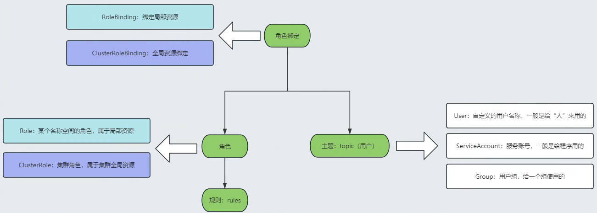 | 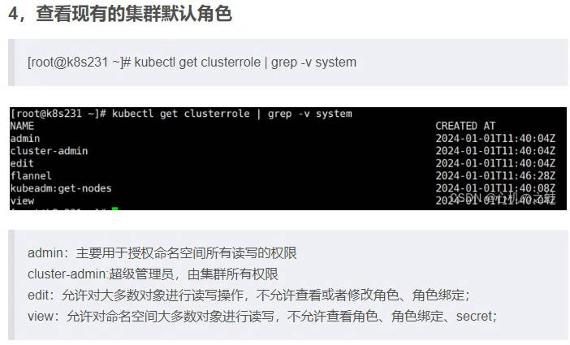 |
| -------------------------------------------------- | -------------------------------------------------- |
| 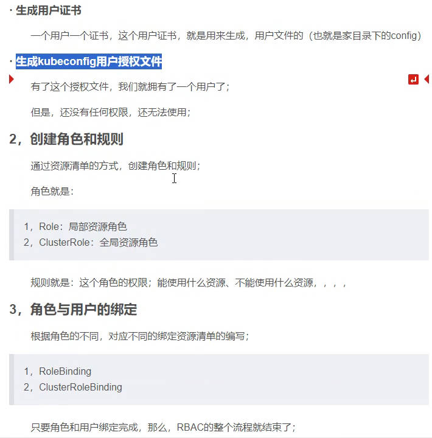 |                                               |


#### ==证书==

[ca证书](https://search.bilibili.com/all?vt=05687771&keyword=ca%E8%AF%81%E4%B9%A6&from_source=webtop_search&spm_id_from=333.1007&search_source=5)  [ca证书的发展历程](https://wenku.baidu.com/view/641f678693c69ec3d5bbfd0a79563c1ec4dad777.html?_wkts_=1713805241904&bdQuery=ca%E8%AF%81%E4%B9%A6%E8%AE%A4%E8%AF%81%E7%9A%84%E6%BC%94%E5%8F%98)  [身份认证的前世今生](https://mp.weixin.qq.com/s?__biz=MzIxMzI4ODI1MA==&mid=2247484155&idx=1&sn=4860868396533a4e6260c747fd557475&chksm=97b856aea0cfdfb89a7d78e481d1b550d5de894fc1b597d72965d2590d21fb42d9431da49272&scene=27)  [对称加密，非对称加密，CA，数字证书，图解https演变以及各种加密解密过程](https://zhuanlan.zhihu.com/p/99221447)   [数字证书中CA、RA、CPS的联系与区别](https://m.fadada.com/notice/detail-16871.html)   [CA证书目的和详细演化过程](https://www.cnblogs.com/jndx-ShawnXie/p/11311580.html)    

[ssl原理](https://www.baidu.com/s?ie=UTF-8&wd=ssl%E5%8E%9F%E7%90%86)   [ssl原理](https://search.bilibili.com/all?vt=05922458&keyword=ssl%E5%8E%9F%E7%90%86&from_source=webtop_search&spm_id_from=333.1007&search_source=5)  [网络安全三同步](https://baijiahao.baidu.com/s?id=1765662518470521632&wfr=spider&for=pc)  [安全通信的特性](https://blog.csdn.net/weixin_30617737/article/details/96573905)

[精品：密钥、公钥、私钥](https://zhuanlan.zhihu.com/p/452636755)   [HTTPS安全通信原理简](https://zhuanlan.zhihu.com/p/477329576)  

一个安全的通信要满足：ssl强化tcp连接

- 安全通信的特性: ==机密性、报文完整性、端点鉴别==（客户端服务端鉴别）、运行安全性

- 网络安全三同步：时间同步、数据同步和动作同步

[精品：8分钟详细讲解SSL连接过程](https://www.bilibili.com/video/BV1ra4y1v7jS/?spm_id_from=333.337.search-card.all.click&vd_source=7346303e5e18677d7261c2c0c109ecfd)  [一个完整的SSL连接过程](https://www.bilibili.com/video/BV1EK4y1b7Mu/?spm_id_from=333.788.recommend_more_video.-1&vd_source=7346303e5e18677d7261c2c0c109ecfd)    [精品：非对称加密、对称加密、签名、CA机构、证书、https](https://www.bilibili.com/video/BV1TP411G7wb/?spm_id_from=333.788.recommend_more_video.2&vd_source=7346303e5e18677d7261c2c0c109ecfd)   

[数字签名 及 数字证书 原理](https://www.bilibili.com/video/BV18N411X7ty/?spm_id_from=333.788.recommend_more_video.1&vd_source=7346303e5e18677d7261c2c0c109ecfd)   

[CentOS 7 CA证书服务器部署](https://blog.csdn.net/cronaldo91/article/details/132525827)     

ssl工作过程分为3阶段：

1. ==握手==：  3步：建立tcp连接、验证服务端身份、分发通信主密钥
   1. 验证服务端身份： **1**、client向svc发送一个hello报文，svc用其证书回应，这个证书是经过权威机构认证的，一个==实体与其公钥的绑定==，cli收到svc证书后，完成svc身份验证； **2**、cli==从证书中提取svc的公钥==，并随机生成一个==通信主密钥MS==； **3、**然后用svc的公钥对其进行加密后发送给svc，svc用自己的==私钥解密得到主密钥ms==，现在cli和svc都有ms了，有了ms，随后的数据加密和验证过程就好办了
   2. *公钥用来加密相当于锁*,私钥解密相当于钥匙
   3. 非对称加密更加安全，但是对称加密算法比非对称加密算法快大约1500倍。拥有更大的性能优势; **一般结合使用**
   4. 对称加密：加密解密都用这个密钥
   5. 非对称加密：用公钥加密可用私钥解密，用私钥加密可用公钥解密（签名）; 非对称除了应用于加密，还可用于==签名==
      1. 签名：a把文件发给b，a突然说：文件不是我发的，b要证明是a发的，就要用到签名
      2. 总结：==公钥加密，私钥解密；私钥签名，公钥验签==
      3. ==CA==：==受信任的公钥==； 公钥被黑客掉包，加密的文件被黑客得到，黑客可以用私钥解密，由于公钥不可靠，出现了ca机构，证书授权中心
         1. ca机构把用户的公钥做认证，盖一个ca机构的章，证明a的公钥是经过ca认证过的，就可以放心的去用公钥，ca机构用自己的私钥签名，ca签名过的数据就叫做证书   `certmgr.msc`
         2. 
2. ==密钥导出==
   1. 通信双方以相同的方法，用==主密钥ms生成4个密钥==
   2. 会话加密密钥：用来加密传输数据的对称密钥
   3. 会话mac密钥：mac报文鉴别码，检验报文完整性的技术
3. ==数据传输==
   1. ssl将数据流分隔成记录，对每个记录附加一个mac用于完整性检验；然后对该记录与mac加密，将加密后的包发送给svc，svc收到包后用相应的对称密Eb钥解密，再用mb进行数据完整性检验


| 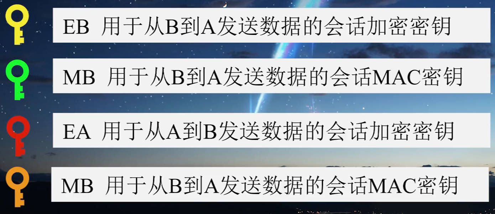 |  |
| ------------------------------------------------------------ | -------------------------------------------------- |


[密码学之RSA+DSA+ECDSA](https://www.bilibili.com/video/BV1MU4y1g7pt/?p=7&vd_source=7346303e5e18677d7261c2c0c109ecfd)   [加密算法：RSA与DSA比较](https://blog.csdn.net/wuli1024/article/details/135271658)   [RSA与DSA对比与应用](https://blog.csdn.net/lsoxvxe/article/details/132176247)   [用Openssl生成可靠的CA证书使网址秒变HTTPS](https://www.bilibili.com/video/BV1CN4y1X77p/?spm_id_from=333.337.search-card.all.click&vd_source=7346303e5e18677d7261c2c0c109ecfd)   

[x509](https://www.cnblogs.com/MichaelShang/p/12557729.html)  [好：公钥、私钥、签名、证书](https://blog.csdn.net/weixin_43269452/article/details/132603785) [key](https://www.cnblogs.com/Lcch/p/16152557.html)     [CFSSL介绍](https://www.cnblogs.com/aldshengdeng/articles/11492123.html)  

- 公钥加密算法：RSA
- 数字签名算法：DSA

```sh
ssh-keygen -t rsa									# 生成公钥	.ssh/id_rsa.pub
ssh-copy-id -i id_rsa.pub  root@192.168.1.130		# 拷贝到远程服务器
ssh root@192.168.1.130:22							# 免密登录
```

 x509证书一般用到三类文件，key，csr，crt

- X.509 ：一种证书格式
  - 根据编码:.crt/pem结尾
  - PEM - Privacy Enhanced Mail,打开看文本格式,以"-----BEGIN..."开头, "-----END..."结尾,内容是==BASE64编码==
- ==Key==:私钥openssl格式，通常rsa算法
- ==Csr==： ==用于申请证书==,Certificate Signing Request，即==证书签名申请==，不是证书，是要求CA给证书签名的一种正式申请，==该申请包含==申请证书的实体的==公钥及该实体店某些信息==。该数据将成为证书的一部分。CSR始终使用它携带的公钥所对应的==私钥进行签名==
- ==crt==：CA认证后的证书，certificate


#### 创建用户

[官网：配置对多集群的访问](https://v1-26.docs.kubernetes.io/zh-cn/docs/tasks/access-application-cluster/configure-access-multiple-clusters/) [用户认证](https://v1-26.docs.kubernetes.io/zh-cn/docs/reference/access-authn-authz/authentication/)  [使用 kubeconfig 文件组织集群访问](https://v1-26.docs.kubernetes.io/zh-cn/docs/concepts/configuration/organize-cluster-access-kubeconfig/)  

[RBAC配置](https://www.h3c.com/cn/d_201905/1182309_30005_0.htm#_Toc519007317)  [openssl生成证书](https://www.cnblogs.com/shuyuanutil/p/17954271)   [OpenSSL命令速查手册：证书、私钥与证书签名请求文件](http://blog.hubwiz.com/2019/03/08/openssl-essentials/)   

[cfssl命令详解](https://www.cnblogs.com/even160941/p/16890124.html)   [Download and install  Go](https://go.dev/doc/install)  [cloudflare/cfssl](https://github.com/cloudflare/cfssl) 

1. 根据k8s的ca.sr根证书，生成新用户的ssl证书
2. 使用新用户的ssl证书生成用户kubeconfig文件
3. 创建角色，给角色设定规则（权限）
4. 绑定用户和角色

```sh
kubectl get clusterrole					# 查看集群角色
# k8s 根证书位置： /etc/kubernetes/pki; k8s模拟ca机构，自己给自己颁发证书，所以有私钥、公钥
# 用户证书：家目录下的config

# 1. 根证书配置文件
cat > ca-config.json <<EOF
{
    "signing": {
        "default": {
            "expiry": "876000h"
        },
        "profiles": {
            "kubernetes": {
                "expiry": "876000h",
                "usages": [
                    "signing",
                    "key encipherment",
                    "server auth",
                    "client auth"
                ]
            }
        }
    }
}
EOF

# 2. 根证书签名请求文件
cat > ca-csr.json <<EOF
{
    "CN": "kubernetes",		# xinjizhiwa 名称
	"hosts": [],
    "key": {
        "algo": "rsa",
        "size": 2048
    },
    "names": [
        {
            "C": "CN",
            "ST": "Shanghai",
            "L": "Shanghai",
            "O": "k8s",
            "OU": "System"
        }
    ],
    "ca": {
        "expiry": "876000h"
	}
}
EOF

# 3. cfssl生成用户ssl证书, 下面命令有问题，只生成csr pem; 自签名文件：根据公钥私钥签名文件生成
cfssl gencert -ca=/etc/kubernetes/pki/ca.crt(公钥) -ca-key=/etc/kubernetes/pki/ca.key（私钥） -config=ca-config.json -profile=kubernetes csr.json（签名文件） | cfssljson -bare myttian

# 4. 生成用户kubeconfig文件的脚本： myttian.kubeconfig     /root/.kube/config 
bash kubeconfig.sh
kubectl config get-contexts --kubeconfig=/root/cfssl/myttian.kubeconfig

kubectl get pod --kubeconfig=myttian.kubeconfig		# 用myttian用户查看pod
```

问题：[You must be logged in to the server (Unauthorized)](https://blog.csdn.net/weixin_54104864/article/details/131228633)     [k8s报错error](https://cloud.tencent.com/developer/article/2171058?areaSource=102001.20&traceId=ZOknPfXrzsERjzWB9cpaG) 

- `要替换文件：cp -i /etc/kubernetes/admin.conf   $HOM/.kube/config`

```sh
#!/bin/bash

# 配置集群，集群可设置多套   kubeconfig.sh
# --certificate-authority：指定k8s的ca证书路径
# --embed-certs：true，将根证书文件内容写入配置文件中； false：只引用配置文件路径
# --server：apiserver地址
# --kubeconfig：kubeconfig配置文件名称
# 集群名字：kubectl config view能查到
kubectl config set-cluster kubernetes \
  --certificate-authority=/etc/kubernetes/pki/ca.crt \
  --embed-certs=true \
  --server=https://192.168.1.130:6443 \
  --kubeconfig=myttian.kubeconfig
 
# 设置客户端认证,客户端将来需要带证书让服务器验证
# 想通过kubectl以myttian的身份来操作集群，需要将mytian的认证信息添加进kubectl的配置，即~/.kube/config中
kubectl config set-credentials myttian \
  --client-key=myttian-key.pem \
  --client-certificate=myttian.pem \
  --embed-certs=true \
  --kubeconfig=myttian.kubeconfig

# 设置默认上下文，用于客户端和服务端绑定
kubectl config set-context myttian@kubernetes \
  --cluster=kubernetes \
  --user=myttian \
  --namespace='helm-test' \
  --kubeconfig=myttian.kubeconfig

# 设置当前使用的上下文
kubectl config use-context myttian@kubernetes --kubeconfig=myttian.kubeconfig
```

[好：Kubernetes创建证书](https://www.cnblogs.com/itzgr/p/11865146.html)   [使用cfssl配置nginx](https://blog.csdn.net/calm0406/article/details/127838421?utm_medium=distribute.pc_relevant.none-task-blog-2~default~baidujs_baidulandingword~default-0-127838421-blog-130841325.235^v43^pc_blog_bottom_relevance_base8&spm=1001.2101.3001.4242.1&utm_relevant_index=3)   [RBAC基于组的方式认证:编写生成kubeconfig文件的脚本](https://blog.csdn.net/LoveYourelf/article/details/131386204)  

[用户kubeconfig文件](https://www.baidu.com/s?ie=UTF-8&wd=%E7%94%A8%E6%88%B7kubeconfig%E6%96%87%E4%BB%B6)  [k8s kubeconfig配置文件](https://www.cnblogs.com/wangguishe/p/17600637.html)  [kubeconfig文件](https://www.cnblogs.com/cosmos-wong/p/16858858.html)   [vim  set paste 解决粘贴乱序问题](https://www.cnblogs.com/wangchengshi/p/11947650.html)  

[多个集群中使用kubectl](https://blog.csdn.net/wwxsoft/article/details/131351577)  [kubectl命令详解](https://baijiahao.baidu.com/s?id=1765639655777692980&wfr=spider&for=pc)   [.kube/config文件如何生成](https://wenku.csdn.net/answer/0a893415c64562712f593a42cfc6f861)   [公钥、私钥、签名、证书](https://blog.csdn.net/weixin_43269452/article/details/132603785)  

1. cfssl生成用户ssl证书   [配置CA证书和秘钥](https://www.cnblogs.com/dgw-1456700390/p/14925597.html)  
   1. 根证书配置文件 ca-config.json	==公钥==
   2. 根证书签名请求文件 ca-csr.json    ==签过名的证书==: 客户端用的签名验证证书
   3. 生成：`cfssl gencert -initca ca-csr.json | cfssljson -bare ca #生成CA密钥（ca-key.pem）和证书（ca.pem）`
2. 生成用户kubeconfig文件: myttian.kubeconfig
   1. `kubectl使用kubeconfig认证文件连接k8s集群，使用kubectl config生成kubeconfig文件`
   2. 用yaml比用脚本好用    [使用 kubeconfig 进行多集群管理 ](https://blog.csdn.net/m0_51964671/article/details/135327070) 

3. 创建角色编写规则
4. 绑定用户和角色
5. 测试
   1. `scp myttian.kubeconfig node1:/root`


#### 创建角色

[k8s创建role](https://www.baidu.com/s?ie=UTF-8&wd=k8s%E5%88%9B%E5%BB%BArole)  [使用 kubeconfig 进行多集群管理](https://blog.csdn.net/m0_51964671/article/details/135327070)  [k8s权限管理RBAC详解](https://www.cnblogs.com/liugp/p/16438284.html#1%E5%88%9B%E5%BB%BAk8s-%E7%94%A8%E6%88%B7%E5%92%8C%E7%94%A8%E6%88%B7%E7%BB%84)  [kubectl config上下文里指定所有命名空间](https://www.baidu.com/s?ie=utf-8&f=8&rsv_bp=1&tn=baidu&wd=kubectl%20config%E4%B8%8A%E4%B8%8B%E6%96%87%E9%87%8C%E6%8C%87%E5%AE%9A%E6%89%80%E6%9C%89%E5%91%BD%E5%90%8D%E7%A9%BA%E9%97%B4&rn=20&oq=kubectl%2520config&rsv_pq=fed4e3a200a4eec9&rsv_t=f36ctA32A5Un08heJPJ8XEQSHEhvI8b%2F1RDqTWU%2FH3XvNJ1m8tLNYROBvyA&rqlang=cn&rsv_enter=1&rsv_dl=tb&rsv_sug3=39&rsv_sug1=25&rsv_sug7=100&bs=kubectl%20config)  [kubeconfig](https://www.jianshu.com/p/3c3ac5762f40)   [Kubernetes Role创建和Rolebinding](https://blog.csdn.net/weixin_40228200/article/details/124486768)  

```shell
cat >Role-001.yaml<<EOF
kind: Role
apiVersion: rbac.authorization.k8s.io/v1
metadata:
  namespace: default
  name: pod-role
rules:
  # 声明api组，""代表v1，apps代表apps/v1
- apiGroups: ["","apps"] 
  # 声明api组下面的资源类型，只能写全称
  resources: ["pods","deployments"]
  # 权限：使用方式，增删改查
  verbs: ["get", "watch", "list","delete"]
EOF

# kubectl get role -A
# kubectl describe role/kube-proxy -n kube-system
```

#### 绑定用户和角色

```yaml
apiVersion: rbac.authorization.k8s.io/v1
kind: RoleBinding
metadata:
  name: myttian-bind
  namespace: helm-test
# 声明绑定的角色:pod-role
roleRef:
  apiGroup: rbac.authorization.k8s.io
  kind: Role
  name: pod-role
# 声明绑定的用户:myttian
subjects:
- apiGroup: rbac.authorization.k8s.io
  kind: User
  name: myttian
```

#### 用户组

[etcd使用Cfssl生成自签证书(pem)](https://www.cnblogs.com/yangzp/p/15692046.html)  

| 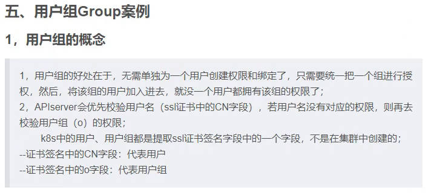 | 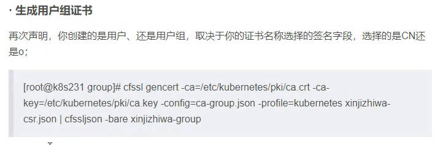 |
| -------------------------------------------------- | -------------------------------------------------- |

- 创建用户加入用户组

#### sa账户   

[k8s集群的RBAC视频](https://www.bilibili.com/video/BV19z421d7sH/?spm_id_from=333.788&vd_source=7346303e5e18677d7261c2c0c109ecfd) [CloudFlare 开源证书管理工具](https://zhuanlan.zhihu.com/p/596891203)   [配置CA证书和秘钥 ](https://www.cnblogs.com/dgw-1456700390/p/14925597.html)  [CFSSL介绍 ](https://www.cnblogs.com/aldshengdeng/articles/11492123.html)  

sa是k8s中的一个资源，不需要证书创建，

- 创建
  - 声明式创建: yaml
  - 响应式创建:kubectl create sa myttian
- 授权sa对k8s-api的访问权限
  - 创建角色
  - sa账号和角色绑定


helm2由客户端helm命令行工具，和服务端tiller组成

为了安装tiller，需要kubeconfig文件,因为k8s apiserver开启了RBAC访问控制  

```yaml
# pod has unbound immediate PersistentVolumeClaims,用dashboard写个pv
apiVersion: v1
kind: PersistentVolume
metadata:
  name: my-release-mongodb
  namespace: helm-test
spec:
  capacity:
    storage: 8Gi
  volumeMode: Filesystem  # Filesystem（文件系统） Block（块）
  accessModes:
    - ReadWriteOnce       # 卷可以被一个节点以读写方式挂载
  persistentVolumeReclaimPolicy: Delete
  storageClassName: local-storage
  local:
    path: /data2
  claimRef:
    kind: PersistentVolumeClaim
    namespace: helm-test
    name: my-release-mongodb
    uid: 3be96b1b-476b-4d1c-9004-abd73a0a428f
    apiVersion: v1
    resourceVersion: '389577'
  nodeAffinity:
    required:
      nodeSelectorTerms:
        - matchExpressions:
            - key: kubernetes.io/hostname
              operator: In
              values:
                - node1
```

==Helm 3 与 Helm 2 的区别==  [Helm3移除了tiller](https://blog.csdn.net/qq_51545656/article/details/136648792) 

- Helm 2：在 Helm 2 中，采用了客户端-服务器模型，其中客户端是 Helm，服务器端是 Tiller。Tiller 作为 Kubernetes 集群中的一个 Deployment 运行，负责管理 Helm 的 Release 和执行 Kubernetes 操作。
- Helm 3：Helm 3 移除了 Tiller，简化了架构。现在，Helm 客户端直接与 Kubernetes API 服务器通信，执行所有的 Kubernetes 操作。这减少了复杂性，并提高了安全性，因为不再需要在集群中运行一个具有广泛权限的 Tiller 服务

```yaml
apiVersion: v1
kind: ServiceAccount
metadata:
 name: tiller
 namespace: kube-system
---
apiVersion: rbac.authorization.k8s.io/v1
kind: ClusterRoleBinding
metadata:
 name: tiller
roleRef:
 apiGroup: rbac.authorization.k8s.io
 kind: ClusterRole
 name: cluster-admin
subjects:
 - kind: ServiceAccount
   name: tiller
   namespace: kube-system
# kubectl create(apply) -f rbac-config.yaml
# helm init --service-account tiller --skip-refresh 
```

##### 自定义chart

 [==精品==：多 Chart 集成管理](https://www.zhaowenyu.com/helm-doc/chart_best_practices/mult_charts_manager.html)  [==精品==：Helm 文件 ](https://www.zhaowenyu.com/helm-doc/files/)  [Helm依赖管理](https://www.zhaowenyu.com/helm-doc/chart/dependency.html)   [chart修改安装时的YAML配置](https://www.baidu.com/s?ie=UTF-8&wd=helm%E5%AE%89%E8%A3%85%E6%80%8E%E4%B9%88%E6%94%B9yaml)   [Kubernetes YAML Generator](https://k8syaml.com/) 

[.tpl文件](https://blog.csdn.net/Guzarish/article/details/131486571)    [==精华==：helm实战之开发Chart](https://www.cnblogs.com/xiao987334176/p/12753979.html)  [开发Chart](https://cloud.tencent.com/developer/article/1627270)   [干运行--dry-run=server](https://blog.csdn.net/w_monster/article/details/122824266)    

[Helm模版开发文档](https://blog.csdn.net/qq_24095941/article/details/88126207)   [helm 中共享tpl写法](https://zhuanlan.zhihu.com/p/589171692) [精品：chart](https://zhuanlan.zhihu.com/p/652375619)   [helm中的_helpers.tpl文件语法解析](https://download.csdn.net/blog/column/10990116/135667698)   [Helm中Values与Templates的使用技巧](https://wenku.csdn.net/column/7nys4g0eit)  

[helm模板文件chart编写语法详解](https://www.yisu.com/jc/24160.html)  [编写一个chart和helm3内置对象](https://zhuanlan.zhihu.com/p/642185489)   [chart模板文件](https://www.cnblogs.com/DaweiJ/articles/8779256.html)   [helm模板文件chart编写语法详解](https://www.553668.com/manong/1415818.html)     [helm回滚和升级-钩子执行顺序](https://cloud.tencent.com/developer/information/helm%E5%9B%9E%E6%BB%9A%E5%92%8C%E5%8D%87%E7%BA%A7-%E9%92%A9%E5%AD%90%E6%89%A7%E8%A1%8C%E9%A1%BA%E5%BA%8F-article)  

 [helm 简介及基本使用](https://developer.aliyun.com/article/1157069)      

[微服务架构的现状与未来：服务网格与云原生趋势解析](https://www.cnblogs.com/ithan/p/17921087.html#Helm_111)   [helm是什么](https://www.51cto.com/article/785820.html)  [tpl语法](https://wenku.baidu.com/view/02a38799084e767f5acfa1c7aa00b52acec79c2f.html?_wkts_=1713375398493&bdQuery=tpl%E6%96%87%E4%BB%B6+helm)  

chart开发工具： [Charts工具](https://www.51cto.com/article/594141.html)  [快速生成 Helm Chart 包-Rainbond](https://blog.csdn.net/qq_66950002/article/details/131995390)     [开发者必备的3款Kubernetes工具](https://kgc.cn/brand/article/detail/599.shtml)  [helm chart开发工具](https://www.baidu.com/s?ie=utf-8&f=8&rsv_bp=1&tn=baidu&wd=helm%20%20chart%E5%BC%80%E5%8F%91%E5%B7%A5%E5%85%B7&rn=20&oq=helm%25E5%2588%259B%25E5%25BB%25BAchart%25E5%25B7%25A5%25E5%2585%25B7&rsv_pq=ac5053970067e044&rsv_t=077agepYnxD9%2B228P21QbKrwb0dWZbplWJwaoqR3M3S4BJZxWPuV5BJntvs&rqlang=cn&rsv_enter=1&rsv_dl=tb&rsv_btype=t&inputT=8445&rsv_sug3=23&rsv_sug1=18&rsv_sug7=100&rsv_sug2=0&rsv_sug4=85725)  

- ==values.schema.json==  ： 对 values.yaml 文件的一种==格式约束==，保障了 values.yaml 的字段和值符合严格的约束条件   [values.schema.json 格式约束](https://www.zhaowenyu.com/helm-doc/files/values-schema-json.html) 

```shell
# 使用--set
helm install my-release my-chart --set key1=value1,key2=value2

# 通过值文件（value files）覆盖配置
helm install my-release my-chart -f my-values.yaml

# 直接编辑charts/<chart-name>/templates/目录下的YAML文件，然后重新打包chart
# 如果想修改一个名为my-chart的chart中my-config.yaml的配置项，可以创建一个values.yaml文件并覆盖该配置项
# values.yaml
myConfig:
  key1: newValue1
  key2: newValue2
  
helm install my-release my-chart -f values.yaml
```


```sh
helm create tomcat		# 1. 创建一个chart包
# 变量在tomcat/values.yaml中定义, template中引用变量

# 修改values.yaml中变量值，  修改template/deployment.yaml

# 2. 创建一个release实例: install 检查和部署
# 安装时，可以使用 --set 覆盖默认的变量值，如image.tag=latest, helm install mychart ./mychart --set image.tag=latest
# install安装一个新的包，upgrade对包进行配置的更新
helm install --dry-run --debug tomcat		# 试运行
helm install tomcat							# 部署

# 删除chart
helm list
helm delete alternating-shark

# 常用命令
kubectl exec -it alternating-shark-tomcat-55fb7596d5-wpdkj /bin/sh
helm get manifest tomcat-test				# 查看部署信息，release名字
kubectl get secrets my-mongodb -o json		# 查看密码
```

==Charts 的结构==

- `.tpl` 表示帮助文件   [精品：chart](https://zhuanlan.zhihu.com/p/652375619) 

```yaml
mychart/
  Chart.yaml		# 当前chart基本信息
  values.yaml		# 全局变量及参数
  charts/			# 依赖其他包的charts文件， 保存子Chart
  templates/		# k8s 的资源模板文件
  ...
```

templates有两个比较重要的文件：

- `_helpers.tpl`，自定义模版函数，可以把函数写在_helpers，然后渲染模版时用； 下划线开头的文件,可以被其他模板引用
- `NOTES.txt`：当helm install 后，会在尾部打印输出Note信息，内容就是NOTES.txt中安装完毕后的提醒信息，一般输出怎么用或者怎么升级

==变量说明==：  helm3常用的内置对象

Release对象、Values对象、Chart对象、Capabilities对象、Template对象

```yaml
# 内置对象
Release：			# 用来描述 release 本身
Chart：				# Chart.yaml里的内容
Values：
Files：
Capabilities：		# k8s集群相关信息
Template：
```

**Values：的详细说明**,它的值有四个来源, 优先级从上到下依次增加，即 `--set` 最高

- `values.yaml` 文件
- 如果这是个子 chart，其父 chart 的 `Values.yaml` 文件
- 在 `helm install` 或 `helm upgrade` 时，通过 `-f` 指定的文件
- 通过 `--set` 指定的参数（ 例：helm install --set foo=bar ./mychart ）

==Helm依赖管理==

在 Helm 中，一个 Chart 可能依赖于任何数量的其他 Chart。

虽然有一些团队需要手动管理依赖关系的优势，但声明依赖关系的首选方法是使用 Chart 内部管理文件。

1. Helm v2 版本v通过 requirements.yaml 文件动态链接或引入 charts/ 目录并手动管理。
2. Helm v3 版本通过 Charts.yaml 中 dependencies 配置，同样管理 charts/ 目录。
3. 配置使用方式 [Chart.yaml 文件与 Chart 对象](https://www.zhaowenyu.com/helm-doc/chart/chart-chart-yaml.md) 。
4. 依赖的管理命令 [helm dependency](https://www.zhaowenyu.com/helm-doc/helm-cmd/helm_dependency.html)

##### k8s健康检查

[健康检查（就绪性探针 和 存活性探针）](https://www.cnblogs.com/liugp/p/16630873.html)  [探针](https://www.51cto.com/article/745243.html)  [存活性、就绪性探测 及容器生命周期回调](https://www.cnblogs.com/ymei/p/13716496.html)  [如何探测内网存活主机](https://cloud.tencent.com/developer/article/1705871)  [Kubernetes之Probe探针](https://zhuanlan.zhihu.com/p/562737135)  [健康检查-从Readiness和Liveness 探针说起](https://cloud.tencent.com/developer/article/1985338) [探针介绍及应用](https://blog.csdn.net/weixin_46476452/article/details/128116163) [k8s之Pod容器的探针](https://blog.csdn.net/ll945608651/article/details/131777086) [存活探_百度搜索](https://www.baidu.com/s?ie=UTF-8&wd=%E5%AD%98%E6%B4%BB%E6%8E%A2) 

### 安装kubens

[kubens](https://k8s.easydoc.net/docs/dRiQjyTY/28366845/6GiNOzyZ/3iQiyInr) [ahmetb/kubectx](https://github.com/ahmetb/kubectx?tab=readme-ov-file#manual-installation-macos-and-linux) 

- Download the `kubectx`, and `kubens` scripts.
- Either:
  - save them all to somewhere in your `PATH`,
  - or save them to a directory, then create symlinks to `kubectx`/`kubens` from somewhere in your `PATH`, like `/usr/local/bin`
- Make `kubectx` and `kubens` executable (`chmod +x ...`)

```bash
sudo git clone https://github.com/ahmetb/kubectx /opt/kubectx
sudo ln -s /opt/kubectx/kubectx /usr/local/bin/kubectx
sudo ln -s /opt/kubectx/kubens /usr/local/bin/kubens
```

### helm安装mongodb

[linux安装oci](https://www.idc.net/help/67378/) [深入了解 runc 和 OCI 规范](https://cloud.tencent.com/developer/article/1895808)   

[MongoDB 连接失败 (连接被拒绝)](https://geek-docs.com/mongodb/mongodb-questions/189_mongodb_mongodb_connection_failed_connection_refused.html?action=all)  [MongoDB Shell工具：mongosh](https://blog.csdn.net/qq_28550263/article/details/119892582) 

[helm部署的服务如何修改配置](https://www.cnblogs.com/bolingcavalry/p/13766378.html)  [Helm Chart部署 Redis](https://zhuanlan.zhihu.com/p/672713998) 


# 9、==Ingress==

[什么是 Ingress？](https://www.bilibili.com/video/BV18K421e757/?spm_id_from=333.1007.tianma.1-3-3.click&vd_source=7346303e5e18677d7261c2c0c109ecfd) 

**小结：**  可以==根据域名、路径==把请求转发到不同的 Service

Ingresses、 Ingress Classes

- Overlay：让集群的网络形成一个整体，绑定一起

- ingress：特殊的Overlay网络！负载均衡的功能！IPVS VIP

```sh
# 视频14分钟讲ingress
# 后端服务：http://81.71.20.220/-->test-k8s:8000
## 负载均衡器的ip：81.71.20.220， 把请求转发到这个服务：test-k8s
```

**介绍**

Ingress 为外部访问集群提供了一个 **统一** 入口，避免了对外暴露集群端口；
功能类似 Nginx，可以==根据域名、路径==把请求转发到不同的 Service。可以配置 https


**使用**

- 要使用 Ingress，需要一个==负载均衡器 + Ingress 和 Controller== ，ingress要配置一个Controller去执行逻辑

- 裸机（bare metal) 搭建的集群，需要装负载均衡插件，可以安装 [METALLB](https://metallb.universe.tf/)

**正反代理**

正向代理和反向代理的主要区别在于它们==所代理的对象以及使用的场景不同==。

- ==代理对象不同==。正向代理是代表客户端，客户端向代理服务器发送请求并指定目标服务器，代理服务器将请求转发给目标服务器，并将响应返回给客户端；反向代理是代表服务端，客户端向反向代理服务器发送请求，反向代理服务器将请求转发给目标服务器，并将响应返回给客户端。
- ==场景不同==。正向代理常用于客户端无法直接访问某些资源时，例如科学上网、加速、访问缓存数据和隐藏后端；反向代理常用于保护服务器和负载均衡。
- 负载均衡和安全性不同。正向代理不会对客户端发出的请求进行拦截或修改，可以隐藏客户端的真实IP地址和身份信息；反向代理可以实现负载均衡、缓存、SSL加密等操作，提高服务器的性能和安全性

# 10、角色和策略

[RBAC模型：基于用户-角色-权限控制](https://www.woshipm.com/pd/1150093.html)  [用户角色模型理解](https://zhuanlan.zhihu.com/p/631252881)  [用户，用户组，角色，权限之间的关系该怎么设计](https://www.zhihu.com/question/446439707/answer/2416642245?utm_id=0)    [RBAC用户、角色、权限、组设计方案_角色管理 组织管理 用户管理 的关系](https://blog.csdn.net/ljw499356212/article/details/81055141)   [IAM_aws用户、用户组、角色和策略之间的关系](https://blog.csdn.net/weixin_45909424/article/details/124127164)   [用户 用户组 角色 策略_百度搜索](https://www.baidu.com/s?ie=UTF-8&wd=%E7%94%A8%E6%88%B7%20%E7%94%A8%E6%88%B7%E7%BB%84%20%E8%A7%92%E8%89%B2%20%E7%AD%96%E7%95%A5) 

[JIRA笔记：用户、组、角色、权限方案](https://www.cnblogs.com/Ming8006/p/12302488.html) 

# 11、可视化界面

[部署和访问Dashboard_官网_用helm不会装](https://v1-26.docs.kubernetes.io/zh-cn/docs/tasks/access-application-cluster/web-ui-dashboard/)   [dashboard v2.7.0创建一个所有权限的账号](https://cloud.tencent.com/developer/article/2206581) 

[Kubernetes dashboardv2.7.0安装](https://zhuanlan.zhihu.com/p/655525723) [kubernetes-dashboard](https://blog.51cto.com/u_14557442/9183628)  [蓝易云：配置k8s的一个serviceaccount具有管理员权限并获取他的token](https://blog.csdn.net/tiansyun/article/details/133816679)  [kubernetes-dashboard(1.8.3)部署与踩坑](https://www.cnblogs.com/webenh/p/11579792.html) 

[kubernetes/dashboard](https://github.com/kubernetes/dashboard)     [dashboard安装](https://github.com/sskcal/kubernetes/tree/main/dashboard)  [部署Dashboard视频](https://www.bilibili.com/video/BV1Az4y1k7nn/?spm_id_from=333.337.search-card.all.click&vd_source=7346303e5e18677d7261c2c0c109ecfd)    [用户认证](https://kubernetes.io/zh-cn/docs/reference/access-authn-authz/authentication/) [创建dashboard用户并获取令牌登录dashboard](https://www.bilibili.com/video/BV1iL411o7eC/?spm_id_from=333.337.search-card.all.click&vd_source=7346303e5e18677d7261c2c0c109ecfd)  

[详细全面](https://space.bilibili.com/680461243/video?tid=0&pn=1&keyword=&order=pubdate) [Helm2搭建Dashboard](https://www.bilibili.com/video/BV14s4y1R7Bs/?spm_id_from=333.337.search-card.all.click&vd_source=7346303e5e18677d7261c2c0c109ecfd)  [内容全声音不行参考用](https://space.bilibili.com/603268/video) 

**通过以下命令部署**

```bash
kubectl apply -f https://raw.githubusercontent.com/kubernetes/dashboard/v2.7.0/aio/deploy/recommended.yaml

#对外暴露Dashboard，编辑kubernetes-dashboard服务
kubectl -n kubernetes-dashboard edit svc kubernetes-dashboard

#type: ClusterIP, 只能在集群内部访问
#改为
#type: NodePort

#查看svc
kubectl -n kubernetes-dashboard get svc
#看到端口3xxxx, 登录需要token
#https://192.168.0.199:3xxxx
helm status kubernetes-dashboard
```

默认创建的serviceaccount/kubernetes-dashboard 不是所有权限，所以我们要创建一个所有权限的账号

**创建ServiceAccount： 用户**

```yaml
# 创建服务账户  kubectl apply -f dashboard-adminuser.yaml
---
apiVersion: v1
kind: ServiceAccount
metadata:
 name: admin-user
 namespace: kubernetes-dashboard
```

**给sa绑定角色cluster-admin**: 授予用户admin权限

```yaml
# kubectl apply -f dashboard-clu.yaml
---
apiVersion: rbac.authorization.k8s.io/v1
# 用户绑定为集群角色
kind: ClusterRoleBinding
metadata: 
 name: admin-user
roleRef:
 apiGroup: rbac.authorization.k8s.io
 kind: ClusterRole
 name: cluster-admin
subjects:
- kind: ServiceAccount
  name: admin-user
  namespace: kubernetes-dashboard
  
# 下面也是
apiVersion: v1 
kind: ServiceAccount 
metadata: 
  labels: 
    k8s-app: kubernetes-dashboard 
  name: dashboard-admin 
  namespace: kubernetes-dashboard 
--- 
apiVersion: rbac.authorization.k8s.io/v1 
kind: ClusterRoleBinding 
metadata: 
  name: dashboard-admin-cluster-role 
roleRef: 
  apiGroup: rbac.authorization.k8s.io 
  kind: ClusterRole 
  name: cluster-admin 
subjects: 
  - kind: ServiceAccount
    name: dashboard-admin
    namespace: kubernetes-dashboard
    
    
# kubectl describe serviceaccount dashboard-admin
# kubectl describe secrets dashboard-admin-token-nbvc2
```

**获取登录token**

[kubectl get secre](https://www.baidu.com/s?ie=UTF-8&wd=kubectl%20create%20token) 

[PKI证书体系（数字证书）](https://blog.csdn.net/weixin_42334426/article/details/136554916) [k8s证书更新](https://zhuanlan.zhihu.com/p/682722322)   [PKI体系及常见证书](https://cloud.tencent.com/developer/article/2126523?areaSource=102001.4&traceId=ATcWfVYJk8KsxrnS3cQtD) [kubernetes的PKI证书](https://blog.csdn.net/rendongxingzhe/article/details/124682560) 

```bash
#创建服务账户
kubectl apply -f ./dashboard-adminuser.yaml
#创建一个ClusterRoleBinding
kubectl apply -f ./dashboard-ClusterRoleBinding.yaml

#获取用户令牌：token
kubectl -n kubernetes-dashboard describe secret $(kubectl -n kubernetes-dashboard get secret | grep admin-user | awk '{print $1}')

kubectl get secret $(kubectl get serviceaccount my-service-account -o jsonpath='{.secrets[0].name}') -o jsonpath='{.data.token}' | base64 --decode
```

**kubeconfig登录** 

[通过kubeconfig登陆k8s的dashboard](https://blog.51cto.com/u_14848702/5055341)  [用kubeconfig登陆](https://blog.csdn.net/zhou920786312/article/details/126242642)  [用kubeconf登录](https://blog.csdn.net/m0_59615922/article/details/129181656) 

1. 创建用户，绑定角色

   ```bash
   kubectl create namespace nsmeryl
   kubectl create serviceaccount meryl-admin -n nsmeryl
   
   kubectl create rolebinding meryl-admin-token-mvlz9  -n nsmeryl  --clusterrole=cluster-admin --serviceaccount=nsmeryl:meryl-admin
   ```

   

2. 创建kubeconfig文件:  cd /etc/kubernetes/pki

   ```bash
   kubectl config set-cluster kubernetes --certificate-authority=./ca.crt --server="https://192.168.1.130:6443"  --embed-certs=true  --kubeconfig=/root/lucky-admin.conf
   ```

   

3. 创建credentials: ==设置kubeconfig文件中的token==

   ```bash
   DEF_NS_ADMIN_TOKEN=$(kubectl get secret meryl-admin-token-mvlz9 -n nsmeryl  -o jsonpath={.data.token}|base64 -d)
   
   kubectl config set-credentials nsmeryl --token=$DEF_NS_ADMIN_TOKEN  --kubeconfig=/root/lucky-admin.conf
   ```

4. 设置kubeconfig文件中的context

   ```bash
   kubectl config set-context nsmeryl@kubernetes --cluster=kubernetes --user=nsmeryl --kubeconfig=/root/lucky-admin.conf
   ```

5. 切换context的current-context是nsmeryl@kubernetes

   ```bash
   kubectl config use-context nsmeryl@kubernetes --kubeconfig=/root/lucky-admin.conf
   ```

   

# 12、扩展

## KubeSphere

[面向云原生应用的容器混合云，支持 Kubernetes 多集群管理的PaaS容器云平台解决方案 | KubeSphere](https://www.kubesphere.io/zh/)    [KubeSphere玩转k8s自动化部署流水线](https://www.bilibili.com/video/BV1fV4y137WF/?vd_source=7346303e5e18677d7261c2c0c109ecfd)     [使用Jenkinsfile创建流水线](https://www.bilibili.com/video/BV18q4y1u7NG/?spm_id_from=333.337.search-card.all.click&vd_source=7346303e5e18677d7261c2c0c109ecfd)  

[K8s 安全策略 PSP 和 securityContext ](https://www.bilibili.com/video/BV1up421274R/?spm_id_from=333.1007.tianma.1-2-2.click&vd_source=7346303e5e18677d7261c2c0c109ecfd) [Kong/kubernetes-ingress-controller](https://github.com/Kong/kubernetes-ingress-controller)  [kubernetes/dashboard](https://github.com/kubernetes/dashboard)  

## k8s资源

[k8s的api-resources资源类型](https://blog.csdn.net/ChaITSimpleLove/article/details/110455619)  [kubectl explain](https://blog.csdn.net/woyaot1/article/details/92802654?utm_medium=distribute.pc_relevant.none-task-blog-2~default~baidujs_baidulandingword~default-4-92802654-blog-110455619.235^v43^pc_blog_bottom_relevance_base8&spm=1001.2101.3001.4242.3&utm_relevant_index=7)   [k8s中的所有api-resources类型](https://zhuanlan.zhihu.com/p/115903242) 

[替换StatefulSet_云容器实例](https://support.huaweicloud.com/api-cci/replaceAppsV1NamespacedStatefulSet.html) [云原生应用安全防护思考--国家保密局互联网门户网站](http://www.gjbmj.gov.cn/n1/2023/0607/c411145-40008306.html) 

**常用api资源查看命令**

```bash
kubectl get cs						# 查看master组件状态
kubectl get node					# 查看node状态
kubectl cluster-info				# 查看Api-server代理的URL
kubectl cluster-info dump			# 查看集群详细信息
kubeclt describe <资源> <名称> 		 # 查看资源信息
kubectl describe node				# 查看节点详细信息
kubectl describe node k8s-master	# 查看master节点详细信息
kubectl describe node k8s-node01	# 查看node节点详细信息
kubectl get pod <Pod名称> --watch	  # 查看Pod资源信息
kubectl explain <资源名,例如pod>		 # 查看资源对象拥有的字段， --recursive列出所有api字段
kubectl explain svc --recursive
kubectl explain <资源对象名称.api名称> # 查看具体字段， kubectl explain svc.spec.ports
```

## api-server 

[kubectl技巧之查看资源列表](https://blog.csdn.net/woyaot1/article/details/92802654?utm_medium=distribute.pc_relevant.none-task-blog-2~default~baidujs_baidulandingword~default-4-92802654-blog-110455619.235^v43^pc_blog_bottom_relevance_base8&spm=1001.2101.3001.4242.3&utm_relevant_index=7)   [一文读懂 Kubernetes APIServer 原理](https://cloud.tencent.com/developer/article/1774436)  [一文读懂 Kubernetes APIServer 原理](https://brands.cnblogs.com/tencentcloud/p/10925) 

[设计一个定时扩缩容容器的operator](https://www.bilibili.com/video/BV1jJ4m1j7gK/?spm_id_from=333.1007.tianma.1-2-2.click&vd_source=7346303e5e18677d7261c2c0c109ecfd) [用户自行扩展k8s的api资源](https://blog.51cto.com/u_16506291/9955455)   

[K8s创建资源方式](https://www.cnblogs.com/cheyunhua/p/16205286.html)  

api-server 的作用：

- 集群的统一入口
- 协作其他组件（内部有部分api代理）

## Kong

[分布式 API 网关 Kong网关简介 ](https://zhuanlan.zhihu.com/p/531804692) [Kong ](https://www.jianshu.com/p/b44400618c69) [Kong ](https://baijiahao.baidu.com/s?id=1682207939657360739&wfr=spider&for=pc) [kong原理及使用](https://blog.51cto.com/voice/5524786)  

**Kong主要有三个组件：**

1. Kong Server ：基于nginx的服务器，用来接收API请求。
2. Apache Cassandra/PostgreSQL ：用来存储操作数据。
3. Kong dashboard：官方推荐UI管理工具，也可以使用 restfull 方式 管理admin api

Kong 是一个开源的微服务网关，但又不只是一个网关，它还集成了服务注册和发现、负载均衡、健康检查等功能，不需要单独部署和维护其它的功能组件，大大降低了维护成本。

同时 Kong 通过插件来提供限流、熔断、监控、日志等能力，将原本需要在代码中完成的功能全部移到 Kong 服务端完成，减少了对服务本身代码的侵入，代码改造成本大大降低。

在 Kong 的微服务架构中，Kong 担当了注册中心的角色，服务提供者（Provider）首先将服务信息注册到 Kong，服务消费者（Consumer）调用服务的过程是调用端先将请求发到 Kong，再通过 Kong 把请求转发到服务提供者而实现间接调用

## Yaml

[JSON / YAML 转换工具 ](https://tools.fun/json2yaml.html)  

yaml文件目的在于建立资源

```yaml
spec		# Specification  规格;规范;说明书;明细单
```

## k8s管理工具

[Rancher](https://www.cnblogs.com/zhangxingeng/p/11753959.html) [Rancher官方文档](https://docs.rancher.cn/)   [Ansible](https://www.cnblogs.com/zhangxingeng/p/12503376.html)   

# 13、容器运行时

[k8s安装_containerd](https://blog.csdn.net/YinJuan791739156/article/details/132510580)  