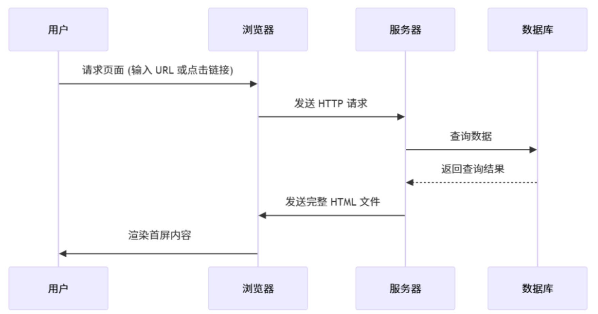
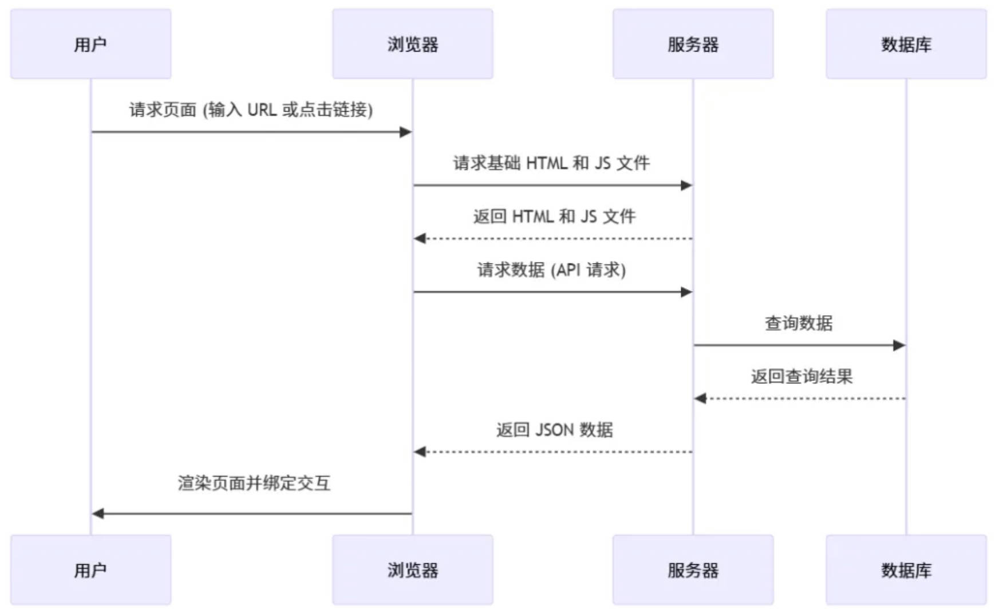

https://powerdong.github.io/myBlog/2019/06/29/%E8%AE%B0%E4%B8%80%E6%AC%A1%E5%B0%8F%E7%A8%8B%E5%BA%8F%E5%BC%80%E5%8F%91/

[lemonitor](https://lework.github.io/lemonitor/#/)	

日元转人民币： 1/20， 去0除以2, 或乘以0.05

# 专业课

[电子通信牢九门](https://www.bilibili.com/video/BV1qP9GYTEcE/?vd_source=7346303e5e18677d7261c2c0c109ecfd)

[电气四大天书](https://www.bilibili.com/video/BV18LPMezE85/?vd_source=7346303e5e18677d7261c2c0c109ecfd)		

[自动化牢九门](https://www.bilibili.com/video/BV1KcKHe5EDd/?vd_source=7346303e5e18677d7261c2c0c109ecfd)	

[机械牢九门](https://www.bilibili.com/video/BV1H4NGerEGL/?vd_source=7346303e5e18677d7261c2c0c109ecfd)	

[能动学科牢九门](https://www.bilibili.com/video/BV19xAceREGF/?vd_source=7346303e5e18677d7261c2c0c109ecfd)	

# AI编程助手

## Cursor

[Cursor_百度搜索](https://www.baidu.com/s?ie=UTF-8&wd=Cursor)	[Cursor - The AI Code Editor](https://www.cursor.com/cn)	

视频：[Cursor 教程](https://www.bilibili.com/video/BV1yorUYWEGD/?vd_source=7346303e5e18677d7261c2c0c109ecfd)	[cursor_bili](https://search.bilibili.com/all?vt=41324561&keyword=cursor&search_source=5)	


# 云端知识库

[云端知识库_百度搜索](https://www.baidu.com/s?ie=UTF-8&wd=%E4%BA%91%E7%AB%AF%E7%9F%A5%E8%AF%86%E5%BA%93)	[建议大家尽早开始搭建个人数据库](https://www.bilibili.com/video/BV1jM9ZYwEqJ/?vd_source=7346303e5e18677d7261c2c0c109ecfd)	

[高效管理：8款适合百人团队的知识库工具](https://baijiahao.baidu.com/s?id=1808147287799360245&wfr=spider&for=pc)	 [云端知识库对比：2023年优秀的8款在线知识库工具](https://baijiahao.baidu.com/s?id=1775728102932914617&wfr=spider&for=pc)	[8款云端知识库管理软件对比本地软件](https://mbd.baidu.com/newspage/data/dtlandingsuper?nid=dt_5102050415417756456&sourceFrom=search_a)	

[Areadocs: 新一代云端知识库平台](https://areadocs.com/)	

[语雀](https://www.yuque.com/yuque/ng1qth/about)	

==动态文档生成工具== ：Docsify、 VuePress、Docute 、Hexo 

工具：

MobaXterm

[程序员学习工作必备网站](https://mbd.baidu.com/newspage/data/dtlandingsuper?nid=dt_5032186961538988089&sourceFrom=search_a)	

# 代码托管

[码云gitee的Pages服务下线](https://www.zhihu.com/question/655233802)	[10个代码托管平台](https://zhuanlan.zhihu.com/p/33904396)	[6个免费Git代码托管平台](https://cloud.tencent.com/developer/article/1414120)	

[git最著名的服务网站有哪些](https://worktile.com/kb/ask/205009.html)	 [Gitee与GitCode](https://cloud.tencent.com/developer/article/2519226?policyId=20240001&frompage=seopage)	

## Coding

[G-WYOE5183 的工作台](https://g-wyoe5183.coding.net/user)	 [使用Coding Pages和Gridea搭建个人博客](https://zhuanlan.zhihu.com/p/166114376)	[Coding Pages_百度搜索](https://www.baidu.com/s?ie=UTF-8&wd=Coding%20Pages)	

`git@e.coding.net:g-wyoe5183/chukuai/develop.git`

## GitHub

[GitHub.com上的那些东西你都知道什么意思吗](https://cloud.tencent.com/developer/article/1560263) 

### badge标识

[github README添加badge标识](https://www.cnblogs.com/knuzy/p/15320038.html)	[Github 仓库 README.md 里面的 badge 怎么生成的](https://juejin.cn/post/7327101630146396210)	[github-badges：一键生成README badges](https://blog.csdn.net/gitblog_01125/article/details/146723134)   [github badge_百度搜索](https://www.baidu.com/s?ie=utf-8&f=8&rsv_bp=1&tn=baidu&wd=github%20badge&oq=badge&rsv_pq=d7fb22890008781d&rsv_t=0de2OiR%2F0U%2FiETixLhlE9d78u58jE%2F71qngC%2Bar5FkuqG7Z59shJQwLjvI0&rqlang=cn&rsv_enter=1&rsv_dl=tb&rsv_btype=t&inputT=2616&rsv_sug3=10&rsv_sug1=5&rsv_sug7=100&rsv_sug2=0&rsv_sug4=3747)	[README.md文档如何添加丰富多彩的badge标识](https://blog.csdn.net/weixin_42343307/article/details/147635282)		[README.md](https://www.baidu.com/s?ie=UTF-8&wd=README.md%E9%87%8C%E9%9D%A2%E7%9A%84tag) 	

README添加badge标识，多彩的tag标签	

### GitHub Pages

[多项目部署在同一个GitHub Pages](https://www.cnblogs.com/dev2007/p/13947333.html)	

[单个GitHub帐号下添加多个GitHub Pages的相关问题](https://segmentfault.com/a/1190000003946969)	


教程： [GitHub Pages官方](https://pages.github.com/)	[GitHub Pages 使用入门 ](https://docs.github.com/cn/enterprise-server@2.20/github/working-with-github-pages/getting-started-with-github-pages) 

[github-page](https://www.zhihu.com/question/462149457/answer/3100367987)	

[github page可以部署几个_百度搜索](https://www.baidu.com/s?ie=UTF-8&wd=github%20page%E5%8F%AF%E4%BB%A5%E9%83%A8%E7%BD%B2%E5%87%A0%E4%B8%AA)	[github-page](https://www.zhihu.com/question/462149457/answer/3100367987)	

==部署多个:==  [github+cloudflare](https://www.bilibili.com/video/BV1xe4y1g7AD/?vd_source=7346303e5e18677d7261c2c0c109ecfd)	[ghtub怎么部署两个项目](https://blog.csdn.net/qq_56207680/article/details/130452979)	[多项目部署在同一个GitHub Pages ](https://www.cnblogs.com/dev2007/p/13947333.html)	

**GitHub Pages允许每个账户部署一个主项目和一个子项目**

1. 创建仓库： [myttian.github.io](https://github.com/myttian/myttian.github.io) 
2. 克隆到本地仓库: `git clone  https://github.com/username/username.github.io`
3. 编辑
4. Push到远程

# 静态站点生成器

[vue应用静态化_静态网站生成器Hexo、Gitbook、Vuepress、Docsify、Docute、Nuxt](https://blog.csdn.net/weixin_36044720/article/details/111915024)  

[常见文档工具对比](https://blog.csdn.net/qq_41765777/article/details/142071990)	 

## Jekyll

[Jekyll](https://www.baidu.com/s?rsv_dl=re_dqa_generate&sa=re_dqa_generate&wd=Jekyll&oq=%E7%A0%81%E4%BA%91%E6%9C%89%E6%B2%A1%E6%9C%89%E7%B1%BB%E4%BC%BCgithubpage&tn=baidu&ie=utf-8)	

## Hugo

[Hugo- Go 编写的静态网站生成器](https://www.oschina.net/p/gohugo?hmsr=aladdin1e1)	

[Hexo 入门](https://cloud.tencent.com/developer/article/1391299?from=15425&policyId=20240001&traceId=01jvr6pc5t49d0varkcq12c8jn&frompage=seopage)	

## Hexo

[Hexo](https://www.baidu.com/s?ie=UTF-8&wd=Hexo)	[docsify和hexo区别_百度搜索](https://www.baidu.com/s?ie=utf-8&f=8&rsv_bp=1&tn=baidu&wd=docsify%E5%92%8Chexo%E5%8C%BA%E5%88%AB&oq=docsify&rsv_pq=b2923ad4000025fc&rsv_t=acacsnsOvwVOJUk2LQEpFXilpwDIydiRLNJIgz9gk3i1u%2BDKQ0dp3WRz7GE&rqlang=cn&rsv_dl=tb&rsv_enter=1&rsv_sug3=13&rsv_sug1=6&rsv_sug7=100&bs=docsify)	

更适合用作博客网站，而非文档网站

## Gitbook

[Gitbook_百度搜索](https://www.baidu.com/s?ie=UTF-8&wd=Gitbook)	[GitBook进行文档管理](https://blog.csdn.net/ahdfwcevnhrtds/article/details/142710966)	

## Docute

[Docute_百度搜索](https://www.baidu.com/s?ie=UTF-8&wd=Docute)

## Nuxt	

[Nuxt_百度搜索](https://www.baidu.com/s?ie=UTF-8&wd=Nuxt)	

## MkDocs

[mkdocs_百度搜索](https://www.baidu.com/s?ie=UTF-8&wd=mkdocs)	 [MkDocs 中文文档](https://markdown-docs-zh.readthedocs.io/zh-cn/latest/)	

## Docusaurus

[Docusaurus_百度搜索](https://www.baidu.com/s?ie=UTF-8&wd=Docusaurus)

[5分钟站点生成神器——Docusaurus](https://www.cnblogs.com/helong-123/p/16258928.html)	

## loppo

[Markdown 文档生成工具 ](https://www.cnblogs.com/52fhy/p/10745719.html)

## VitePress

[Vitepress_百度搜索](https://www.baidu.com/s?ie=UTF-8&wd=Vitepress)			

# docsify

[docsify官网](https://docsify.js.org/#/zh-cn/)	[Awesome docsify英文官网](https://docsify.js.org/#/awesome?id=plugins)	[myttian](https://myttian.github.io/#/)	

视频：[好：docsify模板](https://www.bilibili.com/video/BV1aD4y1W71L/?vd_source=7346303e5e18677d7261c2c0c109ecfd)   [Docsify个人技术博客搭建](https://www.bilibili.com/video/BV1Nr4BeCErF/?vd_source=7346303e5e18677d7261c2c0c109ecfd)	[用docker部署](https://www.bilibili.com/video/BV1R4znYpEgQ/?vd_source=7346303e5e18677d7261c2c0c109ecfd)	[Obsidian + Docsify + OSS 发布 Obsidian 为网站](https://www.bilibili.com/video/BV1jd4y1Z7Sn/?vd_source=7346303e5e18677d7261c2c0c109ecfd)		[Docsify自动部署_](https://www.bilibili.com/video/BV1Vb4y1771s/?vd_source=7346303e5e18677d7261c2c0c109ecfd)	

doc： [个人博客](https://developer.aliyun.com/article/940397)	 [docsify](https://www.cnblogs.com/qianxiaox/p/14120615.html)	 [Docsify使用指南](https://www.cnblogs.com/Can-daydayup/p/15413267.html)	[docsify](https://juejin.cn/post/7236694100216381499)	

参考：[PowerDong](https://powerdong.github.io/myBlog/)	 

## 入门

### [特性](https://docsify.js.org/#/zh-cn/?id=特性)

- 无需构建，写完文档直接发布
- 容易使用并且轻量 (压缩后 ~21kB)
- 智能的全文搜索
- 提供多套主题
- 丰富的 API
- 支持 Emoji
- 兼容 IE11
- 支持服务端渲染 SS

### 快速开始

1. 安装 docsify-cli
   `npm i docsify-cli -g`,  查看 `docsify -v`
2. 初始化: `docsify init ./docs`, 3个文件
   1. index.html	入口文件
   2. README.md     做为主页内容渲染
   3. nojekyll      阻止 GitHub Pages 忽略掉下划线开头的文件

3. 启动本地服务器
   `docsify serve docs`

### 侧边栏

#### 定制侧边栏

首先配置 `loadSidebar` 选项，具体配置规则见[配置项#loadSidebar](https://docsify.js.org/#/zh-cn/configuration?id=loadsidebar)。

```html
<!-- index.html -->

<script>
  window.$docsify = {
    loadSidebar: true
  }
</script>
```

接着创建 `_sidebar.md` 文件

```markdown
<!-- docs/_sidebar.md -->

* [首页](zh-cn/)
* [指南](zh-cn/guide)
```

需要在 `./` 目录创建 `.nojekyll` 命名的空文件，阻止 GitHub Pages 忽略命名是下划线开头的文件

#### 嵌套侧边栏

#### 显示目录

开启目录功能，要设置 `subMaxLevel` 配置项

==标题层级==，例如只显示一级标题

```html
<!-- index.html -->

<script>
  window.$docsify = {
    loadSidebar: true,
    subMaxLevel: 1
  }
</script>
```

**忽略特定的标题**： 某个标题不出现在侧边栏目录

### 导航栏

[多语言](https://blog.csdn.net/qq_20337985/article/details/109475046)	

多语言： 创建 `_navbar.md`来自定义导航,通过缩进创建父子关系

```html
<!-- _navbar.md -->
* [Translations](/)
  * [English](/)
  * [中文](/zh-cn/)
```

### 封面

## 定制化

### 配置项

[显示更新日期](https://blog.csdn.net/wugenqiang/article/details/105785502)	

可以配置在`index.html`的 `window.$docsify` 里

```java
homepage		//设置首页文件加载路径。不想将 README.md 作为入口文件渲染，或者是文档存放在其他位置
basePath		//文档加载的根路径
relativePath	//链接使用相对路径
formatUpdated	//显示文档更新日期
```

### 主题

### 插件

#### 全文搜索

根据当前页面上的超链接获取文档内容，在 `localStorage` 内建立文档索引

```html
<script>
  window.$docsify = {
    // 完整配置参数
    search: {
      maxAge: 86400000, // 过期时间，单位毫秒，默认一天
      paths: 'auto',
      placeholder: '搜索',
      noData: '没有记录！'
    }
  }
</script>
<script src="//unpkg.com/docsify"></script>
<script src="//unpkg.com/docsify/lib/plugins/search.js"></script>
```

#### 复制到剪贴板

代码块添加`Click to copy`按钮

```html
<script src="//cdn.jsdelivr.net/npm/docsify-copy-code/dist/docsify-copy-code.min.js"></script>
```

#### 图片缩放

Medium's 风格的图片缩放插件. 基于 [medium-zoom](https://github.com/francoischalifour/medium-zoom)。

`<script src="//cdn.jsdelivr.net/npm/docsify/lib/plugins/zoom-image.min.js"></script>`

#### 明暗切换

[手写切换主题plugin](https://juejin.cn/post/7332331306213900325)	 [docsify-dark-switcher](https://github.com/LIGMATV/docsify-dark-switcher?tab=readme-ov-file)	

Install: `<script src="//cdn.jsdelivr.net/gh/LIGMATV/docsify-dark-switcher@latest/docsify-dark-switcher.js"></script>`

Configuration:

### 开发插件

docsify 提供了一套插件机制，其中提供的钩子（hook）支持处理异步逻辑，可以很方便的扩展功能。

```java
window.$docsify = {
  plugins: [
    function(hook) {
		// ...
    }
  ]
};
```

### 代码高亮

**docsify**内置的代码高亮工具是 [Prism](https://github.com/PrismJS/prism)。 

[添加额外的语法支持](https://prismjs.com/#supported-languages)需要通过CDN添加相应的[语法文件](https://cdn.jsdelivr.net/npm/prismjs@1/components/) :

```html
<script src="//cdn.jsdelivr.net/npm/prismjs@1/components/prism-bash.min.js"></script> 
<script src="//cdn.jsdelivr.net/npm/prismjs@1/components/prism-php.min.js"></script>
```

## 指南

### 部署

和 GitBook 生成的文档一样，可以把文档网站部署到 GitHub Pages 或者 VPS 上

### CDN

### 离线模式

[Progressive Web Apps](https://developers.google.com/web/progressive-web-apps/)(PWA) 是一项融合 Web 和 Native 应用各项优点的解决方案。我们可以利用其支持离线功能的特点，让我们的网站可以在信号差或者离线状态下正常运行。

1. 创建 serviceWorker:   示例代码, `sw.js` 
2. 注册
   1.  `index.html` 里注册。这个功能只能工作在一些现代浏览器上，所需要加个判断

```js
<script>
  //离线模式PWA, 创建 serviceWorker  
  if (typeof navigator.serviceWorker !== 'undefined') {
    navigator.serviceWorker.register('sw.js')
  }
</script>
```


### 服务端渲染

[SSR](https://yr7ywq.smartapps.baidu.com/?_chatQuery=ssr%E6%9C%8D%E5%8A%A1%E7%AB%AF%E6%B8%B2%E6%9F%93&searchid=13111133882953206046&_chatParams=%7B%22agent_id%22%3A%22c816%22%2C%22content_build_id%22%3A%222219a44%22%2C%22from%22%3A%22q2c%22%2C%22token%22%3A%22UGlGZHdpN0lzYXNVbS9Gb1JoeVNNWXRmOGI3Q0R2VFNVZlJSWlMzOW9SSkRaaVhNS3pyOEZLZk4xTjA2aHVuT2VON0UzNXJxdGV1YjVSekFSSm5MR3RSQTdwQXFLV252aEV5RTJ1TGhNcXdnNVI2aVUvWGwwRzY2Y1RGWXVYZ0YwWTk0d2p4aWhYVmRuVDlXOElpb2J3PT0%3D%22%2C%22chat_no_login%22%3Atrue%7D&_swebScene=3711000610001000)	 [服务端渲染和客户端渲染之间有什么区别？ ](https://www.zhihu.com/question/637617307/answer/3350644035)	[服务端渲染 (SSR) | Vue.js](https://cn.vuejs.org/guide/scaling-up/ssr)	[服务端渲染](https://cloud.tencent.com/developer/article/2487075)	[SSR渲染](https://blog.csdn.net/Likestarr/article/details/144445048)	 

[好： 工作流程](https://cloud.tencent.com/developer/article/2487075)	

[SSR（服务端渲染）支持及其实现方式](https://baijiahao.baidu.com/s?id=1819967731336232149&wfr=spider&for=pc)	[now实现SSR_百度搜索](https://www.baidu.com/s?ie=utf-8&f=8&rsv_bp=1&tn=baidu&wd=now%E5%AE%9E%E7%8E%B0SSR&oq=%25E6%259C%258D%25E5%258A%25A1%25E7%25AB%25AF%25E6%25B8%25B2%25E6%259F%2593(SSR)&rsv_pq=aa7b8c840008f218&rsv_t=edfblYd0M90NUOr6dX5KpvXED%2F7PYtAUqgg8mwAkfXVLFEuzCVR9X4NZJUQ&rqlang=cn&rsv_enter=0&rsv_dl=tb&rsv_sug3=11&rsv_sug1=2&rsv_sug7=100&rsv_btype=t&inputT=6825&rsv_sug4=8378)	

[使用nowsh-serverless部署nestjs ](https://zhuanlan.zhihu.com/p/399725094)	

Server-Side Rendering:  将Web页面在服务器端生成HTML并直接发送给客户端,  浏览器直接展示已经渲染好的HTML页面，无需等待JavaScript解析和执行, 渲染策略的不同主要体现在在==哪个环节完成页面 DOM 结构的组装==

- **服务端渲染（SSR，Server-Side Rendering）**：在服务器将 HTML 拼装好，再返回给浏览器。
- **客户端渲染（CSR，Client-Side Rendering）**：将 HTML 基础`骨架和脚本文件返回给浏览器`，由客户端自行完成页面结构与内容的生成。

SSR的实现原理大致可以分为以下几个步骤：

1. ‌**用户发起请求**‌：用户通过浏览器向服务器发起页面请求。
2. ‌**服务器接收请求**‌：服务器接收到请求后，根据请求的URL解析出需要渲染的页面组件。
3. ‌**组件渲染**‌：服务器利用JavaScript运行环境（如Node.js）执行页面的渲染逻辑，生成完整的HTML内容。
4. ‌**发送HTML到客户端**‌：服务器将渲染好的HTML内容发送给客户端浏览器。
5. ‌**客户端激活**‌：客户端浏览器接收到HTML内容后，会进一步加载和执行JavaScript脚本，将静态的HTML页面“激活”为可交互的Web应用。

|                              |  |
| ------------------------------------------------------------ | --------------------------------------------------------- |
|  |                                                           |


# VuePress

官网： [VuePress](https://vuepress.vuejs.org/zh/)	

doc：[VuePress+Vdoing来搭建文档网站](https://baijiahao.baidu.com/s?id=1710375539950176945&wfr=spider&for=pc)	[好：搭建方法](https://9277.fun/blog/blog.html#%E6%90%AD%E5%BB%BA%E6%96%B9%E6%B3%95)	

[时间线组件](https://blog.csdn.net/qq_33650655/article/details/145597372)	

# 语雀

# LaTeX

帮助： [帮助文档](https://www.latexlive.com/help) 	

在线编辑器： [latex在线编辑器_百度搜索](https://www.baidu.com/s?ie=utf-8&f=8&rsv_bp=1&tn=baidu&wd=latex%E5%9C%A8%E7%BA%BF%E7%BC%96%E8%BE%91%E5%99%A8&oq=%255Cfrac&rsv_pq=bc1e6ef80004677f&rsv_t=09eelri%2BJh2LrfRUH87hqDuigyskOZTON7zwEfA23jaQEi5v8bvXlhi6hGs&rqlang=cn&rsv_enter=1&rsv_dl=tb&rsv_sug3=11&rsv_sug1=10&rsv_sug7=100&sug=latex%25E5%259C%25A8%25E7%25BA%25BF%25E7%25BC%2596%25E8%25BE%2591%25E5%2599%25A8&rsv_n=1&bs=%5Cfrac)	 [在线LaTeX编辑器](https://www.latexlive.com/)  [LatexAi](http://www.latexai.com/)   [TeXPage](https://www.texpage.com/zh/)	 [LaTeX编辑器](https://www.keepresearch.com/login) 	 [Overleaf](https://cn.overleaf.com/)	[LatexEasy](https://latexeasy.com/zh)	 [FlyLaTeX ](https://www.flylatex.cn/)	 

## markdown 

[Markdown高级技巧](https://www.runoob.com/markdown/md-advance.html) 	

 **Markdown Preview Enhanced** 使用 [KaTeX](https://github.com/Khan/KaTeX) 或者 [MathJax](https://github.com/mathjax/MathJax) 来渲染数学表达式

例子： [内存带宽_百度搜索](https://www.baidu.com/s?ie=UTF-8&wd=%E5%86%85%E5%AD%98%E5%B8%A6%E5%AE%BD)	

内存带宽的计算公式为：

$$ \text{内存带宽} = \text{内存位宽} \times \text{时钟频率} $$

例如，如果一个内存芯片的位宽为64位，时钟频率为2 GHz，那么其内存带宽为：

$$ \text{内存带宽} = 64 \text{ bits/cycle} \times 2,000,000,000 \text{ cycles/second} = 1,280,000,000 \text{ bits/second} $$

或者转换为字节（Byte）：

$$ \text{内存带宽} = \frac{1,280,000,000 \text{ bits}}{8} = 160,000,000 \text{ Bytes/second} $$

# 教程收集

[简单教程](https://www.twle.cn/)	 [一站式编程学习平台](https://www.ahhhhfs.com/69326/)	[程序员们都在用的技术网站](https://segmentfault.com/a/1190000040668661)	

# 在线工具

[工具平台 | UFreeTools](https://ufreetools.com/zh/)	

# 私有化部署 AI 问答系统

[ChatWiki-开源大模型问答知识库AI机器人](https://chatwiki.com/)	 [ChatWiki：开源的知识库 AI 问答系统](https://www.ahhhhfs.com/70803/)	

# 文本转语音

[EasyVoice：开源文本转语音工具](https://www.ahhhhfs.com/70842/)	

# 开源软件信息分享

[Open Source Daily：开源项目日报](https://www.ahhhhfs.com/70852/)

[Github一周热点71期](https://www.bilibili.com/video/BV1gFVfzvEYd/?vd_source=7346303e5e18677d7261c2c0c109ecfd)	 

# 开源论坛项目

[Discourse](https://www.oschina.net/p/discourse?hmsr=aladdin1e1)	 

[OneHack：AI与开发者资源整合的知识共享平台](https://www.ahhhhfs.com/70848/)	

# 图书

[杂志自由不是梦](https://www.bilibili.com/video/BV1ak5czCEBg/?vd_source=7346303e5e18677d7261c2c0c109ecfd)	