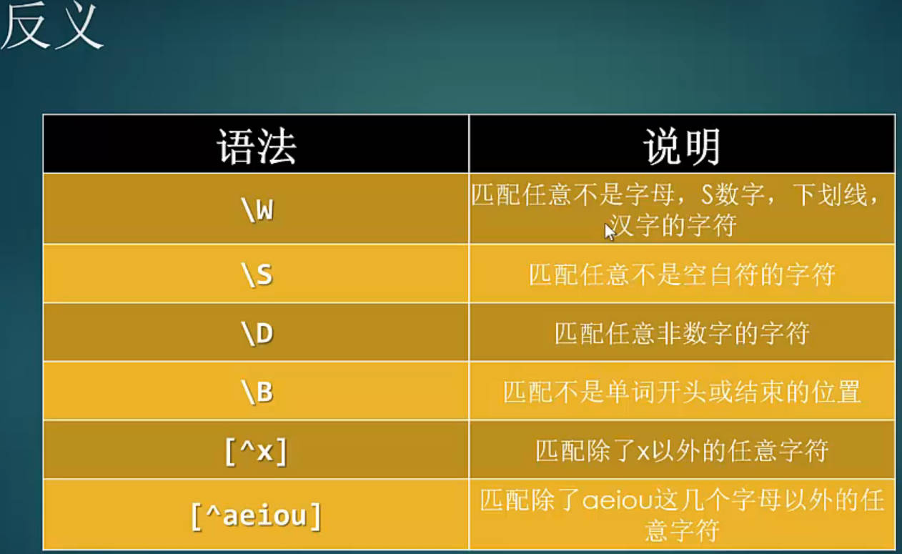
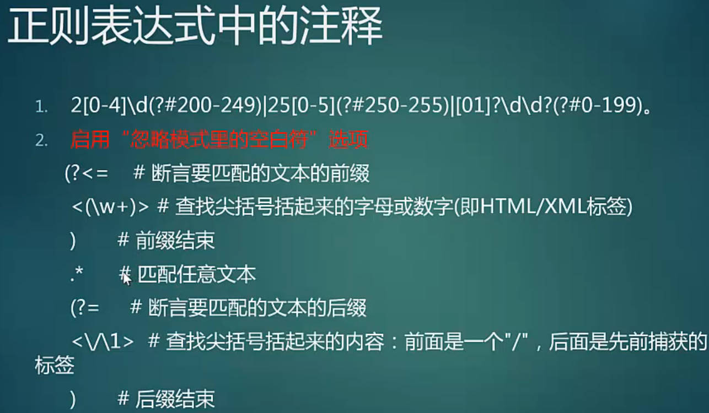
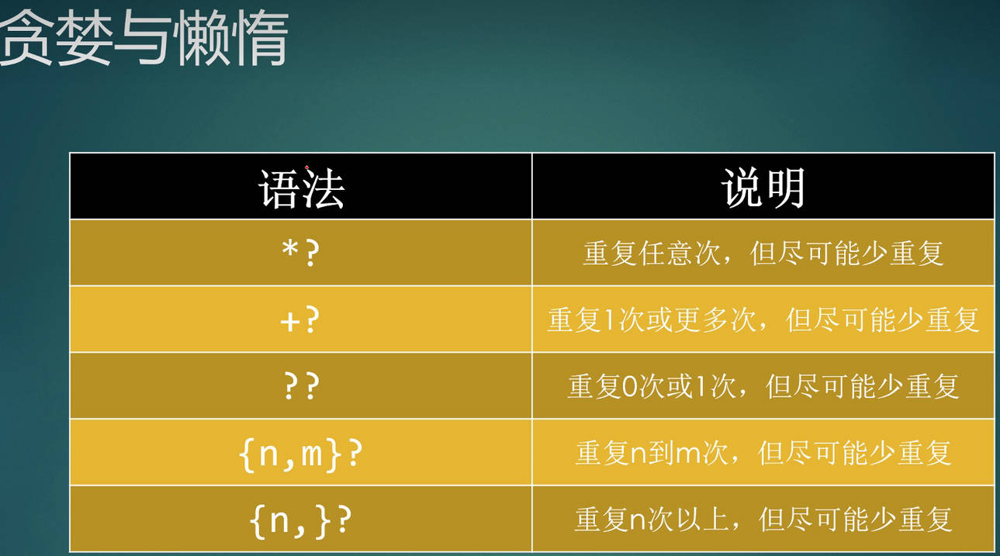
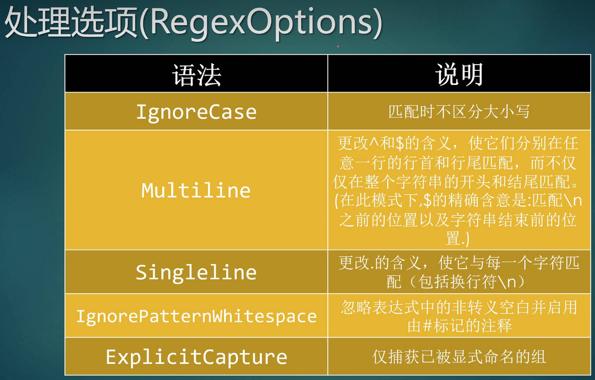
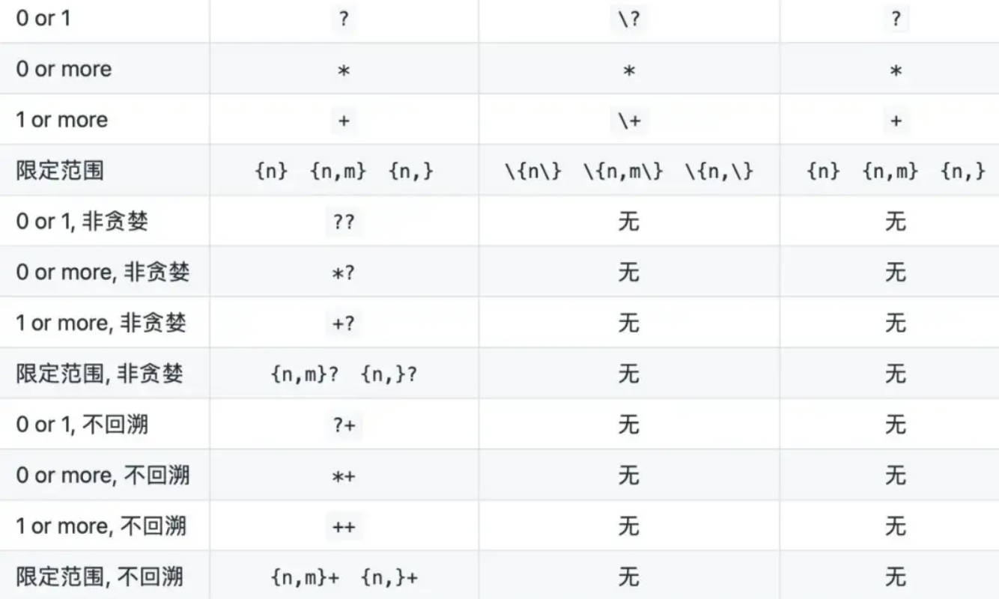

# 正则

## 1、简介

[精品很全：使用正则表达式- MATLAB regexprep - MathWorks 中国](https://ww2.mathworks.cn/help/matlab/ref/regexprep.html) 

[正则表达式入门](https://www.bilibili.com/video/BV1Zx411f7bD?p=6&spm_id_from=pageDriver&vd_source=7346303e5e18677d7261c2c0c109ecfd)   [RegexBuddy ](https://www.jianshu.com/p/65f9ccb01b34) [元字符-菜鸟教程 ](https://www.runoob.com/regexp/regexp-metachar.html)  [RegexBuddy使用](https://www.cnblogs.com/sindweller/p/14312227.html)  [正则表达式平衡组](https://www.codingdict.com/questions/26823)

杂：[元字符](https://t.cj.sina.com.cn/articles/view/1746173800/68147f680270124jr)  [正则](https://blog.csdn.net/qq_34402069/article/details/124796663)  [Everything搜索表达式 ](https://www.cnblogs.com/kongtongshu/p/11248631.html)  [可打印的cheat-sheet](https://www.jianshu.com/p/2c40cf0f9f9e)   [正则表达式里问号?的用法](https://www.cnblogs.com/yalong/p/15183458.html)   

[If-Then-Else Conditionals](https://blog.csdn.net/wushuai1346/article/details/7208907#:~:text=If-Then-Else%20Conditionals%20in%20Regular%20Expressions%20A%20special%20construct,part.%20Otherwise%2C%20the%20else%20part%20is%20attempted%20instead.)   [正则](http://nlp.nju.edu.cn/kep/L_CoL-RegularExpressions-ShiyongJiqiao_Editplus.htm) 

[Regex Learn - 逐步从零基础到高阶](https://regexlearn.com/zh-cn)   [RegExr](https://regexr.com/) 

cheat-sheet：[可打印的cheat-sheet收集](https://www.jianshu.com/p/2c40cf0f9f9e)   [Regular Expressions Cheat Sheet](https://cheatography.com/davechild/cheat-sheets/regular-expressions/)    [Cheat Sheets by DaveChild](https://cheatography.com/davechild/cheat-sheets/)  


[正则表达式网站](https://www.cnblogs.com/mlrs815/articles/11732494.html)  [regex101正则表达式测试和学习工具](https://zhuanlan.zhihu.com/p/618590846)  [regex101](https://regex101.com/) [RegExr](https://regexr.com/) 

[正则匹配中文](https://blog.csdn.net/sinat_20276727/article/details/113250419) [正则匹配中文](https://blog.csdn.net/sinat_20276727/article/details/113250419)  [正则表达式中文汉字如何匹配](http://www.leetao.cc/yingyong/1402.html) 

==总结：== 元字符、重复、分组、贪婪懒惰、高阶（反向引用、零宽断言、平衡组和递归匹配）

正则表达式的模式可以包括以下内容：

- 字面值字符：例如字母、数字、空格等，可以直接匹配它们自身。
- 特殊字符：例如点号 `.`、星号 `*`、加号 `+`、问号 `?` 等，它们具有特殊的含义和功能。
- ==字符类==：用方括号 `[ ]` 包围的字符集合，用于匹配方括号内的==任意一个字符==, ==[^ ]除了 [ ] 中字符的所有字符==。
- ==元字符==：例如 `\d`、`\w`、`\s` 等，用于匹配特定类型的字符，如数字、字母、空白字符等。
  - `\`：转义字符
  - `{`  限定符表达式的开始； `[` 中括号表达式的开始

- ==量词（重复）==：例如 `{n}`、`{n,}`、`{,m}最多连续出现m次、` `{n,m}` 等，用于指定匹配的次数或范围。
  - `*`：匹配前面的模式==零次或多次==
  - `+`：匹配前面的模式==一次或多次==
  - `?`：匹配前面的模式==零次或一次==
  -  `*  +` 限定符是贪婪的，在后面加 `?` 实现非贪婪或最小匹配

- 边界符号：例如 `^`、`$`、`\b`、`\B` 等，用于匹配字符串的开头、结尾或单词边界位置
  - `\b`：匹配单词边界, `\B`：匹配非单词边界；  `^`、`$`字符串边界

- 分组和捕获
  - `( )`：用于分组和==捕获子表达式==。
  - `(?: )`：用于分组但不捕获子表达式

## 2、元字符

[ASCII](https://baike.baidu.com/item/ASCII/309296?fr=ge_ala)   [转义序列字符(\0,\n,\r,\t,\v,\a,\f,\b,\\,\‘,\“,\?)](https://blog.csdn.net/2201_75670821/article/details/128247316)  [转义字符](https://baike.baidu.com/item/%E8%BD%AC%E4%B9%89%E5%AD%97%E7%AC%A6/86397?fr=ge_ala)  

[字符编码](https://www.jianshu.com/p/415bff085a20)  [ASCII码对照表](https://blog.csdn.net/lj19990824/article/details/120162269)   [ASCII 表 ](https://www.runoob.com/w3cnote/ascii.html)  

[ASCII中的控制字符](https://blog.csdn.net/gao_zhennan/article/details/118941799)  [ANSI控制码-\cJ等](https://blog.csdn.net/dolphin98629/article/details/109022111)   [常用ANSI控制码表_ansi码表](https://blog.csdn.net/zyj_zhouyongjun183/article/details/80211245?spm=1001.2101.3001.6650.3&utm_medium=distribute.pc_relevant.none-task-blog-2%7Edefault%7ECTRLIST%7ERate-3-80211245-blog-109022111.235%5Ev43%5Epc_blog_bottom_relevance_base9&depth_1-utm_source=distribute.pc_relevant.none-task-blog-2%7Edefault%7ECTRLIST%7ERate-3-80211245-blog-109022111.235%5Ev43%5Epc_blog_bottom_relevance_base9&utm_relevant_index=6) 

- 转义字符是==C语言中表示字符==的一种特殊形式。通常使用转义字符表示ASCII码字符集中不可打印的控制字符和特定功能的字符，如用于表示字符常量的单引号( ');   `\0,\n,\r,\t,\v,\a,\f,\b,\\,\‘,\“,\?`
- 转义字符（Escape character），所有的[ASCII码](https://baike.baidu.com/item/ASCII码/99077?fromModule=lemma_inlink)都可以用“\”加数字（一般是8进制数字）来表示。而[C](https://baike.baidu.com/item/C/7252092?fromModule=lemma_inlink)中定义了一些字母前加`\`来表示常见的那些==不能显示的ASCII字符==，如\0,\t,\n等，就称为转义字符，因为后面的[字符](https://baike.baidu.com/item/字符/4768913?fromModule=lemma_inlink)，都不是它本来的ASCII字符意思了
- `\f 匹配换页符。等价于 \x0c 和 \cL`;  \cL是 ansi控制码

notepad++：[扩展搜索-\n等](https://npp-user-manual.org/docs/searching/#wrap-around)  [正则搜索](https://npp-user-manual.org/docs/searching/#zero-length-matches)    [用户自定义语言（UDL）文件设置方法](https://www.cnblogs.com/xin04/p/12397320.html)  [UDL2.1 ](https://npp-user-manual.org/docs/udl/introduction/)  [Notepad++ User Defined Languages Collection](https://github.com/notepad-plus-plus/userDefinedLanguages) 

chrome: [开发者工具的新变化 (Chrome 123)](https://developer.chrome.google.cn/blog/new-in-devtools-123?hl=hu)  [Chrome不支持正则搜索](https://blog.csdn.net/Twinkle_sone/article/details/136862785) 

- 普通字符: 按照字面意义进行匹配, a将匹配文本中的 "a" 字符
- 元字符：具有特殊的含义，例如 `\d` 匹配任意数字字符
  - ==注释：(?#)==

- ==非打印字符==
  - ==\cx== ：脱出字符表示法 ;  匹配由x指明的控制字符，例 \cM 匹配一个 Control-M 或回车符
  - \f换页 feed，n换行 newline，r回车carriage，s任意空白字符，S非空白字符，t制表符，v垂直制表符

```sh
 .	除换行符外任意字符
\w	字母数字下划线或汉字   \s	任意空白符(空格)    \d	数字
\b	单词开始或结束   ^	字符串开始    $  字符串结束
# \bgood\b,   \b([a-z]+) \1\b/igm ,  pe\b 在单词结尾处查找匹配项

（）子表达式，分组   [] 中括号表达式  {} 限定符表达式
限定符： 有 * 或 + 或 ? 或 {n} 或 {n,} 或 {n,m} 共6种
[]：与里面的任意字符匹配，但只表示一个字符，用连字号可表一个字符范围
```
```
反义
\W	不是(字母数字下划线或汉字)
\S	不是空白符    \D	非数字字符   \B	不是单词开始或结束
[^x]	除x以外字符   [^aeiou] 除aeiou以外字符

转义：\
注释：(?#)
```
### 脱出字符表示法

[\cK脱出字符表示法](https://blog.csdn.net/ACK_ACK/article/details/91953864)   

> 脱出字符表示法：通常用于终端机连线（例如Telnet通信协议），以脱出字符^开头，再接一个符号，用来让控制字符在屏幕上显现。
>
> 虽然看起来是两个字符，但在终端机上实际只有一个字符。
>
> 在绝大部分的终端机系统中，包括Windows的命令提示字符（cmd.exe）、Linux和FreeBSD，
>
> 都可用Ctrl代表脱出字符，输入想要的ASCII控制字符。
>
> 例如想输入空字符，就要输入Ctrl+2，而非^@，后者会显示成两字符，前者只会显示成一字符。


|  |  |
| --------------------------------------------------------- | --------------------------------------------------------- |

## 3、重复

```
1、重复模式
*	重复0或多次    +	一次或多次     ?	0或1次
{n}	重复n次   {n,}  n或多次，至少重复n次    {n,m} n到m次，最少n且最多m次

2、分支条件
用 | 把不同规则分隔：从左到右测试，如果满足了某分支，就不会再管其它条件
```

## 4、分组，贪婪与懒惰

- 圆括号会有一个副作用，使相关的匹配会被缓存，此时可用 ?: 放在第一个选项前来消除这种副作用。
- 其中 ?: 是==非捕获元==之一，还有两个非捕获元是 ==?= 和 ?!==，这两个还有更多的含义，前者为==正向预查==，在任何开始匹配圆括号内的正则表达式模式的位置来匹配搜索字符串，后者为==负向预查==，在任何开始不匹配该正则表达式模式的位置来匹配搜索字符串。

```sh
# ()分组， 分组命名：(?<groupname>exp)，  (?<命名>)：名字写在尖括号里
# 分组后匹配存储到一个临时缓冲区，缓冲区编号从 1 开始，最多可存 99 个
# \1引用前面的分组，如果分组命名了，用\k<name>引用：(?<name>\w+)\s+\k<name>

# 可以使用非捕获元字符 ?:、?= 或 ?! 来重写捕获，忽略对相关匹配的保存
# (?:exp):匹配exp表达式，但不捕获匹配的文本，也不给分组分配组号   ?:
```

```
* 和 + 限定符都是贪婪的，因为它们会尽可能多的匹配文字，只有在它们的后面加上一个 ? 就可以实现非贪婪或最小匹配。

*?	重复任意次，但尽可能少
+?	重复1或多次，尽可能少
??	重复0或1次，尽可能少
{n,m}?	重复n到m次，尽可能少
{n,}?	重复n次以上，尽可能少
{,m}	最多连续出现m次

？+		0,1	不回溯
*+		0，more 不回溯
++		1，more 不回溯
{n,m}+  限定范围 不回溯
```


|  |  |
| --------------------------------------------------------- | --------------------------------------------------------- |

## 5、修饰符

修饰符（标记）：用于指定额外的匹配策略 【如不区分大小写】。 格式：`/pattern/flags`

`\b([a-z]+) \1\b/igm`  i不区分大小写，g尽可能多的匹配,全局匹配   m多行

```bash
IgnoreCase：不区分大小写				 	 # i
global:全局匹配							# g
Multiline：更改^ $含义，多行匹配			 # m， g只匹配第一行
Singleline：更改.含义，包含换行符			# s  .匹配除换行符 \n 之外的任何字符
IgnorePatternWhitespace:忽略非转义空白，并启用#标记的注释
ExplicitCapture：仅捕获已被显式命名的组
```

## 6、高阶

```bash
1、反向引用：(\w+)\s+\1      # \1引用前面的分组，如果分组命名了，用\k<name>引用：(?<name>\w+)\s+\k<name>

2、零宽断言：?=exp 搜索表达式exp，但不捕获；后面出现exp【例如：singing \w+(?=ing\b) 找ing结尾的单词】    ?< =exp 前面出现exp 【reading  (?<=\bre)\w+\b  找这样的单词，re开头】
3、负向零宽断言
里面有字母q，但q后面跟的不是字母u：\b\w*q(?!u)\w*\b； ?<!前面不是小写字母的7位数：（?<![a-z]）\d{7}

4、冗长的平衡组和递归匹配 <aa <bbb> <bbb> aa> 匹配最大尖括号里的内容  #平衡组是.NET正则表达式所独有
(?'group'):把捕获的内容命名为group，并压入堆栈
(?'-group'):堆栈上弹出最后压入的名为group的捕获内容，如堆栈本来空，则本分组匹配失败
(?(group)yes|no):如堆栈有名为group的捕获内容，继续匹配yes部分的表达式，否则继续匹配no部分
(?!):由于没有后缀表达式，试图匹配总是失败
```

 `?=、 ?<=、 ?!、 ?<! 的使用区别` ：零宽断言(先行断言、后行断言)  [正则表达式中的条件匹配](https://www.jianshu.com/p/8b9cbf2207e3) 

```sh
run(?=[\d])		# run后面是数字
(?<=[\d])run	# run前面是数字

run(?![\d])		# run后面不是数字
run(?<![\d])	# run前面不是数字
```

如果在表达式*之前*指定前向断言，则运算等同于逻辑 `AND`     [If-Then-Else Conditionals](https://blog.csdn.net/wushuai1346/article/details/7208907#:~:text=If-Then-Else%20Conditionals%20in%20Regular%20Expressions%20A%20special%20construct,part.%20Otherwise%2C%20the%20else%20part%20is%20attempted%20instead.) 

| 运算           | 描述                           | 示例                               |
| :------------- | :----------------------------- | :--------------------------------- |
| `(?=test)expr` | 同时与 `test` 和 `expr` 匹配。 | `'(?=[a-z])[^aeiou]'` 与辅音匹配。 |
| `(?!test)expr` | 匹配 `expr`，但不匹配 `test`。 | `'(?![aeiou])[a-z]'` 与辅音匹配。  |


## 7、字符簇和正则派系

[POSIX & PCRE](https://zhuanlan.zhihu.com/p/435815082)   

[POSIX字符集](https://www.baidu.com/s?ie=UTF-8&wd=POSIX%20%E5%AD%97%E7%AC%A6%E9%9B%86)  [POSIX字符组](https://www.cnblogs.com/gaara0305/p/9816275.html)  [POSIX字符组](https://www.baidu.com/s?ie=UTF-8&wd=POSIX%E5%AD%97%E7%AC%A6%E7%BB%84)  

[正则表达式](https://blog.csdn.net/jisuanji198509/article/details/79826933)  [POSIX正则表达式](https://blog.csdn.net/zwlove5280/article/details/105222400?spm=1001.2101.3001.6650.1&utm_medium=distribute.pc_relevant.none-task-blog-2~default~BlogCommendFromBaidu~Rate-1-105222400-blog-116489249.pc_relevant_recovery_v2&depth_1-utm_source=distribute.pc_relevant.none-task-blog-2~default~BlogCommendFromBaidu~Rate-1-105222400-blog-116489249.pc_relevant_recovery_v2&utm_relevant_index=2)   [GNU Findutils 4.9.0-GNU使用的各种正则表达式](https://www.gnu.org/software/findutils/manual/html_mono/find.html#Regular-Expressions)  

```
GNU ERE: [[:upper:]]
```

- 80年代，POSIX (Portable Operating System Interface) 标准公诸于世，它制定了不同的操作系统都需要遵守的一套规则，其中就包括正则表达式的规则
  - Unix 系统或类Unix系统上的大部分工具，如grep 、sed 、awk等都属于POSIX派系
  - ==POSIX派系标准： BRE、ERE 和 ARE==； 基本、扩展、ARE则是由各家定义的扩展
    - BRE：基本正则表达式    
    - ERE：在BRE基础上，扩展正则表达式
- 90年代，随着Perl语言的发展，它的正则表达式功能越来越强悍。为了把Perl语言中正则的功能移植到其他语言中，==PCRE==（Perl Compatible Regular Expressions）派系的正则表达式也诞生了。
  - 现代编程语言如Python ，Ruby ，PHP ，C / C++ ，Java 等正则表达式，大部分都属于PCRE派系
- PCRE使用起来更加易用简洁（不需要转义，有更简洁字符组），功能更加丰富（非捕获组，环顾断言，非贪婪）。如果没有特殊原因，应尽可能使用PCRE派系

## 8、字符替换

[浅析正则表达式-替换原则 ](https://www.cnblogs.com/yzl050819/p/7060476.html)   [正则表达式替换](https://www.baidu.com/s?ie=utf-8&f=8&rsv_bp=1&tn=baidu&wd=%E6%AD%A3%E5%88%99%E8%A1%A8%E8%BE%BE%E5%BC%8F%E6%9B%BF%E6%8D%A2&rn=20&oq=escaped&rsv_pq=cdb5e6bc023a50ed&rsv_t=3afeo20b7gQdqSogPhrYybGSAFcH3KEotbmo4nleJSRKmV9Cqdu3DL8KrJk&rqlang=cn&rsv_enter=1&rsv_dl=tb&rsv_btype=t&inputT=11313&rsv_sug3=32&rsv_sug1=25&rsv_sug7=100&rsv_sug2=0&rsv_sug4=11313)   [正则表达式的替换](https://www.cnblogs.com/1-2-3-4a/p/9902209.html)   [在Notepad++中使用正则表达式替换文本](https://blog.csdn.net/a_dev/article/details/78130666?utm_medium=distribute.pc_relevant.none-task-blog-2~default~baidujs_baidulandingword~default-0-78130666-blog-130230692.235^v38^pc_relevant_sort_base1&spm=1001.2101.3001.4242.1&utm_relevant_index=3)  

Substitution、string replacement

要切换到正则==替换模式== 

```sh
$num			# 替换第几分组的内容  $0
${分组name}	   # 命名过的分组  	  ${test}
$$				# 匹配的内容前面插入一个$, 相当于转义

$&				# 整个正则表达式匹配的内容, 即第0组的内容; $&$1第0组，第1组 

$`				# 匹配替换为，它前面的内容
$'				# 匹配替换为，它后面的内容

$_				# entire input string; 匹配替换为整个字符
```

## 9、输入参量

### 逻辑和条件运算符

逻辑和条件运算符允许您测试给定条件的状态，然后使用结果确定哪个模式（如果有）与下一条件匹配。这些运算符支持逻辑 `OR`、`if` 或 `if/else` 条件。

条件可以是词元、环顾运算符或 `(?@cmd)` 形式的动态表达式。==动态表达式必须返回逻辑值或数值。==

| 条件运算符             | 描述                                                         | 示例                                                         |
| :--------------------- | :----------------------------------------------------------- | :----------------------------------------------------------- |
| `expr1|expr2`          | 匹配表达式 `expr1` 或表达式 `expr2`。如果存在与 `expr1` 匹配的项，则将忽略 `expr2`。 | `'(let|tel)\w+'` 匹配以 `let` 或 `tel` 开头的单词。          |
| `(?(cond)expr)`        | 如果条件 `cond` 为 `true`，则匹配 `expr`。                   | `'(?(?@ispc)[A-Z]:\\)'` 匹配驱动器名称，例如 `C:\`（在 Windows® 系统上运行时）。 |
| `(?(cond)expr1|expr2)` | 如果条件 `cond` 为 `true`，则匹配 `expr1`。否则，匹配 `expr2`。 | `'Mr(s?)\..*?(?(1)her|his) \w*'` 匹配包含 `her` 的文本（当文本以 `Mrs` 开头时），或包含 `his` 的文本（当文本以 `Mr` 开头时）。 |

### 词元运算符

词元是括号中定义的部分,即==分组中匹配的内容==。

【反向引用和分组命名】： 可以按词元在文本中的顺序引用该词元（顺序词元），或将==名称分配给词元==以便于代码维护和使输出更易于阅读

| ==顺序词元运算符==  | ==描述==                                                    | ==示例==                                                     |
| :------------------ | :---------------------------------------------------------- | :----------------------------------------------------------- |
| `(expr)`            | 在词元中捕获与括起来的表达式匹配的字符。                    | `'Joh?n\s(\w*)'` 捕获一个词元，该词元包含名字为 `John` 或 `Jon` 的任何人的姓氏。 |
| `\N`                | 匹配第 `N` 个词元。                                         | `'<(\w+).*>.*</\1>'` 从文本 `'<title>Some text</title>'` 捕获 HTML 标记的词元，例如 `'title'`。 |
| `(?(N)expr1|expr2)` | 如果找到第 `N` 个词元，则匹配 `expr1`。否则，匹配 `expr2`。 | `'Mr(s?)\..*?(?(1)her|his) \w*'` 匹配包含 `her` 的文本（当文本以 `Mrs` 开头时），或包含 `his` 的文本（当文本以 `Mr` 开头时）。 |


| ==命名词元运算符==     | ==描述==                                               | ==示例==                                                     |
| :--------------------- | :----------------------------------------------------- | :----------------------------------------------------------- |
| `(?<name>expr)`        | 在命名词元中捕获与括起来的表达式匹配的字符。           | `'(?<month>\d+)-(?<day>\d+)-(?<yr>\d+)'` 在 `mm-dd-yy` 形式的输入日期中创建命名月、日和年词元。 |
| `\k<name>`             | 匹配 `name` 引用的词元。                               | `'<(?<tag>\w+).*>.*</\k<tag>>'` 从文本 `'<title>Some text</title>'` 捕获 HTML 标记的词元，例如 `'title'`。 |
| `(?(name)expr1|expr2)` | 如果找到命名词元，则匹配 `expr1`。否则，匹配 `expr2`。 | `'Mr(?<sex>s?)\..*?(?(sex)her|his) \w*'` 匹配包含 `her` 的文本（当文本以 `Mrs` 开头时），或包含 `his` 的文本（当文本以 `Mr` 开头时）。 |

### 动态正则表达式

[动态正则表达式 - MATLAB & Simulink - MathWorks 中国](https://ww2.mathworks.cn/help/matlab/matlab_prog/dynamic-regular-expressions.html) 

动态表达式==允许执行 MATLAB 命令==或==正则表达式==以确定要匹配的文本。

将动态表达式括起来的括号*不*创建捕获组。   动态表达式必须返回逻辑值或数值

## 10、正则匹配的回溯现象

[正则表达式的回溯](https://blog.csdn.net/weixin_43871678/article/details/106796885)   [如何避免正则表达式回溯](https://blog.csdn.net/zhaolijing2012/article/details/102624999)

[PCRE、GNU BRE、GNU ERE 对比](https://zhuanlan.zhihu.com/p/435815082)

`?+不回溯  ??懒惰` 



# Everything

[Searching 例子](https://www.voidtools.com/support/everything/searching/)	

## 属性

`attrib:<attributes> `

## 大小

`size:>1gb`

`size:>2mb..10mb` 

## 日期

```java
dm:today
dm:thisweek
dm:8/1/2014..8/31/2014
```

## 内容搜索

非常慢，与其它过滤器结合，以获得最佳性能

`*.eml dm:thisweek content:banana`

`ansicontent:<text>`		搜索 ANSI 格式文本内容

`utf16content:<text>`	   搜索 UTF-16 格式文本内容
`utf16becontent:<text>`	 搜索 UTF-16 BE 格式文本内容

`utf8content:<text>`		搜索 UTF-8 格式文本内容

## 搜索图片

`width:<width>`	  		像素宽度

`height:<height>`			像素宽度

`dimensions:<width>x<height>`指定长宽

`orientation:<type>`	`<type>`是landscape` or `portrait

`bitdepth:<bitdepth>`	    指定像素密度,图片属性里的位深度

```
width:>2560
width:800..1920
height:600..1080
dimensions:800x600..1920x1080
bitdepth:64		
```

## 重复文件

dupe:					`Find files and folders with the same filename`

namepartdupe:			有相同名称部分

`attribdupe:`			 属性相同

sizedupe:				`same size` 


dadupe:					访问时间

dcdupe:					创建时间

dmdupe:					修改时间

```
dupe: .mp4
size:>1gb sizedupe:
```

## 正则

```java
regex:[^\x00-\x7f]
!regex:[a-z]
```

## ID3 Tags

搜索`ID3 tags and FLAC tags`

仅支持mp3中的ID3， id3和flac标签未被索引，搜索很慢，结合其它搜索以节省性能

```java
year:2002..2005
genre:electronic			//搜索媒体流派元数据
regex:album:^[a-n]			//搜索媒体专辑元数据
wildcards:title:red*
track:>10
year:>=2000
    
title:<text>				//搜索媒体标题元数据
track:<number>				//搜索指定音轨号的媒体文件
comment:<text>				//搜索媒体注释元数据
artist:<text>				//搜索媒体艺术家元数据
```

## 特殊搜索

回车确认

| `about:`       | Show the About dialog.                                       |
| -------------- | ------------------------------------------------------------ |
| `about:config` | Open your [Everything.ini](https://www.voidtools.com/support/everything/ini) |

## 其它

- 路径：`path:d:` , `d:*.txt` 
- 书签：保存搜索记录
- ==Macros==: 通过`filters and bookmarks`定义宏, 输入宏名
- 限制显示结果：`count:100`

```java
d:|e: *.mp3
d: *.jpg|*.png
parent:"c:\program files"			//指定路径下的文件和文件夹 (不包含子文件夹)

```

