[Download The MASM32 SDK](http://www.masm32.com/download.htm)   [masm下载和配置](https://blog.csdn.net/weixin_74144099/article/details/136781287)   

[Bochs  x86 虚拟机软件](https://www.oschina.net/p/bochs?hmsr=aladdin1e1)  [bochs_百度百科](https://baike.baidu.com/item/bochs/586473?fr=ge_ala)   

[手写简易操作系统](https://blog.csdn.net/weixin_43903639/article/details/136591115)    [手写简易操作系统](https://blog.csdn.net/weixin_43903639/article/details/136573679) 

[用 Microsoft Visual C++ 6.o](https://www.math.pku.edu.cn/teachers/qiuzy/c/env/msvc_1.htm)  [Microsoft Visual C++_百度百科](https://baike.baidu.com/item/Microsoft%20Visual%20C%2B%2B/8646587?fr=ge_ala) 

[快速引用网站标题链接到Markdown_tabcopy](https://blog.csdn.net/qq_42059060/article/details/130296619) 	

[在线LaTeX公式编辑器](https://www.latexlive.com/##)	

# 汇编复习

[电子通讯路-bilibili](https://search.bilibili.com/all?vt=95985215&keyword=%E7%94%B5%E5%AD%90%E9%80%9A%E8%AE%AF%E8%B7%AF&search_source=5)	 

==汇编要点==：段、`[bx]`变量、寻址、跳转、标志寄存器

> 段

8086不支持将数据直接送入==段寄存器==: 数据 => 通用寄存器 => 段寄存器

出栈顺序和入栈顺序相反

```assembly
;代码段


;数据段
mov bx,1000
mov ds,bx		;段地址不能直接给DS
mov al,[0]

;栈段
mov ax,1000h
mov ss,ax		;设栈段地址
mov sp,0010h	;栈顶
push ax			;ax入栈
push bx
pop bx			;出栈顺序和入栈顺序相反
pop ax
```

## 栈

- **栈是空的时候**，`SS:SP`指向最高地址单元的下一个单元，`sp+2`
  - 推理：栈中有1个元素时，`ss=1000h,sp=000eh`, 栈为空，相当于pop唯一的元素，`sp=sp+2, sp=e+2=10`
- **重点**： 入栈出栈==以字为单位操作== 
  - 函数变量放在栈中，出了函数，局部变量就失效
  - push时sp先减2,pop时先取数据再加2
    - `push:  sp-2，再放入数据` 
    - `pop： 先取出数据，再sp+2` 
- 用栈临时保存数据
  - 调用函数时，要把当前寄存器保存起来，调用完后再恢复当前寄存器数据


## 编译7步

`词法分析 => 语法分析 => 语义分析 => 中间代码生成 => 机器无关代码优化 => 目标代码生成 => 机器相关代码优化`

> [bx]变量和loop

==[bx]==同样表示一个内存单元，它的`偏移地址在bx中`,看作是 ==**变量**==， [0]`常量`

执行loop指令时，2步操作

1. `(cx) = (cx) - 1`
2. 判断cx中的值：不为0转至标号处执行, `(IP)=(IP)+8`，为0向下执行

```assembly
  mov ax,2
  mov cx,11
s:add ax,ax
  loop s
  
;段前缀
;ffff:0-b的数据拷贝到0020:0-b中,共12字节
  mov ax,0ffffh
  mov ds,ax
  mov ax,0020h
  mov es,ax
  mov bx,0
  mov cx,12
s:mov dl,[bx]
  mov es:[bx],dl
  inc bx
  loop s
```

安全的空间: `0:200 ~ 0:2ff`,256个字节

> 包含多个段程序

代码段中使用数据

```assembly
assume cs:code
code segment
	;8个数累加
    dw 0124h,0456h,0789h,0abch,0defh,0fedh,0cbah,0987h
    ;代码段前面16字节是数据，指令从数据后面开始, 所以需要定义程序入口，指明程序从哪里开始读指令。
start:mov bx,0		;初始化bx,因为代码段开始是数据，用start指明程序入口
	mov ax,0		;初始化
	mov cx,8
  s:add ax,cs:[bx]	;偏移地址从0开始，8字节数据相加
    add bx,2
	loop s
	
	mov ax,4c00h
	int 21h
	
code ends
end start			；cpu从end后面的标号找程序的入口
```

代码段中使用栈

```assembly
;通过定义数据来取得栈空间
;数据逆序存放
assume cs:code
code segment
      dw 0124h,0456h,0789h,0abch,0defh,0fedh,0cbah,0987h
      dw 0,0,0,0,0,0,0,0
start:mov ax,cs
	  mov ss,ax		;栈段地址
	  mov sp,32		;栈顶,内存单元从0开始，栈最底地址是31
	  mov bx,0
	  mov cx,8
    s:push cs:[bx]	;入栈
      add bx,2
      loop s
      
      mov bx,0
	  mov cx,8
   s0:pop cs:[bx]	;出栈
      add bx,2
      loop s0
      
      mov ax,4c00h
	  int 21h	
code ends
end start		
```

==数据、代码、栈放入不同的段==

```assembly
assume cs:code,ds:data,ss:stack

;数据段
data segment
    ;8个数据
	dw 0123h,0456h,0789h,0abch,0defh,0fedh,0cbah,0987h
data ends

;栈段
stack segment
	;8个数据
    dw 0,0,0,0,0,0,0,0
stack ends

;代码段
code segment
start:
	;栈空间初始化
	mov ax,stack
	mov ss,ax
	mov sp,16
	
	;数据段初始化
	mov ax,data
	mov ds,ax
	
  s:push [bx]	;入栈
    add bx,2
    loop s
      
    mov bx,0
    mov cx,8
 s0:pop [bx]	;出栈
    add bx,2
    loop s0
	
	mov ax,4c00h
	int 21h
code ends
end 
```

## 灵活定位内存地址

大写A是41H，小写a是61H,大写转小写ASCII码加==20H==

- 立即寻址	   `MOV AX,1234H`
- 寄存器寻址	 `MOV AX,BX`
- 直接寻址       `MOV　AX, [1234H]`               用常量直接定位内存单元
- 寄存器间接寻址  `MOV AX , [ BX ]`               用变量间接定位内存单元
- 寄存器相对寻址  `mov ax,12[bx]`                 用变量和常量表示地址，在一个起始地址基础上，用变量间接定位一个内存单元
- 基址加变址      `MOV BX, [BX+SI]`     `OV AX, [BX][DI]`     用2个变量表示地址， 例：二维数组，外层循环行，内层循环列
- 相对基址加变址   `MOV AX, [BX+SI+200H]`                     用2个变量和一个常量表示地址

例：

- `[bx+3]` :将多行单词的首字母变为大写，   `1. file`  `2. edit`
  - bx作变量，定位每行起始地址，3定位要修改的列
- `[bx+si]` :每个单词大写，==2个变量==        `ibm  dec  dos  vax`
  - 看作 ==4行3列的二维数组== : ==2个循环== ,用2个变量, 外层循环行，内层循环列
  - bx定位行起始地址，si定位列
- `[bx+si+idata]`：每个单词前4个字母大写，      `1.display   2.brows`  
  - ==4行16列的二维数组== : ==2个循环== ,用2个变量
  - 变量`bx`定位行，常量`2`定位每行要修改的`起始列`，变量`si`定位相对于起始列的要修改的列


==[bx+idata]== :  bx不用递增1, 获取下一个内存单元的地址； `[bx+1] [bx+2]`

- 例：**2个数组**，0和5给2个数组的起始偏移地址，`变量bx`定位从起始偏移地址开始的相对地址（==数组每个元素的地址==）, `[bx] [5+bx]`

|  |  |
| ------------------------------------------------------ | ------------------------------------------------------------ |

==**SI、DI**==

- 源地址 目标地址, 不能分成2个8位寄存器使用
- `[bx+si]、[bx+di]`， 2个变量相加
- `[bx+si+idata]、[bx+di+idata]`

例：字符串复制到其它内存单元

| 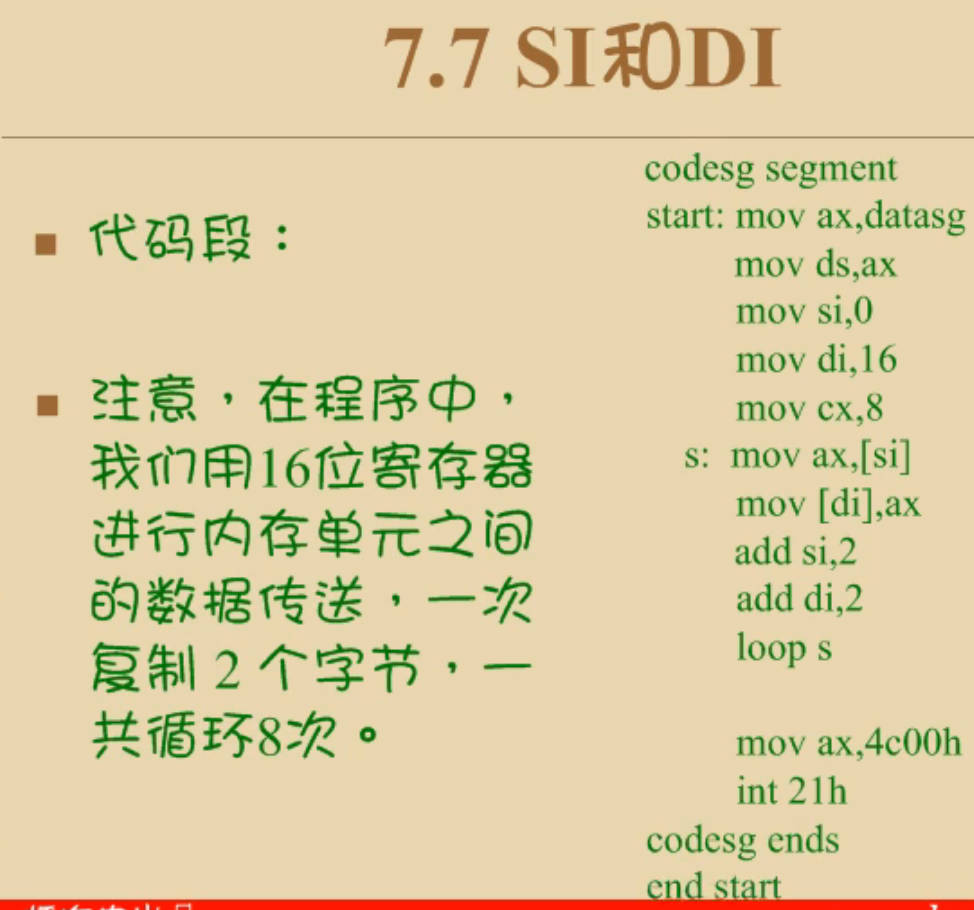 |  |
| ------------------------------------------------------------ | ------------------------------------------------------------ |

==[bx+si]==

2个变量, `[bx+idata]`中的常量换成变量

==[bx+si+idata]==

## 数据处理的2个基本问题

### 数据位置

- 数据在3个位置: cpu内部、内存、端口
  - 立即数
  - 寄存器
  - 段地址SA:偏移地址EA

- ==立即数==：数据在`cpu指令缓冲器`中


### 数据长度

==数据长度==：1.寄存器名指明要处理的数据长度(ax,al)  2.`mov word ptr ds:[0],1`指明   3.其它方法 `push [100h]`


用`[bx+idata+si]`的方式来访问结构体中的数据

- 用`bx`定位整个结构体，用`idata`定位结构体中的某一个数据项，用 `si` 定位数组项中的每个元素
- 为此，汇编语言提供了更为贴切的书写方式。如：`[bx].idata`、`[bx].idata[si]`

### ==div除法==

- 用乘法模拟除法: `20/4=5  4*1直到乘5等于20`, 乘法用加法模拟
- ==被除数==：默认放在`ax(16b)` 或 `dx和ax(32b)`
- ==除数==： 8或16位
- ==商==： 8位放在 `al`， 16位放在 `ax`
- ==余数==：8位放在 `ah`， 16位放在 `dx`

==dup== 使用格式： `db 重复次数 dup (要重复的字节型数据)`    例：`db 200 dup (0)`

## 转移指令

> 1. 根据位移进行转移的jmp指令： `short near`
> 2. 转移的目的地址在指令中的jmp指令 :  `far`
> 3. 转移的地址在寄存器中的jmp指令 : `jump bx`  寄存器里放的是 `IP` 的值
> 4. 转移的地址在内存中的jmp指令:  `jmp word ptr 内存单元地址`,  `jmp dword ptr 内存单元地址`

`offset` : **获取标号或变量的偏移地址**;   相对于`代码段起始地址`的偏移量 

**跳转距离**

- ==段间==转移: `远转移`
  - 转移的==目的地址在指令中==的jmp指令, 因为debug中能看到 `jmp obbd:010b` 
  - 给的是==目标地址==: `段：偏移地址`
  - **同时修改cs和ip**    `jmp far ptr 标号`
- 段内==短转移== : `2^8` 一个字节, `-128~127`,   8位位移
  - 机器码给的是==偏移地址==,        `（IP）=（IP）＋8位位移量` , 等号右边的ip是 jump指令的下一条指令地址
    - 即 ”跳转目的地的指令的偏移地址(0008) = `jmp下一条指令的偏移地址`(0005) + jmp机器码包含的”03“偏移量“。
  - `JMP SHORT 转移地址标号` 
  - **只修改ip的值**，ip的修改范围为-128~127(负数跳转方向是jmp指令之前，否则是之后)，**8位的位移** 
  - 标号处`inc ax`偏移地址是0008，jmp就是0008； 机器码中确没有0008
  - `补码`是为了方便负数计算
- 段内==近转移==    16位位移     `（IP）=（IP）＋16位位移量`
  - `jmp near ptr 标号` ;**只修改ip的值**，ip的修改范围为-32768~32767，**16位的位移**

转移地址在**寄存器**的jump指令:

- 寄存器里放的是 `IP` 的值, `jump bx` 
- 同时修改cs、ip： `jmp 2ae3:3`
- 仅修改ip： `jmp ax`

转移地址在**内存**的jump指令: 两种格式

- ==段内转移== `jmp word ptr 内存单元地址`
  - 内存单元给的是`转移的目的`偏移地址
- ==段间转移== `jmp dword ptr 内存单元地址`
  - 双字，内存高地址是转移目的的段地址，低地址是偏移地址


==条件跳转==**jcxz** 和 loop循环

- ==jcxz==, 当(cx)`=0,就跳转`到标号处执行， 不为0就不跳, `jump cx zero`
- ==loop==, (cx)=0,不跳转，和 `jcxz`相反
- 条件转移指令都是短转移, `2^8` 一个字节, `-128~127`,   8位位移

### 根据位移进行转移的意义

- 机器码不包含目标地址，而是包含偏移地址
- 这样设计，方便程序段在内存中浮动装配

## call和ret指令

> 1. 根据位移进行转移的call指令
> 2. 转移的目的地址在指令中的call指令
> 3. 转移的地址在寄存器中的call指令
> 4. 转移的地址在内存中的call指令

**call指令2步操作**： 先`push`入栈，保存cs和ip；   再`jmp`跳转去执行后面的指令

`1、(sp)=(sp)-2,  ((ss)*16+(sp))=(ip) ip入栈  2、(ip)=(ip)+16位位移 再跳转`

- `call 标号`：    		 push ip， `jmp near ptr 标号`
- `call far ptr 标号`：     段间转移,  push cs， push ip， `jmp far ptr 标号`
- `call 16位寄存器`:        push ip, `jmp 16位寄存器`
- 转移地址在内存中的call:   `call word ptr 内存单元地址`,  push ip, `jmp word ptr 内存单元地址`


call时当前状态入栈，ret返回时从栈中取回状态,   `ret修改cs、ip`实现转移

- ret  ==近转移==, 用栈中数据修改`IP`内容    相当于`pop ip`
  - `IP` 出栈，然后 `（SP）+2`
  - 例子里，将栈顶值0给IP，跳转到`move ax,4c00h`

- retf ==远转移==                         `pop ip   pop cs`

### ==mul乘法==

`multiply  multiplication`

- 相乘的2个数： 要么都是8位，要么都是16位; 8位乘数默认在al中,16位ax中； 被乘数在寄存器或内存中
  - 100*10 : `mov al,100  mov bl,10  mul bl`
- 结果：8位放ax中，16位：高位放DX，低位放AX

### 模块化程序设计

- 参数和结果传递： 存到寄存器，效率高
- 多个参数或返回值： 放到内存，空间大
- 使用栈传递参数

## 标志寄存器

标志寄存器16位, `0、2、4、6、7、8、9、10、11位有意义`

- 零标志位： 结果为0， ZF=1，  `在第6位`
- 奇偶：指令执行后，结果中`1的个数为偶数`，则PF=1
- `符号`：结果为负，SF=1,  结果是不是负数   `在第7位`
  - 用补码表示有符号数
- `进位标志位`：CF
  - 用标志寄存器的第0位作为进位时假想位
  - **无符号数运算时**，用进位标志
    - 2数相加时，==进位==记录到CF位
    - ==借位==时，也记录到CF位

- `溢出`： OF  `在第11位`
  - **有符号数运算时**，用溢出标志

### ==adc、sbb==、cmp

- adc （add carry） :==带进位加法==
  - 低位相加出现进位后不会舍弃，在第二步高位相加 :     `add ax,bx`和 `add al,bl   adc ah,bh` 有相同的结果
  - 加法可以分2步进行: 1、低位相加  2、高位相加再加上低位相加产生的进位值

- sbb （sub borrow） : `subtraction`  ==带借位减法==

- cmp: `相当于减法指令，只是不保存结果` ,==仅影响标志位==
  - `cmp ax,ax`, 做 `(ax)-(ax)`运算，结果为0，但并不在ax中保存，仅影响标志位


### 检测比较结果的==条件转移指令== 

检测标志位，根据条件跳转 

根据cmp的比较结果进行转移的指令，分2种

- 根据无符号数的比较结果，进行转移的条件转移指令， 它们检测 `ZF、CF`
- 根据有符号数的比较结果，进行转移的条件转移指令， 它们检测 `SF、OF、ZF`


| 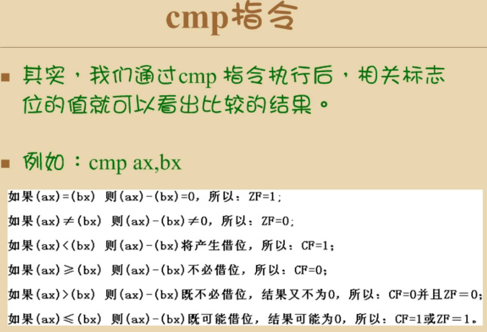       | 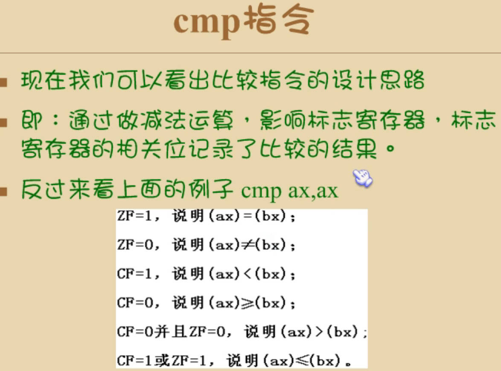 |
| ------------------------------------------------------------ | ------------------------------------------------------ |
| 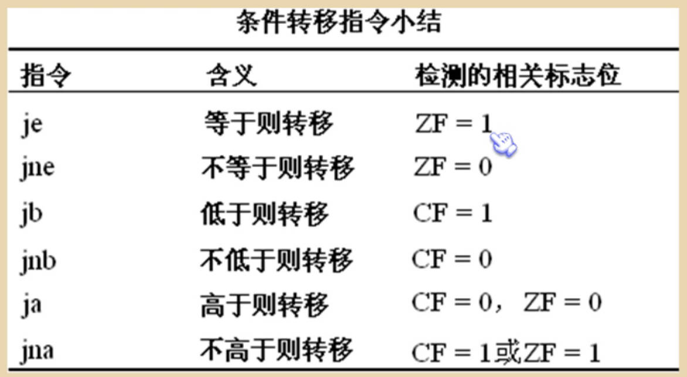 |                                                        |

### DF标志和==rep==串传送指令

小结： `rep movsb` ，  如何改变`DF`的值：  cld、std

串传送指令 : 在==两个存储单元之间进行数据传送==, `DF`控制每次操作后 `si、di`增减

- 如`MOVSB、‌MOVSW`或MOVS dest,src，‌用于完成两个存储单元之间的数据传送。‌
  - `((es)x16+(di))=((ds)x16+(si))` :  `段地址ds，偏移地址si`的内存单元数据，放入 `es:di`    
  - movsb: `move string byte` ，传送一个字节
  - `rep movsb` : rep作用是根据`cx`的值，重复执行后面的串传送指令
- 这些指令==可以处理字节或字的数据==，‌并且`能够在源位置和目标位置之间进行复制操作`，‌而源操作数的内容保持不变。‌
  - 具体来说，‌MOVSB指令将`DS所指向的存储单元`中的一个字节`传送到ES所指向的存储单元`，‌如果DF（‌Direction Flag）‌设置为0，‌则在传送后SI和DI都增加1；‌如果DF设置为1，‌则在传送后SI和DI都减少1。‌
  - 类似地，‌==MOVSW指令处理字数据==，‌并根据DF的值决定传送后地址的增减。‌
  - 此外，‌串传送指令的使用通常与重复前缀（‌如`Rep`）‌结合，‌以简化程序并提高运行速度。‌例如，‌当需要==将大量数据从一个地址范围传送到另一个地址范围时==，‌可以使用`REP前缀`与MOVSB指令结合，‌实现无条件重复传送操作，‌直到CX寄存器中的重复次数用完为止。‌
  - 如何改变`DF`的值：  cld: `clear df`    std: `set df` 

### pushf、popf

pushf: 将标志寄存器的值入栈

popf: 出栈，送入标志寄存器中

# ==指令==总结

loop：	1、`(cx) = (cx) - 1`  2、判断cx中的值：不为0转至标号处执行, 为0向下执行

==jcxz==:    当(cx)`=0,就跳转`到标号处执行, 所有循环指令都是短转移 ，`ip`修改范围为: `2^8, -128~127`

push:  sp-2，再放入数据 

pop： 先取出数据，再sp+2

and: 全真为真，将相应位变为`0`

or: 全假为假，将相应位变为`1`

==div==:

- 用乘法模拟除法: `20/4=5  4*1直到乘5等于20`, 乘法用加法模拟
- ==被除数==：默认放在`ax(16位)` 或 `dx和ax(32b)`
- ==除数==： 8或16位
- ==商==： 8位放在 `al`， 16位放在 `ax`
- ==余数==：8位放在 `ah`， 16位放在 `dx`

dup 使用格式： `db 重复次数 dup (要重复的字节型数据)`    例：`db 200 dup (0)`

==mul==: 乘法

- 相乘的2个数： 要么都是8位，要么都是16位; 8位`乘数`默认在al中,16位ax中；  `被乘数`在寄存器或内存中
  - 100*10 : `mov al,100  mov bl,10  mul bl`
- 结果：8位放ax中，16位：高位放DX，低位放AX

==adc== （add carry） :==带进位加法==

- ==低位相加==出现进位后不会舍弃，在第二步==高位相加== :     `add ax,bx`和 `add al,bl   adc ah,bh` 有相同的结果
- 加法可以分2步进行: 1、低位相加  2、高位相加再加上低位相加产生的进位值
- `(ax)=(ax)+(bx)+CF`

==sbb== （sub borrow） : `subtraction`  ==带借位减法==

==cmp== :

- `相当于减法指令，只是不保存结果` 
  - `cmp ax,ax`, 做 `(ax)-(ax)`运算，结果为0，但并不在ax中保存，仅影响标志位

- 检测比较结果的条件转移指令： 检测标志位，根据条件跳转 , `je、jb、ja`

MOVSB、‌MOVSW：串传送指令，`DF=0`,每次操作后`si、di`递增, `cld、std设置DF`,  (中断章节 sti、cli 设置 `if`)

- `mov cx,16`, `rep movsb`,根据cx，重复执行16次串传送


# 中断

- ==中断源==： 引起中断的原因，分为`硬件和软件中断`
  - 为什么是256个中断源： 因为`索引用的中断类型码是8位`，$2^8=256$ 
- 硬件中断
  - `外部中断`: 外设发出的中断请求，利用中断控制器可屏蔽
  - `内部中断`：硬件或运算出错引起的中断，不可屏蔽
- 软件中断
- ==中断处理程序==： 根据中断向量表里的，段地址和偏移地址，找到中断处理程序
  - 8位中断类型码`(索引)`，不够存放段地址和偏移地址，引入 ==中断向量表== ,它里面存中断处理程序的地址
  - 中断向量表==1024==字节： 一个物理地址要4个字节存放，段地址：偏移地址都是16位； 2+2字节； 占用`4 × 256`字节, 一段安全的空间里讲的 `0:200~0:300`，本来是要存中断向量表
  - 中断向量表： `0:0 ~ 0:03ff` ,共==1024==字节

- ==中断过程==：用`中断类型码，找到中断向量，并用它设置cs和ip`，由cpu硬件自动完成，cpu完成这个工作的过程称为中断过程
  - 取得中断类型码
  - 保存当前状态：标志寄存器值，`TF、IF置0`， CS入栈、IP入栈
  - 读取中断处理程序入口地址，设置CS、IP

| 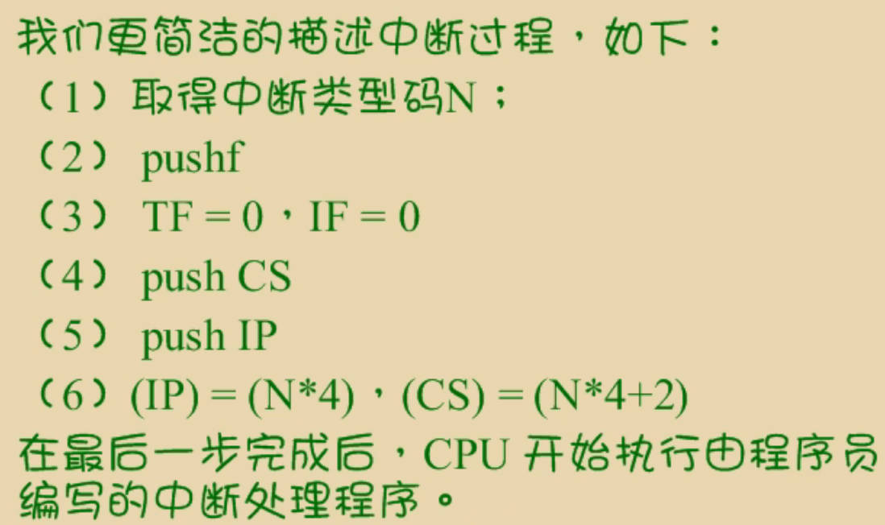 |  |
| ------------------------------------------------------ | ------------------------------------------------------ |

## 内中断

### 中断向量表

[好：中断向量表内容](https://baike.baidu.com/item/%E4%B8%AD%E6%96%AD%E5%90%91%E9%87%8F%E8%A1%A8/4947137) 

### 中断处理程序

`iret`返回

|  |  |
| ------------------------------------------------------ | ------------------------------------------------------ |

### 单步中断

cpu提供单步中断机制: `TF = 1`,则产生单步中断

- `debug`提供单步中断处理程序，使用`T`命令：功能是显示寄存器中的内容，等待输入命令

## int指令

int中断： 由int指令引发的中断

- 使用`int`引发中断过程，从而执行中断的==中断处理程序==
- 将中断处理程序称为==中断例程==

**Bios和Dos提供的中断例程**

- 初始化时建立bios中断向量
-  `mov ax,4c00h`  调用21h号中断例程的 `4ch`号子程序， `mov al,0` al是参数

| 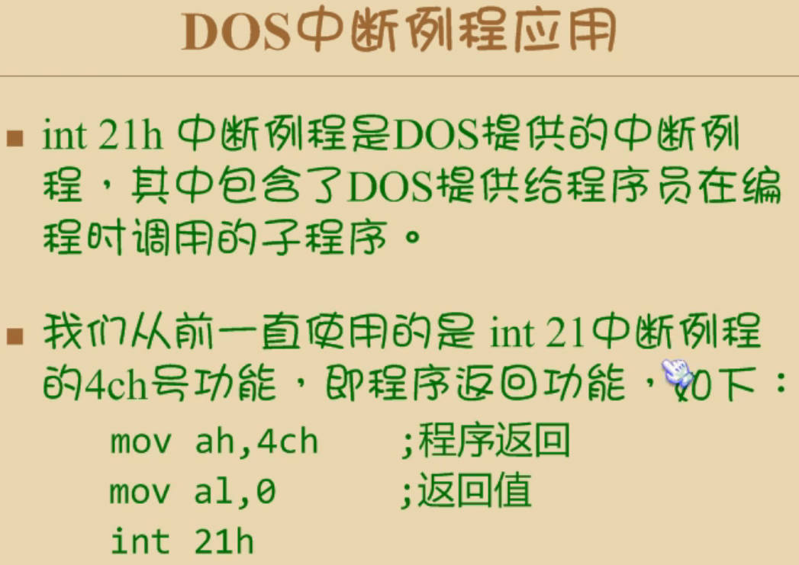 | 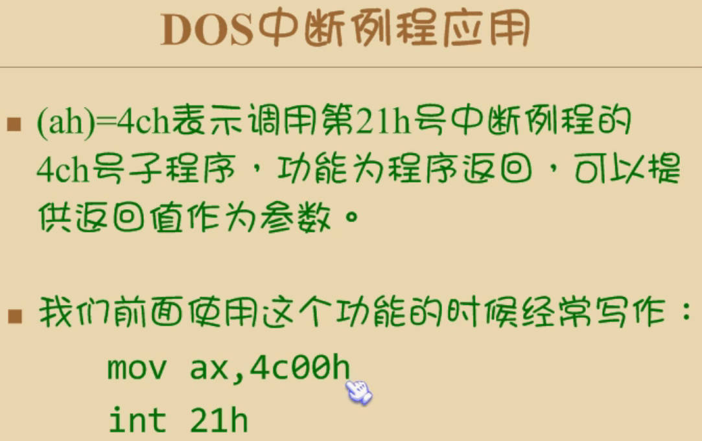 |
| ------------------------------------------------------ | ------------------------------------------------------ |

## 端口

- 端口读写指令： `in、out`, in读取数据
- ==端口16位==，一共 `65536`个端口, `tcp/ip`端口和这里的不一样

**cmos芯片**: 

cmos有2个端口：`70H、71H`

cmos读写分2步： 例，读cmos的2号单元，1、2送入端口70h， 2、从71h读出2号单元内容

**shl和shr：** 

shl：左移，数据向左移位，将最后移出的位写入CF，最低位0补充

**cmos中存储时间信息**： 

cmos中存的时间信息，以BCD码存放

## 外中断

**CPU还应该对外部设备进行控制，即I/O能力**

- 外设有寄存器，cpu将这些寄存器当作==端口==来访问

外设的输入不直接送入内存和cpu，而是送入==接口芯片的端口==

==cpu通过端口==和外部设备通信 

### 键盘处理过程

键盘芯片对键盘每个键的开关状态进行扫描，按键，开关接通，该芯片产生一个`扫描码(通码)`，说明了按键在键盘上的位置。

- 扫描码被送入端口`60h`, 松开键也产生一个`扫描码（断码）`，也送入`60h`
- 扫描码一个字节，通码第7位为`0`,断码为`1`, `10,000,000=80h`,从0位开始到第7

int9键盘中断处理流程：

1. 读取`60h`端口的扫描码
2. 若是字符键扫描码，将该扫描码和对应的ASCII码，送入内存中的`BIOS键盘缓冲区`。
   1. 若是控制键（ctrl）和切换键（caplock）扫描码，则转为==状态字节==
   2. `0040：17`单元存储键盘状态字节
3. `IF=1`，响应中断

## 直接定址表

### 数据标号

**跨段访问** : 数据段中使用数据标号时，需通过`assume`关联段寄存器（如`ds`），确保编译器正确

用assume把寄存器和段连联，编译器会把标号编译为一个地址

- `mov al,a[si]`, 编译为 `mov al,[si+0]`
- 编译器会根据标号类型（如`db`或`dw`）自动匹配数据长度，避免类型错误‌

可以将标号当作数据，此时，编译器将标号所代表的地址，当作数据的值

==seg==:取得标号段地址

### 直接定址表

==通过查表==来优化代码和数据访问, 通过预定义数据结构（如表或数组）==快速定位内存地址==, 核心原理是通过查表代替复杂计算或逻辑判断，从而提升代码效率和可维护性‌

- 例： 将0-15的数值转换为十六进制字符时，可预存字符表`'0123456789ABCDEF'`，通过数值索引直接获取对应字符‌

**程序入口地址的直接定址表**:  在直接定址表中`存储子程序的地址`，从而方便地实现不同子程序的调用

导出表里动态链接库的函数，载入内存时，把函数地址和函数名放入一张表，即导入表

## 使用BIOS进行键盘输入和磁盘读写

# 单位换算

[mbps_百度百科](https://baike.baidu.com/item/mbps/9022591)	[‌Mbps和Mb/s](https://www.cnblogs.com/Arborblog/p/18516098)	 [KiB、MiB、KB与MB的区别](https://blog.csdn.net/a_pjx_z/article/details/146265107)	 

Mbps(megabits per second) : 一种==传输速率==单位，指每秒传输的位（比特）数量,  1Mbps代表每秒传输1,000,000位（bit）


`1Mbps = 0.125MB/s`, 1字节8比特，所以1Mbps除以8等于0.125MB/s

==网络速度==: 5M实际是指`5000Kbit/s`，换算成Byte/s就是625KB/s。这是因为1Byte等于8bits，所以5000Kbit/s除以8等于625KB/s 

- Kibibyte (`kilo binary byte`)  : 千位二进制字节,  使用 KiB 的目的是明确区分基于二进制的单位和基于十进制的单位
  - 基于二进制定义，1 KiB = 2^10 = 1024 字节

- KB（`Kilobyte`，千字节）
  - 基于十进制定义，1 KB = 10^3 = 1000 字节


# 1、汇编基础

视频： [汇编+C语言全套教程](https://www.bilibili.com/video/BV1cH4y1m7iV/?vd_source=7346303e5e18677d7261c2c0c109ecfd)    [小甲鱼汇编](https://www.bilibili.com/video/BV1Rs411c7HG?p=2&vd_source=7346303e5e18677d7261c2c0c109ecfd)    [小甲鱼零基础汇编](https://www.bilibili.com/video/BV1zW411n79C/?vd_source=7346303e5e18677d7261c2c0c109ecfd)  [x64汇编](https://www.bilibili.com/video/BV1WSA5e2ExD/?vd_source=7346303e5e18677d7261c2c0c109ecfd)	

[hex数据_百度搜索](https://www.baidu.com/s?ie=UTF-8&wd=hex%E6%95%B0%E6%8D%AE)   [汇编语言概述](https://cloud.tencent.com/developer/article/2337955)	

==汇编指令编译为机器码（0和1）==

**小结**：汇编语言组成、3种总线、==内存地址空间==（各类存储器看作一个逻辑存储器）

‌Hex数据: 使用‌16进制数表示的数据形式

机器指令0101 是电平脉冲

- 寄存器：`cpu中存数据`的器件，cpu有多个寄存器
- ==编译流程==：汇编语言经过编译器，变成机器码;  c语言等先编译成汇编语言

==汇编语言组成:==   汇编语言的核心是汇编指令，他决定了汇编语言的特性

- 汇编指令（==机器码的助记符==）
  - `cpu工作，必须有指令和数据`
  - cpu对数据读写，要和外部芯片进行3类信息的交互    
    - 地址信息、控制信息、数据信息

  - `cpu连接芯片的导线`，称为总线; (地址、数据、控制)总线； 控制总线走的二进制是指令
    - 例： 地址线找到3号地址，控制线发出写，数据通过数据线写到3号地址

- 伪指令（由编译器执行）: 对汇编过程进行控制，并`不生成可执行的机器码`   [伪指令_百度搜索](https://www.baidu.com/s?ie=UTF-8&wd=%E4%BC%AA%E6%8C%87%E4%BB%A4)	
- 其他符号（由编译器识别，如：+ - * /）

==CPU对存储器的读写==
	==CPU要想进行数据的读写，必须和外部器件（即芯片）进行三类信息的交互==

- **地址信息**：`存储单元的地址`
  - cpu有N根地址总线，则地址总线宽度为N，N位cpu，cpu最多可寻找==2的N次方==个内存单元
- **控制信息**：芯片的`选择`，读或写等命令
  - 控制总线宽度决定cpu对外部设备的控制能力
- **数据信息**：读或写的数据
  - 数据总线宽度决定cpu和外界==数据传输速度==

地址总线上面的是低地址： `1011`,不是1101, 能看明白地址空间是 $2^n$

| 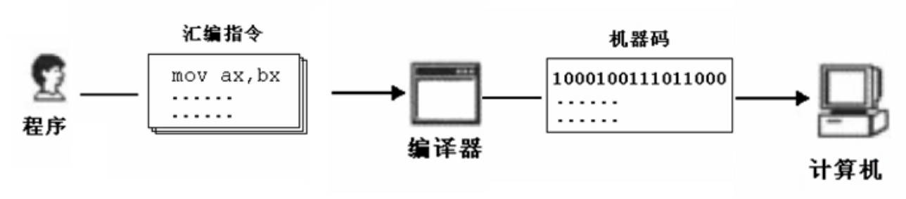     | 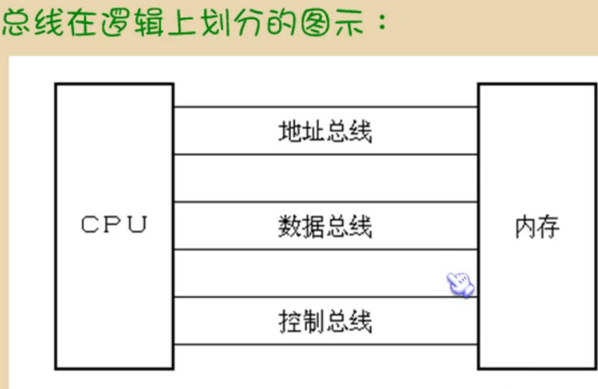       |
| ---------------------------------------------------------- | ------------------------------------------------------------ |
| 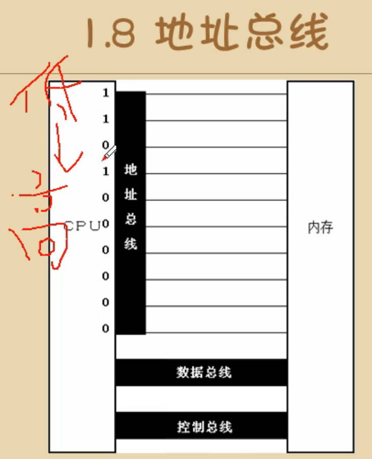 | 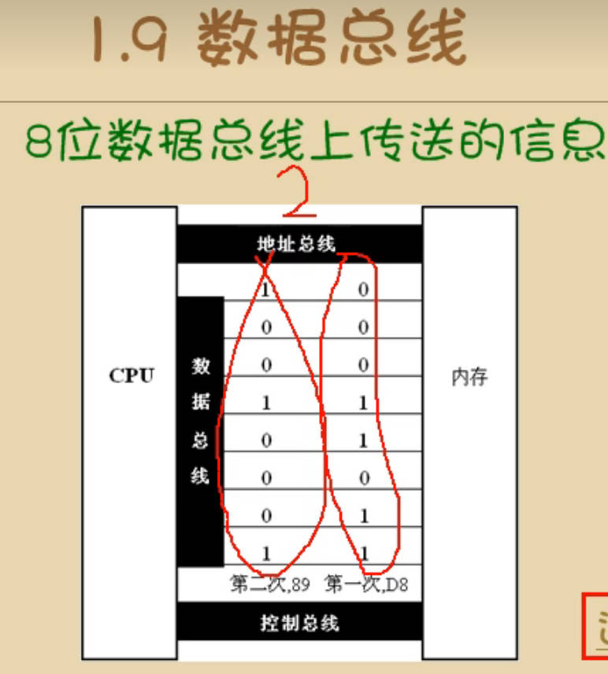 |
| 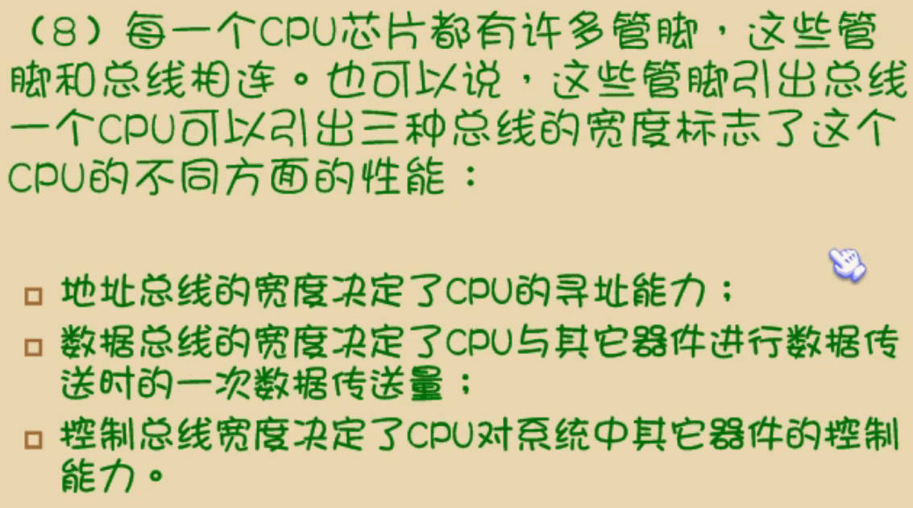     | 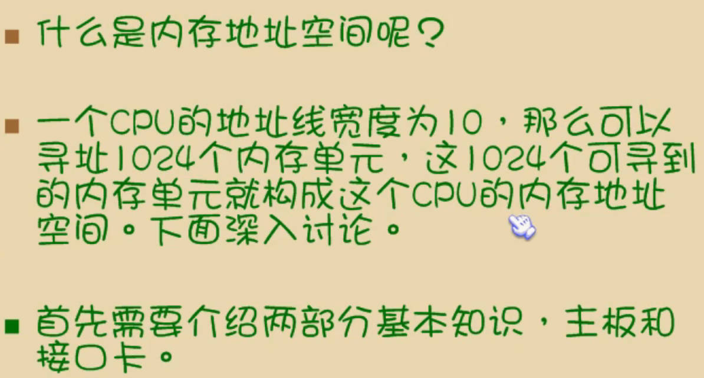       |


## ==存储单元==

**内存原理**： [存储单元](https://blog.csdn.net/qq_48566899/article/details/121993464)  [存储位元、存储单元、存储器](https://blog.csdn.net/Beixun_Qili/article/details/124366627)  [好：内存的工作原理](https://zhuanlan.zhihu.com/p/647602221)	

[存储器](https://developer.aliyun.com/article/1379533) [存储器层次结构](https://zhuanlan.zhihu.com/p/628120496)  [存储器层次结构](https://zhuanlan.zhihu.com/p/676295753) 

[好：寻址空间](https://blog.csdn.net/java0day01/article/details/128681000) 

ddr: [ddr存储单元多少位_百度搜索](https://www.baidu.com/s?ie=UTF-8&wd=ddr%E5%AD%98%E5%82%A8%E5%8D%95%E5%85%83%E5%A4%9A%E5%B0%91%E4%BD%8D)   [DDR3调试](https://blog.csdn.net/m0_51679724/article/details/135123993)  [DDR3](https://zhuanlan.zhihu.com/p/582524766)   [ddr2内存有多少位](https://zhidao.baidu.com/question/763559862669421084.html)  [SDRAM、DRAM及DDR FLASH ROM](https://blog.csdn.net/as480133937/article/details/123455890)   [DDR ——演进、构成、存储原理）_DDR协议及应用实践](https://download.csdn.net/blog/column/11620514/122753673)   [理解DDR基本原理](http://www.360doc.com/content/24/0507/10/83214889_1122586862.shtml)      
[ddr5存储单元多少位_百度搜索](https://www.baidu.com/s?ie=utf-8&f=8&rsv_bp=1&tn=baidu&wd=ddr5%E5%AD%98%E5%82%A8%E5%8D%95%E5%85%83%E5%A4%9A%E5%B0%91%E4%BD%8D&oq=ddr%25E5%25AD%2598%25E5%2582%25A8%25E5%258D%2595%25E5%2585%2583%25E5%25A4%259A%25E5%25B0%2591%25E4%25BD%258D&rsv_pq=e525427e000699cb&rsv_t=5a11TaBnew8%2BX7NnAbUNzrXPGLvYsweZRaSgEwg8qfD9hH9q7UOhkAZTN6I&rqlang=cn&rsv_enter=1&rsv_dl=tb&rsv_sug3=2&rsv_sug1=2&rsv_sug7=100&bs=ddr%E5%AD%98%E5%82%A8%E5%8D%95%E5%85%83%E5%A4%9A%E5%B0%91%E4%BD%8D)  

`存储器划分为若干存储单元`，每个==存储单元从0开始顺序编号==

==理解==： 如果存储单元用2位表示，2^2=4，  `00 01 10 11`

==计算机的内存是按照字节来进行编址==   [一个内存单元存1个字节_百度搜索](https://www.baidu.com/s?ie=UTF-8&wd=%E4%B8%80%E4%B8%AA%E5%86%85%E5%AD%98%E5%8D%95%E5%85%83%E5%AD%981%E4%B8%AA%E5%AD%97%E8%8A%82)	[存储单元_百度百科](https://baike.baidu.com/item/%E5%AD%98%E5%82%A8%E5%8D%95%E5%85%83/8727749)	[内存按什么进行编址](https://baijiahao.baidu.com/s?id=1762863940638287276&wfr=spider&for=pc)  [好：各种硬件位数](https://blog.csdn.net/Cbelieveyouself/article/details/129799939)	 

- 内存按字节编址的意思，就是`每个地址指向的储存单元可以保存1个字节的数据`，也就是8bit（8个二进制位）
- **一个内存单元通常存储1个字节**‌。内存单元是最小的数据存储单位，通常以字节为单位。一个字节由8个二进制位（bit）组成 

> - 存储单元位宽‌:	指存储单元能够存储的二进制位数
> - 位宽: 		  指一个数字电路（如处理器、存储器等）一次性处理或传输的二进制位的数量, 
>   - 它决定了数据总线的宽度以及数据总线可以传输的数据量。在存储器中，`位宽决定了每个存储单元的大小  [存储单元位宽_百度搜索](https://www.baidu.com/s?ie=UTF-8&wd=%E5%AD%98%E5%82%A8%E5%8D%95%E5%85%83%E4%BD%8D%E5%AE%BD) 	
>   - **8位宽**： 每个内存单元存储1字节（8位）数据，每次读写1字节数据。  [好：位宽，位移操作的含义和作用](https://blog.csdn.net/m0_59951855/article/details/140958298)	
>   - **16位宽**：每个内存单元存储2字节（16位）数据
> - 地址与存储单元的位宽没有关系,  地址多少是由系统的`地址总线`的数量决定的，它是存储单元的编号，如地址总线是16条，那么地址就是16位二进制数，最大地址是65535，即是FFFFH     [地址总线和位宽的关系](https://zhidao.baidu.com/question/332579711239400045.html)	
>   - 地址宽度: 决定了存储器的寻址范围,即可以访问的存储单元数量

地址空间 和 存储空间    [存储单元地址位宽_百度搜索](https://www.baidu.com/s?ie=utf-8&f=8&rsv_bp=1&tn=baidu&wd=%E5%AD%98%E5%82%A8%E5%8D%95%E5%85%83%E5%9C%B0%E5%9D%80%E4%BD%8D%E5%AE%BD&oq=%25E5%25AD%2598%25E5%2582%25A8%25E5%258D%2595%25E5%2585%2583%25E4%25BD%258D%25E5%25AE%25BD&rsv_pq=eb2def3b0000b11c&rsv_t=5849twvOSfIk1%2Fg8ouWz%2BTc7B7Em51R3nVtc16LX%2FAXB8Xiad0yRidh%2FzIY&rqlang=cn&rsv_enter=1&rsv_dl=tb&rsv_sug3=5&rsv_sug1=3&rsv_sug7=100&rsv_sug2=0&rsv_btype=t&inputT=7418&rsv_sug4=8562)	

- DDR3的存储单元是32位   
- ‌**[DDR5内存](https://www.baidu.com/s?rsv_dl=re_dqa_generate&sa=re_dqa_generate&wd=DDR5内存&rsv_pq=a483537b00008ff0&oq=ddr5存储单元多少位表示&rsv_t=7b7f3cysnmM7/qcvU7vGOt1GTbGETfH9mnKnw5Q1bDOMXEGXoQcFgE/MIkE&tn=baidu&ie=utf-8)的存储单元位宽为64位**‌。每个通道的位宽为32位，通过双通道设计，总位宽达到64位‌。这意味着DDR5内存在一个周期内能够传递的数据量为64位，与前代[DDR4](https://www.baidu.com/s?rsv_dl=re_dqa_generate&sa=re_dqa_generate&wd=DDR4&rsv_pq=a483537b00008ff0&oq=ddr5存储单元多少位表示&rsv_t=7b7f3cysnmM7/qcvU7vGOt1GTbGETfH9mnKnw5Q1bDOMXEGXoQcFgE/MIkE&tn=baidu&ie=utf-8)相同，但DDR5通过双通道设计提高了灵活性和效率‌    [ddr5位宽](https://in.ali213.net/yjjc/202402/11373.html)	

### cpu对存储器读写

| 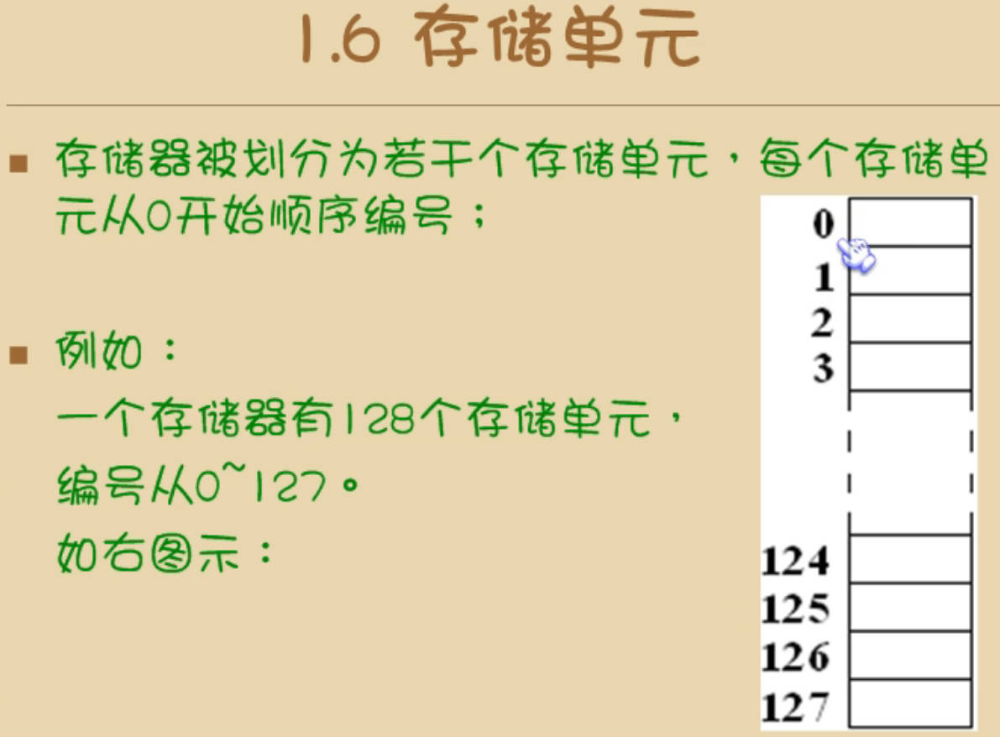       | 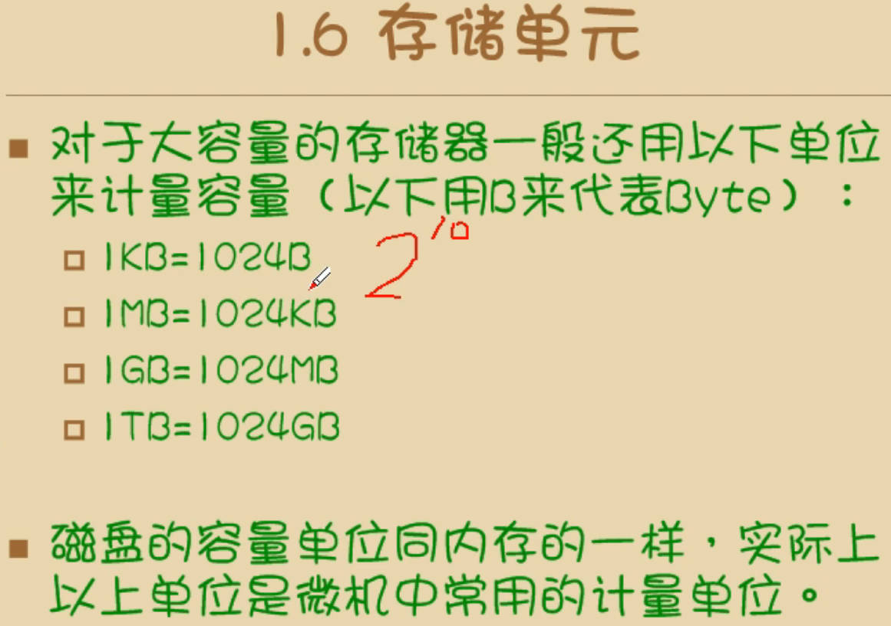 |
| ------------------------------------------------------------ | ------------------------------------------------------ |
| 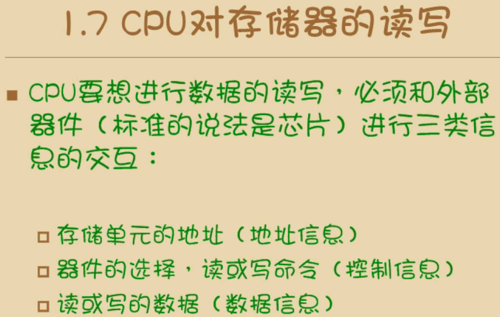       | 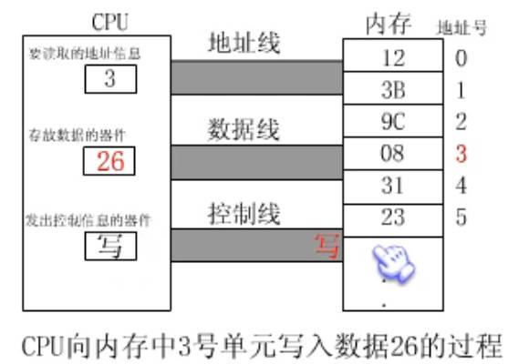 |
| 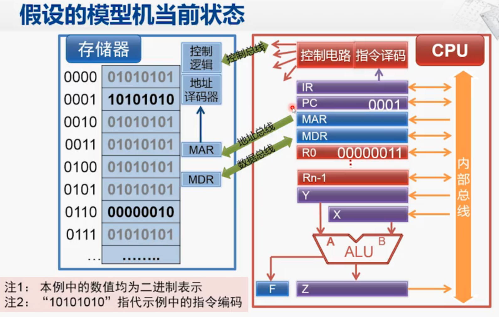 |  |

- ==取指==令  [好：计算机执行指令的过程](https://www.bilibili.com/video/BV1VE411o7nx?vd_source=7346303e5e18677d7261c2c0c109ecfd&p=5&spm_id_from=333.788.videopod.episodes)	[好：动画带你理解CPU怎么执行一条指令](https://www.bilibili.com/video/BV15u4y187vA/?vd_source=7346303e5e18677d7261c2c0c109ecfd)	[计算机执行指令的过程_百度搜索](https://www.baidu.com/s?ie=UTF-8&wd=%E8%AE%A1%E7%AE%97%E6%9C%BA%E6%89%A7%E8%A1%8C%E6%8C%87%E4%BB%A4%E7%9A%84%E8%BF%87%E7%A8%8B)	
  - 控制器将`指令地址`送到存储器
  - 存储器按给定地址`读出指令`，送回控制器
  - **流程**：==a==、PC里的地址存入MAR,通过`地址总线`存入存储器MAR，同时，控制电路通过`控制总线`发出读数据； ==b、==通过地址译码器查到地址0001的内容，送入MDR,然后通过`数据总线`保存到cpu中的MDR， 同时保存到IR,然后更新PC，指向下一条指令地址 
- ==译码==： CPU根据存储器提取到的指令来决定其执行行为。在解码阶段，指令被拆解为有意义的片段，根据CPU的`指令集架构（ISA）定义将数值解译为指令`
  - 控制器`分析指令的操作性质`
  - 控制器向有关部件`发出指令所需的控制信号`
  - **流程**：送入`IR的指令，通过指令译码 翻译`，==发现是一个加法指令==，就知道指令要干什么了，然后控制电路据此产生控制信号，发到相关部件中。
- ==执行==： ==连接到==各种能够进行所需运算的==CPU部件==
  - 算数逻辑单元（ALU）执行三类计算：算数逻辑运算、计算内存引用有效地址、针对push和pop等计算栈指针的增减
  - 控制器从通用寄存器或存储器`取出操作数`
  - 控制器命令运算器对操作数进行指令规定的`运算`
  - **流程：** `ADD R0，[6]`，其中一个操作数[6]在存储器中， 地址放入MAR，通过地址总线存入存储器MAR, 然后类似取指，对应的地址内容送入MDR,因为要进行加法运算，送入ALU的Y寄存器，另一个操作数R0内容，送入X寄存器，ALU进行运算 
- ==回写==(write back)： 将指令执行的`结果写回通用寄存器或存储器`，  运算结果写入`通用寄存器 或 存储器`； 例子里 结果回写到RO寄存器中


### 内存带宽

理论： [DDR4原理及硬件设计](https://download.csdn.net/blog/column/9683727/113786705)	[DDR内存原理](https://www.sohu.com/a/777268508_121124371)   [DDR5内存的“组织架构” ](https://zhuanlan.zhihu.com/p/675766394)  [内存条的存储单元](https://blog.csdn.net/tantangyun/article/details/137280073)	[搞懂DDR5](https://1587351786.spaces.eepw.com.cn/articles/article/item/183193)	[DDR5 内存标准：新一代 DRAM 模组技术简介](https://www.kingston.com.cn/cn/blog/pc-performance/ddr5-overview)		 [DDR5内存标签](https://baijiahao.baidu.com/s?id=1813989102895232240&wfr=spider&for=pc)	

[DDR带宽计算](https://blog.csdn.net/weixin_45377629/article/details/134459829)	 [内存带宽_百度搜索](https://www.baidu.com/s?ie=UTF-8&wd=%E5%A6%82%E6%9E%9C%E4%B8%80%E4%B8%AA%E5%86%85%E5%AD%98%E8%8A%AF%E7%89%87%E7%9A%84%E4%BD%8D%E5%AE%BD%E4%B8%BA64%E4%BD%8D%EF%BC%8C%E6%97%B6%E9%92%9F%E9%A2%91%E7%8E%87%E4%B8%BA2%20GHz%EF%BC%8C%E9%82%A3%E4%B9%88%E5%85%B6%E5%86%85%E5%AD%98%E5%B8%A6%E5%AE%BD%E4%B8%BA)	 [ddr4位宽_百度搜索](https://www.baidu.com/s?ie=utf-8&f=8&rsv_bp=1&tn=baidu&wd=ddr4%E4%BD%8D%E5%AE%BD&oq=ddr4&rsv_pq=8525cd9a000860a0&rsv_t=e7dbwwfxHV4QT9T9dTNexF3MWAL%2F%2FvCeAgrO3CRnwUagIsT6HwgIAxvJQYw&rqlang=cn&rsv_enter=1&rsv_dl=tb&rsv_sug3=9&rsv_sug1=6&rsv_sug7=100&rsv_sug2=0&rsv_btype=t&inputT=3282&rsv_sug4=5531)	[ddr5存储单元多少位表示_百度搜索](https://www.baidu.com/s?ie=UTF-8&wd=ddr5%E5%AD%98%E5%82%A8%E5%8D%95%E5%85%83%E5%A4%9A%E5%B0%91%E4%BD%8D%E8%A1%A8%E7%A4%BA)	

[内存带宽计算](https://blog.51cto.com/zywqs/12293350)   [DDR3/DDR4理论带宽和实际带宽计算](https://blog.csdn.net/weixin_42564775/article/details/131525373)	 [内存带宽_百度搜索](https://www.baidu.com/s?ie=UTF-8&wd=%E5%86%85%E5%AD%98%E5%B8%A6%E5%AE%BD)	

[pc3-12800_百度搜索](https://www.baidu.com/s?ie=UTF-8&wd=pc3-12800)	[pc3-12800](https://mbd.baidu.com/newspage/data/dtlandingsuper?nid=dt_4603798152892653921&sourceFrom=search_a)		[内存PC3-12800什么意思？_百度知道](https://zhidao.baidu.com/question/592900083603666605.html)	

CPU的数据传输速度和RAM的访问速度： [计算理论上的最大CPU-RAM带宽](https://cloud.tencent.com/developer/information/%E5%A6%82%E4%BD%95%E8%AE%A1%E7%AE%97%E7%90%86%E8%AE%BA%E4%B8%8A%E7%9A%84%E6%9C%80%E5%A4%A7CPU-RAM%E5%B8%A6%E5%AE%BD%EF%BC%9F-salon)	

- CPU的数据传输速度取决于其总线宽度和时钟频率
  - 例如，一个总线宽度为64位、时钟频率为2.6 GHz的CPU，其数据传输速度为64位 * 2.6 GHz = 166.4 GB/s
- RAM的访问速度取决于其`频率和通道数`
  - RAM的频率表示`每秒RAM能够传输的数据次数`，常见的频率有2133 MHz、2400 MHz等
  - RAM的访问速度可以通过频率乘以通道数来计算。例如，一组频率为2400 MHz、双通道的RAM，其访问速度为2400 MHz * 2 = 4800 MT/s。
  - 前面提到的CPU和RAM组合，其最大带宽为166.4 GB/s * 4800 MT/s = 798.7 GB/s。  
  - `2133MHz的DDR4内存单通道带宽`为17GB/s（2133MHz * 64bit / 8）。而在双通道模式下，两个通道的带宽翻倍，达到34GB/s

 ==和下面的理解不知道哪个是正确的== 


单位时间通过内存的数据量。内存带宽通常以==每秒传输的比特数==（bits per second, bps）或字节数（bytes per second, Bps）来衡量 

1. 内存的`位宽`（Bit Width）：这是内存芯片每次可以读或写的位数。例如，64位的内存一次可以传输64位数据
2. 内存的`时钟频率`（Clock Frequency）：这是内存操作的频率，单位通常是赫兹（Hz）。例如，1 GHz意味着每秒有10亿次操作
   1. ‌‌CPU主频:  CPU内核工作的时钟频率，表示CPU内数字脉冲信号震荡的速度‌,  衡量`CPU执行指令速度`的指标。它表示CPU每秒钟能够进行的周期性操作次数
3. 每次操作的数据量：这通常与内存的位宽相关，即`每次操作传输的位数` 

==计算公式==： `内存带宽 = 内存位宽 x 时钟频率`  **$$ \text{内存带宽} = \text{内存位宽} \times \text{时钟频率} $$**

- 例如，内存芯片位宽64位，时钟频率为2 GHz，其内存带宽为 `64 bits/cycle  x  2,000,000,000 cycles/second =  1,280,000,000  bits/second`   $$ \text{内存带宽} = 64 \text{ bits/cycle} \times 2,000,000,000 \text{ cycles/second} = 1,280,000,000 \text{ bits/second} $$
- 转换为字节（Byte） : `1,280,000,000 \text{ bits}}{8} = 160,000,000 \text{ Bytes/second`    $$ \text{内存带宽} = \frac{1,280,000,000 \text{ bits}}{8} = 160,000,000 \text{ Bytes/second} $$


[ddr4只有单通道_百度搜索](https://www.baidu.com/s?ie=UTF-8&wd=ddr4%E5%8F%AA%E6%9C%89%E5%8D%95%E9%80%9A%E9%81%93)	[DDR4 与 DDR5有什么区别](https://baijiahao.baidu.com/s?id=1815418639689581510&wfr=spider&for=pc)	 [DDR4内存单通道与双通道性能对比测试](https://m.zol.com.cn/diybbs/d231_835427_p5.html)	[ddr5位宽](https://in.ali213.net/yjjc/202402/11373.html)	

DDR4单通道与双通道的性能差异: 带宽、延迟

1. ‌**带宽**‌： 2133MHz的DDR4内存单通道带宽为17GB/s（2133MHz * 64bit / 8）。双通道模式下，两个通道的带宽翻倍，达到34GB/s。双通道模式下，数据传输速度和效率更高
2. ‌**延迟**‌：单通道DDR4内存的延迟通常较高，因为数据需要分时传输。相比之下，双通道模式可以减少延迟，提高系统的响应速度和稳定性‌

### 带宽

[好：总线，接口详解](https://blog.csdn.net/kinglapland/article/details/86742579)

- 接口：两个部件连接
- 总线：多个部件连接	

[UPI总线](https://blog.csdn.net/yovo1/article/details/145907133)	[快速信道互联_QPI](https://baike.baidu.com/item/%E5%BF%AB%E9%80%9F%E4%BF%A1%E9%81%93%E4%BA%92%E8%81%94/23316032)  [DMI](https://baike.baidu.com/item/DMI/16024)		[Intel架构介绍 ](https://zhuanlan.zhihu.com/p/645726459)  [FSB总线、HT总线、QPI总线、DMI总线](https://iknow.lenovo.com.cn/detail/122293.html)	[PCH 和处理器 DMI 通信](https://blog.csdn.net/qq_37037348/article/details/139850629)  [IntelPCH：集成桥接与控制技术详解](https://blog.csdn.net/ldd15618129225/article/details/133881817) 	 [为什么USB3.0到现在还没有完全淘汰2.0？](https://www.zhihu.com/question/30299595/answer/3244813743)	

[QM、DMI总线、QPI总线、Skylake架构_百度搜索](https://www.baidu.com/s?ie=utf-8&f=8&rsv_bp=1&tn=baidu&wd=QM%E3%80%81DMI%E6%80%BB%E7%BA%BF%E3%80%81QPI%E6%80%BB%E7%BA%BF%E3%80%81Skylake%E6%9E%B6%E6%9E%84&oq=Intel%2520%2526lt%253Bore%2520i7-2670QM%25E3%2580%2581DMI%25E6%2580%25BB%25E7%25BA%25BF%25E3%2580%2581QPI%25E6%2580%25BB%25E7%25BA%25BF%25E3%2580%2581Skylake%25E6%259E%25B6%25E6%259E%2584&rsv_pq=abb085bf00249c53&rsv_t=7457EoF6%2BRlBwJ4XaEnVPmlNat3acqrudrxo2OD6XTVOAavU3K6X2EYIOUI&rqlang=cn&rsv_enter=0&rsv_dl=tb&rsv_sug3=1&rsv_sug1=1&rsv_sug7=100&rsv_btype=t&inputT=17334&rsv_sug4=17334)	[DMI4.0](https://www.bilibili.com/opus/569743337554848739)	 [百度AI -DMI总线](https://chat.baidu.com/search?word=DMI%E5%B8%A6%E5%AE%BD&pd=csaitab&setype=csaitab&extParamsJson=%7B%22enter_type%22%3A%22sug_direct%22%2C%22sa%22%3A%22iks_purpose_dibu%22%2C%22apagelid%22%3A%2286fb15710002ef48%22%2C%22ori_lid%22%3A%2286fb15710002ef48%22%7D)	

[i7有多少地址总线_百度搜索](https://www.baidu.com/s?ie=UTF-8&wd=i7%E6%9C%89%E5%A4%9A%E5%B0%91%E5%9C%B0%E5%9D%80%E6%80%BB%E7%BA%BF)	[DMI总线_百度搜索](https://www.baidu.com/s?ie=utf-8&f=8&rsv_bp=1&tn=baidu&wd=DMI%E6%80%BB%E7%BA%BF&oq=DMI&rsv_pq=ffdb5b000022f40d&rsv_t=a46aOpVhSNJu5XeXzSNAOpd4Np2wisy2J3bqorlAtvv5gICRDwbADmBVAQ4&rqlang=cn&rsv_enter=1&rsv_dl=tb&rsv_sug3=7&rsv_sug1=4&rsv_sug7=100&rsv_sug2=0&rsv_btype=t&inputT=2091&rsv_sug4=3396)			

[传输速率_百度百科](https://baike.baidu.com/item/%E4%BC%A0%E8%BE%93%E9%80%9F%E7%8E%87/10839944?fr=aladdin)	[数据传输率_百度百科](https://baike.baidu.com/item/%E6%95%B0%E6%8D%AE%E4%BC%A0%E8%BE%93%E7%8E%87/603683?fromModule=lemma_inlink)	[编码率_百度搜索](https://www.baidu.com/s?ie=UTF-8&wd=%E7%BC%96%E7%A0%81%E7%8E%87)	[8/10编码](https://www.baidu.com/s?ie=UTF-8&wd=8/10%E7%BC%96%E7%A0%81)	

[GT/s_百度百科](https://baike.baidu.com/item/GT%2Fs/7008611)	[GT/s和GB/s（Gbps）](https://blog.csdn.net/sinat_41896311/article/details/114091263)	[十年前的CPU还能不能用？](https://zhuanlan.zhihu.com/p/125718959/)	 

Mbps(megabits per second) : 一种==传输速率==单位，指每秒传输的位（比特）数量,  1Mbps代表每秒传输1,000,000位（bit）

- PCH（Platform Controller Hub）是英特尔芯片组架构中的一个关键组成部分，它位于主板上，并且作为处理器（CPU）和系统其他部分之间的桥梁和集线器
- DMI（Direct Media Interface）是一种由英特尔开发的专有`总线协议`，用于连接处理器和 PCH。它提供了高速的点对点通信通道，用于传输各种数据和控制信息

### 虚拟存储器

[虚拟存储器_百度搜索](https://www.baidu.com/s?ie=UTF-8&wd=%E8%99%9A%E6%8B%9F%E5%AD%98%E5%82%A8%E5%99%A8)   [内存管理](https://blog.csdn.net/qq_48566899/article/details/121993464)

[虚拟存储器](https://blog.csdn.net/m0_62410106/article/details/135254586) 

页表： [页表](https://zhuanlan.zhihu.com/p/628274879)  [页表_百度搜索](https://www.baidu.com/s?ie=UTF-8&wd=%E9%A1%B5%E8%A1%A8) 

段表： [段表_百度搜索](https://www.baidu.com/s?ie=utf-8&f=8&rsv_bp=1&tn=baidu&wd=%E6%AE%B5%E8%A1%A8&oq=%25E9%25A1%25B5%25E8%25A1%25A8&rsv_pq=abe8348f00637d9f&rsv_t=25d4f6KSNMmn9uKzzI%2FH3qp%2BkJigWeTZbSUxsqOJ1czAlFwxhqaC8Y2SvCo&rqlang=cn&rsv_enter=1&rsv_dl=tb&rsv_sug3=10&rsv_sug1=13&rsv_sug7=100&rsv_sug2=0&rsv_btype=t&inputT=6228&rsv_sug4=53137) 

## 内存地址空间

[扩展内存](https://baike.baidu.com/item/%E5%86%85%E5%AD%98/103614?fromtitle=%E5%86%85%E9%83%A8%E5%AD%98%E5%82%A8%E5%99%A8&fromid=4567097)    [为什么堆如此之慢？| 堆栈 缓存 虚拟内存 内存管理](https://www.bilibili.com/video/BV1wAySYcEyC/?vd_source=7346303e5e18677d7261c2c0c109ecfd)	[计算机是如何工作的？CPU、ROM、RAM、地址总线、数据总线、控制总线和地址解码](https://www.bilibili.com/video/BV13Z22YCEyM?spm_id_from=333.788.recommend_more_video.-1&vd_source=7346303e5e18677d7261c2c0c109ecfd)	  

- 地址总线的宽度决定，cpu可寻到的内存单元； 即cpu的寻址空间
- 不同系统内存地址空间分配不同

| 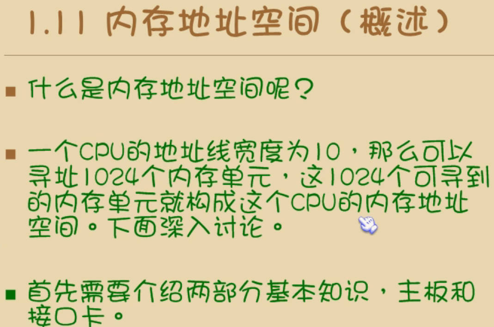 | 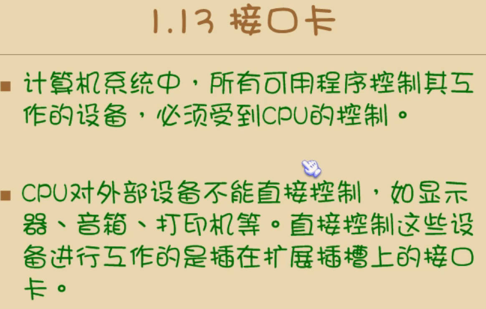 |
| ------------------------------------------------------ | ------------------------------------------------------ |
| 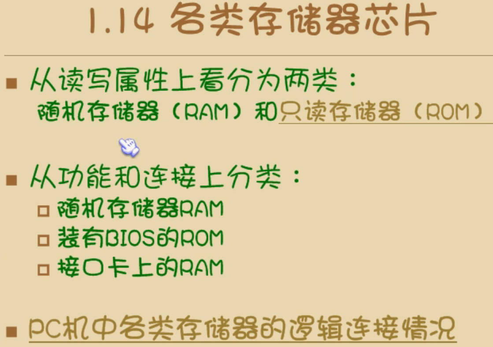 | 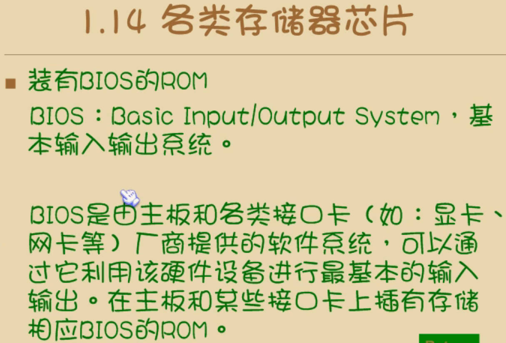 |
| 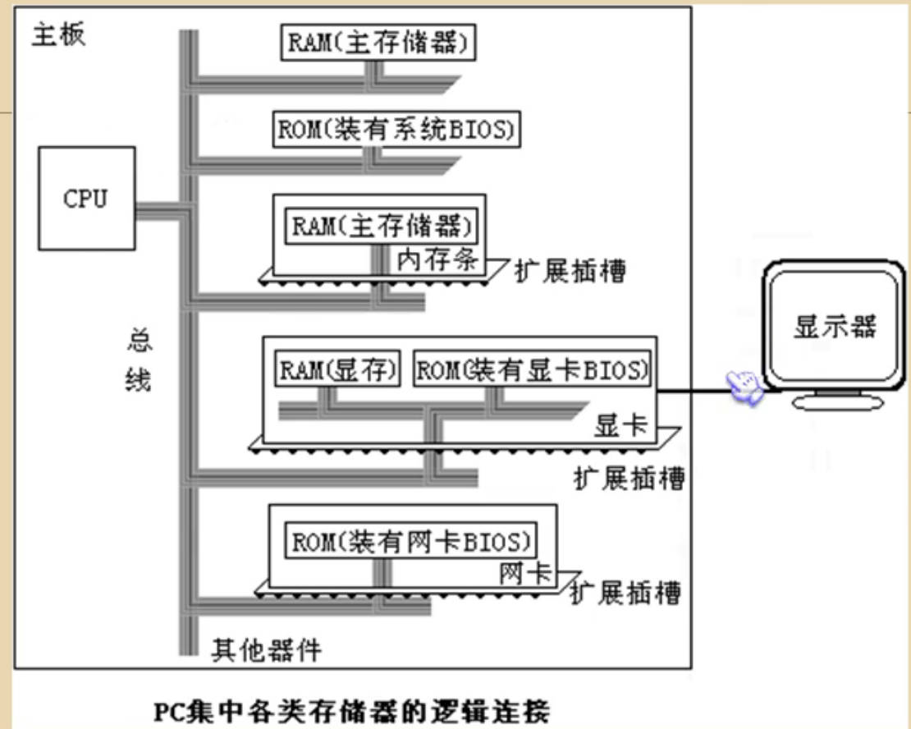 | 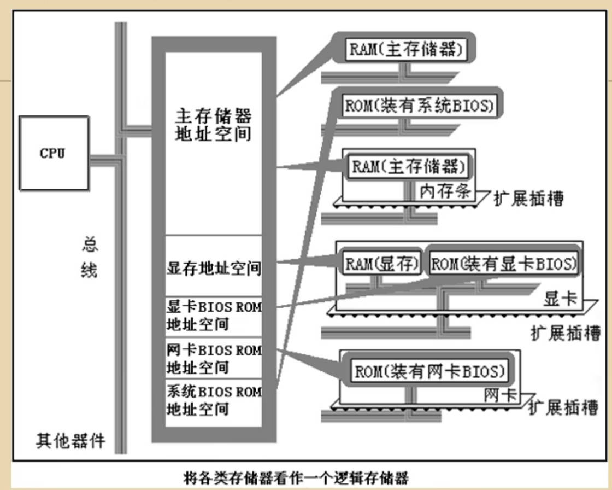 |
| 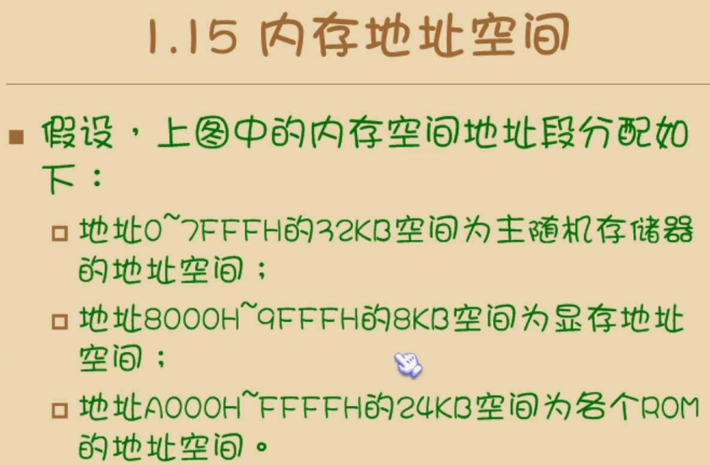 | 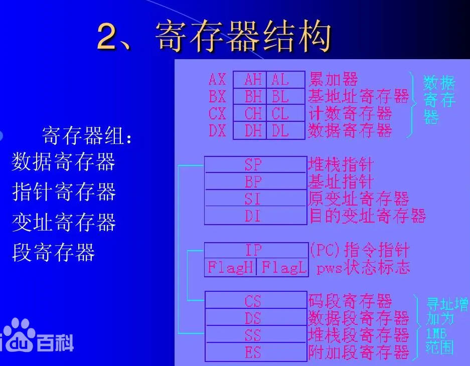 |

## ==分页存储管理==

视频： [好：基本分页存储管理](https://www.bilibili.com/video/BV1hd4y1m7yC/?vd_source=7346303e5e18677d7261c2c0c109ecfd)  [内存管理](https://www.bilibili.com/video/BV1j8411p7X3/?vd_source=7346303e5e18677d7261c2c0c109ecfd)   [分页存储](https://search.bilibili.com/all?vt=09912732&keyword=%E5%88%86%E9%A1%B5%E5%AD%98%E5%82%A8&search_source=5) 

[分页存储_百度搜索](https://www.baidu.com/s?ie=utf-8&f=8&rsv_bp=1&tn=baidu&wd=%E5%88%86%E9%A1%B5%E5%AD%98%E5%82%A8&oq=win7%25E5%2586%2585%25E5%25AD%2598%25E5%259C%25B0%25E5%259D%2580%25E7%25A9%25BA%25E9%2597%25B4%25E5%2588%2586%25E9%2585%258D&rsv_pq=ed3136d80049016f&rsv_t=cb734T%2BpIlVyIkoTfXD%2BSWJR5w51Xo6Y57k4nIF69JCb8NvRxirazeXvsAI&rqlang=cn&rsv_enter=0&rsv_dl=tb&rsv_n=2&rsv_sug3=1&rsv_sug1=1&rsv_sug7=100&rsv_btype=t&inputT=2322&rsv_sug4=2323)  [分页存储管理 ](https://www.cnblogs.com/liyaaixuexi/p/17259199.html)   [存储管理之页式、段式、段页式存储](https://cloud.tencent.com/developer/article/2137775) 

[win7内存地址空间分配_百度搜索](https://www.baidu.com/s?ie=UTF-8&wd=win7%E5%86%85%E5%AD%98%E5%9C%B0%E5%9D%80%E7%A9%BA%E9%97%B4%E5%88%86%E9%85%8D)      [存储器逻辑连接_百度图片搜索](https://image.baidu.com/search/index?tn=baiduimage&ps=1&ct=201326592&lm=-1&cl=2&nc=1&ie=utf-8&dyTabStr=MCwzLDEsMiwsNyw2LDUsMTIsOQ%3D%3D&word=%E5%AD%98%E5%82%A8%E5%99%A8%E9%80%BB%E8%BE%91%E8%BF%9E%E6%8E%A5) 

[ARM32位系统的内存布局](https://zhuanlan.zhihu.com/p/702566786) 

- 分页存储管理思想就是==分块==： 避免内存使用碎片产生
  - 把主存空间划分为大小相等且固定的块; 进程也以块为单位划分
  - 进程某个块去申请主存某个块,只有进程最后一个不完整的块会产生页内碎片
- 不同对象分块有什么区别
  - ==进程块page==：分为页、页面，页面大小是2的整数次幂
  - ==内存块Page Frame==：页框、页帧；也叫物理块、内存块、物理页面
    - 进程和内存分块，即页放到页框里，大小相等，一一对应
  - ==外存Block==： 块、盘块
- ==访问某个逻辑地址==流程： `x=58`
  - 页号：确定进程页面
  - 页内偏移量： 进程A的的x指令，在页面里有偏移量
  - 确定所在的进程页面，在内存中的起始地址
- ==地址结构==： 地址长度是32位，0-11是页内地址，12-31是页号； 所以偏移最多2的12次方，最多2的20次方个页面
  - 地址结构： `页号P + 页内偏移量`
  - 一个页面大小，最多2的k次方个内存单元
  - 一个进程最多2的m次方个页面
- 页表： 提供页面和页框的对应关系，用来找起始地址，==逻辑地址映射到物理地址==； `页表项： 页号 + 块号`

| 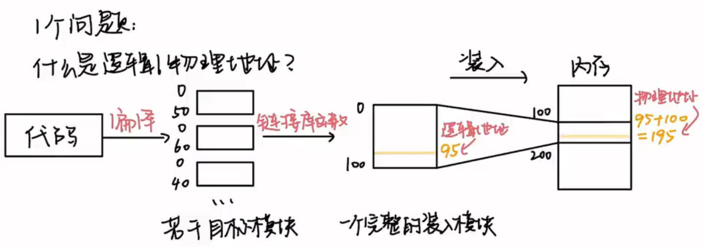       | 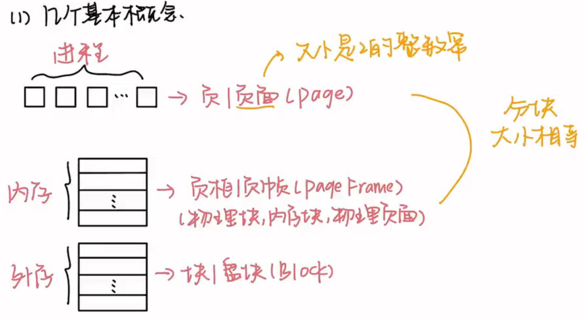 |
| ------------------------------------------------------------ | ------------------------------------------------------ |
|        | 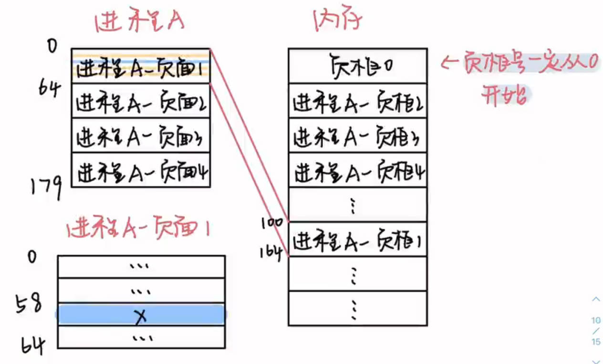 |
| 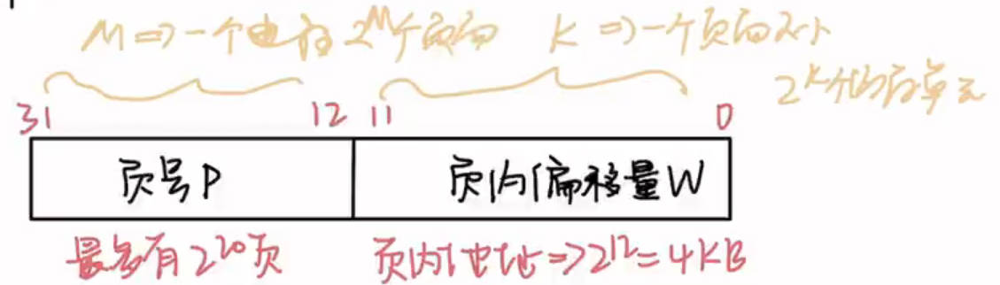 | 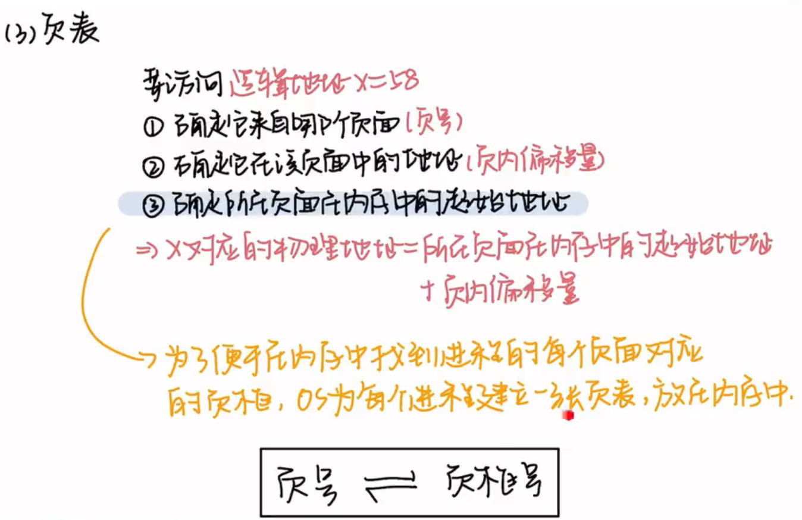 |
| 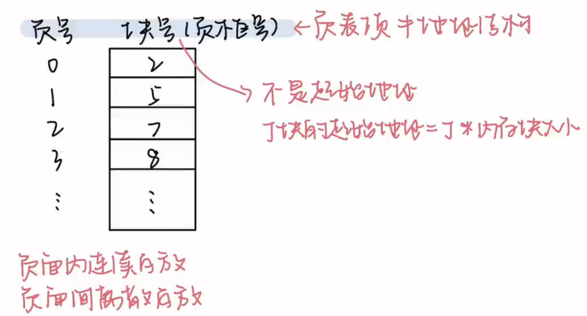 |                                                        |


# 2、寄存器（==CPU==工作原理_csip取指）

[CPU寄存器与寻址方式](https://blog.csdn.net/zyhse/article/details/133986422)  [64位寻址空间](https://blog.csdn.net/General_zy/article/details/126754930)   

[CPU字长、数据总线宽度、内存寻址能力](https://baijiahao.baidu.com/s?id=1792912925591206274&wfr=spider&for=pc)   [CPU字长](https://www.baidu.com/s?ie=UTF-8&wd=CPU%E5%AD%97%E9%95%BF)

**小结**：主要讲==CPU内部的工作原理==； 寄存器、物理地址(2个16位地址，合成一个20位地址)、 内存分段（段寄存器）;

代码段寄存器： ==用 jmp 修改 cs和ip的值==,  cs、ip指过去，代码就开始执行， `cpu将cs:ip指向的内容当作指令执行` 

==**通过cs、ip取指**==令，8086把段地址和偏移地址，合成物理地址

- 通用寄存器、段寄存器cs\ds\es\ss
- cs ip :  `Instruction Pointer`：指令指针寄存器
- ds [address]
- ss sp

pc原理： [cpu技术](https://blog.csdn.net/kittyzc/article/details/118003095)   [i7cpu寄存器多少位_百度搜索](https://www.baidu.com/s?ie=UTF-8&wd=i7cpu%E5%AF%84%E5%AD%98%E5%99%A8%E5%A4%9A%E5%B0%91%E4%BD%8D)    

==通用寄存器==： [8086寄存器 ](https://blog.csdn.net/2302_82189125/article/details/139238002)   [8086 CPU 寄存器](https://www.cnblogs.com/ivantang/p/4545421.html) 

- ‌CPU字长: 计算机在==单位时间内能处理二进制数据的位数。== 通常，CPU字长是8的整数倍
- cpu由运算器、控制器、寄存器等组成
  - 8086cpu有14个寄存器，==16位==， 可存放2个字节 
  - 16位数据在寄存器中如何存放?  ==低地址在前==， 16位寄存器能存2个字节

| 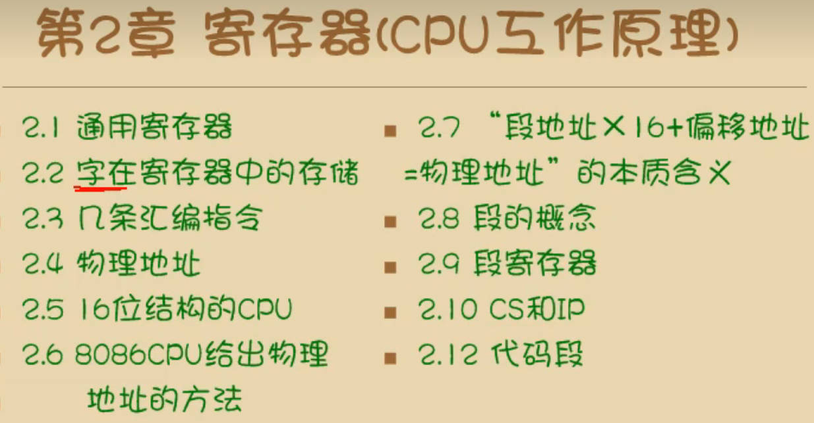 | 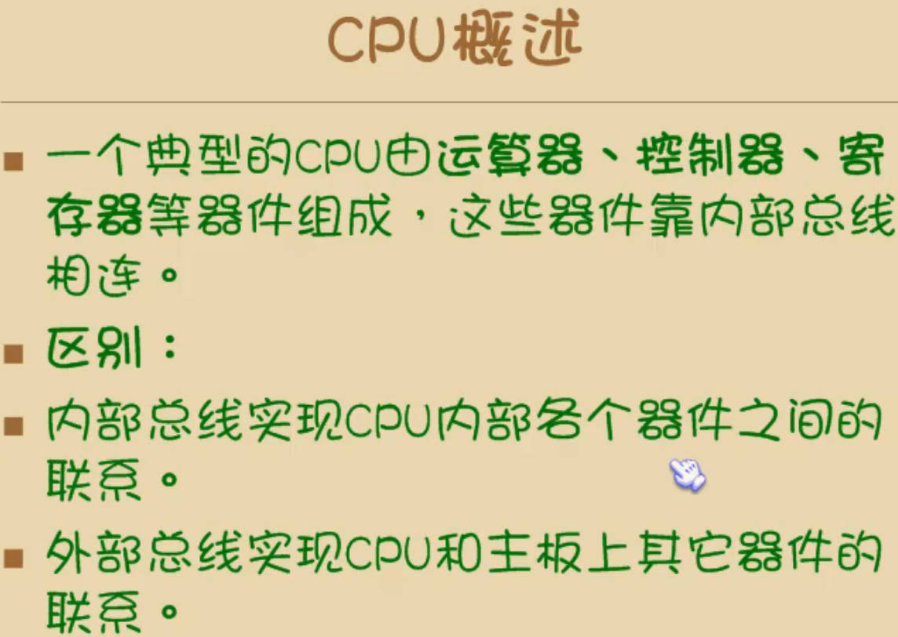 |
| ------------------------------------------------------ | ------------------------------------------------------ |
| 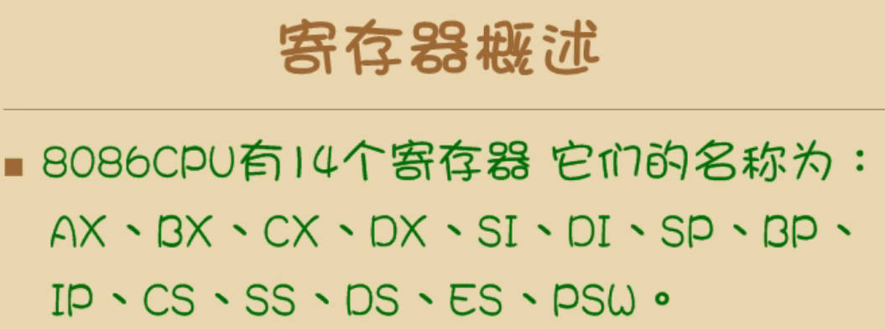 | 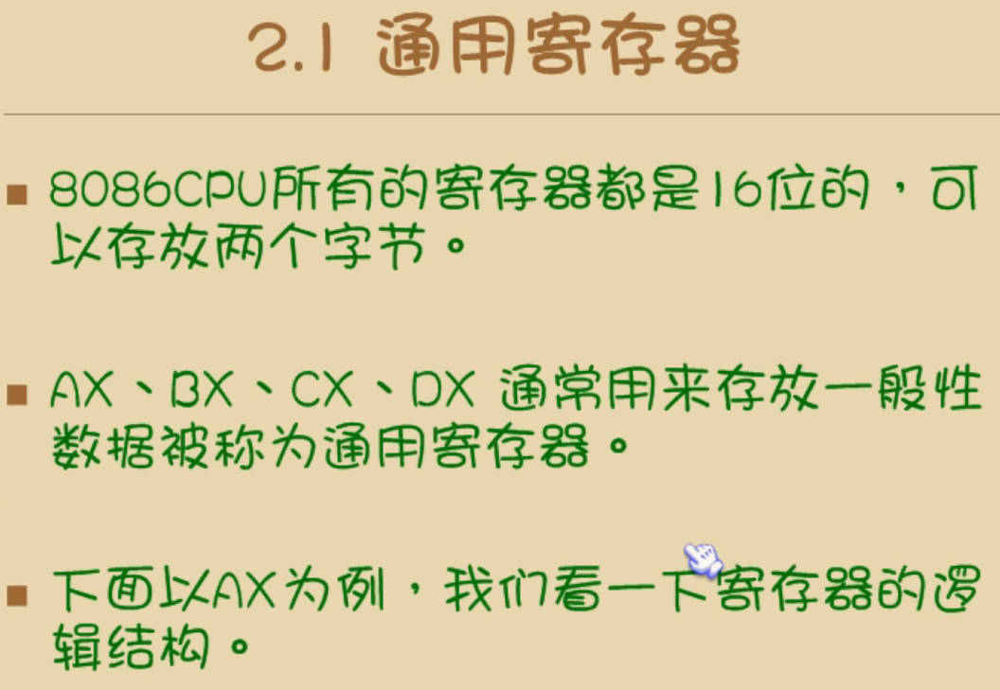 |
| 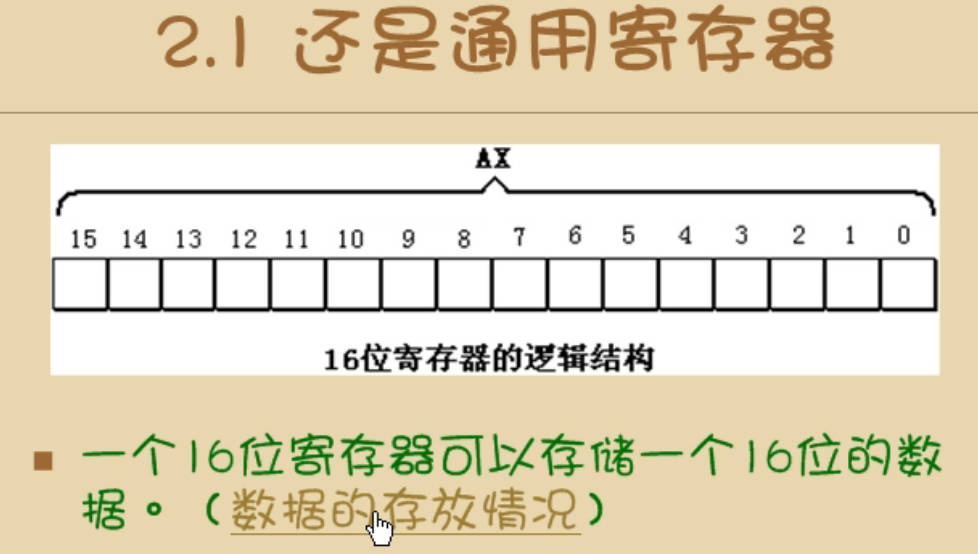 | 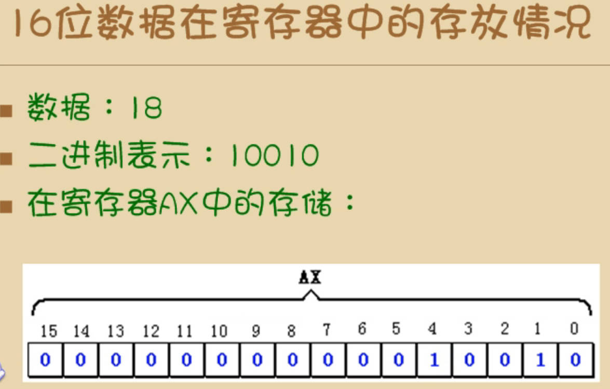 |
| 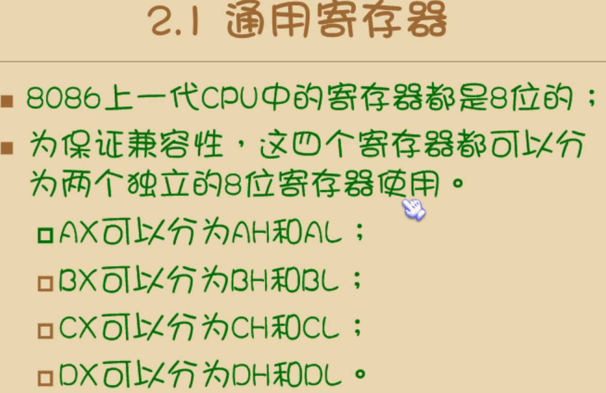 | 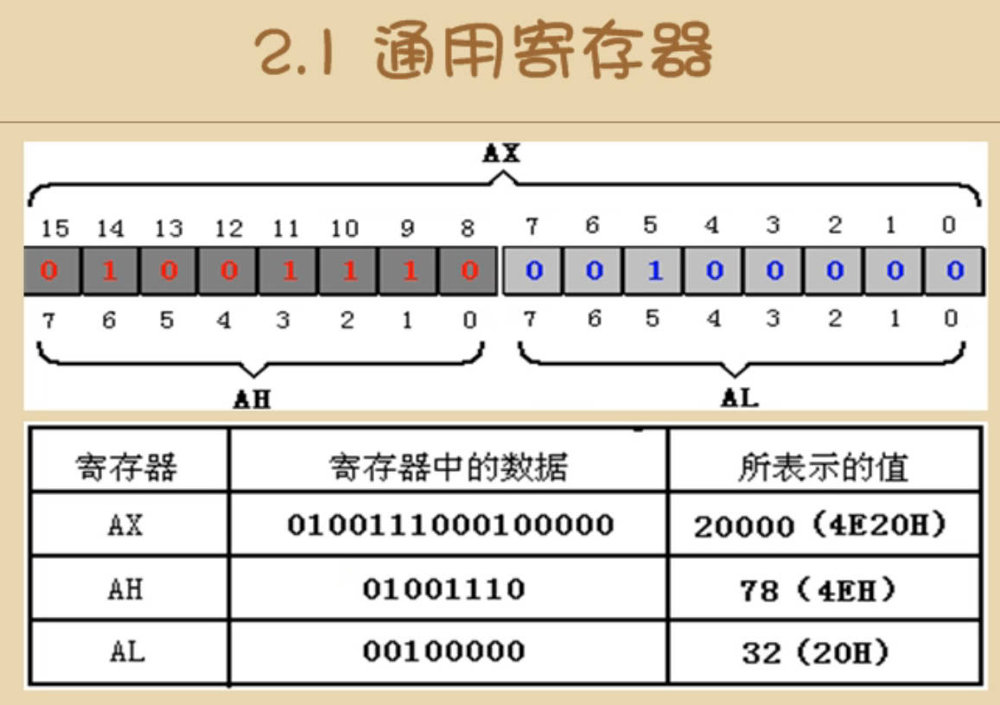 |
| 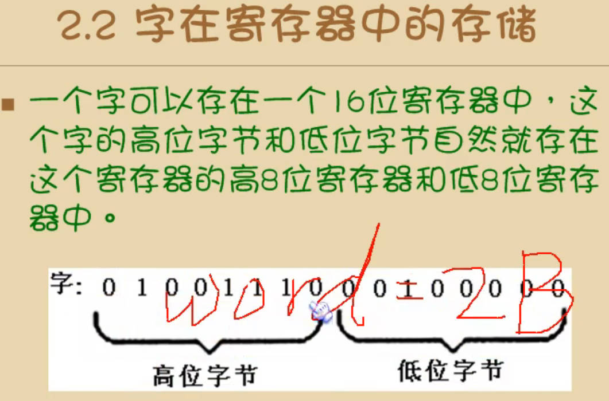 |                                                   |

## 物理地址

[2的16次方，为什么等于64KB？](https://fishc.com.cn/thread-42566-1-1.html)	   [32位cpu偏移地址_百度搜索](https://www.baidu.com/s?ie=UTF-8&wd=32%E4%BD%8Dcpu%E5%81%8F%E7%A7%BB%E5%9C%B0%E5%9D%80)   [64位cpu寻址能力_百度搜索](https://www.baidu.com/s?ie=utf-8&f=8&rsv_bp=1&tn=baidu&wd=64%E4%BD%8Dcpu%E5%AF%BB%E5%9D%80%E8%83%BD%E5%8A%9B&oq=64%25E4%25BD%258Dcpu%25E5%25AF%25BB%25E5%259D%2580&rsv_pq=c4ce7443000f1f8d&rsv_t=9d40QNE1lvHiXjmBXyBsfmqATLd7mIVRH%2BvOODDRxhdfwJxhll0zHs2AZn4&rqlang=cn&rsv_enter=0&rsv_dl=tb&rsv_btype=t&inputT=1499&rsv_sug3=15&bs=64%E4%BD%8Dcpu%E5%AF%BB%E5%9D%80)	[(64位的处理器的地址总线一定也是64位吗？](https://www.zhihu.com/question/22471643/answer/3465146464)	[64位cpu地址总线_百度搜索](https://www.baidu.com/s?ie=utf-8&f=8&rsv_bp=1&tn=baidu&wd=64%E4%BD%8Dcpu%E5%9C%B0%E5%9D%80%E6%80%BB%E7%BA%BF&oq=64%25E4%25BD%258Dcpu%25E5%25AF%25BB%25E5%259D%2580&rsv_pq=b5cba94e0010ed05&rsv_t=199fWAve%2FsD82L1dhnIx%2FpA%2BGWcvirC4zwKH1zXDqjQ6G%2FRzkiQG4CmPRcA&rqlang=cn&rsv_enter=0&rsv_dl=tb&rsv_btype=t&inputT=138055&rsv_sug3=28&rsv_sug2=0&rsv_sug4=140093&rsv_sug=1)	[cpu总线位数的一些小总结](https://blog.csdn.net/cool_jia/article/details/79512464)	

[探索64位CPU的发展与内存寻址能力的内在关系](https://baijiahao.baidu.com/s?id=1827940979324489013&wfr=spider&for=pc)	[从32位到64位：CPU升级带来的操作新体验](https://baijiahao.baidu.com/s?id=1826875702700132694&wfr=spider&for=pc)	

32位CPU的总线宽度一般是32位，最大能寻址的范围，也就到`2^32`，就是4G。
64位CPU，按理说总线宽度是64位，但实际上是48位，所以寻址范围能到`2^48`次方，也就是256T。	

> 内存基本单元是字节,`2^16 = 65536Byte，65536Byte/1024 = 64KB` 
>
> - 16根地址总线的寻址空间为 `2的16次方`(个内存单元) = `64K(B)`,是因为字节(B)是内存的最小存储单元
> - 每个地址总线可以对2个存储单元寻址(2B),所以16根地址总线可以寻址 2B的16次方 = 64K(B)2的16次方等于65536,即64k。65536B/1024=64K(B)
>
> `1kB=2^10B=1024B    2^16=（2^10）*（2^6）；  2^6=64kB`

物理地址：`8086有20位地址总线(能表示5个16进制),寻址能力1M，但cpu内部为16位`，寻址能力只有64k。 ` 1024=2^10≈1k , 2的16次方等于65536 / 1024 = 64k`

- 8086cpu内部用==**2个16位地址，合成一个20位地址**==；  `物理地址 = 段地址 x 16 + 偏移地址` 乘16，左移一位
- 8086CPU中内部为16位结构，但地址线却是20位的，使用地址加法器可以把16位地址变成20位地址
- ==分页存储管理== 中的 `页号 + 页内偏移量`

|  | 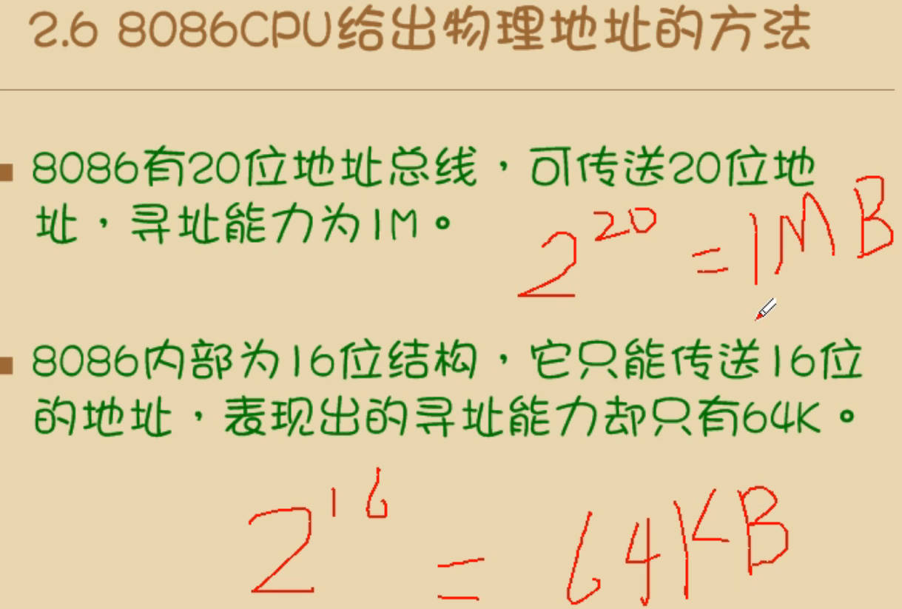 |
| ------------------------------------------------------------ | ------------------------------------------------------ |
| 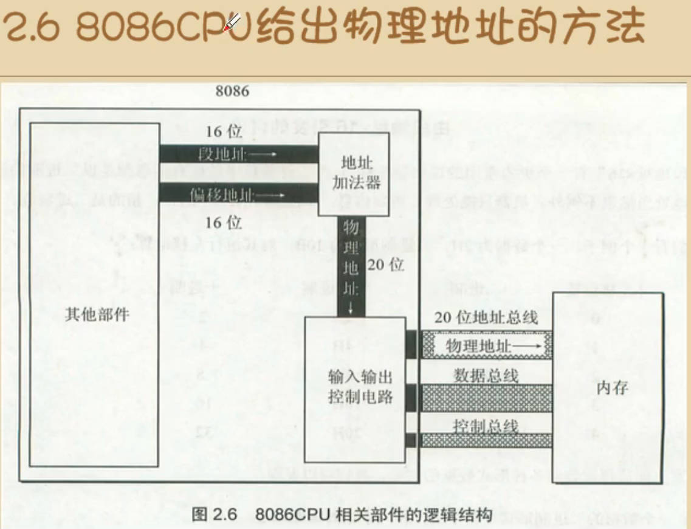 | 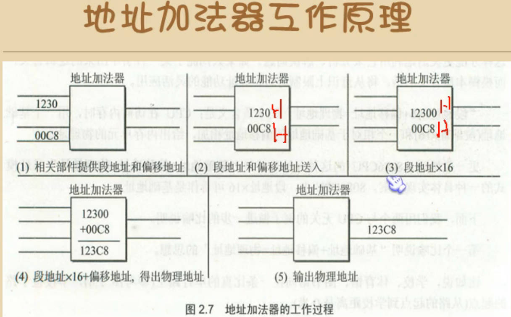 |
| 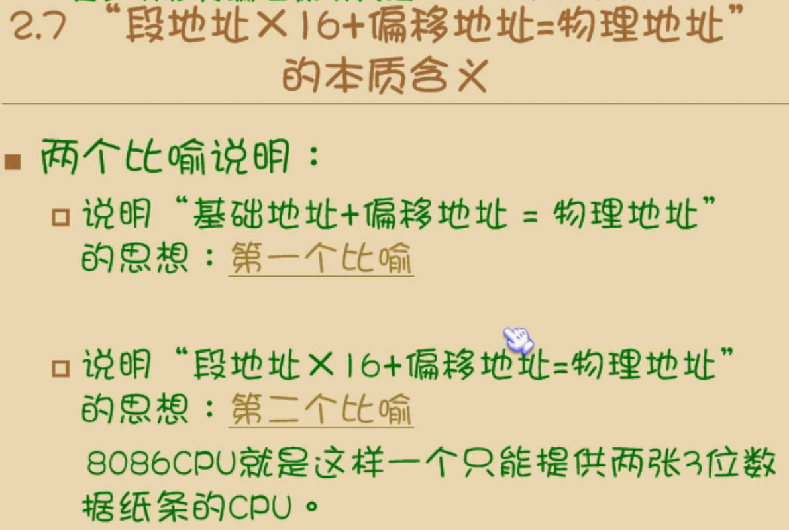       | 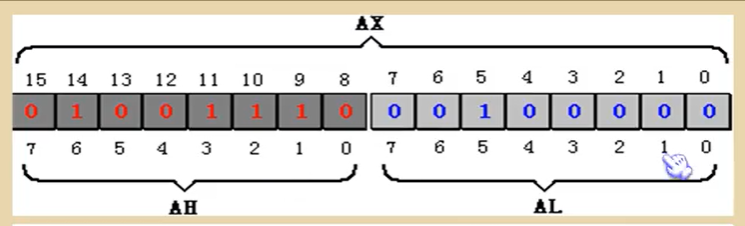                    |

## 段的概念

[疯狂的程序员_小说](https://baike.baidu.com/item/%E7%96%AF%E7%8B%82%E7%9A%84%E7%A8%8B%E5%BA%8F%E5%91%98/6829402?fr=ge_ala) 

==分页存储管理== 中的 `内存块Page Frame：页框、页帧；也叫物理块、内存块、物理页面`

| 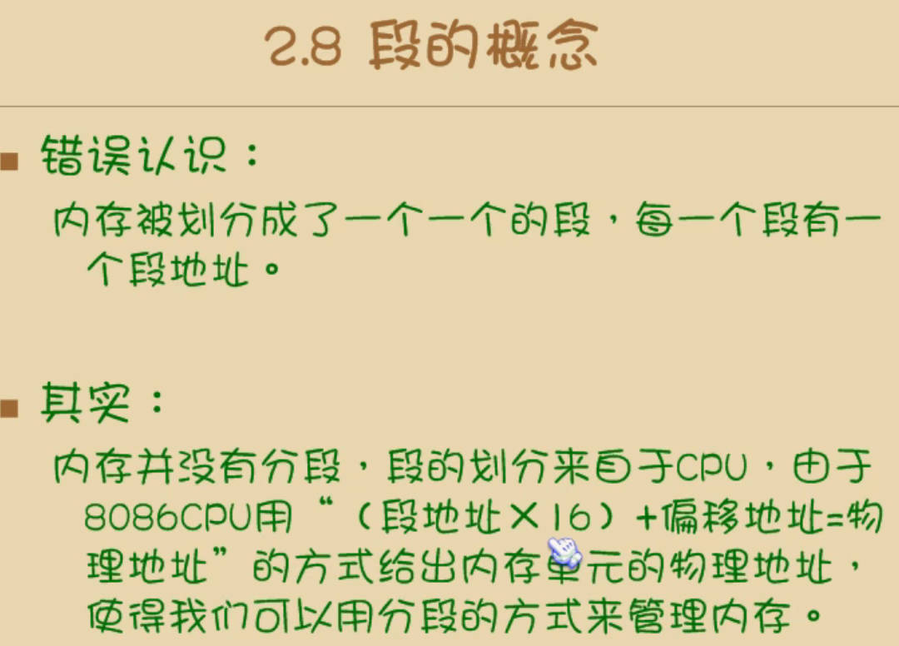 | 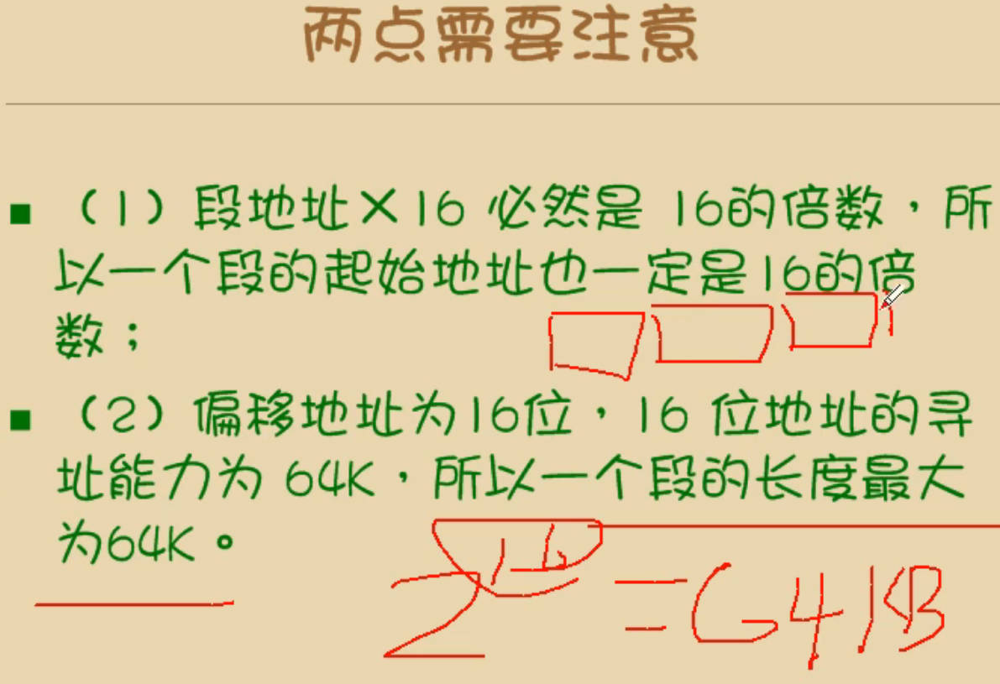 |
| ------------------------------------------------------ | ------------------------------------------------------ |
| 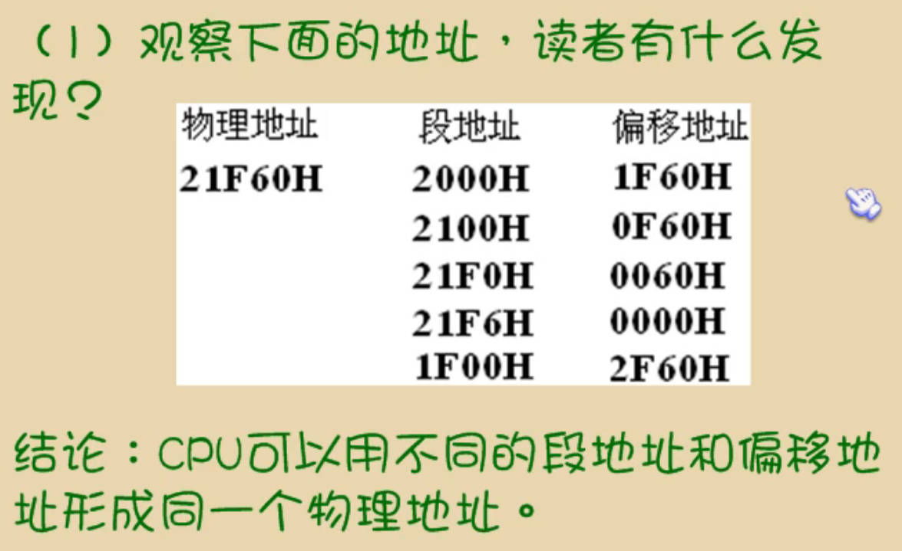 |  |
| 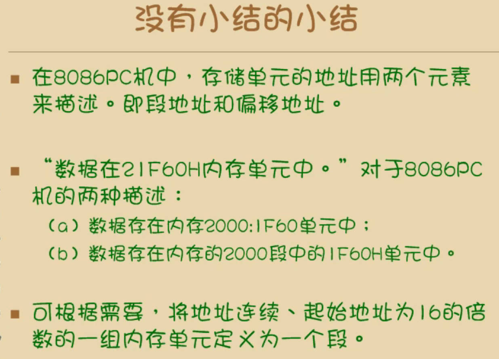 |                                                        |

## 段寄存器_==代码段==

[汇编中段寄存器作用_百度搜索](https://www.baidu.com/s?ie=UTF-8&wd=%E6%B1%87%E7%BC%96%E4%B8%AD%E6%AE%B5%E5%AF%84%E5%AD%98%E5%99%A8%E4%BD%9C%E7%94%A8)    [cs ip全称_百度搜索](https://www.baidu.com/s?ie=utf-8&f=8&rsv_bp=1&tn=baidu&wd=cs%20ip%E5%85%A8%E7%A7%B0&oq=cs%2520ip&rsv_pq=bd6b3b46001997fe&rsv_t=a026XEVuDcwlf%2BEui1hdog8S2%2F6XUPdLdpi0zq7rJr8J2a2o3zEcb%2F2dbqw&rqlang=cn&rsv_enter=1&rsv_dl=tb&rsv_btype=t&inputT=8120&rsv_sug3=9&rsv_sug1=9&rsv_sug7=100&rsv_sug2=0&rsv_sug4=9393)	[CS和IP - 知乎](https://zhuanlan.zhihu.com/p/258863021)	

小结： ==用 jmp 修改 cs和ip的值==,  cs、ip指过去，代码就开始执行， `cpu将cs:ip指向的内容当作指令执行`

- CS和IP的全称分别是Code Segment（代码段寄存器）和==Instruction Pointer==（指令指针寄存器）
- CS寄存器：存放内存`代码段的入口地址`，IP寄存器用于指示`下一条指令的内存地址`。当CPU执行指令时，通过CS和IP来确定要执行的指令地址‌

**cs ip、 ss sp、 ds es ,  程序员通过改变寄存器内容实现对cpu的控制**， 

8086CPU有==**4个段寄存器**==， 提供内存单元的段地址

- - CS（code segment）、DS（data segment）、SS（stack segment）、 ES（extra segment）
    - 这些寄存器分别用于==存放当前正在运行的程序==代码所在段、‌数据段、‌堆栈段以及附加数据段的信息
    - 分别用于指令、数据、其它和堆栈
    - **DS**==指向数据段==，ES指向附加段, 存取操作数时，二者之一和一个偏移量合并, 就可==得到存储单元的物理地址==    [段寄存器的作用](https://baike.baidu.com/item/%E6%AE%B5%E5%AF%84%E5%AD%98%E5%99%A8/6616912?fr=ge_ala)  
      - 该偏移量可以是具体数值、符号地址和指针寄存器的值等之一，具体情况将由指令的寻址方式来决定
    - **CS**指向==存放汇编程序==的内存段，IP是用来存放下条待执行的指令在该段的偏移量，把它们合在一起可在该内存段内==取到下次要执行的指令==
    - **SS**指向==用于堆栈==的内存段，SP是用来指向该堆栈的栈顶，把它们合在一起可访问栈顶单元
      - 另外，当偏移量用到了指针寄存器BP，则其缺省的段寄存器也是SS，并且用BP可访问整个堆栈，不仅仅是只访问栈顶
  - IP 指令指针寄存器，偏移寄存器, 专用寄存器
  - CS和IP : 指示CPU==当前要读取指令的地址==； mov指令需要3个字节，mov传送指令

### 如何修改CS、IP

**修改CS、IP**的指令：  ==jmp==转移指令   `jmp 2ae3:3` ,仅修改IP：`jmp 某一合法寄存器(ax等)`

- Ds段寄存器：  `mov ax,[0]` 
- CS:IP读取到的东西会被CPU认为是指令，而DS读取到的东西会直接被CPU认为是数据

|        |        |
| ------------------------------------------------------------ | ------------------------------------------------------------ |
|        |        |
|        |  |
|  |        |

### 代码段
|  |        |
| ------------------------------------------------------ | ------------------------------------------------------------ |
|  |  |
|  |                                                              |


```toml
    3.8086CPU工作过程的简要描述
        1.从CS:IP指向内存单元，读取指令，读取的指令进入指令缓冲器
        2.IP=IP+所读取指令的长度，从而指向下一条指令
        3.执行指令，转到步骤1，重复这个过程
    4.开机时的CS和IP
        1.在8086CPU加电启动或复位后（即CPU刚开始工作时）CS和IP被设置为
            CS=FFFFH，IP=0000H
        2.即在8086PC机刚启动时，CPU从内存FFFF0H单元中读取指令执行
        3.FFFF0H单元中的指令是8086PC机开机后执行的第一条指令
    5.修改CS、IP的指令
        1.在CPU中，程序员能够【用指令读写】的部件只有【寄存器】，
            程序员可以通过改变寄存器中的内容实现对CPU的控制
        2.CPU从何处执行指令是由CS、IP中的内容决定的，程序员可以通过改变CS、IP中的内容
            控制CPU执行目标指令
        3.如何修改CS和IP？
            1.通过mov改变AX等，但是不能通过mov改变CS和IP
            2.【jmp 段地址:偏移地址】  可以用来同时修改CS和IP
                指令中的段地址修改CS
                偏移地址修改IP
            3.【jmp 某一合法的寄存器】   仅修改IP的内容
                比如：jmp ax 或者 jmp bx（类似于mov IP ax）
            4.jmp是只具有一个操作对象的指令
2.11 代码段
    1.可以将长度为N（N<=64KB）的一组代码，存放在一组地址连续、其实地址为16的倍数的内存单元中
        这段内存是用来存放代码的，从而定义了一个代码段
    2.CPU中只认被CS:IP指向的内存单元中的内容为指令
```
## debug

[进制间的转换原理](https://zhuanlan.zhihu.com/p/37485798)   [为什么一位十六进制数对应四位二进制数](https://zhidao.baidu.com/question/924236145880422179.html)    [字节、十六进制、二进制之间的关系](https://blog.csdn.net/zhongad007/article/details/106659087/)    

[DEBUG常用命令](https://www.cnblogs.com/0pen1/p/12495332.html)   [debug](https://blog.csdn.net/double_piga/article/details/120838923)    [DEBUG](https://blog.csdn.net/welcomejzh/article/details/3108813)  [汇编：Debug](https://www.jb51.net/program/293943zxp.htm) 

[ollydbg_百度搜索](https://www.baidu.com/s?wd=ollydbg&rsv_spt=1&rsv_iqid=0xa82f6d6b000826df&issp=1&f=8&rsv_bp=1&rsv_idx=2&ie=utf-8&tn=baiduhome_pg&rsv_dl=tb&rsv_enter=1&rsv_sug3=8&rsv_sug1=9&rsv_sug7=100&rsv_sug2=0&rsv_btype=i&inputT=11031&rsv_sug4=12288)  [OllyDbg ](https://blog.csdn.net/billvsme/article/details/38854061)   [x64DBG_百度搜索](https://www.baidu.com/s?ie=utf-8&f=8&rsv_bp=1&tn=baidu&wd=x64DBG&oq=DBG&rsv_pq=d5aa82f90008c77a&rsv_t=b3efDvCS%2BVeFgQBlDhEFQgUQm6ra31SgihOMbo1dP3p36mm0UQgZZUS%2B1qA&rqlang=cn&rsv_enter=1&rsv_dl=tb&rsv_sug3=2&rsv_sug2=0&rsv_btype=t&inputT=1215&rsv_sug4=1215)  [看雪工具](https://tool.kanxue.com/)   [windbg](https://zhuanlan.zhihu.com/p/43972006) 

[DEBUG命令详解](https://blog.csdn.net/bachuannie8771/article/details/101415906)	 [Debug](https://blog.csdn.net/m0_62599305/article/details/134362904)	 [debug命令_百度搜索](https://www.baidu.com/s?ie=UTF-8&wd=debug%E5%91%BD%E4%BB%A4)	[debug命令全称](https://blog.csdn.net/double_piga/article/details/120838923)	[debug命令全称_百度搜索](https://www.baidu.com/s?ie=UTF-8&wd=debug%E5%91%BD%E4%BB%A4%E5%85%A8%E7%A7%B0)	

DUMP、 ENTER、 FILL、 register、 Trace、 Unassemble、Assemble、 Name、 Load、 Write、 Hex、search、proceed

[debug命令大全_百度搜索](https://www.baidu.com/s?ie=utf-8&f=8&rsv_bp=1&tn=baidu&wd=debug%E5%91%BD%E4%BB%A4%E5%A4%A7%E5%85%A8&oq=debug%25E5%2591%25BD%25E4%25BB%25A4%25E5%25A4%25A7%25E5%2585%25A8%25E4%25B8%2580%25E8%25A7%2588%25E8%25A1%25A8&rsv_pq=90f725f50006c8a2&rsv_t=da41bwvOjdu%2BV%2FBRxHfszwd4AWhhkOBk%2FPe7aZbSclHdpoGUMhW%2FevWD5hg&rqlang=cn&rsv_enter=1&rsv_dl=tb&rsv_sug3=2&rsv_sug1=2&rsv_sug7=100&rsv_sug2=0&rsv_btype=t&inputT=288&rsv_sug4=1439&rsv_sug=1)	[Debug命令大全　-CSDN博客](https://blog.csdn.net/byxdaz/article/details/548556)	 [debug常用命令](https://www.cnblogs.com/zhengzirui/p/17763055.html)	 [DEBUG](https://www.cnblogs.com/liuhousheng/p/18515469)	 

>内存：	d   e修改  f填充
>
>寄存器：  r   rax修改
>
>汇编：	u   a输入
>
>执行：    t   p  g

- Q 退出
- t 执行指令，   `t 100`  执行100条指令
  - `step in`， 遇到子程序，会进入里面一步步执行再返回

- `p` 执行循环、重复的字符串指令、软件中断或子例程
  - 相当于`step over`，与t一样，只有当遇到`call调用子程序`的时候，p命令直接执行完这个程序，而t命令会进入里面一步步执行

- d 段地址：起始偏移地址 结尾偏移地址 ”可以查看起始地址到结尾地址范围内的数据 。如“d 1111:0000 FF” 查看数据范围为“1111:0000 ~ 1111:00FF”
  - 显示==数据段内容==,  `d 100` --查看数据段的偏移100H处的数据
  - `d 0100:0010` , 查看0100段的0010偏移处的数据
  - 显示的内容格式:  `段地址:偏移地址 8字节的数据-8字节的数据(16进制表示)   每个字节的内容(ascii)`

- `e 段地址：偏移地址 数据1 数据2 ... 数据n`  修改存储单元内容
  - 显存写数据`e b810:0 01 01 02 02 03 03 04 04`
  - e 段地址：偏移地址 ;  按空格依次输入   

- g 执行到断点位置，断点这一行不执行， 如 `g cs:0012`
  - debug不支持一个程序执行两次，应该先`q`退出，再次装载到debug中才能执行第二次

- f 填充指定内存区域，  `F [范围] [填充列表]`
  - `F 1AF5:100 L20 1 2 3 4 5`，  用字节序列01、02、03、04、05轮流填充从`1AF5:100`开始长度为`20H`的内存区域
  - `F 1AF5:100 13F 41 42 43 44`， 41、42、43、44轮流填充从`1AF5:100`到`1AF5:13F`的内存区域
  - `f180 l5 1 2 `
  
- u 查看汇编指令， 开始输入`u`默认从`cs:0000`开始查看，再次输入`u`时显示接下来的地址存的指令
  - `u 100` --从代码段的偏移100H处查看指令
  - `u 0100:0010` --从0100段的0010偏移处查看指令


```bash
# 1B = 8bit,     1字节存2个16进制数
# 十六进制数的进率是16，二进制数的进率是2，且16＝2＾4，说明二进制数连续进位4次，等效于16进制数进1位
# 汇编执行流程：
a 				# 输入汇编指令， A 段地址：偏移地址  实验任务第2小题： a 2000:0

d 138c:0100		# 查看指定位置内存  d fff0:0 ff
u 138c:0100		# u 段地址：偏移地址

r cs			# r ip ，改变cs和ip的值, 修改从哪个位置开始执行代码  rax
138c			# ax 改为138c

t				# 执行指令，执行内存地址为【CS寄存器数值：IP寄存器数据】位置的指令， t 100 --执行100条指令
```


|  |  |
| ------------------------------------------------------ | ------------------------------------------------------ |


1. **磁盘文件操作**‌：
   - `N<文件名>`：命名文件。
   - `W[<地址>][<盘号><相对扇区号><扇区个数>]`：写盘。
   - `L[<地址>][<盘号><相对扇区号><扇区数>]`：读盘。 将文件或特定磁盘扇区的内容加载到内存
     - 从C盘 将起始逻辑扇区为 15 (0Fh) 的 109 (6Dh) 个扇区的内容, 加载到起始地址为 04BA:0100 的内存中
     - `l 04ba:100 2 0f 6d `
2. ‌**查找、比较、填充和移动内存**‌：
   - `M<源地址范围><目标地址>`：一块内存 复制到 另一块内存。         `m190 l4 188` 从190复制4个字节到188
   - `C<源地址范围><目标地址>`：比较内存。                                  `c180l10 190`  
   - `S<地址范围><要查找的字节或字符串>`：查找内存, 搜索一个或多个字节值或字符串   `s 076a:0001 0010 20`  
     - 字符串值包括在引号， `scs:100 110 'AB' `       `s cs:100 110 41 `
   - `F<地址范围><要填充的字节或字节串>`：填充内存。 
3. ‌**其他命令**‌：
   - `H<值1><值2>`：十六进制运算。 先计算和,然后计算差        `h9 7` 
   - `I<端口地址>`：读端口信息。 从端口读取并显示一个字节值    `i2 ` 
   - `O<端口地址><字节内容>`：字节值发送到输出端口。           `o2 4f` 
4. **扩展内存**
   1. `XA(分配扩展内存)`： 分配扩展内存的指定页面数   
      1. 分配扩展内存的 8 个页面  `xa8`

   2. `XD(释放扩展内存)` : 释放指向扩展内存的句柄
      1. `xd [handle] `       `xd 0003 ` 

   3. `XM(映射扩展内存页)` : 将属于指定句柄的`扩展内存逻辑页` 映射到 `扩展内存的物理页`
      1. `xm [lpage] [ppage] [handle] `  lpage 逻辑页面号,    ppage 物理页面号
      2. 将句柄 0003 的逻辑页 5 映射到物理页 2 :  `xm 5 2 0003`

   4. `XS(显示扩展内存信息)` 


# 3、寄存器（==内存访问_DSSSSP==）


- 字等于2字节
- ==bx 是 ds== 的中转寄存器
- 访问内存的寄存器
- ==内存中字的存储==: `高位对应高地址，低位对应低地址(0地址存低位)`， 2万的十六进制是4e20

|  |  |
| ------------------------------------------------------ | ------------------------------------------------------ |
|  |                                                        |

## DS和[address] 

[DS[]和CS:IP的区别](https://blog.csdn.net/m0_62783065/article/details/127402635) 

- 数据段
  
  - **段地址**不能直接给`DS`, 要通过中转寄存器, ==bx 是 ds== 的中转寄存器   `mov bx,1000 `   `mov ds,bx`
  
    - 可以将数据直接送入通用寄存器 例：`mov ax,1`
  
  
    - ==8086不支持将数据直接送入段寄存器==   `mov ds,1000H` 错误
  
  - ==偏移地址==： `[0]` , 0表示内存单元的偏移地址 
  
    - 内存单元数据给al： `mov al,[0]` 
  
  - cpu读内存单元数据时，要先给出内存单元的地址
  
- **mov 作用**
  - 数据送入寄存器 `mov ax,2`

  - 一个寄存器内容送入另一个寄存器 `mov bx,ax`

  - 内存单元内容送入一个寄存器 `mov al,[0]` 

- ==DS存放数据的段地址==,  [ ]中存储的是相对于DS的数据偏移地址空间
  - `MOV al,[0]   将0作为偏移地址，将DS:0内存单元中的数据直接送入寄存器`
  - 可以将数据直接送入通用寄存器 例：`mov ax,1`
  - 8086cpu不支持将数据直接送入段寄存器   `mov ds,1000H` 错误

- 将数据从内存送入寄存器  ==bx 是 ds== 的中转寄存器
  - `mov bx,1000h    mov ds,bx    mov al,[0]`

- 将数据从寄存器送入内存
  - ``mov bx,1000h    mov ds,bx    mov [0],al``  指出==段 和 偏移地址==

- 字的传送  
  - 8086是16位，一次传16位数据 `mov ax,[0]    mov [0],cx`


|        |  |
| ------------------------------------------------------------ | ------------------------------------------------------------ |
|  |        |
|        |  |
|        |        |

==问题3.3==字的传送答案

```
e 1000:0 23 11 22 66
a 1386:0100				//1386:0100是指令执行地址，接下来输入汇编，让后用t执行
```

## ==数据段==

[汇编学习软件推荐 - 汇编金手指](https://download.csdn.net/blog/column/9282036/96735372) 

- mov 寄存器，段寄存器
- ==访问数据段中的数据==
  - 和访问代码段一样，用段地址加偏移地址


|  |        |
| ------------------------------------------------------ | ------------------------------------------------------------ |
|  |  |
|  |        |
|  |        |


```bash
3.4 mov、add、sub指令
    1.复习：已学mov指令的几个形式
        1.mov 寄存器,数据         ;立即寻址
        2.mov 寄存器,寄存器        ;寄存器寻址
        3.mov 寄存器,内存单元      ;直接寻址
        4.mov 内存单元,寄存器      ;寄存器寻址？
        5.mov 段寄存器,寄存器      ;寄存器寻址
        6.mov 寄存器,段寄存器      ;寄存器寻址
    2.add、sub同mov一样，都有两个操作对象
        1.add的用法
            1.add 寄存器,数据      ;立即寻址
            2.add 寄存器,寄存器    ;寄存器寻址
            3.add 寄存器,内存单元  ;直接寻址
            4.add 内存单元,寄存器  ;
        2.sub的用法
            【不带借位的减法】
            指令格式 sub op1,op2    ;意为：op1=op1-op2
            1.sub 寄存器,数据      ;立即寻址
            2.sub 寄存器,寄存器    ;寄存器寻址
            3.sub 寄存器,内存单元  ;直接寻址
            4.sub 内存单元,寄存器  ;
```


## 栈_sssp

[ss sp全称_百度搜索](https://www.baidu.com/s?ie=UTF-8&wd=ss%20sp%E5%85%A8%E7%A7%B0)	 [SS, SP, BP](https://blog.csdn.net/Maker88888/article/details/140628302)	[堆栈寄存器SS,SP,BP](https://blog.csdn.net/JeredYe/article/details/133863593)	

[先入后出](https://www.baidu.com/s?ie=utf-8&f=8&rsv_bp=1&tn=baidu&wd=%E5%85%88%E5%85%A5%E5%90%8E%E5%87%BAfi&oq=%25E6%25A0%2588%25E5%2585%2588%25E5%2585%25A5%25E5%2590%258E&rsv_pq=dff9018d0000e01a&rsv_t=76a6wJk0djsgeQxizQijA6uFrZYcywTBwXYBuBK9NMGEVkbtJwbNHwr2Bd0&rqlang=cn&rsv_enter=1&rsv_dl=tb&rsv_sug3=8&rsv_sug1=8&rsv_sug7=100&rsv_sug2=0&rsv_btype=t&inputT=6492&rsv_sug4=8026)  	[FIFO和LIFO](https://easylearn.baidu.com/edu-page/tiangong/questiondetail?id=1733403987404381285&fr=search)	 

- 先入后出: `FILO, First In Last Out`
  - 后进先出: `LIFO: Last in, First out` 
  - 先进先出: `FIFO: First in, First out`
  
- 栈是具有特殊访问方式的 存储空间，先进后出
  - `SS:SP`
    - **SS（Stack Segment Register）**‌：堆栈段寄存器，用于存放堆栈的段地址
    - **SP（Stack Pointer Register）**‌：堆栈指针寄存器，用于存放堆栈的偏移地址。SP指向栈顶的位置，用于指示当前堆栈的顶部位置‌
      - 栈最低处是栈顶，因为栈地址空间是由低到高
    - BP：堆栈基址指针寄存器(base pointer)。和SP联合使用，作为SP校准使用，只有在寻找堆栈里的数据和使用个别的寻址方式时候才能用到
  - 栈顶动态变化,因为入栈出栈以字为单位操作, `push时sp先减2,pop时先取数据再加2`
  - **栈是空的时候**，`SS:SP`指向最高地址单元的下一个单元，`sp+2`
- **重点**： 入栈出栈==以字为单位操作== 
  - 函数变量放在栈中，出了函数，局部变量就失效
  - push时sp先减2,pop时先取数据再加2
    - `push:  sp-2，再放入数据` 
    - `pop： 先取出数据，再sp+2`  
- 栈顶超界问题：栈溢出

|  |  |
| ------------------------------------------------------ | ------------------------------------------------------ |
|  |  |
|  |  |

### push指令执行过程
|  |  |
| ------------------------------------------------------ | ------------------------------------------------------------ |
|  |        |

### 空栈栈顶指向哪里

栈空时，sp指向最高地址的下一个单元

- 入栈出栈==以字为单位操作== 
- 推理：栈中有1个元素时，`ss=1000h,sp=000eh`, 栈为空，相当于pop唯一的元素，`sp=sp+2, sp=e+2=10`

|  |  |
| ------------------------------------------------------------ | ------------------------------------------------------ |
|        |  |
|        |  |

### pop指令执行过程
|  |        |
| ------------------------------------------------------ | ------------------------------------------------------------ |
|  |  |

### 栈顶超界问题
|        |        |
| ------------------------------------------------------------ | ------------------------------------------------------------ |
|  |        |
|        |  |

### push、pop作用
- push 寄存器   `push ax`
- push 段寄存器  `push ds， pop es`
- push 内存单元  `push [0]`

|        |        |
| ------------------------------------------------------------ | ------------------------------------------------------------ |
|        |  |
|  |                                                              |


3.6 栈
    1.8086CPU提供相关的指令来以栈的方式访问内存空间
        这意味着，我们在基于8086CPU编程的时候，可以将一段内存当作栈来使用
    2.8086CPU提供入栈和出栈指令：（最基本的）
        push（入栈）
        pop（出栈）
        1.push ax：将寄存器ax中的数据送入栈中
        2.pop ax：从栈顶取出数据送入ax
        3.8086CPU的入栈和出栈操作都是以【字（16位）】为单位进行的
        4.pop和push可以在寄存器和内存之间传送数据
    3.CPU如何知道一段内存空间被当做栈使用？
        1.8086CPU中，有两个寄存器
            1.段寄存器SS：存放栈顶的段地址
            2.寄存器SP：存放栈顶的偏移地址【专用寄存器】
        2.任意时刻SS:SP指向栈顶元素，当栈为空的时候，也就不存在栈顶元素
            ss:sp也就指向栈最高地址单元的下一个单元
    4.执行push和pop的时候，如何知道哪个单元是栈顶单元？
        1.执行push ax时
            1.sp=sp-2
            2.将ax中的内容送入到ss:sp指向的内存单元
                ss:sp此时指向新栈顶
        2.执行pop ax时
            1.将ss:sp指向的内存单元的内容送入到ax中
                注意：这里取出的内容在内存中还是存在的，并没有被重置
                    下一轮push会覆盖
            2.sp=sp+2
    5.如果栈是空的，sp指向哪里？
        sp指向最高地址单元的下一个单元
3.7 栈顶超界的问题
    ss、sp只记录了栈顶的地址，依靠ss、sp可以保证在入栈和出栈时找到栈顶
    可以，如何能够保证在入栈、出栈时，栈顶不会超出栈空间？
    1.8086CPU不保证栈的操作不会越界
    2.当栈空的时候，再执行pop出栈 或者 当栈满的时候再使用push入栈
        都会发生栈顶超界问题，会操作到栈以外的数据，
        这些数据可能是其他用途的数据或者代码
        栈顶超界是危险的！！！
    3.8086CPU没有记录栈顶上下限的寄存器
3.8 栈段
    1.将一段内存当做栈段，仅仅是我们在编程时的一种安排，
    2.ss:sp指向我们定义的栈段的栈顶；
    3.当栈空时，sp指向最高地址的下一个单元
    4.思考：一个栈段最大可以设为多少？
        64KB
    5.设栈顶的变化范围是0-FFFFH，从栈空时sp=0（最高地址单元FFFFH的下一个单元0000H）
        一直压栈，直到栈满，sp=0；
        如果再次压栈，栈顶将环绕，覆盖原来栈中的内容
    6.一段内存，既可以是代码的存储空间，又可以是数据的存储空间，还可以是栈空间
        也可以是什么都属实。
        关键在于CPU中寄存器的设置，即：cs、ip、ss、sp、ds的设置
        **可以通过mov直接给sp赋值【立即数寻址】，但是不能通过mov给cs、ip、ss、ds赋值
            给cs和ip赋值需要使用jum指令
            给ss和ds赋值需要使用mov ss或ds,寄存器   ;【寄存器寻址】

最高是F，栈没有元素，栈顶指向F的下面，即F+2 = 10

### ==习题==

[push、pop](https://cloud.tencent.com/developer/article/2460724) 	[执行push时,先改变sp_百度搜索](https://www.baidu.com/s?ie=utf-8&f=8&rsv_bp=1&tn=baidu&wd=%E6%89%A7%E8%A1%8Cpush%E6%97%B6%EF%BC%8C%E5%85%88%E6%94%B9%E5%8F%98sp&oq=%25E6%2589%25A7%25E8%25A1%258Cpush%25E6%2597%25B6&rsv_pq=c70d794200159426&rsv_t=c1b9zxZdwS2GaBcS5HtUP9ofFD0tH%2BBX%2BQZo9C%2F%2Bgm8hzdBmqwrE%2Fsolnlk&rqlang=cn&rsv_enter=1&rsv_dl=tb&rsv_sug3=14&rsv_sug1=11&rsv_sug7=100&rsv_sug2=0&rsv_btype=t&inputT=3900&rsv_sug4=5047)	

- 执行push时：先改变SP，后向SS:SP处传送
- 执行pop时：`先读取SS:SP处的数据`，后改变SP
- push、pop实质是一种内存传送指令，在==寄存器和内存==之间传送数据
- 出栈顺序和入栈顺序相反
- 内存基本单元是字节,`2^16 = 65536Byte，65536Byte/1024 = 64KB` 
  - 16根地址总线的寻址空间为 2的16次方 = 64K(B),是因为字节(B)是内存的最小存储单元,每个地址总线可以对2个存储单元寻址(2B),所以16根地址总线可以寻址 2B的16次方 = 64K(B)2的16次方等于65536,即64k。65536B/1024=64K(B)


|        |        |
| ------------------------------------------------------------ | ------------------------------------------------------------ |
|        |        |
|  |        |
|        |        |
|  |        |
|  |  |
|        |  |
|        |        |

## 栈段

|        |        |
| ------------------------------------------------------------ | ------------------------------------------------------------ |
|        |  |
|  |        |
|        |        |
|        |        |


# 4、第一个汇编程序

## 汇编指令

[实验3 （编程、编译、连接、跟踪） - 知乎](https://zhuanlan.zhihu.com/p/616804294)	

[汇编指令](https://www.cnblogs.com/b1ing/p/12940660.html)	 [x86_64架构汇编指令](https://www.bilibili.com/video/BV1q6RNYpEw9/?vd_source=7346303e5e18677d7261c2c0c109ecfd)	

[ML 和 ML64 命令](https://learn.microsoft.com/zh-cn/cpp/assembler/masm/ml-and-ml64-command-line-reference?view=msvc-170)   [masm615](http://www.math.uaa.alaska.edu/~afkjm/cs221/) 

[好：汇编程序格式](https://zhuanlan.zhihu.com/p/660777058)	 [汇编语言语句种类及其格式](https://blog.csdn.net/A1_3_9_7/article/details/145212182)	 [汇编程序格式_百度搜索](https://www.baidu.com/s?ie=UTF-8&wd=%E6%B1%87%E7%BC%96%E7%A8%8B%E5%BA%8F%E6%A0%BC%E5%BC%8F)	

源码： [8086汇编扫雷游戏](https://gitee.com/jayhawsg/8086MineSweeperGame/blob/master/game.asm)	[System.asm](https://gitee.com/Krytiz/Assembly-project/blob/main/System.asm)	 [Gitee Search ](https://so.gitee.com/?q=%E6%B1%87%E7%BC%96)	 

- 编辑：即程序员写代码这一过程，生成文件.asm
- 汇编：`ML /c 文件名.asm`，该命令即将源程序翻译为机器码，生成文件.obj
- 连接：`LINK 文件名.obj`，此命令将上述目标文件和库文件合成一个可执行文件，生成文件.exe
- 调试：debug

|  |  |
| ------------------------------------------------------ | ------------------------------------------------------ |
|  |  |

## 源程序

[汇编语言指令结构](https://baijiahao.baidu.com/s?id=1827692341027169802&wfr=spider&for=pc)	

- 伪指令给编译器看的，编译器根据伪指令来进行相关的编译工作
  - segment和ends是一对成对使用的伪指令，编写汇编程序【必须】使用到的指令
  - `ends`段的结束， `end`汇编程序的结束
  - `assume`
  - 标号
  - NOP指令用于调整代码地址对齐，确保机器代码效率
- 一个汇编程序由多个段组成： 这些段==用来存放代码、数据、或当作栈空间==来使用
- dos中断机制，windows消息机制

|  |  |
| ------------------------------------------------------ | ------------------------------------------------------ |
|  |  |
|  |  |
|  |  |
|  |                                                        |


```assembly
; 其它函数
mov_dssi_to_cache_area macro
; 设置ds:si为缓存区地址
    push ax
    mov ax,cache_area
    mov ds,ax
    lea si,cache_area_start
    pop ax
endm
```

### 标号

[什么是标号](https://worktile.com/kb/ask/2416311.html)	[数据标号与定址表应用](https://blog.csdn.net/weixin_30319097/article/details/101559539)	[全局标号和局部标号](https://www.cnblogs.com/liming19680104/p/17861298.html)	

标号作用： 1、标记位置  2、作为跳转目标

标号的定义通常位于指令或数据的前面，并且以冒号（:）结尾

号还可以用来定义数据的起始位置： `data_label db 1, 2, 3, 4` 

==作用域==：标号的作用域通常限于定义它的`代码块或函数内部`。这意味着在其他代码块或函数中无法直接引用该标号。这是为了避免命名冲突和混淆

==数据标号==：

- 普通的标号只能表示内存地址
- 数据标号即可表示内存地址，也可表示内存单元的长度
  - 使用数据标号可以以更加简洁的方式访问内存中的数据
  - 数据标号的格式为：只有标号名，没有冒号

==全局标号和局部标号==

- 局部标号： `标号名:目的指令` 	   **作用域是当前的子程序**  
- 全局标号： `标号名::目的指令`

==MASM中的@@==

- 用@@做标号时，可以用@F和@B来引用它
- **@F表示本条指令后的第一个@@标号**
- **@B表示本条指令前的第一个@@标号**
- 程序中可以有多个`@@`标号，但@B和@F只寻找匹配最近的一个

## ==编译链接==

汇编和编译区别：[编译和汇编的区别-CSDN](https://blog.csdn.net/weixin_72324806/article/details/140887583)	[反编译和反汇编有区别 ](https://www.cnblogs.com/jijm123/p/18369581)	[反编译和反汇编的区别](https://www.idapro.net.cn/shouqian/ida-fhbfby.html)	[反汇编vs反编译](https://zhuanlan.zhihu.com/p/649489303)	 

 [一个简单程序从编译、链接、装载（执行）的过程](https://zhuanlan.zhihu.com/p/463154733)     [可执行文件的装载过程](https://blog.csdn.net/GrayOnDream/article/details/122724968)	 [PE文件装载机制解析](https://blog.csdn.net/qq_18059143/article/details/85615735)   [装载和动态链接](https://zhangferry.com/cultivation_for_programmer_booknotes_3/)	[装载](https://cn.bing.com/search?q=%E8%80%8C%E6%88%91%E4%BB%AC%E7%9F%A5%E9%81%93%EF%BC%8C%E5%9C%A8%E8%A3%85%E8%BD%BD%E5%8F%AF%E6%89%A7%E8%A1%8C%E6%96%87%E4%BB%B6%E7%9A%84%E6%97%B6%E5%80%99%EF%BC%8C%E6%9C%89%E4%BA%9B%E6%95%B0%E6%8D%AE%E5%9C%A8%E8%A3%85%E5%85%A5%E5%89%8D%E4%BC%9A%E8%A2%AB%E9%A2%84%E5%A4%84%E7%90%86&form=QBLHCN&sp=-1&lq=0&pq=%E8%80%8C%E6%88%91%E4%BB%AC%E7%9F%A5%E9%81%93%EF%BC%8C%E5%9C%A8%E8%A3%85%E8%BD%BD%E5%8F%AF%E6%89%A7%E8%A1%8C%E6%96%87%E4%BB%B6%E7%9A%84%E6%97%B6%E5%80%99%EF%BC%8C%E6%9C%89%E4%BA%9B%E6%95%B0%E6%8D%AE%E5%9C%A8%E8%A3%85%E5%85%A5%E5%89%8D%E4%BC%9A%E8%A2%AB%E9%A2%84%E5%A4%84%E7%90%86&sc=0-31&qs=n&sk=)	 	

- 编译和汇编
  - ==编译==是将高级语言（如C、C++、Java等）编写的源代码转换成计算机可以直接执行的低级语言（通常是机器语言或汇编语言）的过程
  - ==汇编==是将汇编语言编写的代码转换成机器语言的过程
- 反编译和反汇编
  - 反汇编是将机器码（二进制代码）转换为`汇编语言`的过程
  - 反编译是将已编译的可执行程序（如二进制文件、字节码等）`还原为高级语言`（如C、Java等）的过程

### 反汇编和反编译

[反编译和反汇编的区别和工具](https://www.idapro.net.cn/shouqian/ida-fhbfby.html)    [反编译是什么意思_百度搜索](https://www.baidu.com/s?ie=utf-8&f=8&rsv_bp=1&tn=baidu&wd=%E5%8F%8D%E7%BC%96%E8%AF%91%E6%98%AF%E4%BB%80%E4%B9%88%E6%84%8F%E6%80%9D&oq=%25E5%258F%258D%25E7%25BC%2596%25E8%25AF%2591&rsv_pq=ea35a6b90000a259&rsv_t=1c82iKzzQ5vkYqm17LcnKJxY16MEPbUwpyubiClXv22Cp2Ag41%2FrHqEnHes&rqlang=cn&rsv_enter=1&rsv_dl=tb&rsv_sug3=15&rsv_sug1=9&rsv_sug7=100&rsv_sug2=0&rsv_btype=t&inputT=3028&rsv_sug4=6990)  [反汇编 反编译_百度搜索](https://www.baidu.com/s?ie=UTF-8&wd=%E5%8F%8D%E6%B1%87%E7%BC%96%20%E5%8F%8D%E7%BC%96%E8%AF%91)  [学习反汇编、程序逆向分析等需要掌握哪些知识？](https://www.zhihu.com/question/32112052/answer/2255258627) 

[c编译流程](https://blog.csdn.net/carlyll/article/details/48834013)   [反汇编容易反编译难](https://www.cnblogs.com/idorax/p/7127744.html)  [GDA：中国第一款现代交互式反编译器](https://zhuanlan.zhihu.com/p/28354064) 

[w32dasm静态反汇编工具](https://www.baidu.com/s?ie=UTF-8&wd=w32dasm) 

- 反编译： （Decompilation）是将已编译的==二进制文件转换为高级语言源代码==的过程，  **将已编译的编程语言还原到未编译状态的过程**
  - 以便更好地`理解程序的结构和逻辑`，并进行相应的分析和修复。
- 反汇编： （Disassembly）是将==二进制文件转换为汇编代码==的过程
  - 了解程序的`执行过程和指令序列`，并进行相应的分析和修复


[动态编译与静态编译](https://www.bilibili.com/video/BV1bD4y147fH/?vd_source=7346303e5e18677d7261c2c0c109ecfd)	 [开源动画引擎 movy.js](https://www.bilibili.com/video/BV1Qf4y167Fq/?vd_source=7346303e5e18677d7261c2c0c109ecfd)	[好：编译过程-动画演示](https://www.bilibili.com/video/BV1MtQLYhEm1/?vd_source=7346303e5e18677d7261c2c0c109ecfd)	[编译过程动画-bilibili](https://search.bilibili.com/all?keyword=%E7%BC%96%E8%AF%91%E8%BF%87%E7%A8%8B%E5%8A%A8%E7%94%BB&search_source=5)	[编译原理笔记](https://blog.csdn.net/weixin_41633902/article/details/108282177)	[C语言编译流程详解-CSDN博客](https://blog.csdn.net/kevin_heidashuai/article/details/103049929)	

AST: [AST抽象语法树的基本思想](https://blog.csdn.net/u013212754/article/details/106981084) [抽象语法树(AST) ](https://www.cnblogs.com/lxh2cwl/p/14842913.html) [初识抽象语法树](https://www.cnblogs.com/ToTigerMountain/articles/18047272)			[编译原理中的抽象语法树(AST)为什么而存在？ ](https://www.zhihu.com/question/363445606/answer/2767230528)	[抽象语法树AST(Abstract Syntax Tree)](https://juejin.cn/post/7379958888909144083)	[抽象语法树的定义（C语言版）-菜鸟笔记](https://www.coonote.com/c-note/abstract-syntax-tree.html)	[AST抽象语法树原理与创建 - 知乎](https://zhuanlan.zhihu.com/p/599326926)	[语法抽象树_百度搜索](https://www.baidu.com/s?ie=UTF-8&wd=%E8%AF%AD%E6%B3%95%E6%8A%BD%E8%B1%A1%E6%A0%91)	

- `masm 1.asm`汇编编译为机器码 `1.obj`;  链接： `link 1.obj`  1.exe
  - masm + link： `ml.exe  1.asm`
- **编译7步**： `词法分析 => 语法分析 => 语义分析 => 中间代码生成 => 机器无关代码优化 => 目标代码生成 => 机器相关代码优化`

|  |  |
| ------------------------------------------------------ | ------------------------------------------------------ |
|  |  |
|  |  |
|                          |  |
|  |  |
|  |  |


```
4.1 一个源程序从写出到执行的过程
    1.一个汇编语言程序从写出到最终执行的简要过程
        编写->编译连接->执行
    2.对源程序进行编译连接
        1.使用汇编语言编译程序（MASM.EXE）对源程序文件中的源程序进行编译，产生目标文件【.obj文件】
        2.再用连接程序（LINK.EXE）对目标文件进行连接，生成可在操作系统中直接运行的可执行文件【.EXE文件】。
    3.可执行文件包含两部分内容
        1.程序（从源程序的汇编指令翻译过来的机器码）和数据（源程序中定义的数据）
        2.相关的描述信息（比如：程序有多大、要占多少内存空间等）
    4.执行可执行文件中的程序
        1.在操作系统（如：MSDOS）中，执行可执行文件中的程序
        2.操作系统依照可执行文件中的描述信息，将可执行文件中的机器码和数据加载入内存
            并进行相关的初始化（比如：设置CS:IP指向第一条要执行的指令），然后由CPU执行程序
4.2 源程序的主要结构
    源程序由 汇编指令+伪指令+宏指令 组成
        伪指令：编译器处理
        汇编指令：编译为机器码	
    1.伪指令
        1.没有对应的机器码的指令，不能由CPU直接执行
        2.伪指令是由编译器来执行的指令，编译器根据伪指令来进行相关的编译工作
    2.segment和ends【定义一个段】
        1.segment和ends是一对成对使用的伪指令
        2.编写汇编程序【必须】使用到的指令
        3.segment和ends的功能是定义一个段
            segment：说明一个段开始
            ends：说明一个段结束
        4.一个段必须有一个名称来标识，使用格式为
            段名 segment
            段名 ends
        5.一个汇编程序由多个段组成
            这些段用来存放【代码、数据、或当作栈空间】来使用
            一个有意义的汇编程序至少要有一个段，这个段用来存放代码。
    3.end【真正的没了】
        1.end是一个汇编程序的结束标记
        2.编译器在编译汇编程序的过程中，如果碰到了伪指令end，就结束对源程序的编译
        3.如果程序写完了，要在结尾处加上伪指令end
            否则，编译器无法知道程序在何处结束
        4.【切记】不要把end和ends搞混了
            end：汇编程序的结束标记
            ends：与segment成对出现
    4.assume【寄存器和段的关联假设】
        1.它假设某一段寄存器和程序中的某一个用segment...ends定义的段相关联
        2.通过assume说明这种关联，在需要的情况下，
            编译程序可以将段寄存器和某一具体的段相联系
    5.程序和源程序
        1.我们将源程序文件中的所有内容称为【源程序】
        2.将源程序中最终由计算机执行处理的指令或数据称为【程序】
        3.程序最先以汇编指令的形式，存储在源程序中
            然后经过编译、连接后转变为机器码，存储在可执行文件中
    6.标号，标号与段名称有所区别
        1.一个标号指代了一个地址，即是段名称。
        2.段名称 放在segment的前面，作为一个段的名称
            这个段的名称最终将被汇编、连接程序处理为一个段的段地址
    7.DOS中的程序运行
        1.DOS是一个单任务操作系统
        2.一个程序结束后，将CPU的控制权交还给是他得以运行的程序
            我们称这个过程为：程序返回
    8.程序返回
        mov ax，4c00H
        int 21H      ;【中断机制】是DOS最伟大的机制,Windows系统上是【消息机制】
        这两条指令所实现的功能就是程序返回
    9.几个和结束相关的内容
        1.段结束：伪指令
            通知编译器一个段的结束【ends】
        2.程序结束：伪指令
            通知编译器程序的结束【end】
        3.程序返回：汇编指令
            mov ax,4c00H
            int 21H
    10.语法错误和逻辑错误
        1.语法错误
            1.程序在编译时被编译器发现的错误
            2.容易发现
        2.逻辑错误
            1.在编写时不会表现出来的错误、在运行时会发生的错误
            2.不容易发现
4.3 以简化的方式进行汇编和连接
    汇编使用的程序：masm.exe
    连接使用的程序：link.exe
    简化方式进行汇编和连接的程序：ml.exe
4.4 汇编和连接的作用
    连接的作用
    1.当源程序很大时，可以将他们分成多个源程序文件夹编译
        每个源程序编译成为目标文件后，再用连接程序将它们连接在一起，
        生成一个可执行文件
    2.程序中调用了某个库文件中的子程序，需要将这个库文件和该程序生成的目标文件连接到一起
        生成一个可执行文件
    3.一个源程序编译后，得到了存有机器码的目标文件，目标文件中的有些内容还不能直接
        用来生成可执行文件，连接程序将这些内容处理为最终的可执行信息。
      所以在只有一个源程序文件，而又不需要调用某个库中的子程序的情况下，也必须用
        连接程序对目标文件进行处理，生成可执行文件
4.5 可执行文件中的程序装入内存并运行的原理
    1.在DOS中，可执行文件中的程序P1若要运行，必须有一个正在运行的程序P2
        将P1从可执行文件中加载入内存，将CPU的控制权交给P1，P1才能得以运行
    2.当P1运行完毕后，应该将CPU的控制权交还给使他得以运行的程序
    3.操作系统的外壳
        1.操作系统是由多个功能模块组成的庞大、复杂的软件系统
            任何通用的操作系统，都需要提供一个称为shell（外壳）的程序，
            用户（操作人员）使用这个程序来操作计算机系统工作
        2.DOS中有一个程序command.com，这个程序在DOS中称为命令解释器
            也就是DOS系统的shell
    4.执行可执行文件1.exe时，
      （1）什么程序将CPU的控制权交给了1.exe？
      （2）将程序1.exe加载入内存后，如何使程序得以运行？
      （3）1.exe程序运行结束后，返回到了哪里？
        1.在DOS中直接执行1.exe时，是正在运行的cmd.exe将1.exe中的程序加载入内存
        2.cmd.exe设置CPU的CS:IP指向程序的第一条指令（即，程序的入口）
            从而使程序得以运行
        3.程序运行结束后，返回cmd.exe中，CPU继续运行cmd.exe
```

- psp偏移100H（从ds段地址开始）， 100H转为十进制就是256字节；  `d 075a:0 100`
- debug中使用p执行`int 21` 

## 程序装入内存运行原理

[com文件格式/PSP结构](https://blog.csdn.net/jiaguoxinzhi/article/details/2942673)	

为什么程序加载后，cs和ds指向的不是同一个地方？ 

- `cs值 = ds值 + 10h`, 段寄存器转物理地址要乘16， 即`100h`,十六进制100，就是十进制`256`  

psp: 内存区前256字节， dos利用psp和被加载程序通信

- 256字节，就是十进制256，转成16进制就是`100H` 

|        |  |
| ------------------------------------------------------------ | ------------------------------------------------------ |
|        |  |
|        |  |
|        |  |
|  |  |

## gcc编译流程

[gcc/g++编译流程](https://baike.baidu.com/item/g%2B%2B/8324824?fr=ge_ala) 

```sh
gcc/g++编译流程

# 预处理，生成.i的文件[预处理器cpp]
# 将预处理后的文件转换成汇编语言，生成文件.s[编译器egcs]
# 由汇编变为目标代码（机器代码）生成.o的文件[汇编器as]
# 连接目标代码，生成可执行程序[链接器ld]
```

若干个源文件经过编译之后生成若干个==目标文件==。经过[链接器](https://so.csdn.net/so/search?q=链接器&spm=1001.2101.3001.7020)==把目标文件和所需要的库函数==链接起来，生成可执行程序

```sh
# 预处理:	展开头文件/宏替换/去掉注释/条件编译	（  test.i  main .i  ）
# 编译:	检查语法，生成汇编					 （  test.s  main.s ）
# 汇编:	汇编代码转换机器码   				 (  test.o main.o  )
# 链接:	链接到一起生成可执行程序				a.out
```

- 在C++编译过程中，最后一步需要进行链接，如果程序依赖于外部库，**链接器将库文件与程序的目标文件结合起来**。
  - `静态链接`: **库的代码被复制到最终的可执行文件中** 
    - A和B依赖**静态链接库 static library**，A和B在运行时，内存中会有多份static library
  - `动态链接`: **程序在运行时加载依赖的库** 
    - A和B依赖**动态链接库 shared library**，A和B在运行时，内存中只有一份 shared library（shared：共享）
    - 动态链接库加载后，**在内存中仅保存一份拷贝**，多个程序依赖它时，**不会重复加载和拷贝**，`节省内存空间` 

## Cmake

[CMake vs Makefile](https://www.cnblogs.com/xiaowange/p/17435839.html)   [CMake构建跨平台项目](https://blog.csdn.net/qq_53144843/article/details/136040086?utm_medium=distribute.pc_relevant.none-task-blog-2~default~baidujs_baidulandingword~default-0-136040086-blog-131527660.235^v43^pc_blog_bottom_relevance_base9&spm=1001.2101.3001.4242.1&utm_relevant_index=3)   

- 自己动手写 makefile，会发现，makefile 通常==依赖于当前的编译平台==，而且编写 makefile 的工作量比较大，解决依赖关系时也容易出错
- CMake 恰好能解决上述问题， 允许开发者指定整个工程的编译流程，再根据编译平台，自动生成本地化的Makefile和工程文件，最后用户只需make编译即可；   CMake: ==自动生成 Makefile的工具==

## 工具下载

[看雪学苑](https://www.kanxue.com/)	 [看雪知识库](https://www.kanxue.com/chm.htm)	

[Ghidra使用](https://cloud.tencent.com/developer/article/2483246)	
