[Git教程 - 廖雪峰](https://liaoxuefeng.com/books/git/introduction/index.html)	 

[markdown文件能版本控制吗_百度搜索](https://www.baidu.com/s?ie=UTF-8&wd=markdown%E6%96%87%E4%BB%B6%E8%83%BD%E7%89%88%E6%9C%AC%E6%8E%A7%E5%88%B6%E5%90%97)	

集中式版本控制系统： CVS、SVN 

分布式版本控制系统：Git， 每个人的电脑上都是一个完整的版本库，通常也有中央服务器，作用仅仅是用来方便“交换”大家的修改，没有它大家也一样干活，只是交换修改不方便而已

# 安装Git

安装完成后，还需要最后一步设置，在命令行输入：

```bash
$ git config --global user.name "Your Name"
$ git config --global user.email "email@example.com"
```

# 创建仓库

版本库又名仓库（Repository），里面的所有文件都被Git管理起来

1. 创建目录

2. 把目录变成Git可以管理的仓库， `cd gittest ,  git init`

3. 文件添加到版本库

   ```bash
   # 文件添加到仓库
   git add readme.txt
   # 文件提交到仓库， 类似保存一个快照
   git commit -m "wrote a readme file"
   ```

   

**FAQ**: 

- 为什么需要`add`，`commit 两步？`  因为`commit`可以一次提交很多文件，所以你可以多次`add`不同的文件
- Git命令必须在Git仓库目录内执行（`git init`除外）

# ==版本管理==

```bash
# 仓库状态
git  status
# 查看修改了什么
git  diff readme.txt
# 查看工作区和版本库里面最新版本的区别
git diff HEAD -- readme.txt

# 查看提交历史（快照）,  commit id（版本号）
git log  --pretty=oneline
# 查看命令历史
git reflog
```

## 工作区和暂存区

[git pull 和 git fetch区别](https://www.zhihu.com/question/38305012)	 [GIT 之概述与架构](https://cloud.tencent.com/developer/article/1476806)	

> - 工作区(working directory)，就是本地工作目录
> - **暂存区(stage area, 又称索引区index**
> - 本地仓库, .git目录，这个目录下的内容不属于工作区，里面是仓库的数据信息，暂存区相关内容也在其中
> - 远程版本库(remote repository)，与本地仓库概念基本一致，不同之处在于一个存在远程，可用于远程协作，一个却是存在于本地。通过push/pull可实现本地与远程的交互
> - **[远程仓库副本](https://zhida.zhihu.com/search?content_id=143864822&content_type=Answer&match_order=2&q=远程仓库副本&zhida_source=entity)，**可以理解为存在于本地的[远程仓库缓存](https://zhida.zhihu.com/search?content_id=143864822&content_type=Answer&match_order=1&q=远程仓库缓存&zhida_source=entity)。如需更新，可通过`git fetch / pull`命令获取远程仓库内容。
>   - 使用fech获取时，并未合并到本地仓库，此时可使用[git merge](https://zhida.zhihu.com/search?content_id=143864822&content_type=Answer&match_order=1&q=git+merge&zhida_source=entity)实现远程仓库副本与本地仓库的合并。git pull 根据配置的不同，可为`git fetch + git merge` 或 `git fetch + git rebase`

仓库文件夹是工作区，工作区隐藏目录`.git`是Git的版本库

**暂存区又称索引区index**, index文件存储暂存区的内容

版本库里最重要的就是称为stage（或者叫index）的==暂存区==，还有Git自动创建的==第一个分支==`master`，以及指向`master`的一个==指针叫 HEAD==。

- `git add`，把文件修改添加到暂存区
- `git commit`，把暂存区内容`提交到当前分支`

| 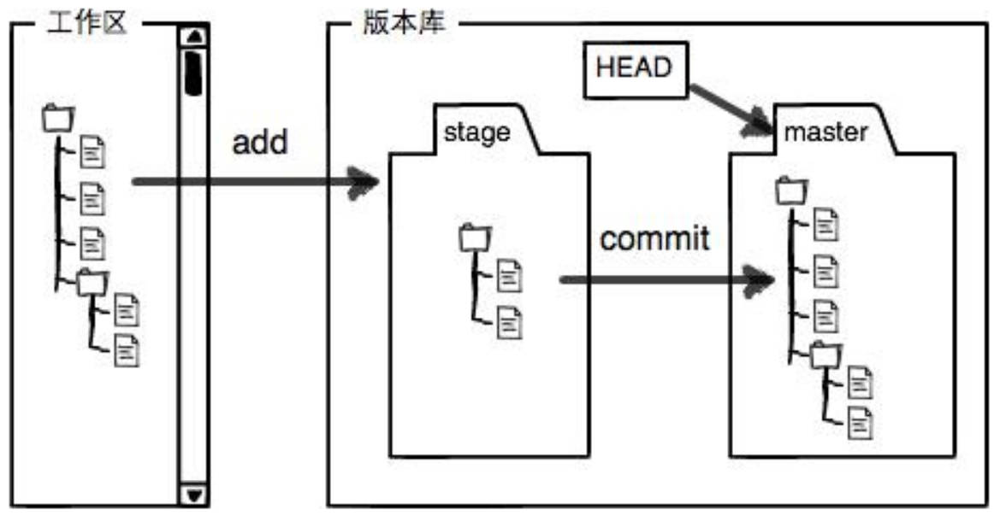 | 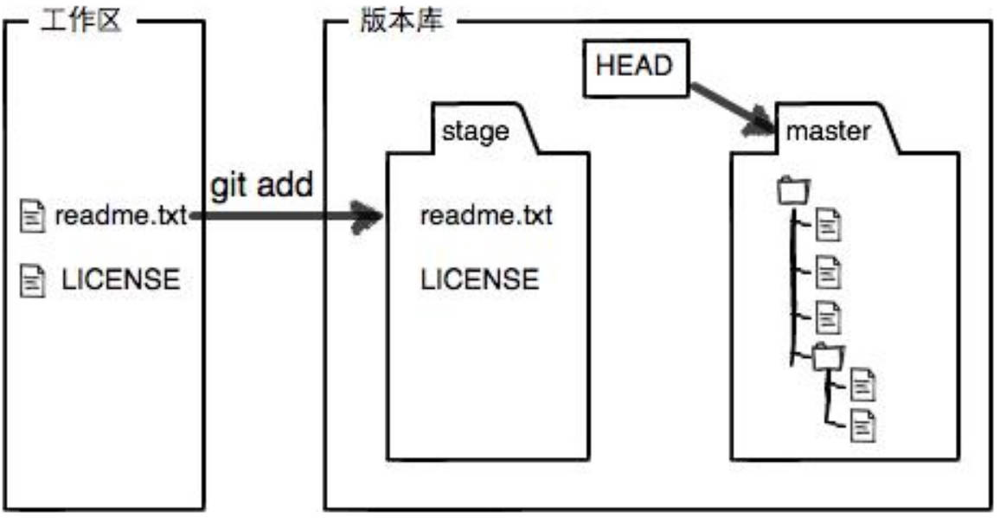 |
| ------------------------------------------------------------ | ---------------------------------------------------------- |
| 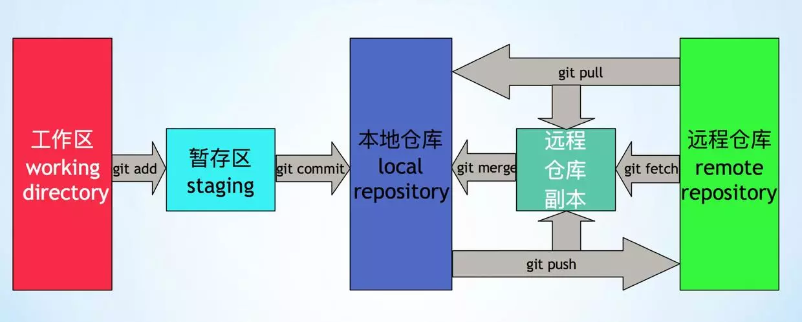                     |                                                            |

## 管理修改

Git跟踪管理的是修改，而非文件

例子： 第一次修改 -> `git add` -> 第二次修改 -> `git commit`

- 用`git add`后，工作区的第一次修改放入暂存区，准备提交，但是，在工作区的第二次修改并没有放入暂存区，所以，`git commit`只负责把暂存区的修改提交了，也就是第一次的修改被提交了，第二次的修改不会被提交
- `git diff HEAD -- readme.txt`  查看工作区和版本库里面最新版本的区别
- 第一次修改 -> `git add` -> 第二次修改 -> `git add` -> `git commit`

## 撤销修改

[git checkout](https://www.jianshu.com/p/6a5d507113c8)	 

`git checkout` 用==版本库里的版本==替换工作区的版本 ;  

- 拿暂存区的文件覆盖工作区的文件，或者用指定提交中的文件`覆盖暂存区和工作区中`对应的文件

==丢弃工作区修改==: `git checkout -- readme.txt`

有两种情况：

1. `readme.txt`修改后还没有放到暂存区，现在，撤销修改就回到和版本库一模一样的状态
2. `readme.txt`已经添加到暂存区后，又作了修改，现在，撤销修改就回到添加到暂存区后的状态
   1. `git reset HEAD  readme.txt` ==暂存区的修改回退到工作区==

提交了不合适修改到版本库：  用版本回退  `git reset --hard 1094a`  

## 版本回退

==HEAD指针==

`HEAD `  当前版本,  `HEAD^` 上个版本， `HEAD^^`上上版本， `HEAD~100` 上100个版本

`-hard`回退到上个版本的==已提交==状态，`--soft`回退到上个版本的==未提交==状态，`--mixed`回退到上个版本==已添加但未提交==的状态

**回到上个版本**： `git reset --hard HEAD^`

**回到某个版本** ： `git reset --hard 1094a` 

查看commit id: `git reflog`   引用日志

## 删除文件

删除也是一个修改操作

```bash
# 从版本库中删除文件，用git rm删掉，并且git commit
git rm test.txt   
git commit -m "remove test.txt"
```

# 远程仓库

创建SSH Key: `ssh-keygen -t rsa -C "youremail@example.com"`

.ssh目录`id_rsa私钥`和`id_rsa.pub公钥`

Account settings , SSH Keys , Add SSH Key, 粘贴`id_rsa.pub`文件的内容

## 添加远程库

`origin` 是远程库默认习惯命名

==本地仓库与远程库关联==： `git remote add origin git@github.com:myttian/gittest.git`

==git默认分支master修改为main==:	  `git branch -M main`

本地库的内容第一次==推送到远程==:	`git push -u origin main`


[在git分支-M main中-M是什么意思？](https://cloud.tencent.com/developer/information/%E5%9C%A8git%E5%88%86%E6%94%AF-M%20main%E4%B8%AD-M%E6%98%AF%E4%BB%80%E4%B9%88%E6%84%8F%E6%80%9D%EF%BC%9F-article)	[git修改默认分支为main • Worktile社区](https://worktile.com/kb/ask/277804.html)	

FAQ：

- `git branch -M main` git分支中，"M"代表"master"，而不是"main"
  - "master"是git的默认分支名称，是最初创建的主分支。然而，为了避免使用具有潜在歧视含义的术语，一些开源社区和公司已经开始使用"main"作为默认分支名称
- `git push -u origin master`   第一次推送`master`分支时，加上了`-u`参数
  - Git不但会把本地的`master`分支内容推送的远程新的`master`分支，还会把本地的`master`分支和远程的`master`分支关联起来，在以后的推送或者拉取时就可以简化命令
  - 以后推送： `git push origin master`

## 删除远程库

`git remote -v`查看远程库信息

`git remote rm origin`    删除其实是==解除本地和远程的绑定关系==，并不是物理上删除了远程库。远程库本身并没有任何改动。

要真正删除远程库，需要登录到GitHub，在后台页面找到删除按钮再删除

## 从远程库克隆

先创建远程库，然后，从远程库克隆一个本地库

`git clone git@github.com:myttian/gittest.git` 

## 常见问题

> push推送时：failed to push some refs to 'github.com:myttian/gittest.git'

[error: failed to push some refs to 'github.com:myttian/gittest.git'_百度搜索](https://www.baidu.com/s?ie=UTF-8&wd=error%3A%20failed%20to%20push%20some%20refs%20to%20%27github.com%3Amyttian/gittest.git%27)	 

> pull拉取时： `fatal: refusing to merge unrelated histories`

[fatal: refusing to merge unrelated histories_百度搜索](https://www.baidu.com/s?ie=UTF-8&wd=fatal%3A%20refusing%20to%20merge%20unrelated%20histories)	  [软件测试|Git：fatal: refusing to merge unrelated histories错误分析与解决](https://blog.csdn.net/Tester_muller/article/details/132815155)	  [git merge 提示错误 fatal](https://www.cnblogs.com/leng12/p/17329392.html)	 

**通常发生在尝试合并两个没有共同祖先的 Git 仓库历史时**, 3种解决方法

- 允许合并不相关的历史: `git pull origin master --allow-unrelated-histories`
- 创建并切换新分支： `git checkout -b new-branch`   
  - 可以避免直接合并不相关的历史，同时保留原始分支的历史记录‌
- 重新克隆仓库
  - 如果两个仓库的历史确实是完全不相关的，并且不希望将它们合并在一起，可以重新克隆一个干净的仓库，创建一个全新的本地仓库，不包含任何不相关的历史‌

# ==分支管理==

[git branch用法](https://www.jianshu.com/p/aea408814ebe)	 

[git修改默认分支为main](https://worktile.com/kb/ask/277804.html)	 

```bash
git branch					# 查看本地所有分支
git branch -r				# 查看远程所有分支
git branch -a				# 查看本地和远程所有分支
```


## ==创建与合并分支==

`master`主分支。`HEAD`严格来说不是指向提交，而是指向`master`，`master`才是指向提交的，所以，`HEAD`指向的就是当前分支

每次提交，`master`分支都会向前移动一步，随着不断提交，`master`分支的线也越来越长

| 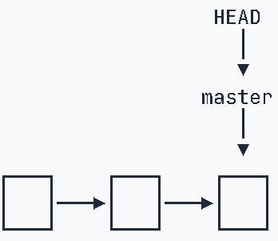 | 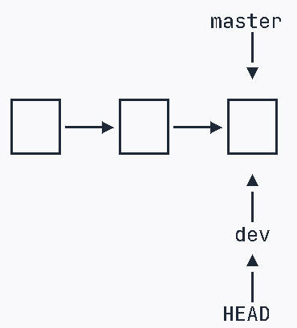 |
| ---------------------------------------------------------- | ---------------------------------------------------------- |
| 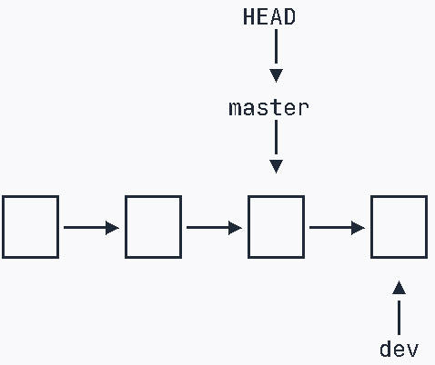 |                                                            |

新版git：创建并切换分支`git switch -c dev`,  切换分支`git switch master`

- ==创建dev分支==： `git checkout -b dev`      git branch 查看	
- 修改文件并提交：` add  commit`
- ==切换回master分支==： `git checkout master`， 还是修改前的内容
- `dev`分支的修改==合并==到`master`==分支==： `git merge dev`， 合并指定分支到当前分支
- ==删除dev分支==： `git branch -d dev`  

## 解决冲突

| 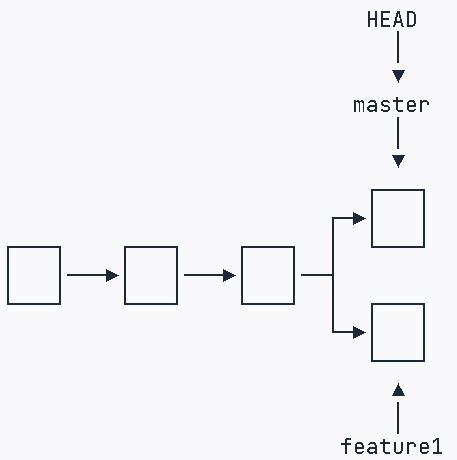 | 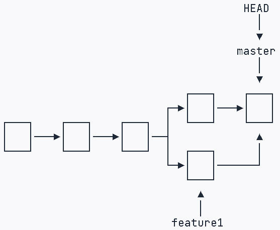 |
| ------------------------------------------------------------ | ---------------------------------------------------------- |


1. 创建新分支：`git switch -c feature1` ， 然后修改read.txt文件，在 `feature1`分支提交： `add、commit`
2. 切换到`master`分支，修改read.txt文件，在 `master`分支提交： `add、commit`
3. 现在，`master`分支和`feature1`分支==都分别有新的提交，Git无法执行“快速合并”==，只能试图把各自的修改合并起来，但这种合并就可能会有冲突  `git merge feature1`
   1. Git无法自动合并分支时，就必须首先解决冲突。==解决冲突后，再提交==，合并完成
   2. 直接查看read.txt内容，Git用`<<<<<<<`，`=======`，`>>>>>>>`标记出不同分支的内容，修改为想要的，然后提交: `add、commit`
   3. 类似 `vi` 里文件冲突解决方法
4. 最后，删除`feature1`分支  `git branch -d feature1` 


**分支管理策略**： 

合并分支时，加上`--no-ff`参数就可以用普通模式合并，合并后的历史有分支，能看出来曾经做过合并，而`fast forward`合并就看不出来曾经做过合并。 `git merge --no-ff -m "merge with no-ff" dev`

`Fast forward`模式下，删除分支后，会丢掉分支信息

## ==Bug分支==

小结： 当手头工作没有完成时，先把工作现场`git stash`一下，然后去修复bug，修复后，再`git stash pop`，回到工作现场


bug可以通过一个新的临时分支来修复，修复后，合并分支，然后将临时分支删除。

Git还提供了一个`stash`功能，可以把当前工作现场“储藏”起来，等以后恢复现场后继续工作

1. ==保存dev分支工作现场==： `git stash` 
2. 在`master`分支上修复bug，从`master`创建临时分支
   1. `git checkout master ；  git checkout -b issue-101`
   2. 修复bug，然后提交 `add、commit` 
3. 修复完成后，切换到`master`分支，并完成合并，最后删除`issue-101`分支
   1. `git switch master`
   2. `git merge --no-ff -m "merged bug fix 101" issue-101`
4. ==回到dev分支继续干活==:  ` git switch dev`
   1. Git把`stash`内容存在某个地方了，需要恢复一下，有两个办法
      1. 用`git stash apply`恢复，但是恢复后，`stash`内容并不删除，需要用`git stash drop`来删除
      2. 另一种方式是用`git stash pop`，恢复的同时把`stash`内容也删了

`master`分支上修复了bug后，`dev`分支是早期从`master`分支分出来的，所以，这个bug其实在当前`dev`分支上也存在

- 在`master`分支上修复的bug，想要合并到当前`dev`分支，可以用`git cherry-pick <commit id>`命令，把bug提交的修改“复制”到当前分支，避免重复劳动。
- `cherry-pick`命令，复制一个特定的提交到当前分支

## ==Feature分支==

==新功能分支==：  添加新功能时，不希望因为一些实验性质的代码，把主分支搞乱，所以，每添加一个新功能，最好新建一个feature分支，在上面开发，完成后，合并，最后，删除该feature分支

- 要丢弃一个没有被合并过的分支，可以通过`git branch -D  <branch name>`强行删除

## 多人协作

[git设置远程分支head](https://worktile.com/kb/ask/273294.html)	 

查看remote分支: `git branch -r`

查看当前远程分支的HEAD: `git remote show `

查看远程仓库HEAD设置: `git remote show origin`

设置远程分支HEAD: `git remote set-head origin master`    `master`分支设置为HEAD

查看远程库的信息: `git remote -v`

### 推送分支

`git push origin dev` 

### 抓取分支

在`dev`分支上开发，必须创建远程`origin`的`dev`分支到本地，用命令创建本地`dev`分支:   

- `git checkout -b dev origin/dev`


别人向`origin/dev`分支推送了提交，而碰巧你也对同样的文件作了修改，并试图推送, 推送失败，因为别人的最新提交和你试图推送的提交有冲突

- 先`git pull`把最新的提交从`origin/dev`抓下来，然后，在本地合并，解决冲突，再推送
- `git pull`也失败了，原因是没有指定本地`dev`分支与远程`origin/dev`分支的链接，根据提示，设置`dev`和`origin/dev`的链接
  - `git branch  --set-upstream-to=origin/dev   dev`
- 再pull， 手动解决冲突， 解决后，提交，再push


> 多人协作的工作模式：
>
> 1. 首先，尝试用`git push origin <branch-name>`推送自己的修改；
> 2. 如果推送失败，则因为远程分支比你的本地更新，需要先用`git pull`试图合并；
> 3. 如果合并有冲突，则解决冲突，并在本地提交；
> 4. 没有冲突或者解决掉冲突后，再用`git push origin <branch-name>`推送就能成功！
>
> 如果`git pull`提示`no tracking information`，则说明本地分支和远程分支的链接关系没有创建


## Rebase

`git rebase`   把分叉的提交历史“整理”成一条直线，看上去更直观

- rebase操作可以把本地未push的分叉提交历史整理成直线；
- rebase的目的是使得我们在查看历史提交的变化时更容易，因为分叉的提交需要三方对比

# 标签管理

标签是版本库的快照，其实就是指向某个commit的指针

切换到要打标签的分支,打标签:  `git tag v1.0`

对指定 `commit id` 打标签：  `git tag v0.9 f52c633`

```bash
git tag				# 查看所有标签
git show v0.9		# 查看标签信息
# 创建带有说明的标签
git tag -a v0.1 -m "version 0.1 released" 1094adb
```

删除标签： `git tag -d v0.1`

推送标签到远程： `git push origin  v1.0`

推送全部本地标签： `git push origin --tags`


删除远程标签，要先从本地删除 	`git tag -d v0.9`

然后，从远程删除	`git push origin :refs/tags/v0.9`

# 使用Gitee

本地库既关联GitHub，又关联Gitee

`git remote add github git@github.com:michaelliao/learngit.git`

`git remote add gitee git@gitee.com:liaoxuefeng/learngit.git`

# git配置

## git文件

[GIT概述与架构](https://cloud.tencent.com/developer/article/1476806)	

> **HEAD**
> 当前所在位置，其实就是工作区的在版本库中的那个提交点，最终会指向一个40位的HASH值；
>
> **config**
> 当前版本库的专有配置文件，如使用命令git config user.name poloxue便会记录在此文件；
>
> **description**
> 被gitweb (Github的原型)用来显示对repo的描述。
>
> **hooks**
> git有可自动运行在 git 任有意义阶段的脚本hooks, 如commit/release/pull/push等状态之前或者之后。个人思考的一个用处，如pre-push可以用来强制进行代码检查。
>
> **index**
> 存放暂存区(stage area)的相关信息；
>
> **info/exclue**
> 可以做到和.gitignore相同的事情，用于排除不要包含进版本库的文件。区别就是，此文件不会被共享。
>
> **refs/heads**
> 目录下有关于本地仓库的所有分支；
>
> **refs/remote**
> 目录下有关于远程仓库的所有分支；
>
> **object**
> 目录下存放的就是实际的数据文件，关于其中的存放方式暂时还不了解，有兴趣可以研究一下；

## 忽略特殊文件

某些文件放到Git工作目录中，但又不能提交它们，比如保存了数据库密码的配置文件

Git工作区的根目录下创建一个特殊的`.gitignore`文件，然后把要忽略的文件名填进去，Git就会自动忽略这些文件。

把指定文件排除在`.gitignore`规则外： `!`+文件名， 只需把例外文件添加进去即可

通过[GitIgnore Online Generator](https://michaelliao.github.io/gitignore-online-generator/)在线生成`.gitignore`文件并直接下载

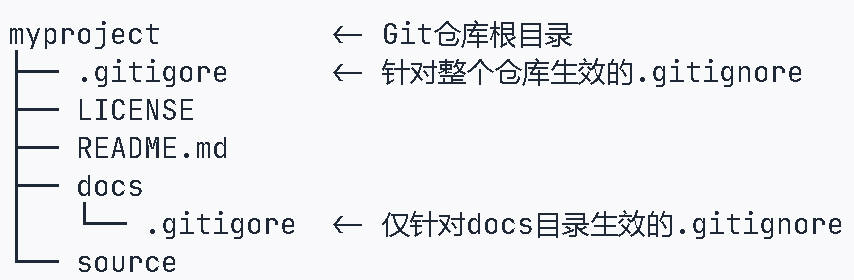

一个Git仓库可以有多个`.gitignore`文件，`.gitignore`文件放在哪个目录下，就对哪个目录（包括子目录）起作用。

```java
# Windows:
Thumbs.db
ehthumbs.db
Desktop.ini

# Python:
*.py[cod]
*.so
*.egg
*.egg-info
dist
build

# My configurations:
db.ini
deploy_key_rsa

    
# 排除所有.开头的隐藏文件:
.*
# 排除所有.class文件:
*.class

# 不排除.gitignore和App.class:
!.gitignore
!App.class
```

`.gitignore`忽略的文件用`-f`强制添加到Git： `git add -f App.class`

`.gitignore`写得是否有问题： `git check-ignore -v App.class`

## 配置别名

`st`表示`status`：  `git config --global alias.st status`

`git config --global alias.lg "log --color --graph --pretty=format:'%Cred%h%Creset -%C(yellow)%d%Creset %s %Cgreen(%cr) %C(bold blue)<%an>%Creset' --abbrev-commit"`

- `--global`针对当前用户起作用，如果不加，只针对当前的仓库起作用
- 每个仓库的Git配置文件： `.git/config`
- 当前用户Git配置文件放在用户主目录下的一个隐藏文件`.gitconfig`中：  `C:\Users\spears`

# ==git工作流==

[git工作流_百度搜索](https://www.baidu.com/s?ie=UTF-8&wd=git%E5%B7%A5%E4%BD%9C%E6%B5%81)	

[GIT 工作流 ](https://www.cnblogs.com/yunlong-study/p/15559935.html)	[ gitflow 工作流](https://cloud.tencent.com/developer/article/1841759)	[打造Git工作流和Commit规范！](https://zhuanlan.zhihu.com/p/664051778)	  [开发规范一：Git Flow + Gitlab 工作流](https://cloud.tencent.com/developer/article/2115064)	[Git Commit 规范](https://cloud.tencent.com/developer/article/2115067)	[Git工作流](https://cloud.tencent.com/developer/article/2075898)	[分支管理与Git Flow实践](https://blog.csdn.net/ForTheDevelopers/article/details/109190621?spm=1001.2101.3001.6650.1&depth_1-utm_source=distribute.pc_relevant.none-task-blog-2%7Edefault%7ECTRLIST%7Edefault-1.no_search_link)	

[项目组Gitlab Flow && DevOps流程](https://cloud.tencent.com/developer/article/1700233)	  [gitlab flow-bilibili](https://search.bilibili.com/all?keyword=gitlab%20flow&search_source=5)	[git flow工作流介绍](https://www.yuque.com/xiumubai/fe/qoqfnu)	[git flow工作流介绍_bilibili](https://www.bilibili.com/video/BV1qD4y1r7u4?vd_source=7346303e5e18677d7261c2c0c109ecfd&spm_id_from=333.788.player.switch)	

==gitlab flow==: [GitLab使用规范](https://blog.csdn.net/zora_55/article/details/114077850)	  [团队协作的三大工作流](https://zhuanlan.zhihu.com/p/140553749)	[Gitlab flow工作流](https://blog.csdn.net/niwoxiangyu/article/details/142720136)	[git代码分支管理策略](https://www.cnblogs.com/tianmaoyu/p/16481305.html)	[07.git flow工作流介绍](https://www.yuque.com/xiumubai/fe/qoqfnu)	[gitlab flow-bilibili](https://search.bilibili.com/all?vt=52988684&keyword=gitlab%20flow&search_source=5) 	

现代Devops技术基于**容器技术、自动化脚本**实现了依赖环境的打包、版本管理、敏捷部署。   [我司项目组Gitlab Flow && DevOps流程](https://cloud.tencent.com/developer/article/1700233)	

Git工作流‌指==代码管理的工作流程==和方式，主要用于多人协作开发中，确保项目能够顺畅、自然地向前流动，避免冲突和对撞。Git工作流有多种类型，每种类型适用于不同的场景和需求

### 主要Git工作流类型

- `GitFlow`工作流‌
  - 这种工作流将分支分为五种类型：主线分支、开发分支、功能分支、预发布分支和修复分支。主线分支是项目的核心分支，开发分支用于开发和测试，功能分支用于开发新功能，`release预发布分支`用于发布前的测试和验证，修复分支用于修复线上问题。‌
    - `release预上线分支`，基于本次上线所有的feature分支合并到develop分支之后，`从develop分支创建`。
- `‌GitHubFlow`工作流‌
  - 这种工作流只有一个长期存在的主分支，团队成员可以从主分支中分离出自己的分支进行开发和测试，完成后可以通过拉请求合并到主分支中。
- `Gitlab flow` 是 Git flow 与 Github flow 的综合。它吸取了两者的优点，既有适应不同开发环境的弹性，又有单一主分支的简单和便利, 分成两种情况，适应不同的开发流程   
  - "持续发布"的项目:  代码变化，必须由"上游"向"下游"发展。
  - "版本发布"的项目： 每一个稳定版本，都要从`master`分支拉出一个分支
- ‌功能驱动开发（FDD）‌：这种工作流采用功能驱动式开发，需求是开发的起点，先有需求再有功能分支或补丁分支。完成开发后，该分支合并到主分支，然后被删除。‌

### Git工作流的最佳实践和工具

[分支管理和工作流模型](https://www.bilibili.com/video/BV1HM411377j?vd_source=7346303e5e18677d7261c2c0c109ecfd&spm_id_from=333.788.videopod.sections&p=19)	

通过合理的工作流设计和工具使用，可以有效地提高开发效率，确保项目的顺利进行。

- `分支命名规范‌`：分支名称应具有明确的意义，例如feat表示新功能，fix表示修补bug等。‌
  - 功能性分支根据其功能和任务命名
  - 补丁和错误根据其问题编号命名
- `‌代码提交规范‌`：每次提交都应有详细的描述，以便于他人理解变更内容。
- `‌冲突解决‌`：在合并代码时，可能会发生冲突，需要团队成员共同解决。‌
- `‌标签管理‌`：在master分支的推送应该打标签做记录，方便追溯。

| 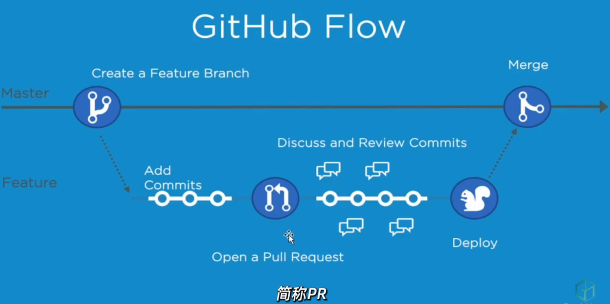 | 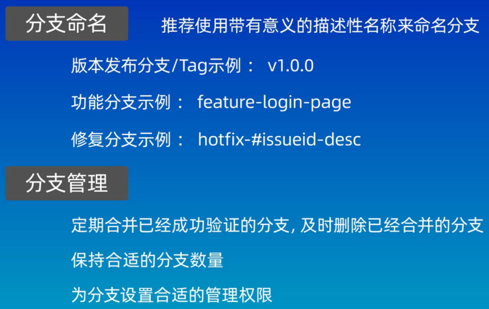 |
| ------------------------------------------------------------ | ---------------------------------------------------------- |
| 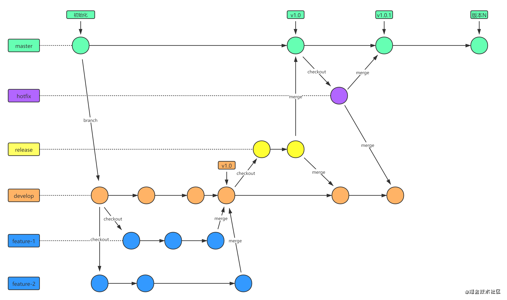                | 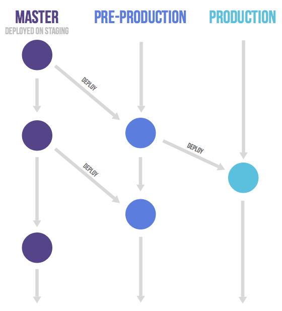                      |
| 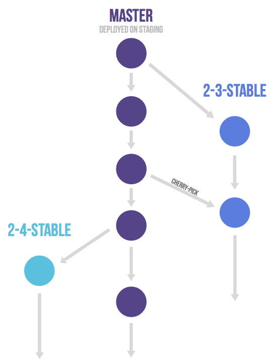             |                                                            |


# 搭建Git服务器

[搭建Git服务器-廖雪峰的官方网站](https://liaoxuefeng.com/books/git/customize/server/index.html)	

# 其它

[把clone的库上传到自己远程库_百度搜索](https://www.baidu.com/s?ie=UTF-8&wd=%E6%8A%8Aclone%E7%9A%84%E5%BA%93%E4%B8%8A%E4%BC%A0%E5%88%B0%E8%87%AA%E5%B7%B1%E8%BF%9C%E7%A8%8B%E5%BA%93)	

## 大文件存储LFS

[git lfs_百度搜索](https://www.baidu.com/s?ie=UTF-8&wd=git%20lfs)	[详解 Git 大文件存储（Git LFS）](https://zhuanlan.zhihu.com/p/146683392)	

[Git LFS 安装及使用](https://www.cnblogs.com/tjw-bk/p/17836565.html)	 [Git LFS 操作指南 | Gitee 帮助中心](https://help.gitee.com/enterprise/code-manage/code-hosting/large-file-manage/git-lfs)	

[github启用 Git LFS_百度搜索](https://www.baidu.com/s?ie=utf-8&f=8&rsv_bp=1&tn=baidu&wd=github%E5%90%AF%E7%94%A8%20Git%20LFS&oq=%25E5%2590%25AF%25E7%2594%25A8%2520Git%2520LFS&rsv_pq=e1dc7f4d00061830&rsv_t=d819U1NLb1oDQmJ91Mxw9Qr1pIoSVNDPNHPTuPgrUqid3RurI0ZXb8INOAc&rqlang=cn&rsv_enter=1&rsv_dl=tb&rsv_sug3=6&rsv_sug1=6&rsv_sug7=100&rsv_sug2=0&rsv_btype=t&inputT=5625&rsv_sug4=5625)	[配置 Git Large File Storage - GitHub 帮助](https://docs.github.com/cn/enterprise/2.17/admin/installation/configuring-git-large-file-storage)	

克隆过程中会将`仓库的整个历史记录`传输到客户端。对于包涵大文件（尤其是经常被修改的大文件）的项目，初始克隆需要大量时间，因为客户端会下载每个文件的每个版本。

**Git LFS**（Large File Storage）是由 Atlassian, GitHub 以及其他开源贡献者开发的 Git 扩展，它通过延迟地（lazily）下载大文件的相关版本来减少大文件在仓库中的影响，具体来说，大文件是在 checkout 的过程中下载的，而不是 clone 或 fetch 过程中下载的（**这意味着你在后台定时 fetch 远端仓库内容到本地时，并不会下载大文件内容，而是在你 checkout 到工作区的时候才会真正去下载大文件的内容**）


# 可视化管理工具

[Git三款可视化管理工具](https://blog.csdn.net/hmllittlekoi/article/details/104504406/)	[10款Git可视化管理工具](https://cloud.tencent.com/developer/article/2384103)	[11款Git可视化管理工具 ](https://zhuanlan.zhihu.com/p/720553238)	

[图形化的Git工具](https://help.aliyun.com/zh/yunxiao/user-guide/graphical-git)	[ Git图形化](https://www.zhihu.com/question/22932048/answer/2945585927)	[git可视化管理工具](https://www.bnocode.com/article/top10-git-management-tools.html)	[5款Git可视化工具](https://blog.csdn.net/fafafaz/article/details/136234800)	

[git图形化工具](https://blog.csdn.net/shinuone/article/details/134282217)	 [git的图形化工具](https://worktile.com/kb/ask/204982.html)	

[sourceTree教程](https://blog.csdn.net/LINgZone2/article/details/130029719)	 

[smartgit使用](https://blog.csdn.net/qq_44870829/article/details/144222286)	

`Github Desktop、 Sourcetree、 TortoiseGit`