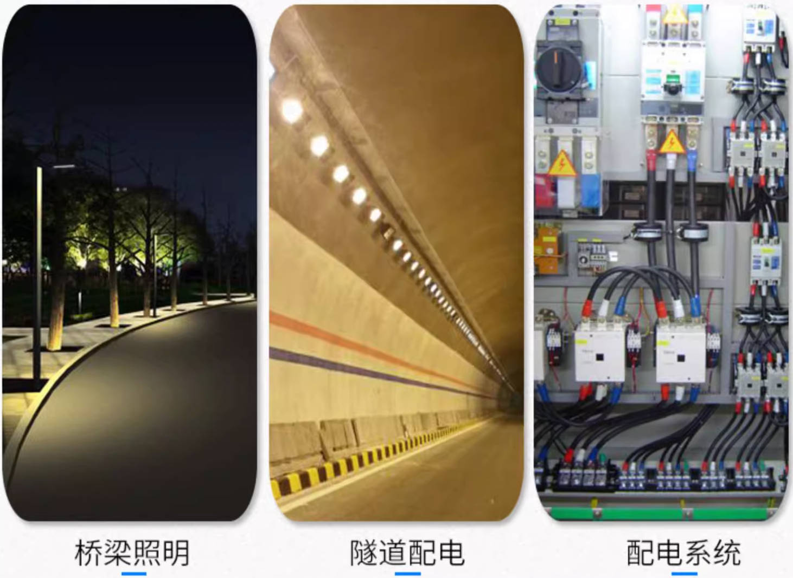
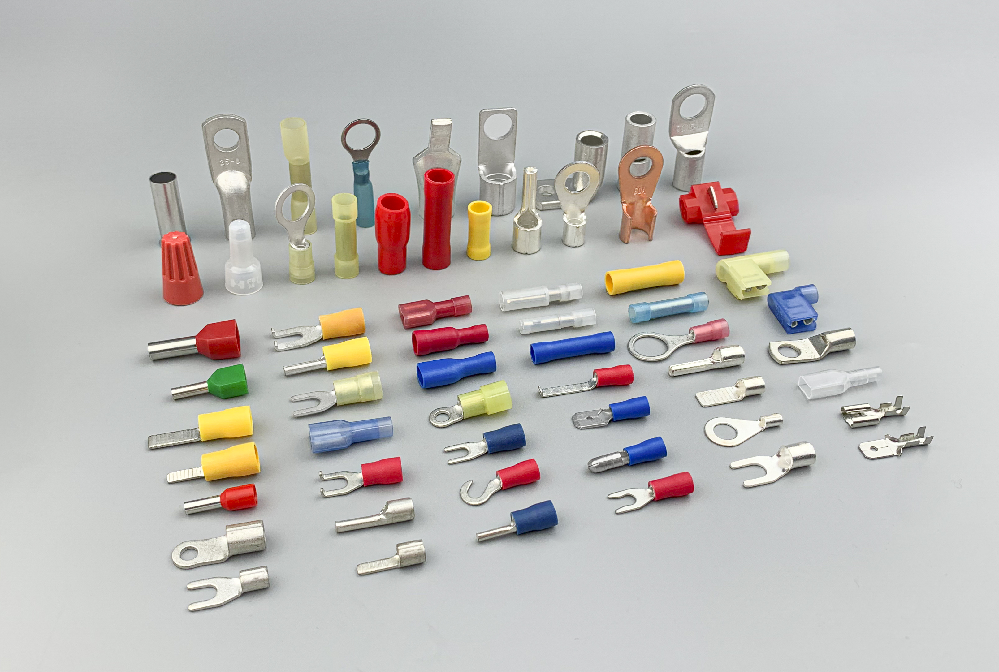
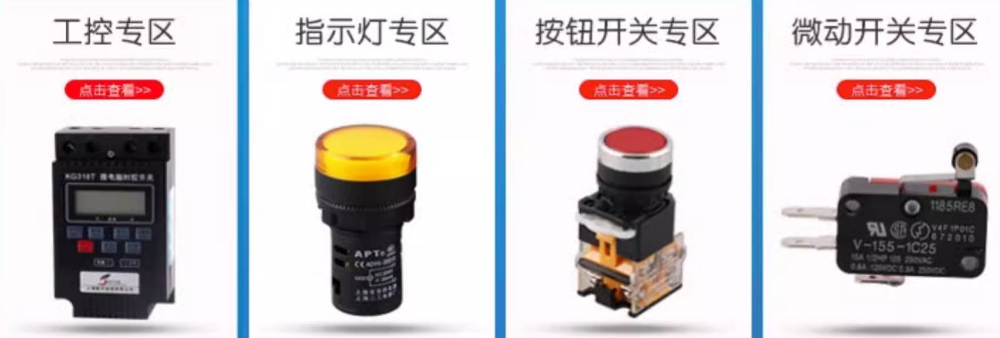
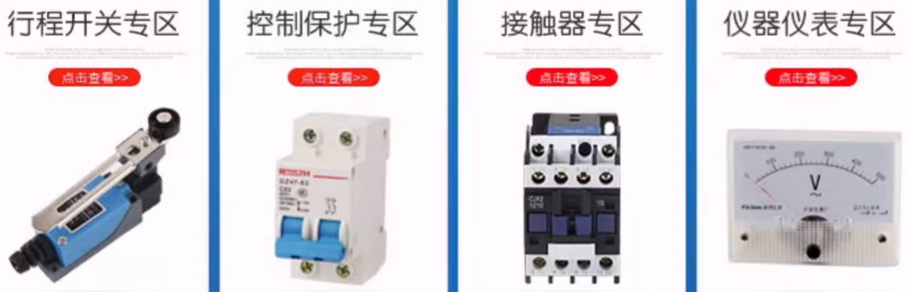
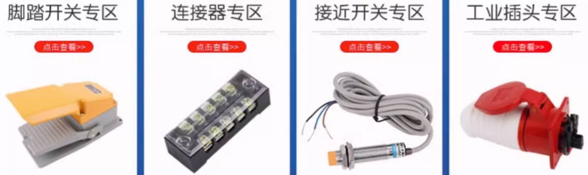

# 晶体管

[数码管 ](https://zhuanlan.zhihu.com/p/668108489)	

# 端子压接

## 端子分类

[铜接线端子国家标准(铜接线端子执行标准)](https://yongjiujinju.51sole.com/companynewsdetail_270327407.htm)	 [接线端子](https://yongjiujinju.51sole.com/companynewsdetail_252395357.htm)	 [端子划分_百度搜索](https://www.baidu.com/s?ie=UTF-8&wd=%E7%AB%AF%E5%AD%90%E5%88%92%E5%88%86)	

**端子类型**： [PCB线路板接线端子概述大全-Elinker](https://c.gongkong.com/PhoneVersion/NewDetail?newsId=327849)	[33种国内外接线端子、端头类型](http://www.360doc.com/content/24/0818/19/80935859_1131693172.shtml)	 [接线端子-线鼻-线耳_国标线耳尺寸表](https://blog.csdn.net/tongbiaos/article/details/59683627)	 [常见接线端子介绍](https://blog.csdn.net/tongbiaos/article/details/59652863?spm=1001.2101.3001.6650.1&depth_1-utm_source=distribute.pc_relevant.none-task-blog-2%7Edefault%7Ebaidujs_utm_term%7ECtr-1-59652863-blog-59683627.235%5Ev43%5Epc_blog_bottom_relevance_base3)  [铜接线端子国家标准](https://yongjiujinju.51sole.com/companynewsdetail_270327407.htm)  [国标dt端子](https://baijiahao.baidu.com/s?id=1731421751164979175&wfr=spider&for=pc)	[圆形裸端子](https://mbd.baidu.com/newspage/data/landingsuper?context=%7B%22nid%22%3A%22news_9989398055636883973%22%7D&n_type=1&p_from=3)  	[端子的种类和用途](https://mp.weixin.qq.com/s?__biz=MzkxMDA0ODI4OQ==&mid=2247522412&idx=3&sn=4f22f1113dc77c8cdc93d85db69e0a7e)	[接线端子的分类](https://c.gongkong.com/PhoneVersion/PaperDetail?paperId=62438)   [端子规格_百度搜索](https://www.baidu.com/s?ie=UTF-8&wd=%E7%AB%AF%E5%AD%90%E8%A7%84%E6%A0%BC)	 [接线端子规格大全型号](https://baijiahao.baidu.com/s?id=1806911438159950375&wfr=spider&for=pc)		  	

**名词**：端子排、配电系统

**接线端子 :  ** DT、OT接线端子 

**视频：**  [什么是端子](https://www.bilibili.com/video/BV1VoywYUEwr/?vd_source=7346303e5e18677d7261c2c0c109ecfd)	 [常见的端子种类](https://www.bilibili.com/video/BV1xuyGYhEFL?spm_id_from=333.788.recommend_more_video.0&vd_source=7346303e5e18677d7261c2c0c109ecfd)   [接线端子介绍](https://www.bilibili.com/video/BV1ns421M7sk/?vd_source=7346303e5e18677d7261c2c0c109ecfd)		[压接XH2.54和PH2.0端子](https://www.bilibili.com/video/BV1YQ4y1b7vA/?vd_source=7346303e5e18677d7261c2c0c109ecfd)	[端子压接](https://search.bilibili.com/all?vt=08279855&keyword=%E7%AB%AF%E5%AD%90%E5%8E%8B%E6%8E%A5&search_source=5)	  

**实例： **  [实拍电气接线端子](https://baijiahao.baidu.com/s?id=1770227548118534335&wfr=spider&for=pc)   [冷压端子](https://baijiahao.baidu.com/s?id=1773647519745612782&wfr=spider&for=pc)		 [上海有乐电气线路板接线端子排产品分类及相关使用规则](https://www.youlecn.com/article-951.html)	 [资料下载](https://cnelinker.com/downloads.php)	 

电工学中，*端子*多指接线终端，又叫接线端子，  接线端子就是用于实现电气连接的一种配件产品，工业上划分为连接器的范畴

[**接线端子**](http://www.gongkong.com/connector/)可以分为==欧式==接线端子系列、==插拔式==接线端子系列、==栅栏式==接线端子系列、==弹簧式==接线端子系列、==轨道式==接线端子系列、==H型穿墙式==接线端子系列等

PCB接线端子又称为线路板端子，主要有插拔式（LC系列）、弹簧式（LS系列）、直焊式（LG系列）以及栅栏式（LW系列）四类产品

`LC1-3.81、 LSC1-5.08、 LG103-5.08、 lw1c-10`  

`UL-UK普通型接线端子、STL/WST/WSTC弹簧式接线端子、JF5/H2519/X5/JX3变压器接线端子、JL1/JY1/JSJ绝缘子等` 

|  |                           |
| ------------------------------------------------------- | ------------------------------------------------------- |
|  |  |
|  |                                                    |
|                                                         |                                                         |

# 电气控制柜

标准： [电气安全类（GB与GB/T）国标](http://www.txrzx.com/i3718.html)  	

[电气柜设计](https://zhuanlan.zhihu.com/p/652572911)   

[变频器控制柜国家规范_百度搜索](https://www.baidu.com/s?tn=baidu&wd=%E5%8F%98%E9%A2%91%E5%99%A8%E6%8E%A7%E5%88%B6%E6%9F%9C%E5%9B%BD%E5%AE%B6%E8%A7%84%E8%8C%83&rsv_crq=re_dl_cr_31861&bs=GB4026-1992)	

[GB4025指示灯和按钮的颜色_百度搜索](https://www.baidu.com/s?tn=baidu&wd=GB4025%E6%8C%87%E7%A4%BA%E7%81%AF%E5%92%8C%E6%8C%89%E9%92%AE%E7%9A%84%E9%A2%9C%E8%89%B2&rsv_crq=re_dl_cr_31861&bs=GB4026-1992)	[电气设备指示灯及操作按钮的颜色 ](https://zhuanlan.zhihu.com/p/188628040)		 

[ 工控人家园](http://www.ymmfa.com/read-gktid-1677079-page-2.html) 	