视频： [小甲鱼C](https://www.bilibili.com/video/av27744141/?vd_source=7346303e5e18677d7261c2c0c109ecfd)  [鱼C论坛](https://fishc.com.cn/thread-1053-1-1.html) [C语言](https://www.bilibili.com/video/BV1WM4m127tq/?vd_source=7346303e5e18677d7261c2c0c109ecfd)  [c](https://www.bilibili.com/video/BV1d14y1M7ir?p=127&vd_source=7346303e5e18677d7261c2c0c109ecfd)  [c学习](https://www.bilibili.com/video/BV16jhWeMEen?p=54&vd_source=7346303e5e18677d7261c2c0c109ecfd)  [c](https://www.bilibili.com/video/BV1d14y1M7ir?p=127&vd_source=7346303e5e18677d7261c2c0c109ecfd)  [C语言教程](https://www.bilibili.com/video/BV1hc411b7YK/?vd_source=7346303e5e18677d7261c2c0c109ecfd)   [C语言](https://www.bilibili.com/video/BV18d4y1a7cV/?vd_source=7346303e5e18677d7261c2c0c109ecfd)    [数据库管理系统](https://www.bilibili.com/video/BV1qk4y1b7QS?p=35&vd_source=7346303e5e18677d7261c2c0c109ecfd)    

[C语言|菜鸟教程](https://www.runoob.com/cprogramming/c-tutorial.html)	 [ C语言中文网](https://c.biancheng.net/c/)	

[《带你学C带你飞》【第一季】全套资源 ](https://www.52pojie.cn/thread-1059597-1-1.html#:~:text=%E5%90%BE%E7%88%B1%E7%A0%B4%E8%A7%A3%E6%89%80%E5%8F%91) 

[C++ primer(第五版) 视频](https://www.bilibili.com/video/BV1aw411K7zy/?vd_source=7346303e5e18677d7261c2c0c109ecfd)   [明解C语言](https://www.bilibili.com/video/BV1Va411F7Pg/?vd_source=7346303e5e18677d7261c2c0c109ecfd)  [300集c/c++](https://www.bilibili.com/video/BV1zEnZeBEAT/?vd_source=7346303e5e18677d7261c2c0c109ecfd)    [谭浩强C语言教程小甲鱼](https://www.bilibili.com/video/BV1gT4y1P7yN/?vd_source=7346303e5e18677d7261c2c0c109ecfd)  [C语言做成动画片](https://www.bilibili.com/video/BV1Y9WoeiECa/?spm_id_from=333.788.recommend_more_video.1&vd_source=7346303e5e18677d7261c2c0c109ecfd) 

[c++](https://www.bilibili.com/video/BV1Dx4y1g74n?p=2&vd_source=7346303e5e18677d7261c2c0c109ecfd)  [C++](https://www.bilibili.com/video/av374923818/?vd_source=7346303e5e18677d7261c2c0c109ecfd)   [c](https://www.bilibili.com/video/BV1fZ4y1F7Vt/?p=190&vd_source=7346303e5e18677d7261c2c0c109ecfd) 

[TIOBE Index - TIOBE编程语言排行](https://www.tiobe.com/tiobe-index/) 

[C-菜鸟教程](https://www.runoob.com/cprogramming/c-standard-library-stdio-h.html)   

笔记： [扩展阅读](https://fishc.com.cn/forum.php?mod=forumdisplay&fid=329&filter=typeid&typeid=571&page=1)   [好：C语言自学笔记](https://www.cnblogs.com/longzhistudy/p/13200310.html)   [C语言万字基础笔记总结](https://cloud.tencent.com/developer/article/1855519)   [笔记](https://blog.csdn.net/Scxioi0/article/details/109827309)  [小甲鱼C语言1-22讲笔记（指针和数组）](https://blog.csdn.net/weixin_65801945/article/details/127436175?spm=1001.2101.3001.6650.13&depth_1-utm_source=distribute.pc_relevant.none-task-blog-2%7Edefault%7EBlogCommendFromBaidu%7ERate-13-127436175-blog-126647259.235%5Ev43%5Epc_blog_bottom_relevance_base8)  

# c语言标准

[C语言标准](https://baike.baidu.com/item/C%E8%AF%AD%E8%A8%80/105958) 	

# 汇编和编译

[C语言文件后缀有哪些？（超过10种）](https://c.biancheng.net/view/yl01vv0.html)	

## ==汇编和编译区别== 

[C/C++ 中的内存段](https://www.bilibili.com/video/BV14hdbY6ETE/?vd_source=7346303e5e18677d7261c2c0c109ecfd)	  

[动态编译与静态编译](https://www.bilibili.com/video/BV1bD4y147fH/?vd_source=7346303e5e18677d7261c2c0c109ecfd)	 [开源动画引擎 movy.js](https://www.bilibili.com/video/BV1Qf4y167Fq/?vd_source=7346303e5e18677d7261c2c0c109ecfd)	[好：编译过程-动画演示](https://www.bilibili.com/video/BV1MtQLYhEm1/?vd_source=7346303e5e18677d7261c2c0c109ecfd)	[编译过程动画-bilibili](https://search.bilibili.com/all?keyword=%E7%BC%96%E8%AF%91%E8%BF%87%E7%A8%8B%E5%8A%A8%E7%94%BB&search_source=5)	[编译原理笔记](https://blog.csdn.net/weixin_41633902/article/details/108282177)	[C语言编译流程详解-CSDN博客](https://blog.csdn.net/kevin_heidashuai/article/details/103049929)	

AST: [AST抽象语法树的基本思想](https://blog.csdn.net/u013212754/article/details/106981084) [抽象语法树(AST) ](https://www.cnblogs.com/lxh2cwl/p/14842913.html) [初识抽象语法树](https://www.cnblogs.com/ToTigerMountain/articles/18047272)			[编译原理中的抽象语法树(AST)为什么而存在？ ](https://www.zhihu.com/question/363445606/answer/2767230528)	[抽象语法树AST(Abstract Syntax Tree)](https://juejin.cn/post/7379958888909144083)	[抽象语法树的定义（C语言版）-菜鸟笔记](https://www.coonote.com/c-note/abstract-syntax-tree.html)	[AST抽象语法树原理与创建 - 知乎](https://zhuanlan.zhihu.com/p/599326926)	[语法抽象树_百度搜索](https://www.baidu.com/s?ie=UTF-8&wd=%E8%AF%AD%E6%B3%95%E6%8A%BD%E8%B1%A1%E6%A0%91)	

- `masm 1.asm`汇编编译为机器码 `1.obj`;  链接： `link 1.obj`  1.exe
  - masm + link： `ml.exe  1.asm`

图片可能显示不出来，汇编教程里有


| 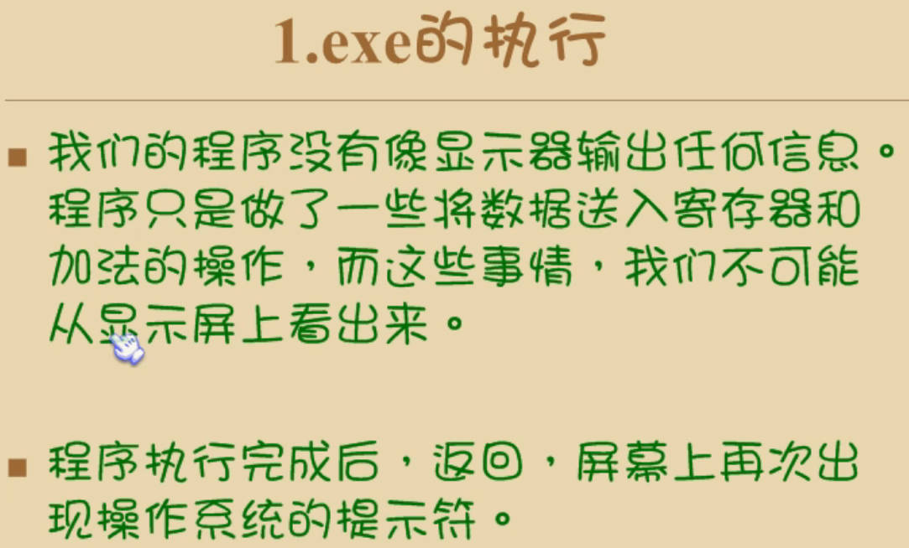 | 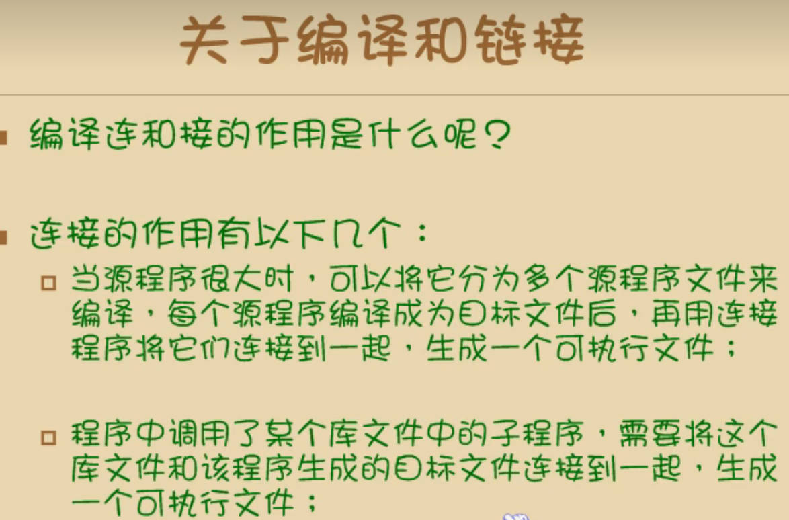 |
| -------------------------------------------------------- | -------------------------------------------------------- |
|  | 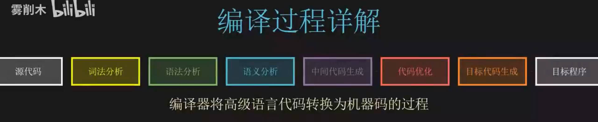 |
| 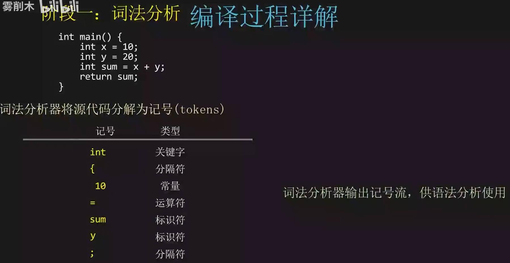 | 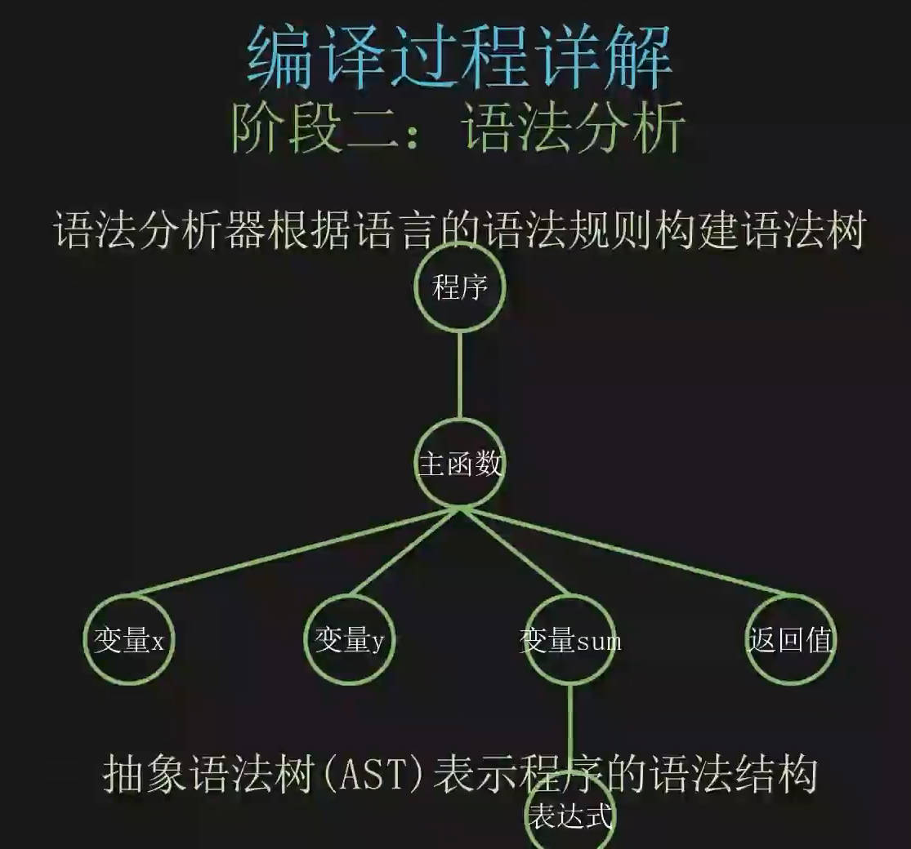 |
| 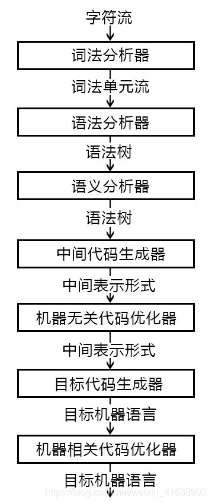                         | 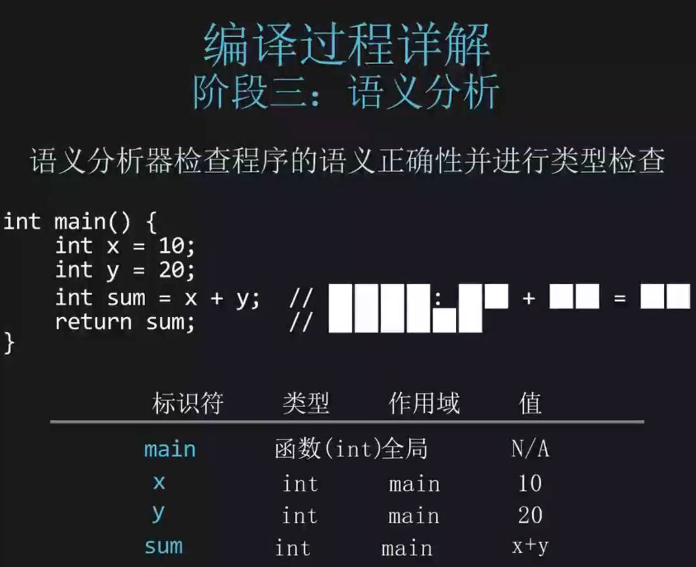 |
| 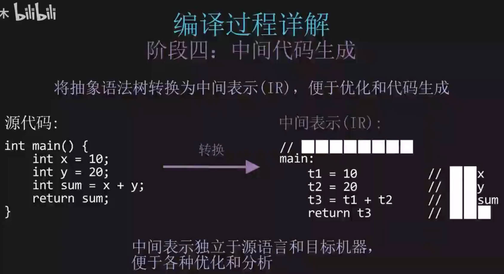 | 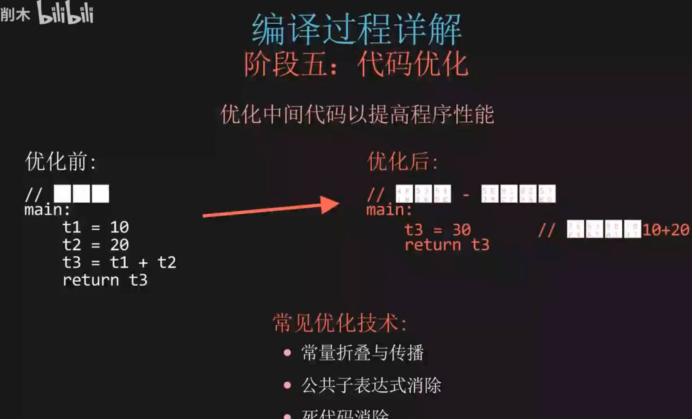 |
| 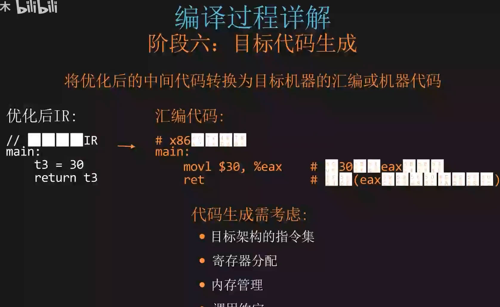 | 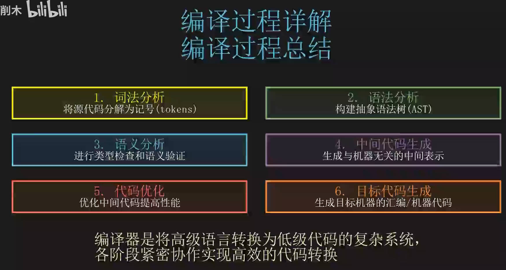 |

[编译器的工作流程](https://fishc.com.cn/thread-78063-1-1.html) 

> ==链接==: 
>
> 源代码中调用了 printf 函数，但并没有定义 printf 函数的实现过程，这是因为我们知道这是一个 stdio 的标准库函数。虽然在预处理（第一步）中，将 stdio.h 头文件导了进来，但那里边只有 printf 函数的声明而已：
>
> `extern int printf (__const char *__restrict __format,...);`
>
> 从程序员的角度看，函数库实际上就是==头文件（.h）和库文件（.so 或 .a）==的结合，==头文件中声明函数，库文件中定义函数的实现==。所以在最后一步的链接，就是把相关的库文件给链接进来（也就是把 printf 的实现代码添加进来）。
>
> *注：Linux 下的库文件分为两大类，分别是：动态链接库（通常以 .so 结尾）和静态链接库（通常以 .a 结尾）*

[符号表管理技术](https://blog.csdn.net/b12345678_123/article/details/125889597)    [什么是反编译_百度搜索](https://www.baidu.com/s?ie=utf-8&f=8&rsv_bp=1&tn=baidu&wd=%E4%BB%80%E4%B9%88%E6%98%AF%E5%8F%8D%E7%BC%96%E8%AF%91&oq=%25E5%258F%258D%25E7%25BC%2596%25E8%25AF%2591%2520%25E5%258F%258D%25E6%25B1%2587%25E7%25BC%2596&rsv_pq=8be91c4200038449&rsv_t=cb24REoxSV3GSWU%2BWxsQT9Sk2OmlldjAQQXCGpecAZ48JVhEUoqENSQA%2FWs&rqlang=cn&rsv_enter=1&rsv_dl=tb&rsv_btype=t&inputT=49651&rsv_sug3=22&rsv_sug1=18&rsv_sug7=100&rsv_sug2=0&rsv_sug4=7500876)    [java字节码和汇编语言有什么区别_百度搜索](https://www.baidu.com/s?ie=UTF-8&wd=java%E5%AD%97%E8%8A%82%E7%A0%81%E5%92%8C%E6%B1%87%E7%BC%96%E8%AF%AD%E8%A8%80%E6%9C%89%E4%BB%80%E4%B9%88%E5%8C%BA%E5%88%AB)  [汇编和编译](https://www.zhihu.com/question/388069555/answer/1155963493) [高级语言为什么不直接编译成机器码,而编译成汇编代码](https://blog.csdn.net/gaoyi221119/article/details/53319451)  [编译结果是汇编还是机器码_百度搜索](https://www.baidu.com/s?ie=UTF-8&wd=%E7%BC%96%E8%AF%91%E7%BB%93%E6%9E%9C%E6%98%AF%E6%B1%87%E7%BC%96%E8%BF%98%E6%98%AF%E6%9C%BA%E5%99%A8%E7%A0%81) 

[构建和编译区别](https://www.baidu.com/s?ie=UTF-8&wd=%E6%9E%84%E5%BB%BA%E5%92%8C%E7%BC%96%E8%AF%91%E5%8C%BA%E5%88%AB)   [编译、构建、调试、运行](https://blog.csdn.net/qq_41861406/article/details/126370735)  [编译原理和语言知识](https://zhuanlan.zhihu.com/p/68871910)  

- 构建build, 是指一些列的处理，包括编译  

> **构建和编译是软件开发过程中的两个不同阶段，它们在功能与目的、执行环境与依赖、执行频率与阶段、涉及的工具与资源以及输出与结果方面存在差异。**‌
>
> - ‌**功能与目的**‌：==构建是将源代码转化为可执行代码的过程==，它包括编译、链接、打包等一系列步骤，可能涉及测试、部署等。编译则是构建过程中的一个阶段，专门负责将人类可读的源代码转换成机器可执行的代码或中间代码。
> - ‌**执行环境与依赖**‌：构建通常涉及复杂的依赖管理和环境配置，不仅包括编译，还可能包括测试、压缩、优化等步骤。编译只依赖于源代码和编译器，将源代码转换为目标代码或字节码。
> - ‌**执行频率与阶段**‌：构建在开发过程中可能频繁执行，涉及的阶段从开发到测试再到部署都可能涉及。编译通常作为构建过程中的一个步骤，每次构建都会执行。
> - ‌**涉及的工具与资源**‌：构建工具通常更为复杂，例如Jenkins、TeamCity等，可能涉及源代码管理、依赖管理、任务调度等。编译工具相对简单，例如GCC、javac等，主要负责源代码的转换。
> - ‌**输出与结果**‌：构建的输出是一个完整的可部署或可执行的软件产品，包括编译后的代码、资源文件、配置等。编译的输出是中间代码或机器代码，通常需要链接等步骤才能成为可执行文件。
>
> 综上所述，‌**编译**‌主要是将源代码转换为机器代码的过程，而‌**构建**‌则是一个更广泛的过程，包括编译在内的多个阶段，旨在生成一个可部署或可执行的软件产品。两者在软件开发过程中共同作用，以确保软件的质量、兼容性和可维护性‌

**java是解释型语言**， 不直接编译成机器码，而是==将源代码转换为中间代码==（字节码），发送给解释器，由解释器逐句翻译给cpu执行；  好处是可以实现跨平台; 每次都要翻译，所有效率低

- 编译型：做好菜再开吃；   解释型：火锅，想吃什么下什么料

源代码经过**编译**得到汇编代码，汇编代码*经过**汇编**得到*机器代码

- 把 `预处理+编译+汇编+连接` 简称为“编译+连接”，甚至直接称为“编译” 
- 汇编是从汇编语言到机器码的过程
- 编译是 `源代码->词法分析->语法分析->中间代码生成和优化->汇编代码->机器码` 的过程，有一些语言是解释执行，就转为对应虚拟机的字节码。  

1. **预编译：** `Add.h` 和`Test.c` 头文件和源文件     [好：汇编和编译具体指什么-](https://www.zhihu.com/question/388069555)    [C++中预处理、编译、汇编、链接的区别](https://blog.csdn.net/qq_40287633/article/details/128006176?spm=1001.2101.3001.6661.1&depth_1-utm_source=distribute.pc_relevant_t0.none-task-blog-2%7Edefault%7EBlogCommendFromBaidu%7EPaidSort-1-128006176-blog-123750439.235%5Ev43%5Epc_blog_bottom_relevance_base5) 
   1. 预编译的指令`gcc Test.c -E -o Test.i`，将`Test.c`预编译为 ==Test.i==    也可以 `gcc  Test.c && ./Test.out`
   2. 编译时会将包含的[头文件](https://www.zhihu.com/search?q=头文件&search_source=Entity&hybrid_search_source=Entity&hybrid_search_extra={"sourceType"%3A"answer"%2C"sourceId"%3A3495132276})和`define`等替换拓展
   3. 注释会被删除。注释毕竟是给人看的，编译器不需要
2. **编译：**  `gcc -S Test.i -o Test.s` 将`Test.i`编译为 ==Test.s==  ；    
   1. 代码被转化成了[汇编语言](https://www.zhihu.com/search?q=汇编语言&search_source=Entity&hybrid_search_source=Entity&hybrid_search_extra={"sourceType"%3A"answer"%2C"sourceId"%3A3495132276})，其实还进行了以下过程： 词法分析、语法分析、语义分析、中间代码生成；   
   2. 要牢记住这个步骤 `符号汇总` 。将程序中出现的`函数汇总`起来，供下一步汇编时形成符号表
3. **汇编： ** 将汇编代码转化为机器码， `gcc -c Test.s -o Test.o`  ==Test.o== 
   1. 将上一个过程汇总的符号 `形成符号表`; 符号表包含的是 **函数名以及函数的地址** 
4. **链接：** 
   1. 解决一个项目多文件，多模块==相互之间调用==的问题，将这些模块之间和文件之间连接起来
   2. 汇编过程中两个文件各生成了一个==符号表==包含着函数的名称和地址，链接时把这两个符号表合成一个，共享一个符号表，编译器会将地址无效的去除掉保留有效的
   3. 编译是将[源代码](https://www.zhihu.com/search?q=源代码&search_source=Entity&hybrid_search_source=Entity&hybrid_search_extra={"sourceType"%3A"answer"%2C"sourceId"%3A3495132276})转换为目标代码(机器语言)的过程，**目标代码**通常以对象文件的形式存在。**链接**是==将多个对象文件和库文件结合在一起==，生成一个可执行程序的过程
5. ==cl表示visual studio的编译器，gcc表示linux下的编译器== 

> [编译程序](https://baike.baidu.com/item/编译程序/8290180?fromModule=lemma_inlink)把人们熟悉的语言换成2进制的。 [编译程序](https://baike.baidu.com/item/编译程序/8290180?fromModule=lemma_inlink)把一个[源程序](https://baike.baidu.com/item/源程序/9752646?fromModule=lemma_inlink)翻译成[目标程序](https://baike.baidu.com/item/目标程序/8082041?fromModule=lemma_inlink)的工作过程分为五个阶段：[词法分析](https://baike.baidu.com/item/词法分析/8853461?fromModule=lemma_inlink)；[语法分析](https://baike.baidu.com/item/语法分析/8853407?fromModule=lemma_inlink)；语义检查和[中间代码生成](https://baike.baidu.com/item/中间代码生成/8853318?fromModule=lemma_inlink)；[代码优化](https://baike.baidu.com/item/代码优化/571727?fromModule=lemma_inlink)；[目标代码](https://baike.baidu.com/item/目标代码/9407934?fromModule=lemma_inlink)生成。主要是进行[词法分析](https://baike.baidu.com/item/词法分析/8853461?fromModule=lemma_inlink)和[语法分析](https://baike.baidu.com/item/语法分析/8853407?fromModule=lemma_inlink)，又称为[源程序](https://baike.baidu.com/item/源程序/0?fromModule=lemma_inlink)分析，分析过程中发现有语法错误，给出提示信息

[Java字节码文件和二进制文件的区别与联系](https://blog.csdn.net/qq_36851469/article/details/136218605)   [二进制文件和字节码的区别_百度搜索](https://www.baidu.com/s?ie=utf-8&f=3&rsv_bp=1&tn=baidu&wd=%E4%BA%8C%E8%BF%9B%E5%88%B6%E6%96%87%E4%BB%B6%E5%92%8C%E5%AD%97%E8%8A%82%E7%A0%81%E7%9A%84%E5%8C%BA%E5%88%AB&oq=%25E4%25BA%258C%25E8%25BF%259B%25E5%2588%25B6%25E6%2596%2587%25E4%25BB%25B6%25E3%2580%2581%25E5%25AD%2597%25E8%258A%2582%25E7%25A0%2581&rsv_pq=d140509500181410&rsv_t=c101VKcdWcOAJKIkNZr3qmVXZ7688rcfZjk9J8qLZ9eHOCLJjYOGtW2MZTA&rqlang=cn&rsv_dl=ts_0&rsv_enter=1&rsv_sug3=4&rsv_sug1=3&rsv_sug7=100&rsv_sug2=1&rsv_btype=t&prefixsug=%25E4%25BA%258C%25E8%25BF%259B%25E5%2588%25B6%25E6%2596%2587%25E4%25BB%25B6%25E5%2592%258C%25E5%25AD%2597%25E8%258A%2582%25E7%25A0%2581&rsp=0&inputT=6900&rsv_sug4=9254)    [反编译 反汇编_百度搜索](https://www.baidu.com/s?ie=utf-8&f=8&rsv_bp=1&tn=baidu&wd=%E5%8F%8D%E7%BC%96%E8%AF%91%20%E5%8F%8D%E6%B1%87%E7%BC%96&oq=%25E5%258F%258D%25E7%25BC%2596%25E8%25AF%2591&rsv_pq=9df43ef20038cf1e&rsv_t=9bd88VA3zkbA3tRmI0E6rw330lou2O0N7lk%2FjzrNsQ1ywhkTETQptxqB1%2Fo&rqlang=cn&rsv_enter=1&rsv_dl=tb&rsv_sug3=11&rsv_sug1=10&rsv_sug7=100&rsv_sug2=0&rsv_btype=t&inputT=4455&rsv_sug4=6834) 

- 目标代码：  [目标代码_百度百科](https://baike.baidu.com/item/%E7%9B%AE%E6%A0%87%E4%BB%A3%E7%A0%81/9407934?fr=ge_ala)    [源代码、目标代码、可执行代码、本地代码的区别 ](https://www.cnblogs.com/leesky/articles/13966617.html)  
  - [编译器](https://baike.baidu.com/item/编译器/0?fromModule=lemma_inlink)或[汇编器](https://baike.baidu.com/item/汇编器/0?fromModule=lemma_inlink)处理[源代码](https://baike.baidu.com/item/源代码/0?fromModule=lemma_inlink)后所生成的代码，它一般由机器代码或接近于[机器语言](https://baike.baidu.com/item/机器语言/0?fromModule=lemma_inlink)的代码组成。[目标文件](https://baike.baidu.com/item/目标文件/0?fromModule=lemma_inlink)（object file）即存放目标代码的[计算机](https://baike.baidu.com/item/计算机/0?fromModule=lemma_inlink)文件，它常被称作[二进制文件](https://baike.baidu.com/item/二进制文件/0?fromModule=lemma_inlink)（binaries）。
  - [目标文件](https://baike.baidu.com/item/目标文件/0?fromModule=lemma_inlink)包含着机器代码（可直接被[计算机](https://baike.baidu.com/item/计算机/0?fromModule=lemma_inlink)[中央处理器](https://baike.baidu.com/item/中央处理器/0?fromModule=lemma_inlink)执行）以及代码在运行时使用的[数据](https://baike.baidu.com/item/数据/0?fromModule=lemma_inlink)，如[重定位](https://baike.baidu.com/item/重定位/0?fromModule=lemma_inlink)信息，如用于链接或调试的程序符号（[变量](https://baike.baidu.com/item/变量/0?fromModule=lemma_inlink)和函数的名字），此外还包括其他调试信息。
  - [目标文件](https://baike.baidu.com/item/目标文件/0?fromModule=lemma_inlink)是从[源代码](https://baike.baidu.com/item/源代码/0?fromModule=lemma_inlink)文件产生[程序文件](https://baike.baidu.com/item/程序文件/0?fromModule=lemma_inlink)这一过程的中间产物，[链接器](https://baike.baidu.com/item/链接器/0?fromModule=lemma_inlink)正是通过把目标文件链接在一起来生成[可执行文件](https://baike.baidu.com/item/可执行文件/0?fromModule=lemma_inlink)或库文件。[目标文件](https://baike.baidu.com/item/目标文件/0?fromModule=lemma_inlink)中唯一的要素是机器代码，例如，用于[嵌入式系统](https://baike.baidu.com/item/嵌入式系统/0?fromModule=lemma_inlink)的目标文件可能仅仅含有机器代码。 
- 目标代码是基于某种特定的系统体系的。由一种机器上的编译器编译出来的文件可能不能在另一种不同体系的机器上执行。尽管，这个问题已经由“中间代码”和“即时编译器”解决，但仍然有许多语言，像Java，遵循目标代码生成的传统方式。
- 修改源码后，每次需要编译源代码以反映目标代码中的更改。

| 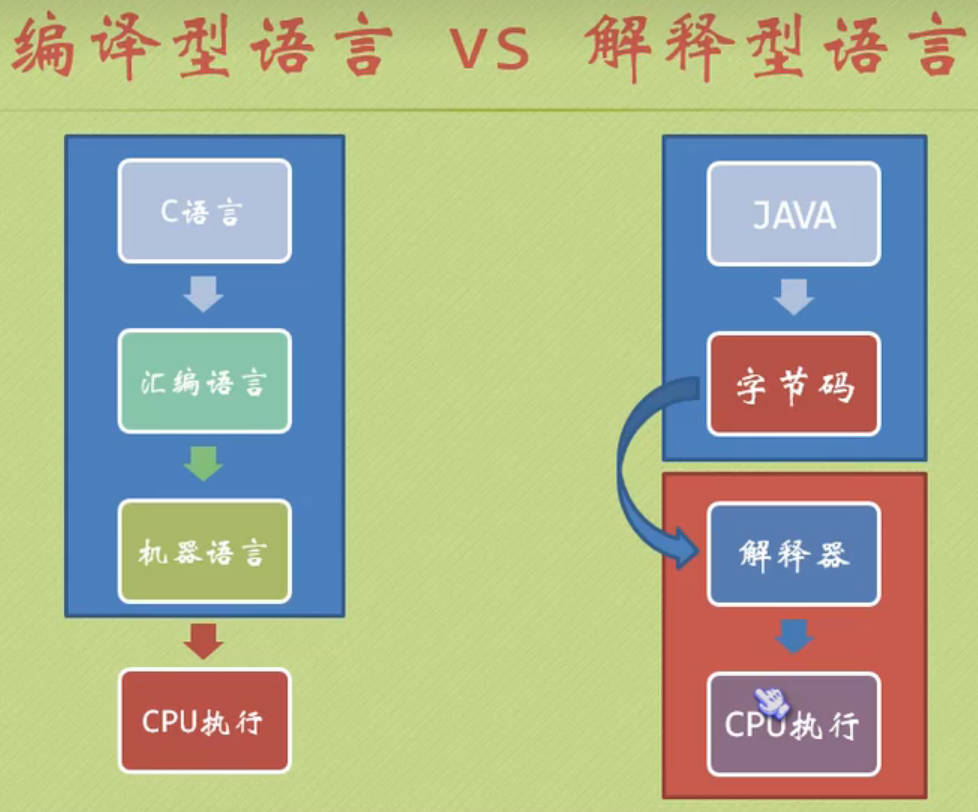 | 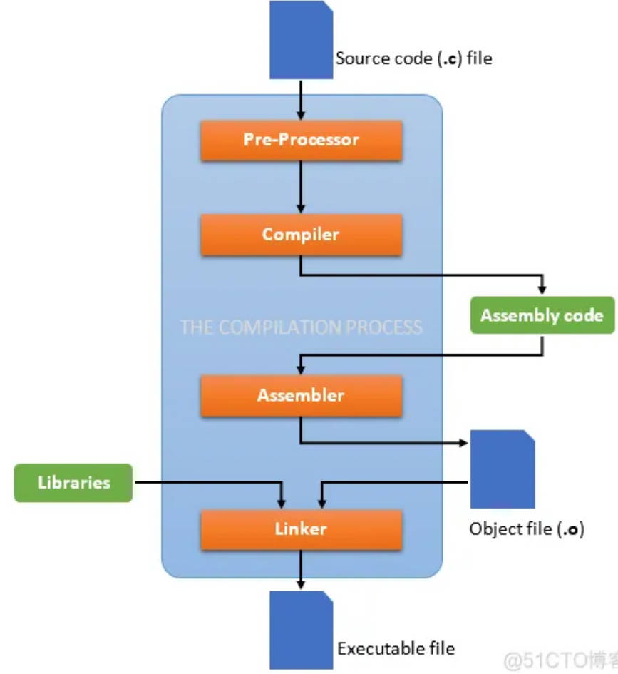 |
| -------------------------------------------------------- | -------------------------------------------------------- |
| 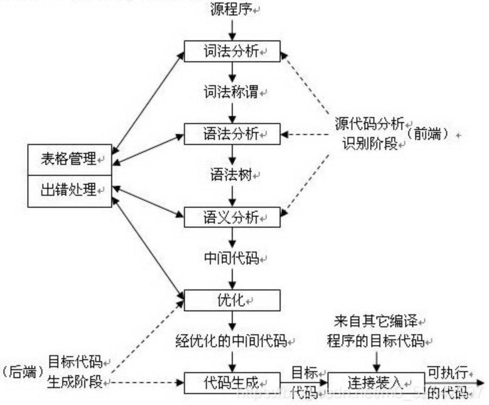 | 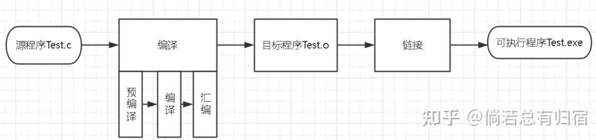 |
| 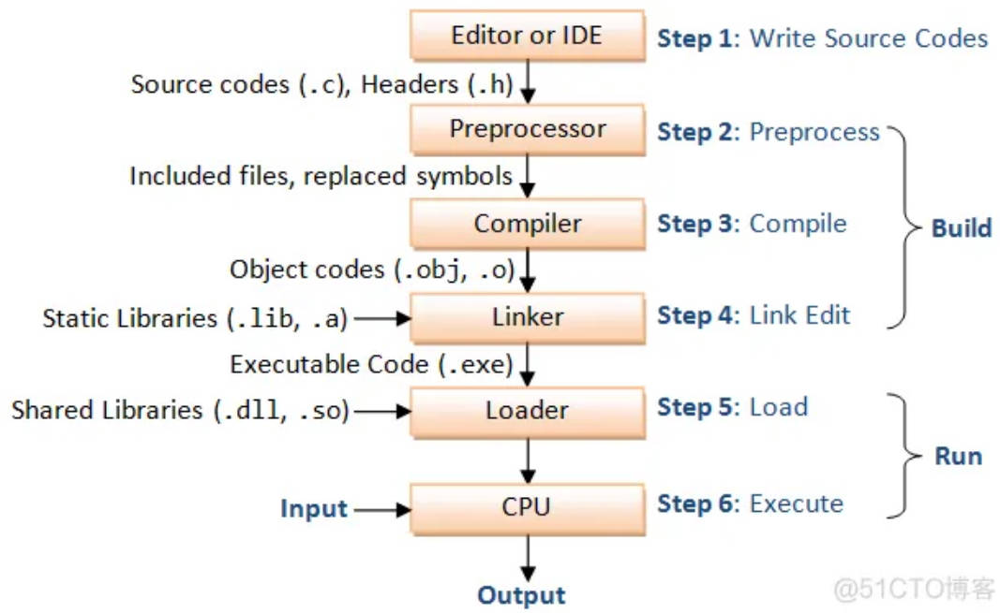 | 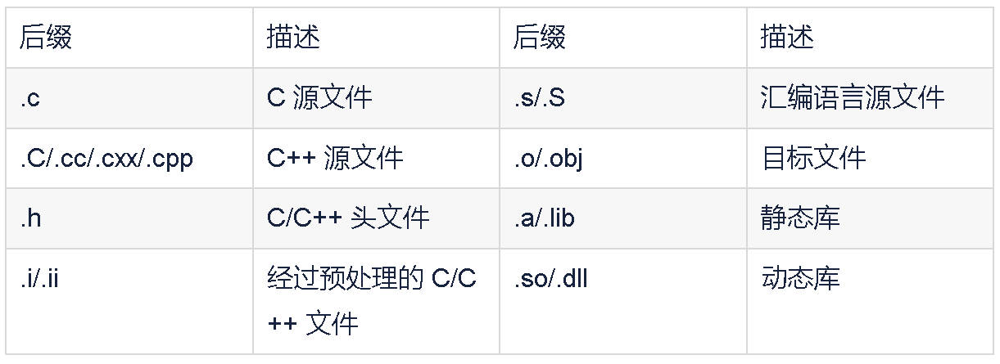 |

## make_makefile, cmake, qmake

[CMake教程](https://zhuanlan.zhihu.com/p/534439206)   [好： make, makefile, cmake, qmake ](https://www.zhihu.com/question/27455963/answer/89770919) 

[makefile教程](https://www.bilibili.com/video/BV1vTV2z3Eyp/?vd_source=7346303e5e18677d7261c2c0c109ecfd)	

- gcc: GNU Compiler Collection（就是GNU[编译器套件](https://www.zhihu.com/search?q=编译器套件&search_source=Entity&hybrid_search_source=Entity&hybrid_search_extra={"sourceType"%3A"answer"%2C"sourceId"%3A89770919})），也可以简单认为是编译器
  - 当程序只有一个源文件时，直接就可以用gcc命令编译它
- 当程序包含==很多源文件== 时，用gcc命令==逐个编译==时，容易混乱而且工作量大, 所以出现了 `make工具`  **批量编译**
  - make工具可以看成是一个智能的批处理工具，本身并没有编译和链接的功能，而是用类似于[批处理](https://www.zhihu.com/search?q=批处理&search_source=Entity&hybrid_search_source=Entity&hybrid_search_extra={"sourceType"%3A"answer"%2C"sourceId"%3A89770919})的方式 — 通过 `调用makefile文件` 中用户指定的命令来进行编译和链接的
  - make 工具 根据makefile中的命令进行编译和链接
  - makefile命令中 包含了调用gcc（也可以是别的编译器）去 `编译某个源文件的命令`
- 工程大的时候，==手写makefile也很麻烦==， 出现了 Cmake 工具
  - cmake 可以 ==更简单的生成makefile文件== 给make用。当然cmake还有其他功能，就是可以跨平台生成对应平台能用的makefile
  - cmake 根据 `CMakeLists.txt`文件（学名：[组态档](https://www.zhihu.com/search?q=组态档&search_source=Entity&hybrid_search_source=Entity&hybrid_search_extra={"sourceType"%3A"answer"%2C"sourceId"%3A89770919})）去生成makefile
  - `CMakeLists.txt`文件要自己手写
- qmake
  - Qt专有的moc编译器（The Meta-Object Compiler）和[uic编译器](https://www.zhihu.com/search?q=uic编译器&search_source=Entity&hybrid_search_source=Entity&hybrid_search_extra={"sourceType"%3A"answer"%2C"sourceId"%3A89770919})（User Interface Complier）， 对Qt源文件进行预处理
  - [makefile文件](https://www.zhihu.com/search?q=makefile文件&search_source=Entity&hybrid_search_source=Entity&hybrid_search_extra={"sourceType"%3A"answer"%2C"sourceId"%3A89770919}) 没办法对qt源文件进行预处理。qmake就产生了
  - qmake工具用来`生成Qt 专用makefile文件`，这种makefile文件就能自动智能调用moc和uic对源程序进行预处理和编译

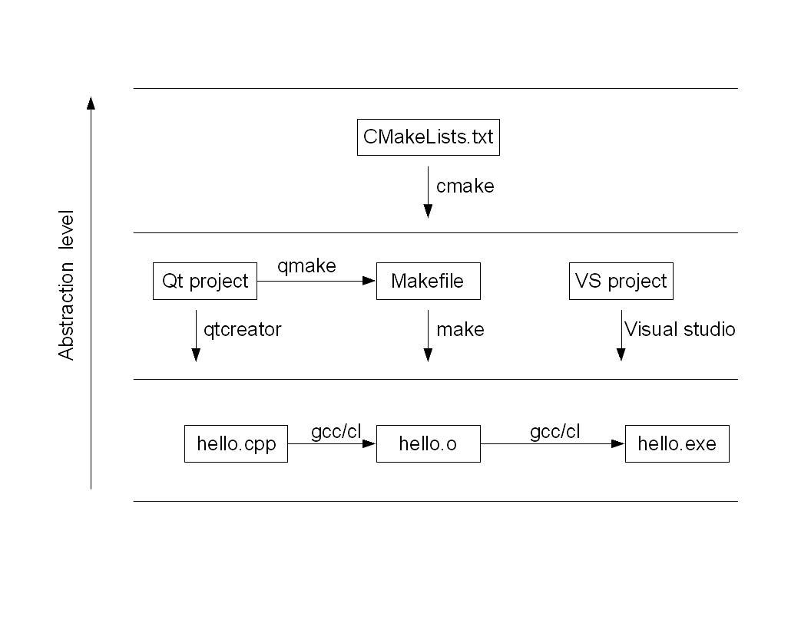

## gcc

[好：gcc执行过程](https://blog.csdn.net/liuxingyuzaixian/article/details/125979677)	[GCC编译过程及静态链接库和动态链接库](https://blog.csdn.net/f2157120/article/details/102811425)	   [gcc执行](https://blog.csdn.net/weixin_47826078/article/details/120474122)	 [gcc test.c &&_百度搜索](https://www.baidu.com/s?ie=UTF-8&wd=gcc%20test.c%20%26%26)	

[GCC, the GNU Compiler Collection - GNU Project](https://gcc.gnu.org/) 

[gcc说明](https://www.zhihu.com/search?hybrid_search_extra=%7B%22sourceType%22%3A%22answer%22%2C%22sourceId%22%3A89770919%7D&hybrid_search_source=Entity&q=%E7%BC%96%E8%AF%91%E5%99%A8%E5%A5%97%E4%BB%B6&search_source=Entity&type=content)   [GCC参数详解|菜鸟教程](https://www.runoob.com/w3cnote/gcc-parameter-detail.html)	

[gcc 命令详解](https://www.cnblogs.com/zhangjxblog/p/7776551.html)   [gcc 命令详解及最佳实践](https://blog.51cto.com/u_11767891/5533097)   [gcc命令](https://zhuanlan.zhihu.com/p/698659528) [GCC常用命令](https://blog.csdn.net/txmnQAQ/article/details/120654273)   [GCC 常用命令](https://blog.csdn.net/TyearLin/article/details/130201720)  

- GCC 原本作为 GNU 操作系统的官方编译器，现已被大多数类 Unix 操作系统（如Linux、BSD、Mac OS X等）采纳为标准的编译器，GCC 同样适用于微软的Windows。GCC 是自由软件过程发展中的著名例子，由自由软件基金会以 GPL 协议发布
  - g++是gcc的c++编译器,  c语言的编译器程序名叫gcc
- Windows下比较流行的GCC移植版主要有三个，他们是 ==MinGW，Cygwin 和 Djgpp== 

```c
// gcc 不指定目标文件名时默认生成的可执行文件名为 a.out(linux) 或 a.exe(windows)。
// gcc [源文件名] -o [目标文件名]
```


| 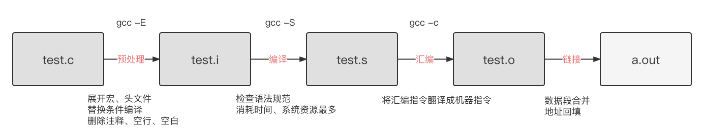 | 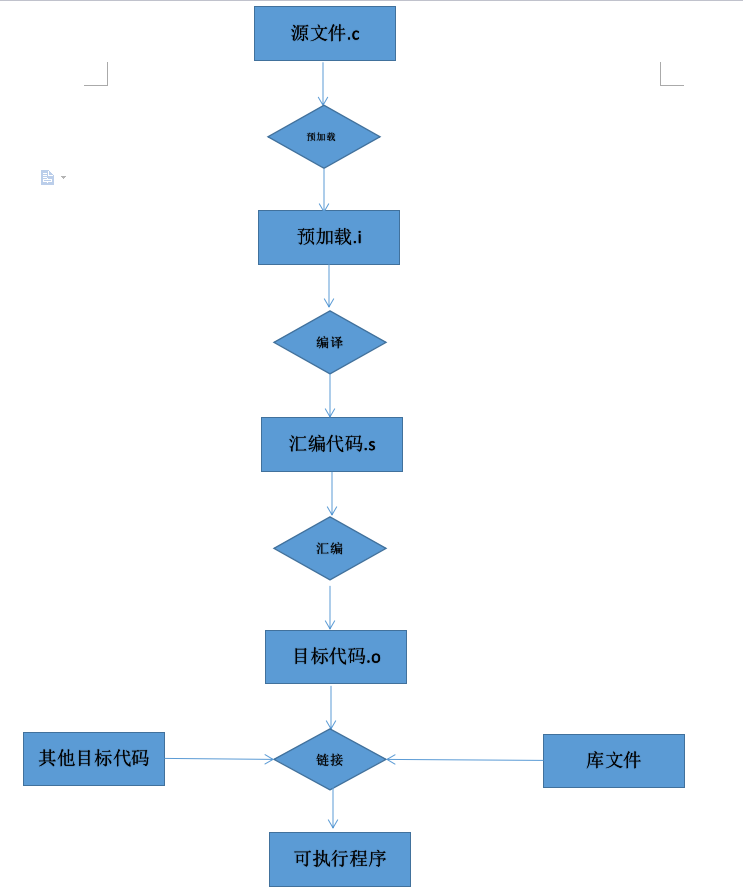 |
| ------------------------------- | -------------------------------- |


# 基本语法


## 打印

[C语言占位符](https://www.jb51.net/article/284296.htm)   [C占位符](https://cloud.tencent.com/developer/article/1888086)  [c占位符](https://www.cnblogs.com/guanliyang/p/3635426.html)  [C占位符](https://blog.csdn.net/qq_58602552/article/details/136675540)  [c占位符_百度搜索](https://www.baidu.com/s?ie=UTF-8&wd=c%E5%8D%A0%E4%BD%8D%E7%AC%A6) 

| 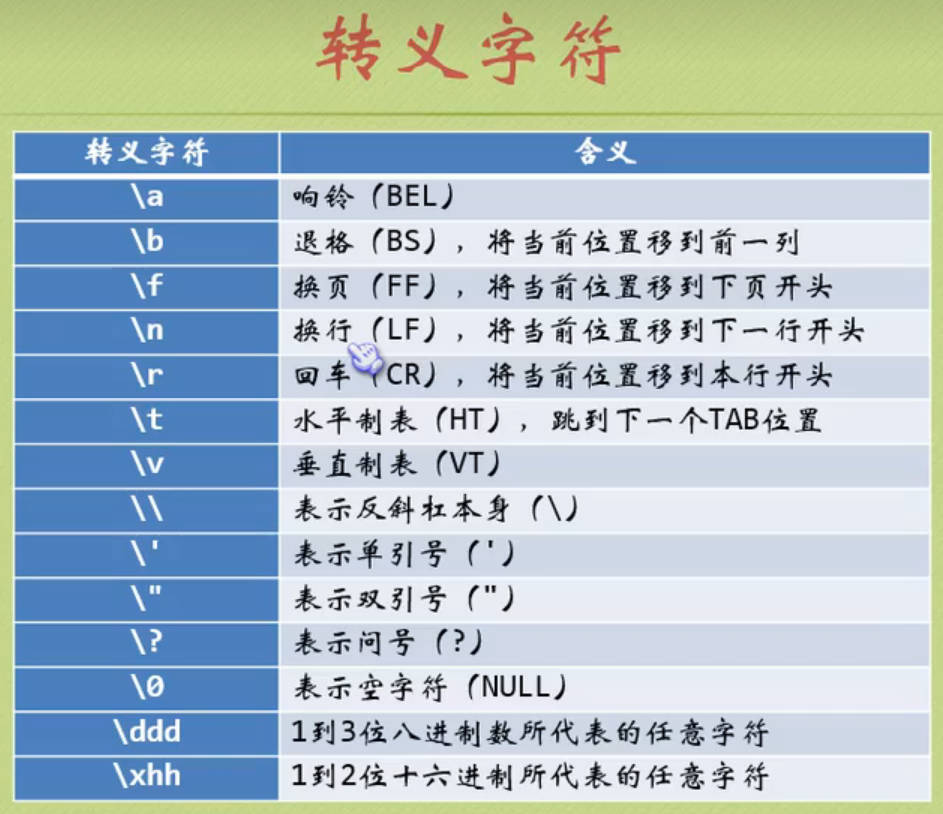 | 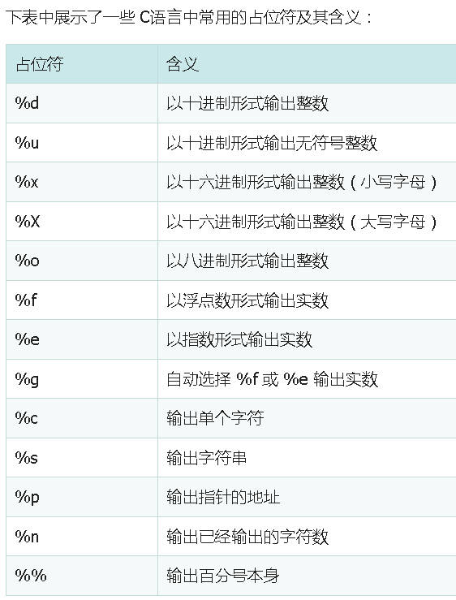 |
| -------------------------------------------------------- | -------------------------------------------------------- |


## 主函数

主函数参数

==visual studio编译和执行==: 

- 编译： 生成 -> 生成解决方案
- 运行： 调试 -> 开始执行(不调试)

| 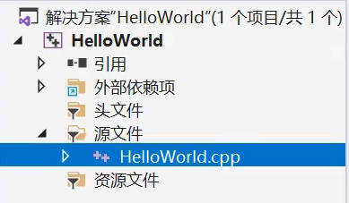 | 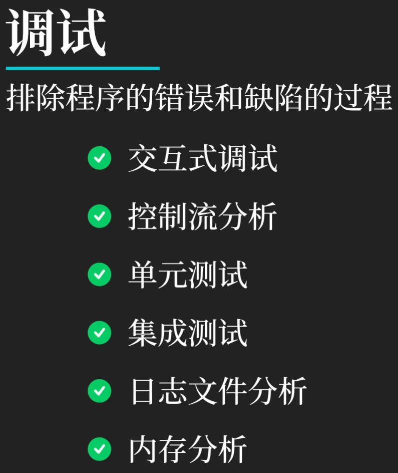 |
| -------------------------------------------------------- | -------------------------------------------------------- |

主函数返回值必须为int,调用成功 0

```c++
//预处理器指令,用来引入头文件
# include <studio.h>
    
// 返回值类型 函数名（参数）
int main(){
    printf("Hello World\n")
    return 0;
}
```

[函数声明和定义_百度搜索](https://www.baidu.com/s?ie=UTF-8&wd=%E5%87%BD%E6%95%B0%E5%A3%B0%E6%98%8E%E5%92%8C%E5%AE%9A%E4%B9%89)   [函数的定义声明以及调用](https://blog.csdn.net/Phofomy/article/details/134175957) 

**函数声明** : 包括函数类型、函数名和参数列表;  在代码中提前告诉编译器有一个函数存在的语句

`int sum(int a, int b)` 

**函数定义**

```c
int sum(int a, int b) {
    int result = a + b;
    return result;
}
```

## 常量变量

[变量是地址还是值_百度搜索](https://www.baidu.com/s?ie=UTF-8&wd=%E5%8F%98%E9%87%8F%E6%98%AF%E5%9C%B0%E5%9D%80%E8%BF%98%E6%98%AF%E5%80%BC)   [理解Python的变量](https://www.zhihu.com/question/428086848/answer/3125883138)  

[变量是内存地址的名字_百度搜索](https://www.baidu.com/s?ie=utf-8&f=8&rsv_bp=1&tn=baidu&wd=%E5%8F%98%E9%87%8F%E6%98%AF%E5%86%85%E5%AD%98%E5%9C%B0%E5%9D%80%E7%9A%84%E5%90%8D%E5%AD%97&oq=%25E5%258F%2598%25E9%2587%258F%25E6%2598%25AF%25E5%259C%25B0%25E5%259D%2580%25E8%25BF%2598%25E6%2598%25AF%25E5%2580%25BC&rsv_pq=ffdb95a602ff5d12&rsv_t=cdbfk%2FkYpO07lW7PPAYJ%2BR25bu9T2cWpjq2JpyM68ucDpBx2J5Xd2KWaGbE&rqlang=cn&rsv_enter=1&rsv_dl=tb&rsv_sug3=14&rsv_sug1=11&rsv_sug7=100&rsv_sug2=0&rsv_btype=t&inputT=6139&rsv_sug4=7733) 

> - 大多数现代编程语言中，当我们谈论变量时，我们主要关注的是它们存储的值，而不是它们在内存中的地址。然而，有些语言（如C和C++）允许程序员直接操作内存地址，通过指针来实现。
> - 在底层，变量通常是通过内存地址来引用的。内存地址是计算机内存中每个存储单元的唯一标识符, 我们很少直接处理内存地址，因为这样做既复杂又容易出错。理解变量在内存中有一个位置（即地址）是很重要的，特别是当我们讨论指针、引用和内存管理时
> - 在其他语言中，如Java、Python等，虽然程序员不直接操作内存地址，但变量背后的机制仍然涉及到内存地址。例如，在Java中，对象是通过引用来传递的，这些引用在底层可以看作是对象的内存地址的抽象。但是，从Java程序员的视角来看，他们操作的是对象的引用（类似于地址的抽象），而不是直接操作内存地址
> - 因此，可以说变量在概念上与值和地址都相关，但具体取决于我们如何定义和使用它们。在高级编程中，我们主要关注变量的值，而在需要直接操作内存或进行底层优化时，我们才会关注变量的地址
>
> 
>
> *变量就是一个存储数据的时候当前数据所在的内存地址的名字而已*。  *变量,其实是内存地址的一个抽像名字*
>
> 从本质上讲，变量就是在程序中保存用户数据的一块内存空间，而变量名就是这块内存空间的地址;  通过变量名，程序员可以方便地引用和操作存储在内存中的数据。变量的使用解决了直接通过内存地址访问数据的问题，因为内存地址难以记忆且随机分配，而变量名则提供了一个更易于理解和使用的标识符
>
> 
>
> 变量名 实际上是指向内存中特定位置的指针，它使得程序员可以通过这个名字来读写数据，而不需要直接操作内存地址; 
>
> 
>
> 此外，变量的类型和作用域决定了其在内存中的存储位置和可访问性。例如，在[C语言](https://www.baidu.com/s?sa=re_dqa_generate&wd=C语言&rsv_pq=9fc5485002ed98dc&oq=变量是内存地址的名字&rsv_t=71f5GWu/iC5ZNXtdG67lZ+b9NH9VY2+kqGWNwfNtMf1EWmxHe04n4tJSaOc&tn=baidu&ie=utf-8)中，变量可以根据其作用域分为[局部变量](https://www.baidu.com/s?sa=re_dqa_generate&wd=局部变量&rsv_pq=9fc5485002ed98dc&oq=变量是内存地址的名字&rsv_t=71f5GWu/iC5ZNXtdG67lZ+b9NH9VY2+kqGWNwfNtMf1EWmxHe04n4tJSaOc&tn=baidu&ie=utf-8)和[全局变量](https://www.baidu.com/s?sa=re_dqa_generate&wd=全局变量&rsv_pq=9fc5485002ed98dc&oq=变量是内存地址的名字&rsv_t=71f5GWu/iC5ZNXtdG67lZ+b9NH9VY2+kqGWNwfNtMf1EWmxHe04n4tJSaOc&tn=baidu&ie=utf-8)，根据存储方式可以分为[静态存储](https://www.baidu.com/s?sa=re_dqa_generate&wd=静态存储&rsv_pq=9fc5485002ed98dc&oq=变量是内存地址的名字&rsv_t=71f5GWu/iC5ZNXtdG67lZ+b9NH9VY2+kqGWNwfNtMf1EWmxHe04n4tJSaOc&tn=baidu&ie=utf-8)和[动态存储](https://www.baidu.com/s?sa=re_dqa_generate&wd=动态存储&rsv_pq=9fc5485002ed98dc&oq=变量是内存地址的名字&rsv_t=71f5GWu/iC5ZNXtdG67lZ+b9NH9VY2+kqGWNwfNtMf1EWmxHe04n4tJSaOc&tn=baidu&ie=utf-8)，这些分类进一步细化了变量的使用方式和生命周期。
>
> 综上所述，变量不仅是内存地址的名字，它还提供了数据的一种抽象表示，使得编程更加直观和易于管理。通过给内存中的数据块分配一个易于记忆和使用的名称，变量极大地简化了程序设计和数据操作的过程‌


- 声明变量: `int n;`  数据类型 + 标识符 + 分号

- 字符常量由单引号包括： `'a' '1'` ,字符串双引号包括
  - ==符号常量==：称为宏定义， c语言代码中，所有标识符`替换为后面的常量`   `#define 标识符 常量`
    - 用来命名多次使用的常量   [存储数据的常量与变量](https://zhuanlan.zhihu.com/p/47312168) 
    - 符号常量使用前必须先定义
    
  - `#`号开头的为预处理命令
  
- pringtf("占位1 占位2", 替换1,替换2);   变参函数，第一个参数是字符串，是需要输出的内容
- scanf() 输入
- 整型在计算机存储方式为，补码表示法     [进制的模](https://www.baidu.com/s?ie=utf-8&f=3&rsv_bp=1&tn=baidu&wd=%E8%BF%9B%E5%88%B6%E7%9A%84%E6%A8%A1&oq=%25E8%25BF%259B%25E5%2588%25B6%2520%25E6%25A8%25A1&rsv_pq=b058ab2700193476&rsv_t=70893fgCSlBbfewSWTBzJWDNYqtZ1R7zBGSYyM985KJ96E%2FsYVU1OAFxKxk&rqlang=cn&rsv_enter=1&rsv_dl=ts_0&rsv_sug3=7&rsv_sug1=8&rsv_sug7=100&rsv_sug2=0&rsv_btype=t&prefixsug=%25E8%25BF%259B%25E5%2588%25B6%25E6%25A8%25A1%25E8%25BF%2590%25E7%25AE%2597&rsp=0&inputT=5866&rsv_sug4=8533)  
  - **进制的模**: 逢X进一位，‌这里的X就是进制的基数。‌例： 十进制的模为10， 十六进制的模为16
- 类型转换

| 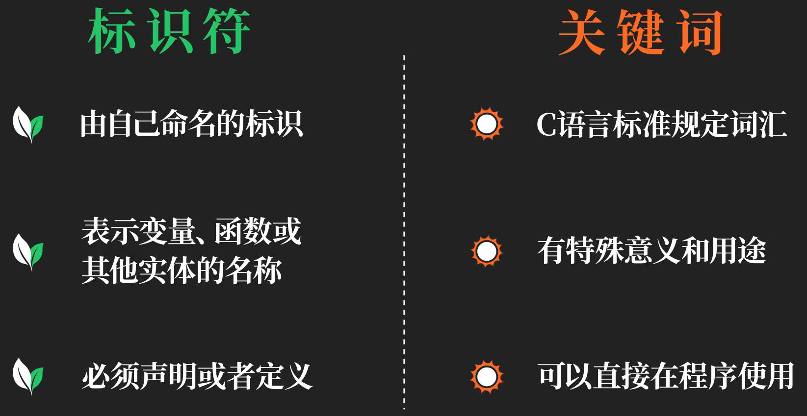  | 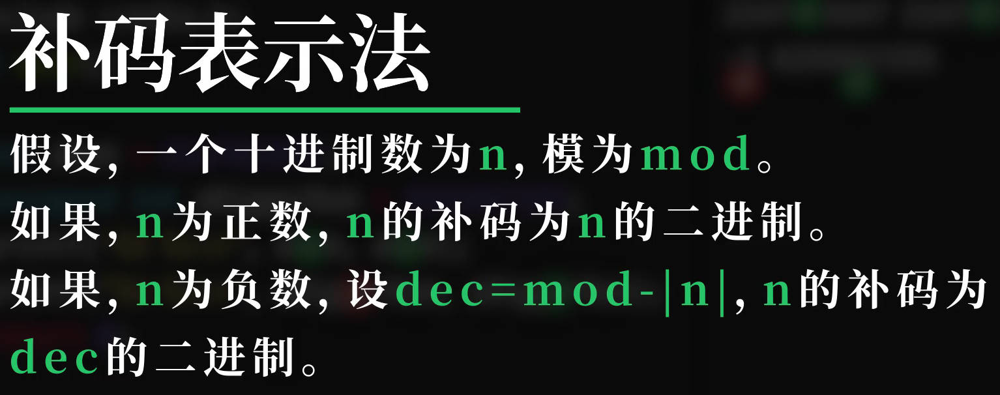 |
| --------------------------------------------------------- | -------------------------------------------------------- |
| I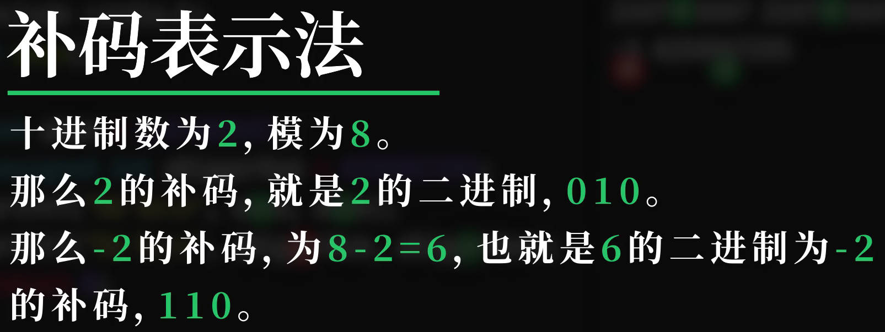 | 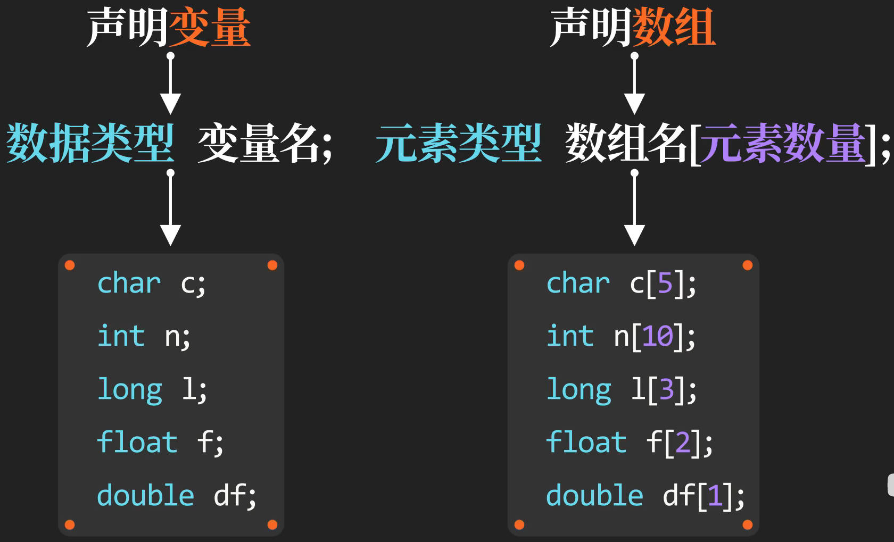 |
| 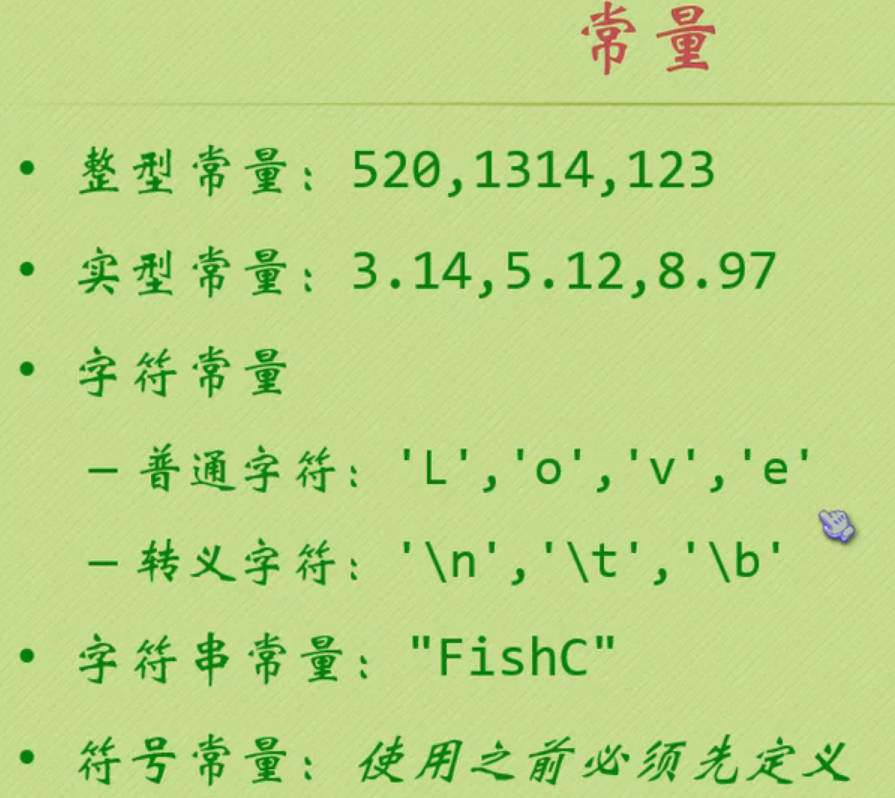  | 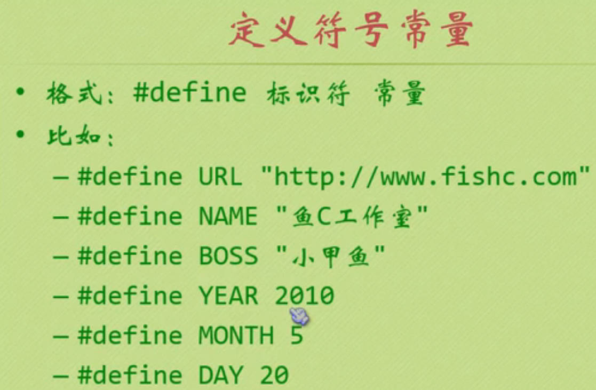 |
| 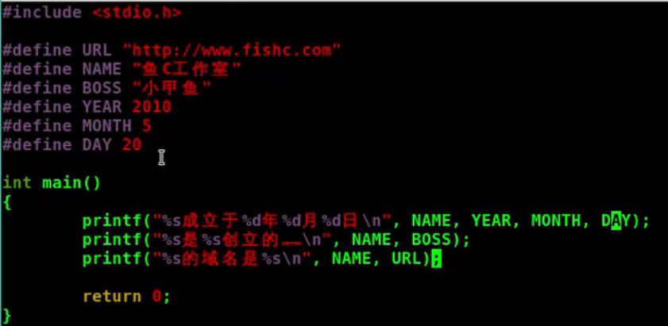  |                                                          |

### ==符号常量==

[符号常量和普通常量区别_百度搜索](https://www.baidu.com/s?ie=UTF-8&wd=%E7%AC%A6%E5%8F%B7%E5%B8%B8%E9%87%8F%E5%92%8C%E6%99%AE%E9%80%9A%E5%B8%B8%E9%87%8F%E5%8C%BA%E5%88%AB)   [符号常量是不是宏_百度搜索](https://www.baidu.com/s?ie=utf-8&f=8&rsv_bp=1&tn=baidu&wd=%E7%AC%A6%E5%8F%B7%E5%B8%B8%E9%87%8F%E6%98%AF%E4%B8%8D%E6%98%AF%E5%AE%8F&oq=%25E7%25AC%25A6%25E5%258F%25B7%25E5%25B8%25B8%25E9%2587%258F%25E5%2592%258C%25E6%2599%25AE%25E9%2580%259A%25E5%25B8%25B8%25E9%2587%258F%25E5%258C%25BA%25E5%2588%25AB&rsv_pq=ab18ce8b006b419c&rsv_t=8c07s5LjTcarQGbtl4A%2FiG5MW2y43ophDi2L1BxDdIVVRKD%2BNE5X9RbH2lQ&rqlang=cn&rsv_enter=1&rsv_dl=tb&rsv_sug3=19&rsv_sug1=10&rsv_sug7=100&rsv_sug2=0&rsv_btype=t&inputT=7552&rsv_sug4=7552)  

==标识符==是程序中变量、函数、数组等的名字。标识符由字母（大写或小写）、数字和下划线组成，但第一个字符必须是字母或下划线，不能是数字。 

- ‌**定义方式**‌：普通常量（直接常量或字面常量）包括整型常量、实型常量和字符常量，它们在代码中直接给出具体的数值或字符。例如，整型常量如12、0、-3，实型常量如4.6、-1.23，字符常量如‘a’、‘b’。而符号常量是通过预处理指令`#define`定义的，它使用一个标识符来表示一个常量值，一旦定义，程序中所有出现该标识符的地方都将被替换为该常量值。例如，`#define PI 3.14159`定义了一个符号常量PI，其值为3.14159‌12。
- ‌**使用方式**‌：普通常量在代码中直接使用，而符号常量的使用方式是在定义之后，通过标识符（在这个例子中是PI）来引用该常量值。符号常量的一个重要优点是，如果需要在程序的多个地方改变这个常量的值，只需要修改定义处，而无需在每个使用的地方进行修改，这被称为“一改全改”‌3。
- ‌**内存占用情况**‌：==符号常量不占用内存空间==，因为在编译时，编译器会将符号常量的所有实例替换为定义的值。这意味着符号常量在内存中没有独立的存储位置，而是直接由其定义的值替代。相比之下，普通常量在内存中有其具体的存储位置，其值在程序运行期间不能改变‌3。

总的来说，符号常量提供了一种更灵活且易于管理的方式来定义和使用常量值，特别是在需要频繁修改常量值的情况下。同时，通过预处理指令的定义方式，符号常量能够在编译时进行优化，有助于提高代码的可读性和可维护性‌


## ==字符串==

[查表原理](https://www.baidu.com/s?ie=utf-8&f=8&rsv_bp=1&tn=baidu&wd=%E6%9F%A5%E8%A1%A8%E5%8E%9F%E7%90%86&oq=ascii%25E7%2594%25A8%25E7%259A%2584%25E6%2598%25AF%25E6%259F%25A5%25E8%25A1%25A8%25E5%258E%259F%25E7%2590%2586&rsv_pq=ee55f26e0140bb00&rsv_t=3f01dNVj5wyONDZvb0CARoXMyzUSb%2FZeIJ6cG2T7jm%2B1OXvPPgnXAiBSRVg&rqlang=cn&rsv_enter=1&rsv_dl=tb&bs=ascii%E7%94%A8%E7%9A%84%E6%98%AF%E6%9F%A5%E8%A1%A8%E5%8E%9F%E7%90%86)    [查表法](https://www.baidu.com/s?ie=utf-8&f=8&rsv_bp=1&tn=baidu&wd=ascii%E7%94%A8%E7%9A%84%E6%98%AF%E6%9F%A5%E8%A1%A8%E5%8E%9F%E7%90%86&oq=ascii%25E7%2594%25A8%25E7%259A%2584%25E6%2598%25AF%25E6%259F%25A5%25E8%25A1%25A8%25E5%258E%259F%25E7%2590%2586&rsv_pq=ca99628e0295289a&rsv_t=383eVrmJ5IEKUJrMWo5Akd%2BRQJYMvCM8f8rX79R234cKDcgdjv1YO%2BNDK5c&rqlang=cn&rsv_enter=1&rsv_dl=tb&rsv_sug3=3&rsv_sug1=2&rsv_sug7=100&rsv_n=2&bs=ascii%E7%94%A8%E7%9A%84%E6%98%AF%E6%9F%A5%E8%A1%A8%E5%8E%9F%E7%90%86) 

- 单引号表示字符,占1字节，双引号字符串
- 结尾用空字符表示字符串结束  `\0`
- 字符串用的是查表原理： ascii
  - **查表原理**‌主要涉及到将数据预先存储在表中，通过查找表中的记录来获取所需的数据
  - *查表法的原理是利用空间换时间的思想*。通常情况下,计算机的查找操作的时间复杂度较低,而计算操作的时间复杂度较高；  因此，通过提前计算并存储结果，可以大幅度减少计算操作的时间，从而提高程序的运行效率。

| 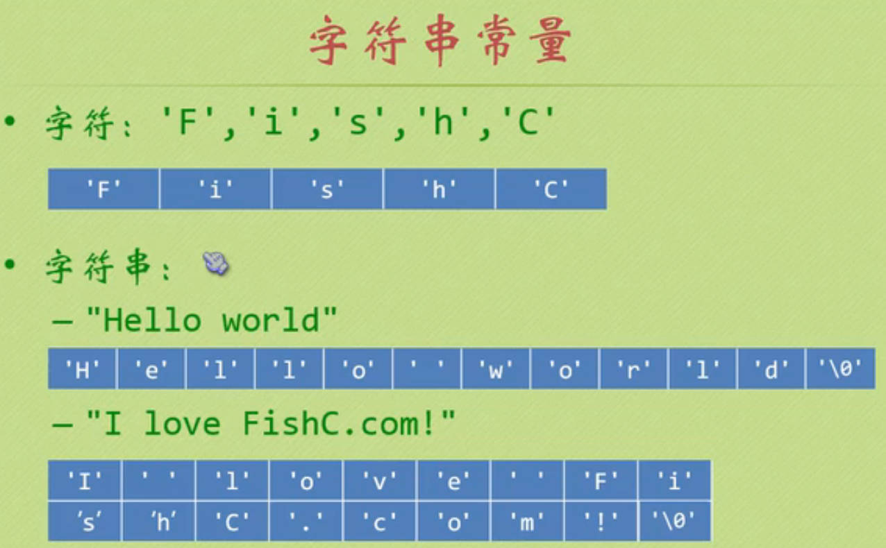 | 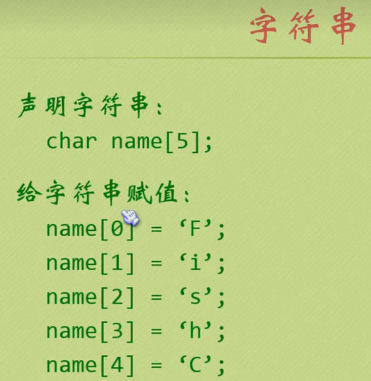 |
| -------------------------------------------------------- | -------------------------------------------------------- |
| 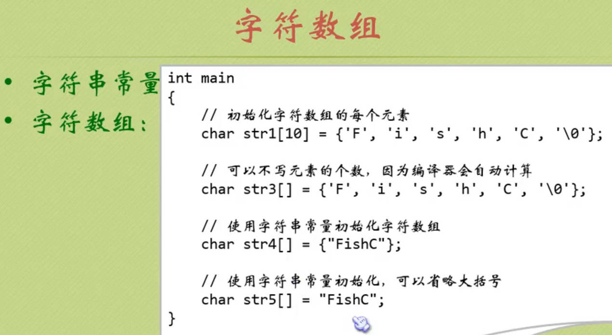 | 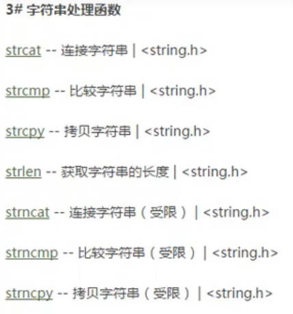 |

C 语言没有字符串类型，字符串实际上是使用空字符 `\0` 结尾的一维字符数组。因此，`\0` 是用于标记字符串的结束

## 运算符

[异或_xor](https://baike.baidu.com/item/%E5%BC%82%E6%88%96/10993677?fr=ge_ala)  [异或运算（XOR）](https://cloud.tencent.com/developer/article/2097112)  [xor_百度搜索](https://www.baidu.com/s?ie=UTF-8&wd=xor)   

[移位运算——左移运算、右移运算、无符号右移](https://www.bilibili.com/video/BV1i14y1W7aF/?vd_source=7346303e5e18677d7261c2c0c109ecfd) 

[win7计算器](https://zhidao.baidu.com/question/501133702516498852.html)  [计算器](https://blog.csdn.net/2401_85828611/article/details/140962661)  [Windows计算器使用详解](https://blog.csdn.net/weixin_34087301/article/details/85840055)  [Microsoft数学求解器-数学问题求解器和计算器](https://mathsolver.microsoft.com/zh)  [微软计算器应用安装与配置完全指南](https://blog.csdn.net/gitblog_07562/article/details/142224267) 

- xor： 两个输入值不同时，异或运算输出为真（1），否则输出为假（0），即“同为 0，异为 1”
  - 也称为半加运算,相当于不带进位的二进制加法(==不进位加法==)

- RoL, RoR: 左旋和右旋操作，左旋会将最左边的位移动到最右边，右旋则相反

- LSH, RSH: 左移和右移，需要指定移动的位数。

## 数据类型

[C 数据类型|菜鸟教程](https://www.runoob.com/cprogramming/c-data-types.html)	 [C语言基本数据类型（short、int、long、char、float、double）](https://zhuanlan.zhihu.com/p/92649324) 

[使用补码的好处](https://fishc.com.cn/thread-67124-1-1.html)  

浮点数： [定点数：用二进制表示小数（#）](https://fishc.com.cn/thread-67211-1-1.html)    [浮点数：表示更大范围的小数（#）](https://fishc.com.cn/thread-67214-1-1.html) 

- signed带符号位，可以存负数
- 负数用补码： 绝对值、取反、加1；   补码的发明是为了表示带符号数（整型）
  - 正数的补码是其本身的二进制形式；负数的补码需要先将其绝对值按位取反，再 + 1。

| 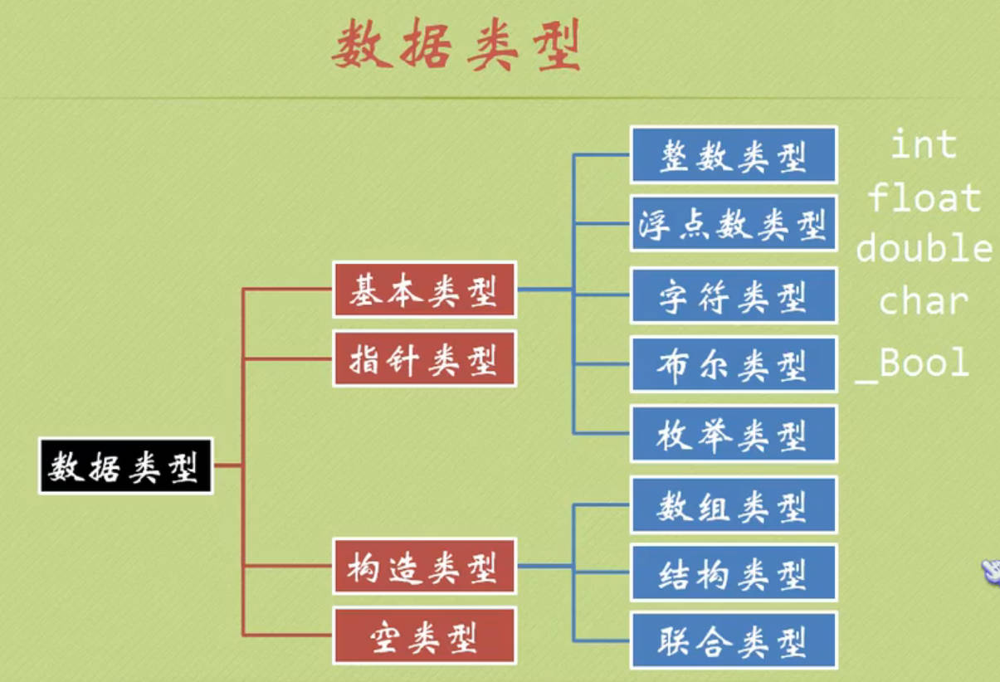 | 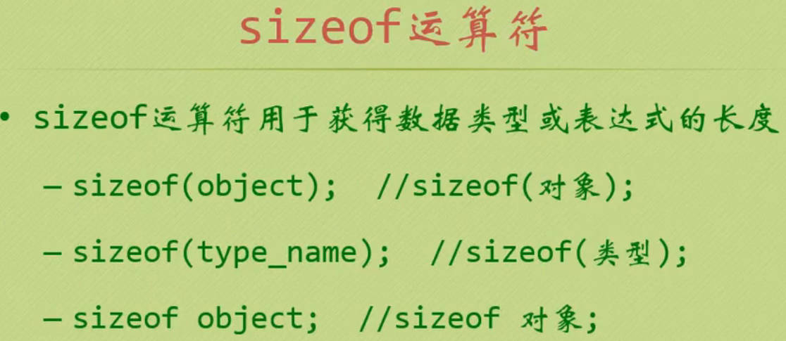     |
| -------------------------------------------------------- | ------------------------------------------------------------ |
| 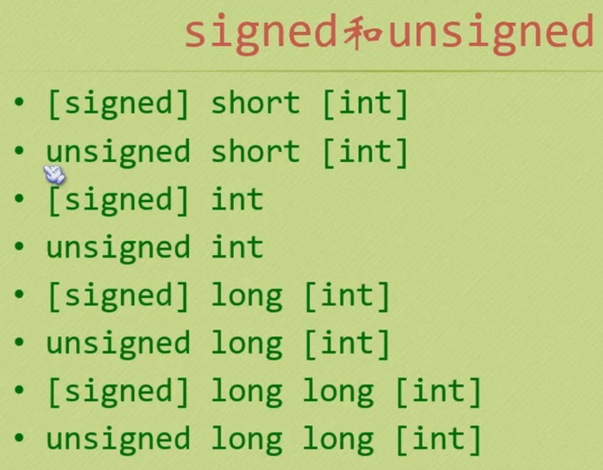 | 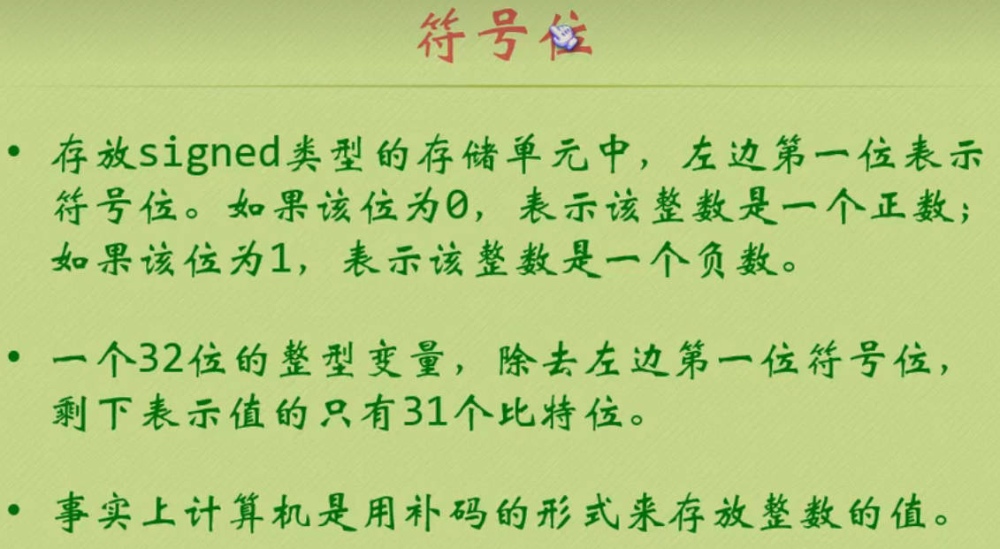     |
| 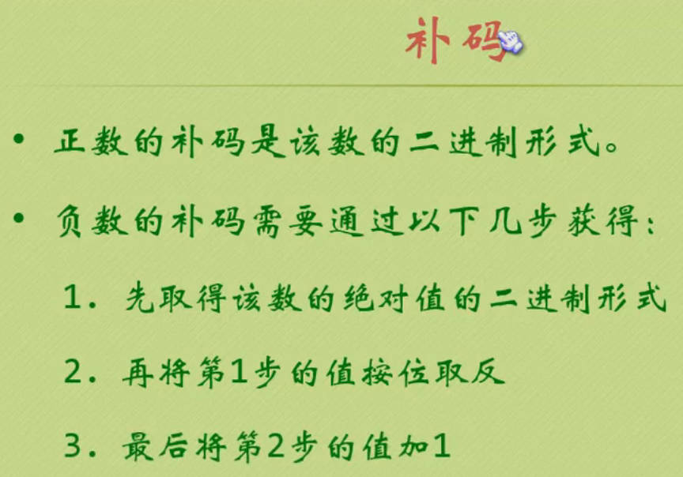 | 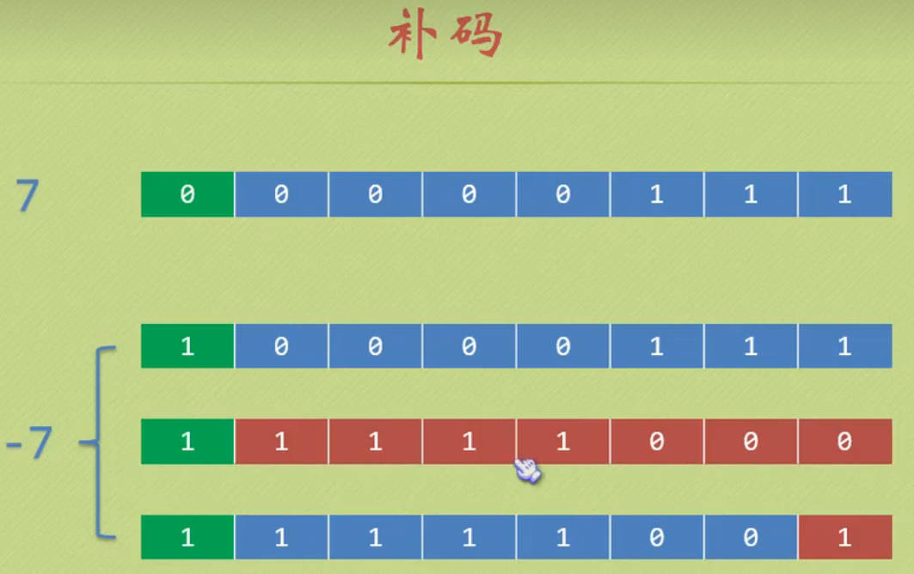     |
| 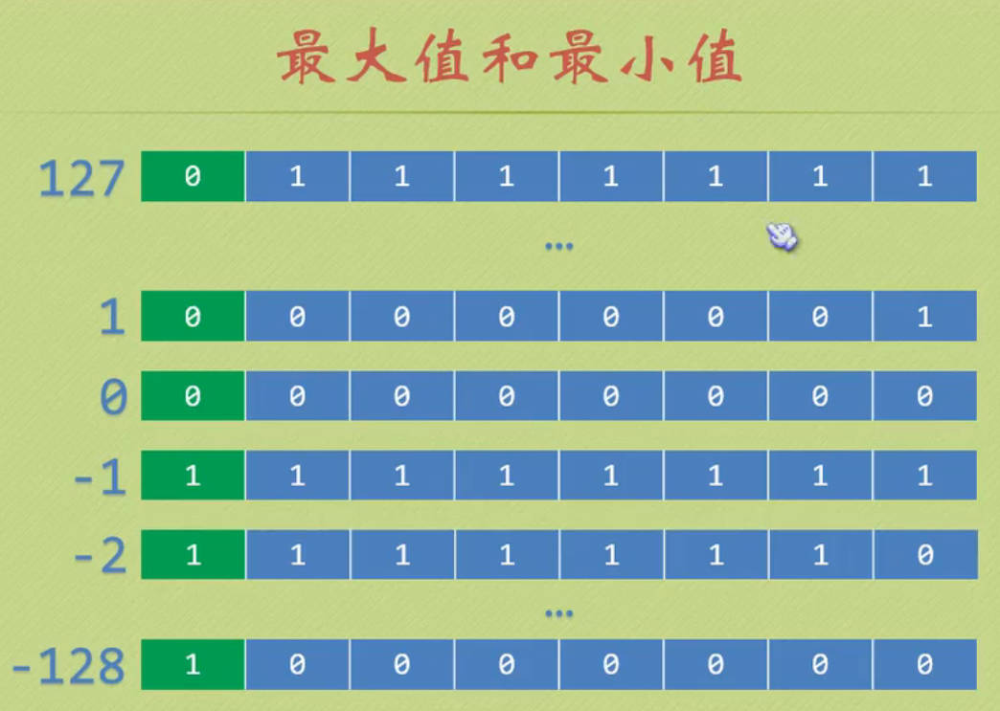 | 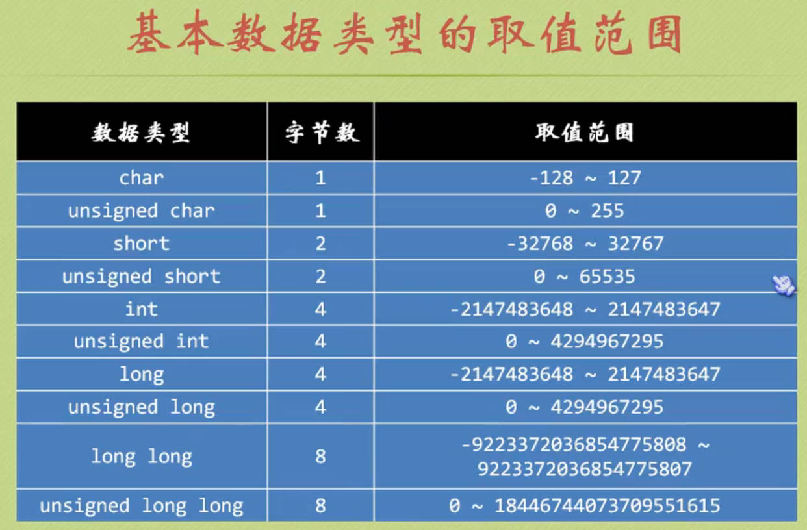 |
| 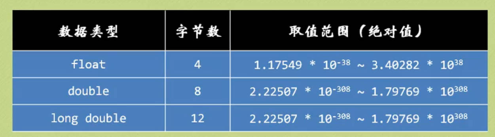 | 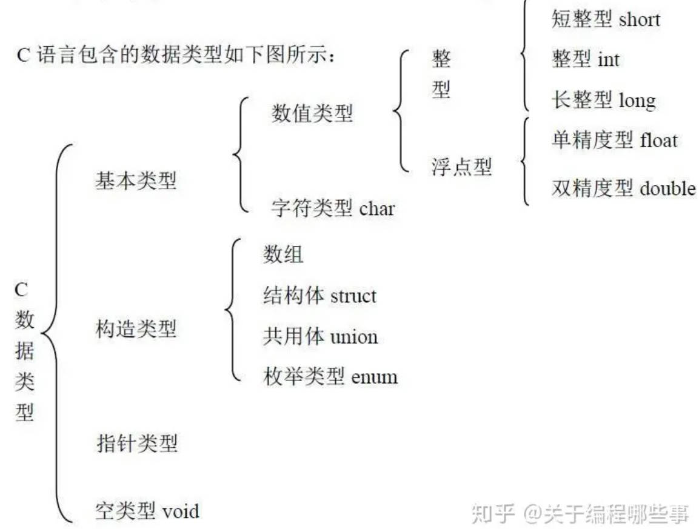     |


```c
#include <stdio.h>
int main()
{
    int i;
    char j;
    float k;
    i = 123;
    j = 'C';
    k = 3.14;

    printf("int:%d\n",sizeof(int));     //4字节
    printf("%d\n", sizeof(i));          //4字节
    printf("char:%d\n", sizeof(char));  //1字节
    printf("%d\n", sizeof(j));          //1字节
    printf("float:%d\n", sizeof(float));//4字节
    printf("%d\n", sizeof k); //4字节,对象可加括号也可不加
    
    printf("short:%d\n", sizeof(short));//字节:2
    printf("int:%d\n",sizeof(int));//字节:4
    printf("long:%d\n", sizeof(long));//字节:4
    printf("long long:%d\n", sizeof(long long));//字节:8

    printf("char:%d\n", sizeof(char));//字节:1
    printf("_Bool:%d\n", sizeof (_Bool));//字节:1
    printf("float:%d\n", sizeof(float));//字节:4
    printf("double:%d\n", sizeof(double));//字节:8
    printf("long double:%d\n", sizeof(long double));//字节:12
    return 0;
}
```


## C 存储类

[存储类别](https://www.bilibili.com/video/BV16jhWeMEen?p=48&vd_source=7346303e5e18677d7261c2c0c109ecfd) 

定义变量、函数的存储位置、生命周期和作用域；  放在修饰的类型之前

C 程序中可用的存储类： 

- auto：    自动变量，局部变量

- register
- static
- extern

## ==函数==类型

[__cdecl_百度百科](https://baike.baidu.com/item/__cdecl/9518056?fr=ge_ala) 

调用约定(Calling Convention) :  [函数调用的几种方式:__cdecl、__stdcall、__fastcall、__thiscall、__clrcall、__vectorcall](https://blog.csdn.net/weixin_43712770/article/details/126080701)    [函数命名规则及调用约定](https://blog.csdn.net/feixiang_john/article/details/7918427)   [函数名前面加__cdecl_百度搜索](https://www.baidu.com/s?ie=UTF-8&wd=%E5%87%BD%E6%95%B0%E5%90%8D%E5%89%8D%E9%9D%A2%E5%8A%A0__cdecl)  [关于函数调用方式__stdcall和__cdecl详解](https://www.jb51.net/article/93489.htm) 

[C 数据类型](https://www.runoob.com/cprogramming/c-data-types.html) 

- 基本数据类型
- 枚举类型
- void类型
- 派生类型

| 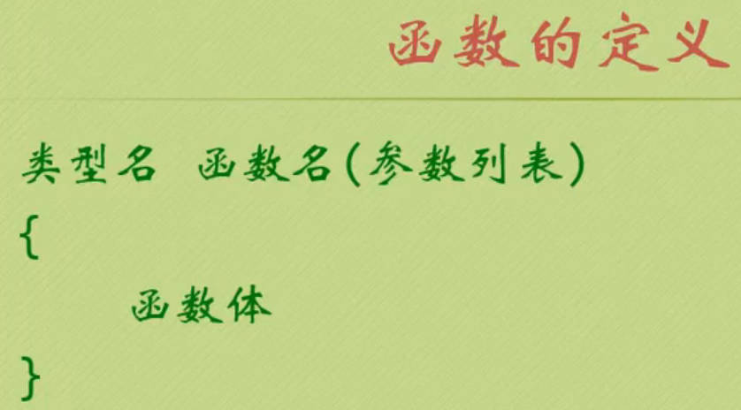 |  |
| -------------------------------------------------------- | -------------------------------------------------------- |
| 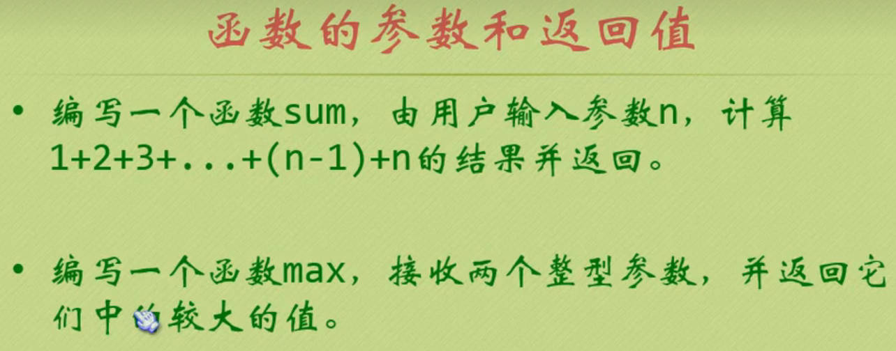 | 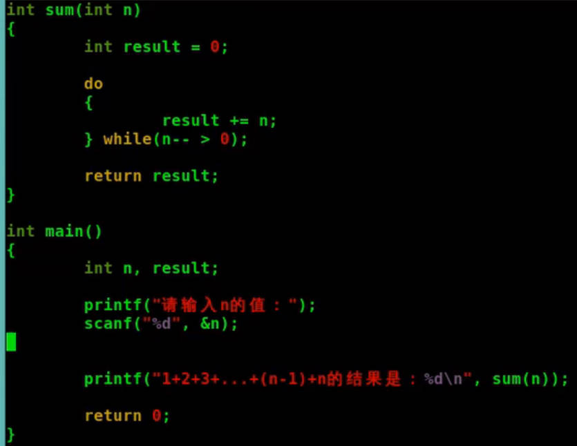 |
| 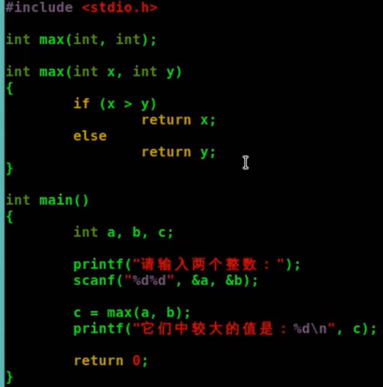 |                                                          |

[C 语言中函数声明、定义](https://blog.csdn.net/a12sj_/article/details/144430439)   [C语言函数声明的格式](https://c.biancheng.net/view/tttt8d3.html)		

- 函数声明： 不写也能执行，但定义写在调用后面不行    `void print_c();`声明要有分号
- 函数定义：  ==函数的类型==是函数的返回值
- 函数参数： ==函数接收用户传入的数据==, 要用参数

```c
#include <stdio.h>
void print_c();     //函数声明
void print_c(){     //函数定义
    printf("ccccccccccccccccccccc\n");
}

int main() {
    print_c();      //函数调用
    print_c();    
    print_c();
    return 0;
}	
```

### 参数和类型

值传递、引用传递

- ==传值和传址==
  - 指针也是一个变量，可以通过参数传给函数
  - ==每个函数有独立的作用域==, 研究main函数的值通过参数==传值和传址==的区别,变量只在函数内部生效，`函数之间不能直接访问对方的变量` 
  -  用指针可以穿越不同函数作用域： 只要是个东西，都要找位置存放，而指针存的就是别人的地址，有了指针，就可以访问局部变量
- ==传数组==：  实际上传递的只是数组的地址
- 可变参数

#### 传值和传址

```c
/*
In main,互换前：x=3,y=5
In swap,互换前：x=3,y=5
In swap,互换后：x=5,y=3
In main,互换后：x=5,y=3
*/
//传值是拷贝过去，在2个函数里是独立的
#include <stdio.h>
//传值和传址不同
//传指针，相当于把解引用后的值互换
void swap(int *x, int *y);
void swap(int *x, int *y){
    int temp;
    printf("In swap,互换前：x=%d,y=%d\n", *x, *y);
    temp = *x;
    *x = *y;
    *y = temp;
    printf("In swap,互换后：x=%d,y=%d\n", *x, *y);
}

int main() {
    int x = 3, y = 5;
    printf("In main,互换前：x=%d,y=%d\n", x, y);
    swap(&x, &y);
    printf("In main,互换后：x=%d,y=%d\n", x, y);
    return 0;
}
```

#### 传数组

- 传数组不是把main函数里的数组拷贝到getArray函数里，如果是array[5]改变后会不一样，是相互独立的；但实际上传递的只是数组的地址

```c
#include <stdio.h>

void getArray(int array[10]);
void getArray(int array[10]) {
    int i;
    for(int i = 0; i < 10; i++) {
        printf("array[%d] = %d\n", i, array[i]);
    }
}

int main() {
    int array[10] = {1, 2, 3, 4, 5, 6, 7, 8, 9, 0};
    getArray(array);
    return 0;
}

//在main函数里再打印一次... 
//传数组不是把main函数里的数组拷贝到getArray函数里，如果是array[5]改变后会不一样，是相互独立的；但实际上传递的只是数组的地址
#include <stdio.h>

void getArray(int array[10]);
void getArray(int array[10]) {
    int i;

    array[5] = 520;

    for(int i = 0; i < 10; i++) {
        printf("array[%d] = %d\n", i, array[i]);
    }
}

int main() {
    int array[10] = {1, 2, 3, 4, 5, 6, 7, 8, 9, 0};
    int i;
    getArray(array);

    printf("在main函数里再打印一次...........\n");
    for(int i = 0; i < 10; i++) {
        printf("array[%d] = %d\n", i, array[i]);
    }
    return 0;
}

//数组a有40个字节，int4，10个元素； b只是传的数组地址，8字节
sizeof a: 40
sizeof b: 8
    
#include <stdio.h>
void getArray(int b[10]);
void getArray(int b[10]) {
    printf("sizeof b: %d\n", sizeof(b));
}

int main() {
    int a[10] = {1, 2, 3, 4, 5, 6, 7, 8, 9, 0};
    printf("sizeof a: %d\n", sizeof(a));
    getArray(a);
    return 0;
}
```


| 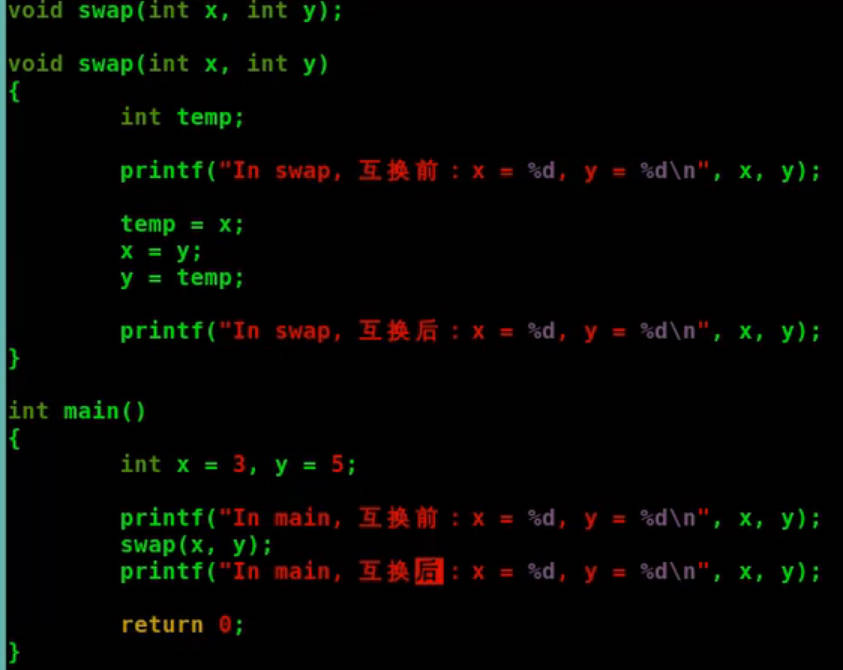 |  |
| ------------------------------------------------------------ | ------------------------------------------------------------ |
|      |      |

#### 可变参数

- 要包含一个头文件 `stdarg.h`

```c
#include <stdio.h>
#include <stdarg.h>
int sum(int n, ...);
int sum(int n, ...) {
    int i, sum = 0;
    //定义一个字符指针，对它进行计算
    va_list vap;        //用va_list 定义参数列表
    va_start(vap, n);   //初始化参数列表，n第一个参数
    for(int i = 0; i < n; i++) {
        sum = sum + va_arg(vap, int);   //获取后面每一个参数的值
    }
    va_end(vap);        //关闭参数列表
    return sum;
}

int main() {
    int result;
    result = sum(3, 1, 2, 3);
    printf("result = %d\n", result);

    result = sum(4, 5, 4, 2, 8);
    printf("result = %d\n", result);
    return 0;
}
```

### ==指针函数和函数指针==

[指针函数和函数指针](https://cloud.tencent.com/developer/article/2030119)   [函数指针和指针函数的用法](https://blog.csdn.net/huzhuohuan/article/details/134037470) 

- 指针函数: 指针函数==返回类型是某一类型的指针==
  - **返回值是一个地址值** 
  - 例子：函数要获取字符串，但没有类型定义字符串，用char类型指针来定义字符串，用它指定字符串第一个字符，因为字符串空字符结尾，知道第一个字符，就知道整个字符串
  - 局部变量作用域仅限函数内部

- ==函数指针==作为参数和返回值： ==指向函数的指针==
  - **指向一个函数**，main不直接调用函数，而是通过函数指针调用函数
  - 函数指针作为参数
    - `int (*p)(int, int)`， 指向的函数要满足2个int参数，返回值是int类型

  - 函数指针作为返回值
  
  - 函数指针变量可以作为某个函数的参数来使用的，**回调函数**就是一个通过函数指针调用的函数。  [函数指针与回调函数](https://www.runoob.com/cprogramming/c-fun-pointer-callback.html)	 


```c
#include <stdio.h>
//指针函数， 返回字符串首字母的地址
char *getWord(char c) {
    switch(c) {
    case 'A':
        return "Apple";
        break;
    case 'B':
        return "Banana";
        break;
    default:
        return "None";
    }
}

int main() {
    char input;
    printf("please input a number: ");
    scanf("%c", &input);
    printf("%s", getWord(input));
    return 0;
}
```


|      |  |
| ------------------------------------------------------------ | ------------------------------------------------------------ |
|  |      |
|      |      |
|      |                                                         |

函数指针   [(int *)_百度搜索](https://www.baidu.com/s?ie=UTF-8&wd=(int%20*))  [int*与(int*)的区别_int*和-CSDN博客](https://blog.csdn.net/awakewind/article/details/40717661)   [*(int *)&x](https://www.cnblogs.com/dingxingdi/p/17856594.html) 

- `(int *)` int型的指针 
- `*(int *)&x`   &x是x的地址，(int *)是把x的地址转换为int类型的指针，前面再加一个星号表示输出这个int指针的值。注意在内存中由于浮点数的储存形式，转换成int类型的指针的时候只取前四个字节，导致会输出一个很大的数

```c
#include <stdio.h>
int square(int);
int square(int num) {
    return num * num;
}
//通过函数指针调用函数
int main() {
    int num = 0;
    int (*p)(int);	//函数指针
    
    scanf("%d", &num);
    //函数名相当于函数的地址: 函数运算后得到函数的地址
    p = square;		//函数名运算后得到函数的地址，所以能等于指针
    
    printf("%d\n", (*p)(num));
    printf("%d", p(num));   //p是函数指针，这样写容易认为是函数名
    return 0;
}

//函数指针作为参数
#include <stdio.h>

int add(int, int);
int mul(int, int);
int cal(int (*p)(int, int), int, int);

int add(int num1, int num2) {
    return num1 + num2;
}
int mul(int num1, int num2) {
    return num1 * num2;
}
//int (*p)(int, int)， 指向的函数要满足2个int参数，返回值是int类型
int cal(int (*p)(int, int), int num1, int num2) {
    return (*p)(num1, num2);
}

int main() {
    printf("3 + 5 = %d\n", cal(add, 3, 5));
    printf("3 * 5 = %d\n", cal(mul, 3, 5));
    return 0;
}

//函数指针作为返回值,不好理解
#include <stdio.h>
int add(int, int);
int mul(int, int);
int calc(int (*)(int, int), int, int);
int (*select(char))(int, int);  //函数返回值是函数指针

//定义函数
int add(int num1, int num2) {
    return num1 + num2;
}
int mul(int num1, int num2) {
    return num1 * num2;
}
int calc(int (*p)(int, int), int num1, int num2) {
    return (*p)(num1, num2);    //函数参数是函数指针
}
//函数返回值是函数指针
int (*select(char op))(int, int) {
    switch(op) {
    case '+':
        return add;
    case '*':
        return mul;
    }
}
// 函数调用
int main() {
    int num1, num2;
    char op;
    int (*p)(int, int); //定义函数指针来接收select的返回值

    printf("请输入一个式子(如1+3)：");
    scanf("%d%c%d", &num1, &op, &num2);

    p = select(op);
    printf("%d %c %d = %d\n", num1, op, num2, calc(p, num1, num2));
    return 0;
}
```

### 全局变量

- 局部变量屏蔽同名全局变量

|  |  |
| -------------------------------------------------------- | ------------------------------------------------------------ |
|  |      |

### ==作用域和链接属性==

代码块、文件作用域最重要

- 代码块作用域：花括号里面的语句 `{语句}`
- 文件作用域:  代码块之外声明的， 即全局变量
- 原型：函数原型中声明的参数名； 作用域只限制与小括号里面，函数参数
- 函数作用域：只适用于goto语句的标签

|  |  |
| -------------------------------------------------------- | -------------------------------------------------------- |
|  |  |
|  |  |
|  |                                                     |

[变量声明和定义的区别](https://blog.csdn.net/2301_76831820/article/details/132101982) [变量的声明和定义有什么区别 ](https://blog.csdn.net/2402_84885073/article/details/139847539)    [变量声明和定义区别_百度搜索](https://www.baidu.com/s?ie=UTF-8&wd=%E5%8F%98%E9%87%8F%E5%A3%B0%E6%98%8E%E5%92%8C%E5%AE%9A%E4%B9%89%E5%8C%BA%E5%88%AB) 

**定义和声明** 

- ==变量声明==是指在程序中声明一个变量，并指定它的名称和类型，但并不为它分配具体的值。变量声明告诉[编译器](https://so.csdn.net/so/search?q=编译器&spm=1001.2101.3001.7020)或解释器有一个变量存在，可以在程序的其他部分使用它
  - 声明告诉编译器变量的类型以及变量的名称。
  - 它不分配内存空间给变量（除了在某些特殊情况下，如外部或静态变量的声明）。
  - 声明可以多次出现在同一个程序中，但必须在变量被使用之前。
  - 声明通常出现在函数外部（全局作用域）或函数内部（局部作用域）的顶部。
- 变量定义是指在程序中给变量分配具体的值。它为变量分配内存，并初始化它的值。变量定义可以在声明的同时完成，也可以在稍后的代码中进行
  - 定义包含变量的声明，并为变量分配内存空间。
  - 它确保变量有一个确定的值（除非它被显式地初始化为不确定的值，如未初始化的局部变量）。
  - 一个变量只能在一个地方定义。
  - 定义通常伴随着一个初始值（尽管这不是必须的，但对于局部变量来说，未初始化的局部变量会有不确定的值）。

|      |  |
| ------------------------------------------------------------ | -------------------------------------------------------- |
|      |  |
|  |  |

[C语言链接属性 ](https://www.cnblogs.com/p0ise/p/c-language-linkage.html)  [C语言链接属性](https://www.cnblogs.com/Duikerdd/p/9880190.html)   [c语言链接属性_百度搜索](https://www.baidu.com/s?ie=UTF-8&wd=c%E8%AF%AD%E8%A8%80%E9%93%BE%E6%8E%A5%E5%B1%9E%E6%80%A7) 

> 1. 对于external属性的标识符，不同文件中出现的多个同名称标识符指向同一个实体。在C语言中，用==extern==关键字在声明中指定**以引用其他文件中定义的相同标识符**。
>
> 2. 对于internal属性的标识符，仅在当前文件内该标识符指向同一个实体。在C语言中，用==static关键字==在声明中指定让标识符**变为该文件私有**（只有对**原本缺省的链接属性为external**的标识符，才能用static关键字改变其链接属性为internal）。
> 3. 对于none属性的标识符，在每个声明位置都是一个新的实体。C语言中，没有对应的关键字。

**链接属性**

- 源代码变成可执行程序： 需要编译和链接
-  不同源文件的==同名标识符，编译器如何处理==： 看链接属性， 高级语言的 `命名空间`
- 文件作用域的标识符才能拥有external、internal的链接属性； 其它作用域的标识符是none属性
  - external: 多个文件,跨文件访问
    - 程序的全局变量、所有函数默认的链接属性为external。
    - 其余标识符的默认链接属性为none。

  - internal：单个文件
    - 在a文件定义了一个全局标识符，但不想被其他文件访问，可以对该标识符加上static关键字。
    - 在a、b文件中定义了同样的标识符，通过static关键字可以避免多重定义问题。
  
- **修改链接属性**： ==static==使得`external`属性的标识符变为`internal`属性
  - 用static修改链接属性，只对具有文件作用域的标识符生效（例如全局变量），对于==其它作用域的标识符是静态变量==


### ==生存期和存储类型==

- 从空间角度分析：变量的==作用域和链接属性==
- 从时间角度分析：==生存期和存储类型==
  - 变量生存期：
    - 静态：程序执行期间一直占据存储空间，直到程序关闭
    - 自动存储期：代码块结束时自动释放存储空间
  - 变量存储类型：==存储变量值的内存类型==
    - auto： 代码段作用域，自动存储期，空链接属性
      - 使用auto、register声明的变量有自动存储期
      - 使用static、extern声明的变量有静态存储期
  
    - static: 
      - 文件作用域时：修改链接属性（==多文件共享变成单文件独享==）
    
      - static描述局部变量： 将==局部变量指定为静态局部变量，拥有静态存储期==
    
    - typedef：为数据类型定义一个别名，==与内存存储无关==


|  |      |
| -------------------------------------------------------- | ------------------------------------------------------------ |
|  |      |
|  |  |
|  |                                                         |


```c
//static描述局部变量： 将局部变量指定为静态局部变量，拥有静态存储期
void func(void) {
    static int count = 0;
    printf("count = %d\n", count);
    count++;
}

int main() {
    int i;
    for(i = 0; i < 10; i++) {
        func();
    }
    return 0;
}
```

### ==typedef==

[typedef](https://www.runoob.com/cprogramming/c-typedef.html)	

- 数据类型起别名 `typedef WCHAR TCHAR,*PTCHAR`  WCHAR起2个别名，ptchar是指针，指向wchar
  - 为类型取一个新的名字
  - ==简化复杂的类型声明==

- 给结构体起别名

|  |  |
| -------------------------------------------------------- | -------------------------------------------------------- |

## 数组

[C 数组 | 菜鸟教程](https://www.runoob.com/cprogramming/c-arrays.html)	

> 声明数组

声明一个数组，需要指定元素的类型和元素的数量:  `type arrayName [ arraySize ];`   例：  `double balance[10]`

> 初始化数组: 数组定义的同时赋值

`double balance[5] = {1000.0, 2.0, 3.4, 7.0, 50.0};`

> 数组名

 C 语言中，数组名表示数组的地址，即==数组首元素的地址==。当我们在声明和定义一个数组时，该数组名就代表着该数组的地址

数组名本身是一个常量指针，意味着它的值是不能被改变的，一旦确定，就不能再指向其他地方

二维数组在内存的存放

|      |  |
| ------------------------------------------------------------ | -------------------------------------------------------- |
|      |  |
|  |  |
|      |  |


## ==指针==

小结：指针、指针变量、取地址运算符、取值运算符、**引用**‌（变量的别名）、‌解引用（获取指针或引用所指向的实际值）

要了解指针，先了解数据在内存中如何存储和读取

[c语言有哪些指针_百度搜索](https://www.baidu.com/s?ie=UTF-8&wd=c%E8%AF%AD%E8%A8%80%E6%9C%89%E5%93%AA%E4%BA%9B%E6%8C%87%E9%92%88) 

[指针](https://blog.51cto.com/u_15612474/5828245)   [指针知识整理](https://blog.csdn.net/hixiaogui/article/details/79372447)   [C语言指针讲解](https://zhuanlan.zhihu.com/p/374981052)    [指针是地址,还是地址里的值_百度搜索](https://www.baidu.com/s?ie=UTF-8&wd=%E6%8C%87%E9%92%88%E6%98%AF%E5%9C%B0%E5%9D%80%EF%BC%8C%E8%BF%98%E6%98%AF%E5%9C%B0%E5%9D%80%E9%87%8C%E7%9A%84%E5%80%BC)	

指针分类： [c语言中的各种指针(空指针、野指针、悬垂指针、void指针) ](https://www.jianshu.com/p/b6ed44ff406e)  [C语言指针用法分类](https://zhuanlan.zhihu.com/p/638785026)    [C语言指针](https://cloud.tencent.com/developer/article/2399837) 

- ==指针运算==
- ==指针与数组==
- 指针作为参数传递
- ==函数指针与数组==


系统给变量在内存中分配空间, ==通过变量名访问内存==,  通过变量名所在的地址访问数据;   

**真相**： 内存就是一个很大的字符数组，编译器知道变量所在的地址，并根据变量类型读取相应范围的数据

- 指针就是地址（这个地址存的数据还是是另一个地址，参考ce修改器里的指针路径）, 指针变量用来存放指针, 即==存放地址==, 普通变量存放数据
  - 指针的值是个地址

- 指针是一种特殊的变量，它存储的是内存的地址

- **指针变量也有类型**, 它的类型是`存放的地址指向的数据类型`

- ‌**指针指向的地址，中的值是内存中的数据**‌。通过指针访问的数据是通过解引用操作符 `*p` 来实现

定义指针变量: 类型表示指针变量存放的地址,指向的内存单元的数据类型

- 定义指针变量: `类型名 *指针变量名`     
- `int *pb`  定义一个指向整型的指针变量

避免访问未初始化的指针

- 没有赋值，指针变量不知道指向哪里

**指针和引用区别**: 

-  `*(array+1)` 解引用: 取值运算符作用于地址，取里面的值
   - **指针**‌：一个变量，其==存储的是另一个变量的内存地址==。
   - ‌**引用**‌：某个变量的别名，通过引用可以直接访问该变量。
   - ‌**解引用操作**‌：获取指针或引用所指向的实际值。
-  区别
   - 指针是一个实体，而引用仅是个别名
   - 引用使用时无需解引用（*），指针需要解引用

|      |      |
| ------------------------------------------------------------ | ------------------------------------------------------------ |
|      |      |
|  |  |
|      |      |

取地址运算符 和 取值运算符

取值运算符 和 定义指针时用的符号都是 `×`，属于符号的重用，不同地方有不同的意义

- 定义时，表示定义一个指针变量  
  - `*pa`定义指针变量， `pa`是指针，变量名
- 取值时，取指针变量指向的变量的值，取最终的数据

### 指针和数组

指针存的是变量a的地址

数组名就是一个地址,数组名是第一个元素的地址

|      |  |
| ------------------------------------------------------------ | -------------------------------------------------------- |
|  |  |
|      |  |
|                                                         |                                                     |


```c
int main() {
    char str[128];		//定义数组尺寸

    printf("请输入一个域名：");
    scanf("%s", str);
    
    printf("%d\n", str);    //2293200	数组名其实是数组第一个元素的地址
    printf("%d\n", &str);   //2293200   十进制形式

    printf("%x\n", str);    //22fdd0    十六进制形式
    printf("%x\n", &str);   //22fdd0

    printf("%p\n", str);    	//000000000022FDD0
    printf("%p\n", &str);   	//000000000022FDD0
    printf("%p\n", &str[0]);  	//000000000022FDD0

    return 0;
}
```

#### 指向数组的指针

指针和数组关系密切，但数组绝不是指针

- ==数组名==其实是**数组第一个元素的地址**
- ==指向数组的指针==： 用指针指向数组； 下图中的==语句1 等价于 语句2== 
  - `char *p;  p=a; 或 p=&a[0]` 用指针指向数组第一个元素的地址

- **指针的运算**
  - 下标法、指针法
  - 不是将地址加1，而是**指向数组的下一个元素**
  
- ==用指针定义字符串==，用下标法读取每个元素

```c
#include <stdio.h>
#include <stdlib.h>

int main() {
    int a ;                 // 定义变量a
    int *p = &a;            // 定义指针变量，指向a变量
    
    printf("a = %d\n", a);			   //值：	   0
    printf("a = %x\n", &a);			   //地址：  22fe4c
    
    printf("a = %p\n", p);	//指针的值是个地址			  000000000022FE4C
    //&p： 指针的地址    p： 指针的值是个地址；   *p：解引用,地址指向的值
    printf("a = %p\n", *p);	//值： 解引用,地址指向的值	    0000000000000000  a的值是0
    printf("a = %p\n", &p);	//指针地址		   			000000000022FE40

    printf("请输入一个整数：");
    scanf("%d", &a);        // 用取址告诉scanf函数存在哪里
    printf("a = %d\n", a);

    printf("请重写输入一个整数：");
    // 因为指针存的本来就是变量a的地址， 用变量名就可以了，如果加*p，得到的是指针p的地址
    scanf("%d", p);         // 因为指针指向a变量，用指针间接访问变量a
    printf("a = %d\n", a);

    return 0;
}

//=====================================================

#include <stdio.h>

int main() {
    char str[128];

    printf("请输入百度域名：");
    scanf("%s", str);
    printf("百度域名：%s\n", str);		//数组名其实是一个地址
    
    printf("str地址：%p\n", str);
    // 数组元素是字符，所以要取址
    printf("str地址：%p\n", &str[0]);	 //数组名其实是数组第一个元素的地址

    return 0;
}

//=======================================================
#include <stdio.h>

int main() {
    char a[] = "FishC";
    int b[5] = {1, 2, 3, 4, 5};
    float c[5] = {1.1, 2.2, 3.3, 4.4, 5.5};
    double d[5] = {1.1, 2.2, 3.3, 4.4, 5.5};

    printf("a[0]->%p,a[1]->%p,a[2]->%p\n", &a[0], &a[1], &a[2]);
    printf("b[0]->%p,b[1]->%p,b[2]->%p\n", &b[0], &b[1], &b[2]);
    printf("c[0]->%p,c[1]->%p,c[2]->%p\n", &c[0], &c[1], &c[2]);
    printf("d[0]->%p,d[1]->%p,d[2]->%p\n", &d[0], &d[1], &d[2]);
    
    int *i = b;
    printf("*i=%d,*(i+1)=%d,*(i+2)=%d\n", *i, *(i + 1), *(i + 2));

    float *f = c;
    printf("*f=%f,*(f+1)=%f,*(f+2)=%f\n", *f, *(f + 1), *(f + 2));

    double *ff = d;
    printf("*ff=%f,*(ff+1)=%f,*(ff+2)=%f\n", *ff, *(ff + 1), *(ff + 2));

    return 0;
//char:		a[0]->000000000022FE4A,a[1]->000000000022FE4B,a[2]->000000000022FE4C
//int:		b[0]->000000000022FE30,b[1]->000000000022FE34,b[2]->000000000022FE38
//float:	c[0]->000000000022FE10,c[1]->000000000022FE14,c[2]->000000000022FE18
//double:	d[0]->000000000022FDE0,d[1]->000000000022FDE8,d[2]->000000000022FDF0
}
//指针运算
int main() {
    char a[] = "FishC";

    char *p = a;
    //%c 输出单个字符   	*p=F,*(p+1)=i,*(p+2)=s
    printf("*p=%c,*(p+1)=%c,*(p+2)=%c\n", *p, *(p + 1), *(p + 2));
    //因为数组名指向第一个元素的地址，可以用指针法解引用取值  *a=F,*(a+1)=i,*(a+2)=s
    printf("*a=%c,*(a+1)=%c,*(a+2)=%c\n", *a, *(a + 1), *(a + 2));
    return 0;
}
```

- **指针运算**: 下标法， ==指针法==
  - 不是将地址加1，而是**指向数组的下一个元素**
- ==用指针定义字符串，用下标法读取每个元素==
- 指向数组的指针： 语句1和语句2是等价的

|  |  |
| ------------------------------------------------------------ | -------------------------------------------------------- |
|      |  |
|  |  |

```c
#include <stdio.h>
#include <string.h>
int main() {
    //用指针定义字符串
    char *str = "I love FishC.com";
    int i,length;
    length = strlen(str);

    for(i=0;i<length;i++){
        printf("%c",str[i]);	//用下标法读取每个元素
    }
    return 0;
}
```

#### 强制类型转换(int),(int *),(int &)的区别

[c++中cout << endl](https://yncoders.com/show/1729)  [cout和endl的用法](https://www.cnblogs.com/GodPan/articles/3225361.html)  [cout << *p << endl;_百度搜索](https://www.baidu.com/s?ie=UTF-8&wd=cout%20%3C%3C%20*p%20%3C%3C%20endl;) 

[强制类型转换(int),(int *),(int &)的区别](https://blog.csdn.net/aoeaoao/article/details/126150304)  [指针cout<<*p<<endl](https://blog.csdn.net/Mark1277/article/details/130180888)   [强制类型转换(int)、(int&)和(int*)的区别](https://www.cnblogs.com/lightmare/p/10398832.html)   [类型转换 (int) (int *)区别_百度搜索](https://www.baidu.com/s?ie=UTF-8&wd=%E7%B1%BB%E5%9E%8B%E8%BD%AC%E6%8D%A2%20(int)%20(int%20*)%E5%8C%BA%E5%88%AB) 

### ==指针数组和数组指针==

[指针&&二级指针&&数组指针&&指针数组](https://cloud.tencent.com/developer/article/2424612)	 [指针](https://blog.csdn.net/Diaukray/article/details/133810888)	

[扩展阅读 - 《带你学C带你飞》](https://fishc.com.cn/forum.php?mod=forumdisplay&fid=329&filter=typeid&typeid=571)   [什么是 lvalue，什么是 rvalue？](https://fishc.com.cn/forum.php?mod=viewthread&tid=69833)     [左值](https://www.runoob.com/cprogramming/c-variables.html)  [C语言中左值和右值区别](https://cloud.tencent.com/developer/article/1101178)	 

小结： 用==数组指针==访问二维数组；    用==指向指针的指针==(2层解引用 )来指向 指针数组 ,*指向字符指针时很有用*；   

> 指针数组:`int *p1[5]`     数组指针:`(*p2)[5]`

-  **lvalue :  用于识别或定位一个存储位置的标识符。（注意：左值同时还必须是可改变的）**
-  变量是左值，因此可以出现在赋值号的左边。数值型的字面值是右值，因此不能被赋值，不能出现在赋值号的左边
   -  指针是变量，数组名是常量
   -  `*str++` 优先级：先运算str++， 用*解引用,取str++的值
   
-  ==指针数组是数组， 数组指针是指针==； 
   -  从运算符优先级分析  [运算符的优先级和结合性](https://fishc.com.cn/thread-67664-1-1.html)  数组下标优先级高 `[]` 
   -  **指针数组**： `int *p1[5]` 每个数组元素都是==指向int变量的指针==， `p1[5]`优先级比`*`高， ==先被定义为一个数组==, `[]`优先级高;  带 `×`，意思是指向`int`变量的指针, 每个元素是整型指针
      -  *指向字符指针时很有用*
      -  每个数组元素存放一个指针变量
      -  图片里： 这里加*取的是字符，我们要的是字符串
   -  `(*p2)[5]` **数组指针**，`指向一个数组`   
      -  优先级一样，从左到右; ==先被定义为一个指针==，指向有5个元素的数组
      -  指针指向数组的第一个元素的地址，而不是指向数组的地址
         -   `*(*p2 + i)`  理解  `没*是左值，是变量；  有*是右值，是值`
         -  `p2 = &temp 数组地址, **p2 = 数值`
         -  `*p2 = temp数组名是第一个元素的地址, 然后用指针指向数组 ` 
      -  ==数组指针和二维数组==的关系    


|      |      |
| ------------------------------------------------------------ | ------------------------------------------------------------ |
|      |  |
| ![指向字符指针时很有用: 这里加*取的是字符，我们要的是字符串_要给出字符串的地址,所以用pl[i]](./c语言_鱼C.assets/Snipaste_2024-09-02_14-50-19.jpg) |      |
|      |                                                         |


```c
// 指针是变量，数组名是常量； 所以用数组名++错误 while(*str++ != '\0')
#include <stdio.h>
int main() {
    char str[] = "I love FishC.com!";
    char *target = str;
    int count = 0;
    // 当值不等于字符串的结束符
    while(*target++ != '\0') { //先运算的target++, 然后*取地址的值
        count++;
    }
    printf("一共有%d个字符！\n", count);
    return 0;
}
//指针数组: 指向字符指针时很有用
#include <stdio.h>
int main() {
    int a = 1;
    int b = 2;
    int c = 3;
    int d = 4;
    int e = 5;
    int *pl[5] = {&a, &b, &c, &d, &e};

    int i;
    for(i = 0; i < 5; i++) {
        printf("%p\n", *pl[i]);    //数组名pl是个地址, *pl解引用
        //printf("%p\n", pl[i]);	打印的是地址
    }
    return 0;
}

//数组指针才是名正言顺指向数组的指针， 前面讲的指针指向数组的第一个元素，而不是指向数组
#include <stdio.h>
int main() {
    int temp[5] = {1, 2, 3, 4, 5};
    //指针指向数组的第一个元素的地址，而不是指向数组的地址
    int (*p2)[5] = &temp;	//取数组地址， &temp 把数组当作一个整体
    
    //printf("%p\n", *pl);
    //printf("%p\n", pl);
    //printf("%p\n", temp);
    
    int i;
    for(i = 0; i < 5; i++) {
        //p2 = &temp 数组地址, *p2 = temp数组名是第一个元素的地址, **p2 = 数值
        printf("%d\n", *(*p2 + i));		//指针法访问数组元素,  *p2 是temp数组的地址
    }
    return 0;
}
```

- 数组指针：
  - `*p2` 是temp数组的地址
  - 数组指针p2的值是temp数组的地址

### 数组指针和二维数组

[数组指针_百度百科](https://baike.baidu.com/item/%E6%95%B0%E7%BB%84%E6%8C%87%E9%92%88/4177860?fr=ge_ala)   [C语言数组指针](https://blog.csdn.net/AnChenliang_1002/article/details/131359114)   [数组指针](https://cloud.tencent.com/developer/article/2112261)    [分清数组指针_ 指针数组_ 函数指针_指针函数 ](https://zhuanlan.zhihu.com/p/61237806/) 

[解引用_百度搜索](https://www.baidu.com/s?ie=UTF-8&wd=%E8%A7%A3%E5%BC%95%E7%94%A8)    [数组指针_百度搜索](https://www.baidu.com/s?ie=UTF-8&wd=%E6%95%B0%E7%BB%84%E6%8C%87%E9%92%88) 

[详解地址和引用的区别](https://blog.csdn.net/m0_37925202/article/details/78255570)   [指针和引用的区别](https://www.cnblogs.com/tomato0906/articles/4622241.html)   [引用是地址吗_百度搜索](https://www.baidu.com/s?ie=utf-8&f=8&rsv_bp=1&tn=baidu&wd=%E5%BC%95%E7%94%A8%E6%98%AF%E5%9C%B0%E5%9D%80%E5%90%97&oq=%25E5%25BC%2595%25E7%2594%25A8&rsv_pq=b3ebae9f0108c2df&rsv_t=7ad3TvGTBXrhSjQNHPvSX4QovAWTI%2BURPF8EwZhKpwXasWyvWkAh13h9Cn8&rqlang=cn&rsv_enter=1&rsv_dl=tb&rsv_sug3=11&rsv_sug1=10&rsv_sug7=100&rsv_sug2=0&rsv_btype=t&inputT=4334&rsv_sug4=4334)  

-  `*(array+1)` 解引用: 取值运算符作用于地址，取里面的值
  - **指针**‌：一个变量，其==存储的是另一个变量的内存地址==。
  - ‌**引用**‌：某个变量的别名，通过引用可以直接访问该变量。
    - 引用是某块内存的别名，而指针指向一块内存，其内容是所指内存的地址。
    - 引用和指针虽然都指向内存中的某个位置，但它们在使用上有一些区别。具体来说，==程序不为引用分配内存区域，而只为指针变量分配内存区域== 
  - ‌**解引用操作**‌：获取指针或引用所指向的实际值。
- 区别
  - 指针是一个实体，而引用仅是个别名
  - 引用使用时无需解引用（*），指针需要解引用

> - 解引用： 允许程序员通过‌[指针](https://www.baidu.com/s?wd=指针&usm=1&ie=utf-8&rsv_pq=f7f901590275e825&oq=解引用&rsv_t=758f1brEiDLXPFxVbyZy7z7CnMvACAYp%2FnB8qR08HY0l5l9Brm3jwiOqRiU&sa=re_dqa_generate)或引用来访问它们所指向的实际数据。
> - 解引用的主要作用在于允许程序员通过指针或引用来间接访问和操作内存中的数据，这在‌[动态内存分配](https://www.baidu.com/s?wd=动态内存分配&usm=1&ie=utf-8&rsv_pq=f7f901590275e825&oq=解引用&rsv_t=8f37sOrjPR%2FtyxZ%2BzfqAugJz%2BCS7XDUg0%2FBoXrMGSqQk2IWL1bMsI1XeQvU&sa=re_dqa_generate)、‌[函数参数传递](https://www.baidu.com/s?wd=函数参数传递&usm=1&ie=utf-8&rsv_pq=f7f901590275e825&oq=解引用&rsv_t=8f37sOrjPR%2FtyxZ%2BzfqAugJz%2BCS7XDUg0%2FBoXrMGSqQk2IWL1bMsI1XeQvU&sa=re_dqa_generate)以及复杂数据结构的操作中非常有用
> - 引用是某块内存的别名，而指针指向一块内存，其内容是所指内存的地址。这意味着引用和指针虽然都指向内存中的某个位置，但它们在使用上有一些区别。具体来说，==程序不为引用分配内存区域，而只为指针变量分配内存区域==。这表明引用和存储地址在概念和应用上有所区别‌

- 二维数组是一维数组的扩展： 1、二维数组名字 2、 `*(array+1) == array[1]`  指向第二行首地址 3、
  - array名字理解为 指向==包含5个元素的数组==的指针; ==array是指向子数组的指针==
  - 下标索引都可以转化为指针索引形式
    - 视频首次提到解引用
    - `*(array+1) == array[1]` , 右边是左边的语法糖， 指向第二行首地址,加*解引用  *(array+1)是什么  等于`array[1]`
    - `*(*(array+1)+3)是什么`   ==指向第二行第4个元素== 解引用的值  `array[1][3]`
  - **数组指针和二维数组**
    - 下图中：==array是指向3个元素的指针==， `(*p)[3]`也是指向3个元素的指针

|  |  |
| -------------------------------------------------------- | ------------------------------------------------------------ |
|  |      |
|  |      |
|  |  |


```c
#include <stdio.h>
int main() {
    int array[4][5] = {0};

    printf("sizeof int: %d\n", sizeof(int));
    //下个元素-array =14, 十进制20，int4个字节，跨越了5个元素
    //证明array指向包含5个元素的数组的指针
    printf("array: %p\n", array);
    printf("array + 1: %p\n", array + 1);
    return 0;
}

//*(array+1)是什么  array[1]
//地址： *(array+1) == array[1] == &array[1][0]
//再加个*对地址解引用
#include <stdio.h>
int main() {
    int array[4][5] = {0};
    int i, j, k = 0;

    for(i = 0; i < 4; i++) {
        for(j = 0; j < 5; j++) {
            array[i][j] = k++;
        }
    }
    
    printf("*(array+1): %p\n", *(array + 1));
    printf("array[1]: %p\n", array[1]);
    printf("&array[1][0]: %p\n", &array[1][0]);
    
    //再加个*对地址解引用
    printf("**(array+1): %p\n", **(array + 1));	//第二行第一个元素是5
    
    //*(*(array+1)+3)是什么
    printf("*(*(array+1)+3): %d\n",*(*(array+1)+3));	//8
    printf("array[1][3]: %d\n",array[1][3]);			//8
    
    return 0;
}
```

array名字理解为 指向==包含5个元素的数组==的指针;   数组指针和二维数组

```c
#include <stdio.h>
int main() {
    int array[2][3] = {{0, 1, 2}, {3, 4, 5}};
    int (*p)[3] = array;

    printf("**(p+1): %d\n", **(p + 1));
    printf("**(array+1): %d\n", **(array + 1));
    printf("array[1][0]: %d\n", array[1][0]);

    printf("*(*(p+1)+2)): %d\n", *(*(p + 1) + 2));
    printf("*(*(array+1)+2)): %d\n", *(*(array + 1) + 2));
    printf("array[1][2]: %d\n", array[1][2]);
    return 0;
}

**(p+1): 3
**(array+1): 3
array[1][0]: 3
*(*(p+1)+2)): 5
*(*(array+1)+2)): 5
array[1][2]: 5
```


### void指针和null指针

[悬垂指针_百度搜索](https://www.baidu.com/s?ie=UTF-8&wd=%E6%82%AC%E5%9E%82%E6%8C%87%E9%92%88)   [悬垂指针与野指针](https://blog.csdn.net/m0_54711064/article/details/126680673)  

[c语言中的各种指针(空指针、野指针、悬垂指针、void指针) ](https://www.jianshu.com/p/b6ed44ff406e) 

- ==void==类型指针转其它类型指针
  - 强制转换： `*(int *)pv` : 强制转为int类型指针，再解引用
- ==空指针==： Null指针，指针不指向任何数据； 
  - 是个宏定义 `#define NULL ((void *)0)` ==把地址0变为指针==
  - 指针不知道指向哪里时，初始化为NULL
  - 定义指针p1，确没赋值(未初始化)，会乱指，称为==迷途指针、野指针或悬空指针==
  - 悬垂指针： 指向曾经存在的对象，但该对象已经不再存在了，此类*指针*称为*悬垂指针*。
  - *悬垂指针*发生在==对象释放后指针仍指向已被回收的内存==,而野指针则是==未初始化或已释放后未置NULL==的指针。避免方法包括使用智能指针、垃圾收集器和初始化指针

|      |  |
| ------------------------------------------------------------ | -------------------------------------------------------- |
|      |  |
|  |  |


```c
#include <stdio.h>

int main() {
    int num = 1024;
    int *pi = &num;
    char *ps = "hdk";
    void *a;

    a = pi;     //pi赋值给a

    printf("%p;%p\n", pi, a);
    printf("%d\n", *(int *)a);  //强制转为int类型指针，再解引用

    a = ps;
    printf("%p;%p\n", ps, a);
    printf("%s\n", (char *)a);  //打印字符串，不用解引用
    return 0;
}
```


### ==指向指针的指针==

- 存放的是指针的地址，2层解引用 
  - `int **pp = &p;`
  - `没*是左值，是变量；  有*是右值，是值`
  
- ==指针数组==元素是指针，而数组又可用指针形式访问(==指针法==)，所以可以用指向指针的指针来指向指针数组；

|      |      |
| ------------------------------------------------------------ | ------------------------------------------------------------ |
|      |      |
|  |  |


==指针数组和指向指针的指针== 

- 对指针数组的内容分类，用指向指针的指针

```c
#include <stdio.h>
int main() {
    char *cBooks[] = {
        "C程序设计语言",
        "C专家编程",
        "C和指针",
        "C陷阱与缺陷",
        "C Primer Plus",
        "带你学C带你飞",
    };
    char **byFishC;		//分成2类存放
    char **jiayuLoves[4];

    byFishC = &cBooks[5];
    jiayuLoves[0] = &cBooks[0];
    jiayuLoves[1] = &cBooks[1];
    jiayuLoves[2] = &cBooks[2];
    jiayuLoves[3] = &cBooks[3];

    printf("FishC出版的图书：%s\n", *byFishC);
    printf("小甲鱼喜欢的图书：\n");
    int i;
    for(i = 0; i < 4; i++) {
        printf("%s\n", *jiayuLoves[i]);
    }
    return 0;
}
```

用数组指针访问二维数组

```c
#include <stdio.h>

int main() {
    int array[3][4] = {
        {0, 1, 2, 3},
        {4, 5, 6, 7},
        {8, 9, 10, 11}
    };

    int **p = array;
    int i, j;

    printf("p:%p,array:%p\n", p, array);
    //p 和 array 指向的下个元素的地址不一样 ， 用数组指针访问二维数组
    printf("p+1:%p,array+1:%p\n", p + 1, array + 1);
    
    //p:000000000022FE10,	array:000000000022FE10
	//p+1:000000000022FE18, array+1:000000000022FE20
    return 0;
}
```


### 常量和指针

- 指向常量的指针不能修改指针指向的数据，但指针本身可以被修改
  - 将变量变成常量一样的特性 `const`  

- 常量指针： 让指针也不能修改，用常量指针  `int * const p = &num`
  - 指针本身不能修改，但指向的值能改变

|      |  |
| ------------------------------------------------------------ | -------------------------------------------------------- |
|      |  |
|  |  |
|  |                                                          |

指向常量的指针

```c
#include <stdio.h>
int main() {
    int num = 520;
    const int cnum = 880;
    const int *pc = &cnum;

    printf("cnum: %d, &cnum: %p\n", cnum, &cnum);
    printf("*pc: %d, pc: %p\n", *pc, pc);
    
    pc = &num;
    printf("num: %d, &num: %p\n", num, &num);
    printf("*pc: %d, pc: %p\n", *pc, pc);
    
    num =1024;	//可修改
    printf("*pc: %d, pc: %p\n", *pc, pc);
    return 0;
}
```


## 声明器

## 标识符作用域

# ==预处理指令==

[C语言预处理：对象宏、函数宏（带参宏）、可变参数宏](https://baijiahao.baidu.com/s?id=1793509370772340414&wfr=spider&for=pc)     [C语言宏#define(精通详解) ](https://zhuanlan.zhihu.com/p/367761694)   [C语言之宏详解](https://blog.csdn.net/weixin_64038246/article/details/131850405)   

[C语言 宏定义 ](https://wenku.baidu.com/view/4cae277e27d3240c8447eff2.html?fr=aladdin664466&ind=4&hitsid=1&target=%E5%B8%AE%E6%88%91%E5%86%99%E4%B8%80%E7%AF%87%E2%80%9Cc%E8%AF%AD%E8%A8%80%E5%AE%8F%E2%80%9D&aigcsid=0&qtype=0&lcid=4&queryKey=c%E8%AF%AD%E8%A8%80%E5%AE%8F&_wkts_=1725969557684)   [Linux内核中的C语言宏](https://www.sohu.com/a/724108634_121124374)  [头文件和预处理器指令：C语言中的宏](https://baijiahao.baidu.com/s?id=1766337287846909093&wfr=spider&for=pc)     [c语言中的预处理器和宏是干什么用的？](https://baijiahao.baidu.com/s?id=1807602803455770399&wfr=spider&for=pc)   [c语言宏_百度搜索](https://www.baidu.com/s?ie=utf-8&f=8&rsv_bp=1&tn=baidu&wd=c%E8%AF%AD%E8%A8%80%E5%AE%8F&oq=%25E7%25AC%25A6%25E5%258F%25B7%25E5%25B8%25B8%25E9%2587%258F%25E6%2598%25AF%25E4%25B8%258D%25E6%2598%25AF%25E5%25AE%258F&rsv_pq=ab18ce8b006d1026&rsv_t=563a4PU2dlkChFXYXU97orUc83xizbqkOLr383w8p3wueGVus8cS6X6z0vg&rqlang=cn&rsv_enter=1&rsv_dl=tb&rsv_btype=t&inputT=5094&rsv_sug3=26&rsv_sug1=16&rsv_sug7=100&rsv_sug2=0&rsv_sug4=5094) 

[C 预处理器|菜鸟教程](https://www.runoob.com/cprogramming/c-preprocessors.html) 

**C语言3大预处理功能**： 文件包含、宏定义、条件编译


## 宏定义

**C语言宏定义**:  [c语言宏定义 - Search](https://cn.bing.com/search?q=c%E8%AF%AD%E8%A8%80%E5%AE%8F%E5%AE%9A%E4%B9%89&form=QBLHCN&sp=-1&lq=0&pq=&sc=20-0&qs=n&sk=)	  [C语言宏定义](https://zhuanlan.zhihu.com/p/626200508)	[C语言宏#define](https://zhuanlan.zhihu.com/p/367761694)  [#define宏定义](https://c.biancheng.net/view/utbhj8p.html)	 [宏定义](https://c.biancheng.net/view/446.html)	[内置宏与常用宏](https://blog.csdn.net/Apollon_krj/article/details/82911180)		 

`#` 开头的是预处理指令

- `对象宏`（也称为宏常量），`函数宏`（带参数的宏）
- C语言中的宏定义是一种预处理指令，用于在==编译前对代码进行文本替换==, C 预处理器只不过是个==文本替换工具==
- **宏定义作用就是替换， 用来命名多次使用的常量**   [存储数据的常量与变量](https://zhuanlan.zhihu.com/p/47312168) 
- 宏定义是C提供的三种预处理（宏定义、文件包含、条件编译）的其中一种，其主要目的是为程序员在编程时提供一定的方便，并能在一定程度上提高程序的运行效率。
- 在Ｃ语言中允许==用一个标识符来表示一个字符串，称为宏==；该字符串可以是常数、表达式、格式串等。在编译预处理时，对程序中所有出现的“宏名”，都用宏定义中的字符串去代换，这称为“宏代换”或“宏展开”。
- 预定义宏不带参数，不能重新定义

**c语言预处理命令** : 

[c语言预处理命令_百度搜索](https://www.baidu.com/s?ie=UTF-8&wd=c%E8%AF%AD%E8%A8%80%E9%A2%84%E5%A4%84%E7%90%86%E5%91%BD%E4%BB%A4)	[C 预处理器 | 菜鸟教程](https://www.runoob.com/cprogramming/c-preprocessors.html)	 [C语言预处理指令详解](https://blog.csdn.net/Z1tai/article/details/127381366)	  [预处理指令](https://blog.csdn.net/2401_86272648/article/details/142726115)	

[好：宏函数（宏定义函数）](https://c.biancheng.net/view/ht0yo1c.html)	

1. 不带参数的宏定义
   1. `#define PI 3.14`
2. 带参数的宏定义: 宏函数`或者`宏定义函数, 带参数的宏`或者`带参宏
   1. `#define 宏名(参数列表)  (宏体)`   ,  `宏体`是宏展开后要替换的内容
   2. 使用宏定义简单的函数，这些宏在调用时会被直接展开，而不会像普通函数那样产生调用开销（主要是数据的入栈和出栈）

|      |  |
| ------------------------------------------------------------ | -------------------------------------------------------- |
|  |  |

带参数的宏

```c
#include <stdio.h>
#define MAX(x,y) (((x) > (y)) ? (x) : (y))

int main(void) {
    int x, y;
    printf("请输入两个整数：");
    scanf("%d%d", &x, &y);
    printf("%d 是较大的那个数!\n", MAX(x, y));

    return 0;
}
```

## 内联函数

[好：理解内联函数](https://zhuanlan.zhihu.com/p/19287430671)	 [内联函数不是宏函数_百度搜索](https://www.baidu.com/s?ie=UTF-8&wd=%E5%86%85%E8%81%94%E5%87%BD%E6%95%B0%E6%98%AF%E4%B8%8D%E6%98%AF%E5%AE%8F%E5%87%BD%E6%95%B0)	

宏定义在预编译阶段直接替换到代码中，不会像函数每次调用要申请栈空间，效率高一点，但宏定义有很多陷阱，c语言引入内联函数解决函数调用效率问题

> 上面的程序，就是要循环10次，每次循环都要调用一次square函数。调用函数就得把函数的参数、返回地址等压到栈里面，就是放到栈区域内。所以循环10次，就得申请10次栈空间，如果10万次呢，岂不是效率很低。
>
> 
>
> 那是不是像宏定义一样，把square`函数直接替换到代码中`，就不用频繁调用函数，消耗栈空间了？ 是的，所以，C语言引入了内联函数来解决程序中函数调用的效率问题,  **内联函数不是宏函数**

- 内联函数： 函数声明前面加 `inline int square(int x);`
  - 代码像宏定义一样展开
- `#` 把参数变成==字符串==;  `##`把2个数字连接到一起

|  |      |
| -------------------------------------------------------- | ------------------------------------------------------------ |
|  |      |
|  |      |
|  |  |


## 条件编译

> 预处理指令小结：
>
> - `#define`：	用于定义宏。
> - `#ifdef, #ifndef, #endif, #if, #else`：用于条件编译。
> - `#include`：  用于包含其他文件的内容。
> - `#undef`：    用于取消已定义的宏。
> - `#pragma`：   用于提供编译器的特殊命令，具体取决于编译器。例如，`#pragma once`用于防止头文件被重复包含。
>
> 预处理是C语言编译过程的第一步，它处理这些指令后，编译器才能开始实际的编译过程。

[3大预处理](https://blog.csdn.net/2301_82111572/article/details/136820761)	 [c语言三大预处理_百度搜索](https://www.baidu.com/s?ie=UTF-8&wd=c%E8%AF%AD%E8%A8%80%E4%B8%89%E5%A4%A7%E9%A2%84%E5%A4%84%E7%90%86)	

**C语言3大预处理**： 文件包含、宏定义、条件编译

1. 宏定义： 文本替换
   1. 对象宏（也称为宏常量）： `#define  PI  3.14159`
   2. 函数宏（带参数的宏）： `#define  SQUARE(x)  ((x) * (x))`
2. 条件编译
   1. 根据不同条件编译代码的不同部分
   2. 通常用于根据不同的环境（如操作系统或编译器）编写代码，或者根据编译时的配置选项来启用或禁用代码块
3. 文件包含：  `#include "myheader.h"`  、  `#include <stdio.h>` 
   1. 将一个或多个文件的内容插入到另一个文件中
   2. 通常用于将公共函数声明、宏定义或者配置参数集中管理，避免代码重复

视频： [预处理](https://www.bilibili.com/video/BV14D421K7R2/?vd_source=7346303e5e18677d7261c2c0c109ecfd) 

[#if 和 #ifdef的区别](http://www.360doc.com/content/24/0501/12/27698033_1122064412.shtml)   [条件编译#if、#elif、#ifdef的妙用](https://www.cnblogs.com/FBsharl/p/18180529)  [#if、 #ifdef、#else、#endif等宏详解 ](https://www.cnblogs.com/hedyqian/p/17314916.html)  [#if #ifdef_百度搜索](https://www.baidu.com/s?ie=utf-8&f=8&rsv_bp=1&tn=baidu&wd=%23if%20%23ifdef&oq=%2523if&rsv_pq=cfb80c5a0043daf9&rsv_t=943chblVRq2jHvypjBIvN09tkMEABr6mBt4FMuJH6Fw17AMEzMSdtA9yNvs&rqlang=cn&rsv_enter=1&rsv_dl=tb&rsv_sug3=8&rsv_sug1=8&rsv_sug7=100&rsv_sug2=0&rsv_btype=t&inputT=6642&rsv_sug4=6954)    [C语言中#if,#if defined ,#ifdef,extern的用法描述](https://cloud.tencent.com/developer/article/2013296) 

[预处理分类和条件编译](https://baijiahao.baidu.com/s?id=1792879029698588693)  [对象宏、函数宏（带参宏）、可变参数宏](https://baijiahao.baidu.com/s?id=1793509370772340414&wfr=spider&for=pc) 

c语言的预处理指令根据用途主要分为：

- 条件编译指令
- 文本替换指令
- 文件包含指令
- 错误警告指令
  - 诊断指令包括`#error 和 #warning`，分别用于在编译阶段触发错误和警告
  - `#error` 编译阶段如果触发该条预处理指令，就会编译中断，输出自定义的error message
- 控制编译器行为的指令: `#pragma ，用于控制编译器的行为`     [pragma指令控制编译器的行为](https://baijiahao.baidu.com/s?id=1792973647215607002) [#pragma_百度百科](https://baike.baidu.com/item/%23pragma/706691?fr=ge_ala)  [#pragma_百度搜索](https://www.baidu.com/s?ie=UTF-8&wd=%23pragma) 
- 更改行号和文件名指令: 行号控制指令  [行号指令与预定义宏](https://baijiahao.baidu.com/s?id=1793404080196070963) 
  - 文件名和行信息指令`#line`可以获取当前文件名和行号，方便定位错误
  - `#line n`,可以重新指定下一行的行号为n，并影响后面所有行的行号 
  - `#line n` 中的n可以用`__LINE__`，表示下一行的行号变为`__LINE__`的值  ,空行和注释都会被`__LINE__`统计 
  - `#line __LINE__ "hi.c"`  //指定下一行行号时将`__FILE__`的值修改为“hi.c”

```c
#include <stdio.h>
int main(void) {
    printf("当前行号： %d\n", __LINE__);
    //一行注释
#line 20
    printf("当前行号：%d\n", __LINE__);
    /*
    多行注释
    多行注释
    */
#line __LINE__ "hi.c"  //指定下一行行号时将__FILE__的值修改为“hi.c”
    printf("当前行号: %d,文件名：%s\n", __LINE__, __FILE__);
#line 50 "hello.c"
    printf("当前行号: %d,文件名：%s\n", __LINE__, __FILE__);
}

当前行号： 3
当前行号：20
当前行号: 25,文件名：hi.c
当前行号: 50,文件名：hello.c
```


1. 宏定义
2. 文件包含
   1. 多文件引入 ： `#include <file>` 
   1. 指定文件的全部内容替换程序中的命令行

3. 条件编译
   1. 预处理中的分支结构： `#if、#ifdef、#ifndef等`， 类似于if-else语句。==控制哪些代码块在特定条件下被编译==，常用于避免头文件重复包含等场景
   1. 条件编译是当==满足某个条件时才编译指定的代码块==，否则编译器直接忽略，不进行编译，类似于if-else语句
   1. 区别:  `#if` 后面跟的是一个表达式，而 `#ifdef` 后面跟的是一个标识符。`#if` 更适合进行复杂的条件判断，而 `#ifdef` 更适合检查宏定义是否存在。

|  |  |
| -------------------------------------------------------- | -------------------------------------------------------- |
|  |  |
|                                                     |                                                     |
|                                                     |                                                     |

# 动态内存管理

[指针路径和虚拟地址区别_百度搜索](https://www.baidu.com/s?ie=UTF-8&wd=%E6%8C%87%E9%92%88%E8%B7%AF%E5%BE%84%E5%92%8C%E8%99%9A%E6%8B%9F%E5%9C%B0%E5%9D%80%E5%8C%BA%E5%88%AB)	[动态内存管理_百度搜索](https://www.baidu.com/s?ie=UTF-8&wd=%E5%8A%A8%E6%80%81%E5%86%85%E5%AD%98%E7%AE%A1%E7%90%86)	

[好：C语言动态内存管理](https://cloud.tencent.com/developer/article/2479567)	[动态内存管理](https://blog.csdn.net/jupangMZ/article/details/131924266)	

[linux内核中 逻辑地址、虚拟地址、线性地址和物理地址](https://zhuanlan.zhihu.com/p/586987392)	

1. **指针路径（参考CE）**‌：指针是一个变量，它存储的是内存地址。在C语言中，指针用于存储和管理内存地址，是实现间接访问和动态内存管理的关键。指针存储的是虚拟地址，而不是直接的物理内存地址‌12。
2. ‌**虚拟地址**‌：虚拟地址是程序运行时使用的地址空间，由操作系统提供。每个进程都有自己独立的虚拟地址空间，这些空间的大小取决于系统的位数（如32位系统的虚拟地址空间为4GB，64位系统则更大）。虚拟地址是抽象的，程序不需要关心实际的物理内存布局‌

## 内存管理函数

- 4个库函数
- 堆是由程序员手动申请，手动释放
- 栈是由系统自动分配，自动释放

### malloc_free

- malloc申请存储基本数据类型的内存空间，还可以申请任意尺寸的内存空间
- `malloc`申请的内存空间位于`堆`上，要手动释放，用free
  - 局部变量存在栈上
  - c没有垃圾回收机制，需要自己释放

```c
int *ptr;
//ptr = malloc(sizeof(int));	 把函数地址给ptr，因为返回的是void类型，显式的强转为int类型
ptr = (int *)malloc(sizeof(int));
```


|  |  |
| -------------------------------------------------------- | -------------------------------------------------------- |
|  |  |
|  |  |
|  |                                                          |

malloc申请存储基本数据类型的内存空间，还可以申请任意尺寸的内存空间    [C中函数形参与实参 ](https://www.cnblogs.com/liude814/p/15955550.html) 

- malloc不会初始化申请的内存空间，需要自己初始化，标准库提供了高效的==函数接口处理内存空间数据==
  - calloc函数申请空间并自动初始化为0

- 根据需要扩展已申请的内存空间
  - 空间不够用时拷贝到另一个大的空间,太繁琐，用封装后的realloc函数实现空间拷贝


|      |      |
| ------------------------------------------------------------ | ------------------------------------------------------------ |
|      |      |
|  |      |
|  |  |
|      |                                                         |

```c
//pi指向要初始化的内存块，全部初始化为0，连续的内存块尺寸有多少
memset(ptr, 0, N * sizeof(int));
//目标，源，从ptr1里面拷贝10个数据到ptr2
memcpy(ptr2,ptr1,10);

//realloc: 一直输入整数，每输入一个增加空间存放，直到输入-1结束，打印出来
#include <stdio.h>
#include <stdlib.h>

int main() {
    int i, num;
    int count = 0;
    int *ptr = NULL;    //初始化化为NULL

    do {
        printf("请输入一个整数(-1表示结束):");
        scanf("%d", &num);
        count++;
        ptr = (int *)realloc(ptr, count * sizeof(int));
        if(ptr == NULL) {
            exit(1);
        }
        ptr[count - 1] = num;   //num存到最新分配的空间
    } while(num != -1);

    printf("输入的整数分别是:");
    for(int i = 0; i < count; i++) {
        printf("%d ", ptr[i]);
    }
    putchar('\n');
    free(ptr);
    return 0;
}
```

### ==c语言内存布局规律==

```c
#include <stdio.h>
#include <stdlib.h>

int global_uninit_var;				//全局变量(未初始化)
int global_init_var1 = 520;			//全局变量(初始化)
int global_init_var2 = 880;			//全局变量(初始化)

void func(void);
void func(void) {
    ;   //空语句，只要函数的地址
}

int main(void) {
    int local_var1;							//局部变量
    int local_var2;

    static int static_uninit_var;			//静态变量(未初始化)
    static int static_init_var = 456;		//静态变量(初始化)

    char *str1 = "I love FishC.com!";		//字符串常量
    char *str2 = "You are right!";			//字符串常量

    int *malloc_var = (int *)malloc(sizeof(int));	//动态申请的内存空间

    printf("addr of func:                %p\n", func);
    printf("addr of str1:                %p\n", str1);
    printf("addr of str2:                %p\n", str2);
    printf("addr of global_init_var1:    %p\n", &global_init_var1);
    printf("addr of global_init_var2:    %p\n", &global_init_var2);
    printf("addr of static_init_var:     %p\n", &static_init_var);
    printf("addr of static_uninit_var:   %p\n", &static_uninit_var);
    printf("addr of global_uninit_var:   %p\n", &global_uninit_var);
    printf("addr of malloc_var:          %p\n", malloc_var);
    printf("addr of local_var1:          %p\n", &local_var1);
    printf("addr of local_var2:          %p\n", &local_var2);

    return 0;
}
```

[C语言的内存布局笔记](https://blog.csdn.net/weixin_51110641/article/details/121528525)   [【内存分布】代码段、数据段、栈、堆_代码段 数据段 堆栈段](https://blog.csdn.net/weixin_45845865/article/details/132208162)     [C/C++内存管理](https://blog.csdn.net/cat_want_fly/article/details/86557961)  

[c语言的常量在内存中的位置](https://www.yisu.com/ask/52374754.html)  [全局变量和常量在内存中的分布_内存属性](https://www.jianshu.com/p/4a0deb2d9280)    [存储数据的常量与变量](https://zhuanlan.zhihu.com/p/47312168)   [C语言：内存分配---栈区、堆区、全局区、常量区和代码区](http://www.360doc.com/content/24/0315/10/68492704_1117239828.shtml)  [内存空间布局](https://juejin.cn/post/6844904097267597320)  

[代码段只存常量_百度搜索](https://www.baidu.com/s?ie=UTF-8&wd=%E4%BB%A3%E7%A0%81%E6%AE%B5%E5%8F%AA%E5%AD%98%E5%B8%B8%E9%87%8F)  

内存属性: 读(read)，写(write)，执行(execyte)，共享(share)等

==高的表示地址值大==

- bss：  未初始化数据段，存放==未初始化数据== 
- data： 初始化数据段，  存放==初始化数据== 
  - 存储**全局数据**和**静态数据和常量** 

- text**代码段**存放==只读==常数变量，例如字符串常量等
  - 可执行的代码/只读常量，如string定义的==字符串常量== 

- 堆
  - 前面讲的动态内存管理函数==申请的内存空间==，就分配在堆里
- 栈
  - 栈是==函数执行的内存区域==，通常和堆共享，存非静态局部变量，函数参数、返回值等
- 内核空间
- 内存映射段


> 1. 常量通常存储在程序的数据段（data segment）中。数据段包括==初始化的全局变量、静态变量和常量== 
> 2. 对于==字符串常量==，它们将被存储在程序的==只读数据段==（read-only data segment）中，这样可以防止对字符串常量的修改。另外，一些常量也可以被存储在代码段（code segment）中，这取决于编译器和特定的平台
> 3. 总的来说，常量在内存中的位置取决于编译器和操作系统的实现，但通常在数据段或只读数据段中。

[好： C程序的内存布局详解 - 知乎](https://zhuanlan.zhihu.com/p/498159835)   

C语言编写的程序经过编译-连接后，将形成一个统一格式的二进制可执行文件，这个格式是一个依照可执行文件格式的，可以被系统识别，并且加载到内存中执行的，它由几个部分组成。在程序运行时又会产生其他几个部分，各个部分代表了不同的存储区域

- 静态区域（全局区域）
  - 文本段（Text）
  - 代码段（Code）
  - 只读数据段（RO data，即常量区）
  - 已初始化读写数据段（RW data -- Initialized Data Segment）
  - 未初始化数据段（BSS --Uninitialized Data Segment）， `Block started by symbol `  通过符号开始的块 [Block started by symbol_百度搜索](https://www.baidu.com/s?ie=UTF-8&wd=Block%20started%20by%20symbol)	
- 动态区域
  - 堆
  - 栈

|  |  |
| ------------------------------------------------------------ | -------------------------------------------------------- |
|                             |                      |
|      |  |
|      |  |
|      |  |
|      |  |


```c
//查看代码段、数据段、bss段尺寸
size a.exe
//栈的值是从高到低
#include <stdio.h>
#include <stdlib.h>

int main(void) {
    int *ptr1 = NULL;   //局部变量，存在栈中
    int *ptr2 = NULL;

    ptr1 = (int *)malloc(sizeof(int));
    ptr2 = (int *)malloc(sizeof(int));

    printf("stack: %p -> %p\n", &ptr1, &ptr2);
    printf("heap: %p -> %p\n", ptr1, ptr2); //堆申请完后，地址存在2个变量中
}
```

### 内存池

[动态内存管理](https://zhuanlan.zhihu.com/p/634592183)   [malloc 内存分配原理及内存碎片产生的原因_百度搜索](https://www.baidu.com/s?ie=UTF-8&wd=malloc%20%E5%86%85%E5%AD%98%E5%88%86%E9%85%8D%E5%8E%9F%E7%90%86%E5%8F%8A%E5%86%85%E5%AD%98%E7%A2%8E%E7%89%87%E4%BA%A7%E7%94%9F%E7%9A%84%E5%8E%9F%E5%9B%A0)   [malloc 内存分配原理及内存碎片产生的原因](https://fishc.com.cn/thread-85239-1-2.html) 

动态分配内存, 变长数组

- 减少内存碎片产生, ==代码加入内存池功能==
  - 时间消耗： 调用malloc向系统申请堆内存，程序要经历从应用层到内核层切入，让windows分配内存空间，分配完后，还要切入回应用层
- 用内存池
  - ==内存池就是程序缓存==：  申请abc3块内存，不用时释放不是还给内存，而是放到内存池，当再需要同样尺寸内存时，不用再向内存申请，而是从内存池中取出来用,没有同样尺寸再向内存申请

|  |  |
| -------------------------------------------------------- | -------------------------------------------------------- |
|  |  |
|  |  |

# 复杂数据类型

## struct

小结： 声明、定义结构体变量、初始化、结构体数组和结构体指针

[失传的C结构体打包技艺_内存对齐](https://fishc.com.cn/thread-83418-1-2.html) 

数组==存储相同类型==数据，元素类型必须一致;   结构==存储不同类型==的数据项

- 结构别名
- ==结构体声明==不分配存储空间，直到真正定义结构体变量时。
  - 可以声明时==定义==：结构体变量名写在声明后面，`struct Book{...}aaa;`

- 初始化结构体变量
  - 初始化结构体指定成员值


```c
// Books 结构体标签；  book 结构变量, 类似int a; 
struct Books
{
   char  title[50];
   char  author[50];
   char  subject[100];
   int   book_id;
} book; 
// 访问成员
book.book_id;
```


|      |  |
| ------------------------------------------------------------ | -------------------------------------------------------- |
|      |  |
|      |  |
|  |  |


```c
#include <stdio.h>
//结构体声明时定义： 后面加变量名,是全局变量
struct Book {
    char title[128];
    float price;
    unsigned int date;
} book;

int main(void) {
    scanf("%s", book.title);
    scanf("%f", &book.price);
    scanf("%d", &book.date);
    printf("%s, %f, %d\n", book.title, book.price, book.date);
    return 0;
}
```

### 结构体数组和结构体指针

#### 结构体嵌套

```c
#include <stdio.h>
struct Date{
    int year;
    int month;
};
struct Book{
    char title[128];
    float price;
    struct Date date;
} book = {
        "good",
        1.1,
        {2011,12}
};

int main() {
    printf("%s, %f, %d%d\n", book.title, book.price,book.date.year,book.date.month);
    return 0;
}
```

#### 结构体数组和指针

- **结构体数组** : 数组的元素不再是基本类型，而是结构体类型数据
- **结构体指针**: 指向结构体变量的指针；  通过结构体指针访问结构体成员
  - 结构体变量名不是指向结构体的地址，跟数组不一样;  数组名指向数组第一个元素的地址，可将数组名直接赋值给指针变量
  - 成员选择运算符 `->`

|  |  |
| -------------------------------------------------------- | -------------------------------------------------------- |
|  |  |
|  |  |

### 传递结构体变量和结构体指针

- ==结构体变量作为函数参数和返回值==
  - 因为`函数参数传递是值传递`过程，将实参赋值给形参； 如果结构体变量能作为函数参数传递，那么结构体变量之间可以赋值
  - 2个结构体变量可以用赋值号赋值，结构体类型要一致
- 考虑到执行效率，早期函数参数禁止用结构体，因为结构体变量尺寸很大，函数调用会导致空间和时间开销大； 现在不传递结构体本身，而是指向结构体变量的指针，指针4个或8个字节
- ==动态申请结构体==: 结构体放到堆里

|  |  |
| -------------------------------------------------------- | -------------------------------------------------------- |

## 单链表

[C语言实现单链表的示例详解](https://www.jb51.net/program/298737mgr.htm) 

- 链表： 指向自身的结构体
  - 信息域相当于数组元素，后面的`指针域指向下一个，跟它一样的节点`，用指针串到一起，直到最后一个指针域指向NULL
- 单链表中插入元素
  - 头插法
  - 尾插法
- 搜索
- 单链表优势
  - 数组插入元素难题
  - 链表插入或删除指定位置元素的效率，比数组高的多


|  |      |
| -------------------------------------------------------- | ------------------------------------------------------------ |
|  |  |
|  |      |
|  |      |

### 头插法

### 尾插法

## 共用体_联合类型

- 也叫联合体、联合类型
- ==共用体的所有成员共享同一个内存地址==，多个成员存在一个内存地址

|  |  |
| -------------------------------------------------------- | -------------------------------------------------------- |
|  |  |
|  |                                                          |

## ==枚举==

使一些特定的数值，具有名字, 这样程序更容易阅读和理解, 例如宏定义

枚举： 一个变量有且只有几个值

|  |  |
| -------------------------------------------------------- | -------------------------------------------------------- |
|  |  |
|                                                     |                                                     |

## 位域和位运算

直接操作二进制位

十进制转二进制用 `短除法` 

- 位域： 把一个字节拆开使用，操作每一个二进制位
- 位操作
  - 逻辑位运算符
  - 移位
- 移位和位操作应用

|  |  |
| -------------------------------------------------------- | -------------------------------------------------------- |
|  |  |
|  |  |
|  |  |

#  输入输出

# 文件读写

[文件操作](https://blog.csdn.net/suhuaiqiang_janlay/article/details/5954567) 

|  |  |
| -------------------------------------------------------- | ----- |
|                                                     |  |

# 进程通信

[IPC进程间通信](https://www.baidu.com/s?ie=utf-8&f=8&rsv_bp=1&tn=baidu&wd=IPC%E9%80%9A%E4%BF%A1&oq=IP%2526lt%253B&rsv_pq=a1755513000b2760&rsv_t=24f1tBvJxP%2FHTQB0PgDT41n1BoKYl0FbXiwshf%2BjioqLxcQVkwwlnfvPgOY&rqlang=cn&rsv_enter=1&rsv_dl=tb&rsv_sug3=7&rsv_sug1=4&rsv_sug7=100&rsv_sug2=0&rsv_btype=t&inputT=2279&rsv_sug4=5552)   [网络进程通信](https://zhuanlan.zhihu.com/p/557075869)

- 本地的进程间通信 `IPC`: Inter-Process Communication
  - 消息传递（管道、FIFO、消息队列）
  - 同步（互斥量、条件变量、读写锁、文件和写记录锁、信号量）
  - 共享内存（匿名的和具名的）
  - 远程过程调用（Solaris门和Sun RPC）
- 网络进程之间通信

# 技巧

[C语言6个口诀_百度搜索](https://www.baidu.com/s?ie=utf-8&f=3&rsv_bp=1&tn=baidu&wd=C%E8%AF%AD%E8%A8%80%E6%A1%86%E6%9E%B66%E4%B8%AA%E5%8F%A3%E8%AF%80&oq=c%25E8%25AF%25AD%25E8%25A8%2580&rsv_pq=e02f7dea0005c44b&rsv_t=01d1V2apEgJeQ%2BG37gNkSChFJnrGyRphrtlQlHtagefwIsgriOGxeXMStsE&rqlang=cn&rsv_enter=1&rsv_dl=ts_6&rsv_btype=t&inputT=6211&rsv_sug3=12&rsv_sug1=8&rsv_sug7=100&rsv_sug2=1&prefixsug=c%25E8%25AF%25AD%25E8%25A8%2580kuangj&rsp=6&rsv_sug4=12094)	 

1. 基础数据类型与变量声明
   口诀：先声明，后使用
   解释：在使用变量之前，需要先声明其类型和名称。例如，`int num`
2. 函数声明与定义
   口诀：先声明，后定义；先原型，后实现
   解释：在使用函数之前，应该先声明函数的返回类型、函数名和参数列表。然后在文件的适当位置定义函数体。这有助于编译器正确处理函数调用。例如，声明 `int add(int a, int b)`; 在使用前，然后定义 `int add(int a, int b) { return a + b; }`

# GUI

[C++图形界面框架丨GUI/GDI高级图形图像入门开发](https://www.bilibili.com/video/BV1eY4y1e7YN/?vd_source=7346303e5e18677d7261c2c0c109ecfd) 

#  头文件

[C 头文件](https://www.runoob.com/cprogramming/c-header-files.html) 

头文件是扩展名为 `.h` 的文件，包含了 C `函数声明和宏定义`，被多个源文件中引用共享。有两种类型的头文件：程序员编写的头文件和编译器自带的头文件。	

使用头文件，需要使用 C 预处理指令 `#include` 来引用它

`A simple practice in C` 或 C++ 程序中，建议把所有的==常量、宏、系统全局变量和函数原型==写在头文件中，在需要的时候随时引用这些头文件。

1. 引用系统头文件： `#include <file>`
   1. 引用的是编译器的==类库路径==里面的头文件
2. 引用用户头文件： `#include "file"` 
   1. 引用的是==程序目录==的相对路径中的头文件，如果在程序目录没有找到引用的头文件, 则到编译器的类库路径的目录下找该头文件

## 只引用一次头文件

如果一个头文件被引用两次，编译器会处理两次头文件的内容，这将产生错误。为了防止这种情况，标准的做法是把文件的整个内容放在条件编译语句中

## 有条件引用

不同的条件==引用不同的头文件==

# 库

[C++ 资源大全：标准库、Web框架、人工智能等 ](https://zhuanlan.zhihu.com/p/697118723)     [C/C++框架和库](https://blog.csdn.net/danshiming/article/details/110352895)    [C/C++框架和库](https://www.bilibili.com/read/cv7036641/)   [C/C++ 开源代码框架](https://www.zhihu.com/question/20201738/answer/3210960397) 

[WinLibs简介](https://blog.csdn.net/zeroflamy/article/details/133889342)

[POSIX_可移植操作系统接口 ](https://www.baidu.com/s?ie=UTF-8&wd=POSIX)   [深入理解POSIX标准：多线程编程和同步机制](https://zhuanlan.zhihu.com/p/691549639) 

- POSIX： OS对外接口的标准
- 模块： 将代码根据功能，自己封装成函数； 将大任务分成小任务来单独实现

## 静态库和动态库

[c语言库文件](https://blog.csdn.net/m0_70935583/article/details/145967826)	[lib_百度百科](https://baike.baidu.com/item/lib/2395664)	 [c语言lib_百度搜索](https://www.baidu.com/s?ie=UTF-8&wd=c%E8%AF%AD%E8%A8%80lib)	[C语言库文件_百度搜索](https://www.baidu.com/s?ie=utf-8&f=3&rsv_bp=1&tn=baidu&wd=C%E8%AF%AD%E8%A8%80%E5%BA%93%E6%96%87%E4%BB%B6&oq=c%25E8%25AF%25AD%25E8%25A8%2580%25E5%25BA%2593&rsv_pq=e00ae73e0017db0b&rsv_t=8b03oTlEYH8DVizLev7HKavW%2BY9Nc9D61LTEb5Y4zdmqIzuSdPLE2Aasv0M&rqlang=cn&rsv_enter=1&rsv_dl=ts_4&rsv_sug3=1&rsv_sug1=1&rsv_sug7=100&rsv_sug2=1&rsv_btype=t&prefixsug=c%25E8%25AF%25AD%25E8%25A8%2580%25E5%25BA%2593&rsp=4&rsv_sug4=5077&rsv_sug=1)	

[静态库(lib)、动态库(dll)](https://blog.csdn.net/weixin_43970718/article/details/125381643)	

## 标准库

[查阅和使用C语言标准函数库](https://baijiahao.baidu.com/s?id=1735320644252350570&wfr=spider&for=pc)	

[标准库（头文件）](https://zhuanlan.zhihu.com/p/339231872)  [标准库有哪些头文件](https://docs.pingcode.com/ask/ask-ask/314758.html)		

##  网络库

[C++网络库](https://blog.csdn.net/heusunduo88/article/details/125409114)

- libcurl
- cpr
- ZMQ

## ==STL==

[stl_百度搜索](https://www.baidu.com/s?ie=UTF-8&wd=stl)	

[STL的六大组件](https://blog.csdn.net/qq_71286244/article/details/140120925)   [初步了解STL](https://blog.csdn.net/2401_87244387/article/details/146300925) 

[C++中STL用法超详细总结](https://blog.csdn.net/m0_51658494/article/details/113561484)	  [了解STL](https://cloud.tencent.com/developer/article/2413908)	 	

Standard Template Library 标准模板库,

## SFML

[开源：多媒体SFML库使用](https://cloud.tencent.com/developer/article/2438715)	 

‌SFML（Simple and Fast Multimedia Library）, **开源的、跨平台的C++多媒体库**

## sdl

[SDL（开放源代码的跨平台多媒体开发库）_百度百科](https://baike.baidu.com/item/SDL/224181)	

*SDL*（Simple DirectMedia Layer） , 开放源代码的跨平台多媒体开发库

## opencv

[opencv_百度搜索](https://www.baidu.com/s?ie=utf-8&f=8&rsv_bp=1&tn=baidu&wd=opencv&oq=SDL&rsv_pq=b56f66660000980a&rsv_t=6d9ayoLl9rTq1nGQ6r47H1YE3b7bOWNZ1Hw6vLKFW3EU21tajvNUNMGlaN0&rqlang=cn&rsv_enter=1&rsv_dl=tb&rsv_btype=t&inputT=1716&rsv_sug3=9&rsv_sug1=8&rsv_sug7=100&rsv_sug2=0&rsv_sug4=1717)   [什么是OpenCV - 知乎](https://zhuanlan.zhihu.com/p/627117229)	[开源计算机视觉库（OpenCV）](https://baijiahao.baidu.com/s?id=1813119632819117790&wfr=spider&for=pc)		

跨平台计算机视觉和机器学习软件库

# 其它

[JVM面试](https://blog.csdn.net/wangjunlei666/article/details/136247868)    [源代码、目标代码、可执行代码、本地代码的区别 ](https://www.cnblogs.com/leesky/articles/13966617.html)  

[studio one编曲软件](https://www.baidu.com/s?ie=UTF-8&wd=studio%20one)   [一兆到底是表示一百万，还是表示一万亿](https://www.zhihu.com/question/20602674) 

# C语言项目

|  |  |
| ------------------------------------------------------------ | ----- |
|                                                         |  |
|                                                         |  |
|                                                         |  |

1