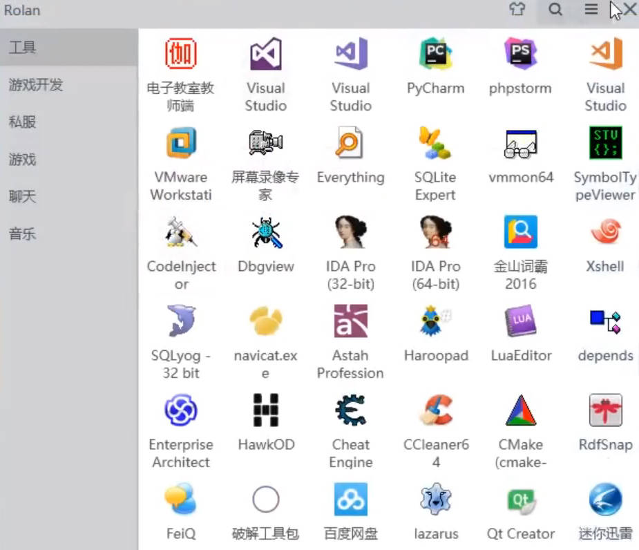

# D3D

[好：DirectX游戏开发_容易理解](https://www.bilibili.com/video/BV17J411U7sp?vd_source=7346303e5e18677d7261c2c0c109ecfd&spm_id_from=333.788.videopod.episodes&p=73)   [好：D3D游戏攻防](https://www.bilibili.com/video/BV1NT4y1g7L1?vd_source=7346303e5e18677d7261c2c0c109ecfd&spm_id_from=333.788.player.switch&p=16)		[Directx3D11](https://www.bilibili.com/video/BV1KC4y1Y7tc/?vd_source=7346303e5e18677d7261c2c0c109ecfd)	   [DirectX9.0](https://www.bilibili.com/video/BV1sA411v7Pe/?vd_source=7346303e5e18677d7261c2c0c109ecfd)	  [D3D游戏攻防](https://www.bilibili.com/video/BV1NT4y1g7L1?vd_source=7346303e5e18677d7261c2c0c109ecfd&spm_id_from=333.788.player.switch&p=4)	[如何绘制3D物体](https://www.bilibili.com/video/BV1qY4y1V79z/?vd_source=7346303e5e18677d7261c2c0c109ecfd)	

[外部DirectX绘制实现](https://www.cnblogs.com/LyShark/p/17761931.html)	  [ 外部DirectX绘制实现-腾讯云](https://cloud.tencent.cn/developer/article/2340047?from=15425&policyId=20240000&traceId=01jt0e8tfrrkfn18bj4f2b7x1s&frompage=seopage)	 [使用DirectX9绘图引擎](https://cloud.tencent.cn/developer/article/2336858?from=15425&policyId=20240000&traceId=01jt0e8tfrrkfn18bj4f2b7x1s&frompage=seopage)	[游戏编程之三 DirectX SDK](https://cloud.tencent.cn/developer/article/2478082?from=15425&policyId=20240000&traceId=01jt0e8tfrrkfn18bj4f2b7x1s&frompage=seopage)	[好：ce修改D3D渲染](https://blog.csdn.net/xfgryujk/article/details/53014403/)	

DirectX 9 是由微软开发的一组多媒体应用程序接口API，用于创建和运行基于Windows平台的多媒体应用程序，尤其是游戏

使用`DirectX 9`绘制图形的流程包括`初始化、创建资源、设置渲染状态和顶点格式、更新数据、绘制图形、渲染和清理资源`构成

Direct3D： ==直接对显卡编程==

[游戏画面防撕裂技术深度解析](https://baijiahao.baidu.com/s?id=1822180376261873005&wfr=spider&for=pc)	[游戏内帧数](https://wen.baidu.com/question/313445517813602924.html) [玩游戏FPS高好还是低好](https://baijiahao.baidu.com/s?id=1821757941752659911&wfr=spider&for=pc)		[什么是画面撕裂](https://zhuanlan.zhihu.com/p/488348358)	 [深入理解帧数与刷新率](https://baijiahao.baidu.com/s?id=1828142817468304557&wfr=spider&for=pc)	

游戏是由很多个画面，每个画面1帧，连续的播放

游戏画面都是由一帧一帧的图像快速连续播放形成的，而显示器的刷新率和显卡输出的帧率有时候会不一致

1. 初始化变量
   1. 使用绘制库之前我们需要一个可被自由绘制的画布

[UnrealEngine](https://renzhai.net/game-homepage-page)  [ DX12](https://www.bilibili.com/video/BV1er4y1X7GW?vd_source=7346303e5e18677d7261c2c0c109ecfd&spm_id_from=333.788.videopod.episodes&p=4)	 [Directx3D-基础篇](https://www.bilibili.com/video/BV1sK4y147nR/?vd_source=7346303e5e18677d7261c2c0c109ecfd)	

dx: [DirectX 11中文書籍](https://segmentfault.com/q/1010000004456104)	 [游戏程序员养成计划](https://www.cnblogs.com/felove2013/articles/3555116.html)	 [DirectX学习](https://www.vaczh.com/article/detail-43.html)	

汇编： [radasm_百度搜索](https://www.baidu.com/s?ie=UTF-8&wd=radasm)	

[SDL（开放源代码的跨平台多媒体开发库）_百度百科](https://baike.baidu.com/item/SDL/224181)	[SDL库入门：掌握跨平台游戏开发和多媒体编程](https://developer.aliyun.com/article/1464109)	

[va_x百度百科](https://baike.baidu.com/item/va/7433963)	[VirtualXposed框架虚拟机](https://www.32r.com/app/88103.html)	 [Windows kits_百度搜索](https://www.baidu.com/s?ie=UTF-8&wd=Windows%20kits)	[zeromq1消息队列框架_百度搜索](https://www.baidu.com/s?ie=utf-8&f=8&rsv_bp=1&tn=baidu&wd=zeromq&oq=Windows%2520kits&rsv_pq=949af3db00102c18&rsv_t=5a4b7Ggf7DdqXUDmNHK6q70yOWLMf0Zclp7XJjQ7ONkVdR67FWDjOZBfQLs&rqlang=cn&rsv_enter=1&rsv_dl=tb&rsv_sug3=7&rsv_sug1=7&rsv_sug7=100&rsv_sug2=0&rsv_btype=t&inputT=4103&rsv_sug4=4599)

mod技术：[蓝图系统_百度搜索](https://www.baidu.com/s?rsv_dl=re_dqa_generate&sa=re_dqa_generate&wd=%E8%93%9D%E5%9B%BE%E7%B3%BB%E7%BB%9F&oq=mod%E6%94%B9%E5%8F%98%E4%BA%BA%E7%89%A9%E6%A8%A1%E5%9E%8B%E7%94%A8%E7%9A%84%E4%BB%80%E4%B9%88%E6%8A%80%E6%9C%AF&tn=baidu&ie=utf-8)	[Unreal Engine开发：蓝图系统](https://blog.csdn.net/chenlz2007/article/details/146888756)	 [做mod要学什么编程](https://worktile.com/kb/p/1977161)	 [韩国团队MOD核心技术拆解](https://wenku.baidu.com/view/b390c9d200d8ce2f0066f5335a8102d276a261b8.html?_wkts_=1746007584548)	 [mod制作-bilibili](https://search.bilibili.com/all?vt=07773933&keyword=mod%E5%88%B6%E4%BD%9C&search_source=5)	 	

[Rolan - 官方网站](https://getrolan.com/)	[rolan_百度搜索](https://www.baidu.com/s?ie=UTF-8&wd=rolan)	

|  |  |
| ------------------------------------------------------ | ----- |
|                                                   |  |
|                                                   |  |
|                                                   |  |

## OpenGL

[OpenGL](https://www.bilibili.com/video/BV1MJ411u7Bc?vd_source=7346303e5e18677d7261c2c0c109ecfd&p=4&spm_id_from=333.788.videopod.episodes)   [OpenGL入门和视频绘制](https://www.bilibili.com/video/BV1uB4y1u7eB/?vd_source=7346303e5e18677d7261c2c0c109ecfd)		[C++ 图形编程：使用 OpenGL 实现简单 3D 场景渲染](https://blog.csdn.net/2401_87432205/article/details/147412253)	 

在OpenGL 4.6中实现一个简单的3D模型渲染，需要遵循以下基本步骤： 

1. 初始化OpenGL环境，并创建一个窗口和OpenGL上下文。
2. 加载3D模型数据，包括顶点、法线、纹理坐标等。
3. 创建着色器程序，至少包含顶点着色器、片元着色器，以及可能的几何着色器和曲面细分着色器。
4. 将模型数据传递给着色器，并设置相关的uniform变量。
5. 在渲染循环中，清除颜色缓冲区，绘制模型，并交换缓冲区。
