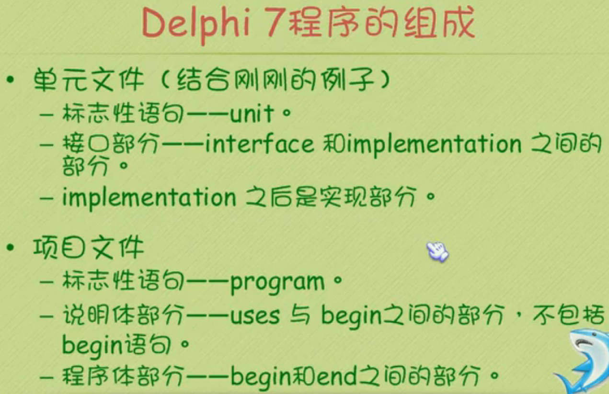
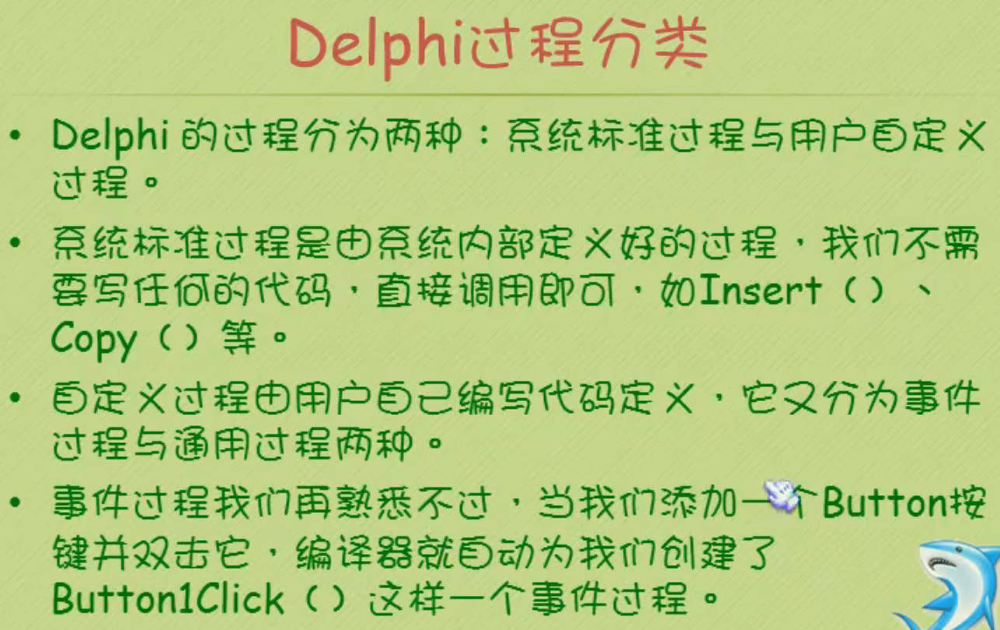
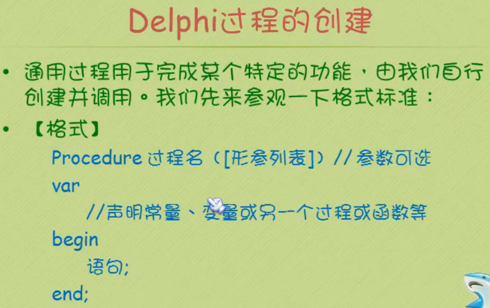
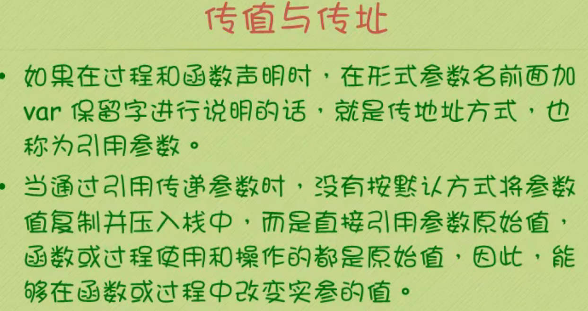
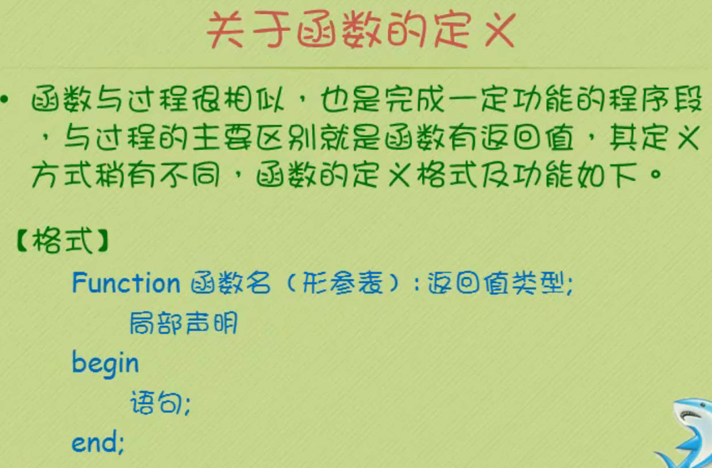
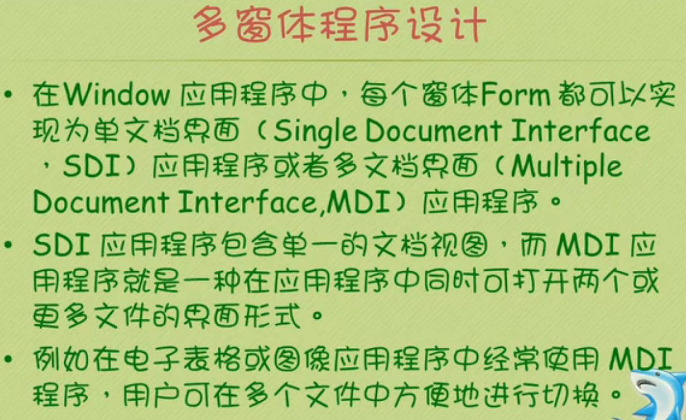
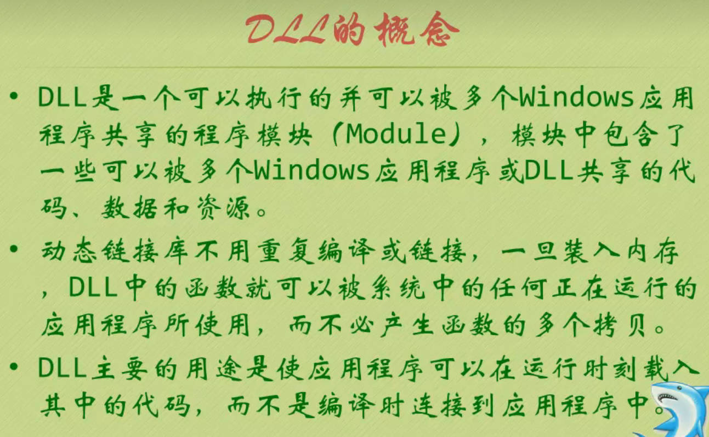

[敏捷开发_百度搜索](https://www.baidu.com/s?ie=utf-8&f=8&rsv_bp=1&tn=baidu&wd=%E6%95%8F%E6%8D%B7%E5%BC%80%E5%8F%91&oq=RAD%25E5%2592%258C%25E6%2595%258F%25E6%258D%25B7%25E5%25BC%2580%25E5%258F%2591%25E5%258C%25BA%25E5%2588%25AB&rsv_pq=901bc233000c69ef&rsv_t=cb734T%2BpIlVyIkoTfXCpHmsEtgh4VNmW47M7mIx69Jaf9djZxyzczeXvsAI&rqlang=cn&rsv_enter=1&rsv_dl=tb&rsv_btype=t&inputT=11329&rsv_sug3=22&rsv_sug1=19&rsv_sug7=100&bs=RAD%E5%92%8C%E6%95%8F%E6%8D%B7%E5%BC%80%E5%8F%91%E5%8C%BA%E5%88%AB)	

[快速应用程式开发工具_百度搜索](https://www.baidu.com/s?ie=utf-8&f=8&rsv_bp=1&tn=baidu&wd=%E5%BF%AB%E9%80%9F%E5%BA%94%E7%94%A8%E7%A8%8B%E5%BC%8F%E5%BC%80%E5%8F%91%E5%B7%A5%E5%85%B7&oq=Delphi&rsv_pq=e27b45fd00084ec4&rsv_t=abfeyiuIbJs88PgXwdqMYLWmGXPrjT91bHC3ZSdax6EggxBzvS1s3Kjrik4&rqlang=cn&rsv_enter=0&rsv_dl=tb&rsv_n=2&rsv_sug3=1&rsv_sug1=1&rsv_sug7=100&rsv_btype=t&inputT=4992&rsv_sug4=4993)	 [提高开发效率利器：盘点六款快速应用开发工具](https://baijiahao.baidu.com/s?id=1802189726499475122&wfr=spider&for=pc)	[快应用制作工具](http://www.apppark.cn/t-54822.html)	[探索 RAD：5 个最佳实践案例解析](https://zhuanlan.zhihu.com/p/718790631)	

**快速应用开发（Rapid Application Development, RAD）工具**‌旨在通过减少开发时间和成本，快速构建和部署应用程序。以下是几款主流的快速应用开发工具及其特点：

1. ‌**[Zoho Creator](https://www.baidu.com/s?rsv_dl=re_dqa_generate&sa=re_dqa_generate&wd=Zoho Creator&rsv_pq=e4f7529300091adc&oq=快速应用程式开发工具&rsv_t=9b5ayu4e1fiOO6nKdG9YkzqoUhL1f2FRNSDlAoVKlHHOlWsL+bTsIDRvGtg&tn=baidu&ie=utf-8)**‌：这是一款强大的低代码平台，专为非技术用户设计。它提供直观的拖放式应用构建界面，内置强大的自动化工具，支持数据同步、审批流程、电子邮件通知和第三方服务集成等功能。Zoho Creator还支持多平台应用发布，开发的应用可以在Web端、iOS和Android平台上使用‌12。
2. ‌**[Airtable](https://www.baidu.com/s?rsv_dl=re_dqa_generate&sa=re_dqa_generate&wd=Airtable&rsv_pq=e4f7529300091adc&oq=快速应用程式开发工具&rsv_t=9b5ayu4e1fiOO6nKdG9YkzqoUhL1f2FRNSDlAoVKlHHOlWsL+bTsIDRvGtg&tn=baidu&ie=utf-8)**‌：这款工具结合了数据库与电子表格的优点，高度自定义且视觉吸引力强，适合团队进行项目管理、内容策划和CRM系统构建等。Airtable支持多种视图和数据类型，并与Slack、Trello、Gmail等流行工具集成。虽然提供免费版本，但高级功能需付费‌12。
3. ‌**[Webflow](https://www.baidu.com/s?rsv_dl=re_dqa_generate&sa=re_dqa_generate&wd=Webflow&rsv_pq=e4f7529300091adc&oq=快速应用程式开发工具&rsv_t=9b5ayu4e1fiOO6nKdG9YkzqoUhL1f2FRNSDlAoVKlHHOlWsL+bTsIDRvGtg&tn=baidu&ie=utf-8)**‌：这是一款视觉化的快速应用开发工具，设计师无需编写代码即可创建响应式网站。Webflow提供精细的CSS控件和复杂的设计效果，适合追求设计和开发同步进行的设计师使用‌12。
4. ‌**[Bubble](https://www.baidu.com/s?rsv_dl=re_dqa_generate&sa=re_dqa_generate&wd=Bubble&rsv_pq=e4f7529300091adc&oq=快速应用程式开发工具&rsv_t=9b5ayu4e1fiOO6nKdG9YkzqoUhL1f2FRNSDlAoVKlHHOlWsL+bTsIDRvGtg&tn=baidu&ie=utf-8)**‌：Bubble是一个无需编码的快速开发平台，用户可以通过拖拽组件的方式创建功能齐全的Web应用。Bubble拥有活跃的开发者社区，提供丰富的教程、插件和预制应用模板，但性能和可扩展性受限于平台‌2。
5. ‌**[应用公园](https://www.baidu.com/s?rsv_dl=re_dqa_generate&sa=re_dqa_generate&wd=应用公园&rsv_pq=e4f7529300091adc&oq=快速应用程式开发工具&rsv_t=9b5ayu4e1fiOO6nKdG9YkzqoUhL1f2FRNSDlAoVKlHHOlWsL+bTsIDRvGtg&tn=baidu&ie=utf-8)**‌：这款工具支持将微信小程序一键转换为快应用，动态App打包原生应用，适合有微信小程序开发经验的开发者‌2。
6. ‌**[NocoBase](https://www.baidu.com/s?rsv_dl=re_dqa_generate&sa=re_dqa_generate&wd=NocoBase&rsv_pq=e4f7529300091adc&oq=快速应用程式开发工具&rsv_t=9b5ayu4e1fiOO6nKdG9YkzqoUhL1f2FRNSDlAoVKlHHOlWsL+bTsIDRvGtg&tn=baidu&ie=utf-8)**‌：NocoBase是一个开源的低代码平台，支持多租户、权限控制、工作流等功能，适合需要高度自定义和灵活性的企业‌3。
7. ‌**[OutSystems](https://www.baidu.com/s?rsv_dl=re_dqa_generate&sa=re_dqa_generate&wd=OutSystems&rsv_pq=e4f7529300091adc&oq=快速应用程式开发工具&rsv_t=9b5ayu4e1fiOO6nKdG9YkzqoUhL1f2FRNSDlAoVKlHHOlWsL+bTsIDRvGtg&tn=baidu&ie=utf-8)**‌：OutSystems是一个低代码开发平台，支持快速构建企业级应用，提供丰富的功能和模块化开发‌3。
8. ‌**[Mendix](https://www.baidu.com/s?rsv_dl=re_dqa_generate&sa=re_dqa_generate&wd=Mendix&rsv_pq=e4f7529300091adc&oq=快速应用程式开发工具&rsv_t=9b5ayu4e1fiOO6nKdG9YkzqoUhL1f2FRNSDlAoVKlHHOlWsL+bTsIDRvGtg&tn=baidu&ie=utf-8)**‌：Mendix是一个模型驱动的低代码平台，使用可视化模型定义应用程序逻辑、流程流和用户界面，适合需要高度定制化开发的企业‌3。
9. ‌**[Appian](https://www.baidu.com/s?rsv_dl=re_dqa_generate&sa=re_dqa_generate&wd=Appian&rsv_pq=e4f7529300091adc&oq=快速应用程式开发工具&rsv_t=9b5ayu4e1fiOO6nKdG9YkzqoUhL1f2FRNSDlAoVKlHHOlWsL+bTsIDRvGtg&tn=baidu&ie=utf-8)**‌：Appian专注于企业级应用的开发和流程自动化，支持自动化协作和工作流处理，适用于复杂的企业应用开发‌3。

# Delphi

[Delphi](https://www.oschina.net/p/delphi?hmsr=aladdin1e1)	

[Windows无法使用帮助文档（.hlp）解决方案](https://fishc.com.cn/blog-9-1723.html)	 [win7下安装delphi7](https://blog.csdn.net/xfyxjz/article/details/6556560?spm=1001.2101.3001.6650.5&depth_1-utm_source=distribute.pc_relevant.none-task-blog-2%7Edefault%7EBlogCommendFromBaidu%7ERate-5-6556560-blog-8488039.235%5Ev43%5Epc_blog_bottom_relevance_base4)	[Delphi 7 在Win 7 下的安装使用](https://blog.csdn.net/iteye_129/article/details/82567399)	

下载： [Borland Delphi 7 Enterprise(英文企业版)+Update1更新包](https://www.cnblogs.com/Ganders/p/12583665.html)	  [Delphi 开发工具各版本](https://www.cnblogs.com/sz1860/p/13335014.html)	[delphi 7下载 - Search](https://cn.bing.com/search?q=delphi+7%E4%B8%8B%E8%BD%BD&form=QBLHCN&sp=-1&lq=0&pq=delphi+7%E4%B8%8B%E8%BD%BD&sc=12-10&qs=n&sk=)	

视频： [鱼C_Delphi](https://www.bilibili.com/video/BV12s411c7ct/?vd_source=7346303e5e18677d7261c2c0c109ecfd)	

添加控件：双击添加到中心位置； 按sh画多个

事件：双击按钮控件编辑事件

|  |  |
| ----------------------------------------------------- | ----------------------------------------------------- |
|  |  |
|  |  |
|  |                                                  |

