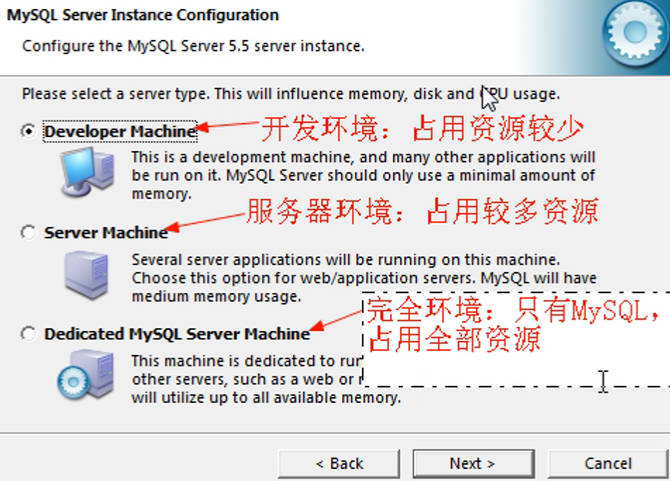
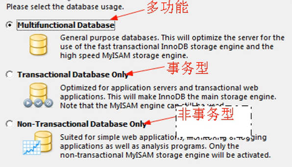
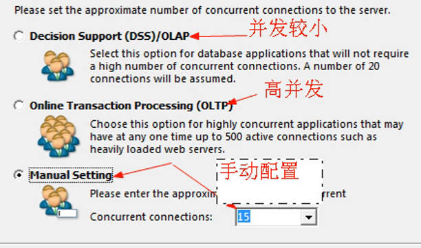
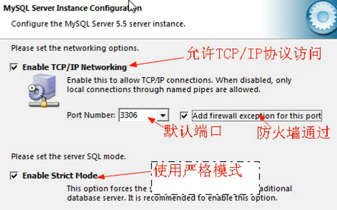
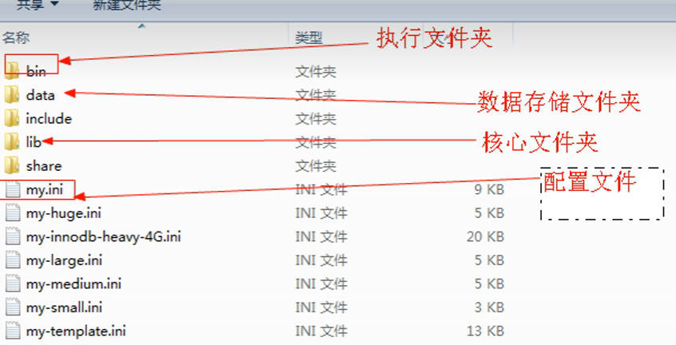
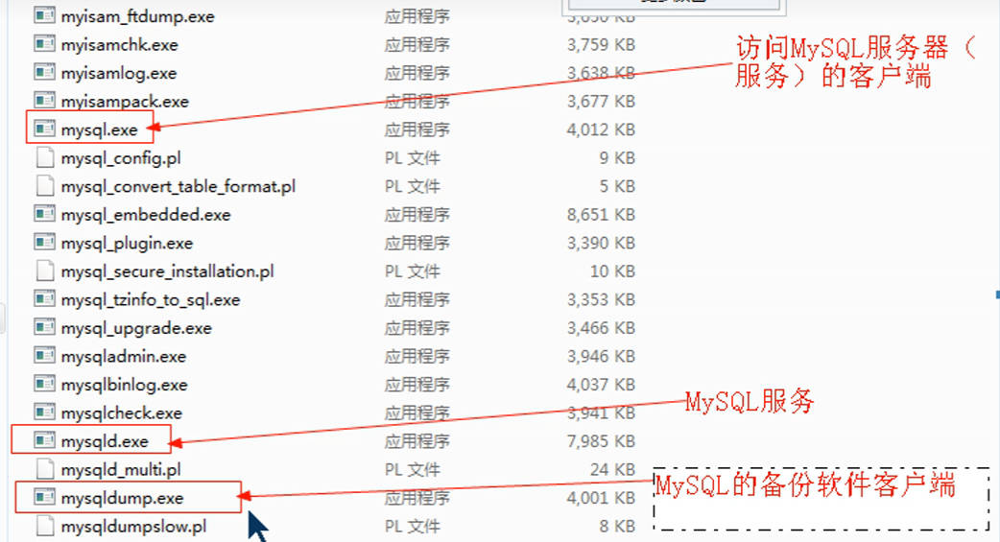
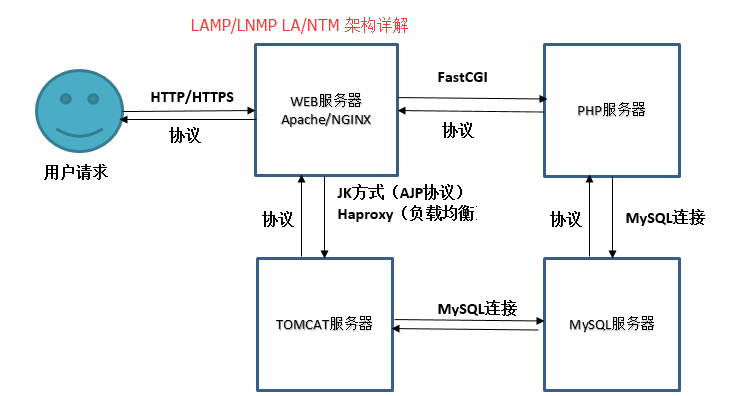
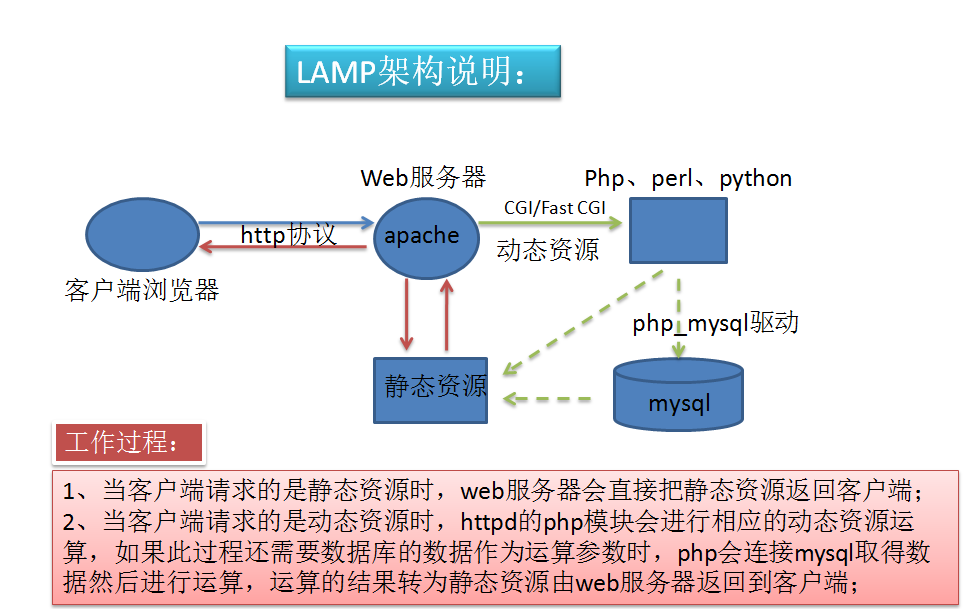

## php资料

视频：[黑马程序员PHP](https://www.bilibili.com/video/BV18x411H7qD/?spm_id_from=333.337.search-card.all.click&vd_source=7346303e5e18677d7261c2c0c109ecfd) [PHP基础](https://www.bilibili.com/video/BV18x411H7qD?p=54&vd_source=7346303e5e18677d7261c2c0c109ecfd)  [PHP](https://www.bilibili.com/video/BV19R4y1c7Zv/?spm_id_from=333.337.search-card.all.click&vd_source=7346303e5e18677d7261c2c0c109ecfd)   [PHP](https://search.bilibili.com/all?vt=32210061&from_source=webcommentline_search&keyword=PHP%E6%93%8D%E4%BD%9C%E6%89%8B%E5%86%8C&seid=7948432709516778154)  [PHP](https://www.bilibili.com/video/BV12J411E7Wc/?spm_id_from=333.337.search-card.all.click&vd_source=7346303e5e18677d7261c2c0c109ecfd)  

手册：[PHP](https://www.php.net/manual/zh/)  

[全球仍有 76.4% 的网站在用 PHP](https://blog.csdn.net/csdnsevenn/article/details/138143614) [PHP](https://zhuanlan.zhihu.com/p/660936453) [哪些知名的网站或应用程序是使用 PHP 开发的](https://www.zhihu.com/question/634818659/answer/3325778334) [php](https://www.baidu.com/s?ie=UTF-8&wd=%E8%BF%98%E6%9C%89%E7%BD%91%E7%AB%99%E7%94%A8php%E5%90%97) 

### 一键安装

一键编译安装LNAMP: [一键安装lnmp](https://www.baidu.com/s?ie=UTF-8&wd=%E4%B8%80%E9%94%AE%E5%AE%89%E8%A3%85lnmp%20github)   [asuhu/lnamp](https://github.com/asuhu/lnamp)   [lnmpkvemail/lnmp](https://github.com/lnmpkvemail/lnmp)  [LAMP/LNMP](https://www.cnblogs.com/yihr/p/7492012.html)  

[mirrors.oneinstack.com 国内完整包 含恶意代码](https://github.com/oneinstack/oneinstack/issues/511)  [金华矜贵收购“一键安装”后投毒挂马](https://www.bilibili.com/read/cv26921585/)  [oneinstack](https://www.baidu.com/s?ie=UTF-8&wd=oneinstack)  

源： [php72和php72w](https://www.zhihu.com/question/366200397/answer/973666804) 

## PHP语法

[PHP菜鸟教程 ](https://www.runoob.com/php/php-oop.html) [PHP download](https://windows.php.net/download#php-8.3) 

```php
/*	

PHP 文件通常包含 HTML 标签和一些 PHP 脚本代码。
PHP 脚本以 <?php 开始，以 ?> 结束
PHP 语句和 PHP 变量区分大小写
每行语句结束必须加分号;


// 单行注释
/*多行注释*/

*/
```

### 常量

==魔术常量==：  很多常量由不同的扩展库定义，只有在加载了这些扩展库时才会出现(`动态加载`)

### 变量

- 变量以 $ 符号开始，后面跟着变量的名称
- 变量名必须以字母或者下划线字符开始
- 变量名只能包含==字母、数字以及下划线==（A-z、0-9 和 _ ）
- 变量名==不能包含空格==
- 变量名==区分大小写==  `$y 和 $Y 是两个不同的变量`

变量有4种作用域: `global,static,parameter,local`

- globe:  函数外部定义的变量，拥有全局作用域;   在函数中访问全局变量，需使用 global 关键字		`global $x,$y` 
- local:  函数内部声明的变量是局部变量，仅能在函数内部访问
- Static:  函数完成时，它的所有变量通常都会被删除。有时候希望某个局部变量不要被删除, 在声明变量时使用 static 关键字
- 参数作用域: 通过调用代码==将值传递给函数的局部变量==

```php
// 弱类型语言: 不必向 PHP 声明变量的数据类型;  PHP 会根据变量的值，自动把变量转换为正确的数据类型

PHP 变量:  $ + 变量名称
```

### 数据类型

Resource（资源类型） :  保存到外部资源的一个引用, 即打开外部资源

- 资源类型变量保存有为打开文件、数据库连接、图形画布区域等的特殊句柄
- get_resource_type() 函数可以返回资源（resource）类型

```php
数据类型： PHP变量存储不同类型的数据
Array（数组）
Object（对象）
Resource（资源类型） :    get_resource_type(resource $handle): string


# 字符串
# 单引号直接输出，双引号解析输出；和shell一样
# 字符串拼接：使用. 点拼接
```

#### 数组

 PHP 中，有三种类型的数组：

- **数值数组** - 带有数字 ID 键的数组， ==下标==
  - `$cars=array("Volvo","BMW","Toyota");    $cars[0]`
- **关联数组** - 带有指定的键的数组，每个键关联一个值；   分配给数组指定键； ==键值对==
  - `$age=array("Peter"=>"35","Ben"=>"37","Joe"=>"43");    $age['Peter']="35"; `
  - `foreach($age as $x=>$x_value)`
- **多维数组** - 包含一个或多个数组的数组

```php
// 数组
// 定义数组：
$arr=[1,2,3]
$arr=array(key=>value,'name'=>'hua',...)
$arr=[key=>value,...]

// 遍历关联数组：
foreach($arr as $item){echo $item;}
foreach($arr as $key=>$value){echo $key.':'.$value."<br/>";}	//取数组下标


<?php
$age=array("Peter"=>"35","Ben"=>"37","Joe"=>"43"); 
foreach($age as $x=>$x_value)
{
    echo "Key=" . $x . ", Value=" . $x_value;
    echo "<br>";
}
?>
```


### PHP EOF(heredoc文档)

用来定义一个字符串

- 开始标识可以不带引号或带单双引号，不带引号与带双引号效果一致，==解释变量和转义符号==，==单引号不解释==内嵌的变量和转义符号

### 条件语句

`if...elseif....else `

```php
// Switch语句

<?php
switch (expression) {
    case value1:
        // 代码块1
        break;
    case value2:
        // 代码块2
        break;
    // 更多的 case 语句
    default:
        // 如果没有匹配的值
}
?>
```

### 循环语句

- **while** - 只要指定的条件成立，则循环执行代码块
- **do...while** - ==首先执行一次==代码块，然后在指定的条件成立时重复这个循环
- **for** - 循环执行代码块指定的次数
- **foreach** - 根据数组中每个元素来循环代码块

```php
while (条件)
{
    要执行的代码;
}
====================
do
{
    要执行的代码;
}
while (条件); 
====================
for (初始值; 条件; 增量)
{
    要执行的代码;
}
====================
 foreach ($array as $value)
{
    要执行代码;
}
```

### 函数

==变量函数==:  运行时动态地决定调用哪个函数

```php
<?php
function functionName()
{
    // 要执行的代码
}
?>
```

### 命名空间

- 全局代码必须用一个不带名称的 namespace 语句加上大括号括起来
- ==子命名空间==：  `namespace MyProject\Sub\Level;   //声明分层次的单个命名空间`

**命名空间使用**:  PHP 命名空间中的类名可以通过三种方式引用

1. 非限定名称，或==不包含前缀==的类名称      `currentnamespace\foo`
2. 限定名称,或==包含前缀==的名称           `currentnamespace\subnamespace\foo`
3. 完全限定名称，或包含了全局前缀操作符的名称;   ==类似绝对路径==

**命名空间别名**： 通过操作符 ==use== 来实现

```php
<?php  
// 定义代码在 'MyProject' 命名空间中  
namespace MyProject;   
// ... 代码 ...  
========================
//建议用大括号
<?php
namespace MyProject {
    const CONNECT_OK = 1;
    class Connection { /* ... */ }
    function connect() { /* ... */  }
}
========================
namespace { // 全局代码
echo MyProject\Connection::start();
}    
```


### 面向对象

## ==动态编译php==

[php扩展库](https://www.cnblogs.com/zzc666/p/17805745.html) 

```
./configure --help
```


### 动态加载模块

[PHP底层开发原理详解：扩展和模块开发](https://www.php.cn/faq/604030.html) [php模块](https://www.baidu.com/s?ie=UTF-8&wd=php%E6%A8%A1%E5%9D%97%E5%B0%B1%E6%98%AF%E5%8A%A8%E6%80%81%E9%93%BE%E6%8E%A5%E5%BA%93) 

扩展： [xml扩展](https://cloud.tencent.com/developer/article/1725897?from=15425)  [mysqli](https://blog.csdn.net/qq_52519229/article/details/131033412)  [curl库](https://www.cnblogs.com/haosk/p/13655065.html)  [php开启curl](https://worktile.com/kb/ask/136711.html)  [GD库](https://www.baidu.com/s?ie=utf-8&f=8&rsv_bp=1&tn=baidu&wd=php%E5%BC%80%E5%90%AFGD%E5%BA%93%20%20ubuntu&rn=20&oq=php%25E5%25BC%2580%25E5%2590%25AFGD%25E5%25BA%2593&rsv_pq=d654d651006f1c0f&rsv_t=b7d0%2BT%2BRaTchWsfQxE5%2FhFLZ0KXxZ%2B0bsEqZ6r0fiQFP9%2BXDxiPGNZ1jwXE&rqlang=cn&rsv_enter=0&rsv_dl=tb&rsv_btype=t&inputT=2795&rsv_sug3=23&rsv_sug1=18&rsv_sug7=100&rsv_sug2=0&rsv_sug4=3411) 

模块是给函数用的，*PHP*中,扩展是以*动态链接库*的形式存在的,它们提供了PHP没有提供的新功能,比如加密、图像处理等；win版的php能看到扩展是dll文件

```sh
yum install php-mysql				# mysqli.so

php -m | grep curl					# 检查扩展是否安装
apt-get install php-curl
php -i |grep curl					# 确认cURL扩展已启用
apt install php8.3-gd
```

扩展管理工具 : [phpenmod](https://www.baidu.com/s?ie=UTF-8&wd=apt%E5%AE%89%E8%A3%85%E7%9A%84php%E6%80%8E%E4%B9%88%E5%8A%A0%E8%BD%BD%E6%A8%A1%E5%9D%97)  [phpize](https://cloud.tencent.com/developer/article/1805005?from=15425) [添加PHP扩展模块](https://www.cnblogs.com/liluxiang/p/9316349.html) 

## ==配置==

[php.ini 配置详解](https://blog.51cto.com/dason/367219?articleABtest=0)  [PhpIniDir](https://www.php.cn/faq/181657.html)  

[OpenCASCADE介绍](https://blog.csdn.net/KaHe0528/article/details/136602814) [什么是oneAPI ?与TBB相比如何](https://cloud.tencent.com/developer/information/%E4%BB%80%E4%B9%88%E6%98%AFoneAPI%20%3F%E4%B8%8ETBB%E7%9B%B8%E6%AF%94%E5%A6%82%E4%BD%95%EF%BC%9F)   [OCC7.8.0开发的软件在Win7上无法运行及解决方案](https://blog.csdn.net/Hudeyu777/article/details/136291559) 

web服务器：[vue项目用什么服务器部署](https://worktile.com/kb/ask/1481872.html) Node.js、Apache、Nginx、CDN服务器

Apache： [Apache（httpd）详解](https://www.cnblogs.com/hgzero/p/12845077.html)  [Linux—搭建Apache(httpd)服务](https://cloud.tencent.com/developer/article/2077975)   [Apache（httpd）](https://blog.csdn.net/rzy1248873545/article/details/110915506)  

[cli/php.ini和fpm/php.ini的区别](https://blog.csdn.net/ufan94/article/details/78928486) 

- php.ini配置
  - cli和fpm是php的两种运行方式
    - `/etc/php/8.3/cli/php.ini` 
    - `/etc/php/8.3/fpm/php.ini` 
  - `/usr/lib/php/8.3/php.ini-production`
- fastcgi模块：
  - `/etc/nginx/snippets/fastcgi-php.conf 包含 fastcgi.conf`； 
    - `/etc/nginx/fastcgi/fastcgi.conf 、fastcgi_params `    
  - php-fpm： `/etc/php/8.3/fpm/php-fpm.conf 包含 pool.d/www.conf`
- nginx虚拟主机配置： `/etc/nginx/nginx.conf； 包含(include)conf.d/game.conf、sites-enabled/软链接到sites-available/` ; 里面加载fastcgi模块

### php.ini

[php.ini配置官方](https://www.php.net/manual/zh/ini.core.php#ini.extension-dir) 

```sh
php --ini		# 找ini文件位置

Configuration File:         	/etc/php/8.3/cli/php.ini
additional .ini files in: 		/etc/php/8.3/cli/conf.d

```


### LAMP配置

视频: [配置基于域名的虚拟主机](https://www.bilibili.com/video/BV1qg4y1q7DU/?vd_source=7346303e5e18677d7261c2c0c109ecfd)   [centos7搭建LAMP](https://www.bilibili.com/video/BV1z741147iN/?spm_id_from=333.337.search-card.all.click&vd_source=7346303e5e18677d7261c2c0c109ecfd)  [lamp环境搭建](https://search.bilibili.com/all?vt=02843515&keyword=lamp%E7%8E%AF%E5%A2%83%E6%90%AD%E5%BB%BA&from_source=webtop_search&spm_id_from=333.1007&search_source=5) 

**小结**  apache配置：加载php模块、请求调度到php、加载php配置文件；   php配置：加载mysql扩展

- php目录
  - ext目录：扩展包，php许多功能通过加载扩展实现
  - php8apache2_4： Apache支持包
  - php.ini-*：配置文件
- ==Apache配置==   [Win10加载php8_module](https://www.cnblogs.com/qianzf/p/14373629.html) 
  - apache==加载php模块==：conf/httpd.conf, `LoadModule php_module ‘C:/php8/php8apache2_4.dll’` 
    - `httpd -t语法检查  -M加载的模块`
  - apache==调度请求给php模块==：.php结尾的交给php处理  [配置httpd支持PHP及默认虚拟主机](https://cloud.tencent.com/developer/article/2047221)  [AddType](https://www.cnblogs.com/wordless/p/16208659.html) 
    - `AddType application/x-httpd-php .php`  
    - 到此php和apache已经合作，但php的修改、修改、配置等还没使用
  - 将==php配置文件加载==到apache配置文件中  [加载PHP的配置扩展文件](https://www.cnblogs.com/mwxz/p/13028123.html) 
    - PHPIniDir 'C:/php5'	//php.ini路径
    - php.ini默认不存在，以development和production格式存在，需要格式化：复制一份，重命名为php.ini
    - 修改php.ini，apache要重启
- ==php扩展操作mysql== 
  - mysql目录， `mysql -hlocalhost -P3306 -uroot -p123456`
  - php连接mysql：php本身不能操作mysql，需借助扩展操作mysql
    - php加载mysql扩展：php.ini中
      - `extension_dir = "d:/server/php8/ext"`	//php扩展目录
      - `extension=php_mysql.dll`	             //mysql扩展操作mysql
  - 设定php系统时区：`date.timezone = PRC`

|  |  |
| ------------------------------------------------------------ | ------------------------------------------------------------ |
|  |        |
|  |        |

> CDN服务器：如果你的Vue项目需要高可用性和快速加载速度，可以考虑使用CDN（内容分发网络）服务器来部署静态资源。通过将Vue应用的静态文件（如HTML、CSS和JavaScript文件）部署到CDN服务器上，可以将这些文件分布到多个地理位置的服务器上，从而提供更快的访问速度

**另一个视频的笔记**

**安装**

[centos7搭建LAMP](https://www.bilibili.com/video/BV1z741147iN/?spm_id_from=333.337.search-card.all.click&vd_source=7346303e5e18677d7261c2c0c109ecfd)  [MySQL8.3.0社区版](https://blog.csdn.net/EliasChang/article/details/136096268)  [mysql-server 与 mysql-client的区别](https://blog.csdn.net/m0_67392811/article/details/126470644) [mysql](https://blog.csdn.net/weixin_34697393/article/details/113139704)  [MariaDB](https://mariadb.com/downloads/) 

```sh
yum -y install httpd
yum -y install php
yum -y install php-fpm
yum -y install mysql	# 客户端mysql-client
# mysql服务端
yum -y install mysql-server		# 出错，因为mysql不开源了，centos把它从软件列表移除了；可从官网下载
	wget http://dev.mysql.com/get/mysql-community-release-el7-5.noarch.rpm
	rpm -ivh mysql-community-release-el7-5.noarch.rpm
	yum install mysql-community-server
	# 或安装yum install mariadb mariadb-server -y
yum -y install php-mysql

yum -y install httpd-manual mod_ssl mod_perl mod_auth_mysql
```

**安装常用扩展包 **   [Linux入门之ss指令](https://zhuanlan.zhihu.com/p/693551397) 

```sh
# apache扩展包
yum -y install httpd-manual mod_ssl mod_perl mod_auth_mysql
# 防火墙中开放80端口,http服务加入防火墙以允许外部访问； –permanent数表示这是一条永久防火墙规则
firewall-cmd --add-service=http --permanent
systemctl restart firewalld

# 安装php扩展包
yum -y install php-gd php-xml php-mbstring php-ldap php-pear php-xmlrpc php-devel

# apache,mysql开机启动		
systemctl enable httpd
systemctl enable mysqld

set password for 'root'@'localhost' =password('123456')
# 或 mysqladmin password 'oldboy123' 测试：mysql -uroot -p'oldboy123'

# 测试端口
ss -lnt|egrep "80|9000|3306"

# 关闭selinux
##1.关闭selinux，它是一个安全模块，不关闭，老管着你。
setenforce 0  ##临时关闭selinux
getenforce    ##查看是否关闭
# 注释掉 SELINUXTYPE=targeted
sed -i 's#SELINUX=enforcing#SELINUX=disabled#g' /etc/selinux/config  ##永久关闭

# 测试php
touch test.php
```


```
# 关闭防火墙，为了学习方便。
systemctl stop firewalld     ##关闭防火墙
systemctl disable firewalld  ##禁止开机自启动
systemctl status firewalld   ##查看关闭结果
```

### LNMP

nginx: [nginx中fastcgi_params配置参数  ](https://www.cnblogs.com/qcwblog/p/8032976.html)   [Nginx配置PHP环境支持](https://www.cnblogs.com/it1000/p/11088096.html)  [MySQL Community Downloads](https://dev.mysql.com/downloads/) 

[php加载fastcgi模块](https://www.baidu.com/s?ie=utf-8&f=8&rsv_bp=1&tn=baidu&wd=php%E5%8A%A0%E8%BD%BDfastcgi%E6%A8%A1%E5%9D%97&rn=20&oq=ubuntu%25E9%2585%258D%25E7%25BD%25AEphp-fpm&rsv_pq=ea7cdc8200495ff2&rsv_t=dfabEhh1dY7DHwZ9YfJFJSQPGva0P3%2Bn5EciAl0R752s0iooadNZyjW33cY&rqlang=cn&rsv_enter=1&rsv_dl=tb&rsv_sug3=17&rsv_sug1=16&rsv_sug7=100&rsv_n=2&rsv_sug2=0&rsv_btype=t&inputT=16440&rsv_sug4=37667)   [好：fastcgi配置： fastcgi_params fastcgi fastcgi-php区别](https://cloud.tencent.com/developer/article/2316602) 

==nginx.conf==： [Nginx配置文件](https://cloud.tencent.com/developer/article/1894746)   [LNMP环境搭建](https://www.bilibili.com/video/BV1ZD421w7p7/?spm_id_from=333.1007.tianma.2-2-5.click&vd_source=7346303e5e18677d7261c2c0c109ecfd)  [配置文件nginx.conf](https://blog.csdn.net/qq_33240556/article/details/136903238) [nginx.conf配置文件](https://blog.csdn.net/m0_71913083/article/details/136282810) 

虚拟主机配置： [conf.d vs sites-available](https://www.cnblogs.com/kevin922/p/3585985.html)  [Nginx多配置文件](https://www.sunzhongwei.com/nginx-configuration-file-to-put-more-good-which-directories-sites-availableenabled-and-conf-d)  [Nginx配置详解](https://www.cnblogs.com/suuuch/articles/16384349.html) [Nginx详解（正向代理、反向代理、负载均衡原理）](https://info.ustb.edu.cn/ITxy/kfzzx/c4208b7762fd431d9850c02b1c23eb27.htm)  [NGINX常用配置](https://blog.csdn.net/NorthPollPenguin/article/details/107345626) 

==php-fpm==: [php-fpm配置](https://zhuanlan.zhihu.com/p/134029988)  [php 9000端口没有启动怎么解决](https://www.yisu.com/jc/625492.html)  [php加载fastcgi模块](https://www.baidu.com/s?ie=utf-8&f=8&rsv_bp=1&tn=baidu&wd=php%E5%8A%A0%E8%BD%BDfastcgi%E6%A8%A1%E5%9D%97&rn=20&oq=ubuntu%25E9%2585%258D%25E7%25BD%25AEphp-fpm&rsv_pq=ea7cdc8200495ff2&rsv_t=dfabEhh1dY7DHwZ9YfJFJSQPGva0P3%2Bn5EciAl0R752s0iooadNZyjW33cY&rqlang=cn&rsv_enter=1&rsv_dl=tb&rsv_sug3=17&rsv_sug1=16&rsv_sug7=100&rsv_n=2&rsv_sug2=0&rsv_btype=t&inputT=16440&rsv_sug4=37667) 

1. FastCGI 可以使用 socket 文件而不是端口来通讯，提高性能和安全性。在 FastCGI 配置中，可以指定一个 socket 文件来替代端口号   [fastcgi用用sock文件不开9000端口](https://www.baidu.com/s?wd=fastcgi%E7%94%A8%E7%94%A8sock%E6%96%87%E4%BB%B6%E4%B8%8D%E5%BC%809000%E7%AB%AF%E5%8F%A3&rsv_spt=1&rsv_iqid=0xd40d345f0017d3d9&issp=1&f=8&rsv_bp=1&rsv_idx=2&ie=utf-8&tn=baiduhome_pg&rsv_dl=tb&rsv_enter=0&oq=fastcgi%25E7%2594%25A8%25E7%2594%25A8sock%25E6%2596%2587%25E4%25BB%25B6&rsv_t=962dpZvxmz%2FJX5uR37qbt%2Bjn6hz%2BFsXkectQca2cAqaCUa8%2BTwDxiIl9rdlyOvjt2Izo&rsv_pq=f1093286000160a9&rsv_btype=t&inputT=120363&rsv_sug4=123636)  
   1. nginx配置： `fastcgi_pass` 指令设置一个 `unix:` 开头的 URI，这表示 Nginx 将通过 Unix socket 文件 `/var/run/your-app.sock` 与 FastCGI 进程通讯
   2. 确保 FastCGI 进程也配置为监听同一个 socket 文件。例如，如果使用 PHP-FPM，可以在 PHP-FPM 配置文件（通常是 `www.conf` ）中找到并修改 `listen` 指令 ;   `listen = /var/run/your-app.sock`
   3. 配置后，Nginx 将通过 socket 文件与 PHP-FPM 通讯，而不是通过 9000 端口

==nginx配置文件==

老男孩3天课程里有

- 配置nginx虚拟主机就行了

[Nginx](https://blog.csdn.net/lang0205/article/details/131477527)  [ubuntu下nginx和php-fpm环境配置](https://www.cnblogs.com/dtwin/p/18102627)  [Nginx 配置文件nginx.conf](https://blog.csdn.net/qq_33240556/article/details/136903238)

```sh
# 配置文件

# /etc/php/8.3/fpm/pool.d/www.conf
# /etc/nginx/nginx.conf; 			include /etc/nginx/conf.d/*.conf;
# /etc/nginx/conf.d/game.conf

# 修改nginx配置文件，使其指向正确的php-fpm版本
/etc/nginx/sites-available/default		# root /var/www/html

# include snippets/fastcgi-php.conf
# /etc/nginx/fastcgi_params
# /etc/nginx/snippets/fastcgi-php.conf


systemctl status php8.3-fpm.service
nginx -s reload			# nginx重新加载配置文件
```

`sed -nr '/#|^$/!p' /etc/nginx/nginx.conf ` ==include conf.d/、sites-enabled/==

```sh
user nginx nginx;
worker_processes auto;
pid /run/nginx.pid;
error_log /var/log/nginx/error.log;
include /etc/nginx/modules-enabled/*.conf;
events {
	worker_connections 768;
}
http {
	sendfile on;
	tcp_nopush on;
	types_hash_max_size 2048;
	include /etc/nginx/mime.types;
	default_type application/octet-stream;
	ssl_prefer_server_ciphers on;
	access_log /var/log/nginx/access.log;
	gzip on;
	include /etc/nginx/conf.d/*.conf;
	# sites-enabled （存放软链接，指向sites-available 中的配置文件)
	include /etc/nginx/sites-enabled/*;
}
```

`/etc/nginx/sites-available/default`，  ==软链接sites-enabled/==

```sh
# 
server {
	listen 80 default_server;
	listen [::]:80 default_server;
	root /var/www/html;
	index index.html index.htm index.nginx-debian.html;
	server_name _;
	location / {
		try_files $uri $uri/ =404;
	}
	location ~ \.php$ {
		include snippets/fastcgi-php.conf;
		fastcgi_pass unix:/run/php/php8.3-fpm.sock;
	}
}
```

`/etc/nginx/conf.d/game.conf`

```sh
server {
        server_name game.etiantian.org;
        listen 80;                    
        root  /data/game/html;
        index index.php index.html;

        location ~ \.php$ {
            # fastcgi_pass   127.0.0.1:9000;
            fastcgi_pass unix:/run/php/php8.3-fpm.sock;
            fastcgi_index  index.php;
            fastcgi_param  SCRIPT_FILENAME  $document_root$fastcgi_script_name;
            include        fastcgi_params;
        }
}
```


### socket网络进程通信

[socket作用](https://blog.csdn.net/qq_21197471/article/details/109406892)  [socket服务有什么用_](https://www.baidu.com/s?ie=utf-8&f=8&rsv_bp=1&tn=baidu&wd=socket%E6%9C%8D%E5%8A%A1%E6%9C%89%E4%BB%80%E4%B9%88%E7%94%A8&rn=20&oq=socket&rsv_pq=e48b281000070f75&rsv_t=cc1aC0GJKm8%2BaoC4owhBPdPwVUStir7fT1PdoISoMlPkmUGKGY%2BJ9DNxA%2FU&rqlang=cn&rsv_enter=1&rsv_dl=tb&rsv_sug3=21&rsv_sug1=15&rsv_sug7=100&rsv_sug2=0&rsv_btype=t&inputT=9399&rsv_sug4=12443) 

socket本质是编程接口(API)，对TCP/IP的封装

**网络中进程之间如何通信？**

- TCP/IP协议簇来处理，网络层的ip可以唯一==标识网络中的主机==，传输层的“协议+端口”可以唯一==标识主机中的应用程序==（进程）。利用三元组 `[ip地址，协议，端口]`， ==标识网络的进程==，网络中的进程通信就可以利用这个标志与其它进程进行交互
- ==使用TCP/IP协议的应用程序==通常采用应用编程接口：UNIX BSD的套接字（socket）和UNIX System V的TLI（已经被淘汰），来实现网络进程之间的通信

### fhp-fpm

[PHP与nginx之间的运行机制及其原理](https://www.cnblogs.com/dgxblogs/p/10558261.html)   [nginx如何解析php](https://www.cnblogs.com/ccku/p/13531551.html)   [php的几种运行模式CLI、CGI、FastCGI、mod_php](https://www.cnblogs.com/Renyi-Fan/p/9811197.html) 

cgi、fast-cgi协议   

**cgi**

php等动态语言webserver处理不了，要交给php解释器处理， 但是，php解释器如何与webserver进行通信？

- 为了解决不同的语言解释器(如php、python解释器)与webserver的通信，出现了cgi协议。只要按cgi协议去编写程序，就能实现语言解释器与webwerver的通信。如php-cgi程序

**fast-cgi的改进**

虽然webserver可以处理动态语言了，但是，webserver每收到一个请求，都会去fork一个cgi进程，请求结束再kill掉这个进程。这样有10000个请求，就需要fork、kill php-cgi进程10000次， 很浪费资源

- 出现了cgi的改良版本，fast-cgi。fast-cgi每次处理完请求后，不会kill掉这个进程，而是保留这个进程，使这个进程可以一次处理多个请求。这样每次就不用重新fork一个进程了，大大提高了效率

**php-fpm**

- php-Fastcgi Process Manager， 是 ==FastCGI 的实现，并提供进程管理功能==
- 进程包含 ==master== 进程和 ==worker== 进程两种进程
  - master 进程只有一个，==负责监听端口==，接收来自 Web Server 的请求  `systemctl start php7.4-fpm`
  - worker 进程则一般有多个(具体数量根据实际需要配置)，每==个进程内部都嵌入了一个 PHP 解释器，是 PHP 代码真正执行的地方==

**php-fpm配置文件 **   [nginx location配置](https://www.cnblogs.com/jpfss/p/10418150.html) 

> 当客户端request到达nginx时，nginx通过location指令，将所有以.php结尾的文件都交给127.0.0.1:9000(本地php解析服务器)进行处理  `location ~ \.php$ {   }`

[php-fpm配置](https://zhuanlan.zhihu.com/p/134029988)  

```sh
# /etc/php/8.3/fpm/php-fpm.conf 包含 pool.d/www.conf
[global]
pid = /run/php/php8.3-fpm.pid
error_log = /var/log/php8.3-fpm.log
include=/etc/php/8.3/fpm/pool.d/*.conf


# /etc/php/8.3/fpm/pool.d/www.conf
[www]
user = nginx						# user = www-data
group = nginx						# group = www-data
listen = /run/php/php8.3-fpm.sock
listen.owner = nginx				# listen.owner = www-data
listen.group = nginx				# listen.group = www-data
pm = dynamic
pm.max_children = 10
pm.start_servers = 2
pm.min_spare_servers = 1
pm.max_spare_servers = 3
request_terminate_timeout = 600
```


### 虚拟主机

- 基于ip的vm：一台电脑有多个ip，每个ip对应一个网站
  - 电脑多个网卡，每个网卡绑定一个ip
- 基于域名的vm：一台电脑只有1个ip，对应多个域名

#### **基于域名的vm**

在Apache中，虚拟主机的搭建有两种方式

1. 在主配置文件中搭建： 需手动开启虚拟主机： `NameVirtualHost *:80`
2. 在专门的虚拟主机配置文件中配置
   1. 虚拟主机配置文件开启虚拟主机: ==httpd-vhosts.conf==  `NameVirtualHost *:80` 
   2. 在主配置文件中加载虚拟主机配置文件： ==httpd.conf== `Include conf/extra/httpd-vhosts.conf`

#### 虚拟主机配置文件

[配置基于域名的虚拟主机](https://www.bilibili.com/video/BV1qg4y1q7DU/?vd_source=7346303e5e18677d7261c2c0c109ecfd)   [Apache和Nginx实现虚拟主机的3种方式](https://blog.csdn.net/qq_68163788/article/details/131104794)  [apache虚拟主机配置](https://www.baidu.com/s?ie=utf-8&f=8&rsv_bp=1&tn=baidu&wd=apache%E8%99%9A%E6%8B%9F%E4%B8%BB%E6%9C%BA%E9%85%8D%E7%BD%AE&rn=20&oq=%25E8%2599%259A%25E6%258B%259F%25E4%25B8%25BB%25E6%259C%25BA%25E7%259A%2584%25E6%2590%25AD%25E5%25BB%25BA%25E6%259C%2589%25E4%25B8%25A4%25E7%25A7%258D%25E6%2596%25B9%25E5%25BC%258F%2520%25E5%259C%25A8%25E4%25B8%25BB%25E9%2585%258D%25E7%25BD%25AE%25E6%2596%2587%25E4%25BB%25B6%25E4%25B8%25AD%25E6%2590%25AD%25E5%25BB%25BA&rsv_pq=83e5587700055122&rsv_t=4ca5UUrl%2BpsIfFiha6tIuSRYSP4lds3zdbck3gSzpUetEdsnfUlOce%2FiIJQ&rqlang=cn&rsv_enter=1&rsv_dl=tb&rsv_btype=t&inputT=1138775&rsv_sug3=59&rsv_sug1=40&rsv_sug7=100&rsv_n=2&rsv_sug2=0&rsv_sug4=1139715)   [Apache vhost配置](https://www.aliyun.com/sswb/945563.html)   [Apache虚拟主机配置](https://blog.csdn.net/2401_84002371/article/details/137216301)  

### 数据库

```sh
apt install mariadb mariadb-server
systemctl start mariadb
# 卸载
systemctl stop mariadb
apt-get remove --purge mariadb-server mariadb-client

```


## 架构

[LAMP/LNMP， LNMT/LAMt](https://www.cnblogs.com/keep-going2099/articles/7048508.html)   [tomcat](https://baike.baidu.com/item/tomcat/255751?fr=ge_ala)  

[LAMP配置](https://blog.csdn.net/datangda/article/details/130893090)   [LAMP安装与配置](https://blog.51cto.com/weiyigeek/5666871) 

- tomcat
  - Web 应用服务器，运行JSP 页面和Servlet

|  |  |
| ------------------------------ | ---------------------------- |

## 实战

[虚拟主机配置的方法有哪些 ](https://www.yisu.com/ask/22744156.html)  [Nginx虚拟主机配置](https://developer.aliyun.com/article/1368995)   [nginx的各种配置](https://www.cnblogs.com/jpfss/p/10418150.html) [CentOS 7 安装PHP7+Nginx+Mysql5.7开发环境](https://www.cnblogs.com/lamp01/p/8546341.html) 

[PHP7中php.ini、php-fpm和www.conf的配置](https://www.cnblogs.com/yangxiaolan/p/4991677.html) [php.conf www.conf](https://www.jianshu.com/p/f1174b06dd14) [www.conf配置文件](https://blog.csdn.net/weixin_33701617/article/details/92405516)   [什么是www.conf](https://cloud.tencent.com/developer/ask/sof/104702004)  

 [Discuz! X3.5全新安装教程](https://www.dismall.com/thread-15912-1-1.html)  
