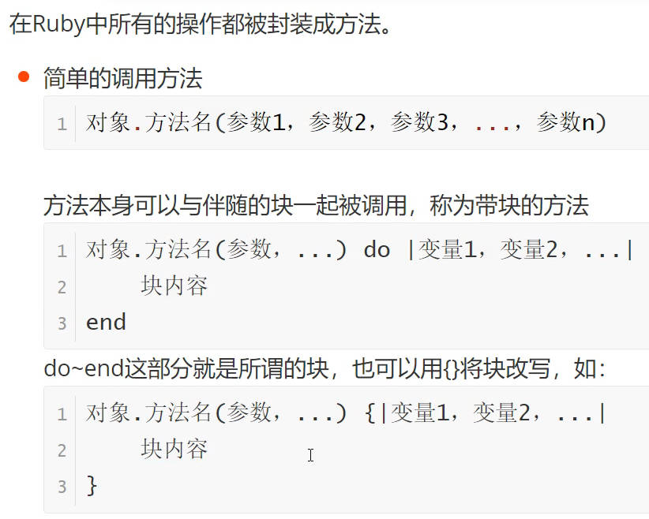
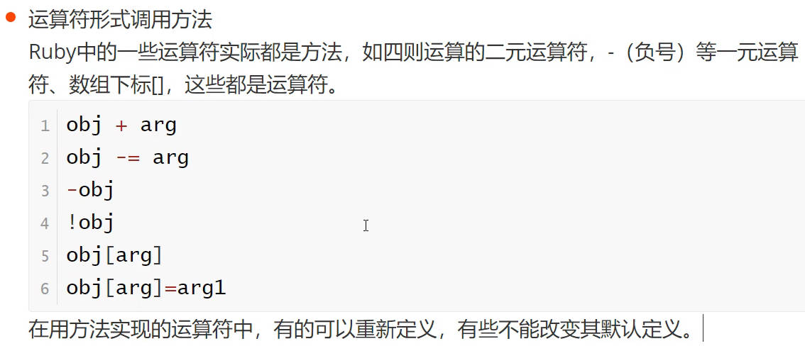
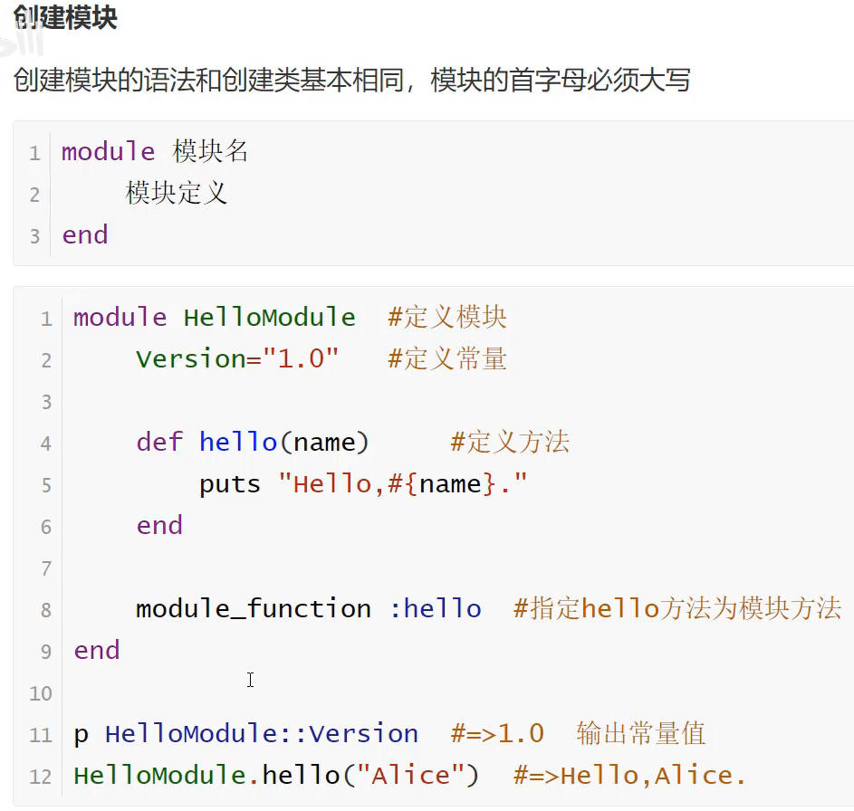
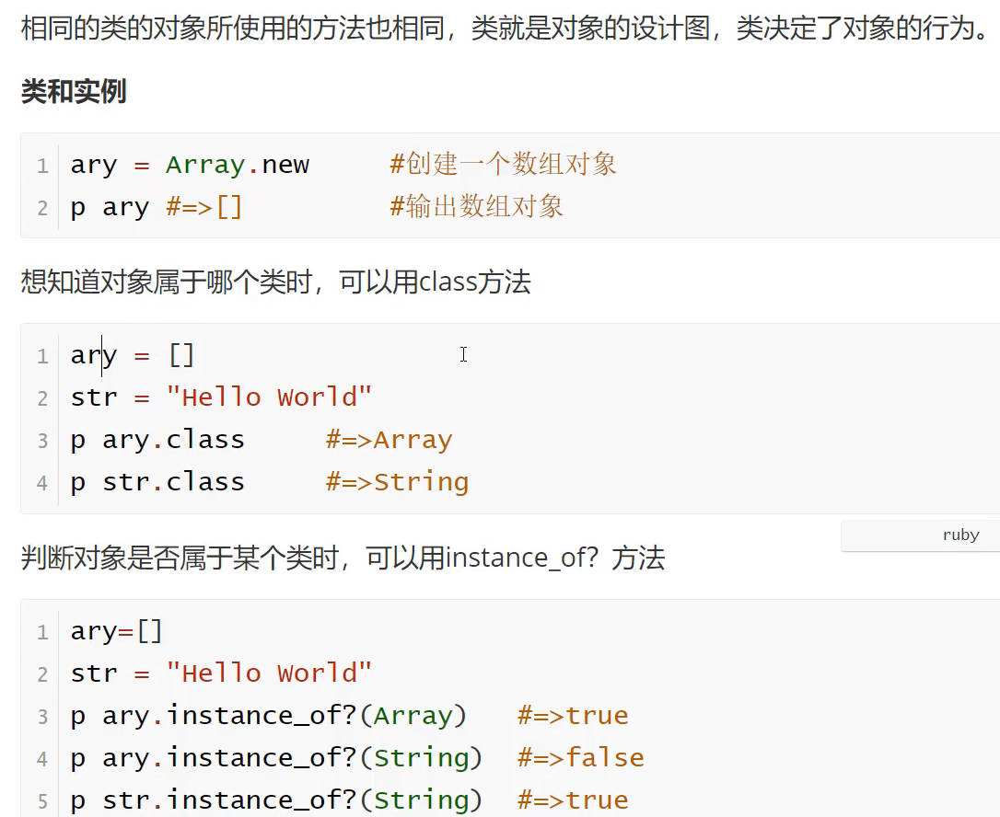
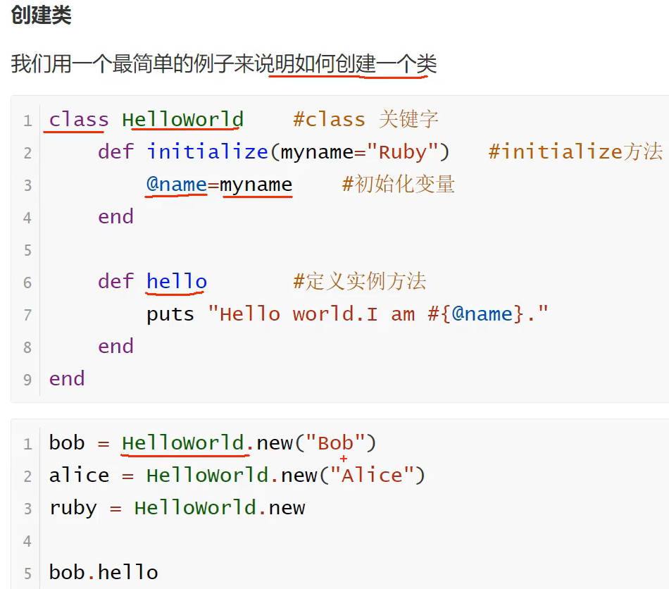
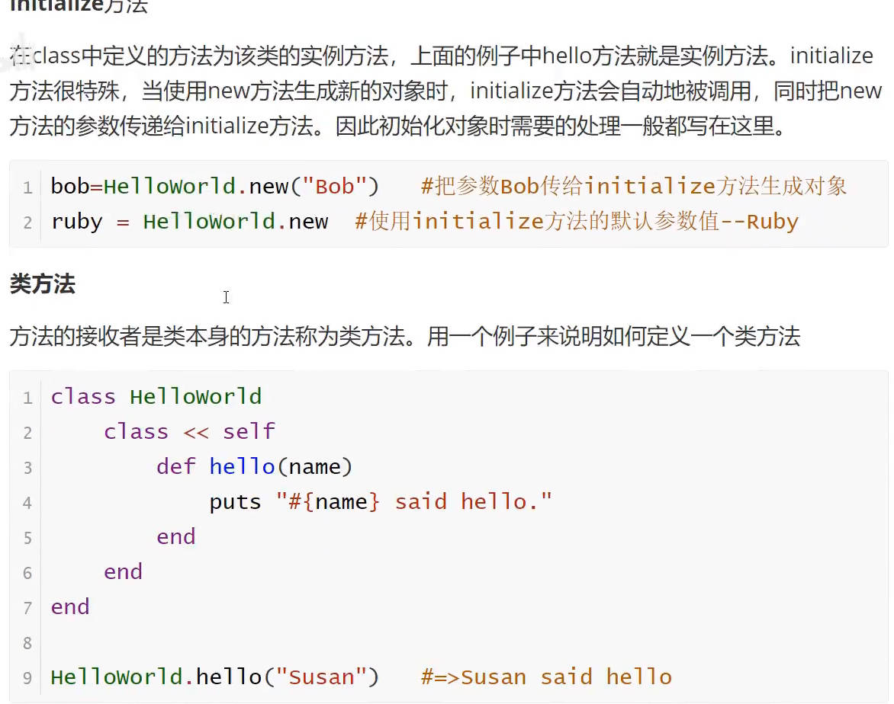
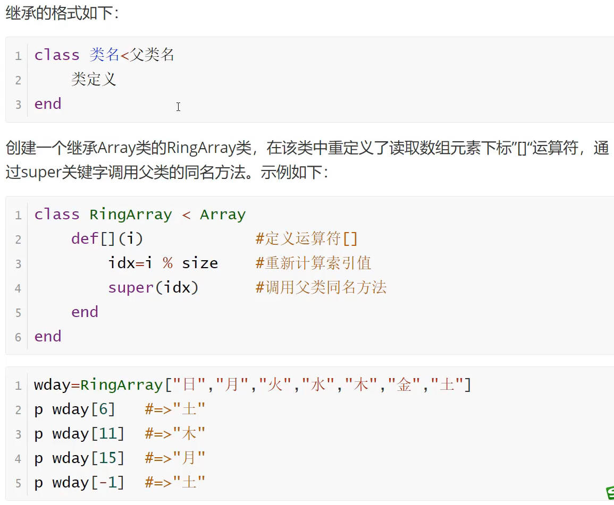
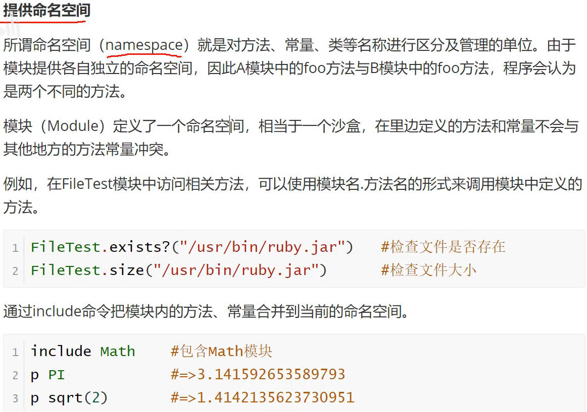
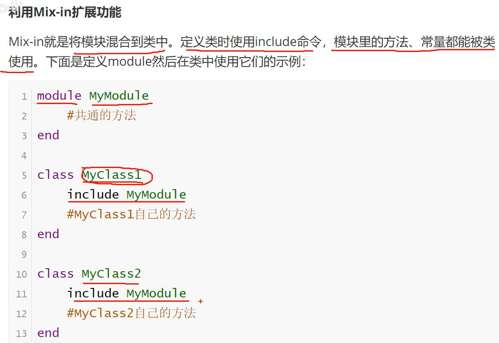

视频： [Ruby](https://www.bilibili.com/video/BV1Tm421s7SP/?p=25&spm_id_from=pageDriver&vd_source=7346303e5e18677d7261c2c0c109ecfd)   [Ruby ](https://www.bilibili.com/video/BV1QW411F7rh/) 

[Ruby|菜鸟教程](https://www.runoob.com/ruby/ruby-intro.html)  [Ruby高级开发](https://www.bilibili.com/video/BV1dB4y1b7uS/?spm_id_from=333.337.search-card.all.click&vd_source=7346303e5e18677d7261c2c0c109ecfd)  [Ruby 最快的开发语言](https://www.bilibili.com/video/BV1QW411F7rh/?spm_id_from=333.337.search-card.all.click&vd_source=7346303e5e18677d7261c2c0c109ecfd)  [Ruby on Rails](https://www.bilibili.com/video/BV1fN4y1L73c/?spm_id_from=333.337.search-card.all.click&vd_source=7346303e5e18677d7261c2c0c109ecfd)  [ruby](https://www.bilibili.com/video/BV1DJ411Y7qm/?spm_id_from=333.337.search-card.all.click&vd_source=7346303e5e18677d7261c2c0c109ecfd) [ Ruby语言介绍、优缺点、学习曲线、发展趋势、工作机会、开源项目](https://www.bilibili.com/video/BV1FH4y1k78e/?spm_id_from=333.337.search-card.all.click&vd_source=7346303e5e18677d7261c2c0c109ecfd)  [Ruby](https://www.bilibili.com/video/BV1r8411e791/?spm_id_from=333.337.search-card.all.click&vd_source=7346303e5e18677d7261c2c0c109ecfd)  [Ruby元编程](https://www.bilibili.com/video/BV1Xg41117wi/?spm_id_from=333.337.search-card.all.click&vd_source=7346303e5e18677d7261c2c0c109ecfd)  [ruby](https://www.bilibili.com/video/BV1RJ411Y7A4/?spm_id_from=333.337.search-card.all.click&vd_source=7346303e5e18677d7261c2c0c109ecfd)   [全栈Web框架Ruby on Rails](https://www.bilibili.com/video/BV1HG411L79z/?spm_id_from=333.337.search-card.all.click&vd_source=7346303e5e18677d7261c2c0c109ecfd) 

[Ruby-菜鸟教程](https://www.runoob.com/ruby/ruby-tutorial.html) 

开源面向对象程序设计的服务器端脚本语言， 20 世纪 90 年代中期由日本的松本行弘（まつもとゆきひろ/Yukihiro Matsumoto）设计并开发

# 搭建环境

[Ruby 官方网站](https://www.ruby-lang.org/zh_cn/)   [Ruby Programming Language 中文官方網頁](https://www.ruby-lang.org/zh_tw/) 

IDE： [Ruby在Windows上安装](https://www.cnblogs.com/tdskee/p/3757203.html)  [RubyMine](https://zhuanlan.zhihu.com/p/704355675) [Ruby](https://www.runoob.com/ruby/ruby-environment.html)  [RubyMine Documentation](https://www.jetbrains.com/help/ruby/set-up-a-ruby-development-environment.html) 

# 语法

Ruby 文件扩展名:  **.rb**

```ruby
#!/usr/bin/ruby
 
puts "这是主 Ruby 程序"
 
END {
   puts "停止 Ruby 程序"
}
BEGIN {
   puts "初始化 Ruby 程序"
}
```

注释 `#`

## 数据类型

- 基本类型： `Number、String、Ranges、Symbols，以及true、false和nil`
- 数据结构： Array和Hash

==数组==： `ary = [ "fred", 10, 3.14, "This is a string", "last element", ]` 

==哈希==：键值对，用逗号和序列 => 分隔   `hsh = colors = { "red" => 0xf00, "green" => 0x0f0, "blue" => 0x00f }`

==范围类型==： 通过设置一个开始值和一个结束值表示， 范围可使用 `s..e 和 s...e` 来构造，或者通过 `Range.new` 来构造

- (1..5) 包含值 1, 2, 3, 4, 5，  (1...5) 包含值 1, 2, 3, 4 

## 变量

五种变量

- 局部变量：英文字母或 `_`开头
- 全局变量：`$`开头
- 实例变量：`@` 开头
- 类变量：  `@@`开头
- 常数： Constant， 大写字母开头

## 条件判断

3种： if、unless、case

```ruby
# 1.if语句
if conditional [then]
      code...
[elsif conditional [then]
      code...]...
[else
      code...]
end
=================================  
x=1
if x > 2	[then]
   puts "x 大于 2"
elsif x <= 2 and x!=0	[then]
   puts "x 是 1"
else
   puts "无法得知 x 的值"
end
    
#  unless 条件 [then],  和if相反，条件为假，执行代码

# 2.case语句    
=================================  
case expr0
when expr1, expr2
   stmt1
else
   stmt3
end
   
$age =  5
case $age
when 0 .. 2
    puts "婴儿"
when 3 .. 6
    puts "小孩"
when 7 .. 12
    puts "child"
when 13 .. 18
    puts "少年"
else
    puts "其他年龄段的"
end
```

==if 和 unless 修饰符==

## 循环

while、for、until语句；   loop、times、each方法

**语句**

```ruby
# 1、　while
while conditional [do] 		# do 也可用 :
   code
end

#　２、until　　一直执行code, 直到条件为真；  即： 条件为假时，执行 code
until conditional [do]
   code
end

# 3、for
for variable [, variable ...] in expression [do]
   code
end

for i in 0..5
   puts "局部变量的值为 #{i}"
end
```

while、until修饰符

**方法**

```ruby
# 1、 times 单纯执行一定次数, 例如：输出10次
10.times do			# do...end 可用 {} 代替
    puts "大理石"
end

# 2、 each
expression.each do [变量]
    code
end

# 3、 loop 无限循环
loop do 
    print "Ruby"
end
```

**循环控制**

` break、next、redo`

## 方法

其它编程语言中的函数

```ruby
def method_name (var1, var2)
   expr..
end

# 调用方法，只需要使用方法名
# 可变长参数
def sample (*test)
    
# 为方法或全局变量起别名
alias 方法名 方法名
alias 全局变量 全局变量    
```

ruby方法分为

- 实例方法： 通过对象调用方法
- 类方法: 调用者是类
- 函数方法: 没有接收者(调用者)

|  |  |
| ------------------------------------------------------- | ------------------------------------------------------- |

## 块

[Ruby 块 ](https://www.runoob.com/ruby/ruby-block.html) 

- 块从与其具有相同名称的函数调用。块名为 *test*，那么要使用函数 *test* 来调用这个块
  - 可以使用 *yield* 语句来调用块
- BEGIN 和 END 块

```ruby
block_name{
   statement1
   ..........
}

===================
    

```

## 模块

模块2大功能：提供命名空间、 Mix-IN混入

- 引用模块： `require filename`
- 类中嵌入模块： 使用 *include* 语句

```ruby
module Identifier
   statement1
   ...........
end
```

Ruby 不直接支持多重继承，采用`mixin`作为替代品

- 将模块include到类定义中，模块中的方法就mix进了类中

|  |  |
| ------------------------------------------------------- | ------------------------------------------------------- |


## 面向对象

- 创建类
- 类方法: 初始化方法、类方法
- 类变量: `@@`开头，类所有实例共享的变量
- 方法的访问级别
  - public
  - private
  - protected
- 继承
- 模块的命名空间及Mix-ins

|  |  |
| ------------------------------------------------------------ | ------------------------------------------------------- |
|       |  |
|       |  |

