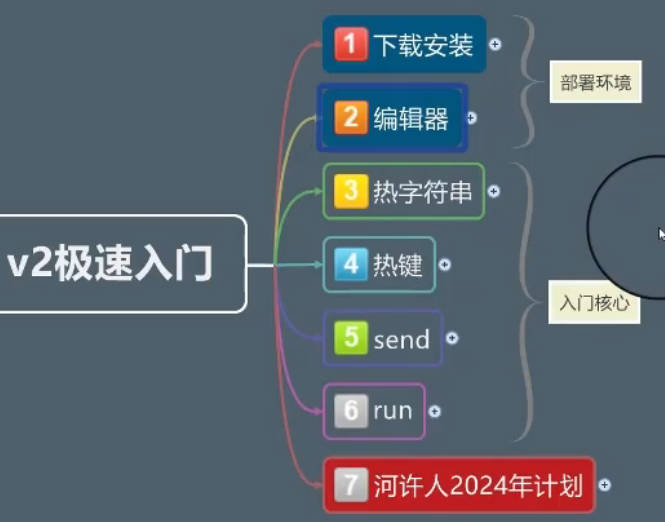

# 入门

视频： [AutoHotkey V2极速入门](https://www.bilibili.com/video/BV1x2421w7Fd/?vd_source=7346303e5e18677d7261c2c0c109ecfd)  [Adventure-CN](https://www.bilibili.com/video/BV1jw411Y7vC/?vd_source=7346303e5e18677d7261c2c0c109ecfd)  

[AHK中文社区](https://www.autoahk.com/)  [Adventure-CN编辑器](https://www.autoahk.com/archives/15290)  [AutoGUI汉化版](https://www.52pojie.cn/thread-1400836-1-1.html)  

[好：在线中文帮助](https://wyagd001.github.io/v2/docs/misc/Remap.htm#remarks)  

右键新建-AHK脚本

1. 热字符串：输入字符串执行脚本
   1. `::zi::{MsgBox "abc"}`
2. 热键：按快捷键执行
3. send：用于自动化
4. run：打开某个程序

|  |  |
| --------------------------------------------------------- | ----- |

1

```js
; 热字符串
::zi::
{
MsgBox  "abc"
}

; 热键 win + n
#n::
{
Run "notepad"
}

; alt + a
!a::
{
SendInput {TEXT}\color{green}\Large
}
```

# 进价