# LUA脚本

[好：CE自写插件提供LUA接口实现pvz僵尸绘制之上篇](https://www.52pojie.cn/thread-1369369-1-1.html)	[lua](https://www.bilibili.com/video/BV1CV4y1A7W2?vd_source=7346303e5e18677d7261c2c0c109ecfd&spm_id_from=333.788.videopod.sections)	

[Lua脚本](https://www.bilibili.com/video/BV1RQ4y1t77H/?vd_source=7346303e5e18677d7261c2c0c109ecfd)	[Lua菜鸟教程](https://www.runoob.com/lua/lua-tutorial.html)  [Lua脚本](https://www.bilibili.com/video/BV1aJ411b7Sd/?vd_source=7346303e5e18677d7261c2c0c109ecfd)	[lua](https://www.bilibili.com/video/BV1aJ411b7Sd/?p=45&vd_source=7346303e5e18677d7261c2c0c109ecfd)	

[lua脚本_ce](https://blog.csdn.net/kinghzking/article/details/129713196)	[CE](https://www.52pojie.cn/thread-1361473-1-1.html)	[CE自写插件](https://www.52pojie.cn/thread-1369787-1-1.html)		

ce自动汇编：[CEAA脚本_百度搜索](https://www.baidu.com/s?ie=UTF-8&wd=CEAA%E8%84%9A%E6%9C%AC)	

[好：Lua游戏脚本开发](https://www.bilibili.com/video/BV1U54y1e7C2?vd_source=7346303e5e18677d7261c2c0c109ecfd&p=10&spm_id_from=333.788.videopod.episodes)	

[C++游戏外挂](https://www.bilibili.com/video/BV1u14y1F78u/?vd_source=7346303e5e18677d7261c2c0c109ecfd)	[C语言到游戏外挂](https://www.bilibili.com/video/BV1Qo4y1c7FZ?spm_id_from=333.788.recommend_more_video.3&vd_source=7346303e5e18677d7261c2c0c109ecfd) 	

[Python游戏脚本](https://www.bilibili.com/video/BV1HX4y1i7pf/?vd_source=7346303e5e18677d7261c2c0c109ecfd)	

[Java开发游戏辅助外挂脚本](https://www.bilibili.com/video/BV15Z4y1W7RM/?vd_source=7346303e5e18677d7261c2c0c109ecfd)	 

[按键精灵游戏实战](https://www.bilibili.com/video/BV1a64y1W7xm/?vd_source=7346303e5e18677d7261c2c0c109ecfd)	

[易语言](https://www.bilibili.com/video/BV15pP8e5Etn?vd_source=7346303e5e18677d7261c2c0c109ecfd&p=50&spm_id_from=333.788.videopod.sections)	 

游戏引擎： [Cocos Creator3.8](https://www.bilibili.com/video/BV18m421L7Ac/?vd_source=7346303e5e18677d7261c2c0c109ecfd)	

`{$lua}`

| 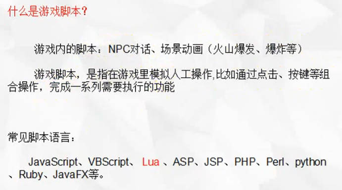 | 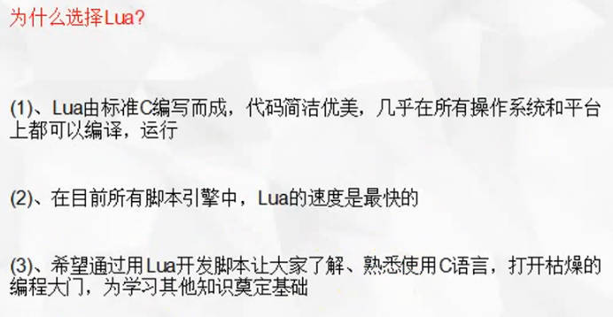 |
| ------------------------------------------------------ | ------------------------------------------------------ |
| 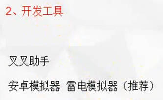 | 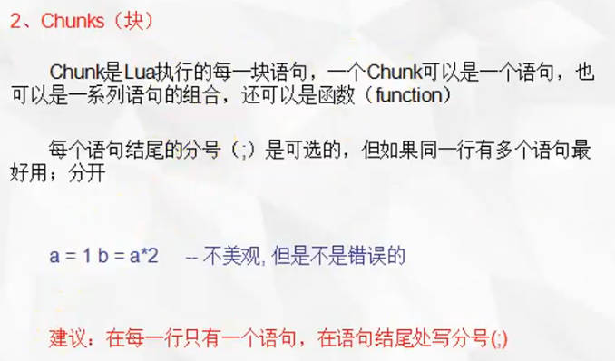 |
| 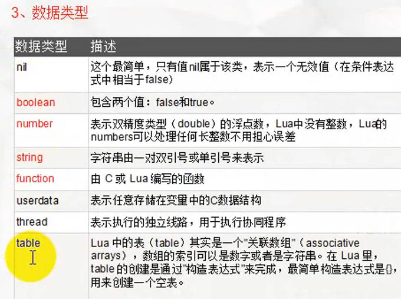 | 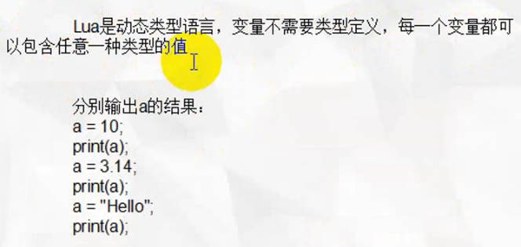 |
| 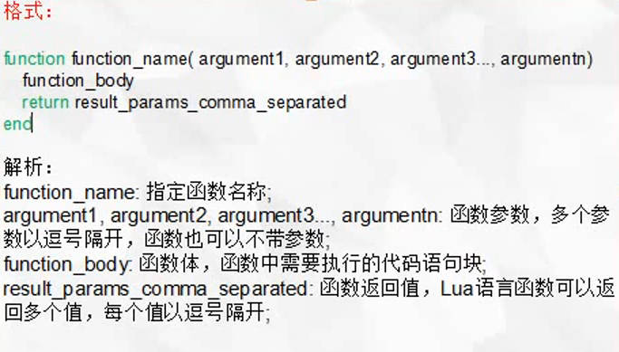 | 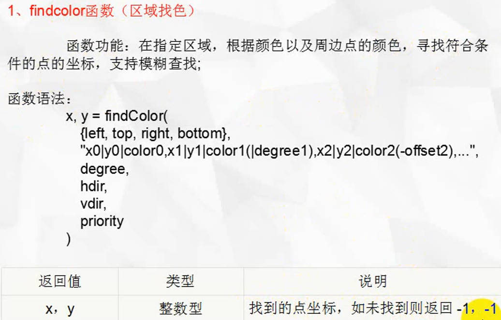 |
| 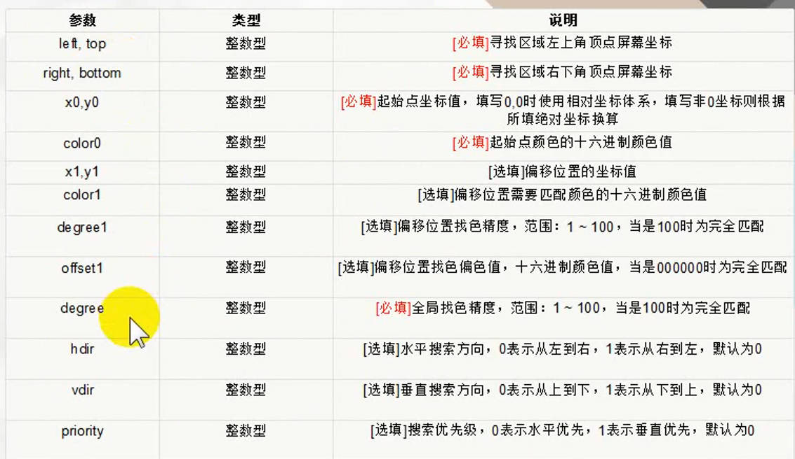 | 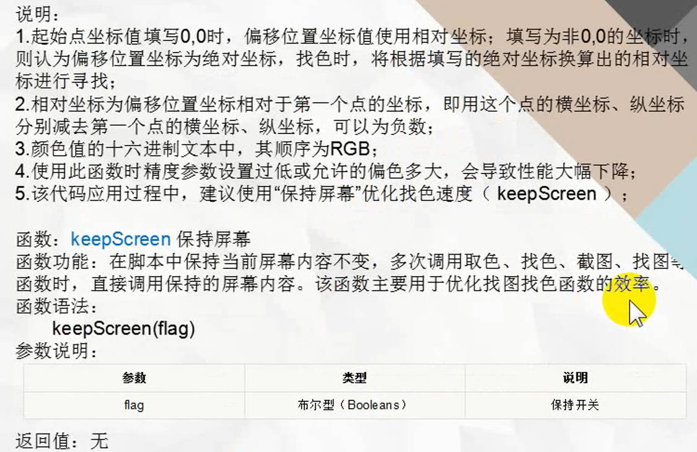 |
| 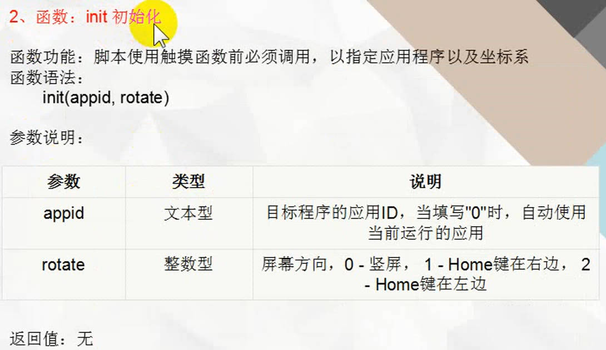 | 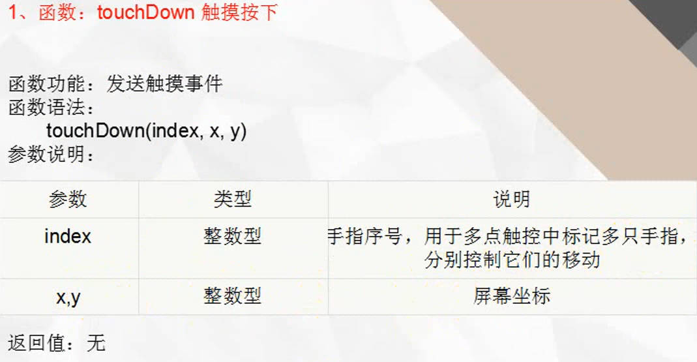 |
| 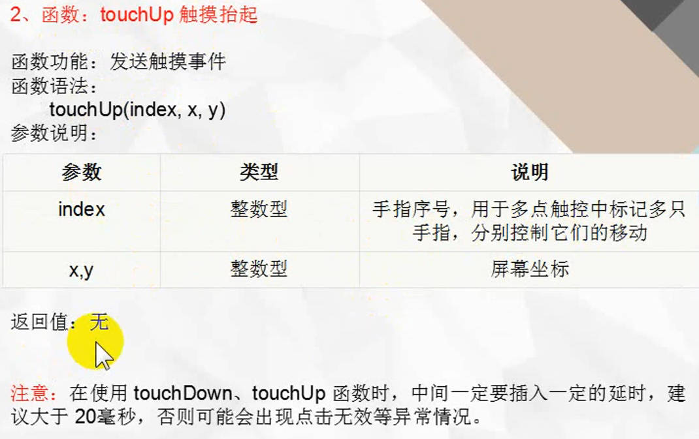 | 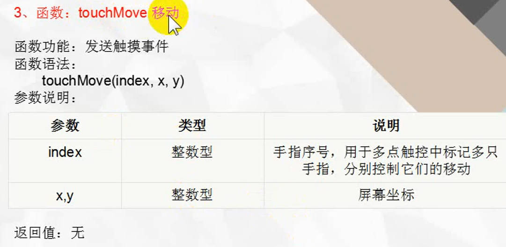 |
| 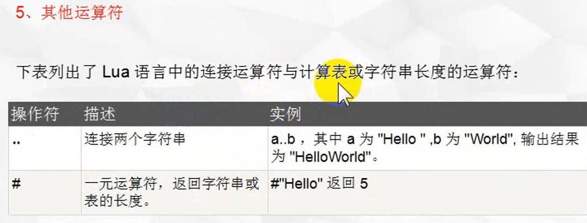 | 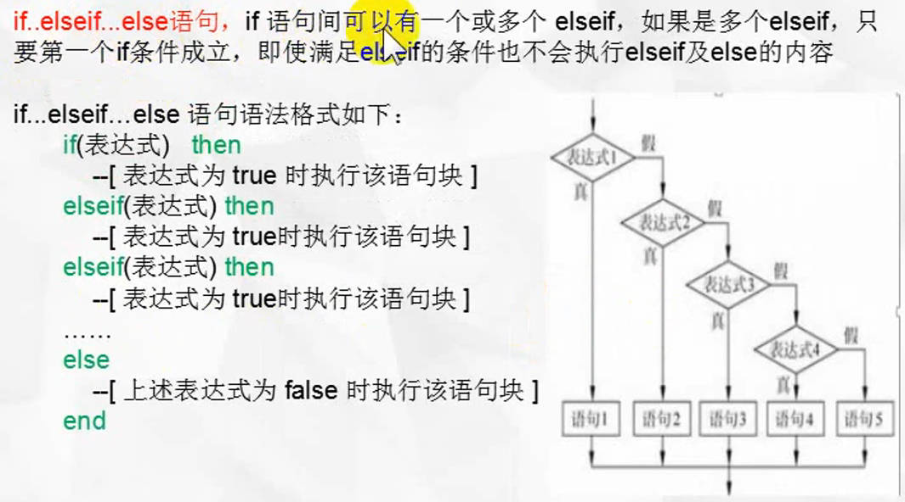 |
| 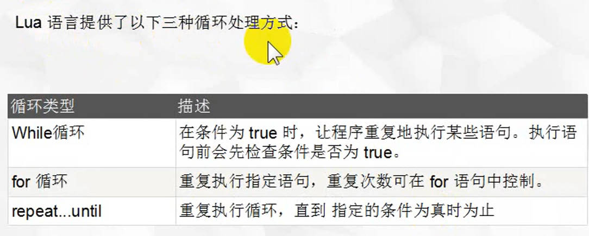 | 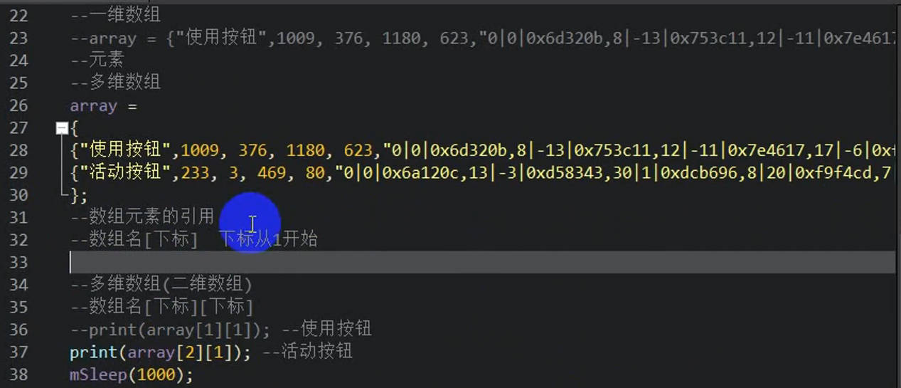 |

lua大小写敏感

> 变量

local定义局部变量:  `local aa = 0;`

> Chunks(块)

> 数组

也分全局和局部，下标从1开始

> 函数

**findcolor函数** : 根据颜色找点的坐标

相对坐标

**触摸函数**