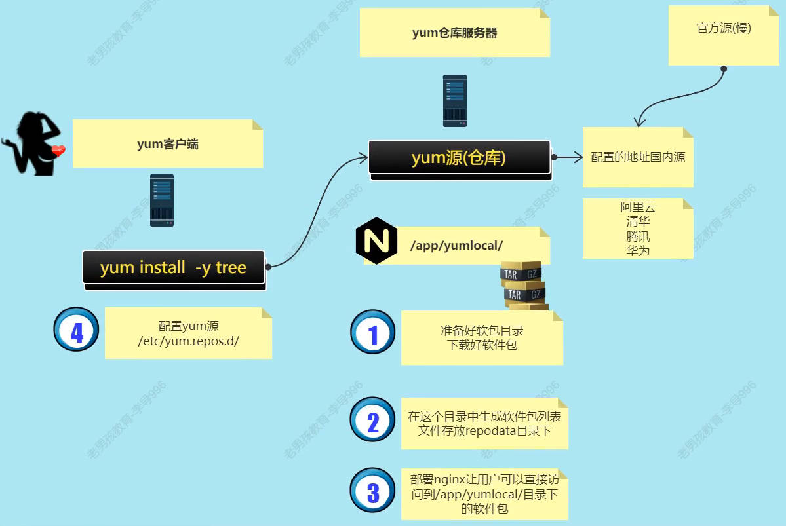
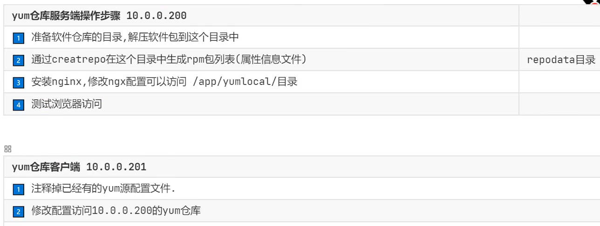

## 1、配置上网

[ifcfg-eth0配置](https://blog.csdn.net/YiWangJiuShiXingFu/article/details/82048048) [虚拟机网络配置](https://cloud.tencent.com/developer/article/2077957)  [Centos7 最小化安装网络配置](https://www.cnblogs.com/junlin623/p/17051558.html) [网络设置](https://blog.csdn.net/tangbin0505/article/details/100592275) [上网](https://blog.csdn.net/qq_39247952/article/details/114521999)  [SSH连接不上](https://blog.csdn.net/qq_19783793/article/details/105774909)

1. ifcfg-eth0
   `/etc/sysconfig/network-scripts/ifcfg-eth0`
   ONBOOT:启动时激活该网络接口;   BOOTPROTO:static、dhcp、none不使用

2. 重启网络服务
   `systemctl restart network.service ;  service network restart` ; ping www.baidu.com
3. 配置ssh
   centos查看ssh是否安装：`rpm -qa | grep ssh`

## 2、配置镜像源

[阿里镜像源](https://developer.aliyun.com/article/748140?spm=5176.26934562.main.2.3c031c3eHVlT6E) [centos镜像](https://developer.aliyun.com/mirror/centos?spm=a2c6h.13651102.0.0.3e221b1182hW0d)
[阿里巴巴开源镜像站](https://developer.aliyun.com/mirror/)

## 3、本地yum仓库

[部署企业内部yum仓库](https://www.bilibili.com/video/BV1qb421i7Ey?p=5&vd_source=7346303e5e18677d7261c2c0c109ecfd) 

|  |  |
| ----------------------------------------------------- | ----------------------------------------------------- |

### yum服务端

- 创建目录，仓库放入软件

  ```sh
  mkdir -p /app/yumlocal/
  tar xf php72w-new.tar.gz -C /app/yumlocal		# 软件
  ```

- 通过creatrepo==生成rpm包列表==； repodata目录

  ```sh
  yum install createrepo
  createrepo /app/yumlocal/
  ```
  
- 安装配置nginx

  ```sh
  rpm -ql nginx			# dpkg -L -S
  # 配置nginx
  ## /etc/nginx/conf.d/yum.conf 
  server {
  	listen 12306;                    
  	root  /app/yumlocal;
  	autoindex on;   
  	index index.html;
  }
  ```

### yum客户端

- 注释掉yum.repos.d/目录下的所有repo; 写==本地源==

  ```
  gzip *					# 解压gzip -d
  vim yumlocal.repo
  [yumlocal]
  name='内部yum源'
  baseurl=http://10.0.0.200:12306
  enabled=1
  gpgcheck=0
  ```

- 测试

  ```
  yum clean all		#清空缓存
  yum makecache   	#生成缓存
  yum repolist		#查看yum源列表
  ```

- 需要依赖

  ```
  grep keepcache /etc/yum.conf	# 打开keepcache
  yum localinstall *.rpm			# yum能解决依赖, 下载并保存到cache
  find /var/cache/yum -type f -name "*.rpm" | xargs cp -t | xargs cp -t /app/yumlocal
  ```

  

