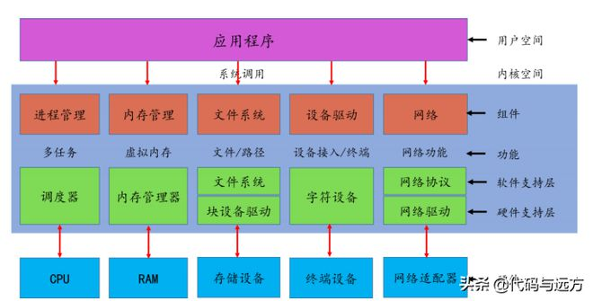
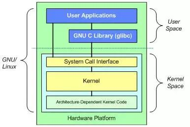
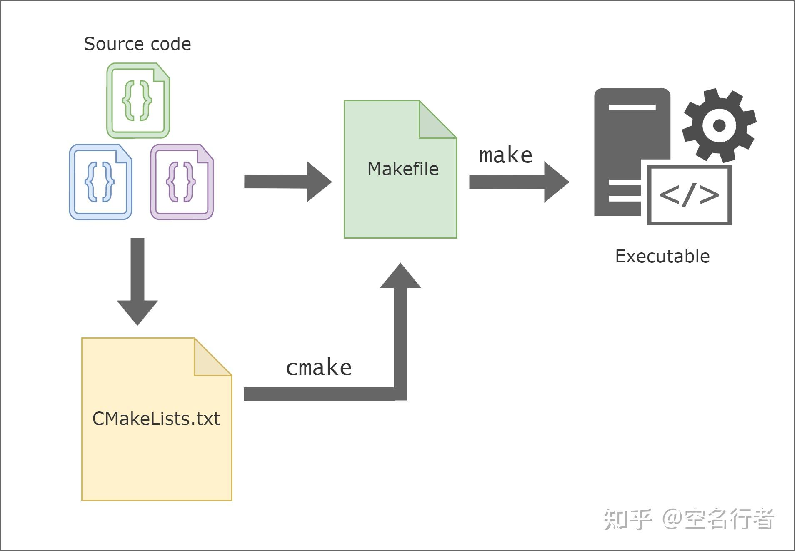
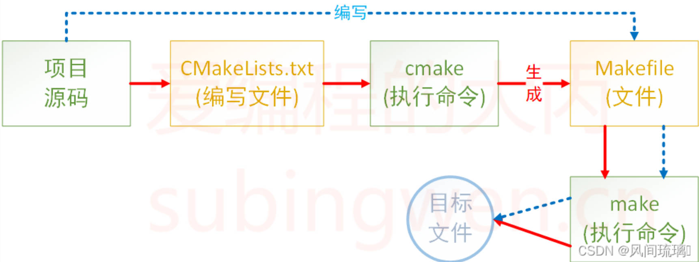
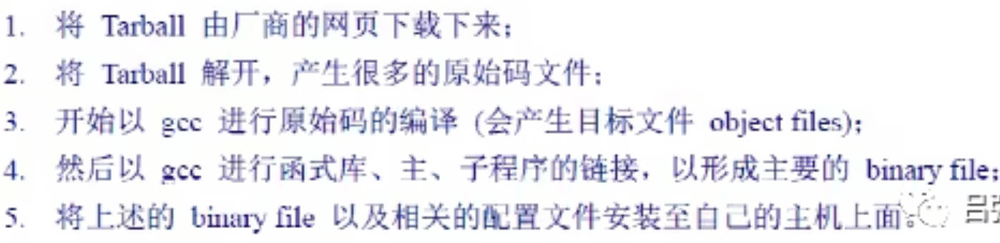
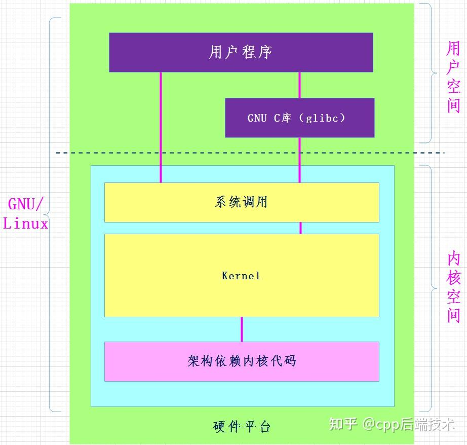
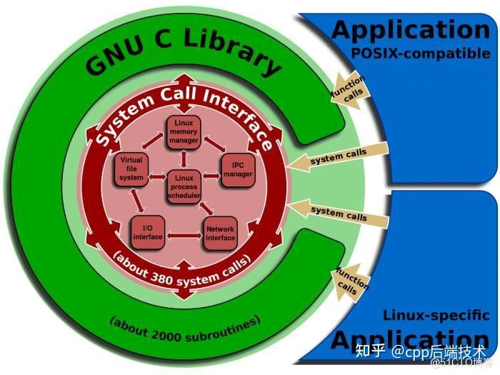
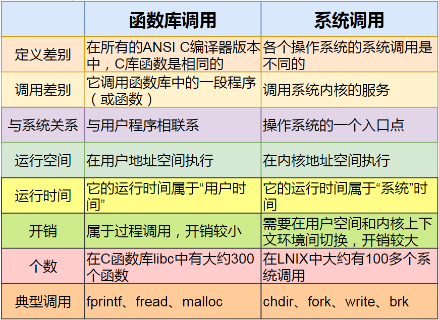

# linux启动过程

[Linux如何启动](https://www.bilibili.com/video/BV1fPRuYYECH/?vd_source=7346303e5e18677d7261c2c0c109ecfd)	

# 内核架构和工作原理

[Linux内核架构和工作原理](https://blog.csdn.net/jinking01/article/details/104547290)  [Linux内核架构和工作原理详解](https://zhuanlan.zhihu.com/p/467031215)  [Linux内核介绍&内核升级](https://blog.csdn.net/weixin_46258766/article/details/132597254?utm_medium=distribute.pc_relevant.none-task-blog-2~default~baidujs_baidulandingword~default-4-132597254-blog-104547290.235^v43^pc_blog_bottom_relevance_base9&spm=1001.2101.3001.4242.3&utm_relevant_index=7)

[Linux内核](https://www.bilibili.com/video/BV1aDqtYAE3b/?vd_source=7346303e5e18677d7261c2c0c109ecfd) 	

作用： 内核是硬件与软件之间的一个中间层；  将应用层序的==请求传递给硬件，并充当底层驱动程序==，对系统中的各种设备和组件进行寻址；  支持模块的动态装卸(裁剪)

## 内核实现策略

- **微内核**：  最基本的功能由中央内核（微内核）实现；  其他功能委托给一些独立进程，这些进程==通过==明确定义的通信==接口与中心内核通信==
- **宏内核**： 内核的所有代码，包括子系统（如内存管理、文件管理、设备驱动程序）都==打包到一个文件==中。==内核中的每一个函数都可以访问到内核中所有其他部分==

## 内核源代码的目录结构

[Linux内核--五大子系统](https://blog.csdn.net/hhhlizhao/article/details/131860078)  [Linux 内核的整体架构](https://www.163.com/dy/article/GAU9O72F05524YV8.html) 

内核源代码包括三个主要部分

- 内核核心代码
- 其它非核心代码
- 编译脚本、配置文件、帮助文档、版权说明等==辅助性文件==

[进程调度](https://so.csdn.net/so/search?q=进程调度&spm=1001.2101.3001.7020)系统(Process Scheduler)、虚拟文件系统(VFS)、内存管理单元(MMU)、网络单元、进程间通信(IPC InterProcess Communication)

|  |  |
| ------------------------------- | ------------------------------ |

Linux 内核可以进一步划分成 3 层

1. 最上面是==系统调用接口==，它实现了一些基本的功能，例如 read 和 write
2. 系统调用接口之下是==内核代码==，为==独立于体系结构的内核代码==。这些代码是 Linux 所支持的==所有处理器体系结构所通用的==
3. 在这些代码之下是==依赖于体系结构的代码==，称为 BSP（Board Support Package）。用作==给定体系结构的处理器和特定于平台的代码==

## Linux体系结构和内核结构区别

Linux体系结构可以分为两块： 为了保护内核的安全， 可以通过“系统调用”和“硬件中断“来完成用户空间到内核空间的转移

（1）==用户空间==：用户空间中又包含了，用户的应用程序，C库

（2）==内核空间==：内核空间包括，系统调用，内核，以及与平台架构相关的代码


# 升级内核

[Ubuntu安装/切换内核](https://www.cnblogs.com/ishmaelwanglin/p/17428837.html)   [ubuntu安装软件时出现 initramfs-tools错误](https://blog.csdn.net/2301_76965285/article/details/137588266?spm=1001.2101.3001.6650.2&depth_1-utm_source=distribute.pc_relevant.none-task-blog-2%7Edefault%7EYuanLiJiHua%7ECtr-2-137588266-blog-80798088.235%5Ev43%5Epc_blog_bottom_relevance_base5)    [升级、降级linux内核](https://www.jianshu.com/p/cccc2982f604)  [linux-headers 和 linux-image](https://wiki.t-firefly.com/zh_CN/Firefly-Linux-Guide/linux-headers.html) 

[ubuntu dpkg initramfs-tools错误的解决方法](https://blog.csdn.net/Spada_k/article/details/80798088)  [Errors were encountered while processing: initramfs-tools_百度搜索](https://www.baidu.com/s?ie=UTF-8&wd=Errors%20were%20encountered%20while%20processing%3A%20initramfs-tools) 

[extboot.img与boot.img_百度搜索](https://www.baidu.com/s?ie=utf-8&f=3&rsv_bp=1&tn=baidu&wd=extboot.img%E4%B8%8Eboot.img&oq=extboot&rsv_pq=9d65890601b1ecf0&rsv_t=d725QwkKVam8sZiShVv7xTG75yErzkZ%2B9EAwDjRmdGUyPsidKdKT25bRsUk&rqlang=cn&rsv_enter=1&rsv_dl=ts_1&rsv_sug3=1&rsv_sug1=1&rsv_sug7=100&rsv_sug2=0&rsv_btype=t&prefixsug=extboot&rsp=1&inputT=1114&rsv_sug4=8879&rsv_sug=1)   [firefly-extboot的生成脚本](https://blog.csdn.net/zhaozhi0810/article/details/134501141)  

[linux内核版本介绍](https://cloud.tencent.com/developer/article/2127465) 

[linux-image-generic_百度搜索](https://www.baidu.com/s?ie=UTF-8&wd=linux-image-generic) 

## 1、

[升级内核](https://blog.csdn.net/weixin_46258766/article/details/132597254?utm_medium=distribute.pc_relevant.none-task-blog-2~default~baidujs_baidulandingword~default-4-132597254-blog-104547290.235^v43^pc_blog_bottom_relevance_base9&spm=1001.2101.3001.4242.3&utm_relevant_index=7)

内核升级时，无需自己挑选Linux内核，有相应的指令可以帮我们迅速匹配并升级

```sh
# 查看当前已安装的内核
dpkg --get-selections |grep linux
# 删除多余的内核
apt-get remove linux-image-<版本号>
# 安装指定版本内核
apt list linux-headers-6.8.*-*-generic  linux-image-6.8.*-*-generic
apt install linux-headers-6.8.0-36-generic  linux-image-6.8.0-36-generic
# 更新initramfs
update-initramfs -u -k all
# 修改引导菜单

uname -a            # 查看当前的内核版本 -r
yum info kernel -q  # 检测内核版本，显示可以升级的内核
yum update kernel   # 升级内核
yum list kernel -q  # 查看已经安装的内核
```

## 2、

[Linux内核版本介绍](https://blog.csdn.net/Ruishine/article/details/134879203)  [centos7升级内核_百度搜索](https://www.baidu.com/s?ie=utf-8&f=8&rsv_bp=1&tn=baidu&wd=centos7%E5%8D%87%E7%BA%A7%E5%86%85%E6%A0%B8&rn=20&oq=linux%25E6%259C%2580%25E6%2596%25B0%25E5%2586%2585%25E6%25A0%25B8&rsv_pq=8a12d169002eaa8c&rsv_t=1177JjRgBYrXTzAIoFi6CzYj8gD4uQJa2jeCBHaoAFAwP5nVrco%2FiPtn3Ec&rqlang=cn&rsv_enter=1&rsv_dl=tb&rsv_btype=t&inputT=12912&rsv_sug3=30&rsv_sug1=25&rsv_sug7=100&rsv_sug2=0&rsv_sug4=12913)   [CentOS 8/6宣布停用后，有哪些最佳替代方案](https://hardywang.blog.csdn.net/article/details/124219848?spm=1001.2101.3001.6661.1&utm_medium=distribute.pc_relevant_t0.none-task-blog-2%7Edefault%7ECTRLIST%7ERate-1-124219848-blog-135711947.235%5Ev43%5Epc_blog_bottom_relevance_base9&depth_1-utm_source=distribute.pc_relevant_t0.none-task-blog-2%7Edefault%7ECTRLIST%7ERate-1-124219848-blog-135711947.235%5Ev43%5Epc_blog_bottom_relevance_base9&utm_relevant_index=1)   [Linux内核如何与硬件交互](https://baijiahao.baidu.com/s?id=1797959509088971385&wfr=spider&for=pc) 

CentOS 7 升级内核的步骤如下：

1. 查看当前内核版本：

```
uname -r
```

2. 导入 ELRepo 公钥：

```
rpm --import https://www.elrepo.org/RPM-GPG-KEY-elrepo.org
```

3. 安装 ELRepo 仓库：

```
yum install https://www.elrepo.org/elrepo-release-7.el7.elrepo.noarch.rpm
```

4. 启用 ELRepo 仓库：

```
yum --enablerepo=elrepo-kernel install kernel-ml
```

5. 安装最新的主线版内核：

```
yum --enablerepo=elrepo-kernel install kernel-ml-devel
```

6. 更新 GRUB 配置并设置为默认启动项：

```sh
egrep ^menuentry /etc/grub2.cfg | cut -f 2 -d \'
grub2-set-default 0
grub2-mkconfig -o /boot/grub2/grub.cfg
```

7. 重启系统

请注意，内核升级可能会影响系统稳定性和兼容性，建议在测试环境中先进行测试，确认无误后再在生产环境中升级。


[用apt安装软件错误 The following packages have unmet dependencies](https://www.baidu.com/s?ie=utf-8&f=8&rsv_bp=1&tn=baidu&wd=%E7%94%A8apt%E5%AE%89%E8%A3%85%E8%BD%AF%E4%BB%B6%E9%94%99%E8%AF%AF%20The%20following%20packages%20have%20unmet%20dependencies&rn=20&oq=%25E7%2594%25A8apt%25E5%25AE%2589%25E8%25A3%2585%25E8%25BD%25AF%25E4%25BB%25B6%25E9%2594%2599%25E8%25AF%25AF&rsv_pq=9ed09544006fbaa5&rsv_t=bccdCchK7YoDOg9eHvd9evWD%2Br3lx47z9U8GUUEfrHVH0y%2FOuqGeIP%2Fwxys&rqlang=cn&rsv_enter=0&rsv_dl=tb&rsv_btype=t&inputT=3548&rsv_sug3=10&rsv_sug1=9&rsv_sug7=100&rsv_n=2&rsv_sug4=3740)  [ubuntu虚拟机禁用内核更新](https://blog.csdn.net/qq_24950043/article/details/124700626)   [linux-image-6.8.0-31-generic升级_百度搜索](https://www.baidu.com/s?ie=UTF-8&wd=linux-image-6.8.0-31-generic%E5%8D%87%E7%BA%A7)    [The following packages have unmet dependencies问题](https://anthonydave.blog.csdn.net/article/details/88934783?spm=1001.2101.3001.6650.5&utm_medium=distribute.pc_relevant.none-task-blog-2%7Edefault%7ECTRLIST%7ERate-5-88934783-blog-80151595.235%5Ev43%5Epc_blog_bottom_relevance_base9&depth_1-utm_source=distribute.pc_relevant.none-task-blog-2%7Edefault%7ECTRLIST%7ERate-5-88934783-blog-80151595.235%5Ev43%5Epc_blog_bottom_relevance_base9&utm_relevant_index=10)  [linux-image-generic](https://www.baidu.com/s?ie=UTF-8&wd=linux-image-generic%20%3A%20Depends%3A%20linux-image-6.8.0-35-generic%20but%20it%20is%20not%20going%20to%20be%20installed) 

```sh
apt-get update
apt-get -f install			# 修复损坏的依赖， 或者用 aptitude或apt-get的-d选项来尝试自动解决依赖问题

apt upgrade									# 升级所有包，包括内核
apt list -a linux-image-*					# 手动指定内核版本,查找可用的内核版本
apt install linux-image-6.8.0-31-generic	# 安装特定版本的内核
uname -r
```


# 自动化构建工具

[Linux 开发中常见编译工具](https://www.zhihu.com/question/635135309/answer/3327623461) 

- 蓝色虚线： 使用makefile构建项目的过程；    红色实线： 使用cmake构建项目的过程

|  |  |
| -------------------------------------- | -------------------------------------------------------- |

## C

[编译预处理](https://blog.csdn.net/Destiny_zc/article/details/108817480)   [编译器是如何工作的](https://zhuanlan.zhihu.com/p/694826051)  [文件编译和预处理](https://blog.csdn.net/weixin_45153969/article/details/130173481)   [程序详细编译过程【预处理、编译、汇编、链接】](https://blog.csdn.net/restore_1/article/details/136000496)   [【C语言】程序的编译、预处理](https://cloud.tencent.com/developer/article/2341630)   [预处理与编译](https://www.cnblogs.com/noticeable/p/9310798.html)  [编译的四个过程-预处理、编译、汇编、链接](https://blog.csdn.net/shengGod/article/details/124403212)     [Makefile and Make](https://www.cnblogs.com/mathlife/p/9120350.html)   

[函式库_百度搜索](https://www.baidu.com/s?ie=UTF-8&wd=%E5%87%BD%E5%BC%8F%E5%BA%93)  [动态与静态函式库](https://www.cnblogs.com/uetucci/p/7792048.html) 

[gcc/g++编译流程](https://baike.baidu.com/item/g%2B%2B/8324824?fr=ge_ala) 

```sh
gcc/g++编译流程

# 预处理，生成.i的文件[预处理器cpp]
# 将预处理后的文件转换成汇编语言，生成文件.s[编译器egcs]
# 由汇编变为目标代码（机器代码）生成.o的文件[汇编器as]
# 连接目标代码，生成可执行程序[链接器ld]
```

若干个源文件经过编译之后生成若干个==目标文件==。经过[链接器](https://so.csdn.net/so/search?q=链接器&spm=1001.2101.3001.7020)==把目标文件和所需要的库函数==链接起来，生成可执行程序

```sh
# 预处理:	展开头文件/宏替换/去掉注释/条件编译	（  test.i  main .i  ）
# 编译:	检查语法，生成汇编					 （  test.s  main.s ）
# 汇编:	汇编代码转换机器码   				 (  test.o main.o  )
# 链接:	链接到一起生成可执行程序				a.out
```

- 在C++编译过程中，最后一步需要进行链接，如果程序依赖于外部库，**链接器将库文件与程序的目标文件结合起来**。
  - `静态链接`: **库的代码被复制到最终的可执行文件中** 
    - A和B依赖**静态链接库 static library**，A和B在运行时，内存中会有多份static library
  - `动态链接`: **程序在运行时加载依赖的库** 
    - A和B依赖**动态链接库 shared library**，A和B在运行时，内存中只有一份 shared library（shared：共享）
    - 动态链接库加载后，**在内存中仅保存一份拷贝**，多个程序依赖它时，**不会重复加载和拷贝**，`节省内存空间` 

## Cmake

[CMake vs Makefile](https://www.cnblogs.com/xiaowange/p/17435839.html)   [CMake构建跨平台项目](https://blog.csdn.net/qq_53144843/article/details/136040086?utm_medium=distribute.pc_relevant.none-task-blog-2~default~baidujs_baidulandingword~default-0-136040086-blog-131527660.235^v43^pc_blog_bottom_relevance_base9&spm=1001.2101.3001.4242.1&utm_relevant_index=3)   

- 自己动手写 makefile，会发现，makefile 通常==依赖于当前的编译平台==，而且编写 makefile 的工作量比较大，解决依赖关系时也容易出错
- CMake 恰好能解决上述问题， 允许开发者指定整个工程的编译流程，再根据编译平台，自动生成本地化的Makefile和工程文件，最后用户只需make编译即可；   CMake: ==自动生成 Makefile的工具==

## make

[make和make install的区别](https://www.cnblogs.com/LiuChang-blog/p/12360328.html)   [好：Linux安装软件必学之一make编译](https://www.bilibili.com/read/cv16404938/) 

[Linux编译gcc/g++、自动化构建工具make/makefile](https://cloud.tencent.com/developer/article/2253437)   [Linux项目自动化构建工具-make/makefile](https://blog.csdn.net/xz2935117143/article/details/131527660)  [Linux 自动化构建工具](https://blog.csdn.net/ZYK069/article/details/131714340)  [Linux项目自动化构建工具——make/Makefile](https://blog.csdn.net/Merrill_Rosie/article/details/137500498)   

[make install](https://www.baidu.com/s?ie=utf-8&f=8&rsv_bp=1&tn=baidu&wd=make%20install%E6%8A%8A%E6%B1%87%E7%BC%96%E8%BD%AC%E6%8D%A2%E4%B8%BA%E4%BA%8C%E8%BF%9B%E5%88%B6&rn=20&oq=make%2520install&rsv_pq=c28f248b0102b2ec&rsv_t=2cfbBSOUBmFokw2SU6Kyj57p6AsIsSOWSCRCAzAa6tniQ2gcU1v5oErC3LA&rqlang=cn&rsv_enter=1&rsv_dl=tb&rsv_sug3=29&rsv_sug1=17&rsv_sug7=100&rsv_sug2=0&rsv_btype=t&inputT=9396&rsv_sug4=9396)  [Linux命令详解./configure、make、make install 命令_configure命令](https://blog.csdn.net/u012060033/article/details/105134757) 

[Taskfile - 比 Makefile 更好用的构建工具](https://zhuanlan.zhihu.com/p/505320717)  [Linux环境下如何实现自动化编译](https://blog.csdn.net/m0_65679465/article/details/128675925)  

[./configure、make、make install](https://zhuanlan.zhihu.com/p/656439069)   [好：gcc用法](https://www.bilibili.com/read/cv16404938/) 

==configuration== :  [configure](https://blog.csdn.net/Long_xu/article/details/135445569) [configure参数](https://www.renrendoc.com/paper/144880579.html)  

==build:==  [make -j$(nproc)](https://baijiahao.baidu.com/s?id=1799095618250545117&wfr=spider&for=pc)  [make常用选项+gcc选项](https://blog.csdn.net/challenglistic/article/details/127929399)  [make选项](https://www.baidu.com/s?ie=UTF-8&wd=make%E9%80%89%E9%A1%B9) 

安装： [bash:make:commandnotfound  ](https://www.kdun.com/ask/35832.html)  

源码状态------------>二进制码状态----------------->复制到系统指定目录

- 使用Makefile的主要目的是为了==自动化构建==和管理项目
  - Makefile是文本文件，包含了一系列规则和命令，用于==告诉构建工具如何编译、链接和生成项目中的各个组件==
- make是一条命令，makefile是一个文件，两个搭配使用，完成项目自动化构建       [编译安装nginx全流程](https://www.bilibili.com/video/BV1qb421i7Ey?p=2&spm_id_from=pageDriver&vd_source=7346303e5e18677d7261c2c0c109ecfd) 
  - configure用来==生成 Makefile==，为下一步的编译做准备
  - make用来==自动化编译==， 生成汇编 （linux应该是生成二进制文件）
  - make install： 将编译生成的二进制文件、库文件、配置文件等==复制或链接到预定的安装目录==
    - 生成的二进制文件**复制**到系统指定目录(本质与rpm安装软件一致)

1. 为什么==有的软件解压就能用==，有的直接make，还有的先configure然后再make
   1. **configure侦测用户环境**： 软件开发商会写一支侦测程序来==侦测用户的作业环境==，以及该作业环境是否有软件开发商所需要的其他功能，该侦测程序侦测完毕后，就会主动的==建立 Makefile== 的规则文件啦！通常这支`侦测程序的文件名为 configure 或者是 config` 
      1. configure脚本为了==让程序能够在各种不同类型的机器上运行==而设计的。在使用make编译源代码之前，configure会根据自己所依赖的库而在目标机器上进行匹配
   2. make ==调用所需要的数据==来编译
2. ==tar.gz==:  Tarball 文件，将软件的所有原始码文件先以 tar 打包，再压缩，常见的是 gzip 压缩; 用了 tar 与 gzip
   1. 近来由于 bzip2 与 xz 的==压缩率较佳==，所以 Tarball渐渐的以 bzip2 及 xz 的压缩技术来取代 gzip。因此档名也会变成 *.tar.bz2,  *.tar.xz 

 

==make-guile==:  Guile 的 make 模块。Guile 是一个用 Scheme 语言编写的可扩展的编程语言解释器和库。make-guile 是一个用 Guile 编写的 make 工具，它提供了一些扩展功能，例如更好的错误处理和更丰富的函数库。安装 make-guile 可以让你使用 Guile 版本的 make 工具来执行 Makefile 文件。

## xmake

[C/C++ 项目自动化构建--Xmake](https://blog.csdn.net/yyz_1987/article/details/124149706)  [xmake安装 ](https://xmake.io/#/zh-cn/guide/installation?id=master%e7%89%88%e6%9c%ac)  [xmake ](https://gitee.com/tboox/xmake/) [TBOOX开源工程](https://tboox.org/cn) 

- 轻量级跨平台C/C++构建工具，采用lua语法接口API描述项目，提供依赖检测、编译、打包、安装、运行、调试一条龙服务

## Meson

[Meson构建系统](https://www.cnblogs.com/im18620660608/p/18003326)  [The Meson Build system](https://mesonbuild.com/)    [使用meson构建文件生成Makefile](https://www.volcengine.com/theme/8955069-S-7-1)  [Meson构建系统](https://blog.csdn.net/Eng_ingLi/article/details/135213616)  [mesonbuild](https://www.baidu.com/s?ie=utf-8&f=8&rsv_bp=1&tn=baidu&wd=mesonbuild&rn=20&oq=mesonbuild%25E6%2595%2599%25E7%25A8%258B&rsv_pq=90852d9101120d0c&rsv_t=e584w6zrfC06vwpx2YQqREi0ANa3LoX8octfLwvAmRt8IOG4Ui0HlMSGaBc&rqlang=cn&rsv_enter=0&rsv_dl=tb&rsv_btype=t&inputT=2535&rsv_sug3=39&rsv_sug1=28&rsv_sug7=100&rsv_sug4=3026&rsv_sug=1)  

- meson: 基于Python实现的[开源项目](https://so.csdn.net/so/search?q=开源项目&spm=1001.2101.3001.7020)。它与Ninja工具配合使用，==Meson负责构建项目依赖关系，Ninja进行编译==

## m4

[m4, autotools, configure, Makefile](https://blog.csdn.net/baixiaoshi/article/details/80835207)   [Linux下的C编译工具链autotools](https://blog.51cto.com/cerana/6361486)   [GNU Make手册之M4宏处理语言入门](https://firfor.cn/articles/2022/05/18/1652884274963.html)   [m4, autoconf](https://www.cnblogs.com/milton/p/7754169.html)  [宏](https://baike.baidu.com/item/%E5%AE%8F/2648286?fr=aladdin)   [C语言之宏详解](https://blog.csdn.net/weixin_64038246/article/details/131850405)  [什么是宏](https://www.baidu.com/s?ie=utf-8&f=8&rsv_bp=1&tn=baidu&wd=%E7%90%86%E8%A7%A3%E5%AE%8F&rn=20&oq=%25E5%25AE%258F%25E5%2591%25BD%25E4%25BB%25A4&rsv_pq=8a334188000bfd69&rsv_t=d5898SWFFP0srpU8ALbcSVsRq7aZ57HwgH9STVFowDG8RG9hSjnE6ucy6hY&rqlang=cn&rsv_enter=0&rsv_dl=tb&rsv_btype=t&inputT=7942&rsv_sug3=14&rsv_sug1=11&rsv_sug7=100&rsv_sug2=0&rsv_sug4=99821)  

M4是一个宏处理器， 主要用于编译前的预处理

宏可以看作为一些命令的集合。它是一种[预处理](https://so.csdn.net/so/search?q=预处理&spm=1001.2101.3001.7020)器指令，在预编译阶段将宏名替换为后面的替换体

# 编译环境

**报错：** [The necessary bits to build these optional modules were not found](https://blog.csdn.net/qq_49629835/article/details/137168279)     [ubuntu安装gdbm](https://www.cnblogs.com/timkyle/archive/2012/12/05/2803788.html) 

[bz2模块](https://blog.csdn.net/molangmolang/article/details/138203860)   [_bz2](https://blog.csdn.net/PythonAigc/article/details/138270119)   [ubuntu上gdbm的一些丢失文件](https://www.5axxw.com/questions/content/g32e6x)

如果已经安装了GDBM库，确保编译器的链接器能找到它：检查库文件是否在标准库目录下，如/usr/lib或/usr/local/lib。

如果在非标准位置，可以在编译时通过-L参数指定库路径，例如: `gcc -o myprogram myprogram.c -L/path/to/gdbm-lib -lgdbm`


[AutoMake_ubuntu 降级安装](https://blog.csdn.net/yangpeng98/article/details/3869666) 

## gcc

[安装最新版GCC和cmake](https://www.bilibili.com/video/BV1YD421H78C/?spm_id_from=333.337.search-card.all.click&vd_source=7346303e5e18677d7261c2c0c109ecfd)   [Makefile文件的编写](https://www.bilibili.com/video/BV1qq4y1r7co/?vd_source=7346303e5e18677d7261c2c0c109ecfd)  

[g++](https://baike.baidu.com/item/g%2B%2B/8324824?fr=ge_ala)   [g++_百度搜索](https://www.baidu.com/s?ie=UTF-8&wd=g%2B%2B)   [GCC/G++用法汇总](https://blog.csdn.net/essity/article/details/82944115)   

[gcc最新版安装](https://mirror.koddos.net/gcc/releases/) [GCC- GNU Project](https://gcc.gnu.org/) 

[build-essential包](https://blog.csdn.net/qq_36412526/article/details/112469706)  [需要安装Binutils](https://blog.51cto.com/quantfabric/2515980)  [GNU Binutils介绍](https://www.cnblogs.com/doggod/p/13354037.html) 

[代码优化利器LTO](https://zhuanlan.zhihu.com/p/384160632)  [Link-Time Optimization](https://www.baidu.com/s?ie=UTF-8&wd=Link-Time%20Optimization)  

[交叉编译](https://www.baidu.com/s?ie=UTF-8&wd=%E4%BA%A4%E5%8F%89%E7%BC%96%E8%AF%91)  [什么是交叉编译](https://m.elecfans.com/article/668308.html)  [关于configure的build,host,target编译选项的理解](https://blog.csdn.net/lamboy/article/details/6935701)  [Host, Build and Target specification](https://www.baidu.com/s?ie=UTF-8&wd=Host,%20Build%20and%20Target%20specification) 

[GCC 中文手册](https://blog.51cto.com/u_15329201/3418689)  [GCC 中文手册](https://www.jianshu.com/p/394410fb330a) [GCC 中文手册 ](https://www.bilibili.com/read/cv11814165/) [Installing GCC](https://gcc.gnu.org/install/) 

[GCC的使用和Makefile的编写](https://www.cnblogs.com/merlinzjl/p/11421383.html) 

[configure选项](https://www.baidu.com/s?ie=UTF-8&wd=configure%E9%80%89%E9%A1%B9)  [configure脚本](https://www.baidu.com/s?ie=utf-8&f=8&rsv_bp=1&tn=baidu&wd=configure%E8%84%9A%E6%9C%AC&rn=20&oq=configure%25E9%2580%2589%25E9%25A1%25B9&rsv_pq=9508da68000e5940&rsv_t=58d1djLjxHVXex6%2FCgO%2Fo%2F8cmQ2WqOW9UK%2FtZjTmfbQuZVo3ebtxkg195u4&rqlang=cn&rsv_enter=1&rsv_dl=tb&rsv_sug3=9&rsv_sug1=9&rsv_sug7=100&rsv_sug2=0&rsv_btype=t&inputT=3655&rsv_sug4=4807)  [自定义configure脚本](https://blog.csdn.net/Long_xu/article/details/135582463)  [configure脚本编写工具](https://www.baidu.com/s?ie=utf-8&f=8&rsv_bp=1&tn=baidu&wd=configure%E8%84%9A%E6%9C%AC%E7%BC%96%E5%86%99%E5%B7%A5%E5%85%B7&rn=20&oq=configure%25E8%2584%259A%25E6%259C%25AC&rsv_pq=9d145e5900523841&rsv_t=6d9eFwQOzRpiLAg1f1mpKuxt64hn2tHxMtaCZj39UxoQ2B0HaUwwPEBZHec&rqlang=cn&rsv_enter=1&rsv_dl=tb&rsv_sug3=13&rsv_sug1=7&rsv_sug7=100&rsv_sug2=0&rsv_btype=t&inputT=4424&rsv_sug4=8391)  [使用automake、autoconf生成configure文件](https://zhuanlan.zhihu.com/p/50242022)  [使用 autotools生成 configure 和 Makefile.in 脚本](https://www.jianshu.com/p/ed62619f5ad6)  [理解 configure 脚本](https://www.jianshu.com/p/81916fba741c)  

模板：[Makefile模板](https://www.cnblogs.com/live-program/p/11110243.html)  [makefile模板](https://www.baidu.com/s?ie=UTF-8&wd=makefile%E6%A8%A1%E6%9D%BF)  

编译包： [build-essential包](https://www.baidu.com/s?ie=UTF-8&wd=build-essential)   [-bash: make: command not found](https://www.baidu.com/s?ie=UTF-8&wd=-bash%3A%20make%3A%20command%20not%20found) 

gcc与g++分别是GNU的c和c++编译器

- Binutils 是一组二进制工具的集合，  Binutils 工具是专门用于==操作二进制==，而不是用于去操作或者编译文本、源代码
- 交叉编译： 在一个平台上生成==另一个平台==上的可执行代码； ==build,host,target编译选项==

安装gcc分为5步：

1. [Prerequisites](https://gcc.gnu.org/install/prerequisites.html) 
2. [Downloading the source](https://gcc.gnu.org/install/download.html) 
3. [Configuration](https://gcc.gnu.org/install/configure.html) 
4. [Building](https://gcc.gnu.org/install/build.html) 
5. [Testing](https://gcc.gnu.org/install/test.html) (optional)
6. [Final install](https://gcc.gnu.org/install/finalinstall.html) 

## mingw

[Downloads - MinGW-w64](https://www.mingw-w64.org/downloads/)    [MingW-W64-builds不同版本之间的区别_msvcrt与ucrt的区别](https://blog.csdn.net/zhangjiuding/article/details/129556458) 

[MinGW-w64](https://blog.csdn.net/qq_44918090/article/details/132190274)  [Cygwin](https://www.linuxidc.com/Linux/2019-02/156967.htm)  [MinGW和GCC的区别](https://www.cnblogs.com/2008nmj/p/17521548.html) [mingw gcc](https://www.baidu.com/s?wd=mingw%20gcc&rsv_spt=1&rsv_iqid=0xa7e0824c000edf9f&issp=1&f=8&rsv_bp=1&rsv_idx=2&ie=utf-8&rqlang=cn&tn=baiduhome_pg&rsv_enter=1&rsv_dl=tb&oq=magwin%2520gcc&rsv_btype=t&inputT=1764&rsv_t=2c91pj9T8hulzffTFpMopwg916gPWv579zEFl2oXX0Wu8xA3vlRlLHStnauKKOSzJ49N&rsv_pq=e82aec59002dac3c&rsv_sug3=19&rsv_sug1=12&rsv_sug7=100&rsv_sug2=0&rsv_sug4=1764) 

[WinLibs简介](https://blog.csdn.net/zeroflamy/article/details/133889342) 

Windows 平台的开发工具集;  cygwin/gcc和`MinGW`其实都是gcc在windows下的编译环境

- 由 winlibs.com 提供的编译器工具主要是基于MinGW-w64并结合了GNU编译器集合，但也添加了其他构建软件，如 LLVM/Clang 和各种汇编器

## LLVM-MinGW

[LLVM-MinGW：跨平台编译的新选择](https://blog.csdn.net/gitblog_00091/article/details/137003900)   [vscode+clang+llvm 搭建 C++ 编译环境](https://zhuanlan.zhihu.com/p/613922486) 

- MinGW-w64是一个兼容MS-Windows API的GNU工具集，允许开发者在不依赖Microsoft Visual Studio的情况下，编写原生的Windows程序。

- LLVM-MinGW将这一特性与LLVM和Clang的现代编译技术结合在一起，为Windows开发带来新的可能
- LLVM是一个模块化的、开源的编译器基础设施项目，设计用于构建新的编程语言、优化现有语言，并作为其他工具的基础。它包含了一系列编译工具，如前端（支持多种语言）、后端（针对不同架构进行代码生成）和中间件（如IR —— Intermediate Representation）。
- Clang是LLVM的一部分，作为一个C、C++、Objective-C的前端，它提供快速的编译速度、详尽的错误信息和丰富的诊断信息

## w64devkit

[w64devkit：轻量级的x86_64开发工具链](https://blog.csdn.net/gitblog_00008/article/details/138177560)   [w64devkit ，解压就能撸C/C++](https://blog.csdn.net/NVG_Haru/article/details/130039212)  [Windows + MinGW-W64 Boost程序库](https://www.cnblogs.com/aquawius/p/17903200.html) 

[本地CPU环境部署记录：LlAMA2的大语言模型](https://zhuanlan.zhihu.com/p/684605219)  

精简版的GCC编译器和相关工具，设计目标是在不依赖其他大型开发环境的情况下，为Windows用户提供本地的64位程序开发能力。

它包括了Glibc库、GCC编译器、 Binutils工具集合（如ld链接器）以及其他必要的构建工具，使得开发者能够在纯Windows环境中轻松地进行C/C++代码的编写、编译和调试

## MSYS

[MSYS2_百度百科](https://baike.baidu.com/item/MSYS2/17190550?fr=ge_ala)    [MSYS_百度百科](https://baike.baidu.com/item/MSYS/0?fromModule=lemma_inlink) 

- MSYS
  - Minimal GNU（POSIX）system on Windows，是一个小型的[GNU](https://baike.baidu.com/item/GNU/671972?fromModule=lemma_inlink)环境，包括基本的bash，make等等。与[Cygwin](https://baike.baidu.com/item/Cygwin/151477?fromModule=lemma_inlink)大致相当
- MSYS2 （Minimal SYStem 2） 是一个MSYS的独立改写版本，主要用于[ shel](https://baike.baidu.com/item/ shel/1657231?fromModule=lemma_inlink)l 命令行开发环境
  - 是[MSYS](https://baike.baidu.com/item/MSYS/0?fromModule=lemma_inlink)的一个升级版,准确的说是集成了[pacman](https://baike.baidu.com/item/pacman/0?fromModule=lemma_inlink)和[Mingw](https://baike.baidu.com/item/Mingw/0?fromModule=lemma_inlink)-w64的[Cygwin](https://baike.baidu.com/item/Cygwin/0?fromModule=lemma_inlink)升级版, 提供了[bash](https://baike.baidu.com/item/bash/0?fromModule=lemma_inlink) shell等[linux](https://baike.baidu.com/item/linux/0?fromModule=lemma_inlink)环境、[版本控制软件](https://baike.baidu.com/item/版本控制软件/0?fromModule=lemma_inlink)（git/hg）和MinGW-w64 工具链。与MSYS最大的区别是移植了 [Arch Linux](https://baike.baidu.com/item/Arch Linux/0?fromModule=lemma_inlink)的软件包管理系统 [Pacman](https://baike.baidu.com/item/Pacman/0?fromModule=lemma_inlink)(其实是与Cygwin的区别)

## Cmder

[windows神级命令行工具—Cmder](https://juejin.cn/post/6844903817851453453)   [探索高效开发利器：Cmder跨平台命令行工具](https://blog.csdn.net/gitblog_00045/article/details/136830933)      

[msysgit_百度搜索](https://www.baidu.com/s?ie=UTF-8&wd=msysgit)

- msysgit是 Git 版本控制系统在 Windows 下的版本

## Cygwin

[wine和cygwin ](https://www.cnblogs.com/lsdb/p/8075178.html)  [Cygwin_百度搜索](https://www.baidu.com/s?ie=UTF-8&wd=Cygwin)   [Cygwin](https://blog.csdn.net/randy521520/article/details/134090986) 

- wine和cygwin功能相反的两个东西
  - wine是linux的windows模拟环境，让linux可以运行windows程序
  - cygwin是windows的linux模拟环境，让windows可以运行linux程序
  - 在windows平台上运行的类UNIX模拟环境

# 编译

[Linux动态库管理：pkg-config](https://cloud.tencent.com/developer/article/2326754)    [pkg-config](https://www.baidu.com/s?ie=utf-8&f=8&rsv_bp=1&tn=baidu&wd=pkg-config&rn=20&oq=%2524(pkg-config%2520--cflags%2520openssl11)&rsv_pq=8814265400d97c51&rsv_t=c32aHEpv%2FgE9w%2FSqCBOqTpsGqS154RDm3FmX5Ih4quh0RhvK1ZGbI1%2FEnjs&rqlang=cn&rsv_enter=0&rsv_dl=tb&rsv_sug3=2&rsv_sug1=2&rsv_sug7=101&rsv_n=2&rsv_btype=t&inputT=22363&rsv_sug4=22363)  

[guile语言](https://baike.baidu.com/item/guile/6154504?fr=ge_ala) [make-guile](https://wenku.csdn.net/answer/452bba5f5c7672973480c8d5faf16dae) 

[zlib1g和zlib1g dev区别](https://www.5axxw.com/questions/content/vhli5y)    [ubuntu -dev -dbg 的软件包详解](https://blog.csdn.net/sxpcccc/article/details/86130683)   [ Ubuntu 安装 Zlib](https://zhuanlan.zhihu.com/p/388809658) 

`zlib1g`是一个库，`zlib1g-dev`是c/c++的头文件。编译时需要添加链接器标志`-lz`，以便它包含`zlib`。

- zlib1g 就是什么后缀名都不带的这个是纯二进制文件，适合测试的人用。测试的人不用接触源码，不用编译，直接链接了二进制库就可以测试了。

- zlib1g-dev 是二进制文件 加上头文件，这个适合开发的人用，开发的人往往要自己编译公司软件。你不装这个软件包，编译的时候会报错，说<xxx.h>找不到。

- zlib1g-dbg 是debug版的意思

# ==configure文件==

[configure.ac](https://www.baidu.com/s?ie=utf-8&f=8&rsv_bp=1&rsv_idx=1&tn=baidu&wd=configure.ac&fenlei=256&rsv_pq=0xf637dfbb000e04f3&rsv_t=5592AcnDqcRReyPOvuAsgL3q1QlzrdTt8DU2y9pa6Ip4o%2BUF4rQhMUPZnvTw&rqlang=en&rsv_enter=1&rsv_dl=tb&rsv_sug3=12&rsv_sug1=10&rsv_sug7=100&rsv_sug2=0&rsv_btype=i&inputT=3039&rsv_sug4=3039)   [Configure文件学习 ](https://www.cnblogs.com/simonid/p/6374306.html) [autotools：autoconf/automake生成Makefile流程详解](https://www.cnblogs.com/suntroop/articles/16932441.html)   [Linux下automake工具使用(自动构建Makefile文件)](https://cloud.tencent.com/developer/article/2142074)  [学习Autotools相关编译工具](https://zhuanlan.zhihu.com/p/369576526)    [Linux下的C编译工具链autotools的使用](https://blog.51cto.com/cerana/6361486)  

[configure.ac_百度搜索](https://www.baidu.com/s?ie=utf-8&f=8&rsv_bp=1&rsv_idx=1&tn=baidu&wd=configure.ac&fenlei=256&rsv_pq=0xf637dfbb000e04f3&rsv_t=5592AcnDqcRReyPOvuAsgL3q1QlzrdTt8DU2y9pa6Ip4o%2BUF4rQhMUPZnvTw&rqlang=en&rsv_enter=1&rsv_dl=tb&rsv_sug3=12&rsv_sug1=10&rsv_sug7=100&rsv_sug2=0&rsv_btype=i&inputT=3039&rsv_sug4=3039) 

# linux内核驱动开发

[linux内核模块编译](https://blog.csdn.net/m0_74282605/article/details/131436946) 

[嵌入式内核镜像：vmlinux、vmlinuz、vmlinux.bin、zimage、bzimage、uImage 之间的差异](https://zhuanlan.zhihu.com/p/644946972)  [vmlinux](https://www.baidu.com/s?ie=UTF-8&wd=vmlinux)  [vmlinux与xImage](https://blog.csdn.net/Q1302182594/article/details/52314936)  

[Linux内核调试篇——获取内核函数地址的四种方法](https://www.bilibili.com/read/cv27829959/)   [linux内核makefile编译过程 ](https://zhuanlan.zhihu.com/p/688730302) 

[ubuntu20.04 离线安装PHP7.4](https://blog.csdn.net/weixin_38825661/article/details/134037681) 

## Linux驱动的platform机制

## POSIX

小结：系统调用 和 函数库调用

[CentOS停更沉寂，RHEL巨变限制源代：操作系统新格局下的挑战与机遇](https://zhuanlan.zhihu.com/p/644986401) 

[Linux From Scratch系统](https://www.oschina.net/p/linux+from+scratch)  [DIY 自己的 Linux 系统 LFS 系列](https://cloud.tencent.com/developer/article/1881272) [Welcome to Linux From Scratch!](https://linuxfromscratch.org/)  [LFS](https://www.cnblogs.com/Mr-kevin/p/5656303.html)  [Linux From Scratch_百度搜索](https://www.baidu.com/s?ie=UTF-8&wd=Linux%20From%20Scratch)  [lfs](https://cloud.tencent.com/developer/user/3615093/search/article-lfs%E7%B3%BB%E7%BB%9F) 

[LFS和SSD-Log-structured File System](https://cloud.tencent.com/developer/article/1673101) 

- POSIX：可移植操作系统接口（Portable Operating System Interface of UNIX） 
- IEEE为要==在各种UNIX上运行的软件定义的一系列API标准==的总称，其正式称呼为IEEE 1003，而国际标准名称为ISO/IEC 9945
  - 标准涵盖了很多方面，比如Unix系统调用的C语言接口、shell程序和工具、线程及网络编程
  - 为了提高兼容性和应用程序的可移植性
- ==系统调用 和 函数库调用==       [彻底搞懂posix](https://zhuanlan.zhihu.com/p/627322587)   [POSIX（包含程序的可移植性）](https://blog.csdn.net/qq_37233070/article/details/135991484) [POSIX概述](https://zhuanlan.zhihu.com/p/676370147) 
  - 库函数是语言或==应用程序的一部分==，而系统调用是内核提供给应用程序的接口，属于==系统的一部分==
  - 库函数在用户地址空间执行，系统调用是在内核地址空间执行，库函数运行时间属于用户时间，系统调用属于系统时间，库函数开销较小，系统调用开销较大
  - 系统调用依赖于平台，库函数并不依赖
  - **系统调用是为了方便使用操作系统的接口，而库函数则是为了人们编程的方便**
  - **库函数调用与系统无关，不同的系统，调用库函数，库函数会调用不同的底层函数实现，因此可移植性好**
- 程序的==可移植性==及其本质 ： 系统调用 和 函数库调用
  - 编程语言编写的程序首先要被编译器==编译成目标代码==（0、1代码），然后在==目标代码的前面插入启动代码==，最终生成了一个完整的程序
  - 基于各种操作系统平台不同，应用程序在二级制级别是不能直接移植的
  - 只能在代码层去思考可移植问题，在API层面上由于各个操作系统的命名规范、系统调用等自身原因，在API层面上实现可移植也是不大可能的
  - 在各个平台下，我们默认C标准库中的函数都是一样的，这样基本可以实现可移植。但是对于C库本身而言，在各种操作系统平台下其内部实现是完全不同的，也就是说C库封装了操作系统API在其内部的实现细节
  - 将C，C++等各种语言当作中间层，以实现其一定程度上的可移植。如今，语言的跨平台的程序都是以这样的方式实现的。但是在不同的平台下，仍需要重新编译
- 系统开销
  - 使用系统调用会影响系统的性能，在执行调用时的从用户态切换到内核态，再返回用户态会有系统开销
  - 为了减少开销，需要**减少系统调用的次数**，并且让**每次系统调用尽可能的完成多的任务**
  - 系统调用一般都是由C和汇编混合编写实现的，其接口用C来定义，而具体的实现则是**汇编**，这样的**好处就是执行效率高**，而且，极大的方便了上层调用
- Linux系统调用的流程


|  |  |
| --------------------------------- | --------------------------------- |
|    |                                   |

# 文件系统

[Ext 文件系统](https://www.cnblogs.com/zemliu/archive/2012/11/05/2756146.html) 

[boot 分区空间不足](https://blog.csdn.net/qq_45239887/article/details/137492783)   [/boot分区没空间](https://www.baidu.com/s?ie=UTF-8&wd=/boot%E5%88%86%E5%8C%BA%E6%B2%A1%E7%A9%BA%E9%97%B4)   [cat: write error: No space left on device_百度搜索](https://www.baidu.com/s?ie=UTF-8&wd=cat%3A%20write%20error%3A%20No%20space%20left%20on%20device) 

[/boot分多大_百度搜索](https://www.baidu.com/s?ie=UTF-8&wd=/boot%E5%88%86%E5%A4%9A%E5%A4%A7) 

boot分区主要存放系统内核文件，grub启动管理程序
