[Linux 教程 | 菜鸟教程](https://www.runoob.com/linux/linux-tutorial.html)	

## 1、vi

[ViEmu键盘图](http://www.viemu.com/)   [vi/vim菜鸟教程](https://www.runoob.com/linux/linux-vim.html)    [vim 自动格式化代码](https://blog.csdn.net/hongzhen91/article/details/103292477)  [vim如何删除](https://www.cnblogs.com/2018shawn/p/14391440.html)  [Vim语法大全](https://blog.csdn.net/zhangkunls/article/details/133328553)  

[ Vim 从入门到精通](https://github.com/mirkcale/vim-galore-zh_cn)  [Vim 从入门到精通](https://github.com/pspdx/vim-galore-zh_cn)  [VIM使用手册](https://cloud.tencent.com/developer/article/1561564) 

[VIM 中文用户手册: 目录](https://vimcdoc.sourceforge.net/doc/usr_toc.html)  [VIM 中文帮助: 正则表达式及查找命令](https://vimcdoc.sourceforge.net/doc/pattern.html#pattern)  [VIM 中文用户手册](https://vimcdoc.sourceforge.net/doc/usr_06.html)  [vi/sed等遵循的搜索正则语法](https://www.cnblogs.com/dongzhuangdian/p/8232823.html)   [正则表达式语法规则](https://blog.csdn.net/elizabethxxy/article/details/100766368)   [Vim: help.txt](https://vimhelp.org/) 

[vim进阶使用](https://blog.csdn.net/weixin_43705953/article/details/121467356) 


技巧：[vi统计查找字符串的个数](https://www.cnblogs.com/guanghuiqq/p/9907383.html)  [vim命令行%!啥意思-管道](https://blog.csdn.net/shimly123456/article/details/130696171)  [VIM选项](https://vimcdoc.sourceforge.net/doc/quickref.html#option-list)   [linuxvi统计命令](https://worktile.com/kb/ask/324351.html)   [vim搜索后高亮](https://www.baidu.com/s?ie=UTF-8&wd=vim%E6%90%9C%E7%B4%A2%E5%90%8E%E9%AB%98%E4%BA%AE) 

程序员用IDE: [emacs](https://www.baidu.com/s?ie=UTF-8&wd=emacs) 

[VIM函数](https://vimcdoc.sourceforge.net/doc/eval.html#functions) 

[Vimium使用教程](https://www.jianshu.com/p/75c8aa1d67a1)   [Vimium如何使用](https://blog.csdn.net/sei_rin/article/details/129412869)  [Vim和Vimium](https://blog.csdn.net/padluo/article/details/105167581) 

```
将焦点聚集在第一个输入框 gi (2gi就是第二个输入框)
新标签中打开多个链接 <a-f> 即：alt+f
固定标签栏 <a-p>即 alt+p； emacs中的表示方法
上一个标签 ^
插入模式 i（可以屏蔽掉vimium快捷键，使其不和网页默认快捷键冲突）
]] 访问标记为“next”或“>”的链接，如上一页
H 在历史记录中后退
L 在历史记录中前进
gu：跳转到父页面，比如 /group/vim/ ，输入后跳转到父页面即 /group/ ， 所以不同于 H 快捷键是回到上个历史页面，L 是前进到某个页面。

gi 进入文本框选择模式（Tab切换）
gf 移动键盘焦点到下一个子页面
gF 移动键盘焦点到最外层页面

gs 页面源码
```


> **命令模式**

iI，aA，oO，rR替换模式;  s删除字符并插入，S删行插入   insert输入/替换

v可视模式，V可视行，^+v,sh+v

5dd向下剪切5行，5yy复制5行，p粘帖，P； x,X;  ==命令前添加数字==

G最后1行，gg（1G）第一行；  `dG,d1G删光标所在到第一行，` y1G复制光标行到第一行数据, yG

u，^+r重做， ==小数点.==重复前一个动作

^+（f,b,d,u）翻页 ；   ^+（e,y）上翻

+，-光标移到上行，`==`自动格式化；  `n<space>`光标右移n；   HML光标移到当前屏上中下； nG到n行；`n<Enter>光标下移n行`  (,)会跳到注释行 ;  { }段首尾；

J合并光标行和下行； c重复删除多个数据，例如向下删除 10 行，==10cj==； 

==行：==  

- `w W,下一单词，b B前一单词,e E词尾`;    d， D删除至行尾； f行内字符查找 F反查; /行首， ==0==[home]，==$==[end]行尾; 3x向后删3个字符  `y0复制光标到行首,y$； d0,d$删除`  nG移动到n行, N%到百分之N处，
- `>`缩进,  c4 C修改4个；  

大写K：帮助, Q切换ex模式， : ex命令    ~转换大小写

q录制宏  @运行宏

> vi中正则

```sh
# :help search-pattern    搜multi
\<				单词开始    			
\+				1或多个
\=  \?			0 or 1
\{2,5}			2至5个
```


> **输入模式**

:set nohlsearch 高亮

/下查找，？向上找   [pattern ](https://vimcdoc.sourceforge.net/doc/quickref.html#option-list) 

```sh
# vi使用正则查找
:help search-pattern
# /\<  单词的起始

# vim中有四种表达式规则： 
magic(\m)：				除了$.*^之外其他元字符都要加反斜杠 
nomagic(\M)：			除了$^之外其他元字符都要加反斜杠 
\v (very magic):		 任何元字符都不用加反斜杠 
\V (very nomagic)：		任何元字符都必须加反斜杠 

\%20c   匹配第20列
\%20l   匹配第20行
\b 不是词首，而是匹配退格，ascii中的<BS>字符(0x08)

/[[:digit:]]
```

> **命令行模式**

:n1,n2s/word1/word2/g :   ==n1与n2行==之间寻找 word1,替换为word2
:1,$s/w/w/g  或 %s/w/w/g： ==第一行到最后一行==;  %s/w/w/gc显示确认

ZZ等同wq x；ZQ等同q!;  w file2另存； r file：将file加到光标行后面

n1,n2 w file:n1到n2内容存为file文件

! cmd:暂时离开执行cmd；

set nonu， h帮助， set查看设置  `:set relativenumber` 显示相对行号，==norelativenumber==

批量添加注释：

1. :起始行号,结束行号s/^/注释符/g，  取消注释 :起始行号,结束行号s/^注释符//g
2. 用块选择模式
   1. **Ctrl + v** 进入块选择模式，移动光标选中要注释的行； 大写**I** 进入行首插入模式输入注释符号，按两下 **ESC** 
   1. 选中，按d删除

其它： 

统计查找的个数 `:%s/abc//gn`;  `:help g`  选项：se[t] all

底部显示总行数: ^+g

|  |  |
| ---------------------------------------------- | -------------------------------------------------------- |

> **ex-mode**

[Vim：使用 ex-mode 进行文本处理](https://zhuanlan.zhihu.com/p/655642423)    [Ex Mode](https://zhuanlan.zhihu.com/p/78778165) 

> **vim宏**

[Vim中宏命令](https://cloud.tencent.com/developer/article/1720663)    [VIM宏Macro](https://zhuanlan.zhihu.com/p/26401360)    [vim宏操作](https://blog.csdn.net/qq_36142959/article/details/133612652) 

```sh
:help recording 查看宏帮助;   :reg a 查看a寄存器

q{0-9a-zA-Z"} 	# 开始    q 停止录制
@{0-9a-z".=*+}	# 执行宏   @@重复执行上次宏命令一次
10@a			# 执行 10 次a寄存器中记录的命令
ctrl+a 			# 数字+1 ,     ctrl+x   数字-1

# 编辑 macro，方法1
:let @a=’
输入Ctrl + r + a 来插入 a 中内容;
编辑内容然后以 ‘ 结束 Enter 退出

# 方法2： 文件末尾添加一空行，把宏命令复制到此处，再编辑修改，最后保存宏命令
粘帖寄存器name到末尾空行,例如a寄存器: "ap
修改后复制回a寄存器:  "ayy
# 删除宏
qaq				# 清空宏a
:let @a = '' 
```

**数字递增**

- 第一行插入1，然后光标定位了“1”处，进入normal模式
- `qayyp<Ctrl>aq`
- 10@a

**注释和尾部添加**


### ==vimrc模板==

[vimrc视频](https://www.bilibili.com/video/BV1XB4y1P7Sh?p=62&vd_source=7346303e5e18677d7261c2c0c109ecfd)  

[vimrc配置详解](https://blog.csdn.net/crr411422/article/details/131541243) [vimrc模板（带注释版） ](https://www.cnblogs.com/zourrou/archive/2011/04/16/2018493.html) [~/.vimrc](https://www.jianshu.com/p/e7ef276d75ab)  [vim设置](https://blog.csdn.net/fevershen/article/details/80582296)  [vimrc配置](https://blog.csdn.net/yangjia_cheng/article/details/130306426) [Vim配置](https://blog.csdn.net/crr411422/article/details/131541243) 

```sh
select-editor		# 切换编辑器
# .vimrc没有，要手动创建
# 复制粘贴多行时： 用set paste  或 ^+v进入块模式，选中行，按等号
```

[yianwillis/vimcdoc: Vim 中文文档计划](https://github.com/yianwillis/vimcdoc)  [VIM 中文帮助: 总览及快速参考](https://yianwillis.github.io/vimcdoc/doc/help.html) 

|  |  |
| -------------------------------------------------------- | ----- |


```sh
set expandtab
set tabstop=4
set ignorecase
set hlsearch
set noerrorbells
set novisualbell
filetype on
filetype plugin on
filetype indent on

autocmd BufNewFile *.sh exec ":call SetTitle()"
function SetTitle()
	if expand("%:e") == 'sh'
		call setline(1, "#!/bin/bash")
		call setline(2, "############################################################################################")
		call setline(3, "# File Name: ".expand("%"))
		call setline(4, "# version: v1.0")
		call setline(5, "# Author: meryl")
		call setline(6, "# organization: www.oldboyedu.com")
		call setline(7, "############################################################################################")
	endif
endfunction
```

### vi交换文件

vi异常退出，按d删除交换文件，r恢复，e直接编辑，o只读打开；  恢复 vim -r file; 如果多个swap文件，恢复时选编号； rm -rf删除交换文件

### VimL语言

**使用函数替换模板变量**

[VimL 语言编程指北](https://www.wenjiangs.com/doc/u68kttqh)  [vimrc配置](https://blog.csdn.net/crr411422/article/details/131541243) 

[VimScript还是VimL](https://cloud.tencent.com/developer/information/VimScript%E8%BF%98%E6%98%AFVimL%EF%BC%9F-salon)  [VimL脚本语言](https://cloud.tencent.com/developer/information/VimL%E8%84%9A%E6%9C%AC%E8%AF%AD%E8%A8%80%3A%E6%98%AF%E5%90%A6%E6%9C%89%E5%85%B6%E4%BB%96%E8%AF%AD%E8%A8%80%E7%9A%84%E5%AE%9E%E7%8E%B0%EF%BC%9F)   [Learn Vimscript The Hard Way](https://www.bilibili.com/video/BV1Ym4y1c7aj/?spm_id_from=333.337.search-card.all.click&vd_source=7346303e5e18677d7261c2c0c109ecfd)   [Learn Vimscript the Hard Way](https://learnvimscriptthehardway.stevelosh.com/)  [逐步搭建现代大一统终端（Alacritty +Zellij -> WezTerm）](https://zhuanlan.zhihu.com/p/436024560)  

[手把手教你开发Neovim(Vim)插件](https://www.bilibili.com/video/BV1mv411r7q6/?spm_id_from=333.337.search-card.all.click&vd_source=7346303e5e18677d7261c2c0c109ecfd)  [外国佬用Neovim写代码](https://www.bilibili.com/video/BV1m84y1477C/?spm_id_from=333.337.search-card.all.click&vd_source=7346303e5e18677d7261c2c0c109ecfd)   [vim脚本](https://search.bilibili.com/all?vt=85705907&keyword=vim%E8%84%9A%E6%9C%AC&from_source=webtop_search&spm_id_from=333.1007&search_source=5) 

[.vimrc](https://stackoverflow.com/questions/52413694/vimrc-line-4-syntax-error-near-unexpected-token)  [SuperMan-Vim ](https://www.bilibili.com/video/BV1DL411u77x/?spm_id_from=333.337.search-card.all.click&vd_source=7346303e5e18677d7261c2c0c109ecfd)   [jez/vim-superman](https://github.com/jez/vim-superman)  

- VimScript和VimL是同一种语言，是Vim编辑器的脚本语言。是一种基于Vim编辑器的内部API的脚本语言，用于扩展和定制Vim的功能。  VimScript/VimL是一种解释性的脚本语言

#### 弱类型强作用域

VimL 中 ，每个变量都可以加上一个冒号前缀，表示该变量的作用域

1. `g:` 全局作用域。全局变量就是在当前 vim 会话环境中，在任何脚本，任何 ex 命 令行中都可以引用的变量。所有在函数之外的命令语句，都默认是全局变量。
2. `l:` 局部作用域。只可在当前执行的函数体内使用的变量，在函数体内的变量默认为 局部变量，`l:`局部变量也只能在函数体内使用。
3. `s:` 脚本作用域。只有当前脚本内可引用的变量，包括该脚本的函数体内。
4. `a:` 参数作用域。特指函数的参数，在函数体内，要引用传入的实参，就得加上 `a:` 前缀，但定义函数时的形参，不能加 `a:` 前缀。`a:` 还隐含一个限定是只读 性，即不能在函数体内不能修改参数
5. Vim 实体作用域 b: w: t:

#### vim插件

[Vim插件合集](https://zhuanlan.zhihu.com/p/547772348) 

## 2、安装软件方法

[Linux“四”种软件包安装](https://www.bilibili.com/read/cv10263365/)   [好：使用源码包安装服务程序](https://blog.csdn.net/qq_56104175/article/details/137556860) 

[ifconfig](https://cloud.tencent.com/developer/article/1702195) [yum升级](https://blog.51cto.com/xiaoyuanzheng/5746019) [CentOS 7升级内核](https://zhuanlan.zhihu.com/p/627539522?utm_id=0) [yum升级](https://blog.51cto.com/u_13950417/6512405)  [常见软件包管理](https://blog.csdn.net/weixin_48158964/article/details/132207893)  [Linux多版本管理](https://blog.csdn.net/kaiyuanheshang/article/details/123441704) [yum4](https://access.redhat.com/documentation/zh-cn/red_hat_enterprise_linux/7/html/7.9_release_notes/technology-preview_system-and-subscription-management) [dnf包管理器](https://blog.csdn.net/ChinaNebula/article/details/107113696) [yum](http://www.taodudu.cc/news/show-4950511.html?action=onClick) [yum与dnf](https://blog.csdn.net/weixin_41687096/article/details/129387255) 
[dnf命令](https://www.cnblogs.com/NiShu7777/p/17832440.html) [yum安装和使用](https://blog.csdn.net/mo_sss/article/details/131767677)
[sshd服务](https://www.cnblogs.com/xiaohaoge/p/16449084.html) [sshd](https://www.coonote.com/linux-note/sshd-usage.html)
[关闭防火墙](https://blog.csdn.net/tangbin0505/article/details/100592275)

[centos9安装](https://zhuanlan.zhihu.com/p/652569096?utm_id=0)

[查看Linux系统架构](https://blog.csdn.net/weixin_45881248/article/details/134540611)  [AMD64和i386的区别](https://cloud.tencent.com/developer/article/1124414?from=15425) [tar.gz.asc是什么文件](https://juejin.cn/s/tar.gz.asc%E6%98%AF%E4%BB%80%E4%B9%88%E6%96%87%E4%BB%B6) 

[centos解压zip_unzip p7zip](https://www.baidu.com/s?ie=UTF-8&wd=centos%E8%A7%A3%E5%8E%8Bzip) 

[Ubuntu的Snap是不受欢迎](https://baijiahao.baidu.com/s?id=1734985489377814507&wfr=spider&for=pc)  [Ubuntu Snap](https://www.cnblogs.com/jmilkfan-fanguiju/p/12789793.html)   [apt与apt-get的异同](https://blog.csdn.net/slampai/article/details/128072043)   [10个酷炫的命令行工具](https://deepinout.com/linux/linux-tutorials/t_10-cool-command-line-tools-for-your-linux-terminal.html) 

- 源码编译软件： 最原始的，最有难度
- 软件包： 以Debian系为主的DEB包以及REHL系为主的RPM包
  - ==不同系的软件包管理工具==： APT包管理(Debian系)以及YUM包管理(RPM系)，都存在依赖问题
    - APT包管理可以简单理解为**deb + 依赖管理**
  - ==不够通用==：一个软件想要适配不同的Linux，都要在不同的系中折腾一次，分别发布DEB包，RPM包
  - Linux上产生了新的包管理方式，**通用包**； 最流行的属于**AppImage**,**Snap**以及**Flatpak**； ***几乎支持所有Linux系统***
    - 改变过往的Linux软件对操作系统级别类库的依赖的做法，直接将所有依赖全整到自己的软件包内，体积非常大

1. ifconfig 
   `yum provides ifconfig, yum search ifconfig` 查看哪个包提供ifconfig命令 ;  `yum install net-tools`

2. DNF包管理：`dnf --version报错`   `yum -y install dnf`

   1. 改本地为英文包： `locale localectl set-locale LANG=en_US.UTF-8  localectl list-locales`   [UnicodeDecodeError](https://blog.51cto.com/u_4528728/3803392)  [UnicodeDecodeError](https://blog.csdn.net/weixin_44349707/article/details/103802027)   [Anaconda配置的Python2.7环境](https://blog.csdn.net/qq_41621362/article/details/89345019)  [centos更改英文包](https://www.baidu.com/s?ie=UTF-8&wd=centos%E6%9B%B4%E6%94%B9%E8%8B%B1%E6%96%87%E5%8C%85)  [CentOS设置中文/英文语言环境](https://blog.csdn.net/Doctor__Chen/article/details/135397832)  
   2. [ascii编码改utf8:官方](https://peps.python.org/pep-0263/)  [ SyntaxError](https://blog.csdn.net/fengqianlang/article/details/134741322)　  [python2.7中Non-ASCII](https://blog.csdn.net/m0_46829545/article/details/126045918)  [Non-ASCII character](https://www.cnblogs.com/fxy-blog/p/16525745.html)     『没用： [python](https://cloud.tencent.com/developer/article/1565342)  [Python ](https://www.cnblogs.com/zhangbaoqiang/p/4791377.html) [python ](https://www.cnblogs.com/lipijin/p/4045771.html) 』  

   ```python
   #!/usr/bin/python
   # -*- coding: utf-8 -*-
   import sys
   # reload(sys)
   sys.setdefaultencoding("utf-8")	# 单引号要改双引号
   
   # /usr/lib/python2.7/site-packages/sitecustomize.py       python -v
   ```

   

3. epel-release包  [CentOS7 安装openssl11](https://blog.csdn.net/m0_48742971/article/details/128376326)   

   ```
   # 1. 可能需要先执行
   yum update -y
   # 2. 然后
   yum install -y epel-release
   # 3. 安装
   yum install -y openssl-devel openssl11 openssl11-devel
   ```

   

4. [各种安装方法](https://helm.sh/zh/docs/intro/install/)  [linux可执行文件设为全局变量](https://www.baidu.com/s?ie=UTF-8&wd=linux%E5%8F%AF%E6%89%A7%E8%A1%8C%E6%96%87%E4%BB%B6%E8%AE%BE%E4%B8%BA%E5%85%A8%E5%B1%80%E5%8F%98%E9%87%8F)    [Download and install  Go](https://go.dev/doc/install)  [cloudflare/cfssl](https://github.com/cloudflare/cfssl)

5. 

```sh
# 可执行文件要么放在/usr/local/bin下，要么设全局变量

# 安装go
rm -rf /usr/local/go && tar -C /usr/local -xzf go1.22.2.linux-amd64.tar.gz

## Add /usr/local/go/bin to the PATH environment variable.   $HOME/.profile or /etc/profile (for a system-wide installation)

export PATH=$PATH:/usr/local/go/bin
source $HOME/.profile				# .bash_profile
go version
```

```sh
# 源码安装
git clone git@github.com:cloudflare/cfssl.git
cd cfssl
make
```

[cri-o/cri-o at release-1.29](https://github.com/cri-o/cri-o/tree/release-1.29)    [Nix（包管理工具）](https://www.zhihu.com/topic/20205322/top-answers)  [cri-o/install.md at release-1.29 · cri-o/cri-o](https://github.com/cri-o/cri-o/blob/release-1.29/install.md) 

> To install `CRI-O`, you can follow our [installation guide](https://github.com/cri-o/cri-o/blob/release-1.29/install.md) 【1、安装指南】. Alternatively, if you'd rather build `CRI-O` from source, checkout our [setup guide](https://github.com/cri-o/cri-o/blob/release-1.29/install.md#build-and-install-cri-o-from-source) 【2、源代码构建】. We also provide a way in building [static binaries of `CRI-O`](https://github.com/cri-o/cri-o/blob/release-1.29/install.md#static-builds) via nix as part of the [cri-o/packaging repository](https://github.com/cri-o/packaging) 【3、NIX包管理】. Those binaries are available for every successfully built commit on our [Google Cloud Storage Bucket](https://console.cloud.google.com/storage/browser/cri-o/artifacts). This means that the latest commit can be installed via our convenience script

### 1、用git安装

[kubens](https://k8s.easydoc.net/docs/dRiQjyTY/28366845/6GiNOzyZ/3iQiyInr) [ahmetb/kubectx](https://github.com/ahmetb/kubectx?tab=readme-ov-file#manual-installation-macos-and-linux)   

- Download the `kubectx`, and `kubens` scripts.
- Either:
  - save them all to somewhere in your `PATH`,
  - or save them to a directory, then create symlinks to `kubectx`/`kubens` from somewhere in your `PATH`, like `/usr/local/bin`
- Make `kubectx` and `kubens` executable (`chmod +x ...`)

```bash
sudo git clone https://github.com/ahmetb/kubectx /opt/kubectx
sudo ln -s /opt/kubectx/kubectx /usr/local/bin/kubectx
sudo ln -s /opt/kubectx/kubens /usr/local/bin/kubens
```

### 2、tar.gz

==用二进制版本安装==

```bash
tar -zxvf helm-v3.0.0-linux-amd64.tar.gz
# 在解压目录中找到helm程序，移动到需要的目录中
mv linux-amd64/helm   /usr/local/bin/helm
```

### 3、curl

==用脚本安装==

```bash
$ curl -fsSL -o get_helm.sh https://raw.githubusercontent.com/helm/helm/main/scripts/get-helm-3
$ chmod 700 get_helm.sh
$ ./get_helm.sh
```

### 4、源码编译安装

[源码包安装](https://www.cnblogs.com/doubilaile/p/7813582.html) 

nginx.md里有详细的编译安装方法

必须有可用的Go环境

```bash
$ git clone https://github.com/helm/helm.git
$ cd helm
$ make
```

1. ==编译==后生成 Makefile 安装文件   `./configure --prefix=/usr/local/program `
2. ==生成二进制安装程序==   `make`
   1. make命令根据 Makefile 文件提供的规则，编译生成真正可供用户安装程序的二进制可执行文件
3. 运行二进制的程序安装包   `make install ` 
4. 清理源码包临时文件    `make clean` 

### 5、二进制安装

[部署二进制tomcat服务](https://www.bilibili.com/video/BV1qb421i7Ey?p=4&vd_source=7346303e5e18677d7261c2c0c109ecfd)

```sh
/app/tomcat/bin/startup.sh		#启动
/app/tomcat/bin/shutdown.sh		#停止
```


### 6、ubuntu apt

 [ubuntu中remove，autoremove，purge区别](https://www.cnblogs.com/gdut-gordon/p/12054960.html)    [apt-get clean/autoclean/remove/autoremove 的区别](https://www.jianshu.com/p/acb74889bd39?utm_campaign=maleskine&utm_content=note&utm_medium=seo_notes&utm_source=recommendation)   

```sh
apt-get --purge remove		# purge删配置文件
apt reinstall 				# 重新安装一个或多个包，即先移除已经安装的包，然后再安装该包
```

## 3、常用命令

[Linux视频](https://www.bilibili.com/video/BV1rA4y1S7Hk/?spm_id_from=333.788.recommend_more_video.0&vd_source=7346303e5e18677d7261c2c0c109ecfd)  

[好： 命令行常用工具的替代品](https://www.ruanyifeng.com/blog/2022/01/cli-alternative-tools.html)   [Linux命令大全](https://www.runoob.com/linux/linux-command-manual.html)  [Linux基础管理](https://www.cnblogs.com/hxqxiaoqi/p/9719838.html) 

[Linux命令搜索引擎](https://51tools.info/linux/)  [ ctrl+r反向搜索ctrl+p,n](https://blog.csdn.net/qq_61401866/article/details/132310915) [Linux终端常见用法](https://blog.csdn.net/2301_76643199/article/details/135571428) [rm](https://blog.csdn.net/redrose2100/article/details/134700870)  

[sed](https://www.cnblogs.com/edwardlost/archive/2010/09/17/1829145.html) [sed -i](https://blog.csdn.net/m0_58028961/article/details/123977783) [vim替换用法](https://www.cnblogs.com/zoer/p/12993559.html)  [tar命令](https://www.cnblogs.com/sgjk/p/13937207.html)  [Linux系统文件与目录管理](https://blog.csdn.net/lyshark_csdn/article/details/124939867)  [Linux基础](https://www.bilibili.com/video/BV1wF4m1N7BF/?spm_id_from=333.788.recommend_more_video.0&vd_source=7346303e5e18677d7261c2c0c109ecfd)  
[关机](https://www.cnblogs.com/wangdidi/p/16823784.html) [关机命令哪个好](https://answer.baidu.com/answer/land?params=rxDBjL31%2FhfeLYLJEGN3jSgWtD1JcFbfn2sr6YEWjJMpCtEYaK5x9O2DI0r3I5lhO7YqVLJ7Dvz%2BW4MDhMrdnwa%2BlWaYBHVepGpreFZ0ulDy4vmGFAk1G64t13gzo3yJrmHq%2F2zupzdHzwMS4q%2BbmjYaPPmA%2BxKIXC0E%2Fu92%2FzzcB2PqYL4uVxGE99z0SzcJ&from=dqa&lid=d7aba86000647d29&word=linux关机命令哪个好) 

[w、vmstat、top、sar、nload、iostat、iotop](https://www.cnblogs.com/doubilaile/p/7906182.html)  

[CURL常用命令](https://developer.aliyun.com/article/413153) 

网络命令：[ping命令](https://blog.csdn.net/lehe99/article/details/134212705)  [Ping命令-n、-l、-r ](https://www.modb.pro/db/427552)  [常用网络命令ping、arp、tracert、route](https://zhuanlan.zhihu.com/p/666570628)   [八个网络命令](https://zhuanlan.zhihu.com/p/352390266)  [常用网络命令](https://zhuanlan.zhihu.com/p/666570628) 

[设置命令别名](https://www.cnblogs.com/505donkey/p/17816275.html)   [alias（别名）](https://zhuanlan.zhihu.com/p/133736795)  [alias](https://blog.csdn.net/qq_51275515/article/details/122667709)  [alias](https://blog.csdn.net/wisdom_futrue/article/details/128724712) 

[man手册的安装以及使用](https://blog.csdn.net/qq_46140800/article/details/114966124)   

[visudo ](https://blog.csdn.net/weixin_69217438/article/details/130260269)  [visudo](https://www.baidu.com/s?ie=UTF-8&wd=visudo)  [ls命令](https://www.runoob.com/linux/linux-comm-ls.html)  [ls](https://zhuanlan.zhihu.com/p/666661004)   [ls -n](https://www.wenjiangs.com/group/topic-529126.html)    [ls命令](https://www.jb51.net/article/59624.htm)  [ls -l命令](https://www.cnblogs.com/lizhang4/p/9076715.html) 

!命令： [Linux 命令中!](https://blog.csdn.net/techforward/article/details/132021327)  [！用法](https://cloud.tencent.com/developer/news/387476)  执行历史中的命令: !42历史中第42个命令

### ==软链接==

[硬链接和软链接](https://blog.csdn.net/m0_71163619/article/details/130947003)  [软链接、硬链接](https://mp.weixin.qq.com/s?__biz=MjM5Nzk1NzI2MQ==&mid=2649353722&idx=2&sn=31acc34f567c9fa3ced7cd451e98441a&chksm=becf561889b8df0ef65558380f8e198cc1a7a1998c8d803be9be2755714263fe4a4653953ea1&scene=27)  [菜鸟教程](https://www.runoob.com/linux/linux-file-content-manage.html)  [ln -n](https://www.cnblogs.com/niuben/p/14651192.html)  [ln 命令](https://www.cnblogs.com/lixuze/p/14248559.html) 

- 软链接：inode不一样, 用绝对路径创建软链接
  - 用于版本升级，软链接名字一样，指向的版本目录不一样
- 硬链接：inode一样，==通过文件inode产生==

```sh
ln -s # 软链接，快捷方式， inode不一样；   -v verbose 显示操作步骤
ln -s /opt/kubectx/kubectx /usr/local/bin/kubectx
readlink	# 查看符号链接(软链接)文件的内容  -f -e -m

#硬链接
ln file f	# 硬链接： 通过文件inode，产生新的文件名，不是新文件，类似给一个文件取别名，这个别名文件和源文件名都指向源文件的inode,目录不可以创建硬链接
# 删除源文件，软链接失效，硬链接没有影响还可以访问（通过inode找到block的真实数据）,删除源文件和硬链接，这个文件会真正被删除; 硬链接：本质是同一个文件; 软链接：本质不是同一个文件

"ln -b" 如果目标目录中已经有同名的文件，那么在覆盖之前先进行备份
"ln -f" 如果目标目录中已经有同名的文件，无需提示，直接覆盖
"ln -i" 人机交互，如果目标目录中已经有同名的文件，则提示是否进行覆盖
```

软链接用于版本升级

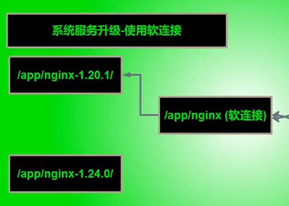


```bash
rz -E;   unzip name.zip; wc -l; seq 5;   ip a s eth0；ip addr show eth0;
head/less/tail/more/sed/grep/awk
stat /etc/hosts  # Display file or file system status
head `which yum` 
seq 10 | xargs touch	# 创建10个文件
seq 10 | xargs -n2  mv	# 2列，作为mv的参数，1改名为2； -n指定xargs一次传几个参数
# tree -d 只显目录 -f 完整路径 -t排序 
ls -i # inode , -n 显示用户ID和用户组ID
ls -F # 文件名称后加一符号；例如可执行档则加 "*", 目录则加 "/"
```


| xargs        | 将标准输入转换成命令行参数                                   |
| ------------ | ------------------------------------------------------------ |
| ln           | 硬链接与软连接 -s;                                           |
| ==readlink== | 查看==符号链接(软链接)==文件的内容  `ln -s /root/num.txt  num.so` |
| basename     | 显示文件名或目录名                                           |
| dirname      | 显示文件或目录路径                                           |
| chattr       | 改变文件的扩展属性                                           |
| lsattr       | 查看文件扩展属性                                             |
| md5sum       | 计算校验MD5                                                  |
| chown        | 改变文件或目录的用户和用户组                                 |
| chgrp        | 更改用户组                                                   |
| umask        | 显示或设置权限掩码                                           |
| tailf        | 跟踪日志文件                                                 |
| cut          | 从文本中提取一段文字并输出                                   |
| pstree       | 显示进程树                                                   |
| htop         | 任务管理器，比原本的top命令更强大                            |

**显示命令执行过程**

[linux显示命令执行过程](https://www.baidu.com/s?ie=UTF-8&wd=linux%E6%98%BE%E7%A4%BA%E5%91%BD%E4%BB%A4%E6%89%A7%E8%A1%8C%E8%BF%87%E7%A8%8B)   [Linux的命令执行过程](https://blog.csdn.net/weixin_43819984/article/details/127736000)  

可以使用`echo`配合命令替换（`$(command)`或``command``），或者使用`set -x`在脚本中启用调试模式

```
echo `ls`
echo $(ls)
```

### 命令多行输入

[linux命令多行输入](https://worktile.com/kb/ask/306386.html) 

1. 反斜杠（\）
2. 使用引号（””或”）    例如：`echo '回车 cmd 回车'`
3. 使用管道符（|）

### linux命令行

选项：命令的不同功能； 参数：形参，实参，把什么东西传给命令

查看帮助：man, help cmd查内置命令, info命令详细帮助; 

[Linux在线手册](https://man7.org/linux/man-pages/dir_all_alphabetic.html#letter_s)   [中文man](https://blog.csdn.net/xuchaoxin1375/article/details/111996472)  [man中文手册](https://www.cnblogs.com/k98091518/p/6932864.html) [man 在线中文手册](http://linux.51yip.com/search/man?ivk_sa=1024320u) [Ubuntu安装中文man手册](https://blog.csdn.net/TurboTab/article/details/104809411/)  [man中文手册 ](https://www.cnblogs.com/k98091518/p/6932864.html) [man手册](https://cloud.tencent.com/developer/information/linux%E4%B8%AD%E6%96%87man%E5%9C%A8%E7%BA%BF%E6%89%8B%E5%86%8C) 

[man手册如何使用](https://www.zhihu.com/question/575588504/answer/2977943095) [Linux配置man中文手册](https://zhuanlan.zhihu.com/p/131346894)  [man格式化并显示在线帮助手册页](https://www.cnblogs.com/fanweisheng/p/11089321.html)  

```sh
# man里面:h帮助，-N显示行号，-n最低显示第几行
man：8个级别
man -k rsync	# 查包含指定内容的man帮助
ll `which halt reboot`
注销：logout   ^+d
cd -	# 回上一次目录
find /etc -type d | xargs ls -ld
```

### du/df/edquota/lsmod/dmesg/modinfo

[dmesg](https://www.cnblogs.com/liulianzhen99/articles/17644187.html)  [dmesg](https://cloud.tencent.com/developer/article/2144579)  [dmesg](https://blog.csdn.net/songpeiying/article/details/133021174)  [adb打印内核调试信息dmsg和kmsg](https://blog.csdn.net/love_xsq/article/details/78860619) [dmesg_百度搜索](https://www.baidu.com/s?ie=UTF-8&wd=dmesg) 

[modinfo](https://www.runoob.com/linux/linux-comm-modinfo.html) 

```sh
edquota			# edit quota,编辑用户或群组的磁盘配额
lsmod			# 显示已载入系统的模块

modinfo			# 显示kernel模块的信息, modinfo -n sg
# -k display kernel messages; -f,--facility; --level <list>   restrict output to defined levels
dmesg			# display message, 显示开机信息,开机信息保存在 /var/log/dmesg
```

**dmesg每列含义**

1. **时间戳**：通常是消息被记录的时间。
2. **系统**：发出消息的系统或子系统的名称。
3. **消息**：实际的消息内容。
4. **进程ID**：发送消息的进程的ID。
5. **进程名**：发送消息的进程的名称。
6. **代码文件和行号**：如果可用，发送消息的代码文件和行号。

### tail/head/less/more/cat/nl

[head ](https://www.runoob.com/linux/linux-comm-head.html) [tail ](https://www.runoob.com/linux/linux-comm-tail.html) [less](https://www.runoob.com/linux/linux-comm-less.html) [more](https://www.runoob.com/linux/linux-comm-more.html)  [nl](https://www.runoob.com/linux/linux-file-content-manage.html)

```sh
tail					# -n尾部n行  -c 10最后10个字节 -v显示处理过程
tail -n +20 notes.log	# 前20行不显示； -20只显示后20行
tail -f  te.txt			# 查看实时更新, 追加时才更新，echo bb >>./te.txt

head -n 5 -c 10 

cat 					# -b行号，空行不标 -n 行号，全标
tac						# 文件内容从最后一行开始显示

nl						# 显示行号, -ba类似cat -n，-bt空行不标; -n ln行号在最左， -n rn在最右
```

### wc/sort/uniq/seq/diff

[wc命令](https://www.runoob.com/linux/linux-comm-wc.html)  [特殊符号、sort、wc、uniq、tee、tr、split](https://www.cnblogs.com/doubilaile/p/7856396.html) 

[cut命令](https://www.cnblogs.com/liuzgg/p/11733826.html)  [expr命令](https://blog.csdn.net/Purpleendurer/article/details/133763406)  [wc统计信息](https://www.baidu.com/s?ie=utf-8&f=8&rsv_bp=1&tn=baidu&wd=wc%E5%91%BD%E4%BB%A4&rn=20&oq=wc&rsv_pq=975f5049035ce618&rsv_t=971a78TKvfwr4iorH4RB8gMH5M%2FmxnO0kPFlm6rPlUV6vL3GOx8THhAm%2Bjk&rqlang=cn&rsv_enter=1&rsv_dl=tb&rsv_sug3=7&rsv_sug1=3&rsv_sug7=100&rsv_sug2=0&rsv_btype=t&inputT=1228&rsv_sug4=3514)   [diff](https://www.cnblogs.com/szlbm/p/5554046.html)  [vimdiff ](https://blog.csdn.net/qyj19920704/article/details/136466863)  [diff和vimdiff](https://blog.csdn.net/weixin_43297891/article/details/133978390)  

```sh
wc testfile 	# 行数、单词数，以及该文件的字节数
grep 'Failed password' /var/log/secure  |wc -l 
seq 1 2 10 >a	# vimdiff a b

uniq	-c			# 去重并统计次数	-c该行重复出现次数
sort	-rnk2 a		# -n按数值大小排序 -k2按第2列排序 -r逆序 -t':'指定分隔符
```

### rz/sz/finger

[lrzsz](https://www.jianshu.com/p/fdd4d8600908)  [finger](https://blog.csdn.net/zhaopeng_yu/article/details/136416756)  

Receive Zmodem(接收);  sz: Send Zmodem(发送)

```sh
rz	# 上传到linux(拖拽)		lrzsz
sz	# linux下载到win
sort ip.txt |uniq -c |sort -rn |head -20	# 取出前20个ip
```


### lex与yacc

[Lex与YACC详解](https://zhuanlan.zhihu.com/p/143867739)

### read/enable/set/export/declare

[read：交互性脚本编写的利器](https://blog.csdn.net/weixin_43025343/article/details/136095546)   [read命令读取用户输入](https://blog.csdn.net/wisdom_futrue/article/details/131156844) [read](https://www.runoob.com/linux/linux-comm-read.html) 

[enable](https://www.runoob.com/linux/linux-comm-enable.html) 

```sh
read [选项] 变量名
enable	启动或关闭 shell 内置指令
export 设置或显示环境变量(全局变量)
declare 声明 shell 变量
set设置shell的执行方式`
```


### tr

[tr命令](https://www.bilibili.com/video/BV1Ur4y1U7ic/?spm_id_from=333.337.search-card.all.click&vd_source=7346303e5e18677d7261c2c0c109ecfd)  [好：tr命令](https://www.cnblogs.com/baichunyu/p/15337039.html)

- translate，主要用于**压缩重复字符**、**删除文件中的指定字符**以及进行**字符替换**操作。tr命令只会对修改后的内容进行输出，**并不会修改原文件**		`tr  [OPTION]  SET1  [SET2]`

```sh
# -s	压缩重复字符：用SET1指定的字符替换对应的重复字符； 把重复的压缩成一个
cat test.txt|tr -s "\n"		# 删空行 
# -d	删除指定字符：删除SET1中指定的所有字符
echo "a12HJ13fdaADff" | tr -d "[a-z][A-Z]"
# -t	替换字符（缺省）
echo "a1213fdasf" | tr -t '[afd]' '[AFD]'
echo "Hello World I Love You" |tr -t '[:lower:]' '[:upper:]'   # 字符集
# -c	字符补集替换：用SET2替换SET1中没有包含的字符
cat test.txt|tr -c '[a-z][A-Z]' '#'             #把文件中除了字母以外，的其他所有字符都替换成"#"（包括换行符）
```

### ==eval==

[eval：如何在Linux中执行变量作为命令](https://blog.csdn.net/u012964600/article/details/135844213)   [eval命令](https://www.cnblogs.com/zendu/p/4988132.html)  [Linux中执行变量作为命令](https://blog.csdn.net/u012964600/article/details/135844213) [eval](https://blog.csdn.net/qq_21438461/article/details/131433206) [eval](https://www.baidu.com/s?ie=UTF-8&wd=linux%20eval) 

==执行变量==作为命令;  将字符串作为命令执行

eval主要作用是:  ==将字符串中的==变量和特殊字符进行扩展，然后将结果作为新的命令进行执行

```sh
cmd="ls -l"
eval $cmd
eval echo "Hello, World!"		# 将字符串"Hello, World!"作为命令执行，并将结果输出到终端上
```

### bind

[bind命令](https://www.runoob.com/linux/linux-comm-bind.html) 

设置键盘==按键与其相关功能==

```sh
bind -l				# 列出
bind -q abort		# 显示指定功能的快捷键
```

### sort

[sort 命令](https://www.cnblogs.com/itxiongwei/p/8528838.html) [sort](https://www.runoob.com/linux/linux-comm-sort.html)  [sort](https://zhuanlan.zhihu.com/p/346096309) [sort](https://www.cnblogs.com/su-root/p/10995215.html) [sort](https://www.cnblogs.com/kongzhongqijing/articles/5262733.html) 

```sh
# -r 逆序， -n按数值大小，-k指定列，-t指定分隔符    sort默认按ASCII码排序
# -o 输出到文件
sort -rnk2   #  k2根据第2列排序
uniq -c 去重统计次数

sort a.txt |uniq  -c | sort -nr

ntpdate
timedatectl
tar zcf xf tf -C;       unzip/zip -r;       gzip -d
```

### curl

[curl 的用法指南 - 阮一峰的网络日志  ](https://www.ruanyifeng.com/blog/2019/09/curl-reference.html)   [ curl命令](https://blog.csdn.net/angle_chen123/article/details/120675472)  

[linux中curl命令查看连通性](https://worktile.com/kb/ask/470562.html)    [curl命令](https://www.cnblogs.com/cangqiongbingchen/p/10180535.html)  [SuperEdge: 使用WebAssembly扩展边缘计算场景](https://brands.cnblogs.com/tencentcloud/p/14335)  [curl命令](https://blog.csdn.net/angle_chen123/article/details/120675472)

```bash
# O下载，-C - 断点续传,  为CURL设置代理 -x 代理主机:端口
curl -C - -O  -x test.com:3128  https://download.oracle.com/java/21/latest/jdk-21_linux-x64_bin.tar.gz 
cat  # Concatenate连接 FILE(s) to standard output, 文件连接到标准输出; 查看文件

# 检查是否能够使用特定的协议进行连接;   使用TLS 1.2版本与远程服务器通讯
$ curl --proto '=https' --tlsv1.2 https://sh.rustup.rs -sSf | sh
-s: silent：安静模式。不显示进度表或错误信息
-S: 如果发生错误,显示错误信息。
-f (--fail) 表示在服务器错误时，阻止一个返回的表示错误原因的 html 页面，而由 curl 命令返回一个错误码 22 来提示错误   # 如果服务器返回了非2xx HTTP状态码,也不显示错误。
```


### ==查找==

[which命令](https://www.runoob.com/linux/linux-comm-which.html)  [which](https://blog.csdn.net/z19861216/article/details/130851157)  [好：which/whereis/locate](https://www.cnblogs.com/ftl1012/p/which.html)   [whereis](https://www.cnblogs.com/jiaklop9/p/14228306.html)  [whereis底层实现](https://blog.csdn.net/qq_21438461/article/details/131362506)  [plocate](https://www.linuxmi.com/plocate-locate.html) [Plocate](https://www.shserve.cn/80337.html)  [locate](https://www.cnblogs.com/hookjoy/p/9522097.html)  [Everything和AnyTXT Searcher 对比 | ](https://www.everythingsearch.cn/2086.html)  [Everything背后的技术（USN和MFT）](https://github.com/yuzhengyang/Everything)   [fsearch](https://github.com/cboxdoerfer/fsearch)  [FSearch文件快速搜索](https://www.oschina.net/news/206955/fsearch-0-2-released)  [Everything:](https://www.cnblogs.com/-D-R-Y-/p/7575218.html)  

[find](https://www.runoob.com/linux/linux-comm-find.html)  [find](https://blog.csdn.net/AwesomeP/article/details/130917677) 

[find与xargs配合使用](https://blog.51cto.com/lemidi/1370531) 

**exec:** [find](https://zhuanlan.zhihu.com/p/677997345)  [find查文件内容](https://www.baidu.com/s?ie=UTF-8&wd=find%E6%9F%A5%E6%96%87%E4%BB%B6%E5%86%85%E5%AE%B9) 

- `find /path/to/search -type f -exec grep -H "search_pattern" {} \;` 

find/which/whereis/locate

- which： 查找文件所在位置，主要==查找可执行命令二进制文件==，在==$PATH设置的目录里查找==
- whereis: 配合-b，用于程序名的搜索，==从linux数据库查找==
  - whereis 默认的搜索路径是从硬编码路径中查找文件，硬编码路径是用 glob patterns 定义的， 以及环境变量 PATH 和MANPATH定义的路径。要知道`使用了哪些路径，用 -l 查看`
- locate: ==配合数据库查看==文件位置, `/var/lib/mlocate/mlocate.db`  ,ubuntu: `/var/lib/plocate/plocate.db`
  - 使用locate之前，用updatedb手动更新数据库 [updatedb命令](https://www.runoob.com/linux/linux-comm-updatedb.html) 
  - ==mlocate==相比locate， 每次更新数据库时并不需要重新读取全部目录的内容,mlocate 在数据库中==保存了时间戳信息==，无需重新读取，就能判断目录内容是否改变。所以更新的速度更快   [mlocate](https://blog.csdn.net/weixin_47792780/article/details/138868602)
  - ==plocate==基于发布列表，完全取代了mlocate，并且拥有更小、更快的索引,  它通常只需扫描数据库的一小部分，除非搜索模式非常短或者需要使用正则表达式   [Plocate](https://www.shserve.cn/80337.html)

- [find](https://www.cnblogs.com/ftl1012/p/9251300.html) : `find [路径] [匹配条件] [动作]`  实际搜寻硬盘查询文件名称,效率低  [find 菜鸟教程](https://www.runoob.com/linux/linux-comm-find.html) 
  - **动作:** 可选，对匹配到的文件执行操作，比如删除、复制等


```sh
ll `which halt poweroff`
nohup find / -print > /root/file.log &

plocate -r '^te'	#正则 --regex 扩展正则 -b 仅搜索路径名中的文件名部分 -w 搜整个路径名 -i不区分大小写  -c 匹配数 -l 5 搜5个就停 -0, --null：以NUL作为分隔符而不是换行符
```

[find视频](https://www.bilibili.com/video/BV1jp421U77V/?spm_id_from=333.337.search-card.all.click&vd_source=7346303e5e18677d7261c2c0c109ecfd) 

[find 详解](https://www.cnblogs.com/andrew-chen/p/11555085.html) [find](https://www.cnblogs.com/zlyj/p/16152999.html) [-ok](https://blog.csdn.net/qq_42019406/article/details/102469554)  

- 找出文件后，看详细信息 
- 找出文件并打包压缩
- 找出文件后复制或移动

```sh
find /etc/ -type f  -name 'host'		# f文件，d目录；   'old*'
# -size +10k 大于10k， -小于； 
-mtim -7						# 根据修改时间,-7最近7天,+7七天之前	
-maxdepth 2						# 最多找几层目录,放在路径后，其它选项前面，就没警告
```

**find与其它命令搭配使用**

```sh
# 反引号(``)，用来执行一个命令，并将其输出作为另一个命令的参数。反引号在Shell脚本编写中非常有用
ls -lh  `find /etc/  -type f -name '*.txt'`				# 找出文件后删除，看详细信息, 1前面的反引号
# 管道传递的是字符串，通过|xargs把字符串转换为参数
find /etc/  -type f -name '*.txt' | xargs  ls -lh
find /etc/  -type f -name '*.txt' -exec ls -lh {} \;	# \;转义,  前面find结果交给exec，放到花括号（占位符）里

# 找出文件并打包压缩
tar zcf  /tmp/find.tar.gz  `find /etc/  -type f -name '*.txt'`
tar tf /tmp/find.tar.gz			# 查看压缩包
find /etc/  -type f -name '*.txt' -exec tar zcf /tmp/find.tar.gz  {} +		# +最后才打包，用\;每次都压缩

# 找出文件后复制或移动 ：源  目标
cp  `find /etc/  -type f -name '*.txt'`    /tmp/
cp -t 	# 源和目标反转， 变成目标在前
find /etc/  -type f -name '*.txt'  |xargs cp -t /tmp/
find /etc/  -type f -name '*.txt'  -exec cp {} /tmp/  \;
```

### grep

[Linux三剑客视频](https://www.bilibili.com/video/BV1Kg411g7bC?p=15&spm_id_from=pageDriver&vd_source=7346303e5e18677d7261c2c0c109ecfd)   [grep命令详解](https://www.cnblogs.com/link01/p/12490793.html)  [grep命令](https://www.cnblogs.com/ysuwangqiang/p/11443785.html)

[grep -e](https://www.yisu.com/ask/96226888.html)   [-e , -E , -F , -G , -P ](https://blog.csdn.net/kfepiza/article/details/134674117)  

alias egrep=e'grep --color=auto' 

- 系统字符集：en_US.UTF-8,有问题修改为C，'export LANG=C'
- 快速学正则，配合grep -o

```sh
^$ 空行	{,m}最多连续出现m次
# -v 反向选择，显示不包含匹配的所有行；  -E扩展正则；  -r 递归，查找目录必须； -n显示匹配行号； -i不分大小写； -c找到几个，count
# -A 2 显示匹配之后的2行，-B 2之前， -C前后； -n  print line number
# -d查找的是目录时，必须使用这项参数  
# -e查找字符串，-n显示行号，-l只输出匹配的文件名 
# -F, --fixed-strings   PATTERNS are strings  与正则不同，固定字符串不解释特殊字符或元字符
# -f  take PATTERNS from FILE，  后面跟文件，文件中写正则表达式，各个表达式相当于或关系
# -H, --with-filename       print file name with output lines

-P,--perl-regexp  	# 使用PCRE
```


### ==sed==

[首先看：三剑客视频](https://www.bilibili.com/video/BV1Kg411g7bC?p=27&spm_id_from=pageDriver&vd_source=7346303e5e18677d7261c2c0c109ecfd)  [sed命令_还不错](https://www.cnblogs.com/ggjucheng/archive/2013/01/13/2856901.html)  [Regulex：JavaScript Regular Expression Visualizer_可视化理解正则](https://jex.im/regulex/#!flags=&re=%5E(a%7Cb)*%3F%24)   

[shell小命令大用处](https://blog.csdn.net/qq_36586867/article/details/82861913)  

[sed命令](https://segmentfault.com/a/1190000022722531?utm_source=sf-similar-article)   [sed教程](https://zhuanlan.zhihu.com/p/145661854) [sed 命令](https://www.cnblogs.com/HOsystem/p/16211837.html) [sed命令](https://blog.csdn.net/qq_44836294/article/details/108070084)  

[hadoop笔记](https://www.cnblogs.com/ggjucheng/archive/2012/04/22/2465625.html)  

[sed添加空行](https://www.cnblogs.com/yangsuxia/p/3382410.html)  [sed加空行](https://www.cnblogs.com/zhanglong71/p/5424633.html)  [sed追加一个空行](https://www.baidu.com/s?ie=UTF-8&wd=sed%E8%BF%BD%E5%8A%A0%E4%B8%80%E4%B8%AA%E7%A9%BA%E8%A1%8C) 

**小结**： 执行过程， ==CRUD【dsp cia】==，反向引用;  

- 查：2p、 //p；  //,//p；  $最后一行   -n       # //里写正则
- 改：s###g  -i直接修改      substitute
- ==替换：s###g== 

==修改输入文件本身的内容==,stream editor流编辑器  

==sed工作流程==：一次处理一行内容。==把当前处理的行存储在临时缓冲区中处理==，称为“模式空间”（pattern space），接着用sed命令处理缓冲区中的内容，==处理完成后（输出）==，接着处理下一行，不断重复，直到文件末尾; 文件内容并没有 改变，除非使用[重定向](https://so.csdn.net/so/search?q=重定向&spm=1001.2101.3001.7020)存储输出

==Sed执行过程==：找谁干啥， 哪一行，**增删改查{spd、cai}**

```bash
# Usage: sed [OPTION]... {script-only-if-no-other-script} [input-file]...
# OPTION 为命令选项，script-only-if-no-other-script 为处理动作，可以由-e指定多个，input-file为输入文件，可指定多个,  sed 选项 动作 文件, 不加-n全部输出
# 

# -i 直接修改文件

's#oldboy#oldgirl#g'	# sed的核心功能：s替换，d删除；   g修饰符，不是必需，可省略
# sed核心功能CURD： s,substitute替换； p，print显示； d，delete； c/a/i添加

sed -n 1~2p		# 第一行开始，每2行匹配一次； 即匹配奇数行
```

script中的内容可以分为两大类: 地址定界和命令		[sed命令](https://www.cnblogs.com/vathe/p/6783188.html)  

- 地址定界: 对需要匹配的行划定范围
  - 不给地址：对全文进行处理
  - 单地址：指定具体的行， 比如5
  - 地址范围： #,#   #,+#   //,//   #,//  
  - 步进: 1~2奇数行   2~2
- 命令，即对通过地址==匹配到的行进行操作==，包括打印、删除等

| 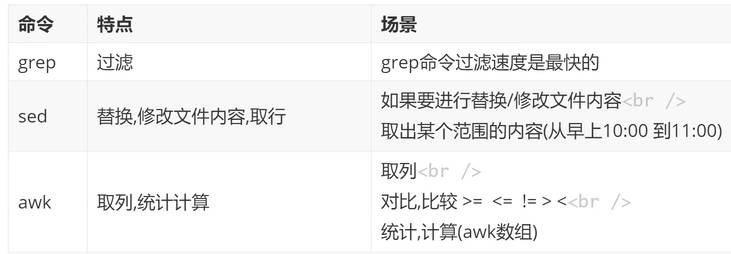    | 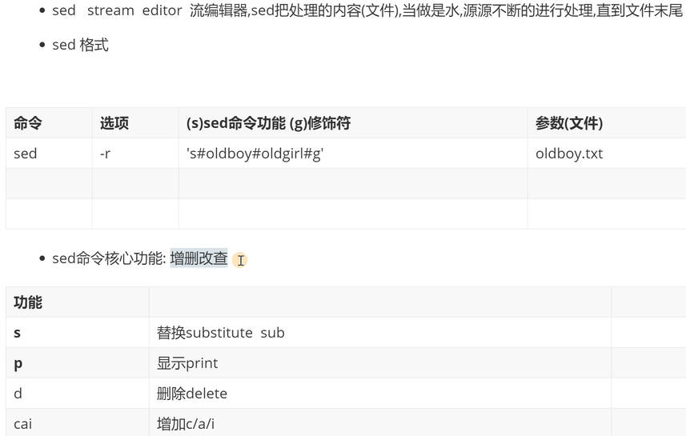 |
| ----------------------------------------------------------- | -------------------------------------------------------- |
| 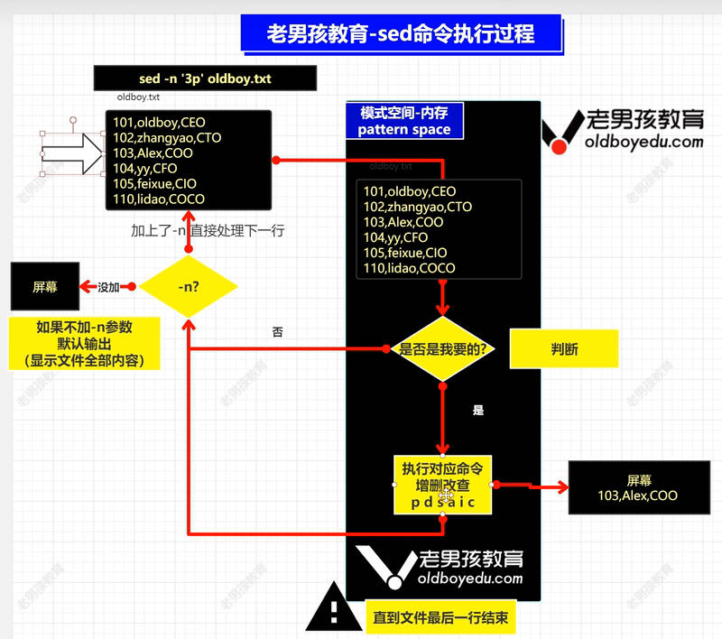    | 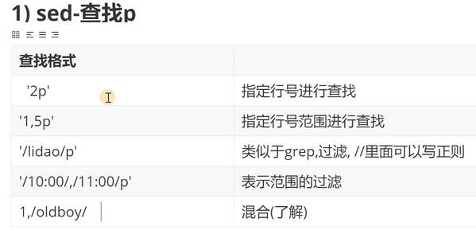 |
| 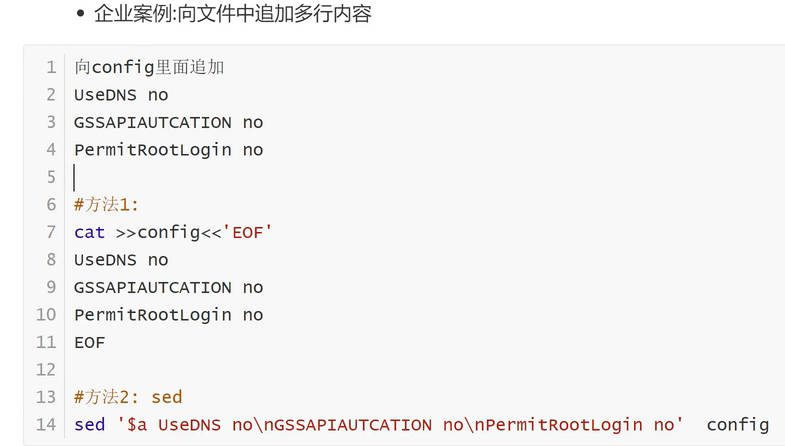 | 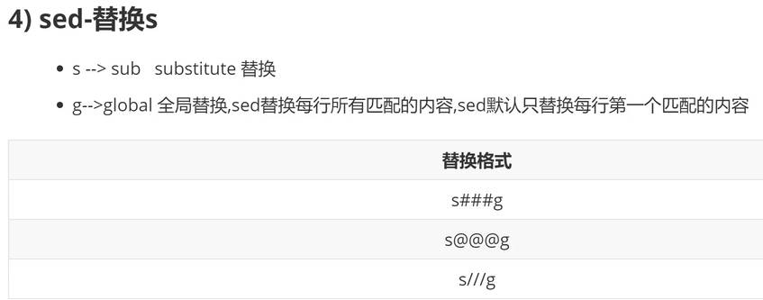 |

==替换：s###g==   g全局替换

==-e表示多点编辑==，第一个编辑命令删除/etc/passwd第三行到末尾的数据，第二条命令搜索bash替换为blueshell

`nl /etc/passwd | sed  -e '3,$d'   -e 's/bash/blueshell/'`

```bash
# 1.查找 //p；  //,//p
# 大文件用head/tail/less/more/sed/grep/awk查看，用vi会全部读入内存，如果大小超过内存会崩溃
'2p'				按行号查找  '$p'中 $ 表示最后一行
'1,4p'				指定行号范围
'/name/p'			类似grep过滤，//里面可写正则, -r 扩展正则, set -nr
'/10:00/,/11:00/p'	范围过滤：查找10点到11点范围内的日志, 里面包含10:00   '//,//p'

# 2.删除：查找里的p改为d
sed -n '3p' test;     	# 默认不打印，搜索到第3行，然后打印
sed '3!d' test			# 默认打印每一行, 3!不是第三行,就删除——不打印


# ^$合在一起，表示空行； 查看时不显示空行和包含#号行
egrep -v '^$|#' debconf.conf
sed -r '/^$|#/d' con.conf
# !取反
sed -nr '/^$|#/!p' con.conf

# 3.增加：cia,append追加,行后，insert行前，replace替换(删掉原来的，替换为), \换行
sed  '8a8' test		# 第8行后加个8，有没有空格一样
sed  '$a aa\no' con.conf	# 追加空行 \\n ,  ‘1G’第一行后面添加空行
# 追加推荐cat,追加的内容有特殊符号，EOF加引号：  'EOF'
cat >>config<<EOF
aa
no
EOF

# 4.sed精华：替换(改) s,substitute; s###g,找什么，替换成什么，前2个#之间支持正则,3个#写成什么都行，@@@,///,AAA,222  -i直接修改文件内容
sed 's#[0-9]##g' 1.txt	#替换为空，即删除字符, 不加g仅匹配每行第一个匹配的,global每行所有匹配的。
sed -i 's/\.$/!/g' a.txt				# 每一行结尾若为 . 则换成 !
sed -i '$a # This is a test'  a.txt		# 最后一行加入"# This is a test"
```

**反向引用**

```sh
# 5.反向引用 ：先用小括号保护起来，再引用\1
# 123变成<123>
echo 123 | sed -r 's#(.*)#<\1>#g'  # .*匹配123，小括号分组保护起来,\1匹配前面第一个分组, 正则反向引用一样

# old_boy 变成 boy_old
echo old_boy | sed -r 's#(^.*)_(.*$)#\2_\1#g'

#  ip  addr show eth0 : 显示某网卡信息;   正则限制贪婪，多写一点内容， .*t空格
ip a s eth0 |sed -n '3p'|sed -r 's#(^.*t )(.*)(/.*$)#\2#g'	 # 取第3行，把需要的内容小括号保护起来,只想显示ip地址

# 取出文件权限
stat /etc/hosts | sed -n 4p | sed -r 's#(^.*\(0)(.*)(/-.*$)#\2#g'
stat -c%a /etc/hosts		# -c 按指定格式输出，
```


### awk

[Shell四剑客之awk](https://www.cnblogs.com/luoyan01/p/10904658.html)   [Linux man pages online](https://man7.org/linux/man-pages/index.html) 

[awk数组与语法](https://blog.csdn.net/hyunbar/article/details/107195577)  [awk数组](https://www.cnblogs.com/henglinux/p/9571401.html)  [awk条件判断](https://www.cnblogs.com/dgp-zjz/p/11522177.html) [awk判断语句和循环](https://blog.51cto.com/whnba/1902577)  [awk命令详解及应用技巧](https://www.cnblogs.com/juanne/p/9873220.html)  [awk命令](https://blog.csdn.net/weixin_44657888/article/details/134817128) 

`awk  -F,  BEGIN{print "name"}条件{print $2}END{print "end"}    old.txt`		# -F分隔符

小结：

- awk执行过程、取行、取列、模式（就是条件），==统计（i++,sum+=）==、awk数组、awk判断与循环
- awk是一门语言，用来**过滤、统计**、计算

#### 1.awk执行过程

读取前 -> 读取中，处理文件 -> 读取后;	动作写在{}里

- 读取前,执行BEGIN{}花括号里面的命令
- 读取中：[==条件和动作==]; 读取，判断，执行命令，读取下一行       
  - 满足条件后执行; `{print $2}` 没有条件，文件的每一行都执行这个命令

- 读取后，执行END{}里面的命令

#### ==2.取行、取列==

 通过awk内置变量，`NR，  -F $3  $NF最后一列`

```bash
# 1. 取行， NR
awk 'NR==1' AA.conf		//NR>=1 && NR<=5,	/oldboy/,	/101/,/105/


# 2. 取列： -F指定分隔符， $数字，取出某列， -v修改awk变量
ls -l | awk '{print $1,$8,$9}' | column -t

awk -F: '{print $1,$NF}' /etc/passwd | column -t	# 取出第1列，最后1列， {print $1“---”$NF}中间加内容

# 手动在$2中间加分隔符很繁琐，用-vOFS修改分隔符变量,默认空格改为冒号
awk -F: -vOFS=:  '{print $NF,$2,$3,$4,$5,$6,$1}' /etc/passwd	#-v修改awk变量，最后的字段放前面； 调换顺序后，分隔符：没有了，用-vOFS添加分隔符: -vOFS=+++++ 

ip a s eth0 | awk -F"[ /]+" 'NR==5{print $3}'	# awk支持扩展正则，只显示ip，第3列
```
| 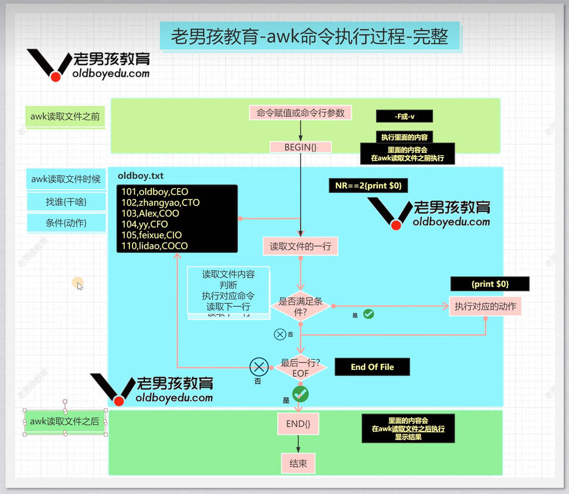 |  |
| -------------------------------------------------------- | ------------------------------------------------------------ |
| 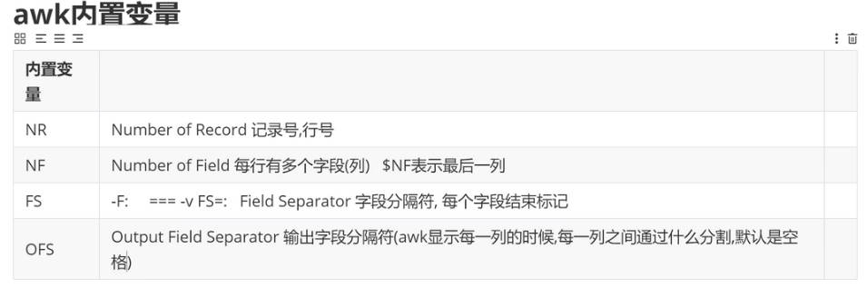 |      |

#### ==3.awk模式匹配(即条件)==

==awk的条件==，专业的说法叫模式； 就是谁可以作为awk的条件

**比较：** >< == 等

**正则：** ==精确到某列==：包含用~， `不包含!~` awk正则写在//里面;   `'$3~/^2/' ` ==第3列以2开头的==；  =={}命令只能用单引号==，双引号括起来是字符串

**范围：** //,//

**特殊模式：** BEGIN{}  END{};    

**统计：** ==计数==i++ ， ==求和==sum+=

```sh
# 正则
awk -F: '$3~/^2/' /etc/passwd		# 第3列以2开头的, 只是个条件
# 找出第3列以1开头（条件），并显示第1，3和最后一列
awk -F: '$3~/^1/{print $1$3$NF}' /etc/passwd | column -t

# 特殊模式
awk '/^$/{i++}END{print i}' /etc/services 				# 统计空行,先计算，在end里统计
seq 100 | awk '{sum=sum+$0}END{print sum}'				# 求和
seq 100 | awk '{sum=sum+$0;print sum}END{print sum}'	# 显示过程
```
| 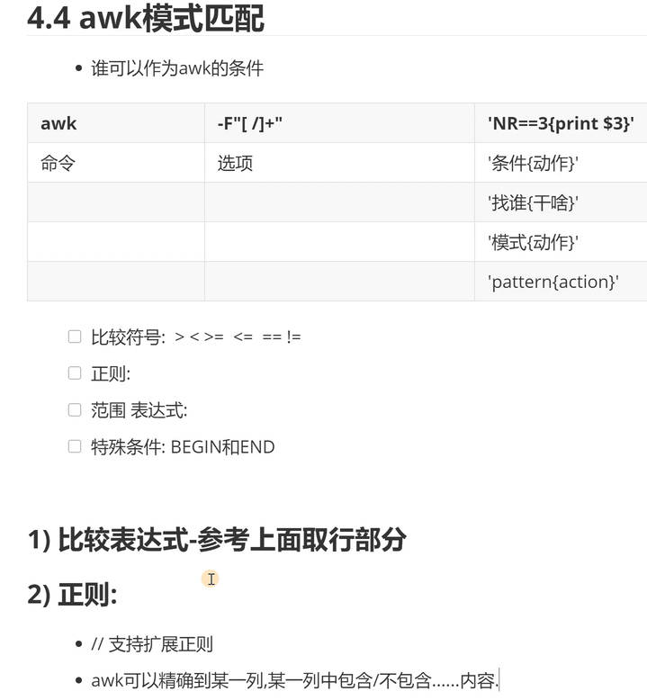 | 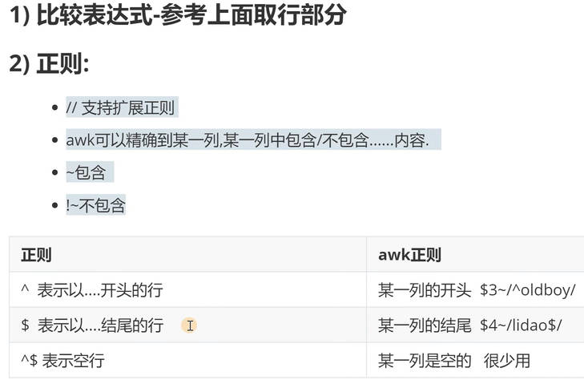 |
| -------------------------------------------------------- | -------------------------------------------------------- |
| 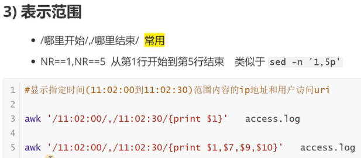 | 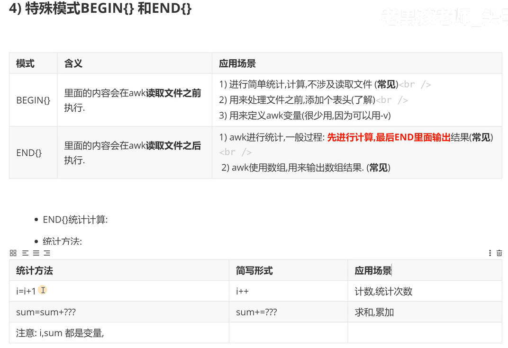 |

#### ==4.awk数组==  

数组：  a[0] ,b[$9] ;    遍历：for(i in a)， 注意要要有小括号  ; `'{arr[$2]++}' 第2列组成数组,++统计出现次数`  

==坑==：awk中字母, 会被识别为变量； 所以字符串要加双引号;  forin获取的是数组的下标，==获取内容：a[i]==

```sh
# awk中字母, 会被识别为变量； 所以字符串要加双引号
awk 'BEGIN{a[0]="old";a[1]="boy";print a[0],a[1]}'
awk 'BEGIN{a[0]="old";a[1]="boy";for(i in a) print i,a[i]}'		# 数组遍历

# 将域名取出，并计数: 分隔符/, 每行的第2列放进数组
awk -F"[/]+"  '{arr[$2]++}END{for(i in arr)print arr[i],i}' www |sort -rnk2
# sort -rnk2   # r逆序 n数字 k2根据第2列排序

awk '$9~/[0-9][0-9][0-9]/{array[$9]++}END{for(i in array) print i,array[i]}' acc.log | sort -rnk2
```

定义：arr[0]=oldboy;   使用：print arr[0]

| 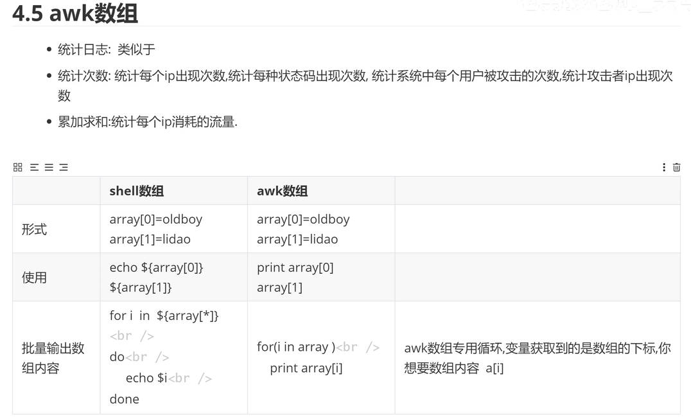     | 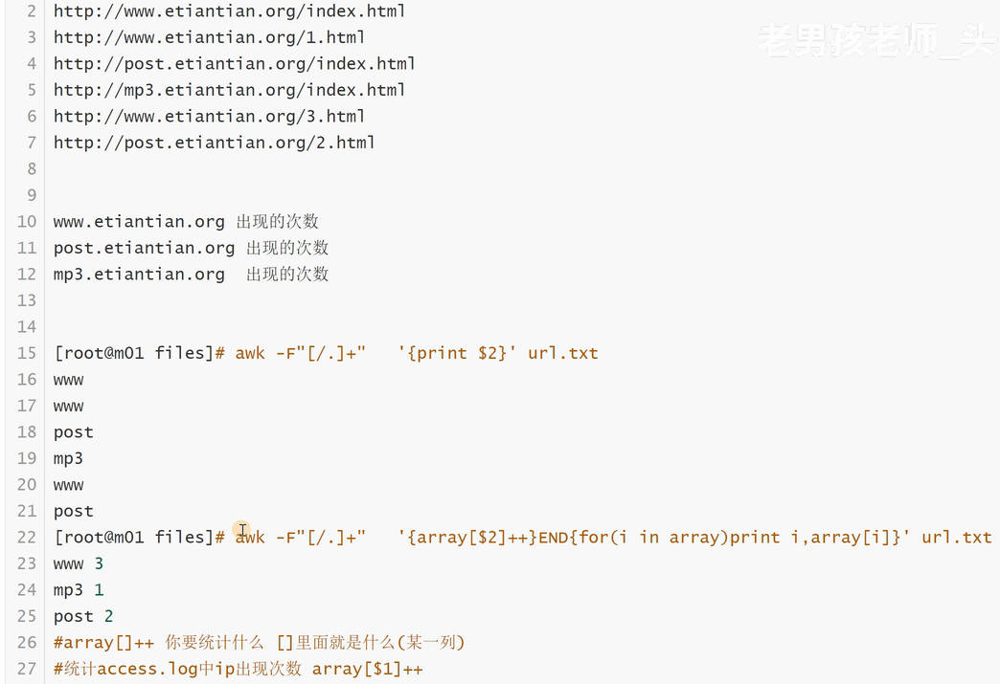 |
| ------------------------------------------------------------ | -------------------------------------------------------- |
| 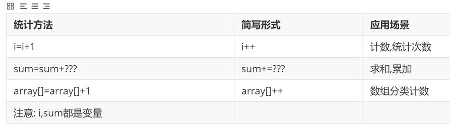 |                                                          |

#### ==5、循环判断==

- 循环

  - 格式： `for(i=1;i<=10;i++)print i`

  - `awk   'BEGIN{for(i=0;i<=10;i++)sum+=i;print sum}'` 

  - 里面要执行多个命令，用花括号{}圈起来；  `awk 'BEGIN{for(i=0;i<=100;i++){sum+=i;print sum}}'`

- 判断

  - 格式：`if(条件)print "aaa"else print "bbb"` 
    - `awk 'BEGIN{if(2>1){print "aaa"}else{print "bbb"}}'`
  - `df -h |awk -F"[ %]+" 'NR>1{if($5>=70)print "disk not enough",$1,$5"%"}'`  
    - 第一个条件NR,第2条件if语句

- ### awk流程控制：break、continue、next、nextfile、exit 

- 综合例子

  - `cat cha|awk  '{for(i=1;i<=NF;i++)arr[$i];{for(i in arr)print i}}'` 每列循环出来放入数组，遍历数组
  - awk函数length($1), 统计第一列字符数
  - `cat cha|awk  '{for(i=1;i<=NF;i++)arr[$i];{for(i in arr) if(length(i)>5)print i}}'` 打印字符数大于5的数组元素
  - `cat cha|awk  '{for(i=1;i<=NF;i++){if(length($i)>6)print $i}}'`  直接循环出来，不放入数组


| 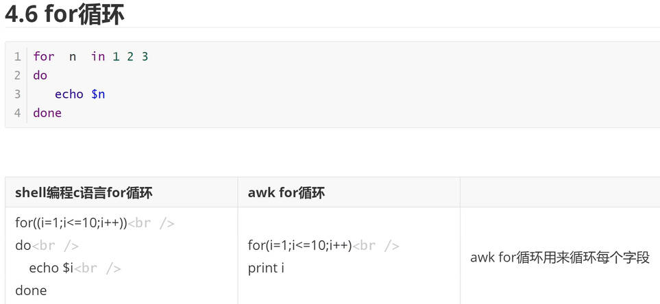 | 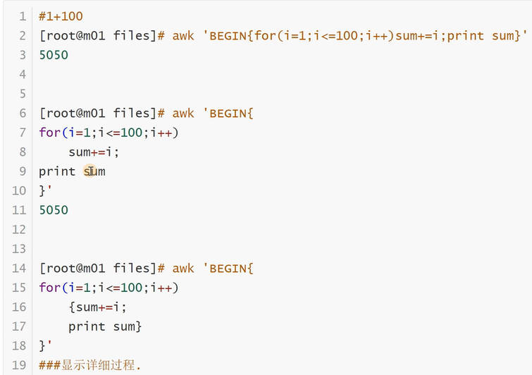 |
| -------------------------------------------------------- | -------------------------------------------------------- |
| 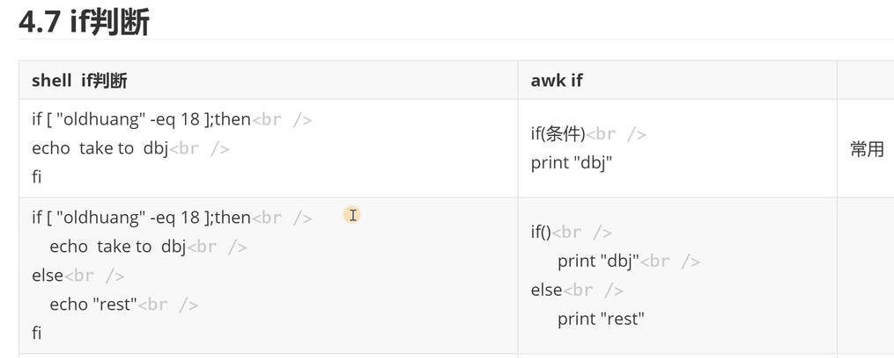 | 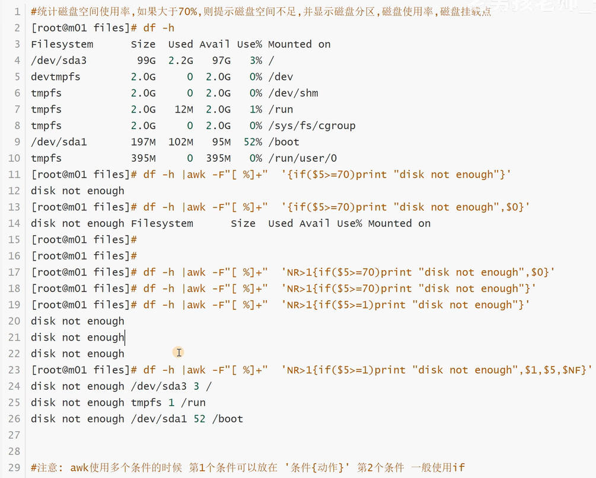 |
| 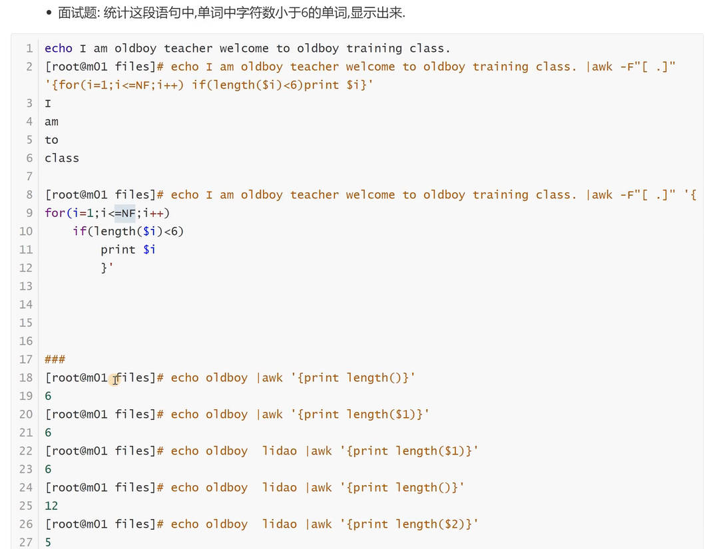 |                                                          |


### ==免密登录==

[117.实战篇-ssh实现免密登录](https://www.bilibili.com/video/BV1bi421X7T4?p=120&vd_source=7346303e5e18677d7261c2c0c109ecfd) 

[密码学之RSA+DSA+ECDSA](https://www.bilibili.com/video/BV1MU4y1g7pt/?p=7&vd_source=7346303e5e18677d7261c2c0c109ecfd)   [加密算法：RSA与DSA比较](https://blog.csdn.net/wuli1024/article/details/135271658)   [RSA与DSA对比与应用](https://blog.csdn.net/lsoxvxe/article/details/132176247)   [用Openssl生成可靠的CA证书使网址秒变HTTPS](https://www.bilibili.com/video/BV1CN4y1X77p/?spm_id_from=333.337.search-card.all.click&vd_source=7346303e5e18677d7261c2c0c109ecfd)   

[x509](https://www.cnblogs.com/MichaelShang/p/12557729.html)  [好：公钥、私钥、签名、证书](https://blog.csdn.net/weixin_43269452/article/details/132603785) [key](https://www.cnblogs.com/Lcch/p/16152557.html)  

- 公钥加密算法：RSA
- 数字签名算法：DSA

```sh
ssh-keygen -t rsa									# 生成公钥	.ssh/id_rsa.pub
ssh-copy-id -i id_rsa.pub  root@192.168.1.130		# 拷贝到远程服务器
ssh root@192.168.1.130:22							# 免密登录
```

 x509证书一般用到三类文件，key，csr，crt

- X.509 ：一种证书格式
  - 根据编码:.crt/pem结尾
  - PEM - Privacy Enhanced Mail,打开看文本格式,以"-----BEGIN..."开头, "-----END..."结尾,内容是==BASE64编码==
- ==Key==:私钥openssl格式，通常rsa算法
- ==Csr==： ==用于申请证书==,Certificate Signing Request，即==证书签名申请==，不是证书，是要求CA给证书签名的一种正式申请，==该申请包含==申请证书的实体的==公钥及该实体店某些信息==。该数据将成为证书的一部分。CSR始终使用它携带的公钥所对应的==私钥进行签名
- ==crt==：CA认证后的证书，certificate

| 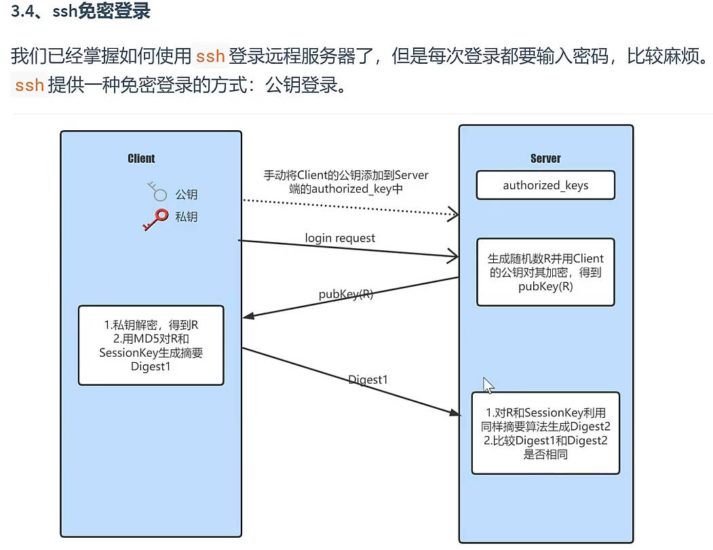     | 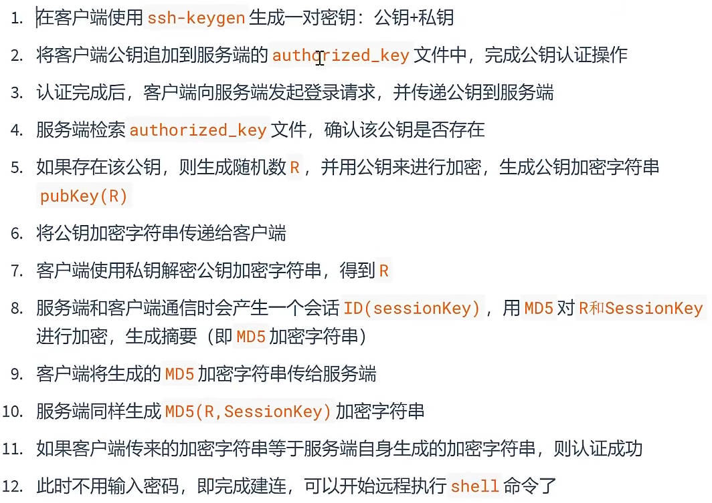 |
| ------------------------------------------------------------ | -------------------------------------------------------- |
| 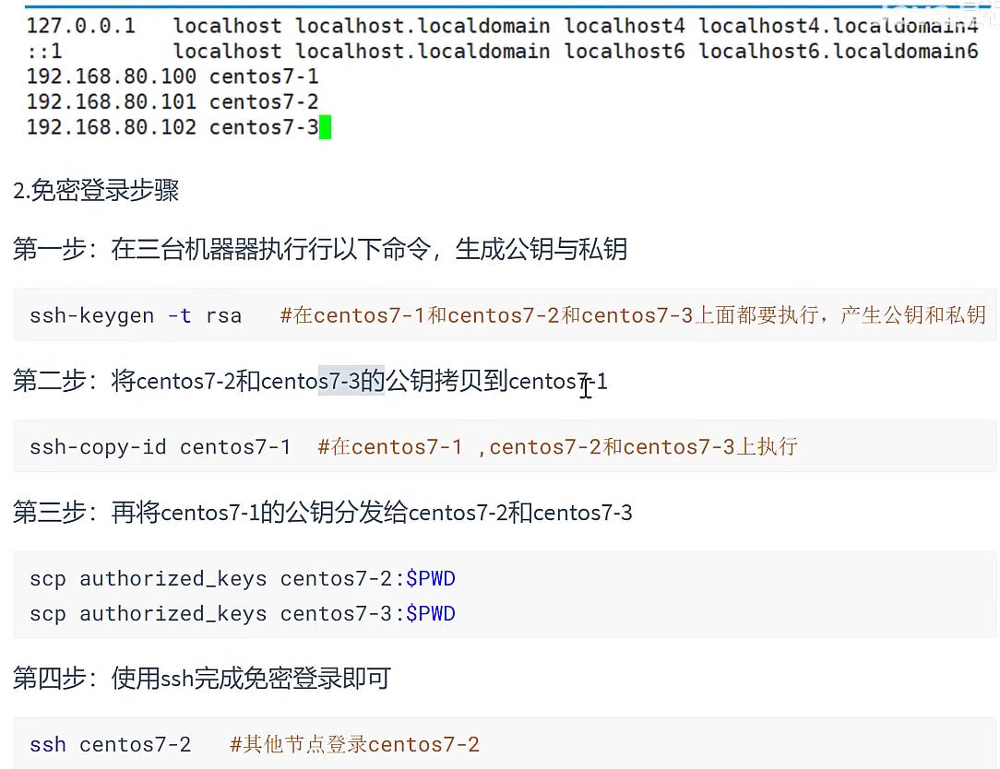 |                                                     |


### 端口

[Port 10250 is in use](https://www.baidu.com/s?ie=UTF-8&wd=kubeadm%20init%E6%80%BB%E6%98%AF%E5%87%BA%E7%8E%B0Port%2010250%20is%20in%20use)  [linux端口in use](https://www.baidu.com/s?ie=utf-8&f=8&rsv_bp=1&tn=baidu&wd=linux%E7%AB%AF%E5%8F%A3in%20use&rn=20&oq=kubeadm%2520init%2520%252Fetc%252Fkubernetes%252Fmanifests%252Fkube-apiserver.yaml%2520already%2520exists&rsv_pq=9ba025c7006d1e9b&rsv_t=d11aYhu1vH9Zr3ktf5UDlQzKadHj5qYN9STSO2KvW%2BksZS4K13MG%2Fcgv%2B6c&rqlang=cn&rsv_dl=tb&rsv_enter=1&rsv_sug3=19&rsv_sug1=16&rsv_sug7=101&rsv_sug2=0&rsv_btype=t&inputT=18208&rsv_sug4=19437)  

```
netstat -tulnp | grep 10250  或  lsof -i :10250
kill -9 <进程ID>
```

### 文件属性

```sh
chgrp -R 属组名  文件名			# -R递归 目录下的所有文件的属组都会更改
chown -R 所有者:属组名 文件名 	  # 更改文件所有者（owner），可同时更改文件所属组
chmod --reference=参考文件或目录	# 使用参考文件的权限来设置目标文件权限
chmod 	# 更改文件9个属性, user group others(u g o a)  all全部
# 2种方法：数字，符号；  r4 w2 x1; 例：rwxrwx--- 770;   chmod 777 test.log
# 符号类型改变文件权限: -rwxr-xr--    chmod u=rwx,g=rx,o=r;  a-x 去掉全部人的可执行权限
# 符号格式： [ugoa][+-=][permission]
```

### ==定时任务与时钟同步==

**时钟服务器同步**： NTP服务

[常用ntp服务器](https://zhuanlan.zhihu.com/p/680124185) 

[最详细Ubuntu时间同步教程](https://blog.csdn.net/qq_42964243/article/details/136285851)   [ntp服务-阿里云](https://www.aliyun.com/sswb/1074156.html)  [使用阿里云镜像站NTP服务搭建NTP服务器（基于CentOS 7系统）](https://developer.aliyun.com/article/1074880?spm=5176.26934562.main.1.595f6badAWU4Q2)    [ubuntu时间同步命令](https://www.baidu.com/s?ie=utf-8&f=8&rsv_bp=1&tn=baidu&wd=ubuntu%E6%97%B6%E9%97%B4%E5%90%8C%E6%AD%A5%E5%91%BD%E4%BB%A4&rn=20&oq=ubuntu%25E6%2597%25B6%25E9%2597%25B4%25E5%2590%258C%25E6%25AD%25A5&rsv_pq=d035bc28004525d9&rsv_t=a014PGlnBrNni%2FZ3KOnrBaV%2B3Ydn5U66dma91jpxnFDa7zflbKxN6EzvCyE&rqlang=cn&rsv_enter=1&rsv_dl=tb&rsv_sug3=6&rsv_sug2=0&rsv_btype=t&inputT=1079&rsv_sug4=1079) 

[Ubuntu开启NTP时间同步](https://blog.csdn.net/sorcererr/article/details/128675919)   [ubuntu timedatectl](https://www.baidu.com/s?ie=utf-8&f=8&rsv_bp=1&tn=baidu&wd=ubuntu%20%20timedatectl&rn=20&oq=ubuntu%2520ntpdate%25E5%25BC%2580%25E6%259C%25BA%25E5%2590%25AF%25E5%258A%25A8&rsv_pq=8390c71f001195a3&rsv_t=fbe6VmgrB8cVrpp5o%2BdvE2B8O533pdrNbaiSqESUOkg2Fd1Bd4cJnM9t%2F4g&rqlang=cn&rsv_enter=0&rsv_dl=tb&rsv_btype=t&inputT=2647&rsv_sug3=14&rsv_sug1=9&rsv_sug7=100&rsv_n=2&rsv_sug4=2804)   [ntpd替换timesyncd](https://www.jianshu.com/p/42ee7b4351e5)   [Ubuntu设置timesyncd时间同步、时区、 NTP同步对时、手动设置时间](https://blog.csdn.net/h4241778/article/details/108921585)  [Ubuntu设置timesyncd时间同步](https://blog.csdn.net/h4241778/article/details/108921585)   [Ubuntu](https://www.cnblogs.com/Magiclala/p/17030519.html) 

[ntpd服务启动后显示unsynchronised](https://www.zhihu.com/question/39988244/answer/3410093677)  [时间及其同步、定时任务、时间戳](https://www.cnblogs.com/dgp-zjz/p/11218901.html)   [NTPsec与NTP的区别](http://www.nav-cn.com/kepu/7929.html)  

[阿里云时间服务器](https://www.aliyun.com/sswb/928217.html) [时钟同步服务器](https://developer.aliyun.com/article/697980?spm=5176.26934562.main.1.2d666cbc55fLMH)   [腾讯云NTP服务](https://www.tencentcloud.com/zh/document/product/213/32379)  [腾讯云](https://cloud.tencent.com/developer/information/%E8%8E%B7%E5%8F%96%E6%9C%8D%E5%8A%A1%E5%99%A8%E6%97%B6%E9%97%B4%E5%85%8D%E8%B4%B9%E5%9C%B0%E5%9D%80-album)   

[ntpdate命令、ntp服务、chrony服务、ntp/chrony时间服务器的搭建](https://blog.csdn.net/MssGuo/article/details/120919607)   [ntpdate命令](https://cloud.tencent.com/developer/article/2311603)  

- ntpdate被timedatectl取代
- `timesyncd`（和ntpdate）是断点更新，ntpd 为步进式的逐渐校正时间，不会出现时间跳变
- 使用ntpd要关闭timesyncd，以免两个服务相互冲突
- ntpd服务开启之后需要等待一段时间才能同步上

```sh
apt install ntpdate
timedatectl status							# 查看同步状态
timedatectl set-timezone Asia/Shanghai		# 设置时间为上海时间
systemctl is-enabled ntpdate				# 查看ntp服务是否启动
ntpdate ntp4.aliyun.com						# 手动同步：aliyun时钟同步服务器

date -s '2030-11-11 11:11:11'				# 手动设置时间
date

ntpstat
ntpq -p

crontab -e									# 主机设定时任务
*/1 * * * *  /usr/sbin/ntpdate ntp4.aliyun.com

# vi /etc/systemd/timesyncd.conf 
ntp.ubuntu.com,ntp.tencent.com,ntp1.aliyun.com,ntp2.aliyun.com

# vi /etc/ntpsec/ntp.conf

```

- Ubuntu中让`ntpdate`开机时自动运行，可以添加一个cron任务来实现
  - `@reboot /usr/sbin/ntpdate -u pool.ntp.org` ，每次系统重启，自动运行`ntpdate`来同步时间
  - `ntpdate`已在较新的Ubuntu版本中被`timedatectl`命令取代, 可以使用` @reboot timedatectl set-ntp true`设置时间同步: 每次系统重启时，都会启用timedatectl的NTP时间同步功能

[crontab定时任务](https://www.bilibili.com/video/BV1bi421X7T4?p=121&vd_source=7346303e5e18677d7261c2c0c109ecfd) 

```sh
crontab [选项]	# -e 编辑crontab,edit;  -l显示displayed； -r删除remove
cat /etc/crontab

# 每隔1分钟打印一次, tail -f mydate.txt 检查是否成功
crontab -e
*/1 * * * * date >> ~/mydate.txt

# 脚本方式定时任务： 即定时执行脚本
```


|  | 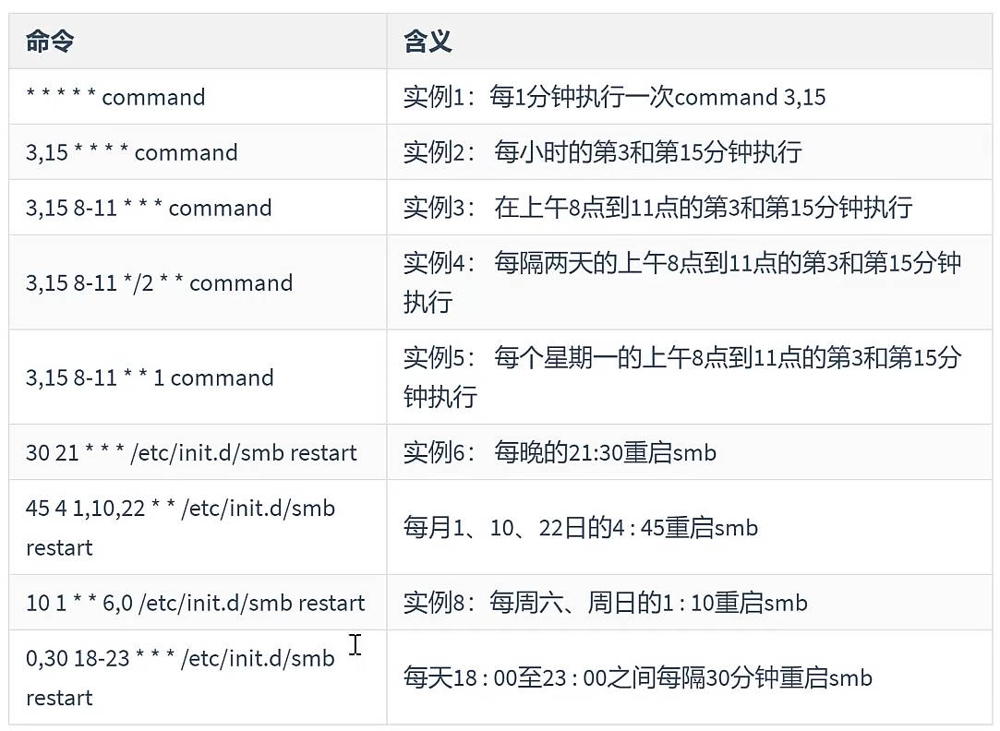 |
| -------------------------------------------------------- | -------------------------------------------------------- |
| 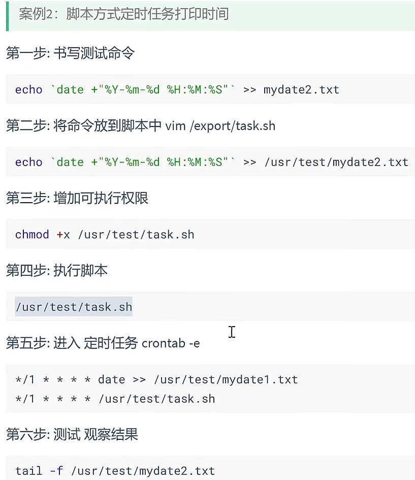 |                                                          |

#### date

[date命令](https://www.runoob.com/linux/linux-comm-date.html)  [date](https://www.cnblogs.com/wzy23/p/11388978.html) 

```sh
date		# -s 手动修改时间 -d 显示字符串所指的日期与时间
date -d "1 day ago" +"%Y-%m-%d"				# 输出昨天日期
date -d "10 minutes" +"%Y-%m-%d %H:%M.%S"	# 10分钟后

ntpdate ntp1.aliyun.com		# 同步时间
timedatectl set-timezone Asia/Shanghai	# 修改时区
date +%F	# 指定格式显示日期 （% + 字母） %H:%M:%S

# 一般用来创建包含日期的文件或目录
touch bak-`date +%F`.txt
```


## 4、常用配置

### **环境变量**

[CentOS7环境变量](https://www.cnblogs.com/htlp/p/14906003.html) [精品：CentOS7设置环境变量](https://blog.csdn.net/lling_shan/article/details/105972338)   [linux的环境变量](https://www.php.cn/faq/490752.html)  [centos7环境变量设置](https://blog.csdn.net/qq_39715000/article/details/125023190) [设置环境变量](https://blog.csdn.net/weixin_44870066/article/details/124573743) 

[CentOS7设置环境变量/etc/profile.d](https://blog.csdn.net/2301_79367634/article/details/132507079)  [/etc/profile和/etc/bashrc](https://www.jianshu.com/p/273f0bc0f9d7)  [环境变量](https://www.cnblogs.com/renyz/p/11351934.html) 

> - **用于启动脚本** ：`/etc/rc5.d/`    `/init.d` 
> - **用于设置环境变量**：`/etc/profile  /etc/bashrc`
> - **管理服务：** `/etc/systemd/system/  /run/systemd/system/  /usr/lib/systemd/system/`

/etc/profile 是所有用户的环境变量；  /etc/enviroment是系统的环境变量

```sh
# 系统环境变量：/etc/bashrc、/etc/profile、/etc/profile.d、/etc/environment
# 推荐：在/etc/profile.d中写脚本文件

# 用户环境变量：~/.bash_profile、~/.bashrc
# 推荐：~/.bash_profile

# 查看 ： env, printenv,echo $var
# 环境变量脚本文件的执行顺序
# /etc/profile -> /etc/profile.d -> /etc/bashrc -> 用户的.bash_profile -> 用户的.bashrc 

# 设置临时环境变量
export JAVA_HOME=/usr/tomcat/jdk-21.0.2
export PATH＝$PATH(获取原有路径):要加入的路径
# 永久
echo 'export MY_VARIABLE="my_value"' >> /etc/profile.d/myenv.sh
# 环境变量生效: source /etc/profile.d/myenv.sh
```

[xshell配色](https://blog.csdn.net/nalanxiaoxiao2011/article/details/135382984) 

### grub启动

[RHEL7/8 Grub2选择启动菜单](https://zhuanlan.zhihu.com/p/85342729)  

## 5、常用软件

[nc-netcat](https://www.baidu.com/s?ie=utf-8&f=8&rsv_bp=1&tn=baidu&wd=nc%20linux&rn=20&oq=nc&rsv_pq=d8f363c30034d18f&rsv_t=1756TD0smchT1ic%2BZYsLx5sj%2BoHS2tbrKDEUWh%2FfDsOnWcuriw2faj38gFE&rqlang=cn&rsv_enter=1&rsv_dl=tb&rsv_sug3=7&rsv_sug1=7&rsv_sug7=100&rsv_sug2=0&rsv_btype=t&inputT=1905&rsv_sug4=2072)  

常用终端：[终端工具](https://blog.csdn.net/zhengnianli/article/details/136493734)	[MobaXterm  v23.0](https://www.jb51.net/softs/845578.html)	

其它：[磁盘监控工具Dutree](https://baijiahao.baidu.com/s?id=1793400190252583363&wfr=spider&for=pc)  

 [xshell文件上传下载](https://www.cnblogs.com/liyuanhong/articles/17740912.html) [Xshell怎么传文件](https://blog.csdn.net/YU_bibo/article/details/134505160) [sz和rz（文件传输、上传、下载）](https://blog.csdn.net/weixin_44799217/article/details/127939194) [Xshell怎么上传本地文件](https://www.xshellcn.com/zhishi/xshell-bdwj.html)  

- k8s命令补全 ： install bash-completion   [scop/bash-completion](https://github.com/scop/bash-completion)   [ubuntu tab键不能自动补全命令的参数](https://blog.csdn.net/hhaowang/article/details/102744813) [-f filename什么意思](https://www.cnblogs.com/liqi175/p/16865110.html) 

```bash
# 用git安装fzf
git clone --depth 1 https://github.com/junegunn/fzf.git ~/.fzf
~/.fzf/install
```

**文件格式**

[linux文件格式_ELF格式文件](https://blog.csdn.net/liang_gu/article/details/105751096) 

**指令集**

[RMv8架构_AArch64](https://blog.csdn.net/JimFire/article/details/120053277) [Darwin（macOS底层）](https://baike.baidu.com/item/Darwin/2537108?fr=aladdin) [PowerPC_ppc架构](https://baike.baidu.com/item/PowerPC/7381773?fr=ge_ala) [linux ppc64](https://www.php.cn/faq/502971.html) [AlmaLinux9支持4种架构](https://sysin.org/blog/almalinux-9/) [在LinuxOne服务器上安装配置KVM客户机](https://www.talkwithtrend.com/Article/246453) 

[什么是Arch Linux](https://cloud.tencent.com/developer/techpedia/1975) [Arch Linux](https://blog.csdn.net/weixin_56556157/article/details/126005752) 

**linux 无法执行二进制文件**

[linux 无法执行二进制文件](https://www.baidu.com/s?ie=utf-8&f=8&rsv_bp=1&tn=baidu&wd=linux%20%E6%97%A0%E6%B3%95%E6%89%A7%E8%A1%8C%E4%BA%8C%E8%BF%9B%E5%88%B6%E6%96%87%E4%BB%B6&oq=chmod&rsv_pq=d2d7a9a4018b8028&rsv_t=6b8a8loq8PD1htbpFUSock8u5P5AsVw49E359IeGBWWbT1%2B6EpQlAxeMre8&rqlang=cn&rsv_enter=1&rsv_dl=tb&rsv_sug3=8&rsv_sug1=8&rsv_sug7=100&rsv_n=2&rsv_sug2=0&rsv_btype=t&inputT=2342&rsv_sug4=4076) 

```bash
file your_binary_file 			# 检查文件格式
chmod +x your_binary_file 		# 给文件添加执行权限
ldd your_binary_file 			# 检查缺失的依赖库
sudo apt-get install lib库名     # 安装缺失的库
```

**软件安装方法**

[Manual Installation](https://github.com/ahmetb/kubectx?tab=readme-ov-file#installation)  [tar.gz](https://helm.sh/zh/docs/intro/install/) 

**dns**

[centos 安装 nscd ](https://blog.csdn.net/weixin_39857866/article/details/125819371)  

### ==模糊搜索fzf==

[模糊搜索工具fzf](https://zhuanlan.zhihu.com/p/74404257) [junegunn/fzf官方安装](https://github.com/junegunn/fzf?tab=readme-ov-file#using-linux-package-managers)  [ubuntu怎么安装tar.gz文件](https://wenku.csdn.net/answer/d7a219a380146d91c6cb87e8cf010cb4) [exa、fzf、bat软件的安装](https://blog.csdn.net/S_AGZX/article/details/123294377) [安装fzf和bat](https://blog.csdn.net/pigpigpig64/article/details/127431930) [模糊搜索工具fzf](https://zhuanlan.zhihu.com/p/74404257) 

[linux高效历史记录_百度搜索](https://www.baidu.com/s?wd=linux%E9%AB%98%E6%95%88%E5%8E%86%E5%8F%B2%E8%AE%B0%E5%BD%95&rsv_spt=1&rsv_iqid=0xe381245a01ae17a3&issp=1&f=8&rsv_bp=1&rsv_idx=2&ie=utf-8&tn=baiduhome_pg&rsv_dl=tb&rsv_enter=1&rsv_sug3=23&rsv_sug1=24&rsv_sug7=100&rsv_sug2=0&rsv_btype=i&inputT=22846&rsv_sug4=22845)  

[好：fzf命令行模糊搜索](https://www.jianshu.com/p/b48131e4ad06) [使用 Loki 和 fzf 升级你的 shell 历史](https://devpress.csdn.net/linux/62ff365a7e66823466193731.html) 

```sh
# 按键绑定,  keybindings for Bash
apt show fzf

vi /usr/share/doc/fzf/README.Debian
vi ~/.bashrc
source /usr/share/doc/fzf/examples/key-bindings.bash
source /usr/share/doc/fzf/examples/completion.bash			# 官网shell目录下有
source /usr/share/doc/fzf/examples/fzf.vim
```


### tmux

[Tmux-阮一峰](https://www.ruanyifeng.com/blog/2019/10/tmux.html)  [tmux](https://c.biancheng.net/linux/tmux.html) 

## 6、linux目录

[好： Linux目录结构说明](https://www.runoob.com/linux/linux-system-contents.html)      [好：etc目录](https://www.cnblogs.com/rumenz/articles/15605447.html)  [etc目录-etcetera](https://blog.csdn.net/jtydxx/article/details/130098638)  

[usr目录结构](https://blog.csdn.net/ken2232/article/details/139741867)   [Linux实用工具 之 strace，深入理解系统调用的利器](https://www.bilibili.com/video/BV1CxcgefEpM/?vd_source=7346303e5e18677d7261c2c0c109ecfd)	[ Linux 目录](https://www.bilibili.com/video/BV1WUceeAEaM/?vd_source=7346303e5e18677d7261c2c0c109ecfd)	

**系统启动必须**:  /boot,/etc,/lib,/sys

**指令集合**： /bin,/sbin

**外部文件管理**： /dev,/media, /mnt

**临时文件**: /run,**/lost+found**, /tmp

**账户**: /root,  /home,  /usr,  /usr/bin,  /usr/sbin,   /usr/src

**运行过程中要用**: /var,  /proc

**扩展用**： /opt，  /srv

```
du -h常用 -s仅显示总数 
du -sh /etc查看目录大小 
ll-h /etc/hosts查看文件大小


/etc：	etcetera，系统管理所需要的配置文件
/lib：	动态链接库

/mnt：	用户临时挂载别的文件系统； 
/media： U盘、光驱等等，Linux 会把识别的设备挂载到这个目录

/opt： optional(可选) ，安装软件目录

/lost+found	： 一般情况是空的，当系统非法关机后，这里就存放了一些文件
```

- ==/proc==： 伪文件系统（也即虚拟文件系统），存储的是当前内核运行状态的一系列特殊文件，这个目录是一个虚拟的目录，它是系统==内存的映射==，可以通过直接访问这个目录来==获取系统信息==;  管理**内存空间**
- /bin: 存放==最经常使用==的命令
- /sbin： Super user Binaries (超级用户的二进制文件)， 存放系统管理员使用的，==系统管理程序==
- /usr : unix shared resources(==共享资源==)，非常重要的目录，用户的很多应用程序和文件都放在这个目录下，类似 ==program files 目录==
  - **/usr/bin：**	系统用户使用的==应用程序==。
  - **/usr/sbin： **   超级用户使用的, 比较高级的管理程序和系统守护程序。
  - **/usr/src：**     内核源代码默认的放置目录。
  - /sbin, /usr/sbin 给 root 使用的指令;    **/bin**、**/usr/bin** 给系统用户使用的指令（==除 root 外的通用用户==）
- **/srv**： 存放一些==服务启动后==需要提取的数据
- **/sys**：  2.6 内核新出现的一个==文件系统 sysfs==， 该文件系统是内核设备树的一个直观反映
- ==/var== : variable(变量)，存放着在不断扩充着的东西，习惯将那些==经常被修改的目录==放在这个目录下。包括各种日志文件
- /run: 是一个==临时文件系统==，存储==系统启动以来的信息==。当系统重启时，这个==目录下的文件应该被删掉或清除==。如果你的系统上有 /var/run 目录，应该让它指向 run

## 7、包管理

[Ansible PlayBook](https://www.baidu.com/s?ie=UTF-8&wd=Ansible%20PlayBook)  

### apt

[docker容器里没有vi怎么编辑文档](https://blog.51cto.com/u_16213364/8976785)  [没有vi修改文件](https://blog.51cto.com/u_16175491/6789021) 

[apt源](https://blog.csdn.net/u010502101/article/details/89067757) [apt国内镜像源](https://blog.csdn.net/carefree2005/article/details/134133077) [ubuntu20.04国内镜像](https://zhuanlan.zhihu.com/p/662286658?utm_id=0) 

```bash
apt update
apt list --upgradable
```

### yum

[yum一次安装多个包](https://www.baidu.com/s?ie=UTF-8&wd=yum%E4%B8%80%E6%AC%A1%E5%AE%89%E8%A3%85%E5%A4%9A%E4%B8%AA)  [ansible-play 使用yum模块批量安装多个软件包](https://www.cnblogs.com/LBSD/p/16989021.html)    [rpm依赖自动解决，yum批量安装，本地源](https://www.cnblogs.com/wutou/p/14283939.html)  

```bash
yum install package1 package2 package3		# 多个包空格分隔
# 从定义的包组中安装多个包，可以使用@符号指定组， 需要的仓库都已经启用
yum install @group1 @group2
```


## 8、重定向

### 重定向

[**exec绑定重定向**](https://www.cnblogs.com/VicLiu/p/15016927.html)  [Shell重定向](https://www.runoob.com/linux/linux-shell-io-redirections.html)  [exec调用其它的命令](https://blog.csdn.net/qq_41057770/article/details/127234868)   [永久重定向与重定向恢复（利用exec命令实现）](https://blog.csdn.net/oqqHuTu12345678/article/details/129277555)   [重定向](https://blog.csdn.net/weixin_34176694/article/details/93361436)  

```shell
[chengmo@centos5 shell]$ cat > catfile 
testing 
cat file test
#这里按下 [ctrl]+d 离开 
#从标准输入【键盘】获得数据，然后输出给catfile文件
 
[chengmo@centos5 shell]$ cat>catfile <test.sh
#cat 从test.sh 获得输入数据，然后输出给文件catfile 
wc -l < users  		# 从users获得数据，然后统计 

[chengmo@centos5 shell]$ cat>catfile <<eof
test a file
test!
eof
 
#<< 代表『结束输入字符』。当空行输入eof字符，输入自动结束，不用ctrl+D
```

Linux 命令运行时会打开三个文件：

- ==标准输入==文件(stdin)：stdin的==文件描述符为0==，使用 < 或 << ； /dev/stdin -> /proc/self/fd/0 0代表：/dev/stdin
- ==标准输出==文件(stdout)：stdout 的文件描述符为1，使用 > 或 >> ； /dev/stdout
- ==标准错误文件==(stderr)：stderr的文件描述符为2，程序会向stderr流中写入错误信息。使用 2> 或 2>> ； /dev/stderr 

默认情况下，command > file 将 stdout 重定向到 file，command < file 将stdin 重定向到 file

```shell
command 2>file			# stderr 重定向到 file
command 2>>file			# stderr 追加到 file 文件末尾
<< tag					# 将开始标记 tag 和结束标记 tag 之间的内容作为输入
n >& m					# 将输出文件 m 和 n 合并
n <& m					# 将输入文件 m 和 n 合并

# &表示重定向的目标不是文件，而是一个文件描述符
command > file 2>&1		# 将 stdout 和 stderr 合并后重定向到 file
	
# 将输入输出都重定向
command < file1 >file2    # stdin 重定向到 file1，stdout 重定向到 file2

# exec -c echo Linux
# 上面的重定向,只对当前指令有效。如果要接下来的所有命令都重定向。用exec命令
exec 6>&1		# 将标准输出与fd 6绑定,  ls  /proc/self/fd/ 
exec 1>suc.txt	# 接下来所有命令标准输出，绑定到suc.txt文件（输出到该文件）, ls
exec 1>&6		# 恢复标准输出
exec 6>&-		# 关闭fd 6描述符, ls /proc/self/fd/

# exec把重定向搞乱怎么恢复
exec >/dev/tty   # 代表显示器
```

`1>file 标准输出重定向到file；  2>&1 1和2合并后重定向到file`

```shell
2>1 	# 代表将stderr重定向到文件名为1的文件
2>&1 	# 代表将stderr重定向到文件描述符为1的文件(即/dev/stdout)中
#  &>file 是一种特殊的用法，也可以写成 >&file，等价于 >file 2>&1

command > /dev/null			# /dev/null 是一个特殊的文件，写入到它的内容都会被丢弃,将命令的输出重定向到它，会起到"禁止输出"的效果
command > /dev/null 2>&1	# 屏蔽 stdout 和 stderr
```

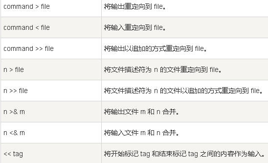

==重定向应用==通常两点：

1. 重新设置命令的默认输入，输出，指向到自己文件（文件，文件描述符，设备其实都是文件，因为linux就是基于设备也是文件，描述符也指向是文件）
2. 扩展自己新的描述符，对文件进行读写操作

#### Here Document 

[here文档作多行注释](https://www.runoob.com/linux/linux-shell-variable.html)   [Here Document 免交互的使用方法](https://blog.csdn.net/m0_58292366/article/details/124672091)  [shell自动化脚本](https://www.baidu.com/s?ie=utf-8&f=8&rsv_bp=1&tn=baidu&wd=shell%E8%87%AA%E5%8A%A8%E5%8C%96%E8%84%9A%E6%9C%AC&rn=20&oq=shell%25E8%2587%25AA%25E5%258A%25A8%25E5%258C%2596%25E8%2584%259A%25E6%259C%25AC%25E6%2580%258E%25E4%25B9%2588%25E5%2586%2599&rsv_pq=a709de30000d60a3&rsv_t=6939XC6l7%2BQrdRRDAdTnVm234RoVqyV0ggVXc5KK1z2IclwvwplysM5BQEg&rqlang=cn&rsv_enter=0&rsv_dl=tb&rsv_btype=t&inputT=977&rsv_sug3=4&rsv_sug1=3&rsv_sug7=100&rsv_sug4=1971&rsv_sug=1) 

特殊的==输入重定向==，将输入重定向到一个交互式 Shell 脚本或程序

- 将EOF之间的内容，作为输入传给command

```shell
command << delimiter
    document
delimiter
# 将两个 delimiter 之间的内容(document) 作为输入传递给 command
# 将输入重定向到一个交互式 Shell 脚本或程序

cat > test <<EOF
CAT >> test <<EOF
```

```shell
# : 是一个空命令，用于执行后面的 Here 文档, EOF使用其他符号

: <<'COMMENT'
这是注释的部分
COMMENT

:<<'				# EOF可以使用其他符号  ''  !   EOF
注释内容
'

:<<!
注释内容
!

:<<EOF
注释内容
EOF

: '
这是注释的部分, 		# : + 空格 + 单引号
'
```

### 管道

[bash中的|、||、&、&&含义和优先级](https://zhuanlan.zhihu.com/p/643068639)   [Bash管道和重定向 ](https://www.cnblogs.com/ninja-ken/articles/17343062.html) [Bash操作符&,&&,|,||](https://blog.csdn.net/qq_41248471/article/details/101948315) 

[管道详解](https://cloud.tencent.com/developer/article/2130608) [管道](https://blog.csdn.net/weixin_74078718/article/details/130442260)

> - && : 前一条命令执行成功,执行后一条命令
> - || : 前一条命令执行失败,才执行后一条命令
> - &  : 任务置于后台运行
> - |  : 前一条命令的输出，用作后一条命令的输入

### ==xargs/反引号==

[管道和xargs的区别](https://www.cnblogs.com/timeisbiggestboss/p/7051081.html)  [exec 和 xargs 区别](https://blog.csdn.net/qq_40256654/article/details/136722031)   [xargs | 菜鸟教程](https://www.runoob.com/linux/linux-comm-xargs.html)    

 [xargs命令](https://www.cnblogs.com/chentiao/p/16543679.html)   

[linux反引号](https://www.baidu.com/s?ie=utf-8&f=8&rsv_bp=1&tn=baidu&wd=linux%E5%8F%8D%E5%BC%95%E5%8F%B7&rn=20&oq=ls%2520-lh&rsv_pq=8491f2a90355a3f6&rsv_t=abb0Lrm%2FCIpnKbtBvF9zX1g2HB3pghHQChBjg3AKjRS86ZRybi3zr2UXdy8&rqlang=cn&rsv_enter=1&rsv_dl=tb&rsv_sug3=14&rsv_sug1=11&rsv_sug7=100&rsv_sug2=0&rsv_btype=t&inputT=5289&rsv_sug4=5290)    

- 管道：将前一个命令的标准输出作为下一个命令的标准输入
  - ls|cat是将ls的结果作为一个文件file，然后cat file
- xargs：将标准输入传递给下一个命令，作为其参数。（和管道连用）
  - ==作用==： 将[参数列表](https://baike.baidu.com/item/参数列表/10536601?fromModule=lemma_inlink)转换成小块分段传递给其他命令，以避免参数列表过长的问题
  - ls|xargs cat 是将ls的==结果作为一个参数==传递给cat，即cat test
  - 很多命令不支持|管道来传递参数，所以就有了 xargs  `find / -type l |xargs ls -l`
- 反引号，用来`执行一个命令，并将其输出作为另一个命令的参数`。反引号在Shell脚本编写中非常有用

[xargs_百度百科](https://baike.baidu.com/item/xargs/2847408?fr=ge_ala)  

```sh
rm `find /path -type f`
# 如果path目录下文件过多就会因为“参数列表过长”而报错无法执行。但改用xargs以后，问题即获解决。
find /path -type f -print0 | xargs -0 rm
# 本例中xargs将find产生的长串文件列表拆散成多个子串，然后对每个子串调用rm。这样要比如下使用find命令效率高的多。

find /path -type f -exec rm '{}' \;
# 上面这条命令会对每个文件调用"rm"命令。当然使用新版的"find"也可以得到和"xargs"命令同样的效果：
find /path -type f -exec rm '{}' +
# xargs的作用一般等同于大多数Unix shell中的反引号，但更加灵活易用，并可以正确处理输入中有空格等特殊字符的情况。对于经常产生大量输出的命令如find、locate和grep来说非常有用。
```


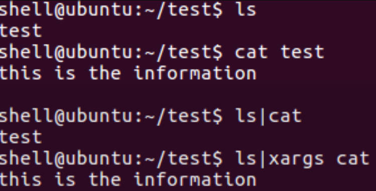


```sh
cat test.txt | xargs		#多行输入单行输出
cat test.txt | xargs -n3	#3行输出
echo "nameXnameXnameXname" | xargs -dX	#定义分隔符
cat test.sh |xargs -L3		#-L一次读取3行
-t 							#先打印命令，然后再执行

#  -I 指定一个替换字符串 {}，-p {}的内容被替换为管道的输入
cat test.sh |xargs -I {}  echo -p {} -l

#复制所有图片文件到 /data/images 目录下
ls *.jpg | xargs -n1 -I {} cp {} /data/images

#xargs 结合 find 使用
#用 rm 删除太多的文件时候，可能得到一个错误信息：/bin/rm Argument list too long. 用 xargs 去避免这个问题: xargs -0 将 \0 作为定界符
find . -type f -name "*.log" -print0 | xargs -0 rm -f
#统计一个源代码目录中所有 php 文件的行数
find . -type f -name "*.php" -print0 | xargs -0 wc -l
#查找所有的 jpg 文件，并且压缩它们
find . -type f -name "*.jpg" -print | xargs tar -czvf images.tar.gz
# 假如你有一个文件包含了很多你希望下载的 URL，你能够使用 xargs下载所有链接
# cat url-list.txt | xargs wget -c

# 反引号(``)，用来执行一个命令，并将其输出作为另一个命令的参数。反引号在Shell脚本编写中非常有用
touch bak-`date +%F`.txt
mkdir -p /backup/bak-dir-`date +%F_%w`
```


## 9、shell

[shell学习的老男孩课程](https://www.bilibili.com/video/BV1XB4y1P7Sh?p=11&vd_source=7346303e5e18677d7261c2c0c109ecfd)   [shell脚本中单引号和双引号区别](https://www.baidu.com/s?ie=utf-8&f=3&rsv_bp=1&tn=baidu&wd=shell%E8%84%9A%E6%9C%AC%E4%B8%AD%E5%8D%95%E5%BC%95%E5%8F%B7%E5%92%8C%E5%8F%8C%E5%BC%95%E5%8F%B7%E6%9C%89%E4%BB%80%E4%B9%88%E5%8C%BA%E5%88%AB&rn=20&oq=alias%2520ld%253D%2526%252339%253Bls%2520%25241%2520%257C%2520grep%2520%2526%252339%253B&rsv_pq=b4b8fa6902467ff9&rsv_t=072ehS9MRkplMjQcGtGC%2BGFfWa40qTA%2B6Ht3eM%2BeA%2FSNFHG5J7JNUzlpWuM&rqlang=cn&rsv_enter=1&rsv_dl=ts_1&rsv_btype=t&inputT=11971&rsv_sug3=127&rsv_sug1=100&rsv_sug7=100&rsv_sug2=1&prefixsug=shell%25E8%2584%259A%25E6%259C%25AC%25E4%25B8%25ADd&rsp=1&rsv_sug4=13264) 

[10个Linux服务](https://blog.51cto.com/u_15091060/2669418) [Shell编程](https://developer.aliyun.com/article/1303876) 

[shell脚本](https://www.bilibili.com/video/BV1vM4m197ZT/?spm_id_from=333.1007.tianma.2-3-6.click&vd_source=7346303e5e18677d7261c2c0c109ecfd)   [-f filename什么意思](https://www.cnblogs.com/liqi175/p/16865110.html)  [shell中if的“-e，-d，-f”的含义](https://blog.csdn.net/weixin_30311521/article/details/117015894) [-f写命令前面什么意思](https://www.baidu.com/s?ie=utf-8&f=8&rsv_bp=1&tn=baidu&wd=-f%E5%86%99%E5%91%BD%E4%BB%A4%E5%89%8D%E9%9D%A2%E4%BB%80%E4%B9%88%E6%84%8F%E6%80%9D%20%20linux&rn=20&oq=-f%2520%252Fusr%252Fshare%252Fbash-completion%252Fbash_completion&rsv_pq=fce6efe000484004&rsv_t=3c79J44nH1M7A13Bi%2Ff3WvpFC4exZbLRCa3SFXNPk9ms7WQpSL8%2BEZQH%2F4k&rqlang=cn&rsv_enter=1&rsv_dl=tb&rsv_sug3=36&rsv_sug1=27&rsv_sug7=100&rsv_sug2=0&rsv_btype=t&inputT=16824&rsv_sug4=19859) 
[回显脚本中的$PS1](https://cloud.tencent.com/developer/information/%E5%9B%9E%E6%98%BE%E8%84%9A%E6%9C%AC%E4%B8%AD%E7%9A%84%24PS1-album)  [$PS1](https://www.baidu.com/s?ie=UTF-8&wd=$PS1) 

[跟老男孩学Linux运维：Shell编程](https://www.processon.com/view/5e5b4f97e4b0cc44b5b4c504)  [常用的shell脚本](https://www.bilibili.com/read/cv33550290/?jump_opus=1)  [shell](https://www.processon.com/view/60573e28e401fd4c038975aa)  [shell脚本编程](https://www.processon.com/view/64801870320a4e3425909a8a)  [老男孩教育-shell编程](https://www.bilibili.com/video/BV1x54y1f7Ez/?p=2&vd_source=7346303e5e18677d7261c2c0c109ecfd) 

- 脚本书写方式
- 脚本执行方式
- 变量分类
  - 变量配置文件
  - 变量定义
  - Shell重要的位置变量
  - 三种传参方式

[shell脚本中单引号和双引号有什么区别](https://www.baidu.com/s?ie=utf-8&f=3&rsv_bp=1&tn=baidu&wd=shell%E8%84%9A%E6%9C%AC%E4%B8%AD%E5%8D%95%E5%BC%95%E5%8F%B7%E5%92%8C%E5%8F%8C%E5%BC%95%E5%8F%B7%E6%9C%89%E4%BB%80%E4%B9%88%E5%8C%BA%E5%88%AB&rn=20&oq=alias%2520ld%253D%2526%252339%253Bls%2520%25241%2520%257C%2520grep%2520%2526%252339%253B&rsv_pq=b4b8fa6902467ff9&rsv_t=072ehS9MRkplMjQcGtGC%2BGFfWa40qTA%2B6Ht3eM%2BeA%2FSNFHG5J7JNUzlpWuM&rqlang=cn&rsv_enter=1&rsv_dl=ts_1&rsv_btype=t&inputT=11971&rsv_sug3=127&rsv_sug1=100&rsv_sug7=100&rsv_sug2=1&prefixsug=shell%25E8%2584%259A%25E6%259C%25AC%25E4%25B8%25ADd&rsp=1&rsv_sug4=13264) 

单引号双引号区别在于它们==对特殊字符的处理==方式

- 单引号保持引号内所有字符的字面值，不进行任何特殊字符的解析，保持原样输出
- 双引号允许对特定字符进行解析，如变量替换、命令替换等

### 1、Debug

1. 看懂别人的shell脚本； 尽量多用变量、函数
   1. 拆解要求，写伪代码（中文），写shell代码
   2. shell编程也叫bash高级编程

```sh
# shell调试方法
sh -x			# 显示脚本执行过程，+执行过程；不带+号的是标准输出，++多优先级高
# set设置debug开始和结束位置，显示一部分执行过程； 在脚本里加上set -x， set +x
set -x		# 开启debug模式，set +x 关闭
```


| 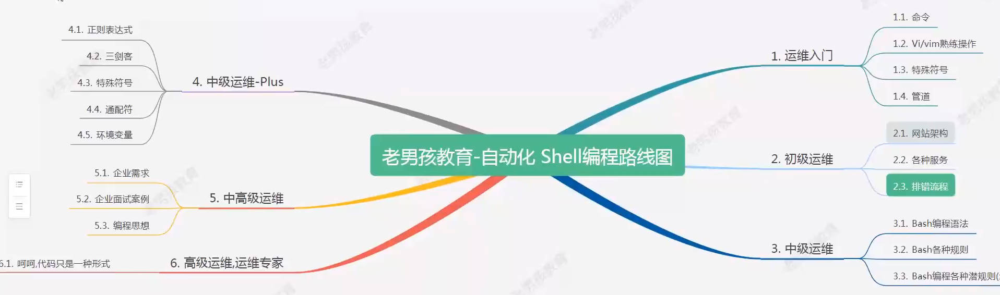 | 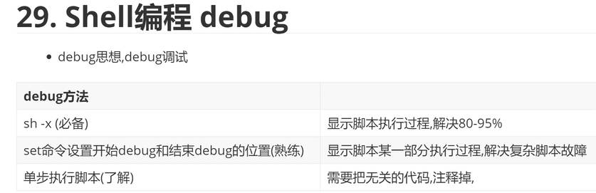 |
| -------------------------------------------------------- | -------------------------------------------------------- |

[tr过滤器](https://blog.csdn.net/u012349696/article/details/78104713)  [输入输出管理](https://blog.csdn.net/weixin_54720351/article/details/112981878) [tr命令](https://www.bilibili.com/video/BV1Ur4y1U7ic/?spm_id_from=333.337.search-card.all.click&vd_source=7346303e5e18677d7261c2c0c109ecfd) 

==执行脚本的方法：==

- sh test.sh； 也可加输入重定向： sh <test.sh
- chmod +x test.sh,加执行权限，用绝对或相对路径执行 `./test.sh`
- source或.在当前环境执行1次脚本： `. test.sh`
  - 让环境变量生效： source /etc/profile
  - ==实现文件包含==： source实现类似include功能，把其它位置的配置文件，包含进主配置文件；  在主配置中写==source /其它位置文件==，相当于把配置文件复制粘贴过来


[Shell常用脚本](https://zhuanlan.zhihu.com/p/526263882) [Shell函数（例action）](https://www.runoob.com/linux/linux-shell-func.html) [Shell自带工具](https://cloud.tencent.com/developer/article/2182709)   [shell函数](https://blog.51cto.com/topic/shellhanshuaction.html) 

```
#!/bin/bash			#第一行指定脚本默认使用的命令解释器； #!叫幻数
```

==shell编程基础知识习惯==  	[Shell基础知识](https://www.cnblogs.com/FlyGoldfish/articles/15057016.html)   [Shell编程规范](https://www.cnblogs.com/xiewenming/p/7985508.html) [shell编程习惯和规范](https://download.csdn.net/blog/column/10633318/128376038)  

- 书写脚本加上 第1行命令解释器
- 版权声明：脚本谁在什么时候写的
- 不要加上中文
- 成对的符号提前写好
- 脚本文件名：尽量不要包含服务名称，看见文件名，知道脚本作用; 例nginx服务，脚本别用nginx.sh 

### 2、==shell变量==

[Shell变量](https://www.cnblogs.com/FlyGoldfish/articles/15057156.html)  [变量](https://cloud.tencent.com/developer/article/2121990) 

[命令提示符设置PS1](https://blog.csdn.net/sinat_32960911/article/details/134072881)  [PS1设置](https://blog.csdn.net/weixin_44462681/article/details/129171256) [修改命令提示符和PS1变量](https://blog.csdn.net/zhanghongshun624/article/details/127987065) [PS1修改命令行提示符样式](https://www.cnblogs.com/houyongchong/p/9303719.html)  [PS1](https://zhidao.baidu.com/question/204441878.html)  [$debian_chroot](https://blog.csdn.net/weixin_34526937/article/details/113425084) 

[Linux常见shell：sh、bash、csh、tcsh、ash](https://blog.csdn.net/Tang_shui/article/details/83343910)   

变量的本质：内存中的区域

`export 设置或显示环境变量(全局变量);  declare 声明 shell 变量; set设置shell的执行方式`

==变量分类==

- 普通变量（==局部变量==）：脚本中写的
- 环境变量（==全局变量==）：系统创建， 大写字母;   查看:`env declar export`
- 特殊变量
  - shell变量（特殊变量）：==特殊的符号==；  匹配脚本参数 服务状态  特殊替换

变量后面想添加内容，要把变量{}起来。 `echo ${week}_day`

```sh
# 开启export HISTCONTROL=ignorespace后， 命令前加空格不记入历史中
# 开启export PROMPT_COMMAND=date后，date命令会在下个命令执行前运行； 用来做简单的审计		取消：unset  PROMPT_COMMAND
# 手动创建环境变量： export OLD=666;  查看： env|grep OLD;   取消：unset OLD
# 设置永久： /etc/profile
```


| 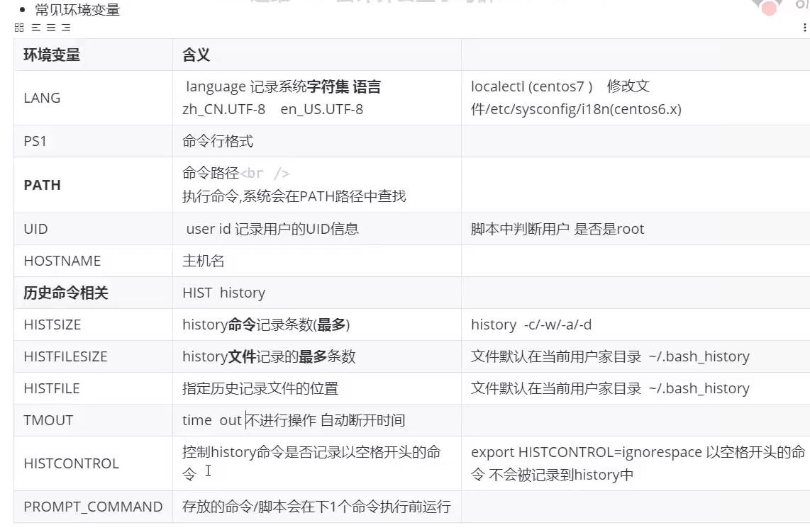 | 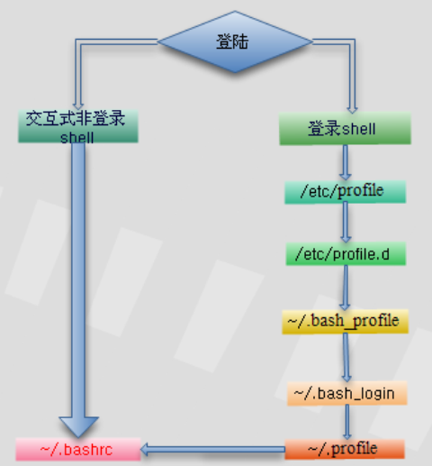 |
| -------------------------------------------------------- | ----------------------------------- |

[好：启动顺序](https://blog.csdn.net/Dontla/article/details/128991142)   [好：文件说明](https://blog.csdn.net/bandaoyu/article/details/103459252)  [好：变量执行顺序](https://www.cnblogs.com/yeziwinone/p/16333679.html)   [Linux环境变量设置](https://blog.csdn.net/yu15050186065/article/details/115376843) 

当登入系统获得一个shell进程时，其==读取环境==设定档有三步

1. 首先读入全局环境变量设定档==/etc/profile==，然后根据其内容读取额外的设定的文档，如==/etc/profile.d和/etc/inputrc==
2. 然后根据不同使用者帐号，去其家目录读取==\~/.bash_profile，如果这读取不了就读取~/.bash_login==，这个也读取不了才会读取==\~/.profile==，这三个文档设定基本上是一样的，读取有优先关系
3. 然后根据用户帐号读取==~/.bashrc==

==分析：==看了源码，

- `/etc/profile`里include了 `. /etc/bash.bashrc 和 /etc/profile.d`;  
- `.profile `里include了 `.bashrc` 

==与变量有关的文件==		[Shell变量](https://www.cnblogs.com/FlyGoldfish/articles/15057156.html)   [etc/bashrc_百度搜索](https://www.baidu.com/s?ie=UTF-8&wd=etc/bashrc)  

| 文件（每次用户登录系统执行） |                                             |                                              | 加载                         |
| :--------------------------- | ------------------------------------------- | -------------------------------------------- | ---------------------------- |
| /etc/profile                 | 存放==环境变量==, 每个用户设置环境          | 全局生效,**所有用户生效**的配置              | 系统Login登录后{退出，login} |
| /etc/bashrc                  | bash ==shell的配置文件==                    | 全局生效                                     | 系统Login登录后              |
| ~/.bashrc                    | 当前用户的别名                              | 局部生效, 仅对当前用户生效                   | **启动bash shell**           |
| ~/.bash_profile              | 当前用户的环境变量                          | 局部生效                                     | **启动bash shell**           |
| /etc/profile.d/xxxx.sh       | 用户登录系统后执行这个目录下以.sh结尾的脚本 | 应用场景：书写一个跳板机，跳板机可以放在这里 |                              |

[bashrc](https://www.baidu.com/s?ie=UTF-8&wd=bashrc)  [开机自启文件](https://blog.csdn.net/Dontla/article/details/128991142)   

- ==/etc/profile==:  **所有用户生效**的配置, 当用户第一次登录时,该文件被执行. 并从/etc/profile.d目录的配置文件中搜集shell的设置
  - /etc/profile会首先执行/etc/profile.d/目录下的所有*.sh文件
- ==/etc/bashrc==:  Bash Run Commands，**bash shell的配置文件**，每次**打开新的bash shell时**都会自动执行
- ==~/.bash_profile==: 在用户登录时执行的， 包含==与系统交互的命令==,如设置环境变量、添加系统路径等。这个文件通常用来==定制用户的登录环境==
- ==~/.bashrc==: 每次打开一个新的终端时都会执行,  包含==与用户交互的命令==，比如设置别名、定义函数等。通常用来==定制用户的shell==环境。 **仅对当前用户生效**
- ==/etc/profile.d/==: 存放==应用程序所需的启动脚本==，其中包括了颜色、语言、less、vim及which等命令的一些附加设置。这些脚本能够被自动执行，是因为在/etc/profile 中使用一个==for循环语句来调用==这些脚本

```sh
# /etc/profile，	  /etc/bashrc 	系统全局环境变量设定
# ~/.profile，	  ~/.bashrc		用户家目录下的私有环境变量设定
```

#### 特殊变量

[linux变量](https://blog.csdn.net/bandaoyu/article/details/124345669) 

> 位置变量、状态变量、==变量子串==、==变量扩展==

应用场景： 

1. 提高书写脚本及脚本执行效率 
2. 判断服务状态、匹配脚本参数、删除、特殊替换

| ==位置变量== | 含义               | 应用                                                  |
| :----------- | :----------------- | :---------------------------------------------------- |
| **$0**       | 脚本名字           | 脚本执行错误，给出提示或者使用帮助                    |
| **$n**       | 脚本的第N个参数    | 命令传参，传递给脚本，在脚本中使用                    |
| **$#**       | 统计==参数的个数== | 脚本开头，判断脚本是否传参，判断参数个数是否正确      |
| **$***       | 获取脚本所有的参数 | 加上双引号，相当于==所有参数是一个整体==   "$*"       |
| **$@**       | 获取脚本所有的参数 | 加上双引号，每个都是独立： 将每一个参数当成是一个整体 |


```sh
echo \${0..12}
# $n n>=10，会识别为$1 + 0; 要加 ${10}
man bash |wc -l
ping -c3 			# 只ping3次

# $? == 0, 等于 $? -eq 0, (equl)
ping -c3 baidu.com >/dev/null 2>&1		# 不显示执行过程
```


| 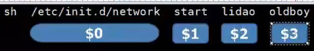 | 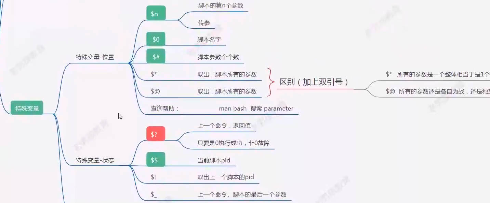 |
| ------------------------------------------------------------ | -------------------------------------------------------- |

##### ==状态变量==

| 符号 | 含义                           | 应用                                                   |
| :--- | :----------------------------- | :----------------------------------------------------- |
| $?   | 上一条命令/脚本的返回值，0正常 | 判断命令的执行是否成功                                 |
| $$   | 当前运行脚本的pid              | 脚本运行时将pid记录到文件，方便kill;  服务管理脚本使用 |
| $!   | 上一个运行脚本的pid            |                                                        |
| $_   | 上一个命令或脚本的最后一个参数 | 类似于按ESC + .                                        |

```sh
# $$  将输入重定向到一个交互式 Shell 脚本或程序
cat >> test.sh<<EOF
#!/bin/bash
echo $$ 
sleep 999
EOF
# ps -ef |grep test.sh   用另一个会话查看pid
# $$应用: 脚本运行时生成pid文件，方便以后kill	echo $$ >/test.pid
```

作业： 

```sh
ping -c3 -W0.5 www.163.com			# timeout超时 只等0.5s；  每次ping有间隔时间interval: -i 0.1

# ping网站通不通
cat >test.sh <<EOF 
#!/bin/bash
url=$1
ping -c3 -W1 -i0.1 $url  >/dev/null 2>&1
if [ $? -eq 0 ];then
        echo "$url is ok"
else
        echo "$url is failed"
fi
EOF
sh test.sh  www.baidu.com		
```

##### ==变量子串==

[linux中各种括号的使用](https://blog.csdn.net/qq_41551450/article/details/92803686)  [linux中括号](https://www.cnblogs.com/hui314/archive/2013/06/05/linux_shell_tags.html) 

文件没有修改，只是把输出到屏幕上的内容改了

```sh
time for n in {1..10000}; do echo ${#n} >/dev/null;done		# for n in {1..10}; do echo ${n};done
time for n in {1..10000}; do echo ${n}|wc -L  >/dev/null;done	# 很慢

oldboy=996.icu
echo ${oldboy:3:2}		# 从下标为3开始截取，取2个字符

# 删除： ${变量#内容}  从左边开始（删开头，只删第一个匹配到的：懒惰）；   ${变量%内容}  右边开始（删结尾）
dirname   /etc/sysconfig/test	# 取路径
basename  /etc/sysconfig/test	# 取文件名
```


| 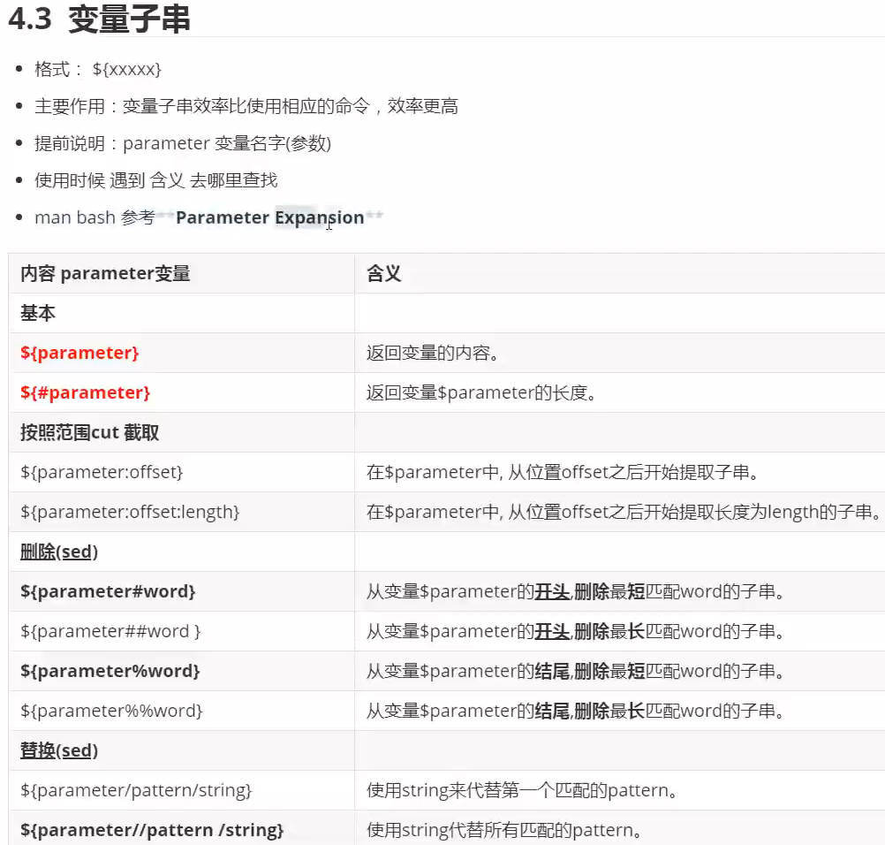 | 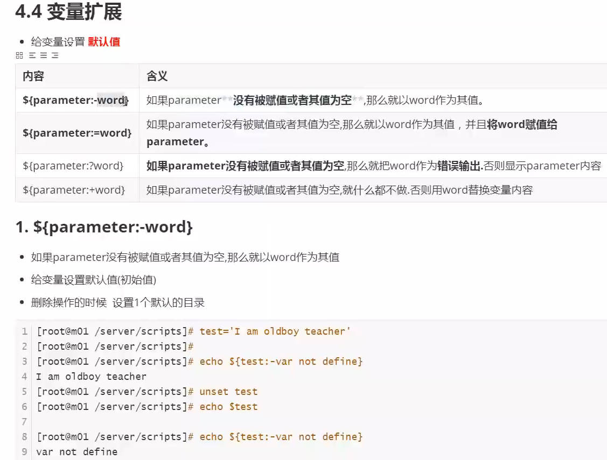 |
| -------------------------------------------------------- | -------------------------------------------------------- |

##### ==变量扩展==

`${para:-word}	变量内容没改，只是屏幕上显示word； 如果改变量内容，用${para:=word}`

```
echo ${dir:?/tmp}	# 如果是空，就报错； 把word作为错误信息输出
echo ${dir:+/tmp}	# 变量没内容不管，有内容就强制替换
```

##### ==变量赋值==

```sh
read -t 5 -p "input url to ip:"   addr
# 用read时，用^+del 或 ^+u删除
# 输入内容，就把值赋给变量addr了; -t 超时时间，给5s输入时间  -s 不显示用户输入内容
```

| 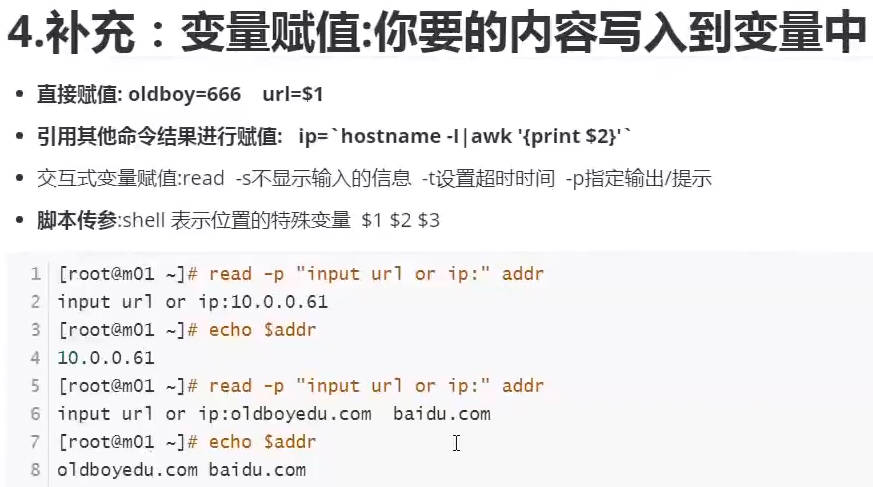 | 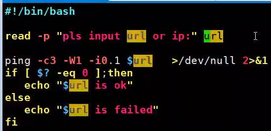 |
| -------------------------------------------------------- | ------------------------------------------------------------ |

#### 变量替换

[好：shell字符串操作](https://zhuanlan.zhihu.com/p/478091012) [bash变量替换](https://blog.csdn.net/weixin_30593261/article/details/94910220)    [Linux对变量的截取替换](https://www.cnblogs.com/xiaochina/p/9742505.html)  [好：shell字符串操作(长度，查找，替换)](https://www.jb51.net/article/73391.htm)    [双百分号（%%）_变量替换](https://www.volcengine.com/theme/3723869-Z-7-1)   [Shell中的${}、##和%%使用](https://blog.csdn.net/weixin_39689297/article/details/116901245) 

1. 双百分号（%%）在Linux中被称为“变量替换”，它可以在执行命令时动态地将变量值替换进去。用法为`${变量名%%匹配模式}`，其中“%%”表示==从右向左匹配==模式，并将匹配到的字符串删除并返回剩余的部分。
2. 例如，如果有一个变量名为“file_name”，其值为“abc.txt”，则“${file_name%%.txt}”将返回“abc”。

```
#  ##  		# 截取从前面开始， ##贪婪匹配；  	# 懒惰
%  %%  		# 截取从后面开始
/  //   	# 替换,	/最前面匹配的替换  //全局匹配替换			
```

- **判断读取字符串值**
- **字符串操作（长度，读取，替换）**

#### 判断读取字符串值

[shell字符串操作详解 （长度，读取，替换，截取，连接，对比，删除，位置 ）](https://blog.51cto.com/u_15698937/5420619) [shell内置操作符号](https://www.baidu.com/s?ie=UTF-8&wd=%E5%85%B6%E5%AE%9Eshell%E5%86%85%E7%BD%AE%E4%B8%80%E7%B3%BB%E5%88%97%E6%93%8D%E4%BD%9C%E7%AC%A6%E5%8F%B7%EF%BC%8C%E5%8F%AF%E4%BB%A5%E8%BE%BE%E5%88%B0%E7%B1%BB%E4%BC%BC%E6%95%88%E6%9E%9C%EF%BC%8C%E5%A4%A7%E5%AE%B6%E7%9F%A5%E9%81%93%EF%BC%8C%E4%BD%BF%E7%94%A8%E5%86%85%E9%83%A8%E6%93%8D%E4%BD%9C%E7%AC%A6%E4%BC%9A%E7%9C%81%E7%95%A5%E5%90%AF%E5%8A%A8%E5%A4%96%E9%83%A8%E7%A8%8B%E5%BA%8F%E7%AD%89%E6%97%B6%E9%97%B4%EF%BC%8C%E5%9B%A0%E6%AD%A4%E9%80%9F%E5%BA%A6%E4%BC%9A%E9%9D%9E%E5%B8%B8%E7%9A%84%E5%BF%AB)   

| 表达式          | 含义                                                        |
| :-------------- | :---------------------------------------------------------- |
| ${var}          | 变量var的值, 与$var相同                                     |
|                 |                                                             |
| ${var-DEFAULT}  | 如果var==没有被声明==, 那么就以$DEFAULT作为其值 *           |
| ${var:-DEFAULT} | 如果var没有被声明, 或者其值为空, 那么就以$DEFAULT作为其值 * |
|                 |                                                             |
| ${var=DEFAULT}  | 如果var==没有被声明==, 那么就以$DEFAULT作为其值 *           |
| ${var:=DEFAULT} | 如果var没有被声明, 或者其值为空, 那么就以$DEFAULT作为其值 * |
|                 |                                                             |
| ${var+OTHER}    | 如果==var声明==了, 那么其值就是$OTHER, 否则就为null字符串   |
| ${var:+OTHER}   | 如果var被设置了, 那么其值就是$OTHER, 否则就为null字符串     |
|                 |                                                             |
| ${var?ERR_MSG}  | 如果==var没被声明==, 那么就打印$ERR_MSG *                   |
| ${var:?ERR_MSG} | 如果var没被设置, 那么就打印$ERR_MSG *                       |
|                 |                                                             |
| ${!varprefix*}  | 匹配之前所有以varprefix开头进行声明的变量                   |
| ${!varprefix@}  | 匹配之前所有以varprefix开头进行声明的变量                   |


```sh
 var1=11;var2=12;var3=
 echo ${!v*}		# 匹配所有以v开头的变量
```


### 3、运算

[Shell 基本运算符](https://www.runoob.com/linux/linux-shell-basic-operators.html) 

（字符串、文件测试、逻辑、布尔、关系、算数）运算符

- 表达式和运算符之间要有空格  `2 + 2`
- 条件表达式要放在方括号之间，并且要有空格，例如:` [ $a == $b ]`

**方法1** $(())

```sh
a++ 等于 a=a+1;  		a+=2 等于 a=a+2; 		%取余
echo $((n=1+2))	# $(())表示计算，赋值给n   2**10, 2^10 幂运算
```

**方法2** let n=1+1,  echo $n

**方法3** expr 1 + 1， 要有空格， 乘要转义， `1 \* 1 或 1 '*' 1` ,否则认为通配符, 乘号(*)前边必须加反斜杠(\)才能实现乘法运算

**方法4** bc -l， 支持小数

**方法5** $[1+1]

**方法6**  awk 'BEGIN{print 1/3,2**10}'  ;   awk -va=1 -vb=2  'BEGIN{print a/b}'

### 4、==判断==

[Shell中括号判断问题](https://blog.csdn.net/wz947324/article/details/80008714) 

条件测试语句类型：

- 文件相关表达式： 判断是不是文件、目录等
- 数字对比
- 字符串对比
- 逻辑：与或非

```
test -f /etc/hosts		echo $?
[ -f /etc/hostname ]
[ -d /etc ] && echo succ || echo fail
```

`. /etc/init.d/functions`  加载函数库，action "url is ok" /bin/true   后面会有绿色的 【 ok 】 ； action是functions里面的函数     [/etc/init.d/functions详解](https://blog.51cto.com/u_14316149/2477618)   [/etc/rc.d/init.d/functions](https://blog.csdn.net/senvil/article/details/48915739)   [/etc/init.d/functions运用](https://blog.csdn.net/xixihahalelehehe/article/details/106637054)   [Shell](https://blog.csdn.net/Xiaofa_123/article/details/125282829)  

| 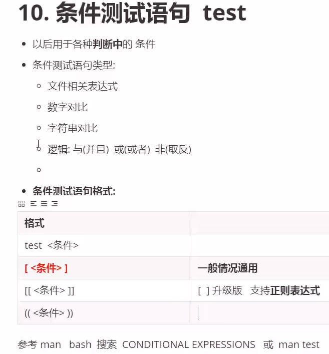 | 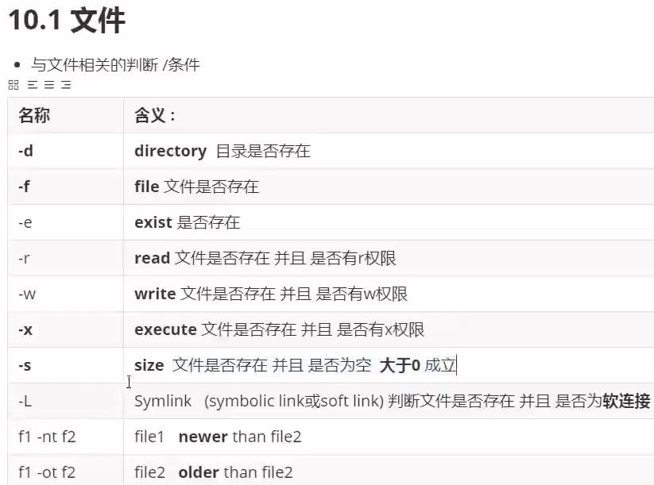 |
| -------------------------------------------------------- | -------------------------------------------------------- |
| 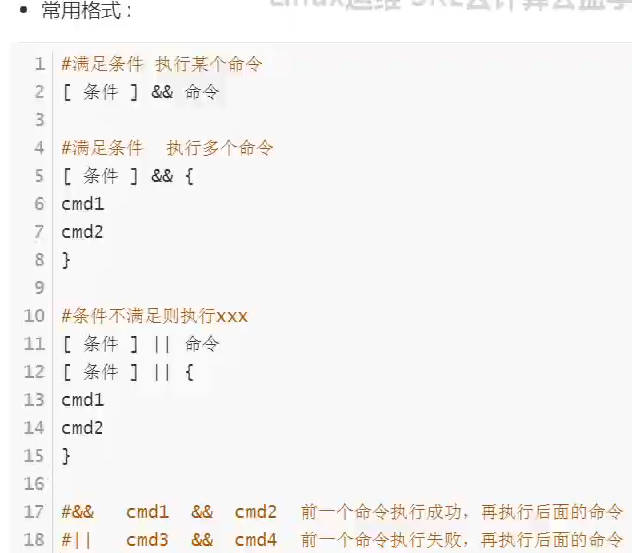 |  |
| 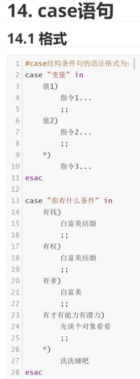 | 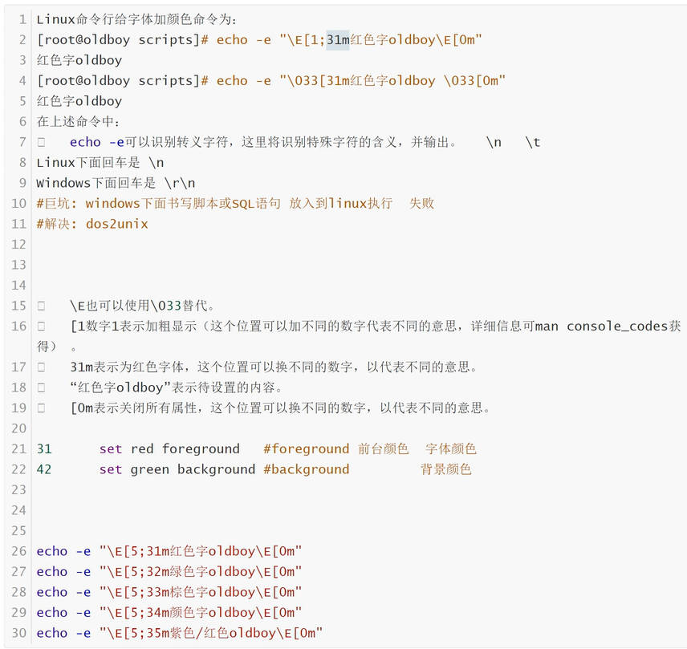 |

### 5、颜色

[console_codes(4) - Linux manual page](https://man7.org/linux/man-pages/man4/console_codes.4.html)   [ man7.org](https://man7.org/) [CLI Color](https://www.oschina.net/p/cli-color)  

```sh
. /etc/init.d/functions				# 加载函数库，然后执行action函数
action "Mr.Li is green"  /bin/true

echo -e	# 启用反斜杠转义,支持转义字符
echo -e "\E[1;31m红字\E[0m"	# \E开始和结束，用\e或\033也行； 
# [1 1加粗，详细man console_codes;  31m为红色，可换不同数字；  [0m关闭所有属性，可换不同数字； 0m背景颜色
```

```sh
#!/bin/bash
RED="\E[5;31m"
GREEN="\E[5;32m"
BLUE="\E[5;34m"
END="\E[0m"
case "$1" in
        red|r)
          echo -e "${RED}红色${END}"
          ;;
        green|g)
          echo -e "${GREEN}绿色${END}"
          ;;
        blue|b)
          echo -e "${BLUE}蓝色${END}"
          ;;
        *)
          echo "pls input r|g|b red|green|blue"
          exit 1
esac
# bash color.sh  red
```

### 6、==循环==

- while: 死循环用； exit  continue


| 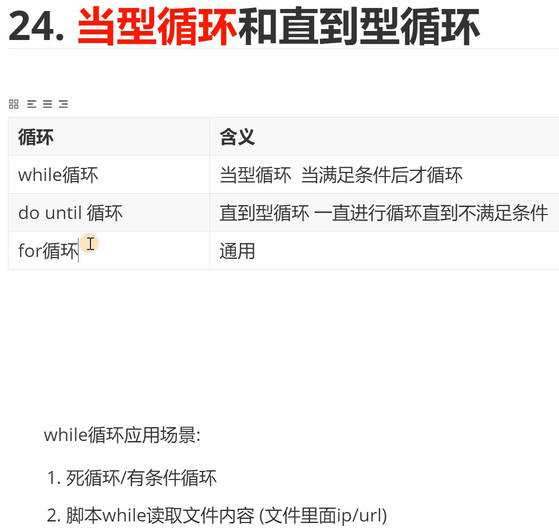 | 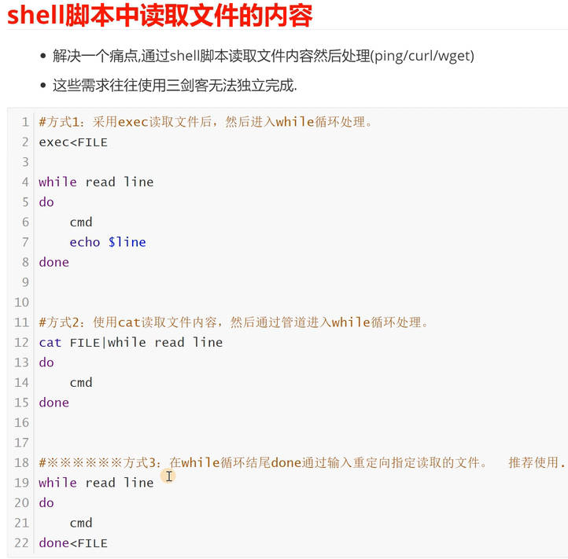 |
| -------------------------------------------------------- | -------------------------------------------------------- |
| 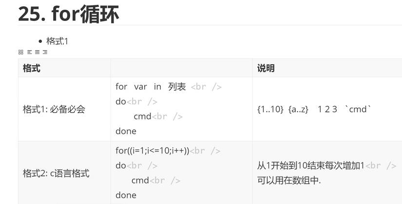 | 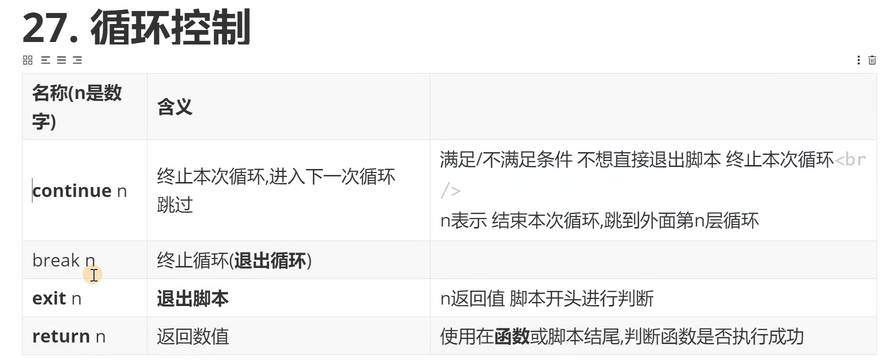 |


### 7、==函数==

[函数_shell main函数](https://blog.csdn.net/m0_48638643/article/details/124629635)   [shell 函数](https://www.cnblogs.com/dgp-zjz/p/14787960.html)  [shell ](https://www.baidu.com/s?ie=UTF-8&wd=shell%20main%E5%87%BD%E6%95%B0) 


### 8、==数组==

```sh
arr[0]=1		arr(0 1 2 3 4 5)	arr(10.1.2.{1..10})
echo ${ar[0]}		# 取数组要加{};
${arr[*]}  ${#arr[*]}	${arr}	${arr[@]}
```

### 9、小结

脚本用来服务管理、日常备份、监控、安全等

函数：让脚本更加专业

shell编程核心都在man bash；  [shell编程习题](https://www.baidu.com/s?ie=UTF-8&wd=shell%E7%BC%96%E7%A8%8B%E4%B9%A0%E9%A2%98)

| 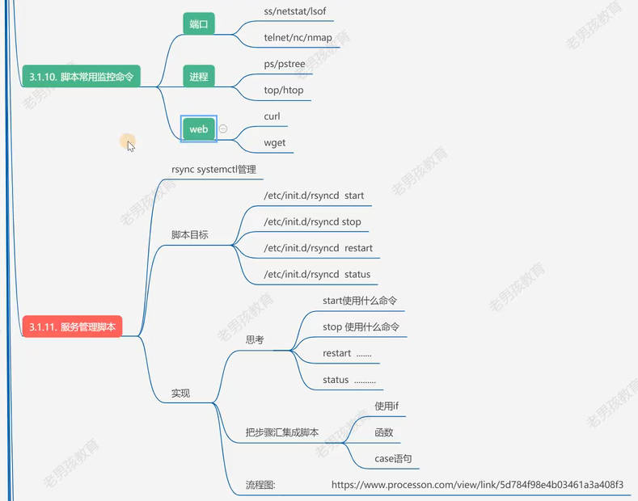 | 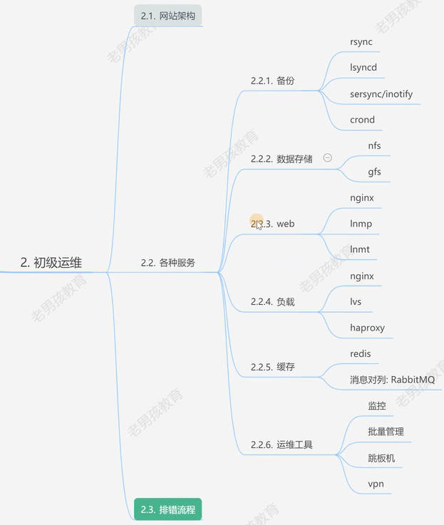 |
| -------------------------------------------------------- | -------------------------------------------------------- |
| 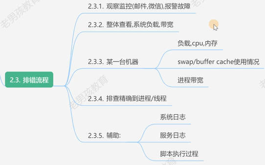 |                                                          |


## 10、防火墙

[Iptables详解](https://www.cnblogs.com/minseo/p/13595092.html)  [iptables图文](https://blog.csdn.net/weixin_44792344/article/details/109674599) 

[CentOS关闭防火墙方法](https://www.laozuo.org/27917.html) 

## 11、多版本管理

### python

[pyenv/pyenv: Simple Python version management](https://github.com/pyenv/pyenv?tab=readme-ov-file#getting-pyenv)     [centos python版本管理_百度AI](https://www.baidu.com/s?ie=utf-8&f=8&rsv_bp=1&tn=baidu&wd=centos%20python%E7%89%88%E6%9C%AC%E7%AE%A1%E7%90%86&rn=20&oq=linux%2520python%25E7%2589%2588%25E6%259C%25AC%25E7%25AE%25A1%25E7%2590%2586&rsv_pq=a7dbe85700a6b41b&rsv_t=9347Fp80GZmn3ZzRFzIm5eIqC5dP10YeyYDhI3WST%2BZZMpycefa%2FicWDYCU&rqlang=cn&rsv_enter=1&rsv_dl=tb&rsv_sug3=6&rsv_sug1=4&rsv_sug7=100&rsv_sug2=0&rsv_btype=t&inputT=3463&rsv_sug4=3464)     

[在CentOS上安装Python3的三种方法](https://www.jianshu.com/p/2cad40bc9e1b)  [centos安装python3](https://www.baidu.com/s?ie=utf-8&f=8&rsv_bp=1&tn=baidu&wd=centos%E5%AE%89%E8%A3%85python3&rn=20&oq=centos%25E5%25AE%2589%25E8%25A3%2585python&rsv_pq=d87e9970009b6949&rsv_t=e3ccq%2FLv0SJiK0YlAiroQJS%2FDNoqE7bMTQKAh7xQVe4%2FIQwSdTurIF07uno&rqlang=cn&rsv_enter=1&rsv_dl=tb&rsv_btype=t&inputT=10554&rsv_sug3=5&rsv_sug1=6&rsv_sug7=100&rsv_sug2=0&rsv_sug4=12265&rsv_sug=1)  

1. 安装必要的依赖：

   ```sh
   yum install -y git  gcc make  openssl-devel  zlib-devel		# yum install -y gcc make
   ```

   

2. 安装`pyenv`

   ```
   curl https://pyenv.run | bash
   ```

   

3. 将`pyenv`初始化脚本添加到您的shell启动文件。如果您使用的是bash，那么添加到`~/.bash_profile`

   ```bash
   # Load pyenv automatically by appending
   # the following to 
   # ~/.bash_profile if it exists, otherwise ~/.profile (for login shells)
   # and ~/.bashrc (for interactive shells) :
   
   export PYENV_ROOT="$HOME/.pyenv"
   [[ -d $PYENV_ROOT/bin ]] && export PATH="$PYENV_ROOT/bin:$PATH"
   eval "$(pyenv init -)"
   
   # Restart your shell for the changes to take effect.
   
   # Load pyenv-virtualenv automatically by adding
   # the following to ~/.bashrc:
   
   eval "$(pyenv virtualenv-init -)"
   
   # 下面是修改
   echo 'export PYENV_ROOT="$HOME/.pyenv"' >> ~/.bash_profile
   echo '[[ -d $PYENV_ROOT/bin ]] && export PATH="$PYENV_ROOT/bin:$PATH"' >> ~/.bash_profile
   echo 'eval "$(pyenv init -)"' >> ~/.bash_profile
   
   # 对于interactive shell
   echo 'export PYENV_ROOT="$HOME/.pyenv"' >> ~/.bashrc
   echo '[[ -d $PYENV_ROOT/bin ]] && export PATH="$PYENV_ROOT/bin:$PATH"' >> ~/.bashrc
   echo 'eval "$(pyenv init -)"' >> ~/.bashrc
   
   # 重新启动shell或者执行以下命令使更改生效
   exec "$SHELL"
   ```

   

4. 安装python 
   [centos7 中安装python3.12.3](https://www.cnblogs.com/liujiaxin2018/p/17020817.html)    [Common build problems · pyenv/pyenv Wiki](https://github.com/pyenv/pyenv/wiki/Common-build-problems)    [Download Python官网](https://www.python.org/downloads/)  [libffi](https://www.baidu.com/s?ie=utf-8&f=8&rsv_bp=1&tn=baidu&wd=The%20Python%20ctypes%20extension%20was%20not%20compiled.%20Missing%20the%20libffi%20lib%3F&rn=20&oq=The%2520Python%2520curses%2520extension%2520was%2520not%2520compiled.%2520Missing%2520the%2520ncurses%2520lib%253F&rsv_pq=e8792a7f002d44b0&rsv_t=31b5g7nsVppMs6yIqlFaJzxqjxDX8dPoQC5y30IZhAuA%2Fl1e0T6akHJzS2g&rqlang=cn&rsv_enter=0&rsv_dl=tb&rsv_btype=t&inputT=1034&rsv_sug3=15&rsv_sug1=10&rsv_sug7=001&rsv_n=2&rsv_sug4=1034&rsv_sug=9)  [ ncurses](https://www.baidu.com/s?ie=utf-8&f=8&rsv_bp=1&tn=baidu&wd=The%20Python%20curses%20extension%20was%20not%20compiled.%20Missing%20the%20ncurses%20lib%3F&rn=20&oq=The%2520Python%2520bz2%2520extension%2520was%2520not%2520compiled.%2520Missing%2520the%2520bzip2%2520lib%253F&rsv_pq=debd3d0b0062c943&rsv_t=9336JWF3%2BK38SLNmW%2BGHI5MOtZ4%2BLZZ%2FBqyuSZQzP8%2B0jw3Twy1Am8r37OQ&rqlang=cn&rsv_enter=0&rsv_dl=tb&rsv_btype=t&inputT=1492&rsv_sug3=13&rsv_sug1=9&rsv_sug7=001&rsv_n=2&rsv_sug4=1713&rsv_sug=9) [bzip2](https://www.baidu.com/s?ie=utf-8&f=8&rsv_bp=1&tn=baidu&wd=The%20Python%20bz2%20extension%20was%20not%20compiled.%20Missing%20the%20bzip2%20lib%3F&rn=20&oq=pyenv&rsv_pq=fa9eb7c500b2d98c&rsv_t=ab4f%2Fh0iKYafDHl85qza3Pg3Mo0kwFAaG4AP6mipJeogx3Vbbm7kHHgL%2Bzw&rqlang=cn&rsv_enter=0&rsv_dl=tb&rsv_btype=t&inputT=1299&rsv_sug3=10&rsv_sug1=7&rsv_sug7=001&rsv_n=2&rsv_sug4=1476&rsv_sug=9)  [readline](https://www.baidu.com/s?ie=utf-8&f=8&rsv_bp=1&tn=baidu&wd=The%20Python%20readline%20extension%20was%20not%20compiled.%20Missing%20the%20GNU%20readline%20lib%3F&rn=20&oq=The%2520Python%2520bz2%2520extension%2520was%2520not%2520compiled.%2520Missing%2520the%2520bzip2%2520lib%253F&rsv_pq=abe706fc00bc35de&rsv_t=52ebtegMNLccnqXUa%2FqKDS4o2SOjBuSL62B4YxhUiw1bDr0eseg6r3yW2vc&rqlang=cn&rsv_enter=0&rsv_dl=tb&rsv_btype=t&inputT=948&rsv_sug3=17&rsv_sug1=11&rsv_sug7=001&rsv_n=2&rsv_sug4=949&rsv_sug=9)   [CentOS7 安装openssl11](https://blog.csdn.net/m0_48742971/article/details/128376326)   [lzma](https://www.baidu.com/s?ie=utf-8&f=8&rsv_bp=1&tn=baidu&wd=The%20Python%20lzma%20extension%20was%20not%20compiled.%20Missing%20the%20lzma%20lib%3F&rn=20&oq=The%2520Python%2520sqlite%2526lt%253B%2520extension%2520was%2520not%2520compiled.%2520Missing%2520the%2520SQLite%2526lt%253B%2520lib&rsv_pq=f5ba71da006e13bf&rsv_t=3a7bLFRcvoRJ2Yqq9QzShWHAlfl6eK6twR9H1orVh81JACZQ8DYpbZ27RrM&rqlang=cn&rsv_enter=0&rsv_dl=tb&rsv_sug3=3&rsv_sug1=2&rsv_sug7=001&rsv_n=2&rsv_btype=t&inputT=947&rsv_sug4=959&rsv_sug=9)  

   ```sh
   #python3需要openssl111
   yum update -y
   yum install -y epel-release
   yum install -y openssl-devel openssl11 openssl11-devel
   yum swap openssl-devel openssl11-devel
   
   pyenv update
   
   # centos安装py要依赖 dnf install bzip2-devel  ncurses-devel  libffi-devel  readline-devel 
   
   # yum -y install gcc install zlib zlib-devel bzip2-devel ncurses-devel sqlite-devel readline-devel tk-devel gdbm-devel db4-devel libpcap-devel xz-devel uuid-devel libffi libffi-devel
   
   CPPFLAGS="$(pkg-config --cflags openssl11)" \
   LDFLAGS="$(pkg-config --libs openssl11)" \
   pyenv install -v 3.12.3
   
   
   pyenv install 3.12.3				# 安装python    2024.4.9
   pyenv global 3.12.3					# 设置全局Python版本： system
   echo 3.8.1 > .python-version		# 设置项目特定的Python版本，在项目目录创建.python-version文件
   ```

   

## 12、自动化和编排工具

[Linux的6种最佳自动化和编排工具](https://www.sohu.com/a/640981743_121124378) 

## 13、虚拟机克隆

[VMware虚拟机克隆](https://blog.51cto.com/u_16596714/10118172)  [克隆节点并配置节点](https://www.bilibili.com/video/BV1bi421X7T4?p=117) 

clone后要改uuid、mac地址、ip、主机名

```sh
uuidgen
vi /etc/sysconfig/network-scripts/ifcfg-eth0 
nmcli device reapply ens160;   systemctl  restart  network

hostnamectl set-hostname node1
vim /etc/hosts
```

## 14、初级运维

[老男孩教育思维导图](https://www.processon.com/template/search/%E8%80%81%E7%94%B7%E5%AD%A9%E6%95%99%E8%82%B2)  [Linux启动流程](https://www.processon.com/view/5bffde08e4b034239805a249)  [bash编程语法](https://www.baidu.com/s?ie=UTF-8&wd=bash%E7%BC%96%E7%A8%8B%E8%AF%AD%E6%B3%95)  [老男孩教育-自动化shell编程路线图](https://www.baidu.com/s?ie=utf-8&wd=%E8%80%81%E7%94%B7%E5%AD%A9%E6%95%99%E8%82%B2-%E8%87%AA%E5%8A%A8%E5%8C%96shell%E7%BC%96%E7%A8%8B%E8%B7%AF%E7%BA%BF%E5%9B%BE) 

[Web集群实战](https://www.processon.com/view/5c6e7724e4b0f0908a9cad49)  [自动化之shell编程](https://www.processon.com/template/search/%E8%87%AA%E5%8A%A8%E5%8C%96%E4%B9%8Bshell%E7%BC%96%E7%A8%8B) [老男孩运维导图](https://www.bilibili.com/video/BV1Kg411g7bC?p=2&vd_source=7346303e5e18677d7261c2c0c109ecfd)   

[GDB 探索 Linux 如何启动](https://www.bilibili.com/video/BV1eJr6Y2ELb/?vd_source=7346303e5e18677d7261c2c0c109ecfd)	

[深入理解Linux内核：进程间通信方式总结](https://zhuanlan.zhihu.com/p/3286124269)	

## 15、学习视频

[shell学习的老男孩课程](https://www.bilibili.com/video/BV1XB4y1P7Sh?p=11&vd_source=7346303e5e18677d7261c2c0c109ecfd)  [2024最新版Linux基础视频教程从入门到精通（147集全）](https://www.bilibili.com/video/BV1bi421X7T4/?spm_id_from=333.999.0.0&vd_source=7346303e5e18677d7261c2c0c109ecfd)   

[Shell自动化开发](https://www.bilibili.com/video/BV1BH4y1A7bY/?spm_id_from=333.1007.tianma.1-1-1.click&vd_source=7346303e5e18677d7261c2c0c109ecfd) 

## 16、帮助

### man

[man手册的基本组成和使用方法](https://www.cnblogs.com/woate/p/15788849.html) 

[中文帮助文件](https://cloud.tencent.com/developer/article/1640802?from=15425) 

#### 安装man手册

[安装完整版的man手册](https://blog.csdn.net/qq_40669895/article/details/132287151)  [安装Linux Man手册](https://www.idc.net/help/69915/)  [Man-DB](https://cloud.tencent.com/developer/article/1885611)  [Man-pages](https://cloud.tencent.com/developer/article/1885736?from=15425)   

```sh
apt-get install man-db				# ubuntu
dnf install man-pages				# CentOS、RHEL(RedHat Enterprise Linux)

# 安装完整版的man手册
apt-get install manpages			# 包含 GNU/Linux 的基本操作
apt-get install manpages-dev		# 包含 GNU/Linux 的基本操作API
apt-get install manpages-posix		# 包含 POSIX 所定义公用程序的方法
apt-get install manpages-posix-dev	# 包含 POSIX 的 header files 和 library calls 的用法
```

#### man手册结构

man手册主要分为9个部分，分别是（序号后标*为常用手册）

| 手册序号 | 英文介绍                                                     | 中文介绍                                         |
| -------- | ------------------------------------------------------------ | ------------------------------------------------ |
| 1*       | Executable programs or shell commands                        | 可执行程序和shell命令                            |
| 2*       | System calls (functions provided by the kernel)              | 系统调用                                         |
| 3*       | Library calls (functions within program libraries)           | （C语言）库函数                                  |
| 4        | Special files (usually found in /dev)                        | 设备文件及特殊文件                               |
| 5        | File formats and conventions, e.g. /etc/passwd               | 配置文件格式                                     |
| 6        | Games                                                        | 游戏                                             |
| 7*       | Miscellaneous (including macro packages and conventions), e.g. man(7), groff(7) | 杂项                                             |
| 8        | System administration commands (usually only for root)       | 系统管理员命令（通常只用于roor用户）             |
| 9        | Kernel routines [Non standard]                               | 内核例程（非标准）;Linux内核API（CentOS7后出现） |

#### man手册查询

- 由于存在同名关键词，如`read(1)`（shell命令）与`read(2)`（linux系统调用），这样查询只会显示位于前面的手册，如`man read`显示`read(1)`结果，这时就需要指定手册序号。  `man 2 read`
- `man 2 <system-call>`：查询系统调用相关信息，  如`man 2 read`，`man 2 write`等
- `man 3 <lib-call>`：查询C语言库函数相关信息，如`man 3 printf`，`man 3 exit`等。
- `man 7 <option>`：查询杂项，如`man 7 socket`，`man 7 ip`等。
- `man -K <struct name>`：可以用来查询不知道具体在哪个手册页的（函数、结构体、类型）定义，如`man -K sockaddr_in`。

#### 安装额外man手册

想查看`pthread_create()`函数的使用方法时，输入`man pthread`显示无条目，需要自己安装。

在ubuntu下，可以通过：`apt-get install manpages-posix manpages-posix-dev`安装POSIX man手册,

再输入`man pthread_create`即可显示结果

#### man命令

[man手册的使用](https://www.cnblogs.com/webnote/p/5734586.html)  [man手册](https://blog.51cto.com/shuanglong/1721295)  [man手册](https://www.baidu.com/s?ie=UTF-8&wd=man%E6%89%8B%E5%86%8C) 

```sh
whatis cmd						# 查看命令属于man中的哪个章节
# <>必选； []可选； |多选一； {}：分组 ；...同一内容出现多次 
man -k directory				# 搜和目录相关命令
```

#### 自定义帮助文档

[linux下man文档讲解和手工制作](https://www.bilibili.com/video/BV1mh411h7sv/?spm_id_from=333.337.search-card.all.click&vd_source=7346303e5e18677d7261c2c0c109ecfd)

- man文档在==/usr/share/man/== 目录下，是.1.gz结尾压缩包; 自建一个gz结尾压缩包，man就会识别
  - `touch ./man1/mycmd.1 ; 然后压缩gzip mycmd.1;  man mycmd能查看文档`
  - gunzip znew.1.gz  解压一个官方文档，能看到许多.B .SH等标记，用来高亮等格式化； 
  - 自己的帮助文档加标记后也可格式化


