# linux进阶

[2024最新版Linux基础视频教程从入门到精通（147集全）](https://www.bilibili.com/video/BV1bi421X7T4/?spm_id_from=333.999.0.0&vd_source=7346303e5e18677d7261c2c0c109ecfd)  [001.入门篇-为什么要学习linux_哔哩哔哩_bilibili](https://www.bilibili.com/video/BV1bi421X7T4?p=2&vd_source=7346303e5e18677d7261c2c0c109ecfd)  [老男孩Linux](https://www.bilibili.com/video/BV1yf4y1Y7t8/?p=279&vd_source=7346303e5e18677d7261c2c0c109ecfd)  [老男孩Linux运维](https://www.bilibili.com/video/BV1u64y1X7e3/?spm_id_from=333.788.recommend_more_video.0&vd_source=7346303e5e18677d7261c2c0c109ecfd)  [老男孩](https://www.bilibili.com/video/BV18o4y1U7AW/?spm_id_from=333.788.recommend_more_video.11&vd_source=7346303e5e18677d7261c2c0c109ecfd) 

[Linux架构师](https://www.bilibili.com/video/BV1wd4y1i7aZ/?spm_id_from=333.788.recommend_more_video.12&vd_source=7346303e5e18677d7261c2c0c109ecfd) [阿里云架构讲解](https://www.bilibili.com/video/BV1Q6421g7vE/?spm_id_from=333.788.recommend_more_video.18&vd_source=7346303e5e18677d7261c2c0c109ecfd) 

[Linux-RHCE运维实战](https://www.bilibili.com/video/BV17K4y1t7XR/?spm_id_from=333.337.search-card.all.click&vd_source=7346303e5e18677d7261c2c0c109ecfd)   [Linux运维](https://www.bilibili.com/video/BV11c411L7PW/?spm_id_from=333.337.search-card.all.click&vd_source=7346303e5e18677d7261c2c0c109ecfd)  [Linux基础总结](https://zhuanlan.zhihu.com/p/663873352?utm_id=0)

[Linux运维路线图](https://blog.csdn.net/Cloud_Native/article/details/125586194) [2023运维云原生技术栈必备资料包](https://docs.qq.com/doc/DRmJ0bXVMckdZZHha)  [运维](http://www.atguigu.com/video/linux/#step3) 

[虚拟机安装centos8 并配置部分开发环境](https://www.cnblogs.com/kikock/p/17462381.html) 

## rpm包

Red-Hat Package Manager

**查询**: `rpm -qailf`

**卸载**: `rpm -e --nodeps`

**安装**: `rpm -ivh`

| 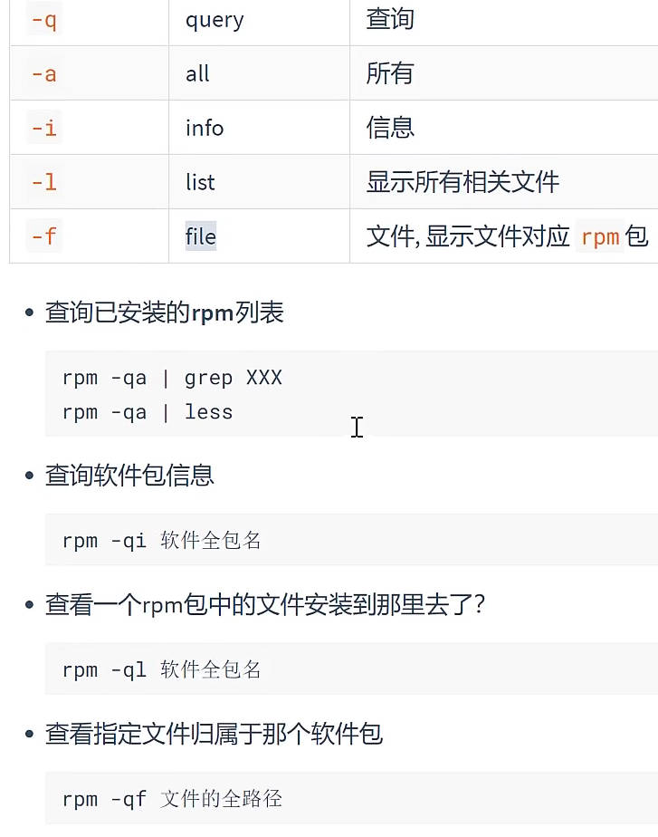 | 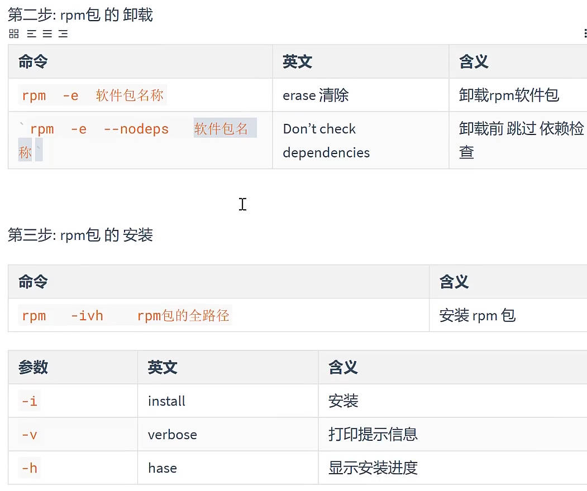 |
| -------------------------------------------------------- | -------------------------------------------------------- |

### yum

基于rpm的包管理器，联网安装软件

- 备份yum源配置文件：`/etc/yum.repo.d/CentOS-Base`
- 下载阿里源配置文件
- yum软件源更新：`yum clean all,yum makecache`
- 安装：`https、JDK11、tomcat8、mysql8`
  - 默认安装OpenJDK,要先删除 `rpm -qa|grep java, rpm -e --nodeps`
  - tomcate启动： `./startup.sh && tail -200f /tomcat/apache-tomcat-8.5.53/logs/catalina.out` 200行动态日志 
  - mysql包解压后安装4个： `client、server、common通用、lib库`
    - ==初始化、改密码、允许远程登录==
  - git:2种方法，yum安装，或源码包安装(需要手动安装依赖)

| 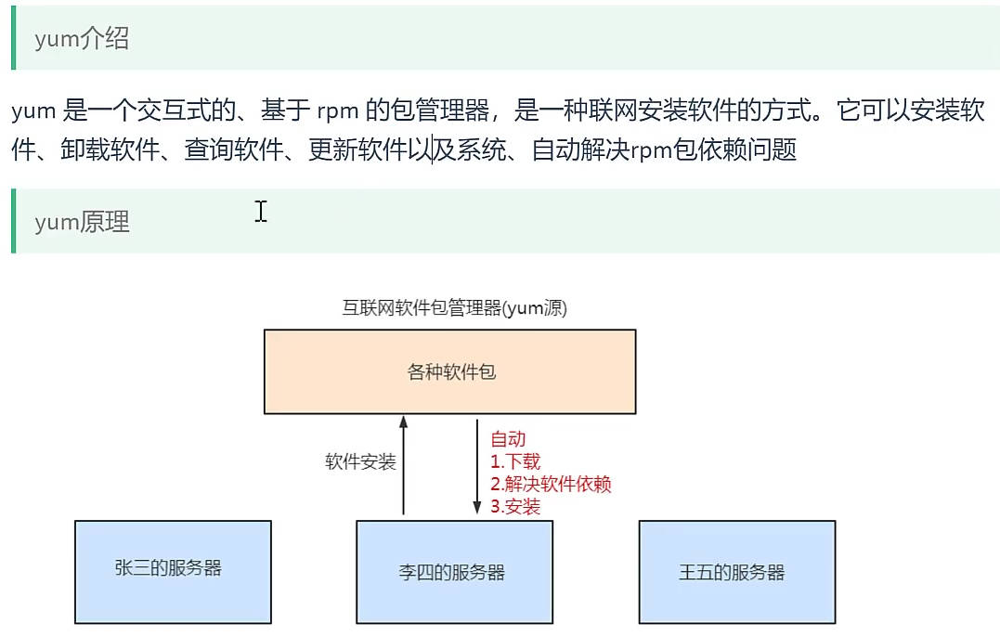     | 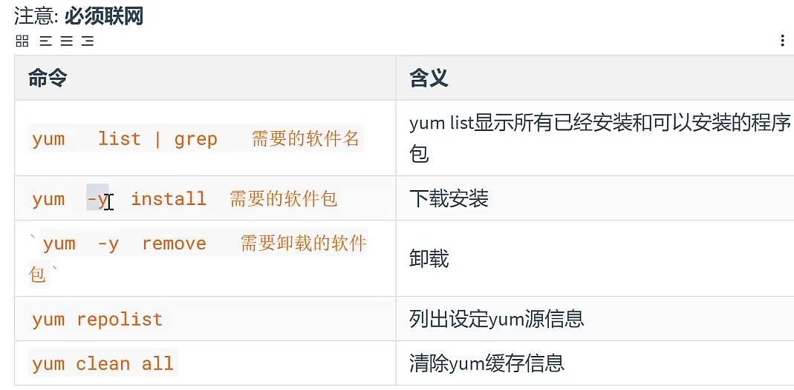 |
| ------------------------------------------------------------ | -------------------------------------------------------- |
| 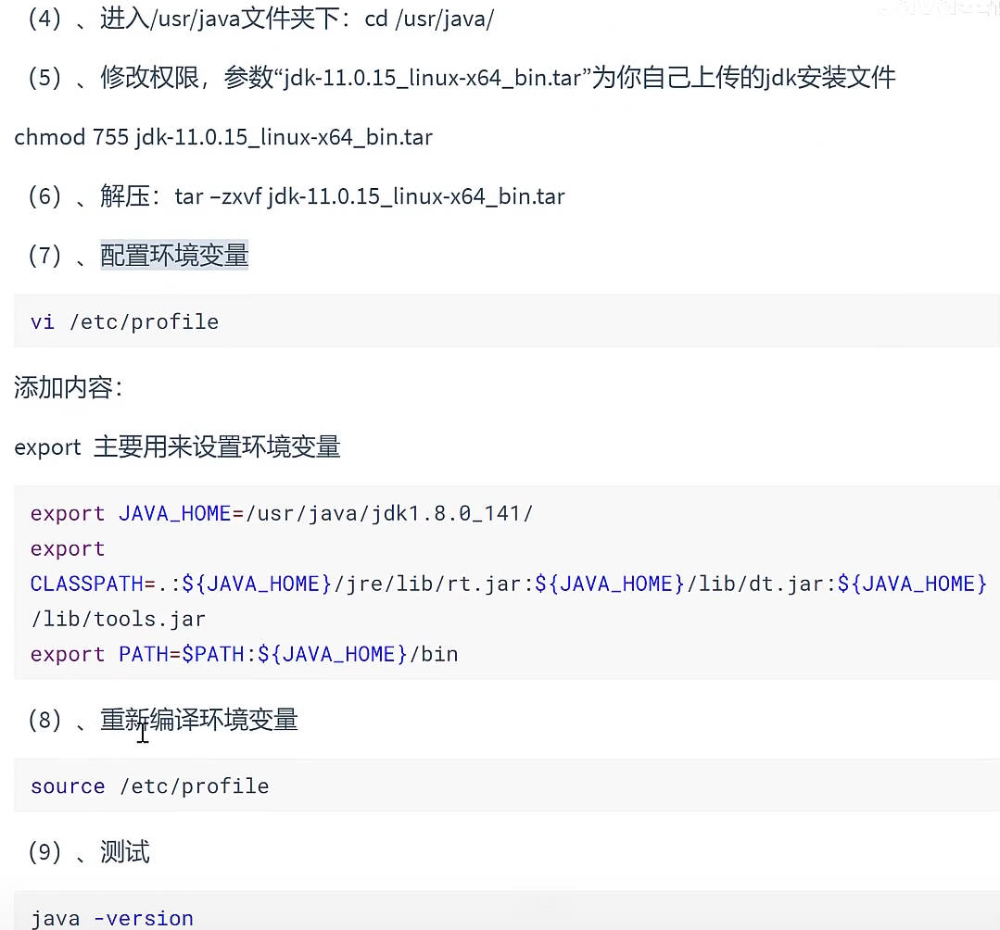 | 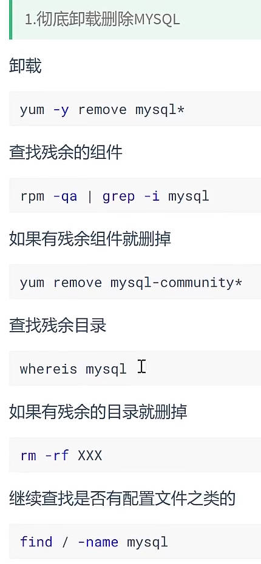 |
| 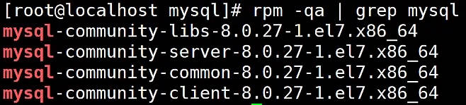     | 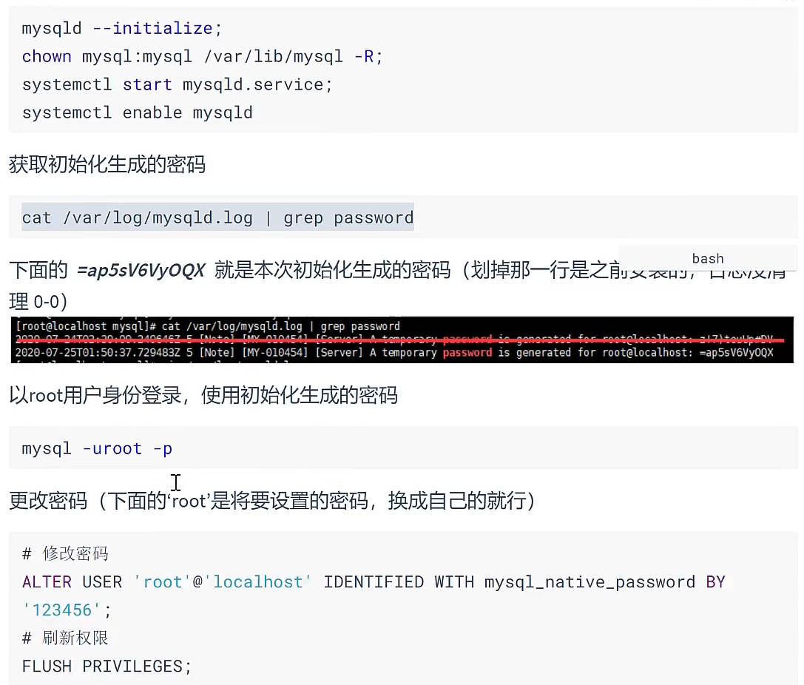 |
| 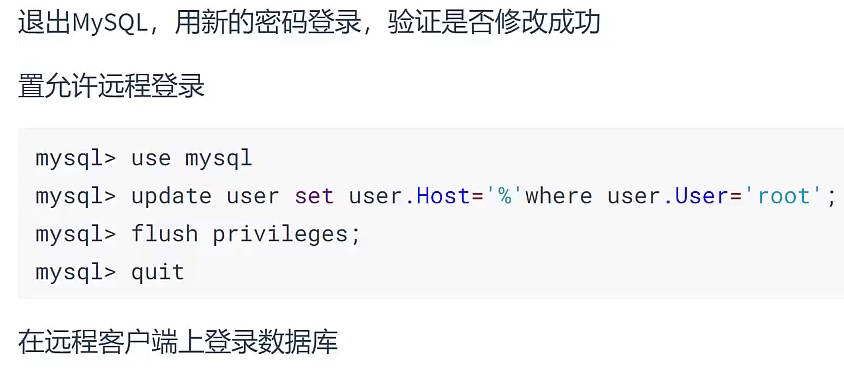     |  |
| 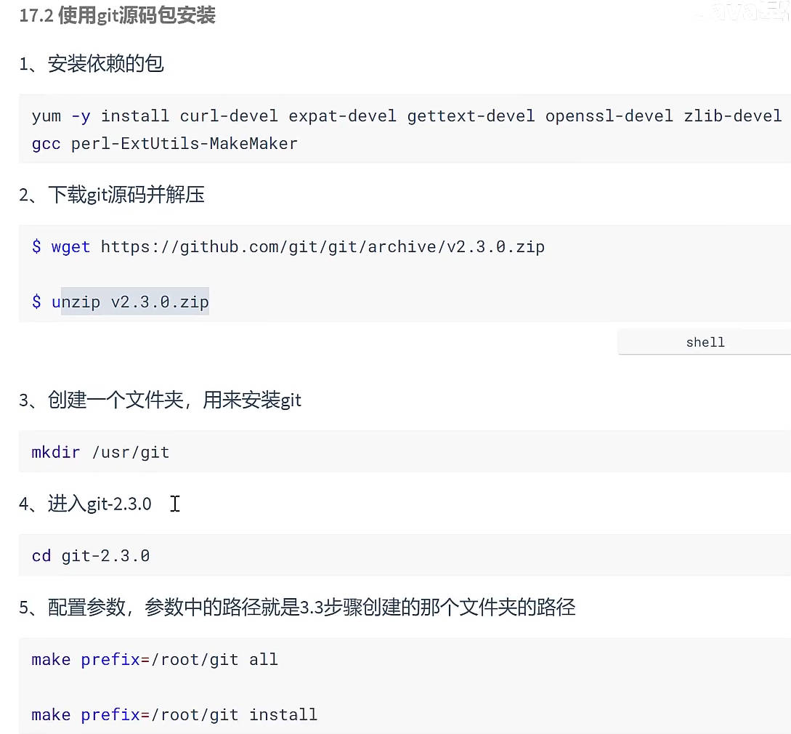  | 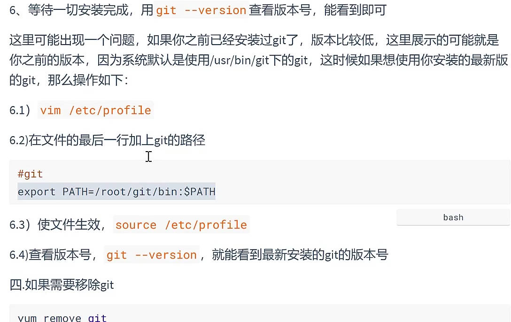 |


## linux打包和压缩

[7-Zip](https://sparanoid.com/lab/7z/download.html)  [p7zip](https://github.com/jinfeihan57/p7zip)  [p7zip](https://zhuanlan.zhihu.com/p/665391492)  [p7zip加密解密](https://www.cnblogs.com/MXubin/p/16073203.html)  [p7zip](https://cloud.tencent.com/developer/article/1389231)  

### tar包

- 打包：`tar -cvf 包名.tar 被打包的目录`  ==参数顺序不能变==
  - `create verbose file; extract;  -t list包内容  -r添加文件到包` 
  - `tar --exclude=/root/1.txt  -cvf ./abc   /root/* `  打包时，排除1.txt 
  - `tar -vf test.tar --delete root/a.txt`  包中删除root/a.txt文件
  - tar解压的目标是绝对路径时，会提示从成员名中删除开头'/';  ==注意：使用相对路径打包==
    - 为了防止压缩包中保留绝对路径，解压时可能发生覆盖  `tar zcf /tmp/etc.tar.gz   etc/`
- 解包：`tar -xvf 包名.tar -C /usr   -C 指定解压目录`

| 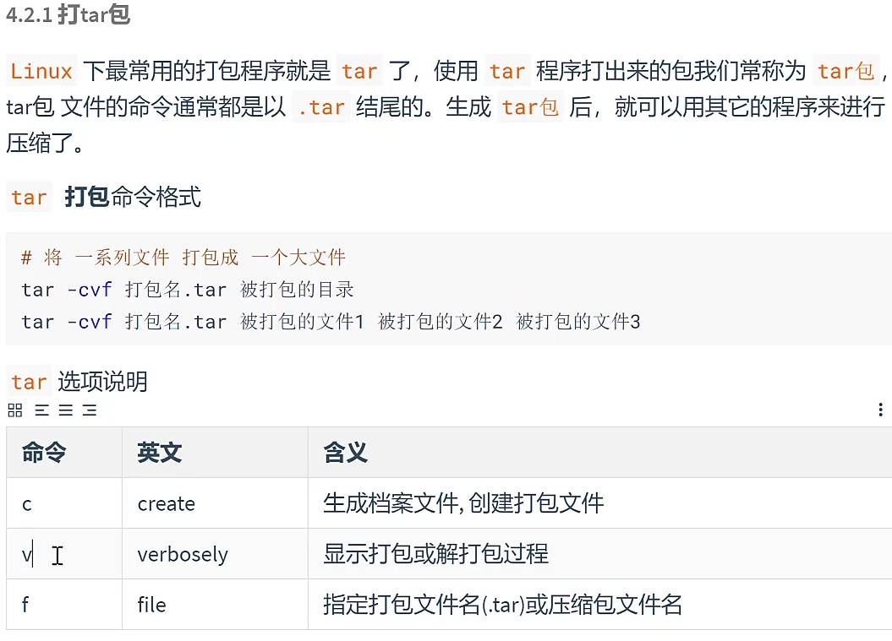 | 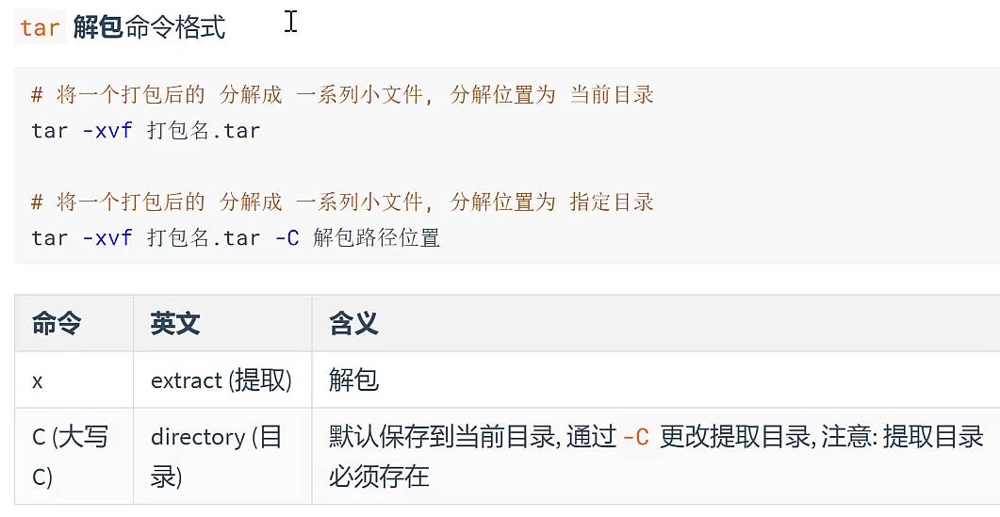 |
| -------------------------------------------------------- | -------------------------------------------------------- |

### 压缩

[tar](https://www.runoob.com/linux/linux-comm-tar.html)  [zip命令](https://www.runoob.com/linux/linux-comm-zip.html)  [unzip命令](https://www.runoob.com/linux/linux-comm-unzip.html)  [cpio备份文件](https://www.runoob.com/linux/linux-comm-cpio.html) [dump备份文件系统](https://www.runoob.com/linux/linux-comm-dump.html) 

- gzip: 使用gzip压缩和解压缩， `tar -zcvf 打包文件.tar.gz 要打包的文件或目录`    `tar -zxvf` 			tar.gz     ==gzip -d==  解压
  - bzip2:  `z改为j`     `tar -jcvf 打包文件.tar.bz2 要打包的文件或目录`    `tar -jxvf`              tar.bz2	`bzip2 -d 解压`
  - xz: 改为J `tar -cJvf archive.tar.xz directory`                                             tar.xz
- zip: `zip -q -r name.zip /home/html`  q不显示执行过程，r递归   -v 显示执行过程 -d 从包中删除文件     .zip
  - unzip: `unzip nn.zip  -d 解压到目录 -l查看 -v 查看`    zipinfo  abc.zip
- p7zip: p7zip 是 7-Zip（仅命令行版本）移植版本。由非官方的独立开发者开发                               .7z
  - 压缩:`7z a file.7z files`   解压：`7z x file.7z`  用x还是e？   -r递归  -t指定压缩类型 `-t7z`  

| 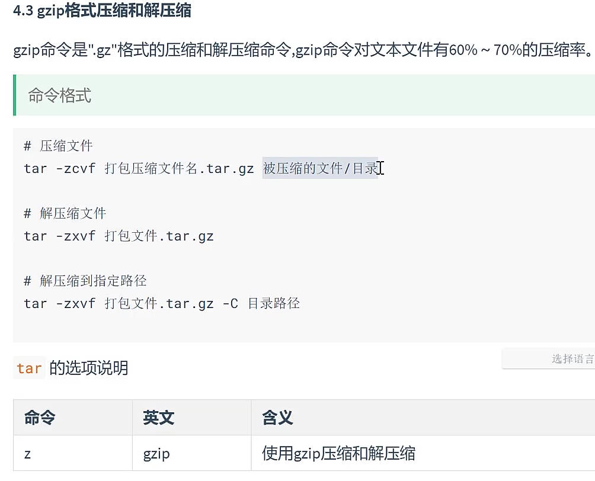 | 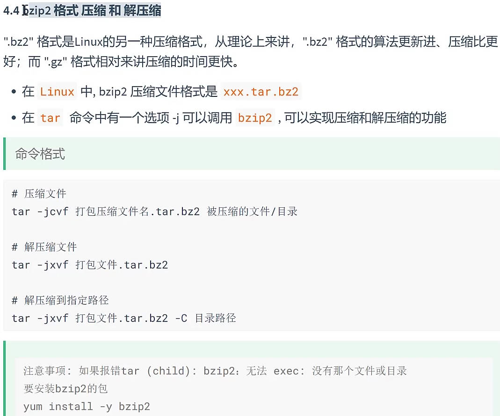 |
| -------------------------------------------------------- | -------------------------------------------------------- |


## 系统启动过程

查看ubuntu版本命令：`lsb_release -a   cat /etc/lsb-release`

[好：sysv-rc-conf_linux启动步骤](https://baike.baidu.com/item/sysv-rc-conf/6457780?fr=ge_ala)  [好：centos7启动](https://www.cnblogs.com/nq31/p/14284712.html)  [一文搞定Linux进程和线程](https://blog.csdn.net/wzl1217333452/article/details/108670054)  [Linux开机启动(bootstrap)](https://blog.csdn.net/hlbsk123/article/details/52659000)  [Linux系统启动过程](https://www.runoob.com/linux/linux-system-boot.html)   [markdown锚点](https://blog.csdn.net/weixin_45844049/article/details/103866977)  [Linux中 .d文件/目录](https://blog.csdn.net/qq_34745899/article/details/79532964?utm_medium=distribute.pc_relevant.none-task-blog-2~default~baidujs_baidulandingword~default-5-79532964-blog-116577209.235^v43^pc_blog_bottom_relevance_base9&spm=1001.2101.3001.4242.4&utm_relevant_index=8)   [/etc/init.d/](https://blog.csdn.net/tjcwt2011/article/details/121951579?utm_medium=distribute.pc_relevant.none-task-blog-2~default~baidujs_baidulandingword~default-12-121951579-blog-116577209.235^v43^pc_blog_bottom_relevance_base9&spm=1001.2101.3001.4242.7&utm_relevant_index=15)   [Linux的安装和启动流程详细解析](https://blog.51cto.com/smileyouth/1268810)  [linuxserver启动过程](https://developer.aliyun.com/article/367846)  

视频：[centos7系统启动过程](https://www.bilibili.com/video/BV16t4y1a7Hz/?spm_id_from=333.337.search-card.all.click&vd_source=7346303e5e18677d7261c2c0c109ecfd)   

**centos**: [centos7系统启动流程 ](https://www.cnblogs.com/du-z/p/10883829.html)  [好：Linux的引导分析](https://blog.csdn.net/sdcxyz/article/details/23601491) [u-boot](https://blog.csdn.net/gqb_driver/article/details/8931775) [bios方式中的stage1](https://www.baidu.com/s?ie=UTF-8&wd=bios%E6%96%B9%E5%BC%8F%E4%B8%AD%E7%9A%84stage1) 

[sysv-rc-conf](https://manpages.ubuntu.com/manpages/trusty/man8/sysv-rc-conf.8.html) [Debian-sysv-rc-conf](https://packages.debian.org/sid/sysv-rc-conf)  [sysv-rc-conf_百度搜索](https://www.baidu.com/s?ie=UTF-8&wd=sysv-rc-conf) [Linux的进程地址空间](https://zhuanlan.zhihu.com/p/68398179) [Linux进程管理](https://www.cnblogs.com/nju347/p/8419247.html)  [Linux进程管理](https://blog.51cto.com/u_14813976/5090880)  [Linux操作系统进程深入理解](https://zhuanlan.zhihu.com/p/615499282) 

[精品：Linux 内核初始化过程](https://blog.csdn.net/LIJIWEI0611/article/details/125952005)    [ubuntu系统启动流程](https://blog.csdn.net/wf908164152/article/details/125714807)   

[ 文件系统](https://blog.csdn.net/leacock1991/article/details/107924248) 

MBR: [MBR详解](https://www.jianshu.com/p/c57c4e688da6) 

Bootloader:

[Grub](https://www.cnblogs.com/suv789/p/17517534.html) [GRUB](https://www.cnblogs.com/suv789/p/17503729.html)  [BootLoader介绍](https://blog.csdn.net/qq_51118175/article/details/122052285) 

内核：

[initrd和initramfs的区别](https://www.zhihu.com/question/22045825/answer/2574784458) [Linux内核加载](https://zhuanlan.zhihu.com/p/441263425) [内核启动Initramfs与initrd 及其挂载](https://blog.csdn.net/kwdecsdn/article/details/129151631) 

[initramfs详解](https://blog.csdn.net/fuhanghang/article/details/128849560)  [Linux内核学习笔记](https://blog.csdn.net/m0_50662680/article/details/127464335?ops_request_misc=%257B%2522request%255Fid%2522%253A%2522171677693116800185823069%2522%252C%2522scm%2522%253A%252220140713.130102334..%2522%257D&request_id=171677693116800185823069&biz_id=0&utm_medium=distribute.pc_search_result.none-task-blog-2~all~top_positive~default-1-127464335-null-null.142^v100^pc_search_result_base4&utm_term=Linux%E5%86%85%E6%A0%B8&spm=1018.2226.3001.4187)   [Linux内核](https://so.csdn.net/so/search?q=Linux%E5%86%85%E6%A0%B8&spm=1001.2101.3001.7020) [Linux内核架构和工作原理](https://blog.csdn.net/weixin_71478434/article/details/126483802?ops_request_misc=%257B%2522request%255Fid%2522%253A%2522171677693116800185823069%2522%252C%2522scm%2522%253A%252220140713.130102334..%2522%257D&request_id=171677693116800185823069&biz_id=0&utm_medium=distribute.pc_search_result.none-task-blog-2~all~top_click~default-2-126483802-null-null.142^v100^pc_search_result_base4&utm_term=Linux%E5%86%85%E6%A0%B8&spm=1018.2226.3001.4187)   [Linux 内核](https://blog.csdn.net/youzhangjing_/article/details/134807033?ops_request_misc=&request_id=&biz_id=102&utm_term=Linux%E5%86%85%E6%A0%B8&utm_medium=distribute.pc_search_result.none-task-blog-2~all~sobaiduweb~default-0-134807033.nonecase&spm=1018.2226.3001.4187)  [Linux内核编译](https://blog.csdn.net/qq_40344790/article/details/131051865?ops_request_misc=%257B%2522request%255Fid%2522%253A%2522171677693116800185823069%2522%252C%2522scm%2522%253A%252220140713.130102334..%2522%257D&request_id=171677693116800185823069&biz_id=0&utm_medium=distribute.pc_search_result.none-task-blog-2~all~top_click~default-4-131051865-null-null.142^v100^pc_search_result_base4&utm_term=Linux%E5%86%85%E6%A0%B8&spm=1018.2226.3001.4187)  [Linux内核学习路线](https://blog.csdn.net/weixin_45264425/article/details/128229572?ops_request_misc=&request_id=&biz_id=102&utm_term=Linux%E5%86%85%E6%A0%B8&utm_medium=distribute.pc_search_result.none-task-blog-2~all~sobaiduweb~default-2-128229572.nonecase&spm=1018.2226.3001.4187) [嵌入式环境下linux内核及驱动学习](https://blog.csdn.net/weixin_45499326/article/details/129991513?ops_request_misc=&request_id=&biz_id=102&utm_term=Linux%E5%86%85%E6%A0%B8&utm_medium=distribute.pc_search_result.none-task-blog-2~all~sobaiduweb~default-3-129991513.nonecase&spm=1018.2226.3001.4187)  [linux kernel源码结构以及makefile分析](https://blog.csdn.net/weixin_45264425/article/details/125947416?ops_request_misc=&request_id=&biz_id=102&utm_term=Linux%E5%86%85%E6%A0%B8&utm_medium=distribute.pc_search_result.none-task-blog-2~all~sobaiduweb~default-4-125947416.nonecase&spm=1018.2226.3001.4187)   

[initramfs制作](https://blog.csdn.net/weixin_43269452/article/details/131169725)  [ubuntu开机出现initramfs解决办法](https://cloud.tencent.com/developer/article/2117735)  [initramfs模式介绍及解决方法](https://blog.csdn.net/qq_44673299/article/details/114295223)  [启动失败会进入initramfs](https://blog.csdn.net/weixin_42121713/article/details/131038668)  

[initramfs介绍](https://blog.csdn.net/weixin_38452632/article/details/133922698)  [initramfs_百度搜索](https://www.baidu.com/s?ie=UTF-8&wd=initramfs) 

[Centos7单用户模式下修改密码](https://cloud.tencent.com/developer/article/1484962)    [CentOS7忘记密码怎么办](https://blog.csdn.net/lions66/article/details/131238349)  [破解CentOS root密码](https://www.aliyun.com/sswb/1144800.html) 

[Linux的安装和启动流程详细解析](https://blog.51cto.com/smileyouth/1268810) 

内核符号表： [System.map](https://www.cnblogs.com/Oude/articles/12039091.html)  [System.map](https://blog.csdn.net/Listen2You/article/details/88363465) [system.map文件详](https://www.cnblogs.com/welhzh/p/15304800.html)     [System.map](https://blog.csdn.net/null_plus/article/details/78256329) 

**Linux系统的启动过程:** 

分4个阶段	[centos7启动过程](https://www.bilibili.com/video/BV16t4y1a7Hz/?spm_id_from=333.337.search-card.all.click&vd_source=7346303e5e18677d7261c2c0c109ecfd) 

1. 硬件引导启动	[CHS](https://baike.baidu.com/item/CHS/3794705?fr=ge_ala) [MBR](https://blog.csdn.net/jiewu5/article/details/78107039) [MBR详解](https://www.jianshu.com/p/c57c4e688da6) 
   1. 查找硬盘0磁头、0磁道、1扇区，即Bootsector,定位后MBR被装载到RAM，==BIOS将控制权交给MBR==
   2. MBR: 446Bytes,装grub2的boot.img;    64B,装分区表；  2B标识位，55AA
2. GRUB2启动引导: `映像(core.img)、模块(*.mod)、配置(grub.cfg)`
   1. grub==引导内核==，当内核被加载到内存以后，内核会根据grub配置文件中的配置，==找到根分区所使用的文件系统对应的驱动==，通过根分区文件系统对应的驱动，==挂载根分区==，启动操作系统

3. 内核引导阶段
   1. `/boot/vmlinuz`    内核源码不包含驱动程序
   2. `/boot/initramfs`  临时文件系统包含驱动,挂载真正的根文件系统，最后执行 `/usr/lib/systemd/system`
   3. `System.map-6.8.0-31-generic`  内核符号表文件，记录==符号==(函数名，全局变量…)==在内核中的运行地址==

4. systemd初始化阶段
   1. `/usr/lib/systemd/system/default.target` 


==MBR==: 读取硬盘的前512字节  [dd](https://www.runoob.com/linux/linux-comm-dd.html) 

```sh
df -hT										# 打印类型
# dd 命令用于读取、转换并输出数据
# if输入文件  bs=bytes：设置读入/输出的块大小   count=blocks：读几块
dd if=/dev/sda of=mbr.bin bs=512B count=1	# 读取硬盘的前512字节
xxd mbr.bin	;  hexdump -C mbr.bin			# 查看二进制文件
```


| 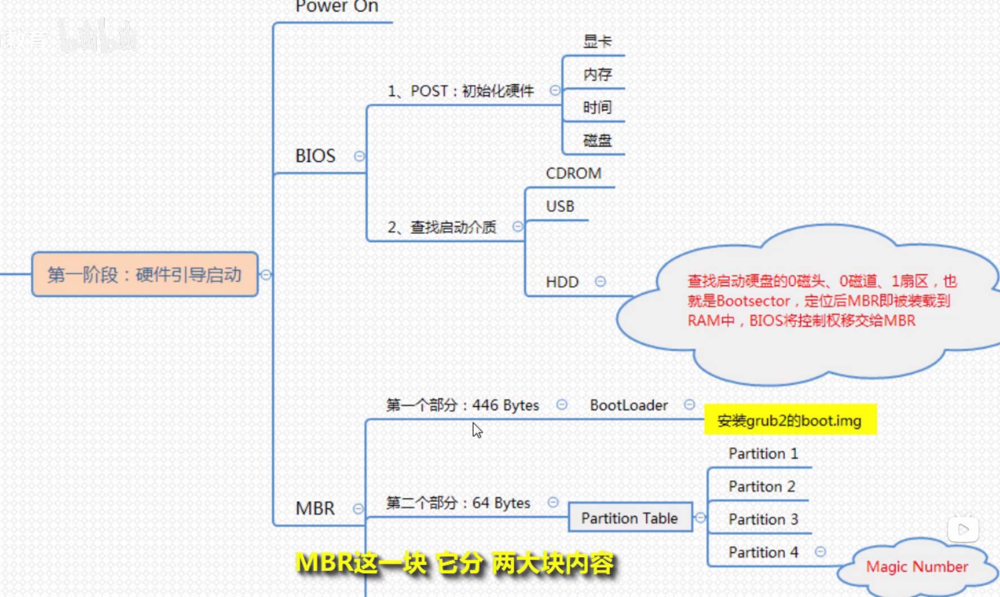 | 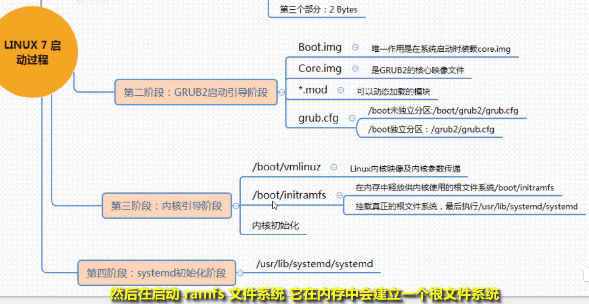 |
| -------------------------------------------------------- | -------------------------------------------------------- |
| 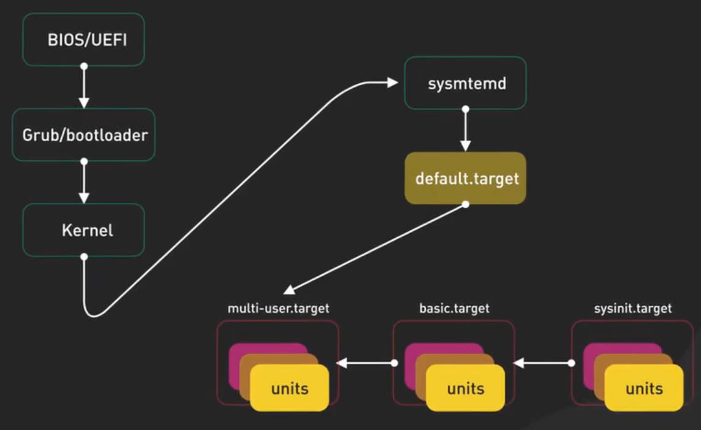 |                                                     |


> 在Linux内核被加载到内存并运行后，==内核进程最终需要切换到用户的进程来使用计算机==，而用户进程又存在于外存储设备上，比如systemd进程，通常systemd进程所在的存储设备也是Linux真正的根文件系统所在的位置 ； 
>
> 而**内核源码是没有包含驱动程序**的，驱动程序在外存储设备上，那么问题来了，要切换到systemd进程（system deamon），就需要外存储的驱动，但是没有驱动又没办法访问外存储，这个时候initramfs就闪亮登场了
>
> **initramfs是一个临时的文件系统，其中包含了必要的设备如硬盘、网卡、文件系统等的驱动以及加载驱动的工具及其运行环境，比如基本的C库，动态库的链接加载器等等** 
>
> initramfs的前辈**initrd** ， 2.4以及更早版本的内核中，内核使用的是initrd。initrd是基于ramdisk技术的

- 加电，bios启动 
- 读取 MBR: 加载GRUB: ==启动 Boot Manager==  
  - Windows 使用 ==NTLDR== 作为 Boot Manager: New Technology Loader
  - linux用GRUB: `GRand Unified Bootloader`
  - bootloader负责`将内核与initramfs载入内存`
- 内核引导: ==加载vmlinuz== 
- 运行 init
  - 进入预设运行级别， 按顺序运行，该级别对应文件夹下的==脚本==
  - 通常先执行/etc/rcS.d/ 脚本，然后/etc/rc3.d/
- 初始化系统
- 建立终端 
- 用户登录系统

CPU 被设计成只能运行内存中的程序，没有办法直接运行储存在硬盘或者 U 盘中的操作系统程序。必须先加载到内存（RAM）中才能运行； 因为硬盘、U盘（外部存储器）并不和CPU直接相连，他们的==访问机制和寻址方式与内存截然不同==  

**linux内核**：  [好：Linux 启动过程动画](https://www.bilibili.com/video/BV1Ec411S7u6/?spm_id_from=333.337.search-card.all.click&vd_source=7346303e5e18677d7261c2c0c109ecfd)   [好：Linux启动过程](https://www.bilibili.com/video/BV1vj411R7b1/?p=9&spm_id_from=pageDriver&vd_source=7346303e5e18677d7261c2c0c109ecfd)  [Linux操作系统底层架构与内核设计及实现原理](https://www.bilibili.com/video/BV1DD421G7Aj/?spm_id_from=333.1007.tianma.1-1-1.click&vd_source=7346303e5e18677d7261c2c0c109ecfd)  [Linux操作系统](https://www.bilibili.com/video/BV1Tr421j7B6/?spm_id_from=333.788.recommend_more_video.0&vd_source=7346303e5e18677d7261c2c0c109ecfd)     

[Linux 内核启动流程讲解](https://www.bilibili.com/video/BV11z421m7by/?spm_id_from=333.337.search-card.all.click&vd_source=7346303e5e18677d7261c2c0c109ecfd)  [Linux内核](https://www.bilibili.com/video/BV1oF411U7cC/?spm_id_from=333.337.search-card.all.click&vd_source=7346303e5e18677d7261c2c0c109ecfd)  [Linux内核启动流程](https://www.bilibili.com/video/BV1XS4y1A73P/?spm_id_from=333.337.search-card.all.click&vd_source=7346303e5e18677d7261c2c0c109ecfd)  [Linux内核- CSDN搜索](https://so.csdn.net/so/search?q=Linux%E5%86%85%E6%A0%B8&spm=1001.2101.3001.7020&ydreferer=aHR0cHM6Ly9ibG9nLmNzZG4ubmV0L2Z1aGFuZ2hhbmcvYXJ0aWNsZS9kZXRhaWxzLzEyODg0OTU2MA%3D%3D)  

| 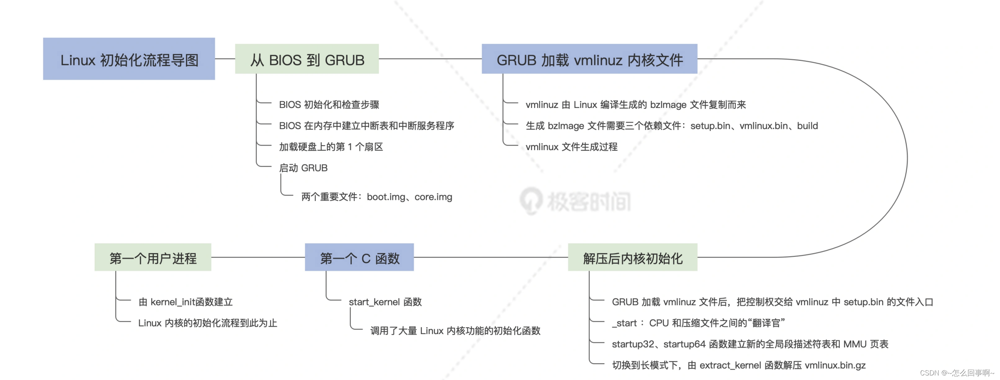                           | 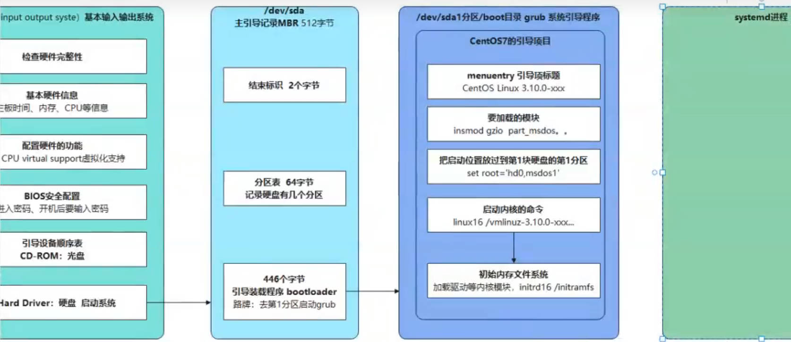 |
| ------------------------------------------------------------ | -------------------------------------------------------- |
| 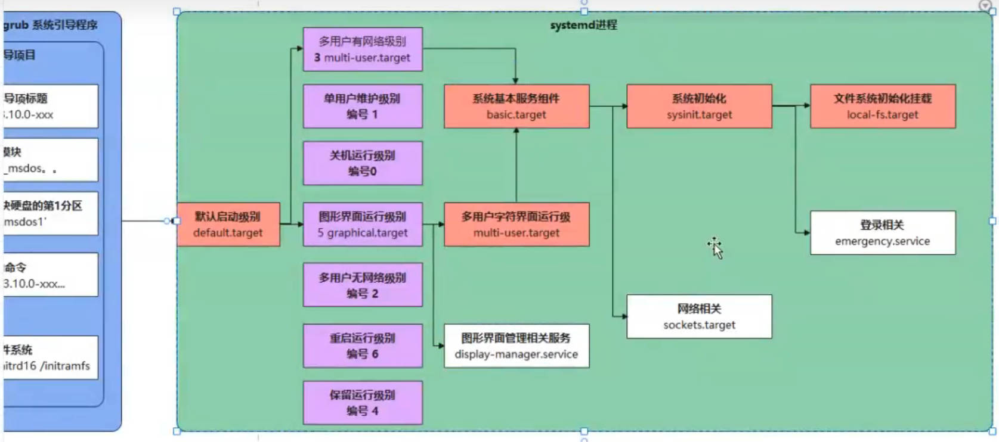 | 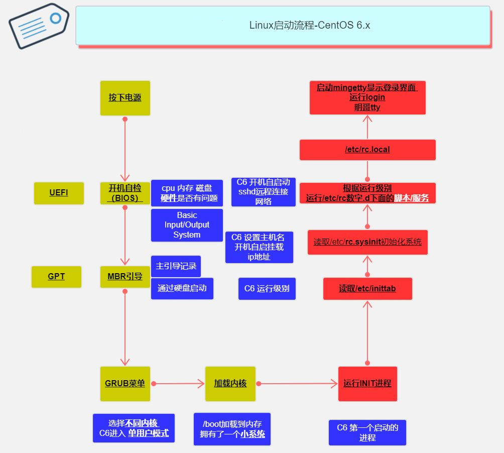                      |
| 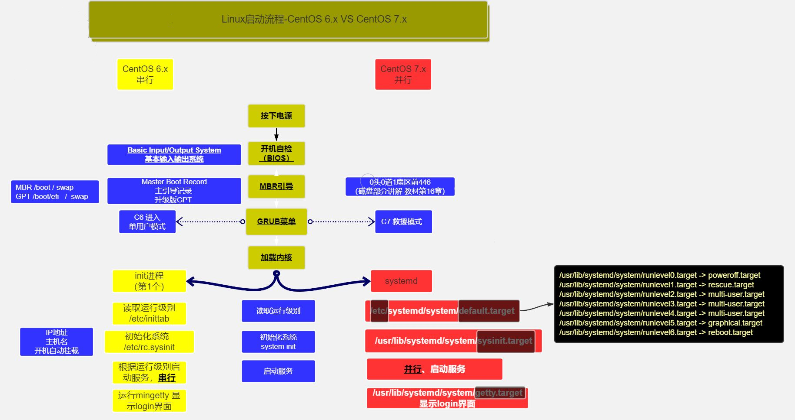                          | 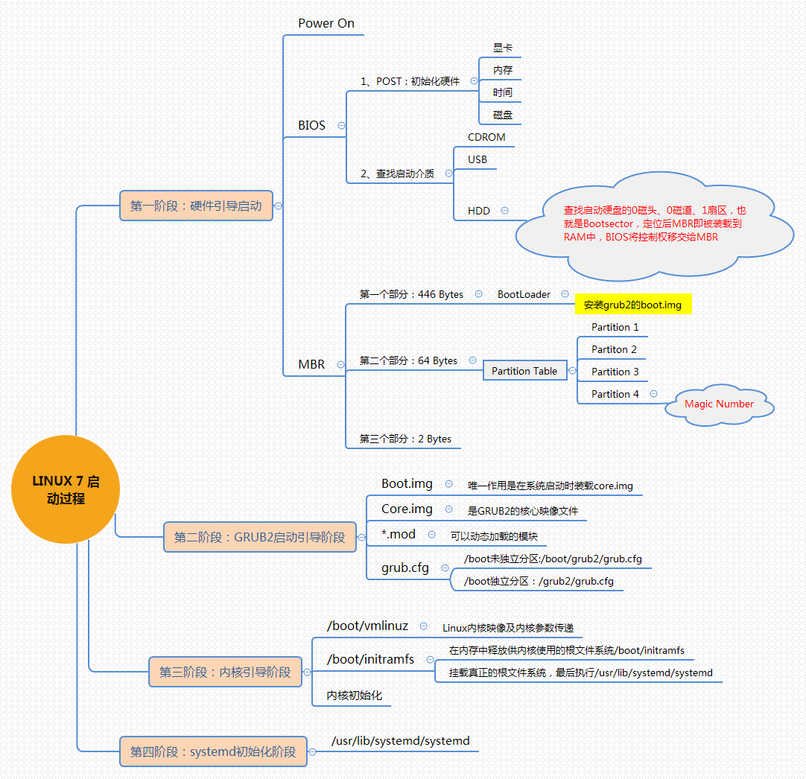                         |


### 1、Bios

BIOS如何启动： **硬件工程师设计 CPU 时，硬性地规定在加电的瞬间，强制将 CS 寄存器的值设置为 0XF000，IP 寄存器的值设置为 0XFFF0** 

- ==BIOS先初始化 CPU，接着检查并初始化内存==， 然后将自己的一部分复制到内存，最后跳转到内存中运行
- BIOS 的下一步就是枚举==本地设备进行初始化==，并检查硬件是否损坏
- 当设备初始化和检查步骤完成之后，**BIOS 会在内存中建立中断表和中断服务程序**  
- BIOS==搜索可引导的设备==，  
- 通常从硬盘中启动的。==硬盘上的第 1 个扇区==（每个扇区 512 字节空间），称为MBR（主启动记录），包含有基本的 GRUB 启动程序和分区表，安装 GRUB 时会自动写入到这个扇区
  - 当 MBR 被 BIOS 装载到 0x7c00 地址开始的内存空间中后，BIOS 就会将控制权转交给了 MBR。其实是交给了 GRUB

### 2、BootLoader：grub

[好：vmlinuz、initrd.img的作用](https://www.jianshu.com/p/f1e538aad4e5)  [vmlinuz和initrd文件](https://www.cnblogs.com/net2012/archive/2013/01/08/2851384.html) [vmlinux、initrd](https://blog.csdn.net/u012967763/article/details/104333446)  [initrd vmlinuz](https://www.baidu.com/s?ie=UTF-8&wd=initrd%20vmlinuz)  

[嵌入式内核镜像：vmlinux、vmlinuz、vmlinux.bin、zimage、bzimage、uImage 之间的差异](https://zhuanlan.zhihu.com/p/644946972)  

内核文件：[LINUX下三个内核文件详解(vmlinuz/initrd.img/System.map)](https://blog.csdn.net/zhongbeida_xue/article/details/106627102/)    

内核配置：[内核vmlinux配置分析](https://www.baidu.com/s?ie=UTF-8&wd=%E5%86%85%E6%A0%B8vmlinux%E9%85%8D%E7%BD%AE%E5%88%86%E6%9E%90)  

#### Grub

[GNU GRUB - Documentation](https://www.gnu.org/software/grub/grub-documentation.html) 

[好：grub.cfg详解和实例操作](https://blog.csdn.net/Luckiers/article/details/113387209)   [Grub编译与调试 ](https://zhuanlan.zhihu.com/p/669921846)  [GRUB2配置文件"grub.cfg"详解](https://blog.csdn.net/changexhao/article/details/78467276)   [系统及其内核修复](https://blog.51cto.com/purify/1852335)  

[GRUB_百度搜索](https://www.baidu.com/s?ie=UTF-8&wd=GRUB)  [GRUB_百度百科](https://baike.baidu.com/item/GRUB/4072057?fr=ge_ala)   [GRUB](https://cloud.tencent.com/developer/article/2129729)   [ubuntu20.04怎么设置开机引导grub](https://xiazai.zol.com.cn/jiqiao/90358.html) 

BIOS 只会加载硬盘上的第 1 个扇区。这个扇区仅有 512 字节，这 512 字节中还有 64 字节的分区表加 2 字节的启动标志，剩下 446 字节的空间，是装不下 GRUB 这种大型通用引导器的

- **GRUB的加载分成多个步骤**，同时 GRUB 也分成多个文件，其中有两个**重要的文件 boot.img** 和 **core.img**
  - ==boot.img== 被 GRUB 的安装程序写入到硬盘的 MBR 中，同时在 boot.img 文件中的一个位置写入 core.img 文件占用的第一个扇区的扇区号
  - 而 ==core.img== 由 GRUB 安装程序根据安装时环境信息，==用其它 GRUB 的模块文件动态生成==
    - 因为 GRUB2 大量使用动态加载功能模块，这使得 core.img 文件的体积变得足够小。而 GRUB 的 core.img 文件一旦开始工作，就可以加载 Linux 系统的 ==vmlinuz 内核文件==了

**与grub相关的文件有**：   [grub设置](https://blog.csdn.net/thalo1204/article/details/48369093) 

`/boot/grub/grub.cfg` （文件） ， `/etc/grub.d` （目录）, `/etc/default/grub`（文件）。

- /boot/grub/grub.cfg 由 /etc/grub.d , /etc/default/grub生成,  etc/grub.d/10_linux文件，它指导了创建grub.cfg的细节   [grub2](https://www.cnblogs.com/f-ck-need-u/p/7094693.html) 

```sh
# 1. /etc/grub.d		adjust the default setting via /etc/default/grub
# 不同的数字在 /etc/default/grub 中占据不同的位置
00_header*  05_debian_theme*  10_linux*  10_linux_zfs*  20_linux_xen*  25_bli*  30_os-prober*  30_uefi-firmware*  35_fwupd*  40_custom*  41_custom*  README
##
00_*: Reserved for 00_header.				# 保留给00_heade
10_*: Native boot entries.					# 本地启动入口
20_*: Third party apps (e.g. memtest86+)	# 第3方app


# 2. /etc/default/grub		调整默认设置, 修改后 update-grub
# info -f grub -n 'Simple configuration'
GRUB_DEFAULT=0
GRUB_TIMEOUT_STYLE=hidden
GRUB_TIMEOUT=0
GRUB_DISTRIBUTOR=`( . /etc/os-release; echo ${NAME:-Ubuntu} ) 2>/dev/null || echo Ubuntu`
GRUB_CMDLINE_LINUX_DEFAULT=""
GRUB_CMDLINE_LINUX="net.ifnames=0 biosdevname=0"

# export 设置环境变量；  declare 声明 shell 变量;  set 设置shell
```


##### /etc/grub.d目录

/etc/default/grub

[grub2的/etc/grub.d目录下的脚本文件](https://www.cnblogs.com/codeblock/p/4295112.html)    [Ubuntu grub设置_grub ](https://blog.csdn.net/thalo1204/article/details/48369093) 

00_header，05_debian_theme，10_linux，20_memtest86+，30_os- prober，40_custom这五个脚本对应grub.cfg上的各个部分

##### grub命令

[GRUB官方](https://www.gnu.org/software/grub/grub-documentation.html)  [GNU GRUB Manual 2.12](https://www.gnu.org/software/grub/manual/grub/grub.html#root)  [好：grub2详解](https://www.cnblogs.com/f-ck-need-u/p/7094693.html)

[grub2详解](https://www.cnblogs.com/f-ck-need-u/p/7094693.html) 

[grub.cfg](https://blog.csdn.net/Luckiers/article/details/113387209) [Grub编译与调试](https://zhuanlan.zhihu.com/p/669921846)   [grub.cfg](https://blog.csdn.net/yuzaipiaofei/article/details/50990391)   [grub.cfg文件损坏修复](https://blog.csdn.net/jks212454/article/details/121639450) [启动流程、模块管理、BootLoader(Grub2)](https://www.jianshu.com/p/7276a98e74cf) 

```sh
(hd0,gpt1)			# 第一块硬盘第一个gpt分区
(hd0,msdos2)		# 第一块硬盘第二个mbr分区， grub2分区从1开始编号
# grub把boot目录识别为根分区
root				# 指定根分区
splashimage			# 背景图片
hiddenmenu			# 隐藏菜单
password [--md5] string	# 认证
grub-md5-crypt		# 生成加密字符串

lsmod 		# 列出已加载模块
insmod		# 调用模块
linux		# linux16, 都表示装载指定内核文件,并传递内核启动参数。linux16以16位启动协议启动内核，linux以32位启动协议启动内核
search 		# 通过文件[--file]、卷标[--label]、文件系统UUID[--fs-uuid]来搜索设备
```

[移植内核等文件来启动一个新的系统](https://www.bilibili.com/video/BV1KA41147kP/?spm_id_from=333.999.0.0&vd_source=7346303e5e18677d7261c2c0c109ecfd)  [救援模式](https://www.bilibili.com/video/BV1Lt4y1Y779/?spm_id_from=333.999.0.0&vd_source=7346303e5e18677d7261c2c0c109ecfd) 

- 分区
- 移植bash和依赖的库, 移植内核
- 安装grub，创建grub.conf

| 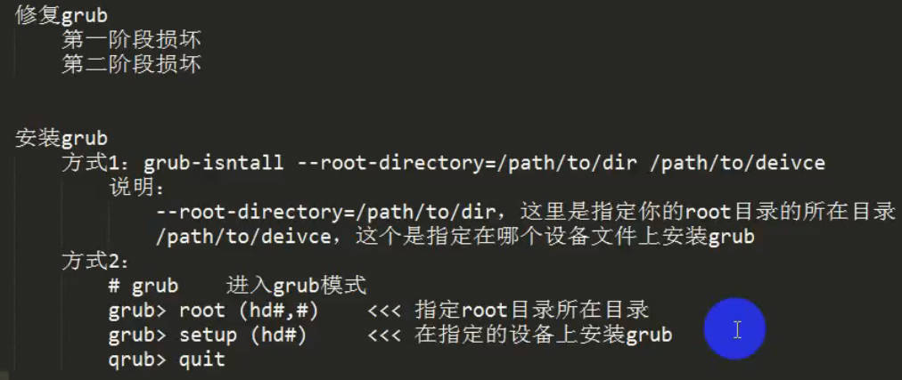 | 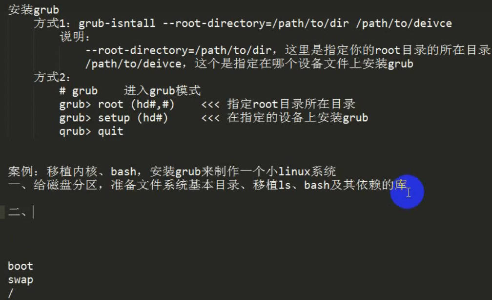 |
| -------------------------------------------------------- | -------------------------------------------------------- |


##### grub安装

[Grub4Dos For UEFI](https://www.bilibili.com/video/BV1ce411X78p/?spm_id_from=333.337.search-card.all.click&vd_source=7346303e5e18677d7261c2c0c109ecfd)  [Grub2Win](https://www.bilibili.com/video/BV1MH4y1B7Fb/?spm_id_from=333.337.search-card.all.click&vd_source=7346303e5e18677d7261c2c0c109ecfd)  

[Rufus 4.5](https://new.qq.com/rain/a/20240523A00TND00?) 

[rEFInd](https://zhuanlan.zhihu.com/p/67114559) 

[Ventoy](https://baijiahao.baidu.com/s?id=1801307318790732563&wfr=spider&for=pc) 

[黑苹果的历史](https://cloud.tencent.com/developer/article/2258485) 

##### UEFI

[UEFI官网_2.10](https://uefi.org/)    

[EFI、UEFI主板BIOS 和 MBR、GPT硬盘分区技术详解](https://mp.weixin.qq.com/s?__biz=MzA3NzA5NDA3Mw==&mid=201473370&idx=3&sn=75b84b3ec44ea32587f004e01bb7a4d0&chksm=16a1d08c21d6599a59df8ddf376d05ef87dfe600c69a7a598a4a2026e5def69e1c9592115e46&scene=27)  

第3方： [coreboot](https://zhuanlan.zhihu.com/p/658162172) [Coreboot](https://www.oschina.net/p/coreboot?hmsr=aladdin1e1)   [intel/ModernFW](https://github.com/intel/ModernFW) [UEFI ](https://zhuanlan.zhihu.com/p/81960137) 

- UEFI: Unified Extensible Firmware Interface， 统一==可扩展固件接口==，一种 BIOS 的替代技术 
  - EFI分区，win下叫ESP, EFI system partition, 是FAT32分区
  - UEFI分2部分： 硬件固件 和 硬盘上EFI分区
  - BIOS 和 CMOS是不同的，bios是一个固件或程序， 对bios做的修改，存在cmos(RAM)芯片上； 新版bios叫uefi   [bios](https://www.bilibili.com/video/BV1T7411R7DK?p=1&vd_source=7346303e5e18677d7261c2c0c109ecfd)  [BIOS和CMOS](https://blog.csdn.net/molangmolang/article/details/136103655) 
    - 通过BIOS设置界面对CMOS参数进行设置，并将设置结果保存在CMOS芯片中
- GPT: **Globally Unique Identifier Partition Table Format**, 全局唯一标识分区表（GUID Partition Table）;   基于Itanium计算机中的可扩展固件接口（EFI）使用的磁盘分区架构

UEFI开发： [ESP/EFI系统引导如何修复](https://www.bilibili.com/video/BV1iJ411A7Ju/?spm_id_from=333.337.search-card.all.click&vd_source=7346303e5e18677d7261c2c0c109ecfd) [UEFI启动的七个阶段](https://www.bilibili.com/video/BV1jS4y1X7C9/?p=3&spm_id_from=pageDriver)   [谭玉刚的个人空间](https://space.bilibili.com/41036636?spm_id_from=333.788.0.0)   [UEFI的EDK2开发环境](https://www.bilibili.com/video/BV1PX4y1i7RM/?spm_id_from=333.788.recommend_more_video.8&vd_source=7346303e5e18677d7261c2c0c109ecfd) [BIOS固件无缝升级到UEFI](https://www.bilibili.com/video/BV1rf42197hD/?spm_id_from=333.788.recommend_more_video.1&vd_source=7346303e5e18677d7261c2c0c109ecfd) 

[EDK2开发环境](https://www.cnblogs.com/wanglouxiaozi/p/17881933.html)  [UEFI编程利器：EDK2](https://zhuanlan.zhihu.com/p/688504305)  [ToyOS 系列](https://www.jianshu.com/p/497701ffc060)  [Coding Tools](https://baijiahao.baidu.com/s?id=1722385751291147642&wfr=spider&for=pc)  [EDK2_百度搜索](https://www.baidu.com/s?ie=UTF-8&wd=EDK2)     [UEFI 验证选项](https://learn.microsoft.com/zh-cn/windows-hardware/manufacture/desktop/uefi-validation-option-rom-validation-guidance?view=windows-10)   [高通UEFI分析](https://blog.csdn.net/uunubt/article/details/127040223)  [进入UEFI固件](https://baijiahao.baidu.com/s?id=1783957199094270939&wfr=spider&for=pc) 

UEFI固件： [UEFITool](https://gitcode.com/LongSoft/UEFITool/overview?utm_source=artical_gitcode&isLogin=1)  [UEFI_TOOLS和刷机原理](https://www.bilibili.com/video/BV12hKaeFEqa/?vd_source=7346303e5e18677d7261c2c0c109ecfd)  [bios](https://www.bilibili.com/video/BV1T7411R7DK/?p=1&vd_source=7346303e5e18677d7261c2c0c109ecfd) 

主板： [主板me模块](https://www.baidu.com/s?ie=utf-8&f=3&rsv_bp=1&tn=baidu&wd=%E4%B8%BB%E6%9D%BFme%E6%A8%A1%E5%9D%97%E6%98%AF%E4%BB%80%E4%B9%88&oq=M%2526gt%253B%2520%25E6%25A8%25A1%25E5%259D%2597&rsv_pq=b0e2f4120003957e&rsv_t=1655pkrrY%2B%2FjF%2FPt0Lh%2F3EBdYbAnPh3vFNCisaBqbJRa%2BUodvON%2FK8KD74g&rqlang=cn&rsv_enter=0&rsv_dl=ts_0&rsv_btype=t&inputT=4422&rsv_sug3=7&rsv_sug1=6&rsv_sug7=100&rsv_sug2=1&prefixsug=%25E4%25B8%25BB%25E6%259D%25BFM%2526gt%253B%2520%25E6%25A8%25A1%25E5%259D%2597&rsp=0&rsv_sug4=6725) [新浪众测](https://zhongce.sina.com.cn/article/view/57045) 

| 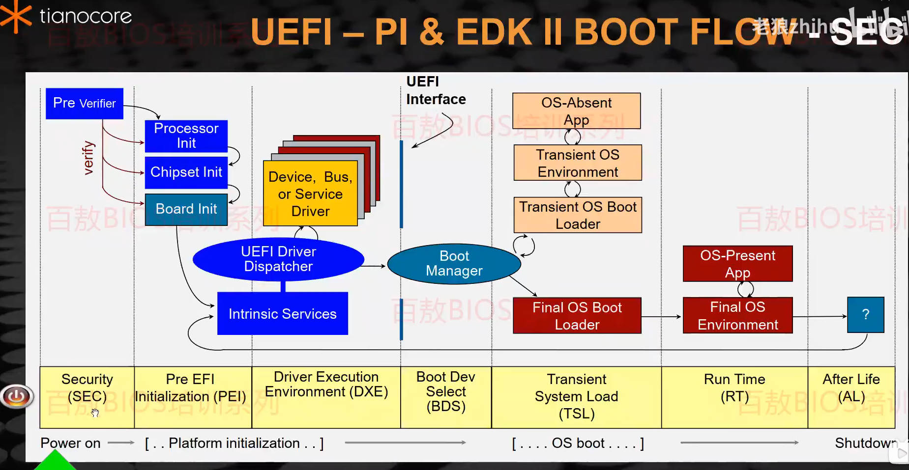 | 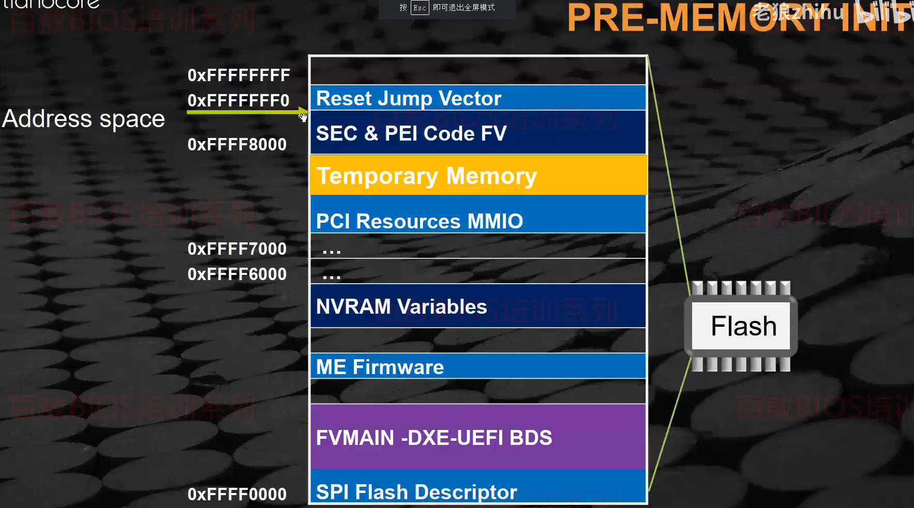 |
| ------------------------------------------------------------ | -------------------------------------------------------- |

###### UEFI启动流程

[UEFI启动流程](https://www.bilibili.com/video/BV1Nr4y1w7dP/?spm_id_from=333.788.recommend_more_video.7&vd_source=7346303e5e18677d7261c2c0c109ecfd)   [uefi](https://blog.csdn.net/inxunxun/article/details/131928259) [uefi的boot loader](https://www.baidu.com/s?ie=UTF-8&wd=uefi%E7%9A%84boot%20loader%20%E5%92%8C%20grub)  [启动过程](https://blog.csdn.net/inxunxun/article/details/131928259)  [使用UEFI固件](https://blog.csdn.net/imred/article/details/131754099) 

UEFI固件->UEFI应用->Linux内核

`读取GPT分区表，查找ESP -> 读取其中的boot loader`

- EFI代码会==读取所有硬盘的GPT分区表==，并在GPT分区表中`查找ESP`
  - 
- 找到esp后，uefi会`读取其中的boot loader`，boot loader通常是以 .efi 结尾的文件。
  - 读取完之后，形成一个`启动项列表`，每个启动项都是指向一个boot loader (grub)
- 然后由我们选择任意一个启动项，uefi执行它。如果不选择，则执行第一顺位启动项

操作系统将自己的loader程序做成EFI应用程序，然后按照UEFI规范，存放在硬盘的GPT分区内的==ef/boot/==目录下。具体的文件名是boot(ARCH).efi，这里ARCH是架构名，如果是IA32,则是bootia32.efi，当然也可以是bootx64.efi，bootIA64.efi等等。


==BIOS检测到这个文件，会自动将其加载到内存，然后执行==。启动操作系统

- ESP: fat32。uefi固件从这里==加载UEFI引导器和应用程序== 
- MSR分区: （Microsoft Reserved Partition）即Microsoft 保留分区, 防止GPT磁盘`接入不支持GPT的老系统时`被误操作导致数据丢失;  不可见,无法在其上存储或删除数据,  删除MSR分区可能会导致系统无法正确识别GPT磁盘

**区别 :**		[好：UEFI与BIOS](https://blog.csdn.net/u013434525/article/details/136433642)   [好：基于UEFI引导的多操作系统（Linux+Windows+MacOS）安装引导与实现方法](https://zhuanlan.zhihu.com/p/656761997)  

- UEFI从GPT分区引导操作系统，并可以直接读取文件系统加载引导程序；BIOS则依赖MBR分区表

**多系统： ** [gpt分区添加efi分区](https://worktile.com/kb/ask/471305.html)  [fdisk添加EFI](https://www.baidu.com/s?ie=UTF-8&wd=Linux%E5%88%9B%E5%BB%BA%E5%8D%95%E7%8B%AC%E7%9A%84EFI)  [UEFI文件](https://www.jianshu.com/p/a35d42daf010)  [启动与引导](https://blog.51cto.com/sddai/3243116) 

- `grubx64.efi`是GRUB2在UEFI环境下的引导加载程序 
- 当有多个EFI分区时，Windows自带的安装器会强制写入第一个EFI分区

[PE里为系统注入USB3.0/3.1或者NVME驱动](https://www.yrxitong.com/h-nd-88.html?groupid=-1)   [小兵pe里面安装工具自动注入驱动](https://www.xiaobingxitong.com/bangzhu/2024-03-24/1371.html) 

###### GPT结构

[GPT](https://www.cnblogs.com/bluestorm/p/5925924.html)  [How Basic Disks and Volumes Work: Storage Services](https://learn.microsoft.com/en-us/previous-versions/windows/it-pro/windows-server-2003/cc739412(v=ws.10)?redirectedfrom=MSDN)  [EFI下的Guid Partition Table Format](https://blog.csdn.net/hezp1984/article/details/6021818) 

[逻辑区块地址_LBA](https://baike.baidu.com/item/%E9%80%BB%E8%BE%91%E5%8C%BA%E5%9D%97%E5%9C%B0%E5%9D%80/22660818?fr=ge_ala)  [全局唯一标识分区表](https://baike.baidu.com/item/%E5%85%A8%E5%B1%80%E5%94%AF%E4%B8%80%E6%A0%87%E8%AF%86%E5%88%86%E5%8C%BA%E8%A1%A8/1956466?fr=ge_ala)  [GPT学习文档](https://blog.csdn.net/cktlpepd40732/article/details/100443278)  [GPT磁盘分区结构分析](https://www.bilibili.com/video/BV1yG4y1y7YC/?spm_id_from=333.337.search-card.all.click&vd_source=7346303e5e18677d7261c2c0c109ecfd) 

[UUID与GUID](https://blog.csdn.net/weixin_41414058/article/details/135249117)  [UUID 生成原理及优缺点](https://blog.csdn.net/u012581020/article/details/131120310) 

- PMBR占用了LBA0，primary partition table必须从LBA1开始
  - primary partition table分为两个部分，第一部分是header，第二部分是entry array
  - Partition entry array和MBR的一样了，是一个数组，里面装有partition 1~n的描述符
- Backup partition table和Primary partition table的内容完全相同，它只是前面那张表的一个备份，它位于磁盘的最后一个block。 
  - 如果primary表发生损坏，软件可以去读取backup表来启动系统并对primary表进行restore

| 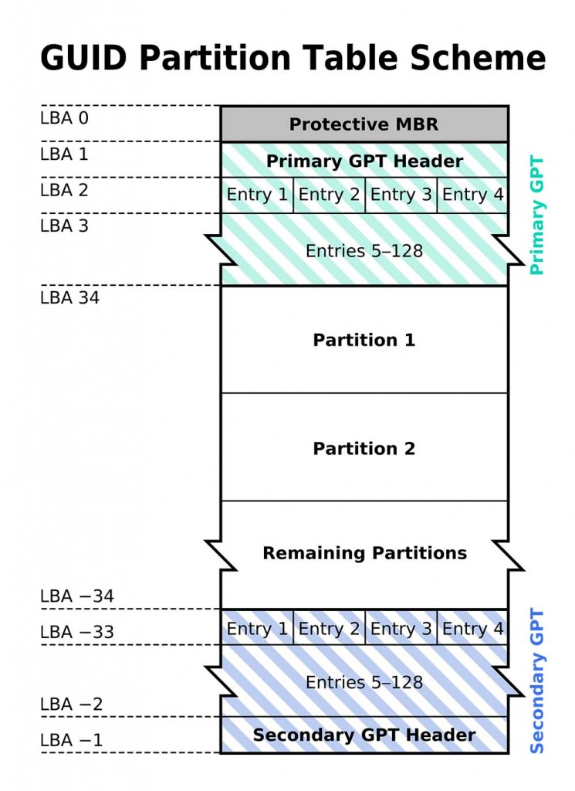                          | 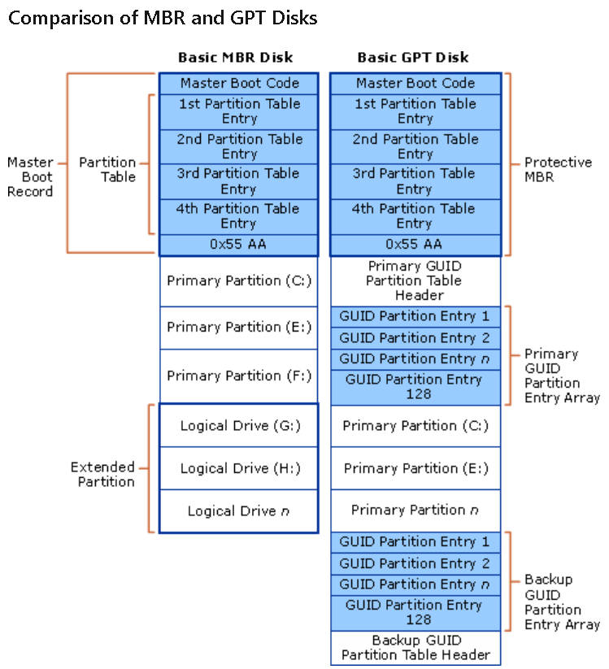 |
| -------------------------------------------------------- | -------------------------------------------------------- |
| 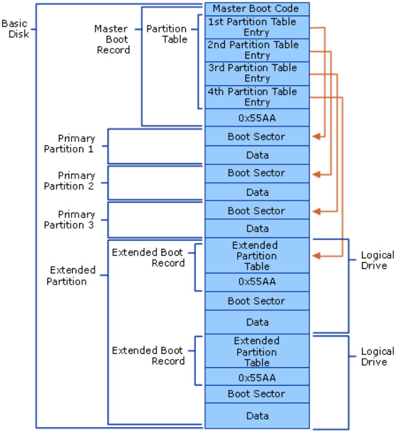 | 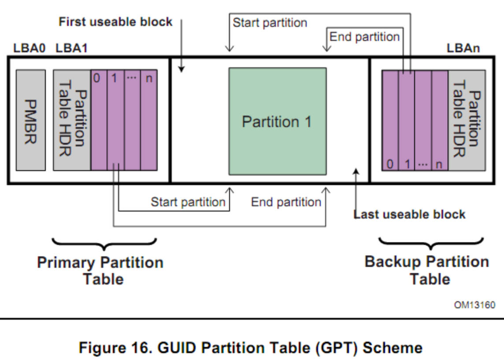 |

**救援模式**

[救援模式使用](https://www.bilibili.com/video/BV1Lt4y1Y779/?spm_id_from=333.999.0.0&vd_source=7346303e5e18677d7261c2c0c109ecfd) 

[grub](https://www.cnblogs.com/sq5288/p/11163227.html)  [grub损坏修复](https://blog.csdn.net/yolo2016/article/details/123609829) 

[/dev/zero](https://www.cnblogs.com/chaosfe/p/16123640.html)  [/dev/null(黑洞文件)与 /dev/zero（空白文件）](https://blog.csdn.net/qq_45649553/article/details/135115278) 

```
# 救援模式用光盘启动系统
chroot /mnt/sysimage						# 切换到系统的根目录
grub-install --root-directory=/ /dev/sda	# 安装grub
```


### 3、加载内核vmlinuz

[linux 内核启动Initramfs与initrd ](https://blog.csdn.net/kwdecsdn/article/details/129151631)    

- grub配置：`/boot/grub/grub.cfg`      内核目录：`/boot`    
- vmlinuz指的是内核，作用：进程管理、内存管理、文件管理、驱动管理、网络管理
- initrd.img是一个小的映象， 放的是和==启动相关的驱动模块==
  - 通常的步骤是`先启动内核，然后内核挂载initrd.img`，并执行里面的脚本来**进一步挂载各种各样的模块**。其中最重要的就是根文件系统驱动模块，有了它才能挂载根文件系统，继而运行用户空间的第一个应用程序init或者systemd，完成系统后续的启动
- `linux2.5中出现了initramfs，它的作用和initrd类似`，只是和内核编译成一个文件(该initramfs是经过gzip压缩后的cpio格式的数据文件)，该cpio格式的文件被链接进了内核中特殊的数据段.init.ramfs上，其中全局变量__initramfs_start和__initramfs_end分别指向这个数据段的起始地址和结束地址。内核启动时会对.init.ramfs段中的数据进行解压，然后使用它作为临时的根文件系统

#### 1、Linux内核的初始化流程

[linux内核启动流程-bilibili](https://search.bilibili.com/all?vt=51557442&keyword=linux%E5%86%85%E6%A0%B8%E5%90%AF%E5%8A%A8%E6%B5%81%E7%A8%8B&from_source=webtop_search&spm_id_from=333.1007&search_source=5) 

[好：Linux 内核初始化过程](https://blog.csdn.net/LIJIWEI0611/article/details/125952005) [Linux系统启动流程详解：从ARM内核初始化到用户空间应用程序启动](https://baijiahao.baidu.com/s?id=1778178715932322768&wfr=spider&for=pc)     [Linux系统启动各阶段的初始化概述](https://blog.csdn.net/Pz_z1/article/details/132237804)  [正常linux启动流程](https://zhuanlan.zhihu.com/p/680778378)  

[源码级别解析linux内核启动流程](https://zhuanlan.zhihu.com/p/657518508) [Linux内核启动流程](https://blog.csdn.net/qq_41781462/article/details/130375910)   [linux 启动过程](https://www.cnblogs.com/rebrobot/p/16873847.html)   [linux内核启动流程](https://www.cnblogs.com/w-j-q/p/14871868.html) 

[Linux系统启动流程](https://blog.csdn.net/kaoa000/article/details/136192025)   [ubuntu 启动流程](https://blog.csdn.net/u012160954/article/details/42026809)   [Ubuntu系统启动过程详解](https://blog.csdn.net/plyukulong2008/article/details/7404620)  

自身初始化：
    探测可识别到的所有硬件设备；
    加载硬件驱动程序；（有可能会借助于ramdisk加载驱动）
    以只读方式挂载根文件系统；
    运行用户空间的第一个应用程序：/sbin/init

#### 2、init程序的类型

linux五大==初始化系统==: 详细内容在[服务管理](#arc) 

[systemd启动流程](https://www.baidu.com/s?ie=UTF-8&wd=systemd%E5%90%AF%E5%8A%A8%E6%B5%81%E7%A8%8B)  [systemd的启动过程](https://www.yisu.com/jc/420179.html)  

[init启动方式：SysVinit / UpStart / Systemd ](https://blog.csdn.net/ken2232/article/details/132531126)   

> 运行级别

[init, telinit](https://www.cnblogs.com/fanweisheng/p/11087946.html)  [telinit 或 init 区别](https://blog.csdn.net/zjjyliuweijie/article/details/6676430)  [telinit](https://www.cnblogs.com/linuxcmd/p/telinit.html)  [Ubuntu 的系统运行级别](https://www.cnblogs.com/hunterliang/archive/2009/01/13/1374920.html)  

==许多程序需要开机启动==。在Windows叫做"服务"（service），在Linux就叫做"守护进程"（daemon）

不同的场合需要启动不同的程序, Linux允许为不同的场合，分配不同的开机启动程序，这就叫做"运行级别"（runlevel）。即： ==启动时根据"运行级别"，确定要运行哪些程序==。

- Linux系统有7个运行级别(runlevel)


```sh
runlevel	# 当前运行级别和之前的运行级别；  N 3 N表示尚未设置之前的运行级别，3当前运行级别

```

**sysv-rc-conf安装**

[Libcurses-ui-perl Download (DEB)](https://pkgs.org/download/libcurses-ui-perl)   [好：sysv-rc-conf需要的依赖](https://packages.debian.org/sid/sysv-rc-conf)   [Curses Library ](https://docs.oracle.com/cd/E86824_01/html/E54767/makehtml-id-6.html#scrolltoc)  [libcurses安装_百度搜索](https://www.baidu.com/s?ie=utf-8&f=8&rsv_bp=1&tn=baidu&wd=libcurses%E5%AE%89%E8%A3%85&rn=20&oq=libcurses&rsv_pq=ce8196d80000664e&rsv_t=ecffLL1YfcxQJzTVXeOT3CKO0HSzkln7JHg1FRTQI2%2FPEikoimoUGCKczKU&rqlang=cn&rsv_enter=1&rsv_dl=tb&rsv_sug3=7&rsv_sug1=10&rsv_sug7=100&rsv_sug2=0&rsv_btype=t&inputT=5462&rsv_sug4=7507)  [libcurl4-openssl-dev源码](https://www.baidu.com/s?ie=utf-8&f=8&rsv_bp=1&tn=baidu&wd=libcurl4-openssl-dev%E6%BA%90%E7%A0%81&rn=20&oq=libcurl4-openssl-dev&rsv_pq=e4587e190027ff33&rsv_t=ae598Fp6Nfx5%2Bpz0rcoK4KZJeygR%2BJV0PNI40x2ucihG4D99F%2FSzaXS4NQc&rqlang=cn&rsv_enter=1&rsv_dl=tb&rsv_sug3=8&rsv_sug1=2&rsv_sug7=100&rsv_sug2=0&rsv_btype=t&inputT=1880&rsv_sug4=4840)  

[开机自启动配置/启动脚本](https://blog.csdn.net/qq825478739/article/details/125405697)  

```sh
# 依赖：libcurses-ui-perl
apt-get install libcurses-ui-perl
```

###  4、其它


## 用户和用户组管理

- 用户账号的添加、删除与修改	`/etc/passwd`

- 用户口令的管理
- 用户组的管理


```sh
usermod -s  /bin/false nginx		# usermod -s /usr/sbin/nologin nginx
usermod -d /var/nginx nginx

```


### 1、用户账号的管理

[用户管理](https://blog.csdn.net/weixin_39719989/article/details/116546705)  [Linux 用户和用户组管理](https://www.runoob.com/linux/linux-user-manage.html) 

- 用户分类
  - 超级管理员，UDI为0
  - 系统用户：伪用户，方便系统管理，用来运行系统和服务的用户，没有密码不能登录，UID1～499，比如有些服务不希望使用root 身份执行，而是希望使用权限更小的账号去执行，就得要提供这些运作程序的拥有者
  - 普通用户：可登入用户，拥有系统部分权限的用户，UID 从 500 开始
- 用户组分类
  - 初始组：==用户刚登录入系统就所在的组==，用户的必须要有一个初始组且只能有一个，一般初始组名和用户名相同
  - 附加组：用户除了初始组外加入的其他组，每个用户可以拥有0或多个附加组

1. 添加用户：`useradd [选项] 用户名 # -g初始组名 -G附加组名`    `useradd -u 1002 -g root -c lisi -d /home/lisi lisi` 
2. 设置密码：`passwd， ！没有设置密码，不能登录，`
3. 修改用户信息：`usermod [选项] 用户名 # -g 1002 改变组`
4. 删除用户：`userdel [选项] 用户名 # -r同时删用户家目录和用户邮件`  /var/spool/mail
5. 查看用户UID和GID： `id [选项] 用户名` 

### 2、用户组的管理

[为什么Linux用户用sudo命令而不直接使用root用户？](https://www.zhihu.com/question/469706766)   

1. 添加用户组：`groupadd [选项] 组名 # -r 创建系统用户组，与/etc/login.defs内地GID_MIN有关 `
2. 修改用户组：`groupmod  # -g改组ID， -n改组名`
3. 删除用户组：`groupdel`， 用户组是某个用户的初始组，要先删用户或改该用户GID后，才能删除该用户组
4. 显示当前登录用户名：`whoami`
5. 显示当前登录用户信息：`w、who`，查询信息来自日志文件 `/var/run/utmp`
6. 用户身份切换：`su用户切换 # -l或-或--login 切换身份同时切换环境变量；   sudo 要先开放sudo权限才能用`
   1. sudoers配置： `/etc/sudoers`，不建议使用vi，用visudo，会自行校验/etc/sudoers的语法

```sh
# 用户名  被管理主机的地址=（可使用的身份） 授权命令（绝对路径）
root	ALL=(ALL:ALL) ALL
# %组名  被管理主机的地址=（可使用的身份） 授权命令（绝对路径）
%admin ALL=(ALL) ALL
```


### 3、与用户==账号有关的文件==

[Linux用户和用户组管理](https://www.runoob.com/linux/linux-user-manage.html) 

/etc/passwd： 用户名:口令:用户标识号:组标识号:注释性描述:主目录:登录Shell

**/etc/shadow**： 登录名:加密口令:最后一次修改时间:最小时间间隔:最大时间间隔:警告时间:不活动时间:失效时间:标志

/etc/group： 组名:用户组密码:组标识号:组内用户列表

/etc/sudoers: 设置哪些用户可以执行sudo

## 权限管理

[Linux权限规划ACL](https://www.cnblogs.com/jixp/p/10901550.html)  [linux ACL](https://www.php.cn/faq/501453.html)  [Linux ACL](https://blog.csdn.net/ahilll/article/details/82836651)  [UGO及ACL权限管理 ](https://blog.csdn.net/cccisi/article/details/78171403)  [ubuntu怎么设置acl](https://www.baidu.com/s?ie=UTF-8&wd=ubuntu%E6%80%8E%E4%B9%88%E8%AE%BE%E7%BD%AEacl)  

[Linux Stick BIT（SBIT）](https://c.biancheng.net/view/872.html)  [Linux特殊权限之suid、sgid、sbit权限](https://www.cnblogs.com/banglook/p/16019354.html)  [linux特殊权限](https://blog.csdn.net/m0_71163619/article/details/131042991)  [Linux的3种特殊权限场景实战](https://cloud.tencent.com/developer/article/2261549)  

- 基本权限UGO：给文件和目录的所属者(u)、所属组(g)、其他用户(o)分配的读、写、执行权限
- ACL权限：可以==针对单一用户或用户组==设定权限，是基本权限之外更细化的权限设定，弥补了基本权限设定不能满足的一些场景
- 特殊权限:除了读写执行权限(rwx)的另一种特殊权限(s/t,SUID/SGID/SBIT)

### 1、基本权限

权限位

文件类型：

- l：软链接文件
- b：块设备文件，存储设备都是这种文件，例：分区文件/dev/sda1
- c：字符设备文件，输入设备一般都是这种文件，如：鼠标键盘等
- p：管道符文件
- s：套接字文件，服务支持socket访问就会产生这样的文件

```sh
chown -R 所有者:属组名 文件名 	  # 更改文件所有者（owner），可同时更改文件所属组
chmod --reference=参考文件或目录	# 使用参考文件的权限来设置目标文件权限
chmod 	# 更改文件9个属性, user group others(u g o a)  all全部
# 2种方法：数字，符号；  r4 w2 x1; 例：rwxrwx--- 770;   chmod 777 test.log
# 符号类型改变文件权限: -rwxr-xr--    chmod u=rwx,g=rx,o=r;  a-x 去掉全部人的可执行权限
# 符号格式： [ugoa][+-=][permission]
```

#### ==权限掩码==

1. 修改文件和目录的所有者和所属组：`chown [选项]  所有者[:所属组] 文件或目录`
2. 只能修改所属组：chgrp
3. 默认权限与==umask==   `-S符号方式展示， umask查看`
   1. ==权限掩码==：新建文件权限:`-rw-r--r--`,新建目录:`drwxr-xr-x`; 这些默认权限由权限掩码决定
   1. ==文件默认最大权限==：666(-rw-rw-rw-);执行权限对文件来讲比较危险，必须用户手工赋予
   1. 目录默认最大权限：777(drwxrwxrwx),执行权限仅代表进入目录
   4. 权限掩码值，所表示的权限，就是新建文件或目录，要从默认最大权限里排除的权限； 
      1. 如0022，第一位特殊权限用的，主要看后3位，022，排除r，即----w--w-
      1. 权限掩码： `看umask -S里没有的权限`  
      1. 文件默认最大权限 - 权限掩码 = ==新建文件权限==
      1. 修改权限掩码：`umask 033` 


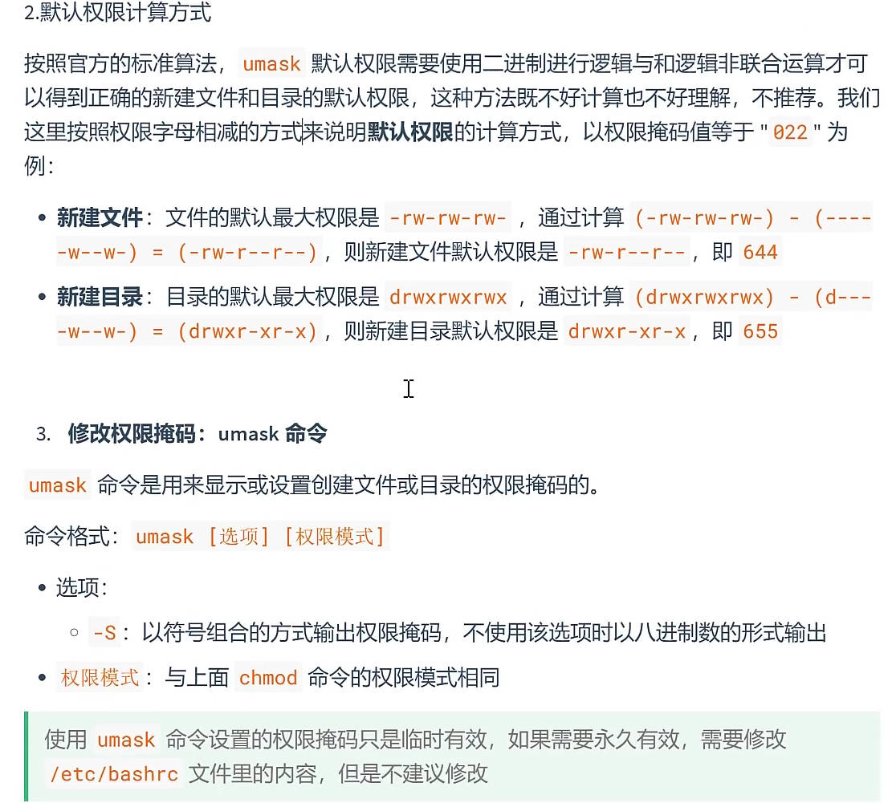


### 2、ACL权限

ACL权限：可以==针对单一用户或用户组==设定权限，是基本权限之外更细化的权限设定

1. ==查看==ACL权限： `getfacl res/`
2. ==添加删除==ACL：`setfacl # -m设定，多条acl规则逗号隔开； -x删除指定 -b删所有 -d设默认ACL权限 -k删默认 -R递归设定acl权限`
   1. 设定用户、用户组的ACL权限 `setfacl -m u:[用户名]:[权限] [文件名]`    `setfacl -m g:[组名]:[权限] [文件名]`
   2. 删除用户用户组的acl权限 `setfacl -x u:[用户名] [文件名]` 
   3. 删除文件的所有ACL权限 `setfacl -b [文件名]`


```
setfacl -m u:meryl:rx file		# ll查看,权限列末尾有 + 的就是acl权限
setfacl -m u:meryl:rwx www
setfacl -m g:testgroup:r-x www/
setfacl -x u:meryl www
setfacl -x g:testgroup www
```


| 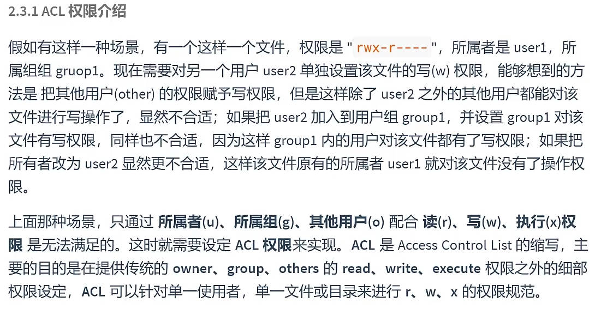 | 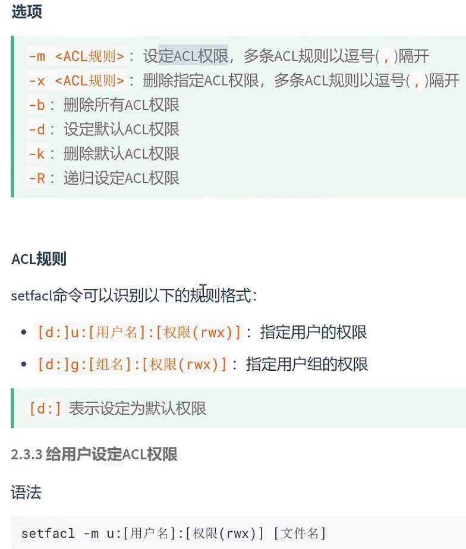 |
| -------------------------------------------------------- | -------------------------------------------------------- |


### 3、特殊权限

[capabilities机制对 root 权限进行细粒度的控制](https://blog.csdn.net/moresec/article/details/135476743) 

[linux设置SBIT](https://www.baidu.com/s?ie=UTF-8&wd=linux%E8%AE%BE%E7%BD%AESBIT) [Linux 文件管理系统有哪些常用指令](https://www.zhihu.com/question/485882148/answer/3202957437)  [linux特殊权限（suid、sgid、sbit）](https://blog.csdn.net/m0_71163619/article/details/131042991)  [linux系统中的特殊权限之SBIT（Sticky BIT）](https://www.cnblogs.com/wukong123/p/10629399.html) [sbit权限](https://blog.csdn.net/weixin_30000283/article/details/116608304)   [Linux特殊权限之suid、sgid、sbit权限](https://www.cnblogs.com/banglook/p/16019354.html)  

`权限除了rwx，还有s、t`，s出现在用户或组执行权限的位置， 

1. ==SetUID(s)==: SUID,针对用户；  作用：==任何用户去执行该文件时==，`会被切换为该文件所属者身份去执行`，而不用用户自己身份执行； 执行过程中权限发生改变
   1. `chmod u+s file`

2. ==SGID（t）==: 针对组
3. SBIT： Sticky Bit，粘滞位； 
   1. SBIT针对目录设置的一个权限位，作用是为了==防止用户删除其他用户的文件== 
   1. 仅对目录有效，一旦目录设定了 SBIT 权限，则用户在此目录下创建的文件或目录，就==只有文件所有者和 root== 才有权利修改或删除该文件。
   1. `chmod 1777 /tmp/shared `，第一个1代表SBIT

| 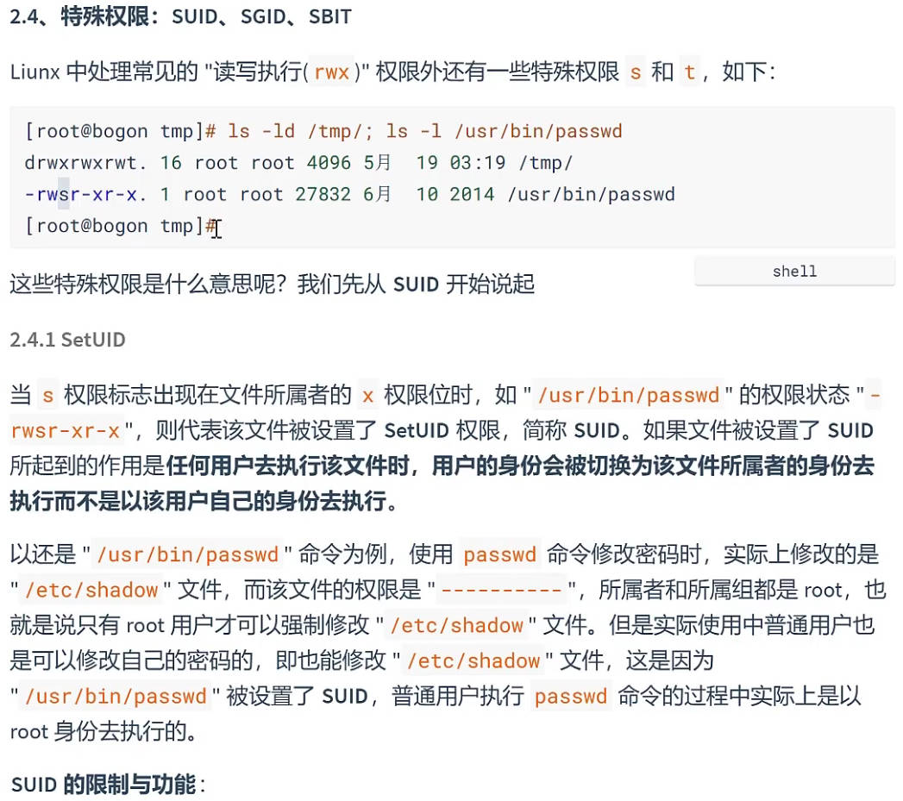 | 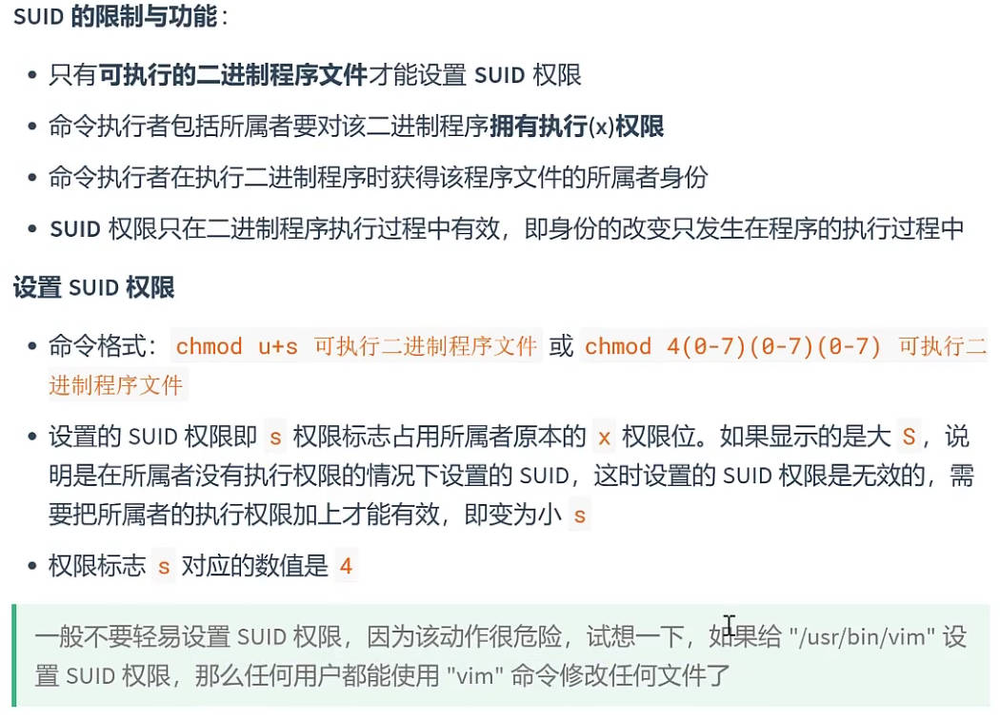 |
| -------------------------------------------------------- | -------------------------------------------------------- |
| 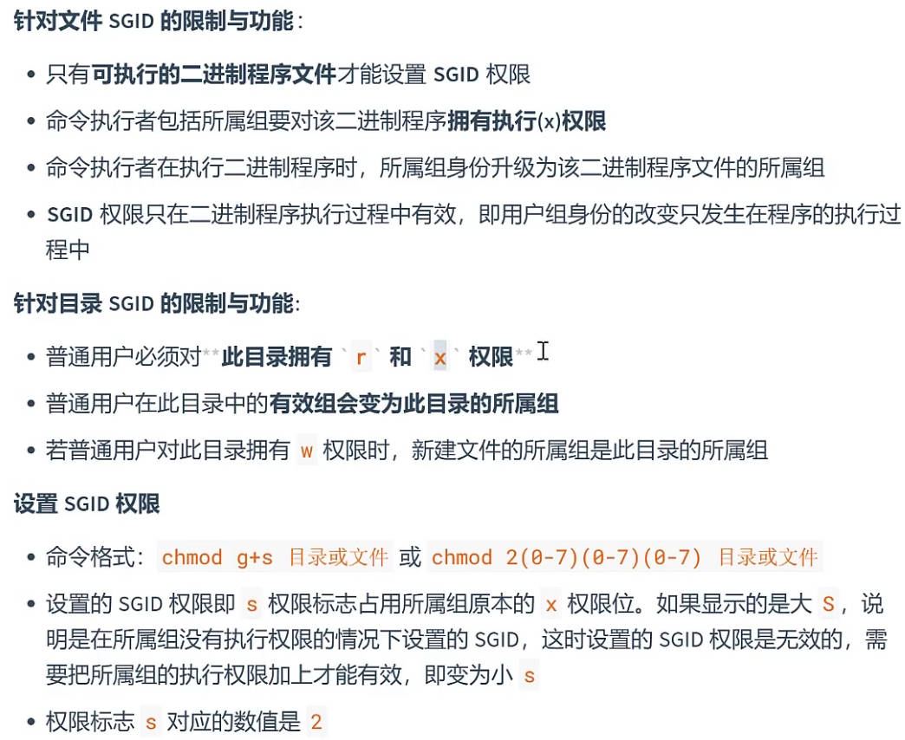 | 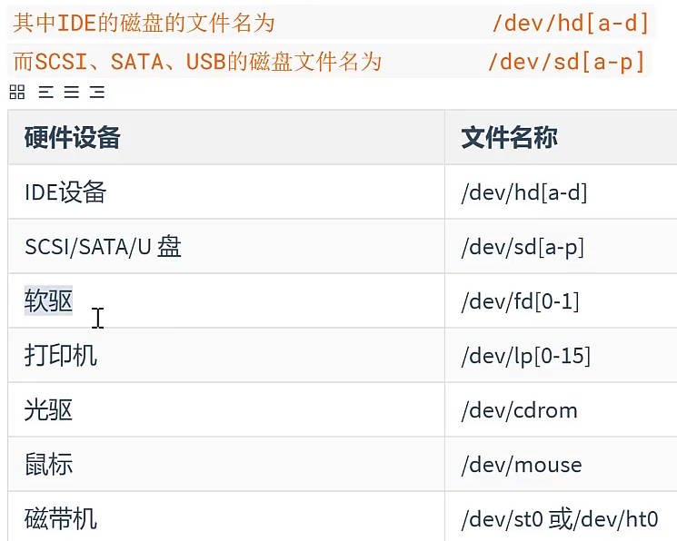 |


## 磁盘管理

小结： **df du fdisk**  ；

- 识别： `lsblk , fdisk -l, gdisk`
- 分区硬盘：使用`fdisk`或`parted`
- 格式化分区：使用`mkfs`
- 挂载分区：使用`mount`挂载新分区到目录

[lsblk](https://www.baidu.com/s?ie=UTF-8&wd=lsblk)   [好：磁盘详细介绍](https://www.cnblogs.com/bubu99/p/12271762.html)  [熟悉EBR、DBR分区表结构](https://www.jianshu.com/p/81957bb28e85?from=singlemessage)    [磁盘的分区与系统引导启动](https://blog.csdn.net/changewang/article/details/6820593)   [磁盘分区、设备文件名、挂载、文件系统结构](https://zhuanlan.zhihu.com/p/285665677)   [彻底搞清Linux磁盘分区](https://www.bilibili.com/video/BV1ho4y1D7ia/?spm_id_from=333.337.search-card.all.click&vd_source=7346303e5e18677d7261c2c0c109ecfd)   [磁盘类型和结构lvm分区和基本分区](https://www.bilibili.com/video/BV1S44y1d7ci/?spm_id_from=333.337.search-card.all.click&vd_source=7346303e5e18677d7261c2c0c109ecfd)  [磁盘和文件系统管理](https://www.bilibili.com/video/BV1jT4y1u7LT/?spm_id_from=333.788.videocard.3&vd_source=7346303e5e18677d7261c2c0c109ecfd)  

[ldd显示程序依赖的库](https://blog.csdn.net/Cappuccino_jay/article/details/125197896)  [chroot切换根目录](https://www.runoob.com/linux/linux-comm-chroot.html) 

硬盘监控和分析:  [smartctl命令](https://cloud.tencent.com/developer/article/2156953)  [smartctl_百度搜索](https://www.baidu.com/s?ie=UTF-8&wd=smartctl)  

### 1、概述

#### 1、磁盘结构

| 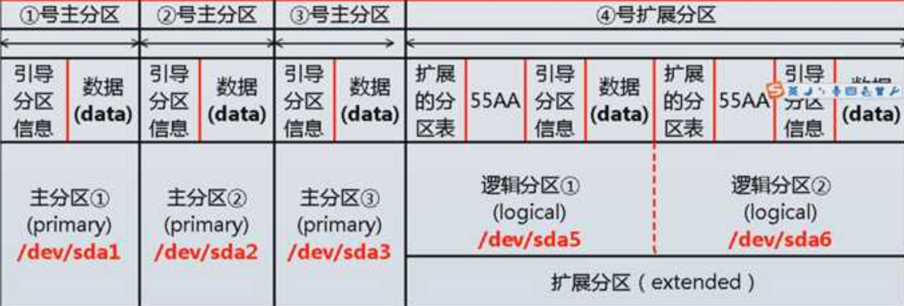 |  |
| -------------------------------------------------------- | -------------------------------------------------------- |

[老男孩磁盘分区详解与命名规则](https://www.bilibili.com/video/BV1Mk4y1w7FK/?spm_id_from=333.337.search-card.all.click&vd_source=7346303e5e18677d7261c2c0c109ecfd)  [老男孩磁盘分区方案](https://www.bilibili.com/video/BV1Qu4y167wh/?spm_id_from=333.337.search-card.all.click&vd_source=7346303e5e18677d7261c2c0c109ecfd)   [老男孩](https://www.cnblogs.com/houbxblogs/p/17893274.html)  [老男孩](https://blog.csdn.net/youmatterhsp/article/details/80684937) 

#### 2、添加磁盘

1. 查看磁盘空间：disk free; `df # -a所有 -k kb显示 -m -h常用 -H以M=1000k取代1024k -i以inode数量显示 -T显示文件系统` 
2. 查看多个==文件占用空间==：disk usage;  `du -h常用 -s仅显示总数 du -sh /etc查看目录大小 ll-h /etc/hosts查看文件大小`
3. lsblk -f: list block,==列出可用块设备的信息==, 显示设备挂载点信息,帮助查看设备是否已经挂载,以及挂载点和文件系统类型等

#### 3、分区和格式化

[fdisk命令详解](https://zhuanlan.zhihu.com/p/679210952)  [fdisk](https://www.cnblogs.com/renshengdezheli/p/13941563.html?ivk_sa=1024320u)  [fdisk分区](https://www.cnblogs.com/t-ym/p/11615421.html)  [Linux查看分区文件系统类型](https://www.cnblogs.com/kerrycode/p/9445608.html)   [fdisk分区](https://www.cnblogs.com/t-ym/p/11615421.html) 

[Gdisk](https://www.bilibili.com/video/BV1no4y1y77K/?spm_id_from=333.337.search-card.all.click&vd_source=7346303e5e18677d7261c2c0c109ecfd)  

linux文件系统：[Btrfs文件系统](https://baijiahao.baidu.com/s?id=1623054345772378400&wfr=spider&for=pc)  [好：Linux文件系统](https://www.cnblogs.com/lyj1023/p/16178047.html)     [Linux下几种常用文件系统Ext4、XFS、ZFS以及Btrfs](https://zhuanlan.zhihu.com/p/571235218?utm_id=0)  [linux所有文件系统](https://www.baidu.com/s?ie=utf-8&f=8&rsv_bp=1&tn=baidu&wd=linux%E6%89%80%E6%9C%89%E6%96%87%E4%BB%B6%E7%B3%BB%E7%BB%9F&rn=20&oq=BtrFS&rsv_pq=c7f518030011c8c3&rsv_t=a5e9xPGRpZANkMHl1ODRz7lUdIHI%2FQCWtKp4pN7IOW48lavR5IObMYF1wdA&rqlang=cn&rsv_enter=1&rsv_dl=tb&rsv_sug3=19&rsv_sug1=15&rsv_sug7=100&rsv_sug2=0&rsv_btype=t&inputT=8180&rsv_sug4=8179)    

格式化： [磁盘格式化mkfs、mke2fs](https://www.jianshu.com/p/bf939474d69b)  [格式化分区mkfs、mke2fs](https://blog.csdn.net/weixin_42045639/article/details/127895685) 

==（Linux、win、unix、网络、集群、分布式）==文件系统

1. ==lvm逻辑卷：可跨分区，跨磁盘==

2. 磁盘分区：`fdisk   parted`  

   - ==parted==： 对大于2TB的磁盘设备进行分区，以及创建GPT分区(fdisk不能)
   - l 列出分区类型，t ==改分区类型==（lvm、swap等）

   - m menu显示命令列表

   - n new新增分区

   - p partition显示分区

   - d 删除

   - w write and exit

   - a ==改引导分区==； 

   - c 关闭DOS的兼容模式

   - u 切换为按==扇区==进行磁盘分区, sector，不要用cylinders

3. 分区步骤

   1. fdisk /dev/sdb, m ,n新增分区； p主分区； w保存退出； lsblk -f查看  `+100M分多大空间这样写`
      1. 扩展分区分逻辑: n

4. ==格式化== mkfs、mke2fs： make file system 创建文件系统，即格式化
   1. `mkfs [-t 文件系统格式]  设备名`，   `mkfs.ext4 /dev/sdb5`
   1. mke2fs专门管理ext系列文件系统；  mkfs建立多种Linux文件系统

**Parted分区**

[parted管理分区](https://www.cnblogs.com/architectforest/p/12642634.html) [parted分区](https://blog.csdn.net/qq_34070818/article/details/127297251)  [parted命令分区](https://blog.csdn.net/a3121772305/article/details/126719110)  [Linux磁盘管理](https://www.cnblogs.com/bubu99/p/12271762.html)   

```sh
# gpt支持很多主分区，128个，所以扩展和逻辑分区就没用了
align-check opt 1		# 检查分区对齐，对齐类型分：optimal、minimal
mkpart					# 创建分区
mklabel					# 创建分区表
rm 1					# 删分区

# 分区步骤
parted /dev/sdc
p						# 显示分区表信息 print
mklabel	gpt				# 支持两种格式: gpt和msdos（mbr）, 创建一个新的gpt类型的空磁盘分区表
mkpart primary  0% 10%	# 创建分区10%，默认单位MB; 用mkpart primary 0 100,分区会不对齐,100M
mkpart primary  10% -1	# -1使用剩余空间
q

# 修改/etc/fstab开机挂载
```


#### 4、磁盘挂载

[Linux块设备管理（udisks2）](https://zhuanlan.zhihu.com/p/642910579)  [Ubuntu 22.04 禁止USB自动挂载](https://blog.csdn.net/qq_42134575/article/details/132666313) [udisk2阻止自动Mount某些设备](https://blog.csdn.net/weixin_30836759/article/details/96315041)  

[使用umount卸载报错](https://blog.csdn.net/hws09082329/article/details/136152110)  [umount](https://www.cnblogs.com/tz90/p/15337094.html) 

1. 把分区的磁盘挂载到目录
2. `mount 设备名 挂载目录		# 建立设备分区和系统目录的映射关系`		
   1. `mount /dev/sdb1  /home/newdisk`
3. umount -f强制卸载  -n 不升级/etc/mtab情况下卸载
4. 开机自动挂载分区     [开机挂载分区](https://www.cnblogs.com/renshengdezheli/p/13941563.html?ivk_sa=1024320u) 
   1. mount手动挂载之后，还需要把挂载信息写入==/etc/fstab==文件中，不然重启之后，需要重新挂载。系统开机读取/etc/fstab，根据里面的配置挂载磁盘     

```sh
# scan文件用于触发SCSI主机扫描，以便发现新的SCSI设备。你应该写入一个可以识别的SCSI设备的ID
# 想扫描所有SCSI设备，可尝试写入- - -到scan文件。这代表扫描所有的SCSI总线、目标和端口
for ((i=0;i<=32;i++));do echo "- - -" >/sys/class/scsi_host/host$i/scan;done;
echo "- - -" | sudo tee /sys/class/scsi_host/host*/scan
# 扫描特定的SCSI设备，可指定总线号、目标号和端口号
echo "0 0 0" > /sys/class/scsi_host/host0/scan

lsblk -f	 				# 所有可用存储设备的详细信息
lshw -class disk			# 查找硬件的所有详细信息    lshw -short
smartctl					# 跟踪和控制配备 SMART（自监测、分析和报告技术）功能的存储硬盘
udevadm						# 控制和查询 udev（设备管理器）服务
hdparm						# 检查和调整硬盘存储设备的设置
inxi 						# 收集和显示系统配置信息
GParted 					# 图形化分区
disks						# gnome-disks是 GNOME 桌面环境下的分区工具

# umount报错: target is busy
fuser -cu /data/backup/	# 查看谁在使用挂载目录
fuser -mv /mnt/			# 查看使用的进程
fuser -kv /mnt/			# 杀死占用的进程
```

linux运行时识别硬盘：

`lsblk -f`

[/sys/class/scsi_host/host0/scan write error: Invalid argument](https://www.baidu.com/s?ie=utf-8&f=8&rsv_bp=1&tn=baidu&wd=%2Fsys%2Fclass%2Fscsi_host%2Fhost0%2Fscan%20%20%20write%20error%3A%20Invalid%20argument&rn=20&oq=%252Fsys%252Fclass%252Fscsi_host%252Fhost0%252Fscan&rsv_pq=e34d83a60051aa93&rsv_t=312fmRcXUyiuDI5TKKnQitEXNSTtXil9tD6R0fM76oxIKKkykFGcw5c6uWw&rqlang=cn&rsv_enter=0&rsv_dl=tb&rsv_sug3=5&rsv_n=2&rsv_btype=t&inputT=2921&rsv_sug4=3137&rsv_sug=1)   

[在Linux中查找硬盘序列号](https://www.51cto.com/article/777961.html)    [网卡显示network为UNCLAIMED](https://www.cnblogs.com/yahuicai/p/16939546.html)   [Linux服务器添加新硬盘无法识别解决方法（无需重启） ](https://blog.csdn.net/weixin_40720226/article/details/100010813)  [lshw](https://www.baidu.com/s?ie=utf-8&f=8&rsv_bp=1&tn=baidu&wd=lshw%E6%89%AB%E6%8F%8F%E5%88%B0disk%E4%BD%86%E6%B2%A1%E6%9C%89%E8%AE%BE%E5%A4%87%E4%BF%A1%E6%81%AF&rn=20&oq=lshw%25E6%2589%25AB%25E6%258F%258F%25E5%2588%25B0disk%25E4%25BD%2586fdisk%25E4%25B8%258D%25E8%25AF%2586%25E5%2588%25AB&rsv_pq=d4d147590056a51b&rsv_t=91b1vCUACOA6qSwPah2QVOSghcwL7RggpSPr%2FF7%2BVcSInjLbeSGhHo5d3ng&rqlang=cn&rsv_enter=1&rsv_dl=tb&rsv_btype=t&inputT=4872&rsv_sug3=53&rsv_sug1=49&rsv_sug7=100&rsv_sug2=0&rsv_sug4=8809)   [linux新加硬盘识别不到](https://www.yisu.com/ask/40844605.html)  [update-initramfs](https://www.cnblogs.com/wanglouxiaozi/p/18068480)  [添加磁盘](https://blog.csdn.net/weixin_67287151/article/details/128006939)  

[lsblk有sdb但/dev下没有](https://www.baidu.com/s?ie=UTF-8&wd=lsblk%E6%9C%89sdb%E4%BD%86/dev%E4%B8%8B%E6%B2%A1%E6%9C%89) 

```sh
# 如果sdb是一块新硬盘，没有分区和格式化，不会出现在/dev目录下
# 如果因为udev规则没有正确创建设备文件，可以通过重新加载udev规则来解决; 会重新扫描硬件信息并创建相应的设备文件
sudo udevadm control --reload-rules
sudo udevadm trigger

# 如果是因为需要重新扫描SCSI总线, 这将会通知内核扫描SCSI总线上的新硬件
echo "- - -" | sudo tee /sys/class/scsi_host/host*/scan
```


### 2、==LVM==逻辑卷

**磁盘弹性管理**：Logical Volume Manager，逻辑卷管理器；  ==lvm逻辑卷：可跨分区，跨磁盘，动态调整磁盘容量== , 无需停机调整分区大小

[好：老男孩逻辑卷](https://www.bilibili.com/video/BV1y3411w7Br/?p=3&spm_id_from=pageDriver&vd_source=7346303e5e18677d7261c2c0c109ecfd)     [LVM ](https://www.cnblogs.com/doubilaile/p/7783123.html)  [LVM管理机制](https://www.cnblogs.com/chacha51/p/13715020.html) 

[LVM逻辑卷](https://www.cnblogs.com/yizhipanghu/p/10188963.html)  [pvs命令](https://www.baidu.com/s?ie=utf-8&f=8&rsv_bp=1&tn=baidu&wd=pvs%E5%91%BD%E4%BB%A4&rn=20&oq=pvs&rsv_pq=9a079cf30023c1fe&rsv_t=c3ef%2Bq7jj0UV1t1gVqtBrhrLO82%2Fu75bHjjzEr7KSzVwoIleCayaj9fCtvQ&rqlang=cn&rsv_enter=1&rsv_dl=tb&rsv_sug3=7&rsv_sug1=5&rsv_sug7=100&rsv_sug2=0&rsv_btype=t&inputT=2017&rsv_sug4=3650) [重启后丢失/dev/sdb处理](https://blog.csdn.net/szuwangjl/article/details/121592697) [磁盘管理LVM](https://blog.csdn.net/m0_71163619/article/details/130965748) 

逻辑卷lvm：[ LVM管理硬盘](https://eulixos.com/docs/2.0/Administration/%E4%BD%BF%E7%94%A8LVM%E7%AE%A1%E7%90%86%E7%A1%AC%E7%9B%98.html#lvm-%E7%AE%80%E4%BB%8B)  [linux普通分区与lvm分区](https://blog.csdn.net/dhl1987/article/details/127071252)   [LVM详解](https://www.cnblogs.com/large-show/p/16203274.html)  [磁盘管理LVM](https://blog.csdn.net/m0_71163619/article/details/130965748)    [ Visual LVM ](https://zhuanlan.zhihu.com/p/378701078)  [visual lvm](https://www.baidu.com/s?ie=UTF-8&wd=visual%20lvm)  [LVM_百度百科](https://baike.baidu.com/item/LVM/6571177?fr=ge_ala) 
[LVM灾难修复](https://blog.csdn.net/msdnchina/article/details/44567283)  [LVM丢失或损坏物理盘pv故障处理](https://blog.51cto.com/u_9100413/2622333)   [磁盘损坏lvm](https://www.baidu.com/s?ie=utf-8&f=8&rsv_bp=1&tn=baidu&wd=%E7%A3%81%E7%9B%98%E6%8D%9F%E5%9D%8Flvm&rn=20&oq=%25E7%25A3%2581%25E7%259B%2598%25E6%258D%259F%25E5%259D%258F&rsv_pq=978603a0001b04c9&rsv_t=afdc%2FCPmz02i1l6SD5xuGorzlDXN59wA5g9XFcCw7ZUblEDG4Z0XCvzVE3E&rqlang=cn&rsv_enter=1&rsv_dl=tb&rsv_sug3=10&rsv_sug1=11&rsv_sug7=100&rsv_sug2=0&rsv_btype=t&inputT=4873&rsv_sug4=6193)   [ Raid LVM](https://www.zhihu.com/question/450271127) 


- lvm名词
  - ==PV==： 分区或磁盘
    - PE: 用lvm时，自动把分区==大的存储空间打散==，拆分成一个个小的存储单元，默认4MB
  - ==VG==:拆分后上万个PE，==汇总到一个逻辑卷组==里
    - ==LV==： 用户想用多少空间，就从逻辑卷组里抽取相应数量的PE，构成逻辑卷LV
- 逻辑卷操作命令：==操作pv、vg、lv==； 6大类， `scan, create, display,remove;  extend,reduce`
  - 逻辑卷操作环境准备： fdisk先分区
  - 逻辑卷功能基础配置
  - 逻辑卷扩容、缩容
  - 逻辑卷组扩容、缩容

```sh
# 创建流程: fdisk先分区; 创建物理卷pv-->卷组vg-->逻辑卷lv-->格式化-->挂载使用
yum install -y lvm2					# 不装没有lvm操作命令,ubuntu好像有这些命令
pvcreate /dev/sdb1 /dev/sdb2		# 1.创建pv,pv划到vg组里才会打散
pvs		# 查看pv	
vgcreate vg1 /dev/sdb1 /dev/sdb2	# 2.创建vg1组，把2个分区划分到vg1, vgs查看
lvcreate -L 200M -n lv1 vg1			# 3.创建lv，名字vl1，大小200M，从vg1里拿出相应pe

# 使用lv
mkfs -t ext4 /dev/vg1/lv1	# 4.对lv创建文件系统,有格式化； ext4能扩容缩容， xfs只能扩容
mount /dev/vg1/lv1 /mnt		# 5.挂载使用
df -h						# 查看

# 删除
pvremove /dev/sdb2
vgreduce vg1 /dev/sdb2
lvremove /dev/vg1/lv1
rm -rf /dev/vg1/lv1/*
!lv
# 扩容缩容

```


| 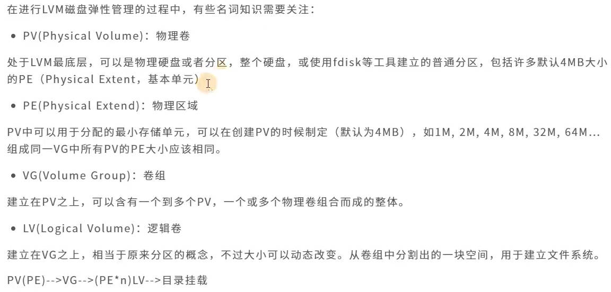 | 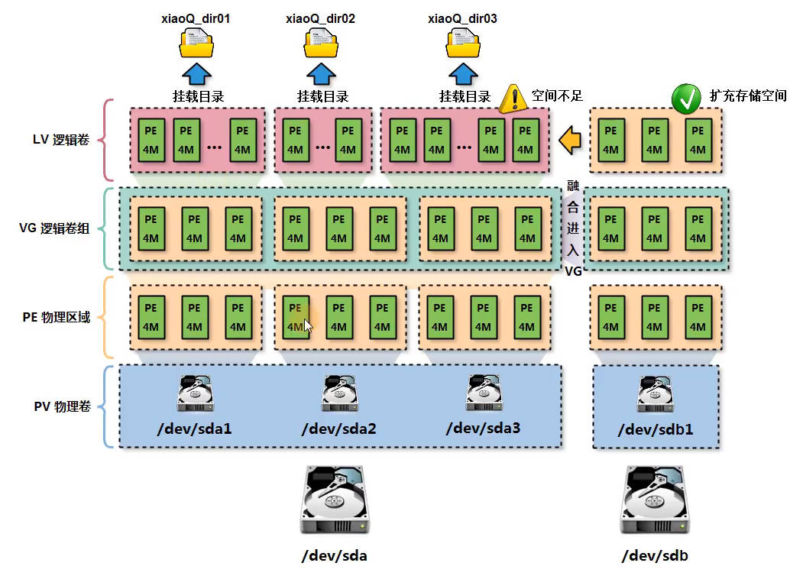 |
| -------------------------------------------------------- | -------------------------------------------------------- |
| 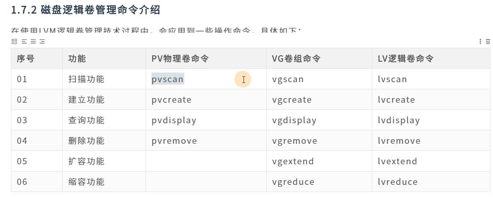 |                                                     |

### 3、RAID

[Raid1原理](https://www.bilibili.com/video/BV1w94y1o723/?p=7&vd_source=7346303e5e18677d7261c2c0c109ecfd)   [老男孩](https://haokan.baidu.com/v?pd=wisenatural&vid=5497702046673454261)    [RAID视频](https://www.bilibili.com/video/BV1ju411B7uP/?spm_id_from=333.337.search-card.all.click&vd_source=7346303e5e18677d7261c2c0c109ecfd)  

### 4、磁盘命令

[dd](https://www.runoob.com/linux/linux-comm-dd.html) 

```sh
fdisk：		# 磁盘分区工具                       	★★★★☆
parted：		# 磁盘分区工具                      	★★★★☆
partprobe：	# 通知系统磁盘的分区信息变化 更新内核的硬盘分区表信息            ★★★☆☆
tune2fs：	# 调整ext2/ext3/ext4文件系统参数        ★★☆☆☆
    -c 0 count    				# 关闭每挂载多少次进行磁盘检查
    -i 0 interval 				# 关闭每隔多久进行磁盘检查
    # 关闭磁盘分区的自动检查
mkfs：make filesystem 		    # 创建Linux文件系统                   ★★★☆☆
    -t 指定文件系统类型
    mkfs.ext4 == mkfs -t ext4
dumpe2fs：						# 显示文件系统信息       ★★☆☆☆
resize2fs：调整ext2/ext3/ext4文件系统大小                       ★★☆☆☆   会影响业务
fsck：检查并修复Linux文件系统                       ★★★☆☆  硬盘没问题不要用
    -a
    
# dd 从标准输入或文件中读取数据，根据指定的格式来转换数据，再输出到文件、设备或标准输出
dd：读取、转换并输出数据                                   ★★★☆☆
od  查看二进制文件的内容
    -xa
    dd if=/dev/sda  of=/tmp/512.bin  bs=512 coun
    od -xa /tmp/512.
mount：挂载文件系统                       ★★★★★
umount：卸载文件系统                       ★★★☆☆
    umount /mnt
df：			# 报告文件系统磁盘空间的使用情况                       ★★★★★
mkswap：		# 创建交换分区                       ★★☆☆☆
swapon：		# 激活交换分区                       ★★☆☆☆
swapoff：	# 关闭交换分区                       ★★★☆☆
sync：		# 刷新文件系统缓冲区                      ★★☆☆☆
top ：		# 查看系统性能信息
iotop 		 # 查看系统的磁盘读写速度 显示出进程使用swap的情况
   			 # io input/output 输入/输出 读写
htop  		# top升级版
iftop 		# 查询网卡流量情况
    -i 		# 指定监视网卡
```


## 进程管理

[supervisor进程管理详解](https://blog.csdn.net/weixin_54015549/article/details/132691932)   [Supervisor进程管理服务配置](https://blog.csdn.net/xjxy52o/article/details/132178791)  [ubuntu20.04 Supervisor 开机自启动脚本](https://blog.csdn.net/weixin_44025389/article/details/132753437)  [supervisor ](https://www.baidu.com/s?ie=utf-8&f=8&rsv_bp=1&tn=baidu&wd=supervisor%20ubuntu&rn=20&oq=supervisor&rsv_pq=e56ac057001e19cb&rsv_t=5c1bK1krWcuJKyrSFWJbGNQh1kpnTH6cxfhtGzZeM620Ql%2B3dcnGal0ocF8&rqlang=cn&rsv_enter=0&rsv_dl=tb&rsv_sug3=8&rsv_sug1=6&rsv_sug7=100&rsv_btype=t&inputT=7843&rsv_sug4=7996)  [Ubuntu安装守护进程supervisor](https://www.cnblogs.com/qiyebao/p/7456564.html) 

[进程相关操作讲解（进程概念、xinetd守护进程、进程管理命令）](https://blog.csdn.net/m0_49864110/article/details/134097369) 

[Linux后台运行以及调回前台运行](https://blog.csdn.net/fbbqt/article/details/103573558)   [Linux进程的前后台切换](https://www.cnblogs.com/wuqianling/p/5370442.html)  [Linux进程的前后台切换](https://www.cnblogs.com/wuqianling/p/5370442.html)  [Linux进程的前台/后台切换](https://cloud.tencent.com/developer/article/2393350?from=15425)   [Linux基础总结](https://zhuanlan.zhihu.com/p/663873352?utm_id=0) 

[Linux中进程的六种状态](https://blog.csdn.net/qq_73881574/article/details/132009434)   [Linux进程状态](https://blog.csdn.net/qq_65285898/article/details/128128019)   [ps aux输出格式](https://www.runoob.com/linux/linux-comm-ps.html)  [ps aux 和ps -el输出格式](https://blog.csdn.net/m0_52113115/article/details/123969008)     [linux系统管理](https://www.cnblogs.com/lgh344902118/p/6848888.html)

[ps输出格式](https://www.cnblogs.com/liuyuelinfighting/p/15694897.html)  [进程](https://blog.csdn.net/qidaihuimou/article/details/119531038)  [ps命令](https://www.cnblogs.com/OliverQin/p/10137804.html)  [ps -le](https://www.baidu.com/s?ie=utf-8&f=8&rsv_bp=1&tn=baidu&wd=ps%20-le%20%20ADDR%20SZ%20WCHAN%20PRI&rn=20&oq=ps%2520-le%25E8%25BE%2593%25E5%2587%25BA%25E6%25A0%25BC%25E5%25BC%258F%2520linux&rsv_pq=dcaa009c000e6786&rsv_t=b0070NksVLF3xyzcAQ%2BedAKEAkzLBc21%2BimLZuc19TgirvfGIZHeZxU9aSE&rqlang=cn&rsv_enter=0&rsv_dl=tb&rsv_btype=t&inputT=11648&rsv_sug3=57&rsv_sug1=29&rsv_sug7=100&rsv_sug2=0&rsv_sug4=13216)   [ ps菜鸟教程](https://www.runoob.com/linux/linux-comm-ps.html) 

[ pstree & pgrep](https://www.cnblogs.com/fadewalk/p/10844960.html)   [闪电教程](https://jsrun.net/t)  [pstree命令](https://www.cnblogs.com/machangwei-8/p/10391961.html)  [进程树pstree](https://blog.csdn.net/qq_21688871/article/details/130230118)   [pstree树状显示进程信息](https://blog.csdn.net/rhn_111/article/details/129154684)   

[Linux系统进程管理](http://article.itxueyuan.com/jExEea) 

==小结==：`ps top pstree lsof kill pkill nohup`

- ps  静态的，是运行 ps 命令那个时刻的状态或者说是一个进程快照
- top 动态，实时监听正在运行进程
- lsof 查看某个==进程具体调用的哪些文件==
- systemd 是一个 Linux 系统==基础组件的集合==，提供了一个系统和服务==管理器==，运行为 PID 1 并负责启动其它程序
  - systemd 常用命令（它是一组命令的集合）： systemctl
- 可按==ctrl+z==将进程挂起

### 1、进程启动方式ps

1. 前台启动：启动一个耗时的进程，可按==ctrl+z==将进程挂起，ps查看进程
   1. miscellaneous，

2. 后台启动：如果进程特别耗时，可后台启动，`命令结尾+空格&  find / -name *.log &`
3. `jobs ,fg %1 切换到前台， bf %1 切换到后台`
4. 这2种都是由当前shell进程产生，是shell创建了新进程，shell为父进程，新进程为子进程
5. 查看进程树： ==pstree==，树状结构显示程序和进程之间关系  `5*[httpd] 有5个子服务`
   1. 帮助找进程的父进程，想终止整个进程系列，只需终止最上层进程即可

6. pgrep: 查找匹配条件的进程号, 可看作ps和grep的结合

7. `pstree` ： 树形结构显示==程序和进程之间的关系== 

```sh
# ps 显示当前系统中的进程, 静态的，是运行 ps 命令那个时刻的状态或者说是一个进程快照
-ef 	列出所有进程；
-efH 	以乔木状列举出所有进程；
-u 		列出此用户运行的进程；
aux 	通过 CPU 和内存使用来过滤进程 ps aux | less ;
-aux --sort -pcpu 按 CPU 使用降序排列，-aux --sort -pmem 表示按内存使用降序排列;
-axjf 	以树形结构显示进程， ps -axjf 它和 pstree 效果类似

ps aux # BS系统格式，-le linux标准命令格式
a显示所有进程， u 进程归属用户及内存使用情况， x 显示没有控制终端的进程, processes without controlling ttys
-l 长格式显示详细信息，只能看当前shell产生的进程  -e 显示所有进程
aux输出格式： VSZ该进程占用虚拟内存大小  RSS物理内存， 虚拟内存和物理内存通过一张表映射；
-le输出格式： F进程权限 S进程状态 PRI数值越小优先级越高  ADDR进程对应内存的位置 SZ进程占多大内存 WCHAN进程是否运行 

pstree root 查看用户进程
pstree -p |grep sshd

# top 获取进程的动态列表

```

**进程状态** STAT , START进程开始时间，TIME进程运行时间

- 状态码 R ：表示正在运行的状态；
- 状态码 ==S== ：表示中断（休眠中，受阻，当某个条件形成后或接受到信号时，则脱离该状态）；小s说明还包含有子进程
  - S<睡眠，但有高优先级
- 状态码 D ：表示不可中断（进程不响应系统异步信号，即使用kill命令也不能使其中断）；
- 状态码 ==Z== ：表示僵死（进程已终止，但进程描述符依然存在，直到父进程调用 wait4() 系统函数后将进程释放）；
- 状态码 T ：表示停止（进程收到 SIGSTOP 、 SIGSTP 、 SIGTIN 、 SIGTOU 等停止信号后停止运行）。

| 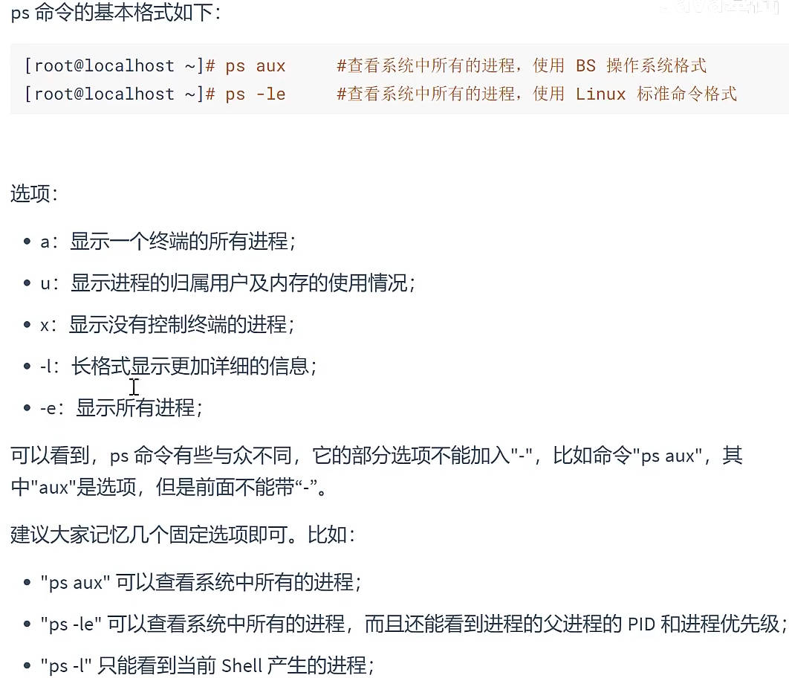 | 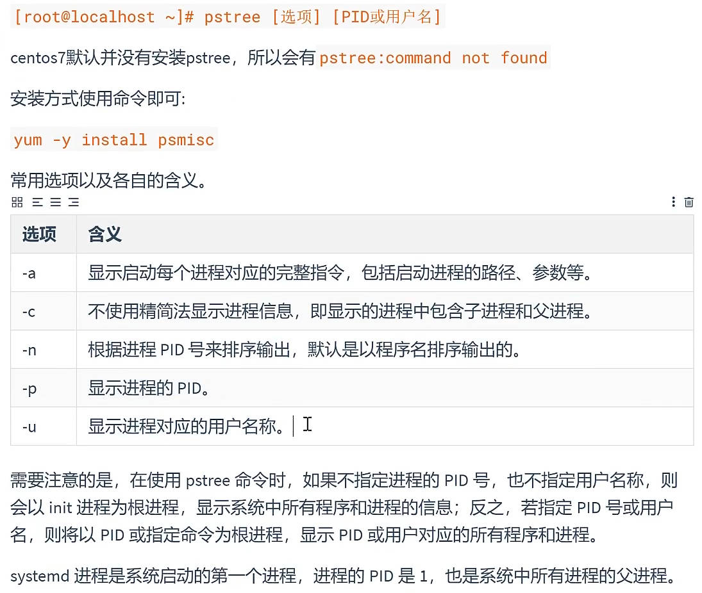 |
| ---------------------------------------------------------- | ------------------------------------------------------------ |
| 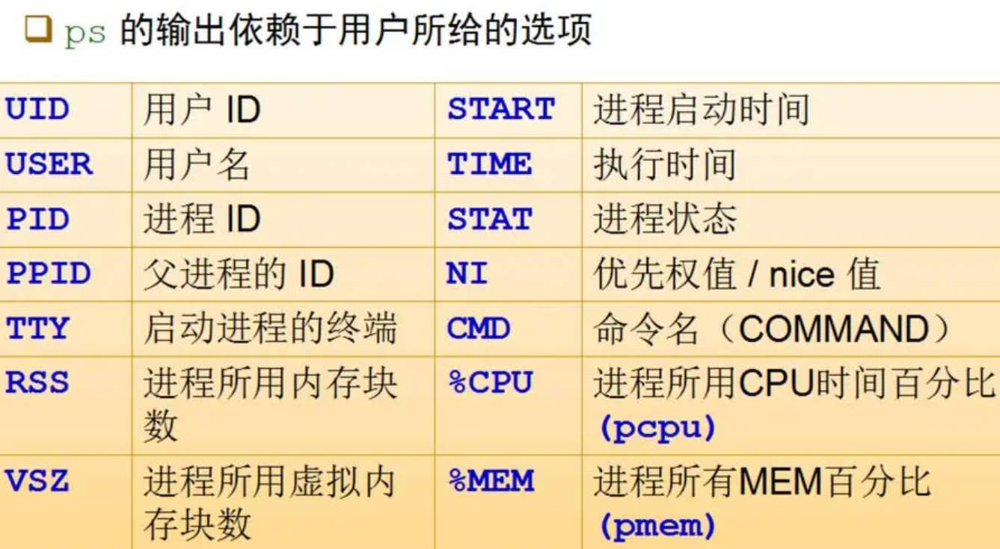   | 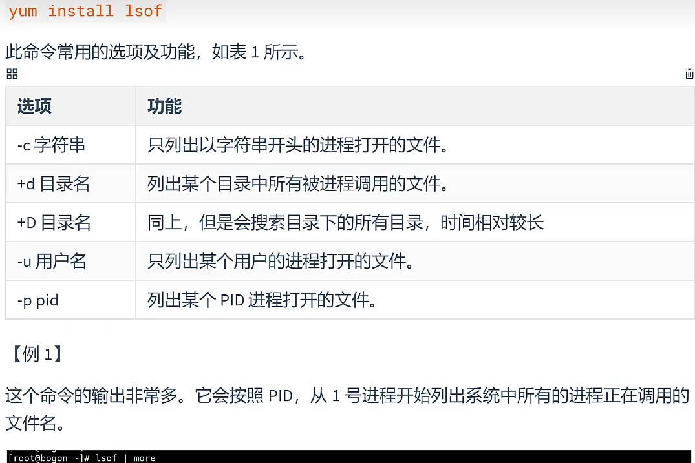 |


```sh
PID — 进程id
USER — 进程所有者
PR — 进程优先级
NI — nice值。负值表示高优先级，正值表示低优先级
VIRT — 进程使用的虚拟内存总量，单位kb。VIRT=SWAP+RES
RES — 进程使用的、未被换出的物理内存大小，单位kb。RES=CODE+DATA
SHR — 共享内存大小，单位kb
S — 进程状态。D=不可中断的睡眠状态 R=运行 S=睡眠 T=跟踪/停止 Z=僵尸进程
%CPU — 上次更新到现在的CPU时间占用百分比
%MEM — 进程使用的物理内存百分比
TIME+ — 进程使用的CPU时间总计，单位1/100秒
COMMAND — 进程名称（命令名/命令行）
```

### 2、实时监听运行进程top

[Linux中主机监测命令：top、df等命令说明](https://blog.csdn.net/polaris3012/article/details/130278380) [top命令](https://blog.csdn.net/qq_53980494/article/details/126889994) [top ](https://www.zhihu.com/question/487009943/answer/3386577390)  [Linux监控命令](https://baijiahao.baidu.com/s?id=1797731080086413737&wfr=spider&for=pc)  [top命令](https://www.cnblogs.com/ylxtiankong/p/18184812)  [top 命令](https://www.zhihu.com/question/487009943/answer/3386577390)    

- 动态，实时监听正在运行进程;  进入top后，有一些交互操作，？或h显示交互模式帮助

```sh
# top各项说明
up 运行时间	  load average 1、5、15分钟平均负载（系统压力）  tasks有多少进程
缓存cache： 读操作时，读硬盘数据时，把常用数据保存到内存缓存区
缓冲buffer：写操作时

top -p pid	# 查看单个进程
top -b -n 1 > /root/top.log
按r改NI值：改优先级
```


| 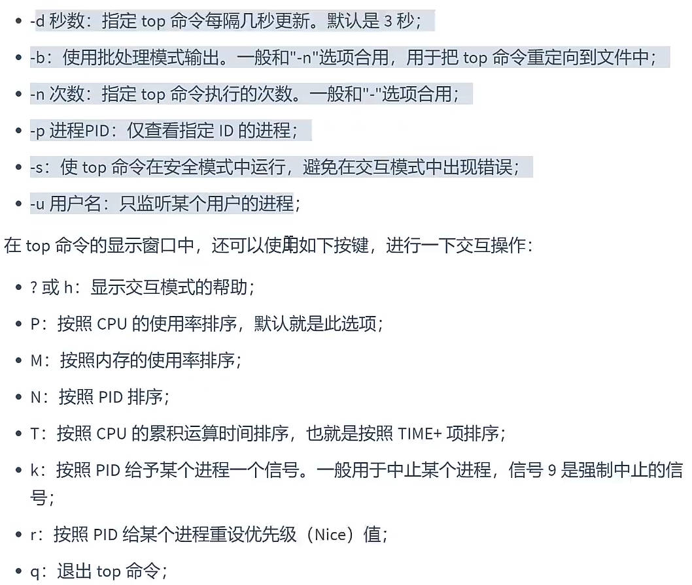 | 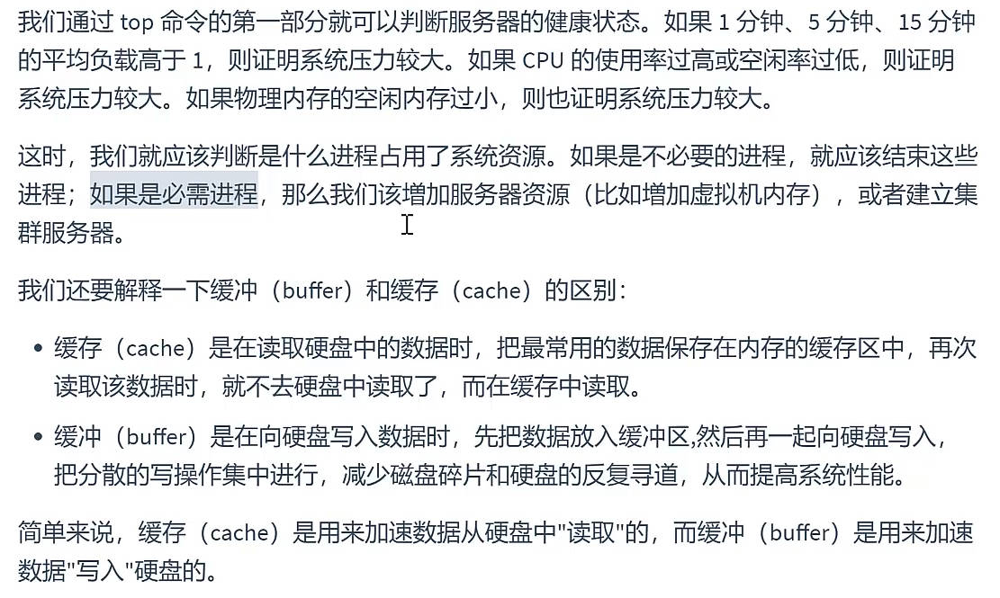 |
| ------------------------------------------------------------ | -------------------------------------------------------- |
| 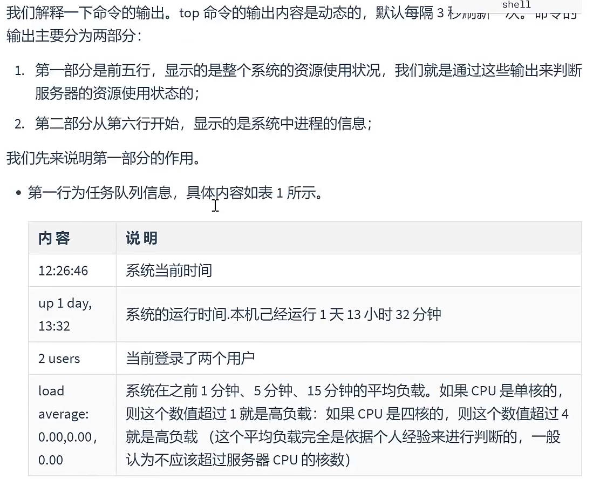 |  |
|      |  |
|      |  |

### 3、列出进程调用的文件信息lsof

list opened files；  ==根据文件找进程==

```sh
FD 文件描述符  NODE文件的索引节点
lsof -u ^root	# 不是root打开的文件
lsof -p pid		# 某个pid打开的文件
lsof /dev/null		lsof +d /dev	# 查看文件或目录被哪些进程调用， +D递归查目录
```

### 4、按照终端踢出登录用户pkill

- kill: 本质上只是==向内核发送一个信号==，信号具体是什么，由用户指定
  - `kill [信号] PID`
  - kill -l 列出所有信号  19是信号暂停; 9强制结束进程；15正常结束进程
- pkill：
  - 杀掉进程: `pkill [信号] PID` 
  - 踢出用户：按终端号来踢出用户   `pkill -9 -t 终端号;  ` w查终端号：TTY -> ==pkill -9 -t pts/1==

|  |      |
| -------------------------------------------------------- | ------------------------------------------------------------ |
|  |  |

### 5、将后台命令脱离终端运行nohup

- nohub: ==将服务脱离终端运行==
- 断掉终端，重新登录，ps aux，能看到nohub进程还在运行

|  |  |
| -------------------------------------------------------- | -------------------------------------------------------- |


```
# 打印/下所有文件，放入后台执行
nohup find / -print >/root/file.log &
```

## 服务管理

[systemd 中谁负责xinetd功能](https://blog.51cto.com/u_16213694/10518991)  [Systemd架构_百度搜索](https://www.baidu.com/s?wd=Systemd%E6%9E%B6%E6%9E%84&rsv_spt=1&rsv_iqid=0xdc9fa98100178c8a&issp=1&f=8&rsv_bp=1&rsv_idx=2&ie=utf-8&tn=baiduhome_pg&rsv_enter=1&rsv_dl=tb&rsv_sug3=7&rsv_n=2&rsv_sug1=5&rsv_sug7=100&rsv_sug2=0&rsv_btype=i&inputT=4652&rsv_sug4=4655) 

[systemD and systemV](https://www.cnblogs.com/xman888/p/15442741.html) 


### 1、服务概述

- 服务是==常驻内存的程序==，后台运行，并等待用户或其它软件调用。 
  - 服务产生的进程和终端无关，==终端关闭之后，服务进程仍然在系统后台自动运行==

- ==提供服务的程序==，是由运行在后台的==守护进程Daemon来执行==
- 特殊的守护进程： ==系统初始化进程==,PID是1，是其它守护进程的父进程或祖先进程

|  |  |
| -------------------------------------------------------- | -------------------------------------------------------- |

### 2、服务管理

[Linux五大初始化系统（1992-2015）](https://www.51cto.com/article/519093.html)   [Linux初始化init系统之Sysvinit ](https://zhuanlan.zhihu.com/p/180400320)  [Linux初始化 init 系统](https://www.cnblogs.com/shanyou/p/4508190.html)   [Linux五大初始化系统](https://developer.aliyun.com/article/87583)  [Systemd详解](https://blog.csdn.net/weixin_46556780/article/details/136483531) 

[linux的启动与初始化](https://baijiahao.baidu.com/s?id=1735159351432476293&wfr=spider&for=pc)   [linux有哪些初始化系统](https://www.baidu.com/s?ie=utf-8&f=8&rsv_bp=1&tn=baidu&wd=linux%E6%9C%89%E5%93%AA%E4%BA%9B%E5%88%9D%E5%A7%8B%E5%8C%96%E7%B3%BB%E7%BB%9F&rn=20&oq=linux%25E5%2588%259D%25E5%25A7%258B%25E5%258C%2596%25E7%25B3%25BB%25E7%25BB%259F&rsv_pq=a1fbaced00174d07&rsv_t=059eMW43Dm1v4zFEuZtG8N1o5Jay%2BbBO1lcJfWjgfn7BIfgd3HWnqiuAS7U&rqlang=cn&rsv_enter=1&rsv_dl=tb&rsv_sug3=10&rsv_sug1=7&rsv_sug7=100&rsv_sug2=0&rsv_btype=t&inputT=3905&rsv_sug4=6371) 

[Systemd架构_百度搜索](https://www.baidu.com/s?ie=utf-8&wd=Systemd%E6%9E%B6%E6%9E%84) 

[如何编写基于 LSB 初始化标准的 Linux 初始化脚本](https://bbs.huaweicloud.com/blogs/358621)   [LSBInit 标准的 Init 脚本](https://www.baidu.com/s?ie=UTF-8&wd=LSBInit%20%E6%A0%87%E5%87%86%E7%9A%84%20Init%20%E8%84%9A%E6%9C%AC)  [Resource Agent:LSB和OCF ](https://www.cnblogs.com/f-ck-need-u/p/8724402.html)   [LSB 脚本规范](https://blog.csdn.net/gu_87_2008/article/details/47185767)   [LBS初始化脚本](https://www.baidu.com/s?ie=utf-8&f=8&rsv_bp=1&tn=baidu&wd=LBS%E5%88%9D%E5%A7%8B%E5%8C%96%E8%84%9A%E6%9C%AC%20linux&rn=20&oq=LBS%2520%25E5%2588%259D%25E5%25A7%258B%25E5%258C%2596%25E8%2584%259A%25E6%259C%25AC&rsv_pq=9a498fba000f707c&rsv_t=c5edjst7K1X5%2BQbFfFwwaf9aaPLEXijVP0S2AjFuWuMSmYuecuzO26W0D6g&rqlang=cn&rsv_enter=1&rsv_dl=tb&rsv_sug3=11&rsv_sug1=9&rsv_sug7=100&rsv_sug2=0&rsv_btype=t&inputT=6303&rsv_sug4=7055)  

[在 Ubuntu 和 Linux Mint 上更改运行级别的简单方法](https://blog.csdn.net/weixin_43025343/article/details/136767681) 

[linux d后缀的目录](https://blog.csdn.net/weixin_39575054/article/details/116577212)   [Linux 目录之 /etc/init.d/](https://blog.csdn.net/tjcwt2011/article/details/121951579?utm_medium=distribute.pc_relevant.none-task-blog-2~default~baidujs_baidulandingword~default-12-121951579-blog-116577209.235^v43^pc_blog_bottom_relevance_base9&spm=1001.2101.3001.4242.7&utm_relevant_index=15)  

**conf文件**： [conf](https://www.cnblogs.com/netsa/p/15385635.html) [journal配置文件详解](https://blog.csdn.net/qq_40804558/article/details/137056495) [玩转Cgroup](https://zhuanlan.zhihu.com/p/668398777)  

> **用于启动脚本** ：`/etc/rc5.d/`    `/init.d`    run-level control
>
> **用于设置环境变量**：`/etc/profile  /etc/bashrc`
>
> **用于管理服务**：  `/etc/systemd/system/  /usr/lib/systemd/system/  /run/systemd/system/ `  三个目录、systemd下有系统和用户之分、 Unit 和 Target；  服务依赖service.wants， service.requires

- linux五大==初始化系统==: <a id="arc">启动过程</a>   
  - **System V Init**
  - **SystemD**
    - 主要目的是：系统初始化、管理和跟踪==引导进程和系统运行时==的系统进程； 兼容 SysV 和 LBS 初始化脚本
  - **Upstart**
  -  **OpenRC**  
  - **runit**

```
service			# 启动停止服务
chkconfig		# 服务开机启动，类似systemctl enable
```

[systemctl、service与chkconfig命令的区别](https://www.php.cn/faq/500374.html) 

|      |  |
| ------------------------------------------------------------ | -------------------------------------------------------- |
|  |  |

[好：linux服务篇-Systemctl](https://blog.csdn.net/taoxicun/article/details/124830129)   [好：systemd](https://zhuanlan.zhihu.com/p/532293544) 

[systemd介绍](https://zhuanlan.zhihu.com/p/691748848)  [一篇搞懂systemd](https://blog.csdn.net/qiqi_6666/article/details/131688840)  [systemd源码分析](https://blog.51cto.com/u_16099352/8800342)   [Systemd基础教程](https://zhuanlan.zhihu.com/p/695869175)  [Systemd](https://www.eepw.com.cn/zhuanlan/315726.html) 

[systemd架构](https://www.baidu.com/s?ie=UTF-8&wd=systemd%E6%9E%B6%E6%9E%84)   [Systemd 服务管理](https://cloud.tencent.com/developer/article/1516125)  

#### ==systemd==

`单元unit、unit类型type、target（多个daemons）`

- 并行启动进程，提高系统启动速度
  - SysV-init 时代，将每个==服务项目编号依次执行启动脚本==。Ubuntu 的 Upstart 解决了没有直接依赖的启动之间的并行启动。而 ==Systemd 通过 Socket 缓存、DBus 缓存和建立临时挂载点等==方法进一步解决了启动进程之间的依赖，做到了所有系统服务并发启动。对于用户自定义的服务，Systemd 允许配置其启动依赖项目，从而确保服务按必要的顺序运行
- 根据daemon功能==分类==：systemd旗下管理的服务非常多，为了理清所有服务的功能，因此，首先systemd==先定义所有的服务为一个服务单位==（这里单位叫“unit”，挺重要的，后面详细说），==并将该unit分类到不同的服务类型==（type）中。systemd将服务单位（unit）区分为service，socket，target，path，snapshot，timer等多种不同的类型（type）
  - 系统资源划分为==12类==，将每个系统资源称为一个 Unit，所以有12个单元类型

- ==将多个daemons集合成为一个群组==：systemd将许多的功能集合成为一个所谓的==target==项目，这个项目主要用于设计操作环境的创建，所以集合了许多的daemons（==执行某个target就是执行多个daemon==）; **相当于以前的系统运行级别**,每个级别运行不同的daemon
- 使用 CGroup 监视和管理进程的生命周期 :Systemd 之前的应用管理服务都是使用 ==进程树== 来跟踪应用的继承关系的； Systemd 则提供通过 CGroup 跟踪进程关系
- **统一管理服务日志**：专用的系统日志管理服务：Journald， 用 ==二进制格式== 保存所有的日志信息，因而日志内容很难被手工伪造， ==journalctl== 查看日志信息

[rc.d作用](https://zhidao.baidu.com/question/140070601.html)  [Linux之init.d、rc.d文件夹说明](https://blog.csdn.net/qq_22310551/article/details/129269537)  [Linux系统设置开机自动运行脚本](https://cloud.tencent.com/developer/article/1711876)  [/etc/init.d/ ](https://blog.csdn.net/tjcwt2011/article/details/121951579?utm_medium=distribute.pc_relevant.none-task-blog-2~default~baidujs_baidulandingword~default-12-121951579-blog-116577209.235%5Ev43%5Epc_blog_bottom_relevance_base9&spm=1001.2101.3001.4242.7&utm_relevant_index=15) 

1. `runlevel control directory`:  /etc/init.d里的shell脚本（==SysVinit工具所包含的函数库==）;  init.d是rc.d/init.d的一个软连接
2. /etc/init包含的是==Upstart==（Sysinit的替代版本）的配置文件，和/etc/init.d的作用几乎差不多
3. Sysinit脚本是和新的Upstart兼容的。这就是这两个文件目录的来历和前世今生
4. .d 文件夹主要是为了方便逻辑描述而命名成这样;  
   1. `.d` 后缀通常表示该文件或文件夹是==由多个配置文件==。这些配置文件通常以数字开头，以保证按顺序执行
   2. 例如：某脚本有多个配置文件，以`S10networking`、`S20sshd`这样的方式命名，以表示它们的执行顺序
   3. S开头的文件为==执行该服务==，以K开头的文件是==杀掉该服务==； 
      1. 启动时开启和关闭服务： 首先终止"K"开头的服务，然后启动"S"开头的服务
5. /etc/rc.local： 该脚本在系统初始化级别的脚本运行之后再执行，添加你想在系统启动之后执行的脚本
   1. `runlevel control directory`   运行级别控制；  
   2. **启动脚本**都被放在/etc/rc.d/init.d。这些脚本被ln 命令来连接到 /etc/rc.d/rcn.d 目录。(这里的n 就是运行级0-6)
   3. `/etc/rc5.d/`里面的文件软链接到 `../init.d`  :  `S01cron -> ../init.d/cron`

6. /etc/inittab：  init 程序的配置文件，系统的运行级别就在这里指定

#### systemd的配置文件目录

[好：服务详解](https://zhuanlan.zhihu.com/p/532293544) 

三个目录，脚本的优先级: `/etc.. > /run.. > /usr..`      `dpkg -L systemd`

- `/usr/lib/systemd/system/`（centos），/etc/systemd/system(Ubuntu)：每个服务==最主要的启动脚本==的配置放在这，类似以前的/etc/init.d
- `/run/systemd/system/`：==系统执行过程中所产生的服务脚本==所在目录，这些脚本的优先级要比/usr/lib/systemd/system/高
- `/etc/systemd/system/`：==管理员==根据主机系统的需求所==创建的执行脚本==所在目录，执行优先级比/run/systemd/system/高
  - 存放的是需要开机执行的服务，该目录下有大量软链接，链接到==/usr/lib/systemd/system/==，该目录下的文件才是systemd实际启动的服务脚本文件
  - /etc/systemd/system/vsftpd.`service.wants`/*：此目录内的文件为链接文件，==设置依赖服务==的链接。意思是启动了 vsftpd.service 之后，最好再启动这目录下面建议的服务。   [service 类型的配置文件解释](https://zhuanlan.zhihu.com/p/532293544) 
    - ==unit之后最好还要启动什么服务比较好==

  - /etc/systemd/system/vsftpd.`service.requires`/*：此目录内的文件为链接文件，==设置依赖服务==的链接。意思是在启动 vsftpd.service 之前，需要事先启动哪些服务的意思; 即==要先启动requires/里的服务==，否则unit不会被启动

#### Unit 和 Target

- Unit（单元|服务）：Systemd管理所有系统资源，不同的资源统称为 Unit
  - Unit 文件统一了各种不同==系统资源配置格式==，例如服务的启/停、定时任务、设备自动挂载、网络配置、虚拟内存配置等。Systemd 通过不同的==文件后缀==来==区分配置文件== 
  - **单元类型**：系统资源划分为==12类==，将每个系统资源称为一个 Unit, 通过单元文件控制 Unit 启动, 如：mysql.service；  ==12种类型的单元文件==
  - Unit 是 Systemd 管理系统资源的==基本单元==
- ==Target== ： 指定系统资源==启动组==的方式，相当于 SysV-init 中的运行级别
  - Target 就是一个 ==Unit 组==，包含许多相关的 Unit 。启动某个 Target 的时候，Systemd 就会启动里面所有的 Unit。从这个意义上说，Target 这个概念类似于”状态点”，启动某个 Target 就好比启动到某种状态

**centos系统服务脚本**： /usr/lib/systemd下有系统和用户之分

- 需要在没登录情况下运行程序，保存到系统服务`/usr/lib/systemd/system/`目录下，`.service`结尾
- 如需用户登录后才能运行程序，保存到用户`/usr/lib/systemd/user/`目录下，`.service`结尾

```sh
# Unit 文件包含服务的描述、属性以及需要运行的命令
# Target 服务组，表示一组服务;  相当于 SysV-init 中的运行级别
```

#### 配置文件编写格式

[好：配置文件编写格式](https://zhuanlan.zhihu.com/p/532293544) [配置服务](https://www.zhihu.com/question/19738282/answer/2539831151)

[systemctl配置](https://blog.csdn.net/agonie201218/article/details/118722830)   [systemctl的配置](https://www.cnblogs.com/dancesir/p/15788329.html)   [systemctl服务配置](https://www.baidu.com/s?ie=UTF-8&wd=systemctl%E6%9C%8D%E5%8A%A1%E9%85%8D%E7%BD%AE)  [Linux Capabilities利用总结](https://blog.csdn.net/moresec/article/details/135476743) 

[systemctl以status = 0 / SUCCESS退出单一服务 ](https://www.oomake.com/question/13715924)   [systemctl 配置](https://segmentfault.com/a/1190000030688462?utm_source=sf-related)

一个服务有2部分日志：一个是命令的输出； 一个是向/var/log里写的日志

- 服务启动命令输出，用journalctl查看； 例如服务开机启动失败

**syctemctl查看状态**：

- TriggeredBy: 触发器，显示服务的强依赖(Requires)

```sh
[Unit]		# 主要对服务的说明:  启动顺序和依赖关系
Before After			# 定义启动顺序,在什么之后启动,不涉及依赖；  有依赖需使用wants和Requires字段
Requires				# 设置依赖服务：这个单元启动了，它需要的单元也会被启动；它需要的单元被停止了，这个单元也停止
Wants					# 设置依赖服务： 推荐使用。这个单元启动了，它需要的单元也会被启动；它需要的单元被停止了，对本单元没有影响
Conflicts=systemd-timesyncd.service	# 冲突检查，后接的服务如果启动，unit本身就不能启动

[Service]	# 关键部分，服务运行的具体配置;  不同的 unit type 要用相对应的设置项 [Socket]
Type					# 定义启动类型
EnvironmentFile			# 指定环境变量: ExecStart等里面用的变量($SSHD_OPTS), 在这个环境文件里设置
ExecStart=/usr/sbin/sshd -D $SSHD_OPTS		# 如何启动
PrivateTmp				# True表示给服务分配独立的临时空间

[Install]	# 服务安装相关设置，如何安装这个配置文件;  用来定义启动以及是否开机启动
Alias					# 为单元提供一个空间分离的附加名字。
RequiredBy				# 单元被允许运行需要的一系列依赖单元，RequiredBy列表从Require获得依赖信息。
WantedBy				# 该服务所在的 Target;  运行需要的弱依赖性单元，Wantby从Want列表获得依赖信息。
Also					# 指出和单元一起安装或者被协助的单元。
DefaultInstance			# 实例单元的限制，这个选项指定如果单元被允许运行默认的实例
```

#### ==自定义服务==

[视频：添加自定义服务](https://www.bilibili.com/video/BV14K411G7QG/?p=2&spm_id_from=pageDriver&vd_source=7346303e5e18677d7261c2c0c109ecfd)  

[systemd详解](https://blog.51cto.com/u_16213632/10098995)     [systemd服务配置文件](https://blog.csdn.net/weixin_46556780/article/details/136483531)  [systemctl命令原理](https://www.bilibili.com/video/BV15z421a7gc?p=80&vd_source=7346303e5e18677d7261c2c0c109ecfd)  [linux自定义系统服务](https://www.baidu.com/s?ie=UTF-8&wd=linux%E8%87%AA%E5%AE%9A%E4%B9%89%E7%B3%BB%E7%BB%9F%E6%9C%8D%E5%8A%A1)  [ubuntu-server-18.04 设置开机启动脚本](https://cloud.tencent.com/developer/article/1767235)  [Centos7之Systemd](https://www.cnblogs.com/yyxianren/p/10677332.html)  [systemd 中谁负责xinetd功能](https://blog.51cto.com/u_16213694/10518991) 

[ubuntu18.04 设置开机启动脚本](https://cloud.tencent.com/developer/article/1767235)  [设置程序的开机自启动](https://blog.csdn.net/ZHNEYU/article/details/126138698)  

有些service 是去读取/etc/init.d下的脚本，安装软件后，可以放入这个目录，就可以通过systemctl去管理

1. 编写oracle启动/重启/关闭脚本： `/oracle/home/bin/dbshut` 
2. 编写自定义服务的配置文件： `/usr/lib/systemd/system/oracle.service`


|  |  |
| -------------------------------------------------------- | -------------------------------------------------------- |


### 3、常用命令

[systemctl手册](https://zhuanlan.zhihu.com/p/696010838/) 

[chkconfig命令](https://www.cnblogs.com/jhcelue/p/7346052.html)  [chkconfig](https://www.runoob.com/linux/linux-comm-chkconfig.html)  [systemctl 命令完全指南](https://blog.csdn.net/ihero/article/details/132065775) 

[Iptables & Firewalld防火墙](https://www.cnblogs.com/deny/p/10296025.html)  [CentOS 7中firewall防火墙详解和配置以及切换为iptables防火墙](https://zhuanlan.zhihu.com/p/670976694)   [防火墙iptables和Firewalld](https://www.cnblogs.com/fzlsss/p/9676518.html)   [unit介绍](https://blog.51cto.com/u_13451715/2310939) 

- chkconfig
  - 服务脚本位于 `/etc/init.d`

```sh
systemctl enable service					# 启用开机自启动服务
systemctl list-unit-files					# 列出已安装的单元文件及启用情况，  preset预置
systemctl list-units --type service --all	# 所有服务状态
systemctl try-restart  service				# 重启运行中的服务
systemctl list-dependencies --after crio.service	# 指定服务之前启动的服务（依赖）
systemctl list-dependencies --before crio.service	# 指定服务之后启动的服务（被依赖）

systemctl -t service						# 查看特定类型的unit，List units of a particular type
systemctl list-unit-files					# 查看所有类型的unit
systemctl list-unit-files --type=service
systemctl list-units 						# 列出正在运行的unit
systemctl list-units --all 					# 列出所有，包括失败的或者inactive的
ystemctl list-units --all --state=inactive 	# 列出inactive的unit 指定状态
ystemctl list-units --type=service			# 列出状态为active的service
ystemctl is-active crond.service 			# 查看某个服务是否为active
ystemctl is-enabled crond.service 			# 查看某个服务是否为enabled
systemctl list-unit-files |grep rsyslog 	# 查询rsyslog服务自启动状态
```

服务状态：

- static: 不能在运行时修改，即启动时静态（无法停止重启等），常用于表示系统引导过程中，需自动启动的核心服务

|  |  |
| -------------------------------------------------------- | -------------------------------------------------------- |

### 4、linux基于==xinetd==服务管理

[Xinetd服务的安装与配置详解](https://cloud.tencent.com/developer/article/1683425)  [如何将xinetd 服务转换为 systemd](https://www.baidu.com/s?ie=UTF-8&wd=%E5%A6%82%E4%BD%95%E5%B0%86%20xinetd%20%E6%9C%8D%E5%8A%A1%E8%BD%AC%E6%8D%A2%E4%B8%BA%20systemd) [如何将systemv启动脚本转换为systemd服务](https://cloud.tencent.com/developer/ask/sof/106685871)  [systemd替代xinetd](https://www.jianshu.com/p/acf8f1427d33)  

[一个网络服务可以同时被systemd和xinetd管理吗](https://blog.csdn.net/qq_32617703/article/details/103665302) 

[因特网守护进程xinetd](https://blog.csdn.net/asd1147170607/article/details/105400531)  [好：xinetd说明](https://cloud.tencent.com/developer/article/1804980)  [xinetd](https://www.oschina.net/p/xinetd?hmsr=aladdin1e1)  [Xinetd超级守护进程](https://www.cnblogs.com/xiaochina/p/7586848.html)  [因特网守护进程xinetd](https://blog.csdn.net/asd1147170607/article/details/105400531)  

- 如果每种服务都运行一个守护进程，会资源浪费； linux引入"**网络守护进程**服务程序" ，即xinted，同时监听多个端口；  [网络请求的守护进程](https://www.baidu.com/link?url=hp8LzZtt8F6OIZt-_FQlvpcStM8UzC_gxWDLMhgA2LDD9rNWzp6zb44ijOh_FnRlxPdslWcTchpKq0R_USaCnq&wd=&eqid=85fc7d8a00078dd3000000026645d0dd) 
  - 用户请求时，根据请求端口不同，由xinetd启动相应的守护进程，相当于代理
- xinetd还可对服务添加控制功能：==启动服务时想做一些控制==

==ubuntu使用inetd==

1. 使用`inetd`：Ubuntu默认使用`inetd`作为==服务管理器==。你可以配置`/etc/inetd.conf`文件来启用或禁用服务。
2. 使用`systemd`：Ubuntu使用`systemd`作为其==初始化系统==，可以通过`systemctl`命令来管理服务。

- 一些==不长期使用的服务==（不重要的服务？）没有被作为单独的守护进程在开机时启用，linux把==这些服务监听端口由一个独立的进程xinetd集中监听==，当收到相应的客户端请求之后，xinetd进程就==临时启动相应服务并把相应端口移交给相应服务==，客户端断开之后，相应的服务进程结束，xinetd继续监听。要开telnet[服务器](https://cloud.tencent.com/act/pro/promotion-cvm?from_column=20065&from=20065)，只需配置xinetd即可
- xinetd是一个daemon程序，所有结尾带d的程序都是daemon程序，也就是守护程序 
  - 守护程序分为2种处理模式： 
  - 第一个是stand alone状态的，表示该程序始终监听，一直处于运行状态，例如httpd 
  - 第二个是super daemon，它始终处于sleep状态，直到有人唤醒它，xinetd就是一个super daemon，但它的使命是将一个请求转给其他服务，也就是服务的管理者
- 可以使用 xinetd 的服务在 `/etc/services` 文件中配置 : `“服务名称”、“使用端口”、“协议名称”及“别名”`
  - xinetd的配置文件是/etc/xinetd.conf, /etc/xinetd.d

|  |      |
| -------------------------------------------------------- | ------------------------------------------------------------ |
|  |  |

### 5、linux==源码包服务管理==

**源码包安装的服务**

==源码包服务== ：[好：使用源码包安装服务程序](https://blog.csdn.net/qq_56104175/article/details/137556860)   [Linux服务管理——源码包安装服务的管理](https://blog.csdn.net/qq_36926037/article/details/108237253)   [源码包服务管理](https://www.cnblogs.com/wnzhong/p/6382624.html)   [源码包服务管理](https://blog.csdn.net/m0_66491750/article/details/137447979)  [Linux“四”种软件包](https://www.bilibili.com/read/cv10263365/) 

[给源码包提供的服务编写启动脚本](https://blog.csdn.net/weixin_33851604/article/details/89777587)   [linux下源码包安装的服务管理](https://www.jb51.net/article/231913.htm) 

[源码包服务管理（启动与自启动）](https://blog.csdn.net/m0_66491750/article/details/137447979)  [linux下源码包安装的服务管理](https://www.jb51.net/article/231913.htm) [Linux源码包服务管理](https://www.huoban.com/news/post/12135.html)  [源码包服务管理](https://blog.csdn.net/chengqiuming/article/details/78601824) 

**默认情况下**，==源码包安装的服务==不能被系统的服务管理，可在系统服务目录下创建服务文件：例如mysql,在服务目录下编写mysql.service，即==自定义启动服务== 

- 源码包服务中的文件会安装到指定目录，==服务的管理脚本==也会安装到指定目录
- 启动： 看源码包安装说明==找到启动脚本==;  用绝对路径执行启动脚本 `/mysql start`

centos系统服务脚本： /usr/lib/systemd下有系统和用户之分

- 需要在没登录情况下运行程序，保存到系统服务`/usr/lib/systemd/system/`目录下，`.service`结尾
- 如需用户登录后才能运行程序，保存到用户`/usr/lib/systemd/user/`目录下，`.service`结尾

|  |  |
| ------------------------------------------------------------ | -------------------------------------------------------- |

**源码包服务的自启动**

[源码包服务的管理](https://www.bilibili.com/video/BV1AP411c7WU/?spm_id_from=333.337.search-card.all.click&vd_source=7346303e5e18677d7261c2c0c109ecfd)  [服务管理总结](https://www.bilibili.com/video/BV1he4y1x7Cc/?spm_id_from=333.999.0.0&vd_source=7346303e5e18677d7261c2c0c109ecfd)   [好：启动过程中执行特定的任务或脚本](https://blog.csdn.net/JttiSEO/article/details/132811146)  

rpm安装的服务service来启动，源码包安装的服务由程序来启动，很清晰，最好不要让service来管理；容易搞晕

- 以前的
  - 修改 `/etc/rc.d/rc.local`,加入服务启动命令 `/usr/local/apache2/bin/apachectl start` 
  - 让源码包服务被service命令管理：`ln -s /usr/local/apache2/bin/apachectl /etc/init.d/apache`, ==软链接到 /etc/init.d/目录==
  - 让源码包服务被chkconfig与ntsysv命令管理自启动
    - 修改service里的软链接 `vi /etc/init.d/apache`, 添加下面图片里的2个注释,才能被chkconfig识别
- 最新的
  - 

能让systemctl管理源码包安装的服务吗？

|  |  |
| -------------------------------------------------------- | -------------------------------------------------------- |

### 6、systemd

[Systemd基础教程](https://zhuanlan.zhihu.com/p/695869175) 

[drop-in configuration-插入式配置](https://www.google.com/search?q=drop-in+configuration&newwindow=1&sca_esv=cb83b5b107ff8c41&sxsrf=ADLYWIKYRZChEwpr03qCRq66l2X8Zdsfww%3A1718964751193&ei=D1J1ZvO2C5ngkdUPr9-q4As&ved=0ahUKEwiz-oDbuuyGAxUZcKQEHa-vCrwQ4dUDCBA&uact=5&oq=drop-in+configuration&gs_lp=Egxnd3Mtd2l6LXNlcnAiFWRyb3AtaW4gY29uZmlndXJhdGlvbjIGEAAYBRgeMgYQABgFGB5I4OgCUABYvrgCcAN4AZABAJgBpwOgAacDqgEDNC0xuAEDyAEA-AEC-AEBmAIEoALfA6gCDcICBxAjGCcY6gLCAhQQABjjBBi0AhiJBRjpBBjqAtgBAcICFBAAGIAEGOMEGLQCGOkEGOoC2AEBmAMeugYGCAEQARgBkgcFMy40LTGgB6IB&sclient=gws-wiz-serp)   [crio.conf.d](https://wiki.archlinux.org/title/CRI-O) 


## 日志管理

一个服务有2部分日志：一个是命令的输出； 一个是向/var/log里写的日志

- 服务启动命令输出，用journalctl查看； 例如服务开机启动失败
- ==日志组成==：时间、地点、人物(systemd进程)、事件

查看日志不推荐cat/vi; 用3剑客，或日志4人组tail/head/less/more

### 系统常用日志

1. `/var/log` 系统日志

|  |  |
| -------------------------------------------------------- | -------------------------------------------------------- |


```
journalctl  --no-pager  # 不分页显示
```


### ==日志轮替==

[linux日志轮转](https://blog.csdn.net/pymzy666skr/article/details/136557450)  [linux日志轮转](https://www.baidu.com/s?ie=utf-8&f=3&rsv_bp=1&tn=baidu&wd=linux%E6%97%A5%E5%BF%97%E8%BD%AE%E8%BD%AC&rn=20&oq=laspb%2520linux&rsv_pq=92ae53e300491cf8&rsv_t=d892pw7iylnVbAKkU%2BoeBZqIaBX07qqptmT7zloWNVVQUlj%2BTcoCeIfWUCA&rqlang=cn&rsv_enter=1&rsv_dl=ts_1&rsv_btype=t&inputT=9976&rsv_sug3=23&rsv_sug1=15&rsv_sug7=100&rsv_sug2=0&prefixsug=linux%25E6%2597%25A5%25E5%25BF%2597%25E8%25BD%25AE&rsp=1&rsv_sug4=9977) 

把旧的日志文件移动并改名，同时建立新的空日志文件

Linux系统中，通常使用logrotate工具来管理日志文件的==轮转、压缩和删除==。logrotate的配置文件是`/etc/logrotate.conf`，通常还会有==针对特定服务==的配置文件在`/etc/logrotate.d/`目录下

```nginx
# /etc/logrotate.d/目录下创建nginx文件
# 配置后，logrotate会自动按照这些规则执行日志文件的轮转工作
/var/log/nginx/*.log {
    daily
    missingok
    rotate 14
    compress
    delaycompress
    notifempty
    create 0640 nginx adm
    sharedscripts
    postrotate
        [ -f /var/run/nginx.pid ] && kill -USR1 `cat /var/run/nginx.pid`
    endscript
}
```

- `/var/log`: 错误日志和访问日志;  ==服务启动命令输出，用journalctl查看==
- `/var/log/nginx/*.log`: 指定需要轮转的日志文件位置。
- `daily`: 每天轮转一次日志。
- `missingok`: 如果日志文件不存在，不要报错。
- `rotate 14`: 保留14天内的日志备份。
- `compress`: 通过gzip压缩旧日志文件。
- `delaycompress`: 压缩操作将推迟到下一次轮转周期。
- `notifempty`: 如果日志文件为空，就不进行轮转。
- `create 0640 nginx adm`: 轮转后创建新的日志文件，权限为0640，所有者为nginx，所属组为adm。
- `sharedscripts`: 所有指定的postrotate脚本只在所有日志文件轮转之后运行一次。
- `postrotate/endscript`: 在日志轮转后需要运行的脚本，比如重启nginx服务。

|  |  |
| -------------------------------------------------------- | -------------------------------------------------------- |
|  |  |
|  |  |
|  |  |

### rsyslogd-日志服务

**日志服务**

[rsyslog配置详解](https://www.cnblogs.com/shu-sheng/p/13275474.html)  [rsyslog配置](https://www.baidu.com/s?ie=UTF-8&wd=rsyslog%E9%85%8D%E7%BD%AE) [rsyslog](https://www.cnblogs.com/jiyanfeng/p/17606513.html) 

`Ssl进程  /usr/sbin/rsyslogd -n ` 

`systemctl list-unit-files |grep rsyslog 查询rsyslog服务自启动状态`

==日志级别、添加日志文件==

|  |      |
| -------------------------------------------------------- | ------------------------------------------------------------ |
|  |  |

### journalctl

[journalctl 管理查看日志](https://blog.csdn.net/bandaoyu/article/details/133833223)

[journalctl（systemd服务默认日志管理工具）](https://blog.csdn.net/Dontla/article/details/132415985)  [journal配置文件详解](https://blog.csdn.net/qq_40804558/article/details/137056495) 

[采集Systemd Journal日志](https://www.alibabacloud.com/help/zh/sls/user-guide/collect-systemd-journal-logs) 

```sh
tail -f err.log				# 实时显示
journalctl -f  -n 20

# -x 目录(catalog)的意思，附加解决问题的网址    -e  pager-end 从末尾开始看
journalctl -xe 

# -r reverse ，倒序查看
journalctl -r 
# 查看系统本次启动的日志
journalctl -b
```


### 其它

```
dmesg					# 内核日志
lastlog,last			# 所有用户最后一次登录信息； 从wtmp、btmp里读取的
grep -rwn liuyan .		# w全词匹配 n显示行号
```


|  |  |
| -------------------------------------------------------- | ----- |

## 安全

### 防火墙

[企业级防火墙iptables](https://www.bilibili.com/video/BV1xT421Q754/?spm_id_from=333.1007.tianma.1-2-2.click&vd_source=7346303e5e18677d7261c2c0c109ecfd)  [防火墙基础](https://www.bilibili.com/video/BV1pi421X7pF/?spm_id_from=333.1007.tianma.2-3-6.click&vd_source=7346303e5e18677d7261c2c0c109ecfd) 

## 本地项目部署


## 其它

[Rust环境搭建_cargo安装](https://blog.csdn.net/qq_38383364/article/details/130705254)  [Linux Mint](https://baike.baidu.com/item/Linux%20Mint/2931266?fr=ge_ala)  [为什么Ubuntu的Snap是不受欢迎的](https://baijiahao.baidu.com/s?id=1734985489377814507&wfr=spider&for=pc)  [maven中央仓库](https://www.baidu.com/s?ie=UTF-8&wd=maven%E4%B8%AD%E5%A4%AE%E4%BB%93%E5%BA%93)    [ubuntu中apt和snap安装的异同点](https://zhuanlan.zhihu.com/p/671966727)   [Ubuntu Snap](https://www.cnblogs.com/jmilkfan-fanguiju/p/12789793.html)   [为文件和文件夹添加注释](https://www.zhihu.com/question/635385597/answer/3335613260) [10个酷炫的命令行工具](https://deepinout.com/linux/linux-tutorials/t_10-cool-command-line-tools-for-your-linux-terminal.html) 

[云呼叫中心之FreeSwitch](https://www.sohu.com/a/770754487_121438385)  [freeswitch-ubuntu安装](https://www.cnblogs.com/wuchangsoft/p/16730694.html) 

[掌握虚拟化：PVE平台安装教程与技术解析](https://zhuanlan.zhihu.com/p/678825349)  [PVE安装](https://www.bilibili.com/video/BV1fD421K7yG/?spm_id_from=333.1007.tianma.1-1-1.click&vd_source=7346303e5e18677d7261c2c0c109ecfd)   [PVe虚拟机扩展存储（新增硬盘）](https://www.bilibili.com/video/BV1Eb42187qA/?spm_id_from=333.788&vd_source=7346303e5e18677d7261c2c0c109ecfd) 

[SheII脚本视频](https://www.bilibili.com/video/BV1mf421S7un/?spm_id_from=333.1007.tianma.2-1-4.click&vd_source=7346303e5e18677d7261c2c0c109ecfd) [Slackware - 纯粹的Linux操作系统](https://cloud.tencent.com/developer/news/1290061)  

内核：[Linux内核解读](http://www.360doc.com/content/24/0206/16/71430804_1113475209.shtml)  [Linux内核](https://www.51cto.com/article/647093.html?pc) 

|  |  |
| -------------------------------------------------------- | ----- |

[FILE_ID.DIZ-维基百科](https://en.wikipedia.org/wiki/FILE_ID.DIZ) [Warez scene](https://en.wikipedia.org/wiki/Warez_scene)  [Standard (warez)](https://en.wikipedia.org/wiki/Standard_(warez))  [How to Package a Scene Release](http://www.roysac.com/blog/2009/03/how-to-package-a-scene-release/)   [How to package a Scene release](http://www.roysac.com/blog/2009/03/how-to-package-a-scene-release/)  [Process Scene Releases](http://www.roysac.com/roy-tools/proc-scene-releases.html) 

[Home Page of SIMPLEX](https://spectrax.org/simplex/index.html)  [SimplexNumerica Data Visualization](https://www.simplexnumerica.com/)  [Virginia Torczon's research publications](https://www.cs.wm.edu/~va/software/)  [DIZ File](https://file.org/extension/diz)   

[字节转换器](https://www.67tool.com/converter/digital?eqid=d283d2d300021e1e000000036445f177&eqid=94ae698500127e820000000665755c02)  [The best scene releases indexing sites](https://www.sb-innovation.de/showthread.php?14414-The-best-scene-releases-indexing-sites)  [Survivalist v62.3 MULTI6 Installer for Simplex](https://defacto2.net/f/ae2673a) 

[计算器ce c区别](https://www.baidu.com/s?ie=utf-8&f=3&rsv_bp=1&tn=baidu&wd=%E8%AE%A1%E7%AE%97%E5%99%A8ce%20c%E5%8C%BA%E5%88%AB&rn=20&oq=windows%25E7%25A8%258B%25E5%25BA%258F%25E5%2591%2598%25E8%25AE%25A1%25E7%25AE%2597%25E5%2599%25A8%25E4%25BD%25BF%25E7%2594%25A8&rsv_pq=c6b881ce03f84b61&rsv_t=5406GkO3rAB76JgYvA571Bxf3v1Kh4JyUlRpoHseI0alOGp6bduCeCwrJ1s&rqlang=cn&rsv_enter=1&rsv_dl=ts_0&rsv_btype=t&inputT=7518&rsv_sug3=17&rsv_sug1=15&rsv_sug7=100&rsv_sug2=0&prefixsug=%25E8%25AE%25A1%25E7%25AE%2597%25E5%2599%25A8ce%2520c&rsp=0&rsv_sug4=7519)  [PC中自带计算器使用说明](https://blog.csdn.net/cneaglelee/article/details/22191589?utm_medium=distribute.pc_relevant.none-task-blog-2~default~baidujs_baidulandingword~default-0-22191589-blog-78506797.235^v43^pc_blog_bottom_relevance_base9&spm=1001.2101.3001.4242.1&utm_relevant_index=3)  [循环左移ROL和循环右移ROR](https://www.bilibili.com/video/BV1R44y1a7aJ/?spm_id_from=333.337.search-card.all.click&vd_source=7346303e5e18677d7261c2c0c109ecfd)  [汇编语言：算数运算指令集](https://cloud.tencent.com/developer/article/2315671)  

[SketchBook（自然画图软件）](https://baike.baidu.com/item/SketchBook/3600769?fr=ge_ala) [U-Boot](https://baike.baidu.com/item/U-Boot/10377075?fr=ge_ala)  [u-boot详解](https://blog.csdn.net/chengcao123/article/details/124933607)  [u-boot_百度搜索](https://www.baidu.com/s?ie=UTF-8&wd=u-boot)  [韦东山_嵌入式Linux](https://www.bilibili.com/video/BV1pW411L7UX/?spm_id_from=333.337.search-card.all.click&vd_source=7346303e5e18677d7261c2c0c109ecfd)   [securecrt](https://baike.baidu.com/item/securecrt/8900957?fr=ge_ala)   


```sh
echo oldboy{1..10}   touch oldboy{1..10}	# 生成序列
/etc/fstab			# 开机自动挂载的配置文件
/etc/rc.local		# 开机自动运行的命令，服务
/etc/motd			# 文件中内容在用户登录后显示
/etc/issue 			# 文件内容在用户登录系统前显示
/var/log/secure		# 用户登录
/var/log/messages	# 通用公共日志
/proc/loadavg		# 系统负载信息，繁忙程度
/proc/mounts		# 系统挂载信息
lscpu
wc		# 计算文件的Byte数(-c)、单词数(-w)、或是行数(-w)
diff 	# 以逐行的方式，比较文本文件的差异
```

[网站监控工具 - 知乎](https://zhuanlan.zhihu.com/p/666231345) 

[分层存储救不了Kafka](https://cloud.tencent.com/developer/article/2422216) 

[Github(软件项目托管平台)](https://www.baidu.com/s?ie=utf-8&f=8&rsv_bp=1&tn=baidu&wd=%E4%BB%A3%E7%A0%81%E6%89%98%E7%AE%A1%20github&rn=20&oq=daim%2520github&rsv_pq=f51b948b00168a71&rsv_t=17804JR6k1NnAwHUPV3GyfQPXp%2Fhm%2Fy034An%2BzM8XiYKkQ%2BV%2FbOQuwzXzes&rqlang=cn&rsv_enter=0&rsv_dl=tb&rsv_btype=t&inputT=12009&prefixsug=%25E4%25BB%25A3%25E7%25A0%2581%25E6%2589%2598%25E7%25AE%25A1%2520github&rsp=9&rsv_sug4=14585)  [托管代码](https://www.cnblogs.com/PerfectBeauty/p/12545762.html) [华为云CodeHub代码托管](https://blog.csdn.net/LUJINYUANA/article/details/106895160)  [托管代码_百度百科](https://baike.baidu.com/item/%E6%89%98%E7%AE%A1%E4%BB%A3%E7%A0%81/2886980?fr=ge_ala) [什么是托管代码和托管数据](https://www.cnblogs.com/bobomail/archive/2005/05/03/149040.html)  [数据托管](https://cloud.tencent.com/developer/techpedia/2277)  [托管数据_百度搜索](https://www.baidu.com/s?ie=UTF-8&wd=%E6%89%98%E7%AE%A1%E6%95%B0%E6%8D%AE) 

[GitCode-csdn](https://blog.csdn.net/Steven_Start/article/details/123660243) [GitCode - 全球开发者的开源社区,开源代码托管平台](https://gitcode.com/) 

**精品**：[system-design-101:使用视觉和简单的术语解释复杂系统。帮助你准备系统设计面试](https://gitcode.com/ByteByteGoHq/system-design-101/overview)  

操作系统：[操作系统原理](https://www.bilibili.com/video/BV13b4y1Q7YD/?spm_id_from=333.788.recommend_more_video.4&vd_source=7346303e5e18677d7261c2c0c109ecfd) 

**ssh:**  [mobaxterm](https://www.baidu.com/s?ie=utf-8&f=8&rsv_bp=1&tn=baidu&wd=mobaxterm&oq=mobaxterm&rsv_pq=a04f30f00000e037&rsv_t=2a3a7YhH5Li3w9IHSYiMNePdZuyL%2FybsGWzMcClKVpgv9zKoKXwtca8%2Fb3o&rqlang=cn&rsv_enter=1&rsv_dl=tb&rsv_sug3=4&rsv_sug1=4&rsv_sug7=100&rsv_sug2=0&rsv_btype=t&inputT=629&rsv_sug4=1927&rsv_sug=1) [xshell](https://www.baidu.com/s?ie=utf-8&f=8&rsv_bp=1&tn=baidu&wd=xshell&oq=mobaxterm&rsv_pq=ae2223cb00021a16&rsv_t=08c7Y9momNMH7hyjwDjjLSEjrLcouD4VcC3%2BpvQF8zM0FVg6joZZuNmFSAA&rqlang=cn&rsv_enter=1&rsv_dl=tb&rsv_sug3=6&rsv_sug1=6&rsv_sug7=100&rsv_sug2=0&rsv_btype=t&inputT=2825&rsv_sug4=2825)  [winscp](https://www.baidu.com/s?wd=winscp&usm=3&ie=utf-8&rsv_pq=90ba0ae600005206&oq=xshell&rsv_t=ae37fDr8P%2BYu%2F13mwsNZNchBaoZ7fgDhpJaYOZyJCUnIKvxsPSF33vY8yCk&rsv_cq=&rsv_dl=0_right_recommends_merge_21102&euri=9ee524901a144d26afe36ec999bd8cfa) [securecrt](https://www.baidu.com/s?wd=securecrt&usm=3&ie=utf-8&rsv_pq=90ba0ae600005206&oq=xshell&rsv_t=ae37fDr8P%2BYu%2F13mwsNZNchBaoZ7fgDhpJaYOZyJCUnIKvxsPSF33vY8yCk&rsv_cq=&rsv_dl=0_right_recommends_merge_21102&euri=9c06abdb5cec463e8b4ba2923bccaf51) [putty](https://www.baidu.com/s?wd=putty&usm=3&ie=utf-8&rsv_pq=90ba0ae600005206&oq=xshell&rsv_t=ae37fDr8P%2BYu%2F13mwsNZNchBaoZ7fgDhpJaYOZyJCUnIKvxsPSF33vY8yCk&rsv_cq=&rsv_dl=0_right_recommends_merge_21102&euri=01e0631e8f2d458cbd22ce778e144c23) 

**持续集成**： [Github Action](https://blog.csdn.net/CSDNhuaong/article/details/121414384) 

**镜像源停**：[国内Docker镜像源疑似集体停止服务，玩NAS的郁闷了](https://post.smzdm.com/p/aeq9gw7m/)  [Docker镜像库失效](https://post.smzdm.com/p/adm4vpvp/)   [Docker调皮的问题](https://post.smzdm.com/p/aqqp5eev/)  

**虚拟机：** [KVM基于内核的虚拟机（Kernel-based Virtual Machine） ](https://www.cnblogs.com/sammyliu/p/4543110.html)    [vmware威睿信息技术](https://www.ruanfujia.com/vendor/96527/)   [ZStack信创云解决方案](https://www.kylinos.cn/solution/industry/common/yun-ping-tai-jie-jue-fang-an/124.html)  [信创云](https://baike.baidu.com/item/%E4%BF%A1%E5%88%9B%E4%BA%91/49717141?fr=ge_ala)  [Proxmox](http://linux.it.net.cn/m/view.php?aid=31323)  [什么是 Proxmox VE ](https://zhuanlan.zhihu.com/p/463320680)  [ProxmoxVE_百度搜索](https://www.baidu.com/s?ie=UTF-8&wd=ProxmoxVE)  [虚拟化平台之Proxmox VE 安装 ](https://zhuanlan.zhihu.com/p/698627008)  [nanabox](https://www.baidu.com/s?ie=UTF-8&wd=nanabox)  [iaas paas saas三种云服务区别](https://www.baidu.com/s?ie=utf-8&f=3&rsv_bp=1&tn=baidu&wd=iaas%20paas%20saas%E4%B8%89%E7%A7%8D%E4%BA%91%E6%9C%8D%E5%8A%A1%E5%8C%BA%E5%88%AB&oq=paas&rsv_pq=e3be0fc3007b6cee&rsv_t=8d16ITmtjB0QedF6OdLoOmv52eljZ847RWR7wD2ikwFM5RMaknX8SAEu198&rqlang=cn&rsv_enter=1&rsv_dl=ts_0&rsv_sug3=1&rsv_sug1=1&rsv_sug7=100&rsv_sug2=0&rsv_btype=t&prefixsug=iaas&rsp=0&inputT=5021&rsv_sug4=5022) 

**虚拟存储：** Ceph, SAN/NAS, LVM, vSAN    

[ceph](https://www.baidu.com/s?ie=UTF-8&wd=ceph)   [vSAN](https://www.baidu.com/s?ie=utf-8&f=8&rsv_bp=1&tn=baidu&wd=vSAN&oq=VSAN&rsv_pq=d48834e4003d3cbd&rsv_t=2cd76mQeNr2ov8vIJn9sNC5MVpgttCo3Kns2FVnEQ6qjscuQ07w2atKJlGU&rqlang=cn&rsv_enter=0&rsv_dl=tb&rsv_btype=t&inputT=2024&rsv_sug3=7&rsv_sug1=6&rsv_sug7=100&rsv_sug4=2688&rsv_sug=1)  [SAN/NAS](https://www.baidu.com/s?ie=utf-8&f=8&rsv_bp=1&tn=baidu&wd=SAN%2FNAS&oq=vSAN&rsv_pq=aff25e90000c4ab2&rsv_t=a8bfqpvpYinuJU%2BBwkbY7bD33VnHZ7UQ4B8ccmmEoZpbYDIvMN17jRCbeJE&rqlang=cn&rsv_enter=0&rsv_dl=tb&rsv_btype=t&inputT=1079&rsv_n=2&rsv_sug3=8&rsv_sug1=7&rsv_sug7=100&rsv_sug4=1079)   [存储网络架构——DAS、NAS、SAN、分布式存储组网架构](https://blog.csdn.net/m0_49864110/article/details/130449735)  [DAS、SAN、NAS（nfs，cifs），Samba（cifs）](https://blog.csdn.net/bandaoyu/article/details/122543752)  [ceph](https://www.cnblogs.com/varden) 

**虚拟计算：** KVM, ESXi, Xen, Hyper-v

**虚拟网络：** vlan, vxlan, NSX

[vxlan](https://www.baidu.com/s?ie=utf-8&f=8&rsv_bp=1&tn=baidu&wd=vxlan&oq=SAN%252FNAS&rsv_pq=b930e1b40041fd18&rsv_t=b315V7%2BNg%2FkYvbUKNoDvT0aLzakuxfoj7%2BNrqI6Rf454mN0yZFyXoctjado&rqlang=cn&rsv_enter=0&rsv_dl=tb&rsv_btype=t&inputT=7113&rsv_sug3=17&rsv_sug1=17&rsv_sug7=100&rsv_sug2=0&rsv_sug4=7113) [VxLAN虚拟化环境](https://cloud.tencent.com/developer/article/1459255)  [nsx网络](https://www.baidu.com/s?ie=utf-8&f=3&rsv_bp=1&tn=baidu&wd=nsx%E7%BD%91%E7%BB%9C&oq=NSX&rsv_pq=e1e526570072a3ce&rsv_t=b1f1%2FIkUQoqfj%2FZHtwJhBapWSMiki1kq8gS9wWmWiHTRQEglQz1QQR966oc&rqlang=cn&rsv_enter=0&rsv_dl=ts_2&rsv_btype=t&inputT=7780&rsv_sug3=32&rsv_sug1=29&rsv_sug7=100&rsv_sug2=0&prefixsug=NSXwang&rsp=2&rsv_sug4=10288) [NSX网络概念](https://docs.vmware.com/cn/VMware-Cloud-on-AWS/services/com.vmware.vmc-aws-networking-security/GUID-658253DB-F384-4040-94B2-DF2AC3C9D396.html) 

**容器：** k8s, docker , LXC

|  |  |
| ------------------------------------------------------------ | ------------------------------------------------------------ |
|  |                                                              |

