## iptables

视频： [iptables](https://www.bilibili.com/video/BV1xT421Q754/?p=12&spm_id_from=pageDriver&vd_source=7346303e5e18677d7261c2c0c109ecfd)  [Iptables防火墙](https://www.bilibili.com/video/BV1nH4y137vC/?spm_id_from=333.999.0.0&vd_source=7346303e5e18677d7261c2c0c109ecfd)   [Iptables及Firewalld](https://www.bilibili.com/video/BV1p3411L7JW/?spm_id_from=333.337.search-card.all.click&vd_source=7346303e5e18677d7261c2c0c109ecfd)  

**防火墙作用**：防火墙功能、NAT功能

- 封端口、封ip、禁止ping、匹配网络状态、限速和并发
  - 云服务器应用：安全组控制端口，iptables控制ip

- NAT：==共享上网;  端口映射==(端口转发)，==ip映射==
- 不能防协议，处理7层要用waf防火墙

```
systemctl stop iptables
```

**名词**

表用来放链，链放规则

| 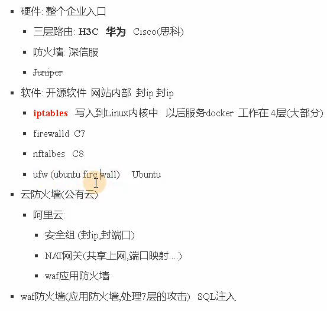 | 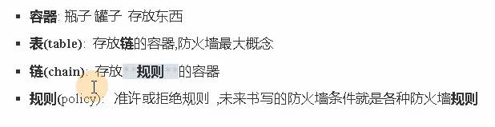 |
| ---------------------------------------------------------- | ------------------------------------------------------------ |

### iptables执行过程

拒绝规则要放在最上面，因为规则是从上往下匹配

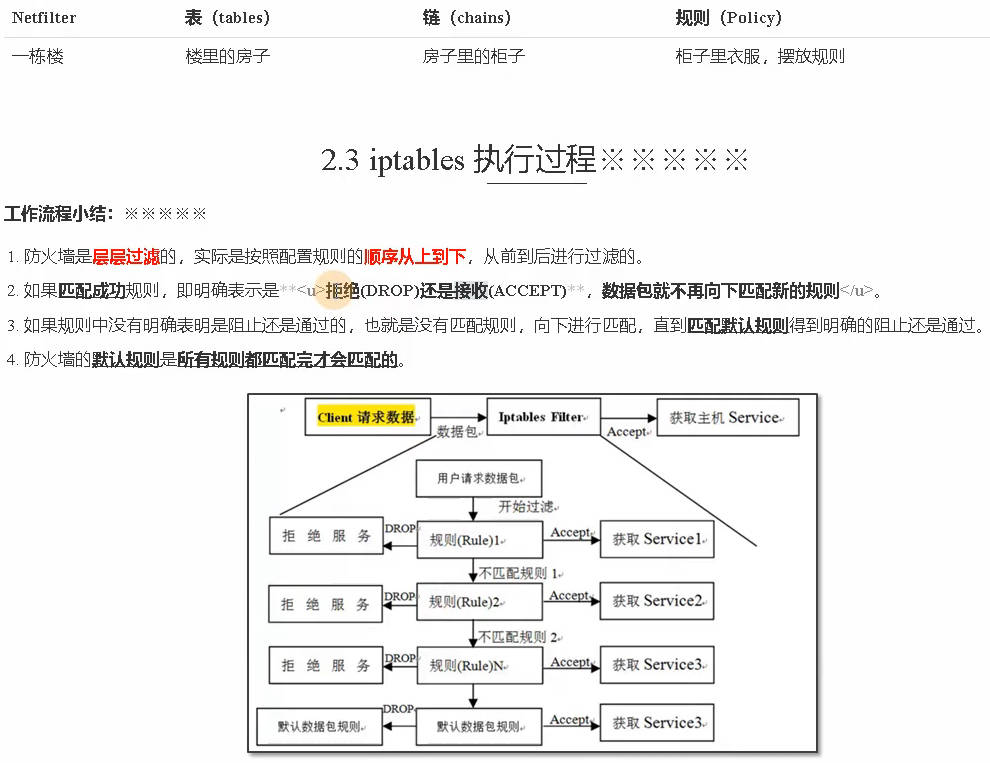

### 4表5链

表用来放链，链放规则

- 4表：filter、nat、raw、mangle
- 5链(chain)： INPUT进、 OUTPUT出、 FORWARD路过、 PREROUTING(...之前)、 POSTROUTING(...之后)

#### filter表规则

屏蔽端口和ip, 有3个链

| 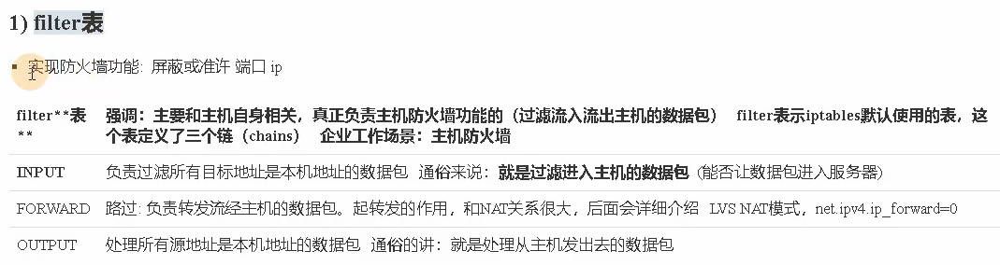 |  |
| ---------------------------------------------------------- | ----- |

#### nat表

- 实现共享上网
- 端口映射和ip映射

4表5链处理流程

| 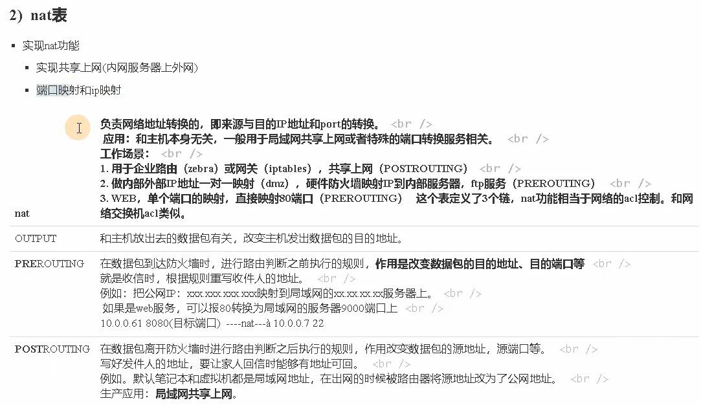 | 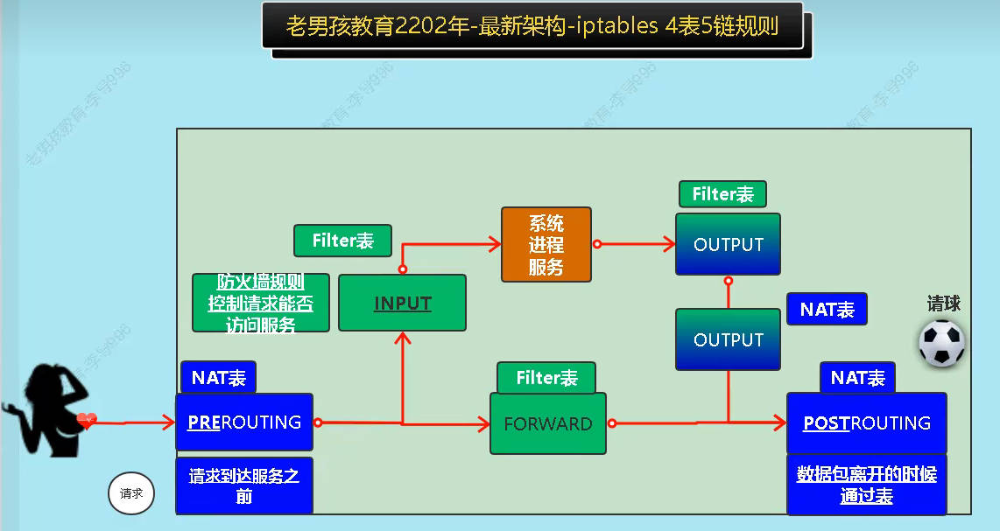 |
| ---------------------------------------------------------- | ------------------------------------------------------------ |

#### 安全组

### 命令

```sh
yum install iptables-services
rpm -ql iptables-services
# /etc/sysconfig/iptables			# 默认规则

# 开机加载防火墙模块

# 查看
lsmod |grep "filter|nat|ipt"

iptables -nL --line-number			# 查看当前规则
iptables -nL  -t nat				# 查看nat表规则
```


| 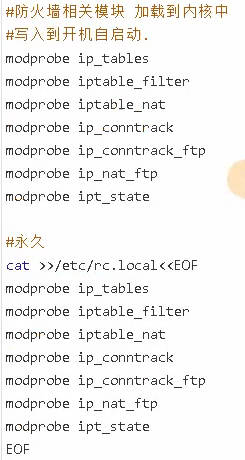 | 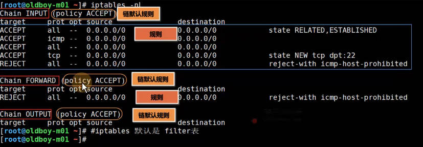 |
| ------------------------------------------------------------ | ---------------------------------------------------------- |
| 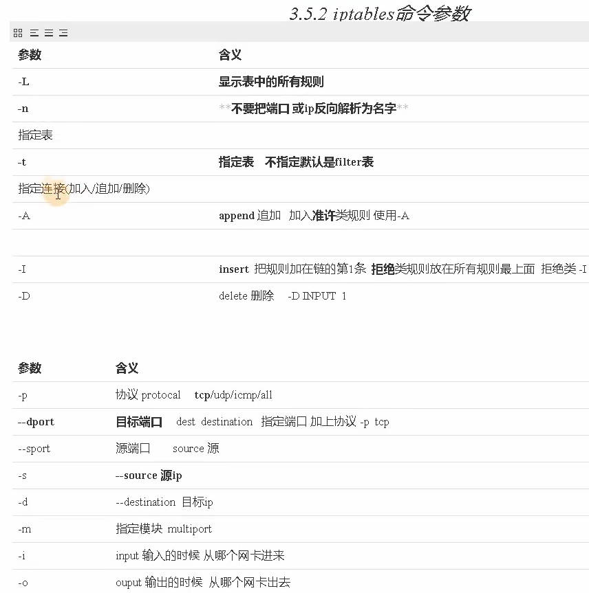   | 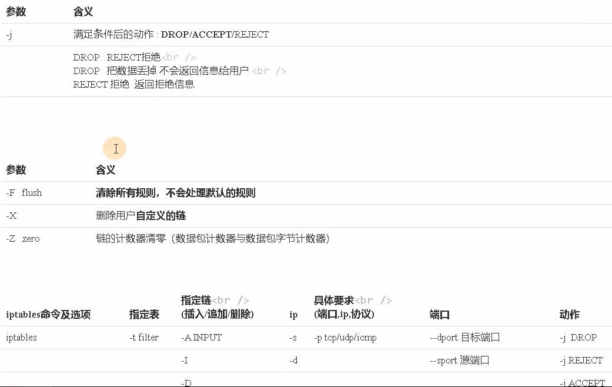 |

#### 配置filter表规则

##### **封端口**

```sh
iptables -F -X -Z				# 清空

# 涉及到端口，要指定协议 -p tcp, 目标端口，很少管源端口;  
# 拒绝访问22端口： 表、链、协议、端口、拒绝
# REJECT也是拒绝，返回拒绝信息,DROP不返回拒绝信息
iptables -t filter -I INPUT -p tcp --dport 22 -j DROP	
# 删除规则
iptables -t filter -D INPUT 1	# 删第1条规则
```

##### **封ip**

```sh
# 封ip不用加协议
iptables -t filter -I INPUT -s 10.0.0.8 -j DROP
iptables -t filter -I INPUT -s 10.0.1.0/24 -j DROP

# 禁止网段访问8888端口
iptables  -I INPUT -s 10.0.1.0/24 -p tcp --dport 8888 -j DROP

# 只允许指定网段访问（白名单）： 用 ! 进行排除
iptables -I INPUT ! -s 172.16.1.0/24 -j DROP	# 允许172.16.1.0/24网段

# 多个端口  
iptables -A INPUT -m multiport  -p tcp --dport 80,443 -j ACCEPT
iptables -I INPUT  -p tcp --dport 1:1024 -j DROP	# 1到1024都拒绝

# 禁止ping
iptables -I INPUT -p icmp --icmp-type 8  -j DROP
# 通过内核参数禁止ping
cat /etc/sysctl.conf
# /proc/sys/net/ipv4/icmp_echo_ignore_all 永久生效
net.ipv4.icmp_echo_ignore_all = 1
net.ipv4.ip_forward = 1		# 内核转发
sysctl -p	# 配置生效
```

##### **匹配网络状态**

==防火墙控制连接状态==等： 三次握手中的状态，运行用户建立连接等

```
iptables -A INPUT -m state --state ESTABLISHED,RELATED -j ACCEPT
iptables -A OUTPUT -m state --state ESTABLISHED,RELATED -j ACCEPT
```

##### **限速并发**

```
-m limit --limit 10/minute			# 每分钟只能有10个数据包 每6秒生成一个包, 60/10
iptables -I INPUT -p icmp -m limit --limit 10/minute --limit-burst 5 -j ACCEPT	# 每分钟10，并发5
iptables -I INPUT -p tcp --dport 22 -j ACCEPT
iptables -P INPUT DROP				# 修改默认规则为DROP，默认规则放最后
```


| 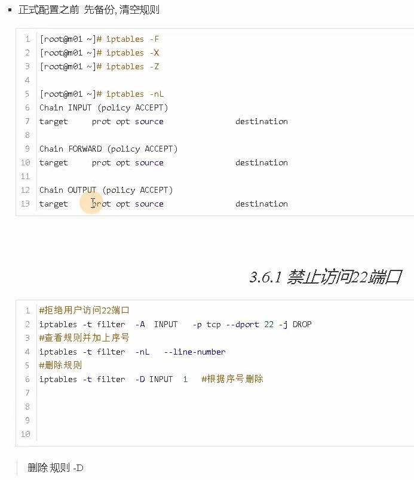 | 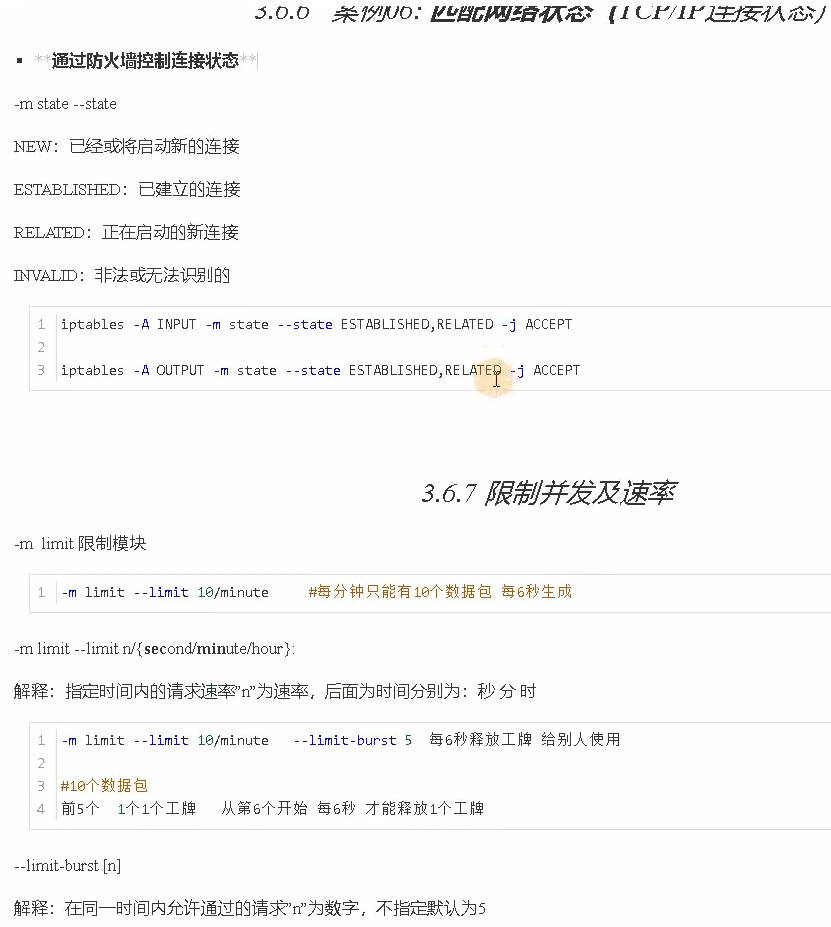 |
| ---------------------------------------------------------- | ---------------------------------------------------------- |

#### 规则的保存与恢复

```sh
iptables-save >/etc/sysconfig/iptables
iptables-restore </etc/sysconfig/iptables
iptables -nL
systemctl cat iptables
```

#### 实际生产用法

默认规则改为DROP，用白名单模式; 需要配置的有

- ssh可以进来 `iptables  -A INPUT  -p tcp --dport 22 -j ACCEPT	`
- 服务
- 连接状态
- 数据包进出
- 转发等
- 修改默认规则：拒绝

```sh
# 改IO网卡（回环网卡）: 防火墙不要限制,允许本机回环io接口数据流量，流入流出
iptables -A INPUT -i lo -j ACCEPT
iptables -A INPUT -o lo -j ACCEPT

# 80,443
iptables -A INPUT -m multiport  -p tcp --dport 80,443 -j ACCEPT

iptables -A INPUT -s 10.0.0.0/24  -j ACCEPT		# 放行内网网段
iptables -A INPUT -s 172.16.1.0/24  -j ACCEPT	# 放行vpn网段

iptables -A OUPUT -m state --state  ESTABLISHED,RELATED -j ACCEPT	# 放行tcp连接状态

iptables -P INPUT DROP			# 改默认规则
```


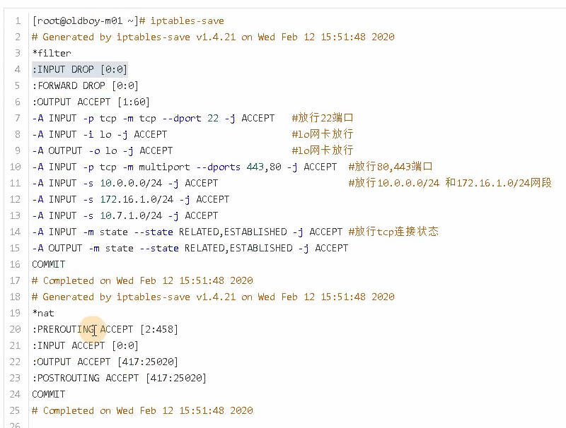

#### NAT

##### 共享上网

**内网访问外网**： 共享上网流程

- 防火墙
  - 配置防火墙SNAT规则	
    - `iptables -t nat -A POSTROUTING -s 172.16.1.0/24 -j SNAT --to-source 10.0.0.61  只要源ip是172.16.1.0网段的，防火墙就把它伪装为防火墙ip10.0.0.61`  ==出去时候改==
  - 开启内核转发功能: `net.ipv4.ip_forward = 1		# 内核转发`   `cat /etc/sysctl.conf`
- 客户端
  - 客户端网关指向防火墙：172.16.1.61;  `/etc/sysconfig/network-scripts/ifcfg-eth0`  `GATEWAY=172.16.1.61`


| 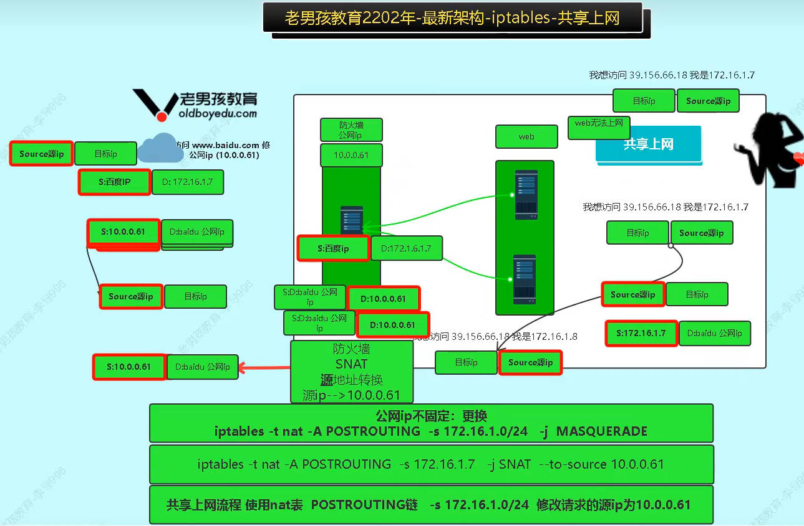 | 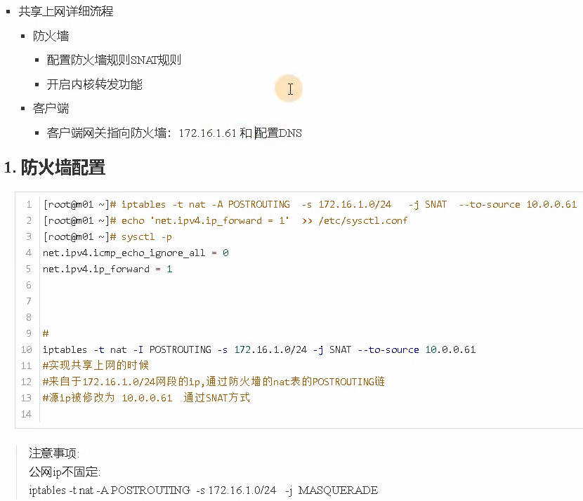 |
| ---------------------------------------------------------- | ---------------------------------------------------------- |

##### 端口映射

只要用户访问防火墙的9000端口， 请求就转发到172.16.1.7的80端口； ==进来时候改==

| 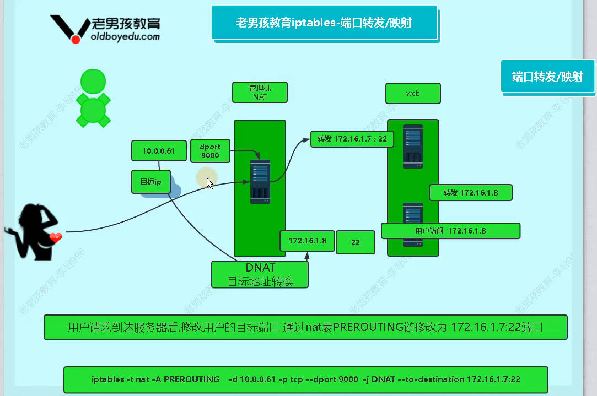 |  |
| ---------------------------------------------------------- | ----- |

##### ip映射

很少用

## SELinux

[Linux防火墙技术汇总](https://www.bilibili.com/video/BV1ru411r7Ff/?spm_id_from=333.337.search-card.all.click&vd_source=7346303e5e18677d7261c2c0c109ecfd) 

```sh
# 所有节点关闭 SELinux
setenforce 0
sed -i --follow-symlinks 's/SELINUX=enforcing/SELINUX=disabled/g' /etc/sysconfig/selinux
```


## firewalld

[企业级防火墙应用Firewalld](https://www.bilibili.com/video/BV1N34y157qn/?spm_id_from=333.337.search-card.all.click&vd_source=7346303e5e18677d7261c2c0c109ecfd)   [Firewalld](https://www.bilibili.com/video/BV1pv411N7TK/?spm_id_from=333.337.search-card.all.click&vd_source=7346303e5e18677d7261c2c0c109ecfd)  [Firewalld](https://www.bilibili.com/video/BV17v411P7id/?spm_id_from=333.337.search-card.all.click&vd_source=7346303e5e18677d7261c2c0c109ecfd)  [firewalld](https://www.bilibili.com/video/BV1r34y1y787/?spm_id_from=333.337.search-card.all.click&vd_source=7346303e5e18677d7261c2c0c109ecfd) 

## ufw

[UFW防火墙](https://www.bilibili.com/video/BV1sQ4y1R7UB/?spm_id_from=333.337.search-card.all.click&vd_source=7346303e5e18677d7261c2c0c109ecfd)  [ufw防火墙状态查询、启动、关闭 ](https://blog.csdn.net/qq_45596908/article/details/137731322) 

```
ufw status
ufw enable
ufw disable
```


## nftables

[nftables用法介绍](https://cloud.tencent.com/developer/article/2385128)   [nftables](https://www.baidu.com/s?ie=UTF-8&wd=nftables)  