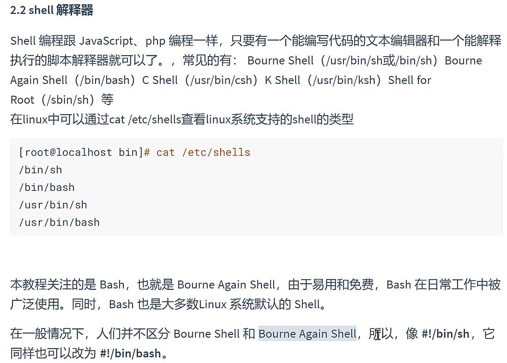
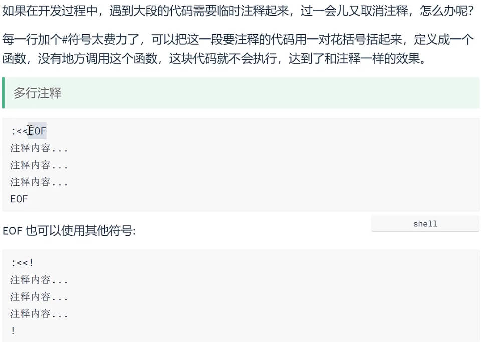
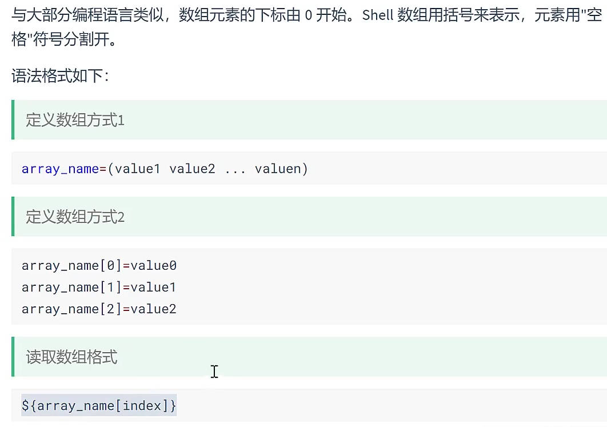
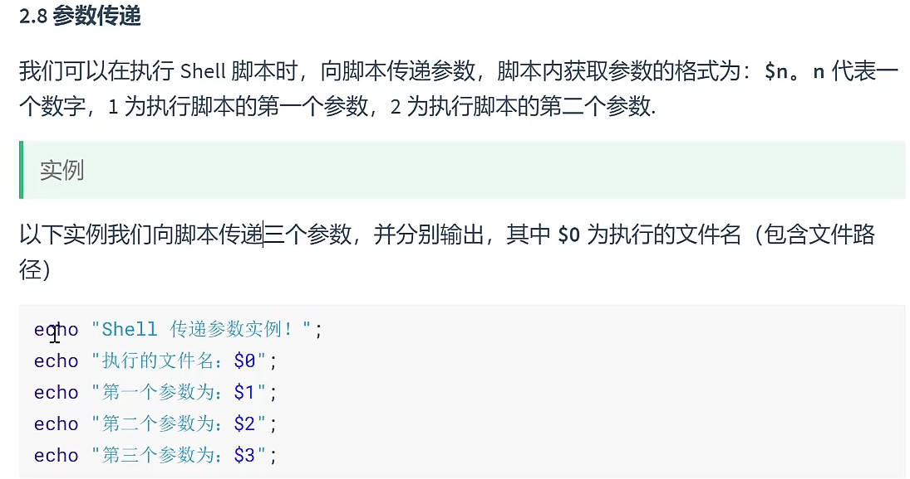
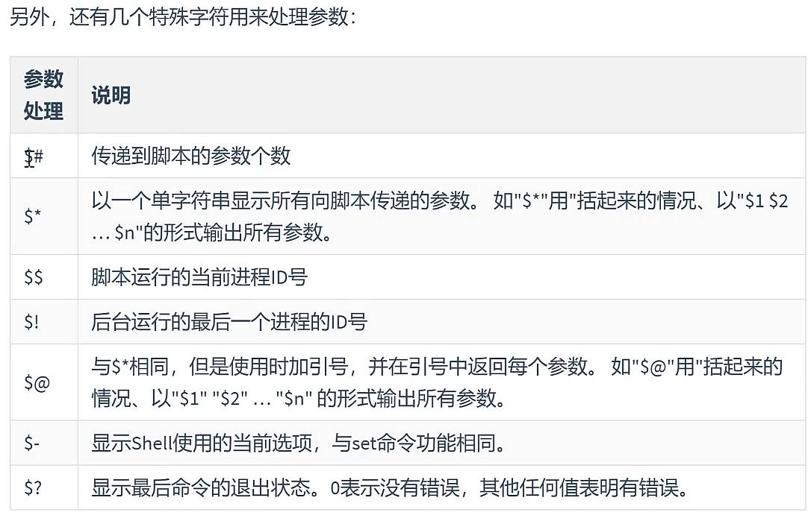
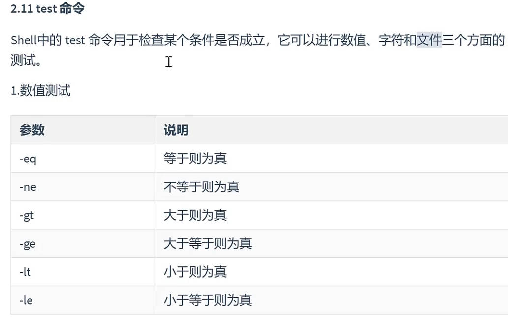
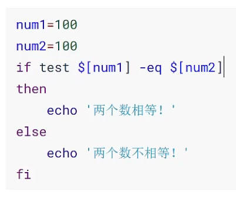
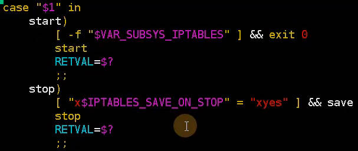
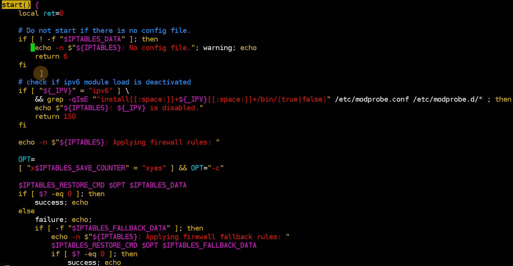

## 入门

视频： [本篇视频_shell脚本](https://www.bilibili.com/video/BV1bi421X7T4?p=121&vd_source=7346303e5e18677d7261c2c0c109ecfd)  [shell](https://www.bilibili.com/video/BV1XB4y1P7Sh/?p=95&vd_source=7346303e5e18677d7261c2c0c109ecfd)  [shell_Max极客菌](https://www.bilibili.com/video/BV1yT421S7YS?p=55&spm_id_from=pageDriver&vd_source=7346303e5e18677d7261c2c0c109ecfd) 

[语句的结束](https://www.cnblogs.com/chanshuyi/p/quick_start_of_shell_05_sentence_end_syntax.html)  

shell语句结尾没有特定的标记

### shell简介

- 



### ==变量==

- 变量定义：shell中定义变量，变量名不加美元符号$
- 使用变量：变量名前加$,变量名加花括号可选，帮解释器识别变量边界 `${name}`
  - 使用语句给变量赋值 `for item in $(ls /etc)`
  - 字符串用单引号: 单引号里的原样输出，里面的变量shell不解释  
- 只读变量 `readonly  name` 
- 删除变量 `unset name`

==状态变量==

| 符号 | 含义                           | 应用                                                   |
| :--- | :----------------------------- | :----------------------------------------------------- |
| $?   | 上一条命令/脚本的返回值，0正常 | 判断命令的执行是否成功, 例，ls;  `echo $?`             |
| $$   | 当前运行脚本的pid              | 脚本运行时将pid记录到文件，方便kill;  服务管理脚本使用 |
| $!   | 上一个运行脚本的pid            |                                                        |
| $_   | 上一个命令或脚本的最后一个参数 | 类似于按ESC + .                                        |

```sh
# $$  将输入重定向到一个交互式 Shell 脚本或程序
cat >> test.sh<<EOF
#!/bin/bash
echo $$ 
sleep 999
EOF
# ps -ef |grep test.sh   用另一个会话查看pid
# $$应用: 脚本运行时生成pid文件，方便以后kill	echo $$ >/test.pid
```

作业： 

```sh
ping -c3 -W0.5 www.163.com			# timeout超时 只等0.5s；  每次ping有间隔时间interval: -i 0.1

# ping网站通不通
cat >test.sh <<EOF 
#!/bin/bash
url=$1
ping -c3 -W1 -i0.1 $url  >/dev/null 2>&1
if [ $? -eq 0 ];then
        echo "$url is ok"
else
        echo "$url is failed"
fi
EOF
sh test.sh  www.baidu.com		
```


### 字符串

[字符串截取-八种方法](https://www.runoob.com/linux/linux-shell-variable.html)  [expr命令](https://www.runoob.com/linux/linux-comm-expr.html)  [字符串替换](https://www.runoob.com/linux/linux-shell-array.html) 

- 获取字符串长度
- 字符串截取
- 求下标: 查找字符出现的位置
- 拼接字符串： 用单引号或双引号拼接
- 字符串替换
- 字符串转数组

```sh
${#string}						# 1. 获取字符串长度

string="runoob is a great site"	# 2. 字符串截取， 八种方法
echo ${string#*i}		# 从左边开始删除。一个 # 表示从左边删除到第一个指定的字符
echo ${string##i*}		# 两个 # 表示从左边删除到最后一个指定的字符
echo ${string%i*}		# %、%% 表示从右边开始删除
echo ${string%%i*}

echo ${string:1:4} 		# 从左边第2个字符开始（0开始），截取4个字符， 输出 unoo
echo ${string:0-3:3}	# 从右边第3个字符开始，及字符的个数

# 3.查找子字符串
echo `expr index "$string" io`	# 找出 i 或 o 的下标，哪个先出现算哪个

# 4.字符串替换
string="text, dummy, text, dummy"
echo ${string/text/TEXT}	# 首个 pattern 的替换,  TEXT, dummy, text, dummy
echo ${string//text/TEXT}	# 全部 pattern 的替换	
```

### 注释



### ==数组==


[什么是关联数组](https://help.aliyun.com/zh/polardb/polardb-for-oracle/associative-arrays) 

- 定义数组：==数组用括号，元素用空格隔开==
- 读取数组： `${arr[index]}` 
- 关联数组
- 获取数组所有元素：不用遍历，`${arr[*]}`  ,用@或*
- 获取数组长度: 与获取字符串长度一样 `${#array[@]}` ，用@或*

|  |      |
| -------------------------------------------------------- | ---- |

### shell参数传递

[`$* 与 $@ 区别`](https://www.runoob.com/linux/linux-shell-passing-arguments.html)  

|  |  |
| -------------------------------------------------------- | -------------------------------------------------------- |

### 运算符

[运算符笔记](https://www.runoob.com/linux/linux-shell-basic-operators.html) [双中括号笔记](https://www.runoob.com/linux/linux-shell-process-control.html)   [双括号内部两端要有空格](https://www.runoob.com/linux/linux-shell-test.html) [条件测试](https://www.runoob.com/linux/linux-shell-passing-arguments.html) [Shell中的中括号用法总结](https://www.runoob.com/w3cnote/shell-summary-brackets.html)  

> 1. ==中括号==（包括==单中括号与双中括号==）可用于一些条件的测试  
> 2. ==数组用括号，元素用空格隔开== 
> 3. 使用变量: ==变量名加花括号==  
> 4. **[ ] 表达式** : 需要加转义符,  表示字符串大小比较，以 acill 码位置作为比较,  不直接支持 >, < 运算符，逻辑运算符 || 、&& 
>    1. **[** 会把大于号、小于号识别为重定向符号
>    2. **[** 不能识别 **$var** 变量值， 要加双引号 `[ "$var" = '' ]`
>    3. **[ ]** 内部两端要有空格
>    4. [] 可以使用 test 命令来代替
> 5. **[[ ]] 表达式** : 是 [] 运算符的扩充, 不需要转义符，还是以字符串比较大小。里面支持逻辑运算符：**|| &&** ，不再使用 **-a -o** 
>    1. **[[** 是 bash shell 环境自己实现的判断方式，比 **[** 更安全，
>    2. 在其他 shell 环境不能兼容，所以 [ 有更好的可移植性

- 算数运算符:  表达式和运算符之间要有空格，例如 2 + 2
  - 乘号(*)前边必须加反斜杠`\`，  `expr $a \* $b`
  - 条件表达式要放在方括号之间，并且要有空格，例如:  `[ $a == $b ]`
- 关系运算符： `[ $a -eq $b ]`  只支持数字，不支持字符串
  - `not equal（ne），大于greater than(gt), 小于less than(lt), 大于等于greater than or equal(ge), 小于等于le `
- 布尔运算符： `-a与, -o或, !非` 例： `[ $a -lt 20 -a $b -gt 100 ] `
- 逻辑运算符: `&& ,||` 例:`[[ $a -lt 100 && $b -gt 100 ]] `
  - ==cmd1 && cmd2== 命令1执行成功后，命令2才执行
  - ==cmd1 || cmd2== 命令1执行失败后，命令2才执行
- 字符串运算符
  - `[ -z $a ] `字符串长度为0返回 true;  `[ -n "$a" ] 长度不为0返回 true` ； `[ $a ]` 字符串不为空返回 true 
- 文件测试运算符： `[ -d $file ]`  检测文件的各种属性

```sh
# 数值比较时，可以使用 [ exp1 -gt exp2 ]， 也可以使用 ((exp1 > exp2)), 双括号能直接用 >、<、>=、<=、==、!=
# >、<、==、!= 也可以进行字符串比较
# 字符串比较时，== 可以使用 = 替代
# == 和 !=进行字符串比较时，可以使用 [ string1 OP string2 ] 或者 [[ string1 OP string2 ]] 的形式
#  > 和 < 字符串比较时，用[[ str1 OP str2 ]] 或者 [ str1 \OP str2 ]。用 [] 时，> 和 < 需要使用反斜线转义

# 推荐用 $() 代替 ``
val=`expr 10 + 20`
val=$(expr 10 + 20)

# Shell相加目前发现有 4 种写法,  初学者推荐第一种写法，虽然看着复杂，但逻辑清晰，不易混淆
c=`expr ${a} + ${b}`
c=$[ `expr 10 + 20` ]
c=$[ 10 + 20 ]
c=$(($a+$b))
```

### test命令

[双中括号笔记](https://www.runoob.com/linux/linux-shell-process-control.html)  [Shell中避免使用单引号](https://www.runoob.com/linux/linux-shell-test.html) 

不用test，要加中括号  `[ $a -eq $b ]` ，  [] 可以使用 test 命令来代替

**[** 是一个命令，会自动检测右中括号 **]**，通过 **which [** 查看命令的位置，**test** 不会自动检测右中括号 **]** 

**[[** 是 bash shell 环境自己实现的判断方式，比 **[** 更安全

|  |  |
| -------------------------------------------------------- | -------------------------------------------------------- |

## 流程控制

### if

```sh
# 终端命令格式： if [ $(ps -ef | grep -c "ssh") -gt 1 ]; then echo "true"; fi
if condition1; then
	cmd1
	...
elif condition2;then
	cmd
else
	cmd	
fi
```

### for

遍历字符串

```sh
# 终端命令格式：for var in item1 item2 ... itemN; do command1; command2… done;
for variable in (list); do
	cmd
	...
done
# 其它
for((assignment;condition:next));do
    command_1;
    command_2;
    commond_..;
done;
```

例子

```sh
for i in {1..100..2};do echo $i done;	# 步长2
for file in `ls /`;do echo $file done

for((i=1;i<=5;i++));do		# 双括号中变量调用不需要加 $
    echo "这是第 $i 次调用";
done;
```


### ==while==

==条件为 true 时一直执行==

用于不断执行命令，也用于从输入文件中读取数据

```sh
while condition;do
	cmd
done

# 无限循环
while :
do
    command
done

while true
do
    command
done

for (( ; ; ))
```

### ==until==

执行命令直至==条件为 true 时停止==, 处理方式上与while相反

```sh
until condition
do
    command
done
```

### case ... esac

多分支结构，每个case分支用右圆括号开始，2个分号;;表示break，即执行结束

```sh
case 值 in
模式1)
    command1
    command2
    ...
    commandN
    ;;
模式2)
    command1
    command2
    ...
    commandN
    ;;
*)  echo '如果无一匹配，使用星号 * 捕获'
esac
```

### 跳出循环

有时候需要在未达到循环结束条件时==强制跳出循环==，用两个命令：**break** 和 **continue**

- break `跳出所有循环`（终止执行后面的所有循环）
- continue 不会跳出所有循环，仅仅`跳出当前循环`

## 函数

[shell-function](https://www.jianshu.com/p/24c5d25d5fd5)  [Shell函数](https://www.cnblogs.com/jackluo/p/3429968.html) 

**格式**

```sh
# 1. 标准写法
[ function ] funname [()]		# 中括号可选
{
    action;
    [return int;]		# return后跟数值0-255; 如果不加，将以最后一条命令运行结果，作为返回值
}

# 2. 省略()写法
function funname{...}
# 3. 省略function
funname(){...}

# 例
function demoFun(){
    echo "这是我的第一个 shell 函数!"
}
demoFun		# 调用函数
```

**函数参数**

==调用函数时传递参数(实参)==:  通过$n形式获取参数值  `fun aa bb 123`

**函数使用**

函数定义和执行，分开在不同的文件： set查看shell的变量；函数在文件定义后，控制台下用.或source包含，再set能查到定义的函数，再输入函数名执行函数。

**函数库**

[/lib/lsb/init-functions文件解析](https://blog.csdn.net/phmatthaus/article/details/130269639) 

## Shell文件包含

引入外部脚本

```sh
. filename   		# 点号(.)和文件名中间有一空格
或
source filename
```

## 分析脚本

**==$?==**  存储上一个命令的执行状态。当一个 shell [命令执行](https://so.csdn.net/so/search?q=命令执行&spm=1001.2101.3001.7020)完毕后，它会==返回一个状态值==，表示该命令执行的结果。**$?** 变量会自动保存该状态值，以便后续的脚本代码可以根据该状态值来判断命令是否执行成功。  [$?](https://blog.csdn.net/m0_61003348/article/details/129161576) 

[P8_16min处](https://www.bilibili.com/video/BV1xT421Q754/?p=8&spm_id_from=pageDriver&vd_source=7346303e5e18677d7261c2c0c109ecfd) 

- 抓重点看： 例下面case：判断不管，$?返回值不管(上个命令的结果)，看start函数
  - start函数：变量，判断看关键字，看判断的什么：例检查ipv6的、比较参数的，不重要的判断不管

|  |  |
| ------------------------------------------------------------ | ------------------------------------------------------------ |


## shell实例

[好：rsync专业脚本开发](https://www.bilibili.com/video/BV1yT421S7YS?p=48&vd_source=7346303e5e18677d7261c2c0c109ecfd)  [rsync专业脚本开发笔记](https://blog.csdn.net/yisuoyanyv/article/details/128123372) 

[Rsync服务启停](https://www.cnblogs.com/xjianbing/p/17754083.html)   [shell脚本](https://www.cnblogs.com/huahuadebk/p/17423246.html)  

```sh
#!/bin/bash
# /etc/init.d/my_rsync.sh

# 结果的美化日志
###############
lsb_functions="/lib/lsb/init-functions"
if test -f $lsb_functions ; then
  . $lsb_functions
else
  # Include non-LSB RedHat init functions to make systemctl redirect work
  init_functions="/etc/init.d/functions"
  if test -f $init_functions ; then
    . $init_functions
  fi
  log_success_msg()
  {
      echo " SUCCESS!  $@"
  }
  log_failure_msg()
  {
      echo " ERROR! $@"
  }
fi  
####################

# 开发rsync脚本
function usage(){
    echo "Usage: $0 {start|stop|restart}"
    exit 1
}


# 开发start功能
function start(){
    /usr/bin/rsync --daemon		# 启动rsync后台运行
    sleep 1
    if [ `netstat -tunlp|grep rsync|wc -l` -ge "1" ]
      then
        log_success_msg "rsyncd is started!"
    else
        log_failure_msg "rsync isn't started!"
    fi    
}

function stop(){
    killall rsync &>/dev/null
    sleep
    if [ `netstat -tunlp|grep rsync|wc -l` -eq 0 ]
      then
        log_success_msg "rsyncd is stopped!"
    else 
      log_failure_msg "rsyncd isn't stopped!"
    fi
}

function restart(){
    echo ""
}

# 开发c语言风格的脚本，更专业，更美观，更容易维护
function main(){
    if [ "$#" -ne 1 ]
      then
         usage
    fi

    if [ "$1" = "start" ]
       then
          start
    elif [ "$1" = "stop" ]
        then
          stop    
    elif [ "$1" = "restart" ]
        then
            stop
            sleep 1
            start
    else
      usage
    fi
}

# 调用程序入口函数
main $*

# 运行脚本：  /etc/init.d/my_rsync.sh start
```

