## 安装

[nginx: download](https://nginx.org/en/download.html) 

[PGP SIGNATURE](https://www.baidu.com/s?ie=UTF-8&wd=PGP%20SIGNATURE) [消息认证、数字签名及PGP_信息安全数字签名校验](https://blog.csdn.net/qq_24428851/article/details/136354809) [ sig文件](https://zhuanlan.zhihu.com/p/481711649) 

[Mercurial版本控制](https://juejin.cn/post/6844903831508090888) [Mercurial](https://www.baidu.com/s?ie=utf-8&f=8&rsv_bp=1&tn=baidu&wd=Mercurial&rn=20&oq=Mercurial%2520repositories&rsv_pq=d6d7714f00418eae&rsv_t=b3edLuBW6o3RNjrnBcG5ZevcAqcWXaY%2FnE2zqydKEF8QlrC9hbA58MewjAo&rqlang=cn&rsv_enter=0&rsv_dl=tb&rsv_sug3=2&rsv_sug1=1&rsv_sug7=100&rsv_btype=t&inputT=1362&rsv_sug4=1975&rsv_sug=1) [mercurial仓库](https://blog.csdn.net/weixin_41728103/article/details/106799399) 

### 1、编译安装

[老男孩视频](https://www.bilibili.com/video/BV1qb421i7Ey?p=5&vd_source=7346303e5e18677d7261c2c0c109ecfd) 

[nginx 编译选项](https://www.cnblogs.com/timelesszhuang/p/4728784.html)  

[apt-get build-dep](https://www.cnblogs.com/lh03061238/p/16329333.html)  

- 下载
- 配置
  - `./configure --prefix=/app/nginx-1.27.0/ --user=nginx --group=nginx --with-http_ssl_module  --with-http_v3_module --with-http_stub_status_module`
- 编译
  - 安装编译环境： `apt build-dep nginx	`
  - `make && make install`	
- 后续配置
  - 创建用户
  - 创建软链接，用于不同nginx版本
  - 编译安装的不能用systemctl启动，用绝对路径启动
  - 检查端口与进程

```sh
plocate fzf
## 1. 编译安装
tar xf  nginx-1.27.0.tar.gz
apt build-dep nginx				# 安装编译环境
apt showsrc nginx				# 查看源码包

# ./configure --help
# 依赖要自己安装  pcre-devel, openssl-devel,
./configure --prefix=/app/nginx-1.27.0/ --user=nginx --group=nginx --with-http_ssl_module  --with-http_v3_module --with-http_stub_status_module

make |tee Makefile.log
make install |tee make_install.log

## 2. 后续配置
#创建用户
useradd -s /sbin/nologin -M nginx
#创建软链接，用于不同nginx版本
ln -s /app/nginx-1.27.0/  /app/nginx

## 3. 启动，编译安装的不能用systemctl启动，用绝对路径启动
/app/nginx/sbin/nginx -V		#查看版本及编译信息
/app/nginx/sbin/nginx			# 启动
pkill nginx						# 关闭，或kill pid	

ss -lntup | grep nginx			# 查端口
netstat -tnlp | grep nginx
ps aux |grep nginx				# 查进程和PID
```

### 2、二进制安装

- 下载，解压
- 后续配置
  - 创建软链接
  - 启动
    - tomcat用的启动脚本： `/app/tomcat/bin/startup.sh`
  - 检查端口与进程

## 配置

视频：[企业部署nginx](https://www.bilibili.com/video/BV1bi421X7T4?p=123) 

[老男孩教育-搭建中小规模集群-LNMP整合](https://haokan.baidu.com/v?pd=wisenatural&vid=16004985589361991251) 

[nginx 1.26](https://nginx.org/)  [nginx反向代理与负载均衡](https://blog.csdn.net/weixin_52270081/article/details/118297655)  

```sh
# 编译环境
yum install gcc-c++
# 安装第3方包
yum install -y pcre pcre-devel			# pcre解析正则
yum install -y zlib zlib-devel			# nginx使用zlib对http包进行操作
yum install -y openssl openssl-devel	# 安全套接字层密码库
```


| 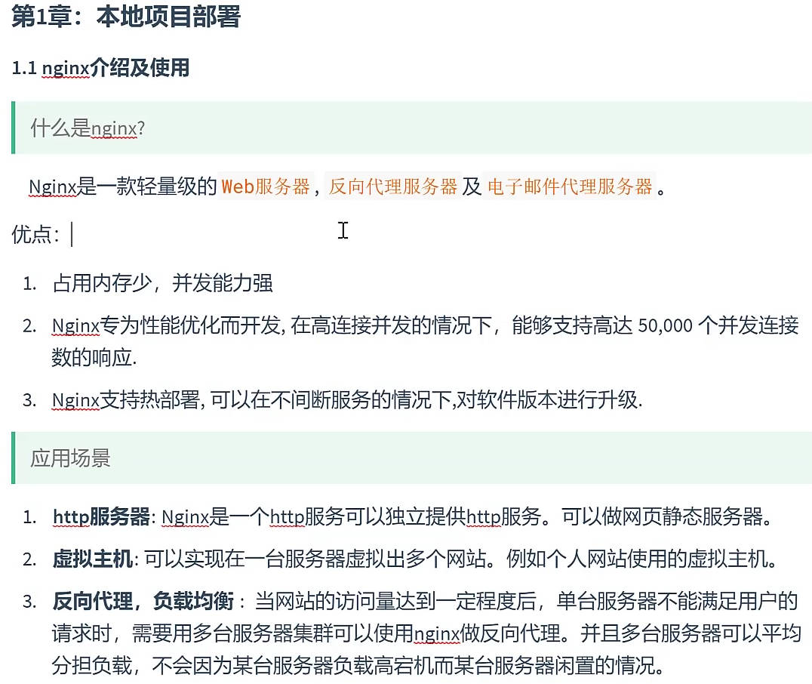 | 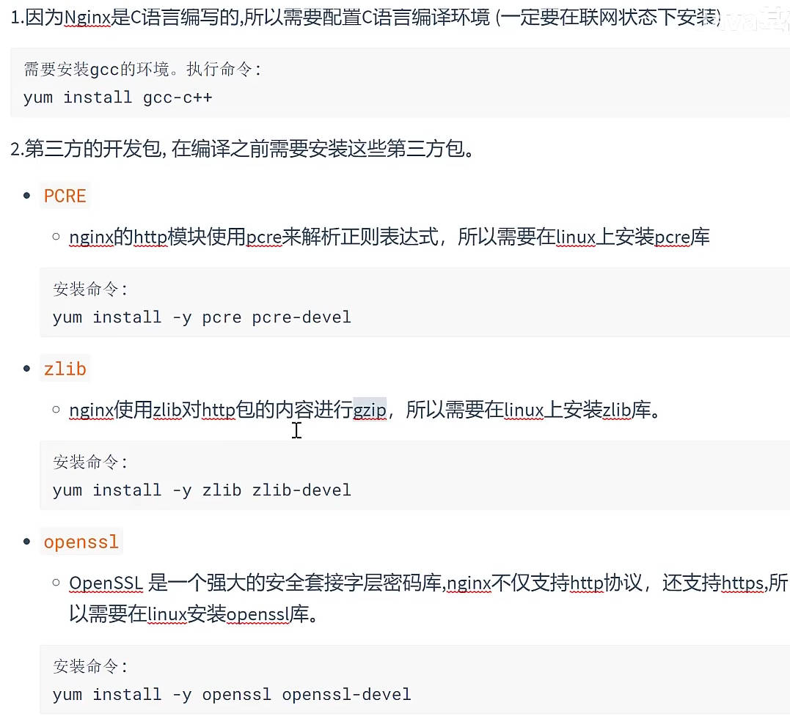 |
| ---------------------------------------------------- | ---------------------------------------------------- |
| 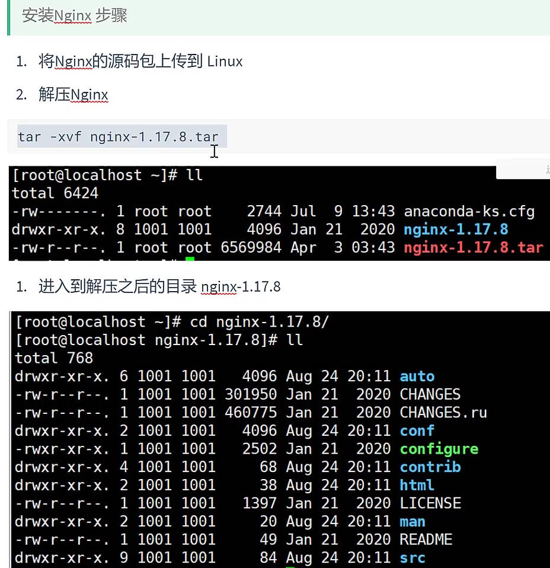 | 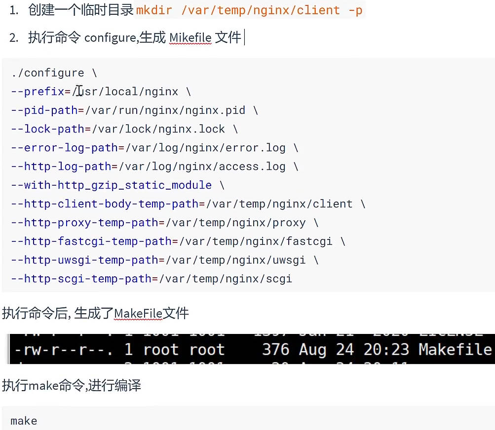 |

make install安装后，生成3个目录：sbin、html、conf； `./nginx -s reload重启`

nginx作用： 请求分发和负载配置

- 虚拟主机
- 反向代理
- 负载均衡

### 配置==虚拟主机==

`/usr/local/nginx/conf/nginx.conf`    notepad插件==NppFTP== 

在一台服务器中，利用nginx，配置多个网站；  ==一个server就是一个虚拟主机==

如何区分不同网站：==端口不同、域名不同==；  `cp -r html html8 复制目录`

**通过域名区分不同虚拟主机** 

- 没域名时，改hosts配置域名和ip映射关系，不走dns服务器

| 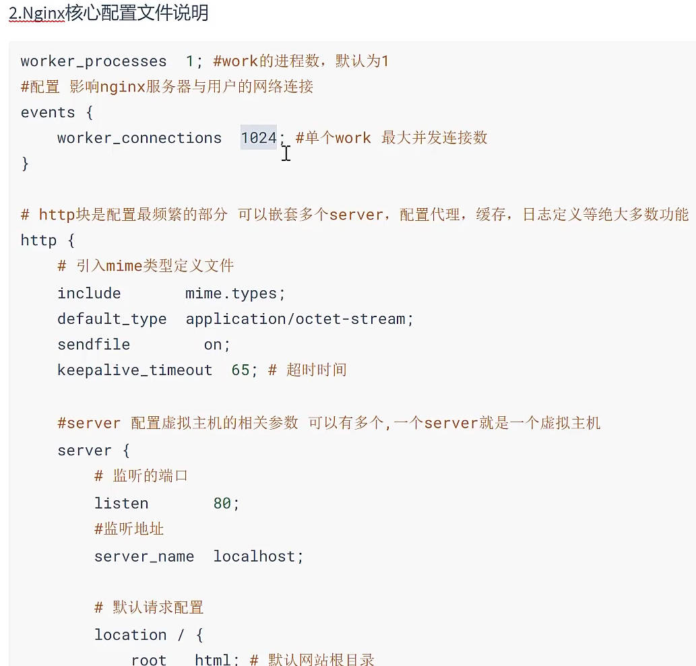         | 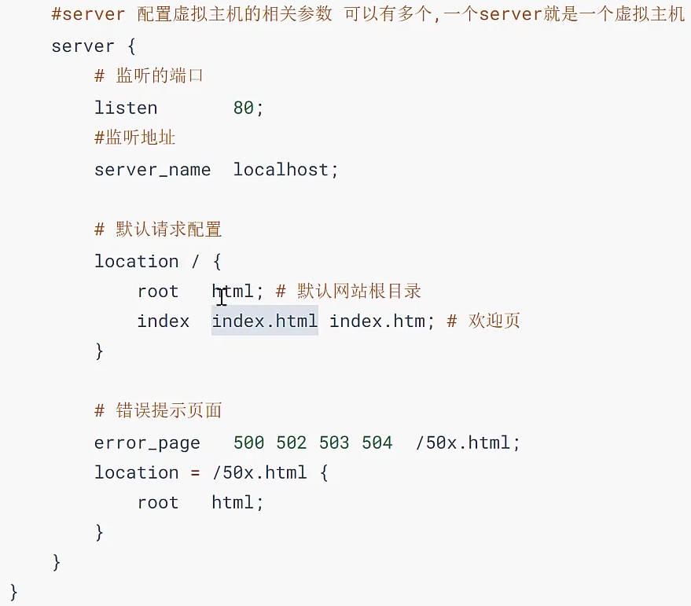 |
| ------------------------------------------------------------ | ---------------------------------------------------- |
| 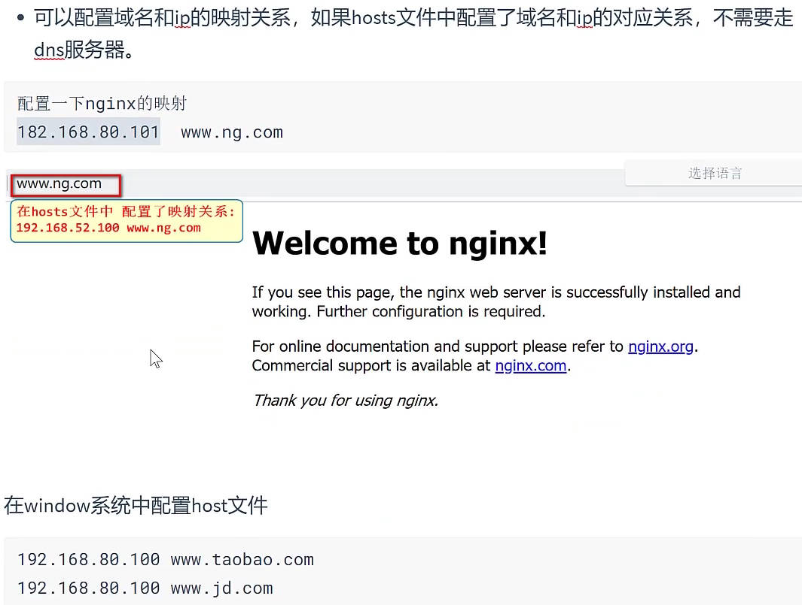 | 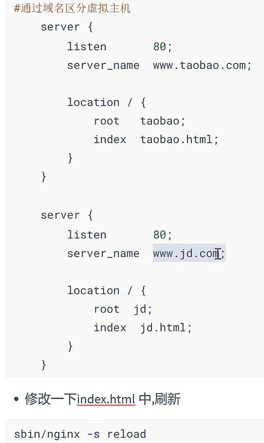 |

### nginx==代理==

[nginx代理配置](https://www.bilibili.com/video/BV1bi421X7T4?p=127&spm_id_from=pageDriver&vd_source=7346303e5e18677d7261c2c0c109ecfd) 

配置==upstream== ,upstream 和 server 搭配使用

- 请求：www.qianfeng1.com 
- 转发到代理： http://qianfeng1; location里配置proxy_pass
- 代理配置里有qianfeng1，真正的请求位置：192.168.80.100:8080

| 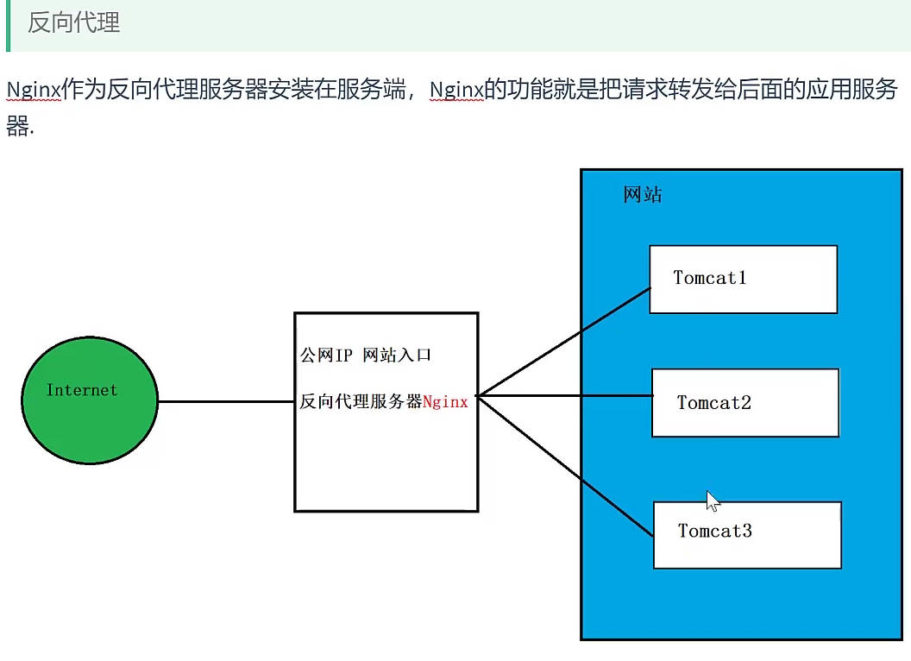 | 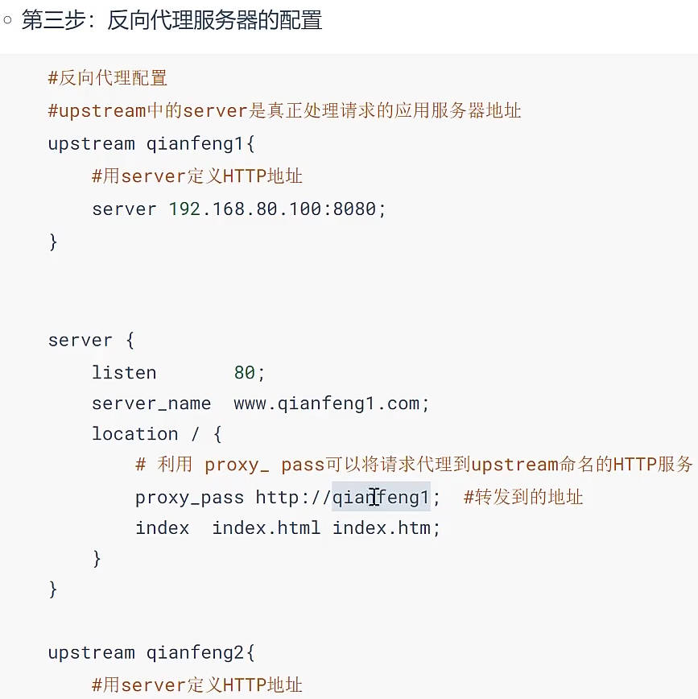 |
| ---------------------------------------------------- | ---------------------------------------------------- |

### ==负载均衡==

[nginx负载均衡的5种策略及原理](https://cloud.tencent.com/developer/article/2098291)  [nginx负载均衡原理](https://cloud.tencent.com/developer/article/2157094) 

网址对应的==服务器有多台==，找哪个去处理当前请求

- 轮询：先发给1，再发给2，再发给1，再发给2； `把多个服务器写到代理下面` ，服务器可配置权重

| 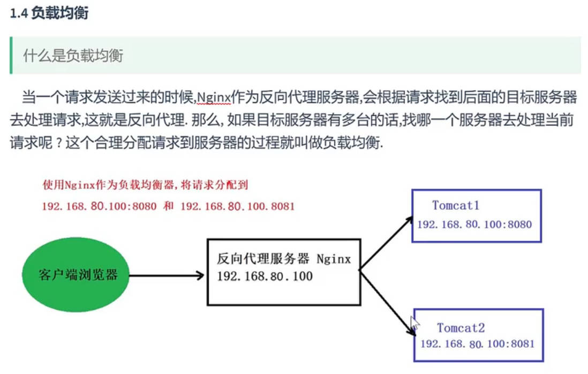 | 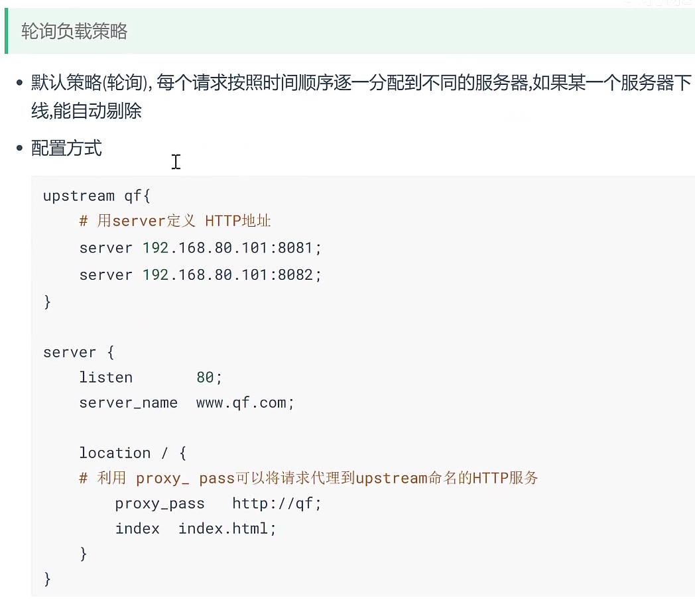 |
| ---------------------------------------------------- | ---------------------------------------------------- |
| 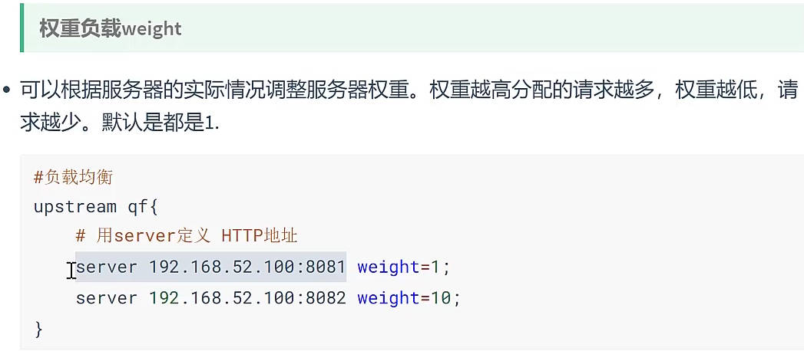 |                                                      |

### 部署项目到tomcat

IDEA中打包成war包，把war包拷贝到tomcat的webapps目录下， 访问：==ip/war包名字/index.html==; ==能用ip访问项目，然后配置nginx，用域名访问==

- 执行sql文件， 创建数据库和表； 然后连接数据库

### 使用nginx负载均衡

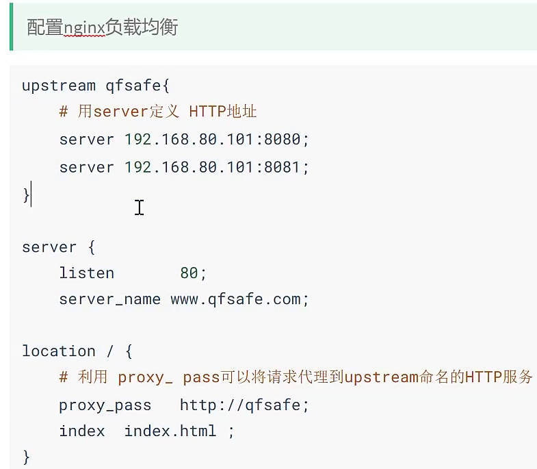

